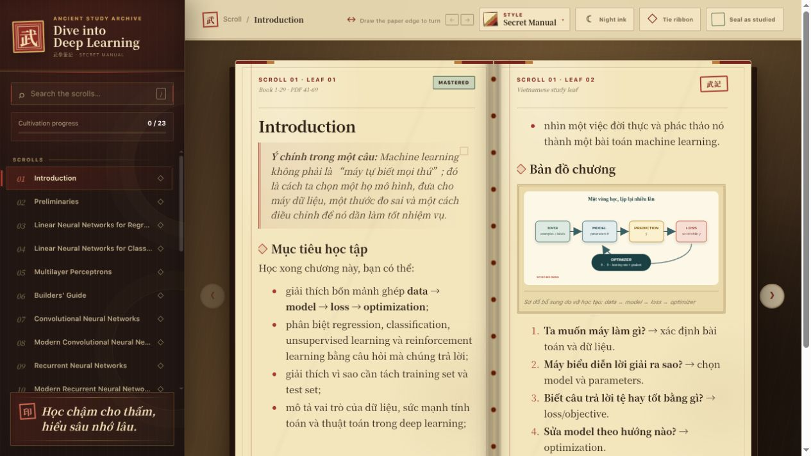
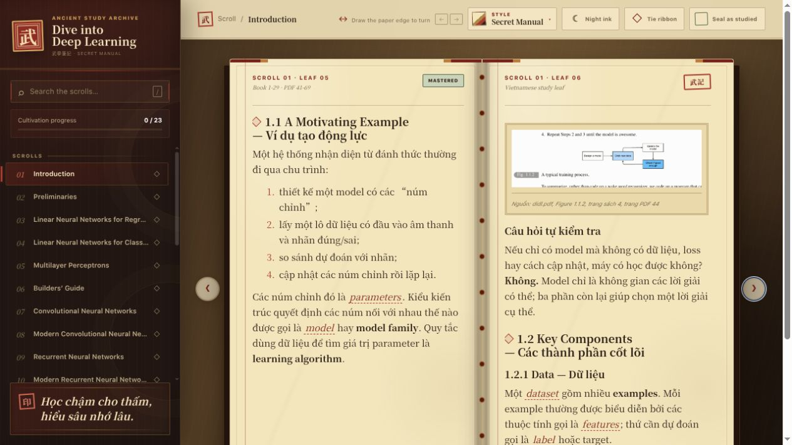
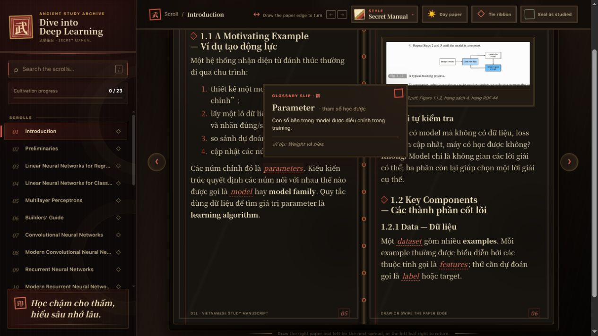

<div align="center">

<h1>Dive into Deep Learning — Vietnamese Study Notebook</h1>
<p><strong>Một quyển vở học Machine Learning và Deep Learning dành cho người mới, được biên soạn từ <em>Dive into Deep Learning</em>.</strong></p>
<p><code>Vietnamese-first</code> · <code>Markdown chapters</code> · <code>Python reader</code> · <code>Light / Dark</code> · <code>Page-turn interaction</code></p>
<p><strong>Học chậm cho thấm, hiểu sâu nhớ lâu.</strong></p>

</div>



## Dự án này là gì?

Tài liệu gốc `../didl.pdf` rất đầy đủ nhưng có thể khó tiếp cận khi bạn mới bắt đầu. Dự án này biến từng chương thành một file Markdown tiếng Việt có cấu trúc như vở học:

- giải thích trực giác trước khi đi vào công thức;
- giữ nguyên tên chương và mục bằng tiếng Anh để đối chiếu PDF;
- chỉ rõ tensor shapes, biến số và lỗi thường gặp;
- hệ thống bài tập theo hướng **gợi ý → lời giải → sanity check**;
- giữ những thuật ngữ tiếng Anh cần thiết và giải nghĩa khi rê chuột;
- trích hình trực tiếp từ PDF, kèm trang nguồn và hồ sơ provenance.

Đây không phải bản dịch từng câu máy móc. Mục tiêu là giúp người học trả lời được: **khái niệm này là gì, vì sao cần nó, nó hoạt động ra sao và dùng nó khi nào?**

## Giao diện đọc

<table>
  <tr>
    <td width="50%">
      
      <p align="center"><sub>Hai trang giấy, nội dung tiếng Việt và hình có nguồn.</sub></p>
    </td>
    <td width="50%">
      
      <p align="center"><sub>Night Ink và glossary tooltip ngay trong trang đọc.</sub></p>
    </td>
  </tr>
</table>

Reader mang phong cách bí kíp cổ trang Trung Hoa nhưng phần điều khiển vẫn dùng tiếng Anh rõ ràng:

| Trải nghiệm | Có gì bên trong |
|---|---|
| Đọc như sách | Hai trang trên desktop, một trang trên mobile, không cuộn dọc bên trong giấy |
| Lật trang | Kéo mép giấy, vuốt, dùng nút hoặc phím `←` / `→`; thấy trước nội dung trang sau |
| Cá nhân hóa | 6 reader styles, Light/Dark theme, ghi nhớ style và theme đã chọn |
| Học tiếp | Đánh dấu trang đang đọc, trở lại ribbon gần nhất và đánh dấu chương đã học |
| Nội dung kỹ thuật | MathJax, syntax highlighting Python, algorithm blocks và hình có thể phóng to |
| Thuật ngữ | Tooltip tiếng Việt hoạt động bằng hover, click hoặc keyboard focus |

## Tiến độ nội dung

| Trạng thái | Chương |
|---|---|
| **Đã biên soạn và kiểm tra** | 1–11, 14–18 và 21 |
| **Đang chờ biên soạn** | 12–13 và 19–20 |
| **Phụ lục đang chờ** | A — Mathematics for Deep Learning; B — Tools for Deep Learning |

Mục lục, filename, số chương và phạm vi trang luôn bám theo đúng edition của PDF trong workspace.

## Chạy nhanh

Yêu cầu: Python 3.10 trở lên. Môi trường ảo được đặt **cùng cấp** với thư mục dự án:

```text
deep-learning/
├── .venv/
├── didl.pdf
└── doc-dive-into-deep-learning/
```

Từ thư mục `deep-learning/`:

```bash
python3 -m venv .venv
./.venv/bin/python -m pip install -r doc-dive-into-deep-learning/requirements.txt
cd doc-dive-into-deep-learning
../.venv/bin/python app.py
```

Mở [http://127.0.0.1:8000](http://127.0.0.1:8000). Đổi cổng khi cần:

```bash
../.venv/bin/python app.py --port 8080
```

<details>
<summary><strong>Kích hoạt môi trường ảo theo cách truyền thống</strong></summary>

Linux/macOS:

```bash
source ../.venv/bin/activate
python app.py
```

Windows PowerShell:

```powershell
..\.venv\Scripts\Activate.ps1
python app.py
```

</details>

## Cấu trúc dự án

```text
doc-dive-into-deep-learning/
├── app.py                    # HTTP server và Markdown renderer
├── content/
│   ├── book_index.yaml       # Mục lục chuẩn theo PDF
│   ├── glossary.json         # Dữ liệu tooltip thuật ngữ
│   ├── chapters/             # Mỗi chương là một file Markdown
│   ├── appendices/           # Phụ lục
│   └── assets/               # Hình sách và provenance sidecars
├── docs/screenshots/         # Ảnh giao diện dùng trong README
├── static/                   # HTML, CSS và JavaScript của reader
├── tests/                    # Kiểm tra nội dung và giao diện
└── tools/                    # Công cụ trích hình từ PDF
```

## Kiểm tra dự án

```bash
../.venv/bin/python app.py --check
../.venv/bin/python -m unittest discover -s tests -v
node --check static/app.js
```

`app.py --check` kiểm tra metadata, filename, phạm vi trang, thứ tự chương, ảnh nguồn và toàn bộ khóa glossary được dùng trong Markdown.

## Quy ước biên soạn

- Một chương nằm tại `content/chapters/NN - Exact Chapter Title.md`.
- Tên file và tiêu đề mục giữ nguyên tiếng Anh như PDF; phần giảng giải dùng tiếng Việt.
- Thuật ngữ tương tác viết dưới dạng `{{term:tensor|Tensor}}` và được định nghĩa trong `content/glossary.json`.
- `<!-- pagebreak -->` chia các cụm bài học; reader tiếp tục tự dàn nội dung dài sang tờ tiếp theo.
- Hình sách nằm trong `content/assets/chapter-NN/` và có file `.source.json` đi kèm.
- Sơ đồ bổ sung nằm trong thư mục `generated/` và phải được ghi rõ là hình do vở học tạo.
- Chỉ đặt `status: reviewed` sau khi đối chiếu PDF, chạy kiểm tra và QA giao diện desktop/mobile.

Xem [AGENT.md](AGENT.md) để biết đầy đủ tiêu chuẩn dịch, giải thích, code, bài tập, hình ảnh và kiểm tra chất lượng.

<details>
<summary><strong>Trích một hình chính xác từ PDF</strong></summary>

Vùng crop dùng phần trăm của **trang PDF vật lý**:

```bash
../.venv/bin/python tools/extract_pdf_figure.py \
  --pdf ../didl.pdf \
  --pdf-page 281 \
  --book-page 241 \
  --crop 34,8,34,6.8 \
  --figure-id "Figure 7.2.1" \
  --caption "Two-dimensional cross-correlation operation" \
  --output content/assets/chapter-07/figure-7-2-1-cross-correlation.png
```

Công cụ tạo PNG và `.source.json` chứa checksum PDF, số trang, DPI và vùng crop để hình luôn truy xuất được nguồn.

Công cụ trên cần Poppler (`pdftoppm`). Nếu máy bạn không có Poppler, dùng bản thay thế có **cùng CLI và cùng định dạng `.source.json`**:

```bash
../.venv/bin/python tools/extract_pdf_figure_nopoppler.py \
  --pdf-page 784 --book-page 744 --crop 17,47,73,17 \
  --figure-id "Figure 16.1" \
  --output content/assets/chapter-16/figure-16-1-nlp-application-map.png
```

Bản này tách trang cần dùng thành một PDF một trang đã phóng tỉ lệ (bằng `tools/pdf_page.py` và `tools/pdf_reader.py`, thuần Python) rồi render bằng `sips` của macOS.

`tools/pdf_reader.py` còn chạy độc lập để **đọc văn bản** của một khoảng trang, tiện khi đối chiếu bản dịch với PDF:

```bash
../.venv/bin/python tools/pdf_reader.py ../didl.pdf 784 820
```

</details>

## Ghi chú về code học tập

Reader không cần PyTorch để mở. Các ví dụ thực hành có thể cần PyTorch; hãy cài phiên bản phù hợp với hệ điều hành và CUDA của bạn trước khi chạy chúng. MathJax hiện được tải từ CDN nên lần hiển thị công thức đầu tiên cần kết nối Internet.

<div align="center">

<p><strong>Mỗi trang hiểu thật kỹ là một bước tiến thật sự.</strong></p>

</div>
