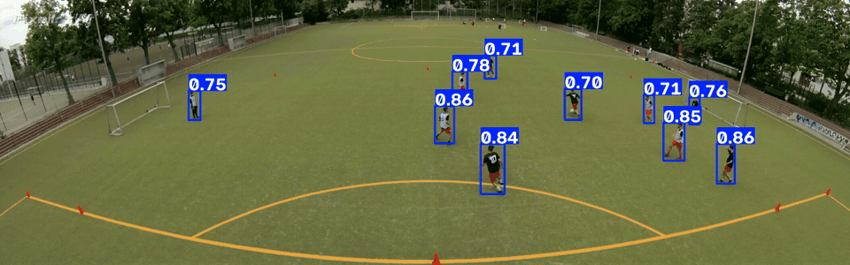

<div align="center">

<h1>Dive into Deep Learning Vietnamese Study Notebook</h1>
<p><strong>A beginner-first learning notebook based on <em>Dive into Deep Learning</em>, with source-aware Vietnamese explanations and an interactive book-style reader.</strong></p>
<p><code>Vietnamese lessons</code> · <code>Markdown chapters</code> · <code>Python reader</code> · <code>Light and Dark themes</code> · <code>Page-turn interaction</code></p>
<p><strong>Học chậm cho thấm, hiểu sâu nhớ lâu.</strong></p>

</div>


## Why This Project Exists

The original `../didl.pdf` is comprehensive, but it can be difficult to approach when machine learning and deep learning are still new. This project turns each chapter into a structured Vietnamese study note that helps the learner build intuition before working through definitions, equations, code, and exercises.

The notebook is designed to answer four practical questions for every important idea:

- What does this concept mean?
- Why is it needed?
- How does it work?
- When should it be used?

The material is not a sentence-by-sentence translation. Each authored chapter keeps the source book's English title and section structure while adding beginner-friendly explanations, tensor shapes, small examples, common mistakes, exercise hints, worked solutions, and figure provenance.

## Reader Experience

<table>
  <tr>
    <td width="50%">
      
      <p align="center"><sub>Vietnamese lessons, two-page reading, and source-aware figures.</sub></p>
    </td>
    <td width="50%">
      
      <p align="center"><sub>Night Ink mode with an in-page glossary tooltip.</sub></p>
    </td>
  </tr>
</table>

The reader uses an ancient Chinese manuscript visual language while keeping its controls and navigation clear in English.

| Capability | What It Provides |
| --- | --- |
| Book-style reading | Two pages on desktop, one page on narrow screens, and no internal vertical scrolling on the paper surface |
| Page turning | Pointer drag, swipe, buttons, and `Left` or `Right` arrow keys with a staged preview of the next page |
| Personalization | Six reader skins, Light and Dark themes, and persisted display preferences |
| Reading progress | Page marks, return-to-mark behavior, and chapter completion tracking |
| Technical content | MathJax equations, highlighted Python, algorithm blocks, and zoomable figures |
| Glossary support | Vietnamese explanations available through hover, click, or keyboard focus |
| Accessibility | Keyboard navigation, reduced-motion support, responsive layout, and descriptive interface labels |

## Applied Computer Vision Project

The repository also includes a complete football object-detection exercise built with Python, OpenCV, and Ultralytics YOLO26n.



The project covers the full workflow from source annotations to visual inference results:

- extracts frames from annotated match videos with OpenCV;
- maps player and ball categories to YOLO class identifiers;
- converts pixel-space bounding boxes to normalized YOLO center coordinates;
- fine-tunes a pretrained Ultralytics YOLO26n detector;
- evaluates precision, recall, mAP, F1-confidence curves, precision-recall curves, and a normalized confusion matrix;
- runs inference on a 60-second, 3840 × 1200 panoramic match clip.

The latest logged training epoch reached `0.488 mAP@0.5`. Player detection is the stronger class in the current experiment, while the small and underrepresented ball class remains the main data-quality and modeling improvement area.

[Open the full football object-detection results](computer-vision-homework/football/output.md)

The results report includes the optimized inference GIF, validation predictions, training examples, metrics, diagnostic plots, and a concise failure analysis. Custom training checkpoints are intentionally excluded from the published results.

## Content Status

The chapter filename, numbering, section order, and page scope follow the local PDF edition used by this workspace.

| Status | Content |
| --- | --- |
| Reviewed | Chapters  1–11, 14–18 and 21  |
| Placeholder | Chapters  12–13 and 19–20|
| Placeholder appendices | Appendix A, Mathematics for Deep Learning; Appendix B, Tools for Deep Learning |

Current total: **14 reviewed chapters**, **7 placeholder chapters**, and **2 placeholder appendices**.

## Quick Start

Python 3.10 or newer is required. The expected virtual environment lives next to the repository directory:

```text
deep-learning/
├── .venv/
├── didl.pdf
└── doc-dive-into-deep-learning/
```

From the `deep-learning/` directory:

```bash
python3 -m venv .venv
./.venv/bin/python -m pip install -r doc-dive-into-deep-learning/requirements.txt
cd doc-dive-into-deep-learning
../.venv/bin/python app.py
```

Open [http://127.0.0.1:8000](http://127.0.0.1:8000). To use another port:

```bash
../.venv/bin/python app.py --port 8080
```

<details>
<summary><strong>Activate the virtual environment manually</strong></summary>

Linux and macOS:

```bash
source ../.venv/bin/activate
python app.py
```

Windows PowerShell:

```powershell
..\.venv\Scripts\Activate.ps1
python app.py
```

</details>

## Repository Structure

```text
doc-dive-into-deep-learning/
├── app.py                              # HTTP server and Markdown renderer
├── content/
│   ├── book_index.yaml                 # Canonical chapter index based on the PDF
│   ├── glossary.json                   # Data for interactive terminology tooltips
│   ├── chapters/                       # One Markdown file per chapter
│   ├── appendices/                     # Appendix notes
│   └── assets/                         # Source figures and provenance sidecars
├── computer-vision-homework/
│   └── football/                       # OpenCV and Ultralytics YOLO detection project
│       ├── data_formatted.py           # Video-frame and YOLO-label preparation
│       ├── yolo.py                     # Model training entry point
│       ├── validation.py               # Validation metrics
│       ├── predict.py                  # Video inference
│       ├── output.md                   # Published results report
│       └── output-assets/              # GIF, predictions, and metric plots
├── docs/screenshots/                   # Current reader screenshots used by this README
├── static/                             # Reader HTML, CSS, and JavaScript
├── tests/                              # Content and interface checks
└── tools/                              # PDF reading and figure-extraction utilities
```

## Validation

Run the repository checks from `doc-dive-into-deep-learning/`:

```bash
../.venv/bin/python app.py --check
../.venv/bin/python -m unittest discover -s tests -v
node --check static/app.js
```

`app.py --check` validates chapter metadata, filenames, page ranges, ordering, figure provenance, local assets, and every glossary key referenced by the Markdown content.

## Authoring Rules

- Store each chapter at `content/chapters/NN - Exact Chapter Title.md`.
- Keep chapter filenames and numbered section titles in English as printed in the PDF; write the teaching content in natural Vietnamese.
- Write interactive terms as `{{term:tensor|Tensor}}` and define each key in `content/glossary.json`.
- Use `<!-- pagebreak -->` to separate intentional lesson groups; the reader may paginate long groups across additional sheets.
- Store source-book figures under `content/assets/chapter-NN/` with a matching `.source.json` provenance file.
- Store supplementary diagrams in a `generated/` directory and label them clearly as notebook-created figures.
- Set `status: reviewed` only after checking the chapter against the source PDF, running validation, and reviewing the desktop and mobile layouts.

See [AGENT.md](AGENT.md) for the complete authoring contract covering source fidelity, teaching style, equations, code, exercises, figures, glossary entries, and quality assurance.

## Extracting Figures from the Source PDF

The crop values are percentages of the physical PDF page:

```bash
../.venv/bin/python tools/extract_pdf_figure.py \
  --pdf ../didl.pdf \
  --pdf-page 281 \
  --book-page 241 \
  --crop 34,8,34,6.8 \
  --figure-id "Figure 7.2.1" \
  --caption "Two-dimensional cross-correlation operation" \
  --output content/assets/chapter-07/figure-7-2-1-cross-correlation.png
```

The tool writes both the PNG and a `.source.json` sidecar containing the PDF checksum, page numbers, DPI, and crop region.

The primary extractor requires Poppler and `pdftoppm`. When Poppler is unavailable, use the compatible pure-Python preparation path:

```bash
../.venv/bin/python tools/extract_pdf_figure_nopoppler.py \
  --pdf-page 784 \
  --book-page 744 \
  --crop 17,47,73,17 \
  --figure-id "Figure 16.1" \
  --output content/assets/chapter-16/figure-16-1-nlp-application-map.png
```

`tools/pdf_reader.py` can also extract text from a physical page range for source comparison:

```bash
../.venv/bin/python tools/pdf_reader.py ../didl.pdf 784 820
```

## Learning Code Notes

The reader itself does not require PyTorch. Chapter exercises may require PyTorch, so install a build appropriate for your operating system and CUDA environment before running them. MathJax is loaded from a CDN, which means the first equation render requires an internet connection.

<div align="center">

<p><strong>Understand one page deeply, then turn to the next.</strong></p>

</div>
