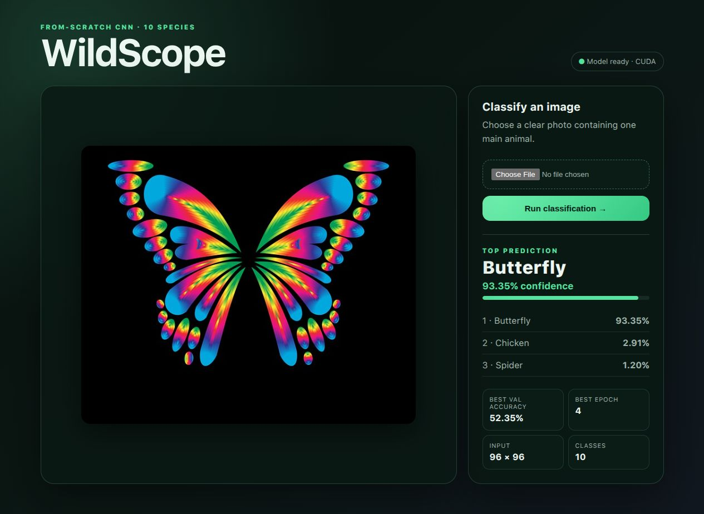
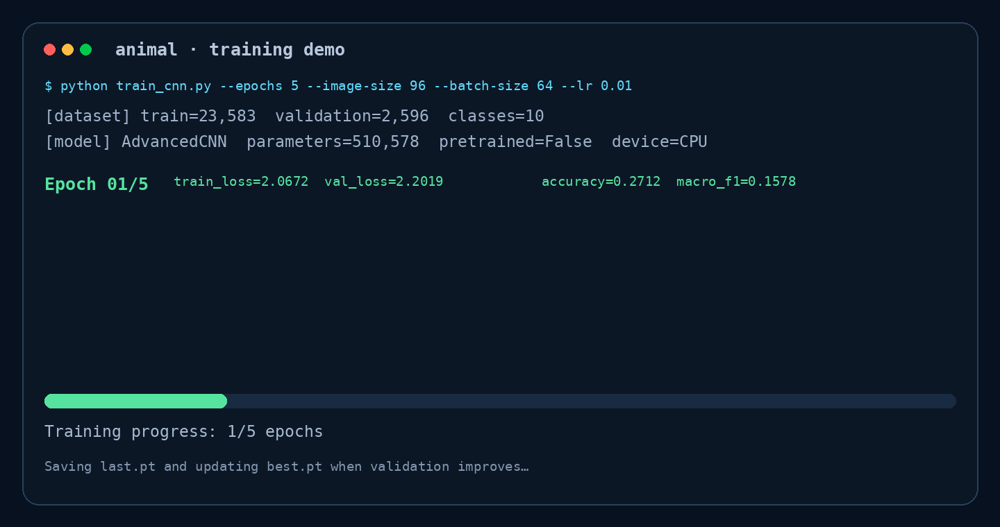
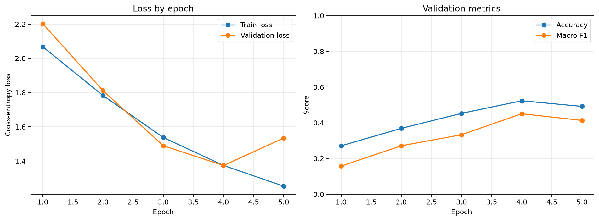
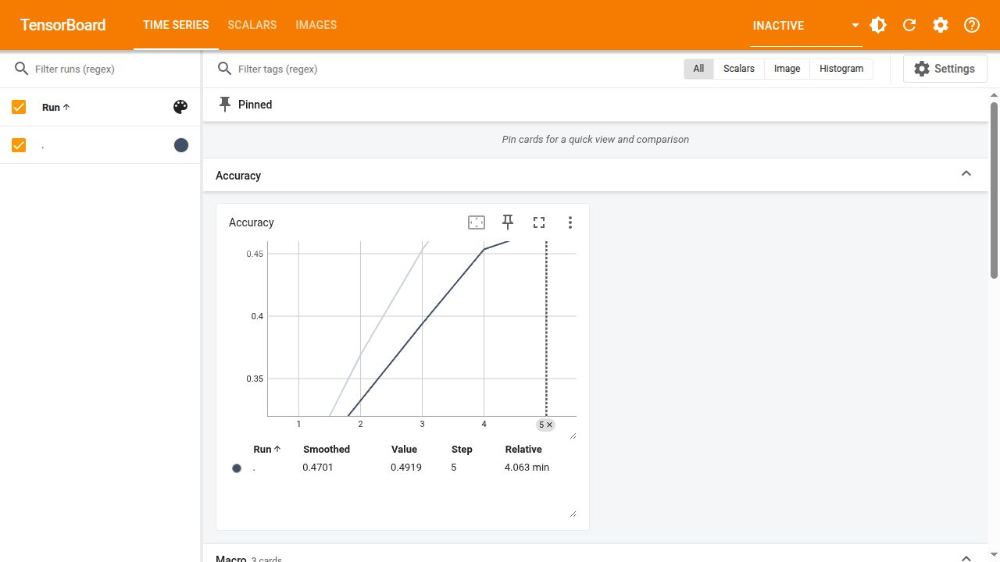
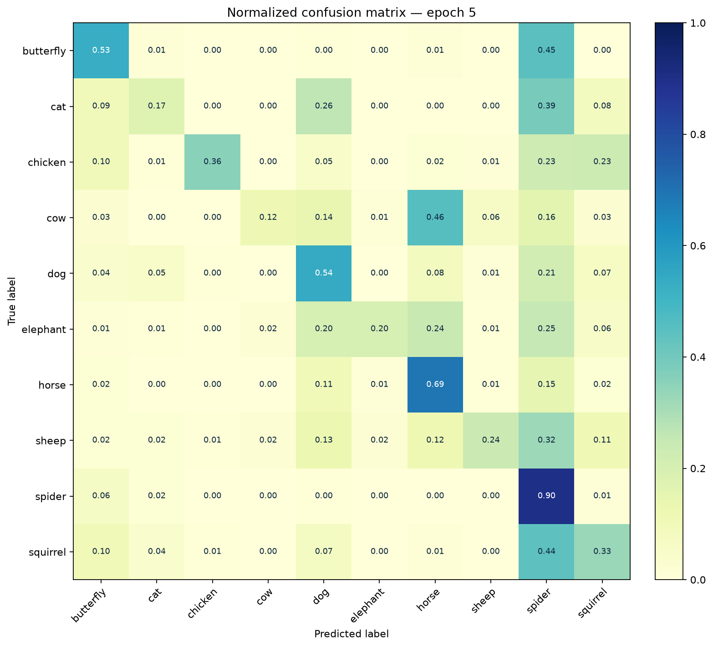

# Animal Image Classification Results

This project trains a convolutional neural network from scratch to classify ten animal categories. The workflow includes a folder-based dataset loader, data augmentation, five-epoch training, validation metrics, TensorBoard logging, CLI inference, and a local browser interface. No pretrained model or pretrained weights are used.

## Classification UI Demo

The local Flask interface accepts a JPG, PNG, or WebP image and displays the three highest-scoring classes. In the verified demo below, the model correctly classifies a held-out butterfly image with 93.35% confidence. The next two predictions are chicken at 2.91% and spider at 1.20%.



Run the interface after training:

```bash
cd computer-vision-homework/animal
../../../.venv/bin/python app.py --checkpoint best.pt --port 7860
```

## Five-Epoch Training Demo

The following short GIF is generated from the recorded terminal metrics. It shows the measured result appearing after each of the five completed epochs.



The concise terminal capture is also available as [`output-assets/training-terminal.txt`](output-assets/training-terminal.txt), while the machine-readable report is stored in [`output-assets/training-metrics.json`](output-assets/training-metrics.json).

## Run Configuration

| Parameter | Value |
| --- | --- |
| Model | `AdvancedCNN`, built from scratch |
| Pretrained weights | No |
| Trainable parameters | 510,578 |
| Classes | 10 |
| Training images | 23,583 |
| Validation images | 2,596 |
| Epochs | 5 |
| Batch size | 64 |
| Input size | 96 × 96 RGB |
| Optimizer | SGD |
| Learning rate | 0.01 |
| Momentum | 0.9 |
| Loss | Cross-entropy |
| Random seed | 42 |
| Data-loader workers | 0 |
| Training device | CPU |
| Elapsed training time | 303.1 seconds (5 minutes 3.1 seconds) |
| Python | 3.12.3 |
| PyTorch | 2.14.0+cu130 |
| Torchvision | 0.29.0+cu130 |
| scikit-learn | 1.9.1 |

Training augmentation resizes every image to 96 × 96, applies a random affine transform with ±5° rotation, up to 15% translation, 0.85–1.15 scaling, and 10° shear, then applies color jitter with brightness 0.125, contrast 0.5, saturation 0.5, and hue 0.05. Validation only uses resize and tensor conversion.

The CNN contains five convolutional blocks. Each block has two 3 × 3 convolutions with batch normalization and ReLU, followed by 2 × 2 max pooling. Channel widths progress through 8, 16, 32, 64, and 64. Adaptive average pooling produces a 3 × 3 feature map, and the classifier uses `576 → 512 → 128 → 10` linear layers with dropout rates of 0.4 and 0.3.

## Dataset Distribution

The local `datasets/train` and `datasets/test` folders are used as the training and validation splits, respectively.

| Class | Training | Validation |
| --- | ---: | ---: |
| Butterfly | 1,902 | 210 |
| Cat | 1,508 | 160 |
| Chicken | 2,790 | 308 |
| Cow | 1,684 | 182 |
| Dog | 4,373 | 490 |
| Elephant | 1,306 | 140 |
| Horse | 2,357 | 266 |
| Sheep | 1,638 | 182 |
| Spider | 4,345 | 476 |
| Squirrel | 1,680 | 182 |
| **Total** | **23,583** | **2,596** |

## Epoch Metrics

All precision, recall, and F1 values are macro averages across the ten classes.

| Epoch | Train loss | Validation loss | Accuracy | Macro precision | Macro recall | Macro F1 |
| ---: | ---: | ---: | ---: | ---: | ---: | ---: |
| 1 | 2.0672 | 2.2019 | 27.12% | 31.86% | 20.51% | 15.78% |
| 2 | 1.7827 | 1.8111 | 36.90% | 34.49% | 30.04% | 27.14% |
| 3 | 1.5379 | 1.4898 | 45.30% | 42.62% | 35.84% | 33.34% |
| **4** | **1.3746** | **1.3743** | **52.35%** | **56.32%** | **43.01%** | **45.08%** |
| 5 | 1.2537 | 1.5343 | 49.19% | 56.97% | 40.70% | 41.35% |

Epoch 4 produced the highest validation accuracy, 52.35%, and is therefore the checkpoint represented by `best.pt`. Epoch 5 reduced training loss further but validation loss increased and accuracy fell to 49.19%, which is an early sign that additional training should be monitored for overfitting.

### Training Curves



### TensorBoard at Epoch 5

TensorBoard receives train loss, validation loss, accuracy, macro precision, macro recall, macro F1, and the normalized confusion matrix. The screenshot shows the completed run at step 5.



### Normalized Confusion Matrix



At epoch 5, spider has the strongest class recall at 90.13%, followed by horse at 68.80%, dog at 53.88%, and butterfly at 52.86%. The most visible error pattern is over-prediction of spider for visually similar classes. Because the dataset is imbalanced, macro F1 and the per-class confusion matrix are important companions to aggregate accuracy.

## Reproduce the Run

Install the declared dependencies into the repository's sibling virtual environment:

```bash
../../../.venv/bin/python -m pip install -r requirements.txt
```

Run the same five-epoch training command:

```bash
MPLCONFIGDIR=/tmp/animal-mpl ../../../.venv/bin/python train_cnn.py \
  --epochs 5 \
  --image-size 96 \
  --batch-size 64 \
  --workers 0 \
  --lr 0.01 \
  --momentum 0.9 \
  --seed 42 \
  --data-path datasets \
  --checkpoint-dir . \
  --results-dir output-assets \
  --tensorboard animal_log
```

Inspect the live metrics UI with:

```bash
../../../.venv/bin/tensorboard --logdir animal_log --port 6006
```

Run one-image CLI inference with:

```bash
../../../.venv/bin/python inference_cnn.py \
  --checkpoint best.pt \
  --image-path path/to/animal.jpg \
  --output output-assets/inference-result.png
```

## Local-Only Artifacts

Training creates two checkpoint files:

- `best.pt` contains the weights from the epoch with the highest validation accuracy.
- `last.pt` contains the weights and optimizer state from the latest completed epoch, which supports resuming a run.

Both checkpoint files exist after training but are intentionally excluded from Git. The `.gitignore` also excludes `datasets/`, `animal_log/`, the 586 MB source archive, and the temporary extracted-data directory. This keeps the repository small while preserving the code, metrics, plots, UI captures, and the exact command needed to reproduce the checkpoints locally.

## Project Files

- [`dataset.py`](dataset.py) discovers class folders and loads RGB images.
- [`models.py`](models.py) defines the from-scratch CNN.
- [`train_cnn.py`](train_cnn.py) trains, validates, logs TensorBoard metrics, saves plots, and writes `best.pt`/`last.pt` locally.
- [`inference_cnn.py`](inference_cnn.py) performs CLI inference and renders a labeled result image.
- [`app.py`](app.py) serves the browser-based classification interface.
- [`requirements.txt`](requirements.txt) declares the runtime dependencies installed in `.venv`.
