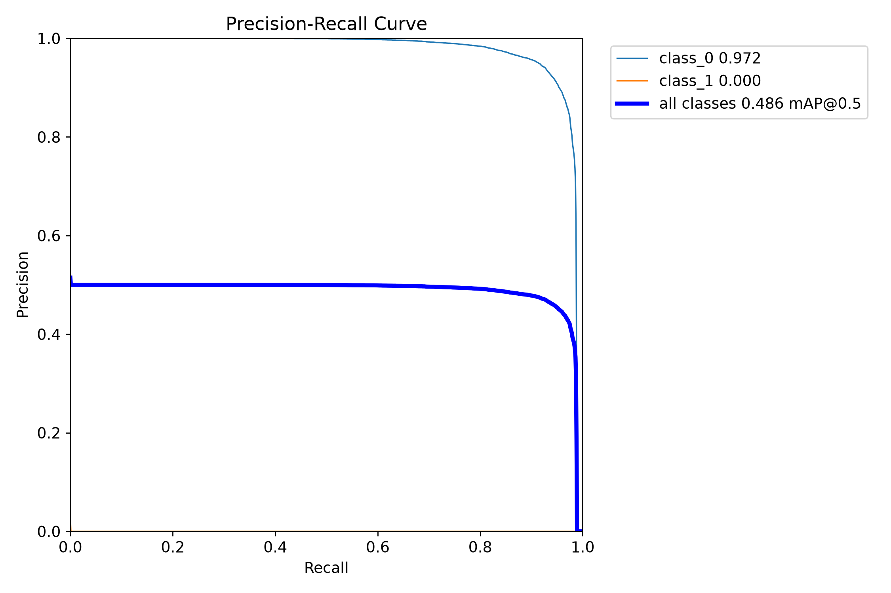
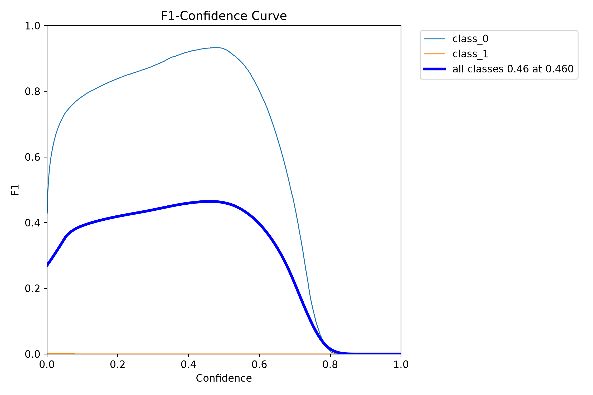
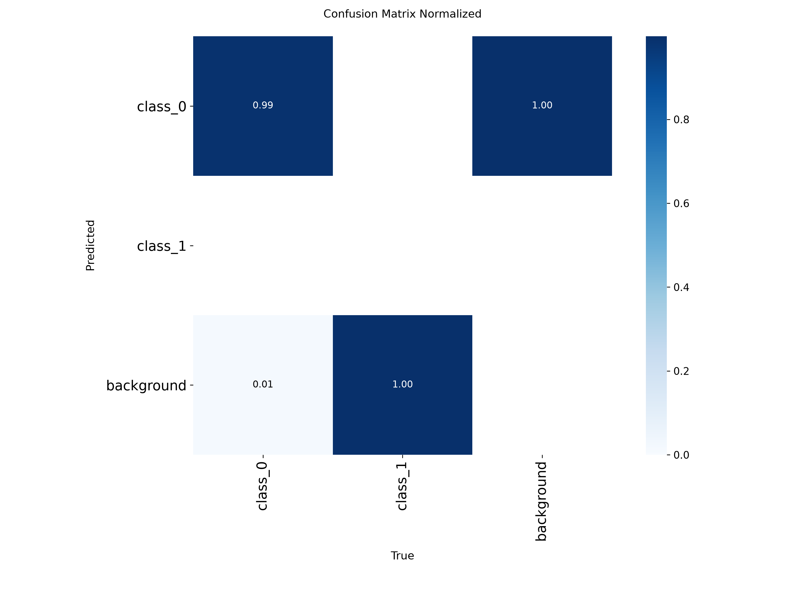
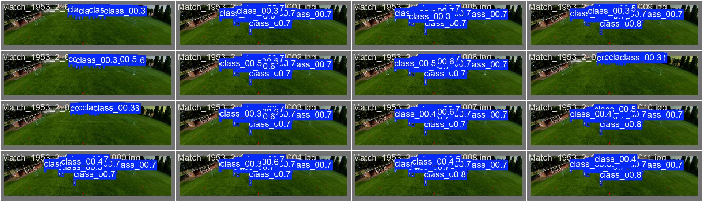
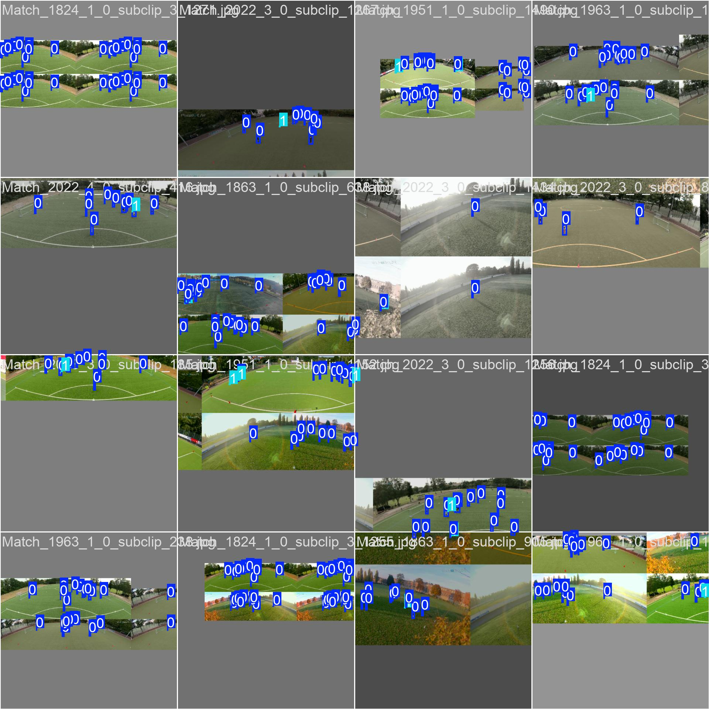

# Football Object Detection Results

This project implements an end-to-end football object-detection workflow with Python, OpenCV, and Ultralytics YOLO. It converts annotated match videos into YOLO training data, fine-tunes a pretrained YOLO26n detector, validates the model, and runs inference on a 60-second panoramic match clip.

## Inference Demo

The original prediction is a 3840 × 1200 Motion JPEG video. The preview below is an optimized GIF excerpt so the result can be viewed directly on GitHub without committing the 568 MB source video.

The model detects players across a wide field of view and renders a confidence score for each bounding box. The full inference pipeline is implemented in [`predict.py`](predict.py).

## Validation Summary

The latest logged training epoch reports the following aggregate box-detection metrics:

| Metric | Value |
| --- | ---: |
| Precision | 0.648 |
| Recall | 0.476 |
| mAP@0.5 | 0.488 |
| mAP@0.5:0.95 | 0.267 |

The separate validation plots report an all-class mAP@0.5 of 0.486 and a best all-class F1 score of 0.46 at a confidence threshold of 0.46. Player detection performs strongly in the precision-recall plot, while ball detection remains a clear improvement area because the ball is small and underrepresented in panoramic frames.

### Precision Recall Curve

### F1 Confidence Curve

### Normalized Confusion Matrix

The normalized confusion matrix makes the class imbalance visible: player detections are reliable, but the model does not yet generalize to the ball class. This result provides a concrete next step for the project: add more ball annotations, use targeted crops or tiling for small objects, and retrain with class-aware sampling.

## Validation Predictions

The validation batch shows detections on held-out video frames. Closely grouped players and the extreme panoramic aspect ratio create difficult localization cases, which are useful for evaluating confidence thresholds and annotation quality.

## Training Data Preview

The data-preparation script reads video frames with OpenCV, maps source categories to player and ball classes, converts bounding boxes from pixel `xywh` coordinates to normalized YOLO center coordinates, and writes one label file per annotated frame. The training run uses a pretrained YOLO26n model, 640-pixel input images, automatic mixed precision, deterministic seeding, and Ultralytics validation plots.

## Project Components

- [`data_formatted.py`](data_formatted.py) extracts frames and converts JSON annotations to YOLO labels.
- [`yolo.py`](yolo.py) loads pretrained YOLO26n weights and starts fine-tuning.
- [`validation.py`](validation.py) evaluates the custom checkpoint and exposes box metrics.
- [`predict.py`](predict.py) performs video inference and exposes normalized and pixel-space bounding boxes, class names, and confidence scores.

Model checkpoints are intentionally excluded from this results page and repository update.
