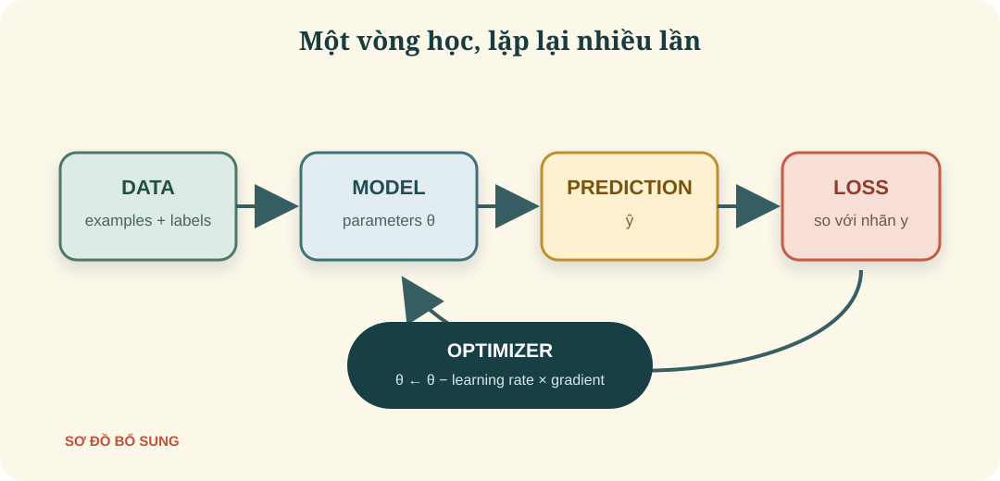
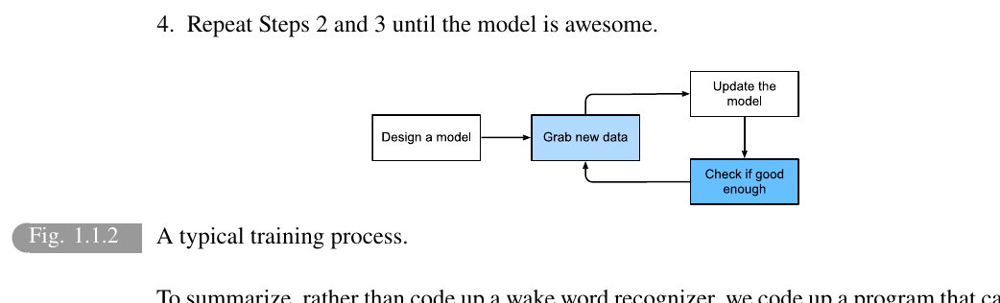
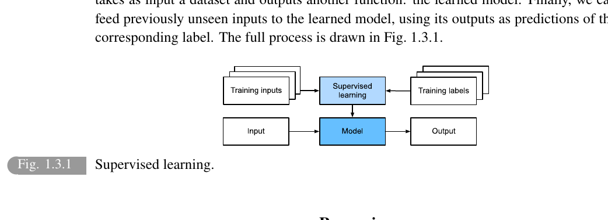
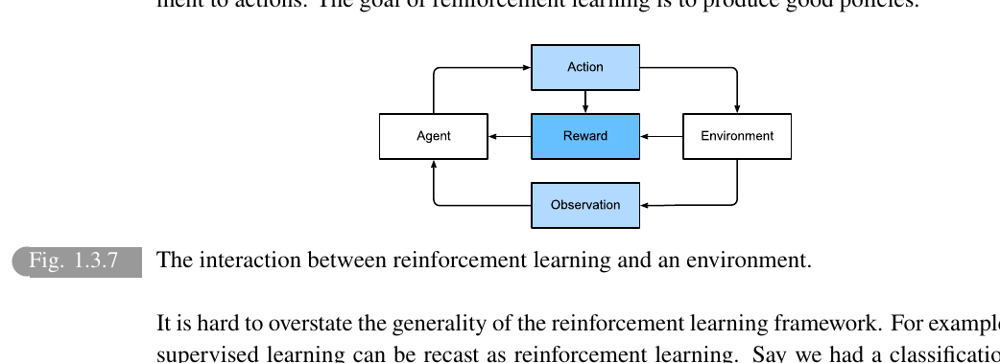

# Introduction

> **Ý chính trong một câu:** Machine learning không phải là “máy tự biết mọi thứ”; đó là cách ta chọn một họ mô hình, đưa cho máy dữ liệu, một thước đo sai và một cách điều chỉnh để nó dần làm tốt nhiệm vụ.

## Mục tiêu học tập

Học xong chương này, bạn có thể:

- giải thích bốn mảnh ghép **data → model → loss → optimization**;
- phân biệt regression, classification, unsupervised learning và reinforcement learning bằng câu hỏi mà chúng trả lời;
- giải thích vì sao cần tách training set và test set;
- mô tả vai trò của dữ liệu, sức mạnh tính toán và thuật toán trong deep learning;
- nhìn một việc đời thực và phác thảo nó thành một bài toán machine learning.

## Bản đồ chương

1. **Ta muốn máy làm gì?** → xác định bài toán và dữ liệu.
2. **Máy biểu diễn lời giải ra sao?** → chọn model và parameters.
3. **Biết câu trả lời tệ hay tốt bằng gì?** → loss/objective.
4. **Sửa model theo hướng nào?** → optimization.
5. **Gặp dữ liệu mới còn tốt không?** → generalization.

## Bức tranh tổng quan

Trong lập trình truyền thống, ta thường viết quy tắc rồi đưa dữ liệu vào. Với {{term:machine-learning|machine learning}}, ta đưa **ví dụ** và một cách chấm điểm để chương trình tìm ra quy tắc phù hợp. {{term:deep-learning|Deep learning}} là một nhánh dùng các mô hình có nhiều tầng biến đổi học được từ dữ liệu.

Ví dụ, để nhận ra câu đánh thức “Alexa”, việc tự liệt kê mọi giọng nói, tốc độ, tiếng ồn và cách phát âm gần như bất khả thi. Ta thu nhiều đoạn âm thanh đã gắn nhãn, chọn một model, đo lỗi, rồi lặp lại việc điều chỉnh.

> **Giới hạn của phép so sánh:** model không “học” như con người hiểu một khái niệm. Nó điều chỉnh các con số để giảm một mục tiêu toán học; hiểu theo nghĩa con người không tự động xuất hiện.

<!-- pagebreak -->

## 1.1 A Motivating Example — Ví dụ tạo động lực

Một hệ thống nhận diện từ đánh thức thường đi qua chu trình:

1. thiết kế một model có các “núm chỉnh”;
2. lấy một lô dữ liệu có đầu vào âm thanh và nhãn đúng/sai;
3. so sánh dự đoán với nhãn;
4. cập nhật các núm chỉnh rồi lặp lại.

Các núm chỉnh đó là {{term:parameter|parameters}}. Kiểu kiến trúc quyết định các núm nối với nhau thế nào được gọi là {{term:model|model}} hay **model family**. Quy tắc dùng dữ liệu để tìm giá trị parameter là **learning algorithm**.

### Câu hỏi tự kiểm tra

Nếu chỉ có model mà không có dữ liệu, loss hay cách cập nhật, máy có học được không? **Không.** Model chỉ là không gian các lời giải có thể; ba phần còn lại giúp chọn một lời giải cụ thể.

## 1.2 Key Components — Các thành phần cốt lõi

### 1.2.1 Data — Dữ liệu

Một {{term:dataset|dataset}} gồm nhiều **examples**. Mỗi example thường được biểu diễn bởi các thuộc tính gọi là {{term:feature|features}}; thứ cần dự đoán gọi là {{term:label|label}} hoặc target.

| Example | Features | Label |
|---|---|---|
| Căn A | 80 m², 2 phòng, quận X | 3,2 tỉ đồng |
| Căn B | 45 m², 1 phòng, quận Y | 1,6 tỉ đồng |

Dữ liệu tốt không chỉ là dữ liệu nhiều. Nó cần đại diện cho tình huống thật và hạn chế thiên lệch. Nếu ảnh huấn luyện chỉ chụp mèo ban ngày, model có thể thất bại với mèo trong phòng tối.

**Training set** dùng để điều chỉnh parameters. **Test set** được giữ riêng để đánh giá trên ví dụ model chưa thấy. Nếu học thuộc training set nhưng yếu trên test set, ta gặp {{term:overfitting|overfitting}}.

### 1.2.2 Models — Mô hình

Model là một hàm nhận input và tạo output. Một đường thẳng $\hat y = wx+b$ là model đơn giản; một neural network lớn cũng là model, chỉ khác ở số tầng và số parameters.

- $x$: input;
- $\hat y$: dự đoán;
- $w,b$: parameters phải học.

Model family là tập mọi lời giải có thể khi thay đổi $w,b$. Học chính là tìm một điểm tốt trong tập đó.

<!-- pagebreak -->

### 1.2.3 Objective Functions — Hàm mục tiêu

Ta cần một con số nói model sai bao nhiêu. {{term:loss-function|Loss function}} chấm lỗi cho một hoặc nhiều ví dụ. Với dự đoán giá nhà, một lựa chọn đơn giản là squared loss:

$$
\ell(y,\hat y)=\frac{1}{2}(y-\hat y)^2.
$$

Đọc bằng lời: lấy giá thật trừ giá dự đoán, bình phương để sai âm và sai dương đều bị phạt, rồi chia hai để đạo hàm gọn hơn. Sai số tăng gấp đôi thì khoản phạt tăng gấp bốn.

Loss chỉ hữu ích khi khớp với mục tiêu thật. Một hệ thống y tế có thể cần phạt việc bỏ sót bệnh nặng hơn báo động nhầm; chỉ dùng accuracy có thể che lấp điều đó.

### 1.2.4 Optimization Algorithms — Thuật toán tối ưu

{{term:optimization|Optimization}} tìm parameters làm objective nhỏ hơn. Cách quen thuộc là {{term:gradient-descent|gradient descent}}:

$$
\theta \leftarrow \theta-\eta\nabla_\theta L.
$$

- $\theta$: toàn bộ parameters;
- $L$: loss trung bình;
- $\nabla_\theta L$: hướng loss tăng nhanh nhất;
- $\eta$: learning rate, độ dài mỗi bước.

Ta đi **ngược** gradient để giảm loss. Learning rate quá lớn dễ vượt qua điểm tốt; quá nhỏ thì học chậm.

### Mental model bốn mảnh ghép

| Mảnh ghép | Câu hỏi | Ví dụ nhận diện mèo |
|---|---|---|
| Data | Máy được xem gì? | ảnh và nhãn mèo/không mèo |
| Model | Máy biến input thành output thế nào? | neural network |
| Loss | Sai được đo ra sao? | phạt xác suất sai nhãn |
| Optimizer | Parameters được sửa thế nào? | SGD/Adam |

## 1.3 Kinds of Machine Learning Problems — Các dạng bài toán

Thay vì nhớ tên, hãy nhớ **câu hỏi** mà mỗi dạng trả lời.

### 1.3.1 Supervised Learning — Học có giám sát

Trong {{term:supervised-learning|supervised learning}}, mỗi input huấn luyện đi cùng output đúng. Model học ánh xạ input → output rồi dự đoán cho input mới.

<!-- pagebreak -->

#### Regression — “Bao nhiêu?”

{{term:regression|Regression}} dự đoán một giá trị số liên tục: giá nhà, nhiệt độ, thời gian giao hàng. Chương 3 sẽ đi sâu vào linear regression.

#### Classification — “Thuộc lớp nào?”

{{term:classification|Classification}} dự đoán một lớp rời rạc. Spam/không spam là binary classification; chữ số 0–9 là multiclass classification. Model thường trả xác suất cho từng lớp thay vì chỉ một nhãn cứng.

#### Tagging — “Có những nhãn nào?”

Một ảnh có thể đồng thời có “biển”, “hoàng hôn”, “thuyền”. Đây là {{term:multilabel-classification|multi-label classification}}: mỗi example có thể mang nhiều nhãn.

#### Search và ranking — “Kết quả nào nên đứng trước?”

Search không chỉ xác định đúng/sai mà còn xếp kết quả theo mức liên quan. Dữ liệu thường là cặp so sánh: với truy vấn này, tài liệu A nên đứng trên B.

#### Recommender systems — “Người này có thể thích gì?”

{{term:recommender-system|Recommender system}} dự đoán sở thích dựa trên hành vi. Khó ở chỗ ta chỉ thấy phản hồi cho món đã hiển thị: không bấm có thể vì không thích, hoặc vì chưa bao giờ nhìn thấy. Gợi ý cũng làm thay đổi chính dữ liệu tương lai, tạo feedback loop.

#### Sequence learning — “Thứ tự có ý nghĩa gì?”

Trong {{term:sequence-learning|sequence learning}}, input hoặc output là chuỗi có thứ tự: dịch câu, nhận dạng giọng nói, dự báo thời gian. “Chó cắn người” và “Người cắn chó” có cùng từ nhưng ý nghĩa khác hẳn.

### 1.3.2 Unsupervised and Self-Supervised Learning

{{term:unsupervised-learning|Unsupervised learning}} làm việc khi không có nhãn do con người cung cấp. Các mục tiêu thường gặp:

- gom nhóm các example giống nhau (clustering);
- tìm cấu trúc ít chiều hơn trong dữ liệu;
- ước lượng cách dữ liệu được sinh ra;
- phát hiện quan hệ hoặc mẫu bất thường.

{{term:self-supervised-learning|Self-supervised learning}} tự tạo “nhãn” từ chính dữ liệu: che một từ rồi đoán từ bị che, hoặc đoán phần tiếp theo của ảnh. Nó giúp tận dụng dữ liệu chưa gắn nhãn, nhưng vẫn cần một nhiệm vụ huấn luyện rõ ràng.

<!-- pagebreak -->

### 1.3.3 Interacting with an Environment — Tương tác với môi trường

Trong học offline, dữ liệu có trước và model không tác động đến việc dữ liệu được sinh ra. Nhưng một robot, hệ gợi ý hay xe tự lái vừa dự đoán vừa hành động; hành động hôm nay thay đổi quan sát ngày mai.

Đây là nguồn của {{term:distribution-shift|distribution shift}}: phân bố khi triển khai khác phân bố khi huấn luyện. Ví dụ, một bộ lọc spam làm kẻ gửi spam đổi chiến thuật; dữ liệu mới không còn giống dữ liệu cũ.

### 1.3.4 Reinforcement Learning — Học tăng cường

Trong {{term:reinforcement-learning|reinforcement learning}}, một {{term:agent|agent}} quan sát {{term:environment|environment}}, chọn action, nhận {{term:reward|reward}}, rồi tiếp tục. Quy tắc chọn action gọi là {{term:policy|policy}}.

Khác supervised learning, agent thường không nhận “đáp án đúng” cho từng bước. Nó chỉ biết reward, đôi khi đến rất muộn. Ba khó khăn trung tâm:

- **credit assignment:** hành động nào trước đó tạo ra kết quả hiện tại?
- **partial observability:** agent không nhìn thấy toàn bộ trạng thái;
- **exploration vs. exploitation:** thử điều mới hay dùng phương án đang tốt?

Các trường hợp từ tổng quát đến đơn giản gồm partially observable Markov decision process, Markov decision process, contextual bandit và multi-armed bandit.

### Cây quyết định chọn bài toán

- Có input đi kèm câu trả lời đúng?
  - Output là số → regression.
  - Output là nhãn → classification/tagging.
  - Output có thứ tự → sequence learning/ranking.
- Không có nhãn nhưng muốn tìm cấu trúc → unsupervised/self-supervised.
- Hành động làm thay đổi dữ liệu tương lai và có reward → reinforcement learning.

<!-- pagebreak -->

## 1.4 Roots — Nguồn gốc

Machine learning nối nhiều dòng tư tưởng:

- **Thống kê:** Bernoulli, Gauss và Legendre đặt nền cho xác suất, phân phối chuẩn và least squares.
- **Thông tin và tính toán:** Shannon cho ta lý thuyết thông tin; Turing giúp hình dung máy tính phổ dụng.
- **Thần kinh học:** mô hình neuron nhân tạo lấy cảm hứng từ neuron sinh học, nhưng chỉ là mô hình toán học rất đơn giản.
- **Tối ưu và vi phân:** chain rule cho phép tính một thay đổi nhỏ ở parameter ảnh hưởng tới loss qua nhiều tầng ra sao.

Một lưu ý quan trọng từ lịch sử: khoa học dữ liệu có thể bị dùng sai để hợp thức hóa định kiến. Hiệu quả dự đoán không thay thế câu hỏi đạo đức: dữ liệu đến từ đâu, ai chịu rủi ro, ai có quyền phản biện?

## 1.5 The Road to Deep Learning — Con đường tới deep learning

Neural network đã có ý tưởng từ lâu, nhưng ba điều cùng chín muồi mới tạo bứt phá:

1. **Nhiều dữ liệu hơn:** internet, cảm biến và số hóa tạo dataset lớn.
2. **Nhiều compute hơn:** GPU phù hợp với phép toán song song trên tensor.
3. **Thuật toán và công cụ tốt hơn:** initialization, activation, optimization và framework giúp mô hình sâu huấn luyện ổn định hơn.

Đây là quan hệ cộng hưởng, không phải một “phép màu” duy nhất. Model lớn thiếu dữ liệu có thể overfit; dữ liệu lớn thiếu compute không khai thác nổi; compute mạnh với mục tiêu tệ chỉ tối ưu rất nhanh sai thứ cần làm.

## 1.6 Success Stories — Những thành công nổi bật

Deep learning tạo bước tiến trong computer vision, speech recognition, game playing, natural language processing và hệ thống gợi ý. Điểm chung không chỉ là độ chính xác, mà là khả năng học representation trực tiếp từ dữ liệu thô với ít feature engineering thủ công hơn.

Tuy vậy, “thành công trên benchmark” không đồng nghĩa hệ thống đã an toàn ngoài đời. Cần xem xét dữ liệu lệch, chi phí, quyền riêng tư, khả năng giải thích và lỗi hiếm nhưng nghiêm trọng.

<!-- pagebreak -->

## 1.7 The Essence of Deep Learning — Bản chất của deep learning

{{term:representation-learning|Representation learning}} là để model tự học cách biểu diễn dữ liệu. Ở ảnh, tầng đầu có thể phát hiện cạnh; tầng sau ghép cạnh thành hình; tầng sâu hơn ghép hình thành vật thể. Các biểu diễn không được lập trình từng quy tắc mà được điều chỉnh đồng thời theo loss.

“Deep” nói đến một chuỗi nhiều phép biến đổi học được. Nếu

$$
h_1=f_1(x),\quad h_2=f_2(h_1),\quad \hat y=f_3(h_2),
$$

thì dữ liệu đi từ $x$ qua các biểu diễn trung gian $h_1,h_2$ đến dự đoán $\hat y$. Backpropagation dùng chain rule để biết mỗi parameter nên thay đổi thế nào.

{{term:end-to-end-learning|End-to-end learning}} tối ưu cả chuỗi từ input đến output cuối. Nó có thể thay thế một pipeline gồm nhiều bước thủ công, nhưng không có nghĩa mọi ràng buộc và tri thức miền đều nên bỏ đi.

Ba nét tạo nên thực hành deep learning hiện đại:

- mô hình nhiều tầng có thể học representation;
- hệ thống được huấn luyện trên dữ liệu lớn bằng tối ưu số;
- cộng đồng thực nghiệm và open source giúp kiểm chứng, tái sử dụng và cải tiến nhanh.

## 1.8 Summary — Tóm tắt dễ nhớ

Hãy nhớ chuỗi **D-M-L-O-G**:

1. **Data**: ví dụ có đại diện cho thế giới thật không?
2. **Model**: họ hàm nào đủ sức biểu diễn lời giải?
3. **Loss**: “sai” được định nghĩa thế nào?
4. **Optimization**: sửa parameters bằng cách nào?
5. **Generalization**: gặp dữ liệu mới còn làm tốt không?

Machine learning gồm nhiều dạng bài toán. Supervised learning học từ cặp input-output; unsupervised/self-supervised tìm hoặc tự tạo cấu trúc; reinforcement learning học bằng tương tác và reward. Deep learning nổi bật ở việc học nhiều tầng representation cùng lúc.

## Điểm hay và ý nghĩa

- **Tính thống nhất:** từ giá nhà tới dịch máy, data–model–loss–optimizer vẫn xuất hiện.
- **Học biểu diễn:** ta bớt viết đặc trưng thủ công, nhưng phải thiết kế dữ liệu và mục tiêu cẩn thận hơn.
- **Thói quen tốt:** trước khi hỏi “model nào?”, hãy hỏi “input/output là gì, sai đo thế nào, dữ liệu triển khai có giống dữ liệu học không?”.

## Sau chương này bạn làm được gì?

Bạn đã có thể nghe “dự đoán thời gian giao hàng” và nhận ra đây là regression; đề xuất features, label và loss; chỉ ra cần tách test set; đồng thời cảnh báo distribution shift nếu tuyến đường hoặc mùa vụ đổi.

<!-- pagebreak -->

## 1.9 Exercises — Hệ thống bài tập và cách giải

Các bài dưới đây giữ đúng ý của bốn bài tập cuối chương, nhưng được diễn đạt lại để bạn tự suy nghĩ.

### Bài 1 — Tách “học được” khỏi “được viết sẵn”

Chọn một chương trình bạn dùng hằng ngày. Liệt kê phần nào có thể là learned component, phần nào là quy tắc và phần nào là dữ liệu.

Gợi ý trước khi xem lời giải mẫu

Theo dõi input → xử lý → output. Nếu hành vi thay đổi nhờ nhiều ví dụ thay vì sửa mã, đó thường là phần học được.

**Lời giải mẫu với email:** dữ liệu là nội dung, người gửi và lịch sử đánh dấu spam; phần học được là xác suất spam và xếp hạng email; heuristic là chặn file thực thi; quy tắc cứng là blacklist do người dùng đặt.

**Bẫy:** model vẫn chạy qua mã. Điều cần hỏi là quyết định chính có được suy ra từ dữ liệu hay không.

### Bài 2 — Có ví dụ nhưng khó viết thuật toán

Gợi ý và lời giải

Ví dụ: nhận ra chữ viết tay. Ta có ảnh và ký tự đúng, nhưng khó viết quy tắc bao quát mọi nét nghiêng, đậm, đứt. Supervised classification phù hợp: input là ảnh, label là ký tự, loss đo sai lớp.

### Bài 3 — Data, algorithm và compute tác động nhau thế nào?

Gợi ý và lời giải

Data nhiều giúp ước lượng tốt hơn nếu đại diện; algorithm tốt tận dụng cấu trúc và tối ưu ổn định; compute cho phép thử model lớn và nhiều thí nghiệm. Chúng không thay thế hoàn toàn cho nhau: compute không sửa được nhãn sai, model tinh vi không cứu được mục tiêu lệch.

### Bài 4 — Khi nào không nên mặc định end-to-end?

Gợi ý và lời giải

Khi dữ liệu đầu-cuối quá ít, cần quy tắc an toàn cứng, mỗi bước phải kiểm toán, hoặc tri thức miền rất mạnh. Ví dụ hệ thống tính thuế nên giữ luật thành logic minh bạch; ML có thể đọc hóa đơn nhưng không nên tự “học” luật từ hồ sơ cũ.

### Bài tập bổ sung — Thiết kế một bài toán ML

Với bài toán dự đoán sinh viên có nguy cơ bỏ học, hãy ghi data, output, loss, cách đánh giá và rủi ro đạo đức.

Một khung trả lời tốt

Features chỉ dùng dữ liệu được phép; output là xác suất cần hỗ trợ; loss cân nhắc bỏ sót; đánh giá trên kỳ học mới; model kích hoạt hỗ trợ chứ không trừng phạt. Cần kiểm tra fairness và cho người học quyền sửa dữ liệu.

<!-- pagebreak -->

## Thuật ngữ cần nhớ

| English term | Hiểu ngắn gọn | Ví dụ |
|---|---|---|
| Machine learning | học quy luật từ dữ liệu | lọc spam |
| Dataset | tập các examples | 10.000 ảnh mèo và chó |
| Feature / label | đầu vào mô tả / đáp án | diện tích / giá nhà |
| Model / parameter | hàm dự đoán / con số model học | $wx+b$ / $w,b$ |
| Loss | thước đo sai | bình phương sai số |
| Optimization | cách tìm parameters tốt | gradient descent |
| Generalization | làm tốt trên dữ liệu chưa thấy | test set |
| Supervised learning | học từ cặp input–output | classification |
| Unsupervised learning | tìm cấu trúc không có nhãn | clustering |
| Reinforcement learning | học hành động qua reward | agent chơi game |
| Representation learning | tự học cách biểu diễn | cạnh → hình → vật thể |

## Checklist tự đánh giá

- [ ] Tôi mô tả được data–model–loss–optimizer mà không nhìn tài liệu.
- [ ] Tôi phân loại được một bài toán ML cơ bản.
- [ ] Tôi giải thích được vì sao training loss thấp chưa đủ.
- [ ] Tôi biết deep learning học nhiều tầng representation.
- [ ] Tôi đặt được câu hỏi về dữ liệu lệch hoặc tác động đạo đức.

## Nguồn và phạm vi

- Nguồn chính: *Dive into Deep Learning*, Chapter 1 — **Introduction**.
- Trang in: **1–29**; trang vật lý trong `didl.pdf`: **41–69**.
- Figure 1.1.2, 1.3.1 và 1.3.7 được trích trực tiếp từ PDF; file `.source.json` ghi trang, vùng crop và SHA-256.
- “Sơ đồ bổ sung” do vở học tạo, không phải hình gốc của sách.
