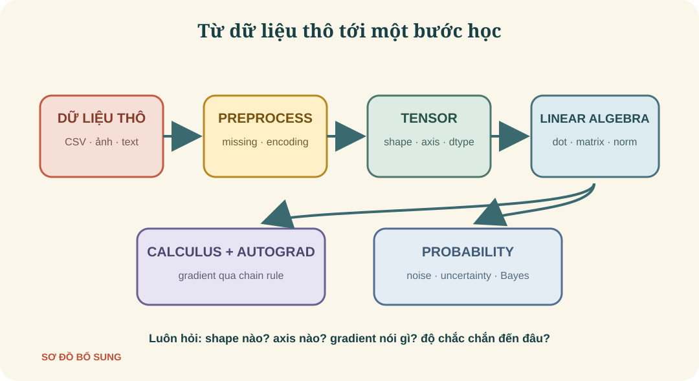
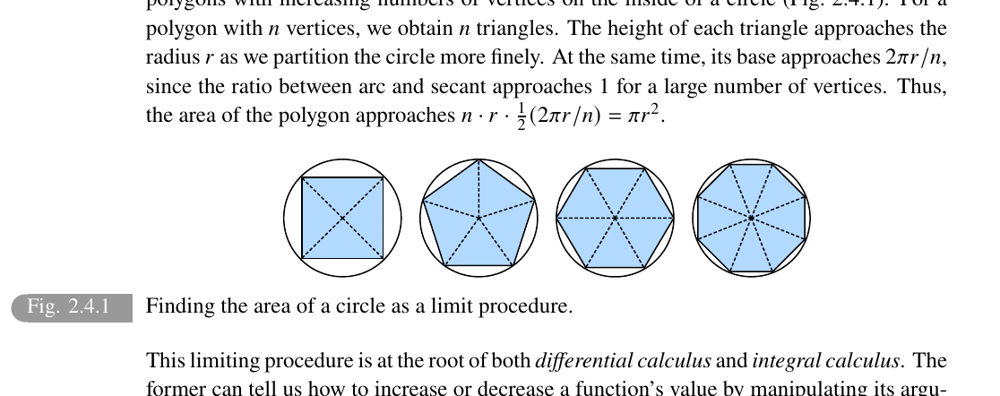
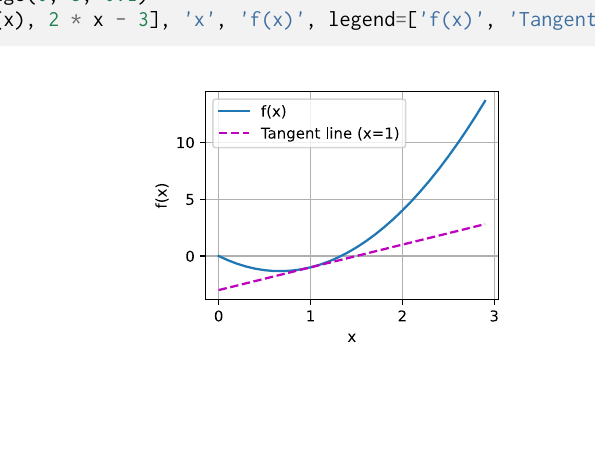
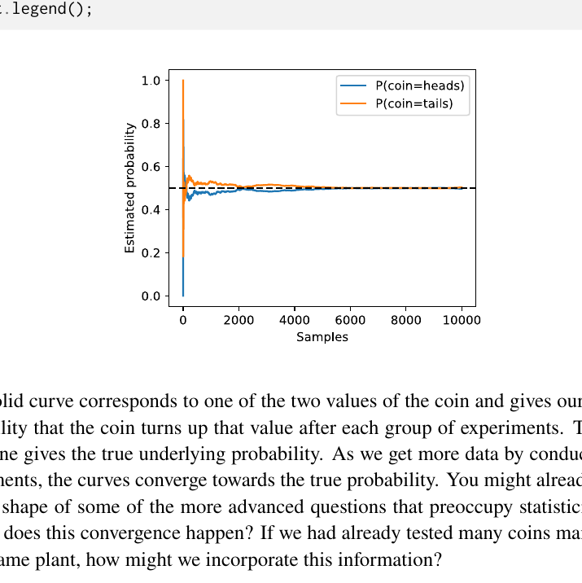

# Preliminaries

> **Ý chính trong một câu:** Chương này xây bộ dụng cụ tối thiểu để bạn có thể nhìn dữ liệu dưới dạng tensor, biến đổi nó bằng đại số tuyến tính, tính hướng thay đổi bằng calculus và diễn giải sự không chắc chắn bằng probability.

## Mục tiêu học tập

Học xong chương này, bạn có thể:

- tạo, đổi shape, cắt, ghép và broadcast tensor bằng PyTorch;
- đọc CSV, xử lý giá trị thiếu và biến dữ liệu thành số;
- giải thích scalar, vector, matrix, dot product, matrix multiplication và norm bằng cả shape lẫn ý nghĩa;
- đọc derivative, partial derivative, gradient và chain rule;
- dùng automatic differentiation để tính gradient đúng cách;
- dùng joint, marginal, conditional probability và Bayes’ theorem;
- tự tra cứu API thay vì cố nhớ mọi hàm.

## Bản đồ chương



| Bạn đang làm gì? | Công cụ cần dùng |
|---|---|
| chứa một batch ảnh, câu hay bảng số | Tensor và data preprocessing |
| phối hợp nhiều đặc trưng | Linear algebra |
| biết parameter nên tăng hay giảm | Calculus và automatic differentiation |
| lý giải nhiễu và độ tin cậy | Probability và statistics |
| quên cú pháp | Documentation |

## Bức tranh tổng quan

Chương 2 giống buổi học cách dùng bếp trước khi nấu món chính. Bạn chưa xây model lớn, nhưng sẽ dùng các thao tác ở đây trong hầu hết chương sau. Đừng cố thuộc mọi API. Hãy luôn hỏi ba câu: **tensor có shape gì, phép toán chạy trên axis nào, output phải có shape gì?**

<!-- pagebreak -->

## 2.1 Data Manipulation — Thao tác dữ liệu

### 2.1.1 Getting Started — Bắt đầu với tensor

{{term:tensor|Tensor}} là mảng số nhiều chiều. Trong PyTorch:

```python
import torch

x = torch.arange(12, dtype=torch.float32)
print(x.shape)       # torch.Size([12])
print(x.numel())     # 12 phần tử
X = x.reshape(3, 4)
print(X)
```

`reshape(3, 4)` không đổi dữ liệu, chỉ đổi cách nhìn 12 số thành 3 hàng × 4 cột. `shape` là kích thước từng {{term:axis|axis}}; `numel()` là tổng số phần tử.

Các cách khởi tạo thường dùng:

```python
torch.zeros((2, 3))
torch.ones((2, 3))
torch.randn(2, 3)       # phân phối chuẩn N(0, 1)
torch.tensor([[2, 1], [3, 4]])
```

### 2.1.2 Indexing and Slicing — Chỉ mục và cắt lát

Quy tắc gần giống list Python:

```python
X[-1]           # hàng cuối
X[1:3]          # hàng 1 và 2; cận phải không lấy
X[1, 2] = 99    # sửa một ô
X[:, 2] = 7     # sửa cột thứ 2 của mọi hàng
```

Hãy đọc `X[:, 2]` là “lấy tất cả ở axis 0, lấy vị trí 2 ở axis 1”.

### 2.1.3 Operations — Phép toán

Các phép `+`, `-`, `*`, `/`, `**` mặc định chạy {{term:elementwise-operation|elementwise}}: phần tử cùng vị trí làm việc với nhau.

```python
x = torch.tensor([1.0, 2.0, 4.0, 8.0])
y = torch.tensor([2.0, 2.0, 2.0, 2.0])
print(x + y)       # [3, 4, 6, 10]
print(x * y)       # [2, 4, 8, 16], chưa phải dot product
print(torch.exp(x))
```

Ghép tensor không tính toán số học:

```python
X = torch.arange(12).reshape(3, 4)
Y = torch.ones((3, 4), dtype=torch.int64)
torch.cat((X, Y), dim=0).shape  # (6, 4): chồng thêm hàng
torch.cat((X, Y), dim=1).shape  # (3, 8): nối thêm cột
```

<!-- pagebreak -->

### 2.1.4 Broadcasting — Kéo giãn ngầm

{{term:broadcasting|Broadcasting}} cho phép tính giữa tensor khác shape khi các chiều, so từ phải sang trái, **bằng nhau hoặc một bên bằng 1**.

```python
a = torch.arange(3).reshape(3, 1)  # shape (3, 1)
b = torch.arange(2).reshape(1, 2)  # shape (1, 2)
print(a + b)                        # shape (3, 2)
```

Trực giác: `a` được lặp theo cột, `b` được lặp theo hàng. Nhưng PyTorch không nhất thiết tạo bản sao vật lý.

**Bẫy shape:** `(2, 3) / (2,)` không chia “mỗi hàng cho tổng hàng” được vì so chiều cuối là `3` và `2`. Dùng `sum(dim=1, keepdim=True)` để nhận shape `(2, 1)`.

### 2.1.5 Saving Memory — Tránh cấp phát thừa

`Y = Y + X` tạo object mới; điều này có thể tốn bộ nhớ và làm mất tham chiếu cũ. {{term:in-place-operation|In-place operation}} sửa ngay vùng nhớ:

```python
before = id(Y)
Y[:] = Y + X       # hoặc Y += X
assert id(Y) == before
```

Trong autograd, sửa in-place một tensor đang cần để tính gradient có thể gây lỗi. Tối ưu bộ nhớ chỉ nên làm khi bạn hiểu computational graph.

### 2.1.6 Conversion to Other Python Objects

PyTorch tensor và NumPy array có thể chia sẻ bộ nhớ CPU:

```python
import numpy as np

A = X.numpy()
B = torch.from_numpy(A)
value = torch.tensor([3.5]).item()  # Python float
```

### 2.1.7 Summary — Tóm tắt

Tensor có `shape`, `dtype`, `device`. Hầu hết bug đầu đời đến từ shape sai. Hãy in shape sau mỗi bước khi học.

### 2.1.8 Exercises — Bài tập

<details>
<summary>Bài 1: so sánh tensor và Bài 2: broadcasting ba chiều</summary>

**Gợi ý 1:** thử `X == Y`, `X < Y`, rồi xem dtype.

**Lời giải:** phép so sánh là elementwise, trả tensor Boolean cùng shape; dùng `.all()` nếu muốn một kết luận chung.

**Gợi ý 2:** thử `(2, 1, 4) + (1, 3, 1)` và căn từ phải sang trái.

**Lời giải:** output `(2, 3, 4)`. Ba cặp chiều là `(2,1)`, `(1,3)`, `(4,1)`; mỗi cặp có một bên bằng 1 nên broadcast được. Cặp `(2,3,4)` và `(2,2)` không được vì chiều cuối `4` khác `2`.
</details>

<!-- pagebreak -->

## 2.2 Data Preprocessing — Tiền xử lý dữ liệu

### 2.2.1 Reading the Dataset — Đọc dữ liệu

Dataset thực tế thường là CSV, không phải tensor sạch. Ví dụ tối thiểu:

```python
from io import StringIO
import pandas as pd

raw = StringIO("rooms,alley,price\n3,Pave,127500\nNA,NA,106000\n2,Gravel,140000")
data = pd.read_csv(raw, na_values="NA")
print(data)
```

### 2.2.2 Data Preparation — Chuẩn bị

Model số không hiểu trực tiếp ô trống hay chuỗi. Hai thao tác cơ bản:

1. **Imputation:** thay giá trị thiếu bằng một ước lượng, ví dụ mean cho cột số.
2. **One-hot encoding:** đổi category thành các cột 0/1.

```python
inputs, target = data.iloc[:, :2], data.iloc[:, 2]
inputs = inputs.copy()
inputs["rooms"] = inputs["rooms"].fillna(inputs["rooms"].mean())
inputs = pd.get_dummies(inputs, dummy_na=True, dtype=float)
print(inputs)
```

**Bẫy:** mean imputation làm giảm độ biến thiên và có thể tạo thiên lệch. Với bài toán thật, hãy fit cách impute trên training set rồi áp dụng nguyên cách đó cho validation/test set để tránh rò rỉ dữ liệu.

### 2.2.3 Conversion to the Tensor Format

```python
X = torch.tensor(inputs.to_numpy(dtype="float32"))
y = torch.tensor(target.to_numpy(dtype="float32"))
print(X.shape, X.dtype, y.shape)
```

### 2.2.4 Discussion — Điều cần hiểu sâu

Tiền xử lý không phải “dọn dẹp phụ”. Cách mã hóa category, xử lý missing value và chuẩn hóa số quyết định model được phép thấy gì. Pipeline phải nhất quán giữa lúc học và lúc dự đoán.

### 2.2.5 Exercises — Bài tập

<details>
<summary>5 ý luyện tập của sách: quan sát, chọn cột, giới hạn và category lớn</summary>

1. **Quan sát dataset:** dùng `data.shape`, `data.dtypes`, `data.isna().sum()` trước khi biến đổi.
2. **Chọn cột theo tên:** `data.loc[:, ["rooms", "alley"]]` rõ nghĩa hơn vị trí khi schema đổi.
3. **Giới hạn của bỏ dòng:** `dropna()` dễ làm mất quá nhiều dữ liệu và làm mẫu còn lại lệch.
4. **Category có hàng triệu giá trị:** one-hot tạo ma trận khổng lồ; cân nhắc hashing, learned embedding hoặc gộp nhóm hiếm.
5. **Cách khác xử lý thiếu:** median, model-based imputation, hoặc thêm cột “is_missing”. Lựa chọn phải dựa trên cơ chế thiếu và validation.
</details>

<!-- pagebreak -->

## 2.3 Linear Algebra — Đại số tuyến tính

### 2.3.1 Scalars — Vô hướng

{{term:scalar|Scalar}} là một số, ký hiệu thường $x\in\mathbb{R}$. Tensor bậc 0 trong PyTorch:

```python
x = torch.tensor(3.0)
y = torch.tensor(2.0)
print(x + y, x * y, x / y, x**y)
```

### 2.3.2 Vectors — Vector

{{term:vector|Vector}} là danh sách có thứ tự $\mathbf{x}=[x_1,\ldots,x_n]^\top$. Độ dài của axis là **dimensionality**; số axis là **order**. Một vector dài 5 có order 1 nhưng dimensionality 5.

### 2.3.3 Matrices — Ma trận

{{term:matrix|Matrix}} $\mathbf{A}\in\mathbb{R}^{m\times n}$ có $m$ hàng, $n$ cột. {{term:transpose|Transpose}} đổi hàng thành cột: $(\mathbf A^\top)_{ij}=A_{ji}$. Matrix vuông có $\mathbf A=\mathbf A^\top$ là symmetric.

```python
A = torch.arange(6).reshape(3, 2)
print(A.T.shape)  # (2, 3)
```

### 2.3.4 Tensors — Tensor bậc cao

Ảnh màu thường có shape `(height, width, channels)` hoặc trong PyTorch batch là `(batch, channels, height, width)`. Ý nghĩa axis quan trọng hơn việc nó là “ba chiều” hay “bốn chiều”.

### 2.3.5 Basic Properties of Tensor Arithmetic

Hai tensor cùng shape có thể cộng và nhân elementwise. {{term:hadamard-product|Hadamard product}} $\mathbf A\odot\mathbf B$ là nhân từng ô, khác matrix multiplication.

### 2.3.6 Reduction — Thu gọn

{{term:reduction|Reduction}} gộp nhiều phần tử thành ít phần tử hơn:

```python
A = torch.arange(6, dtype=torch.float32).reshape(2, 3)
print(A.sum())                       # scalar
print(A.sum(dim=0))                  # shape (3,): cộng theo hàng
print(A.mean(dim=1, keepdim=True))   # shape (2, 1)
```

`keepdim=True` giữ axis có độ dài 1, rất hữu ích khi broadcast để chuẩn hóa.

### 2.3.7 Non-Reduction Sum — Tổng nhưng giữ shape

```python
cumulative = A.cumsum(dim=0)
```

`cumsum` giữ shape và cho biết tổng tích lũy dọc axis.

<!-- pagebreak -->

### 2.3.8 Dot Products — Tích vô hướng

{{term:dot-product|Dot product}} của hai vector cùng độ dài:

$$
\mathbf x^\top\mathbf y=\sum_{i=1}^n x_i y_i.
$$

Ví dụ $mathbf x=[1,2]$, $mathbf y=[3,4]$ thì dot product $=1\cdot3+2\cdot4=11$. Nó là weighted sum: mỗi $x_i$ góp phần theo trọng số $y_i$.

```python
torch.dot(torch.tensor([1., 2.]), torch.tensor([3., 4.]))
```

### 2.3.9 Matrix–Vector Products

Nếu $\mathbf A\in\mathbb R^{m\times n}$ và $\mathbf x\in\mathbb R^n$, thì $\mathbf A\mathbf x\in\mathbb R^m$. Mỗi output là dot product của một hàng của $A$ với $x$.

Quy tắc shape: **hai chiều ở giữa phải khớp, hai chiều ngoài còn lại**.

### 2.3.10 Matrix–Matrix Multiplication

Nếu $\mathbf A$ có shape $(m,k)$ và $\mathbf B$ có shape $(k,n)$, output $\mathbf C=\mathbf A\mathbf B$ có shape $(m,n)$, với

$$C_{ij}=\sum_{r=1}^{k}A_{ir}B_{rj}.$$

Trong PyTorch dùng `A @ B` hoặc `torch.mm(A, B)`. Đừng nhầm với `A * B`.

### 2.3.11 Norms — Độ lớn

{{term:norm|Norm}} đo độ lớn của vector/matrix.

$$
\|\mathbf x\|_1=\sum_i|x_i|,\qquad
\|\mathbf x\|_2=\sqrt{\sum_i x_i^2}.
$$

L1 cộng độ lớn tuyệt đối; L2 là khoảng cách Euclid tới gốc. Với matrix, Frobenius norm là căn tổng bình phương mọi phần tử.

```python
u = torch.tensor([3.0, -4.0])
print(torch.abs(u).sum())  # L1 = 7
print(torch.linalg.vector_norm(u))  # L2 = 5
```

### 2.3.12 Discussion — Cách đọc phép tuyến tính

Matrix multiplication có thể được nhìn như: ghép các feature bằng weighted sums, biến đổi tọa độ, hoặc áp dụng cùng lúc nhiều dot products. Đây chính là trái tim của linear layer.

### 2.3.13 Exercises — Bài tập có lời giải

<details>
<summary>Bài 1–6: transpose, len và broadcasting</summary>

1. $(A^\top)^\top=A$ vì phần tử $(i,j)$ đi sang $(j,i)$ rồi trở lại $(i,j)$.
2. $A^\top+B^\top=(A+B)^\top$: tại ô $(i,j)$, hai vế đều bằng $A_{ji}+B_{ji}$.
3. $A+A^\top$ luôn symmetric khi $A$ vuông, vì $(A+A^\top)^\top=A^\top+A$.
4. Với `X.shape == (2,3,4)`, `len(X) == 2` — độ dài axis đầu.
5. Với tensor có ít nhất một axis, `len(X)` là `X.shape[0]`; scalar không có `len`.
6. `A / A.sum(dim=1)` với `A.shape == (2,3)` gây lỗi vì `(2,3)` và `(2,)` không broadcast ở chiều cuối. Dùng `keepdim=True` để mẫu số có shape `(2,1)`.
</details>

<details>
<summary>Bài 7–9: khoảng cách, reduction và norm</summary>

7. Quãng đường theo các đại lộ/phố vuông góc là Manhattan distance: $|x_1-x_2|+|y_1-y_2|$, tức L1 norm. Không có đường chéo thì không thể đi theo đoạn Euclid.
8. Với shape `(2,3,4)`, tổng theo axis 0, 1, 2 lần lượt có shape `(3,4)`, `(2,4)`, `(2,3)`.
9. Khi không truyền `dim` và `ord`, `torch.linalg.norm` xem các phần tử như một vector phẳng và tính L2 norm. Hãy xác nhận hành vi của phiên bản đang dùng bằng `help(torch.linalg.norm)`.
</details>

<details>
<summary>Bài 10–12: thứ tự nhân matrix và stacking</summary>

10. Nên tính cặp tạo intermediate nhỏ hơn. Chi phí nhân $(m,k)(k,n)$ xấp xỉ $mkn$, còn intermediate có $mn$ phần tử. Với kích thước trong sách, `(A @ B) @ C` tránh matrix trung gian khổng lồ của `B @ C`.
11. `A @ B` và `A @ C.T` có cùng số phép toán khi shape tương đương, nhưng tốc độ có thể khác do transpose là view với memory strides khác. Nếu `C = B.T` mà không clone thì `C.T` có thể trỏ lại layout thuận lợi của `B`; cần benchmark có đồng bộ trên đúng device.
12. `torch.stack([A,B,C])` với mỗi matrix `(100,200)` tạo tensor `(3,100,200)`, tổng 60.000 phần tử. Lấy lại $B$ bằng `stacked[1, :, :]` và kiểm tra `torch.equal(stacked[1], B)`.
</details>

<!-- pagebreak -->

## 2.4 Calculus — Giải tích

### 2.4.1 Derivatives and Differentiation

{{term:derivative|Derivative}} đo tốc độ đầu ra đổi khi đầu vào nhích một lượng rất nhỏ:

$$
f'(x)=\lim_{h\to0}\frac{f(x+h)-f(x)}{h}.
$$

Với $f(x)=3x^2-4x$, ta có $f'(x)=6x-4$. Tại $x=1$, slope bằng 2: nếu $x$ tăng khoảng 0,01 thì $f(x)$ tăng xấp xỉ 0,02.





### 2.4.2 Visualization Utilities — Đọc slope trên hình

Đạo hàm tại một điểm là slope của tiếp tuyến. Slope dương: hàm tăng cục bộ; âm: giảm; bằng 0: điểm phẳng nhưng chưa chắc là cực tiểu.

### 2.4.3 Partial Derivatives and Gradients

Với hàm nhiều biến $f(x_1,\ldots,x_n)$, {{term:partial-derivative|partial derivative}} theo $x_i$ chỉ cho $x_i$ thay đổi, giữ biến khác cố định. Gom mọi partial derivative thành {{term:gradient|gradient}}:

$$
\nabla_{\mathbf x}f(\mathbf x)=
\left[\frac{\partial f}{\partial x_1},\ldots,
\frac{\partial f}{\partial x_n}\right]^\top.
$$

Gradient chỉ hướng tăng nhanh nhất. Vì muốn giảm loss, optimizer đi ngược nó.

### 2.4.4 Chain Rule — Quy tắc dây chuyền

Nếu $y=f(u)$ và $u=g(x)$ thì

$$\frac{dy}{dx}=\frac{dy}{du}\frac{du}{dx}.$$

Ví dụ $y=(3x+1)^2$: đặt $u=3x+1$, $dy/du=2u$, $du/dx=3$, nên $dy/dx=6(3x+1)$. Neural network là nhiều hàm lồng nhau; backpropagation chính là chain rule được tổ chức hiệu quả.

### 2.4.5 Discussion — Điều cần tránh

Derivative là mô tả **cục bộ**. Một bước theo gradient hợp lý gần điểm hiện tại, không đảm bảo biết ngay cực tiểu toàn cục. Kích thước bước vẫn rất quan trọng.

### 2.4.6 Exercises — Bài tập trọng tâm

<details>
<summary>Bài 1–3: chứng minh quy tắc từ định nghĩa</summary>

1. Thay vào thương sai phân. Với $f(x)=c$, tử số bằng 0. Với $x^n$, khai triển nhị thức và giữ hạng bậc một theo $h$ để được $nx^{n-1}$. Với $e^x$, tách $e^x(e^h-1)/h$; với $\log x$, viết $\log(1+h/x)/h$ để nhận $1/x$.
2. Sum rule đến từ tách tử số. Product rule: thêm-bớt $f(x+h)g(x)$ trong tử rồi lấy giới hạn. Quotient rule suy tương tự hoặc từ product rule và đạo hàm $1/g$.
3. Đặt một thừa số là hàm hằng $c$ trong product rule: $(cf)'=c'f+cf'=cf'$ vì $c'=0$.
</details>

<details>
<summary>Bài 4–6: đạo hàm đặc biệt và tiếp tuyến</summary>

4. Với $x>0$, đặt $y=x^x$, lấy log: $\log y=x\log x$. Suy ra $y'/y=\log x+1$, nên $y'=x^x(\log x+1)$.
5. $f'(x)=0$ nghĩa tiếp tuyến nằm ngang; chưa đủ kết luận cực trị. $f(x)=x^2$ tại 0 là cực tiểu, còn $f(x)=x^3$ tại 0 không phải.
6. Với $f(x)=x^3-1/x$, $f(1)=0$ và $f'(x)=3x^2+1/x^2$, nên tiếp tuyến tại 1 là $y=4(x-1)$. Miền hàm loại $x=0$.
</details>

<details>
<summary>Bài 7–10: gradient và chain rule</summary>

7. Nếu $f(x_1,x_2)=3x_1^2+5e^{x_2}$ thì $\nabla f=(6x_1,5e^{x_2})^\top$.
8. Với $x\ne0$, $\nabla\|x\|_2=x/\|x\|_2$. Tại $x=0$ norm không khả vi.
9. Nếu $u=f(x,y,z)$ và $x,y,z$ phụ thuộc $(a,b)$, thì $\partial u/\partial a=f_xx_a+f_yy_a+f_zz_a$; theo $b$ hoàn toàn tương tự.
10. Từ $f^{-1}(f(x))=x$, ta có $(f^{-1})'(f(x))f'(x)=1$. Do đó $(f^{-1})'(y)=1/f'(f^{-1}(y))$ khi mẫu khác 0.
</details>

<!-- pagebreak -->

## 2.5 Automatic Differentiation — Vi phân tự động

Thay vì tự khai triển đạo hàm của model hàng triệu parameters, framework ghi lại {{term:computational-graph|computational graph}} trong forward pass rồi áp dụng chain rule ngược lại.

### 2.5.1 A Simple Function

```python
import torch

x = torch.arange(4.0, requires_grad=True)
y = 2 * torch.dot(x, x)   # y = 2 * sum(x_i^2)
y.backward()
print(x.grad)              # 4*x -> tensor([0., 4., 8., 12.])
```

Quy trình luôn là:

1. tạo tensor có `requires_grad=True`;
2. tính forward để có scalar loss;
3. gọi `backward()`;
4. đọc `.grad`.

Gradient **tích lũy** qua nhiều lần backward, nên trước vòng mới phải xóa:

```python
x.grad.zero_()
```

### 2.5.2 Backward for Non-Scalar Variables

Nếu output là vector, derivative đầy đủ là Jacobian chứ không còn một gradient đơn. Trong training ta thường lấy tổng hoặc mean để ra scalar:

```python
x.grad.zero_()
y = x * x
y.sum().backward()
print(x.grad)  # 2*x
```

### 2.5.3 Detaching Computation

`detach()` lấy một tensor cùng dữ liệu nhưng cắt quan hệ gradient về phía trước:

```python
x.grad.zero_()
y = x * x
u = y.detach()
z = u * x
z.sum().backward()
# gradient theo x là u; không truyền ngược xuyên qua y
```

Dùng khi một đại lượng phải được xem như hằng số, nhưng đừng `detach` chỉ để “hết lỗi”: có thể bạn vô tình ngắt việc học.

### 2.5.4 Gradients and Python Control Flow

PyTorch dùng dynamic graph: `if`, `while` nào thật sự chạy sẽ tạo graph tương ứng. Vì vậy autograd vẫn làm việc với control flow Python.

### 2.5.5 Discussion — Autograd không phải symbolic algebra

Autograd tính derivative của **phép tính đã chạy tại giá trị hiện tại**. Nó không nhất thiết cho bạn một công thức đại số đẹp. Điều này đổi lại tính linh hoạt và hiệu quả cho model.

### 2.5.6 Exercises — Bài tập

<details>
<summary>Bài 1–4: chi phí, backward lặp và sin</summary>

1. Đạo hàm bậc hai lấy đạo hàm của chính gradient: phải giữ/tạo graph của lần đầu và có thể hình thành Hessian rất lớn, nên tốn bộ nhớ lẫn compute hơn.
2. Gọi `backward()` lần hai trên cùng graph mặc định báo graph đã được giải phóng. Dùng `retain_graph=True` hoặc chạy lại forward; nếu không zero, `.grad` vẫn tích lũy.
3. Khi `a` là vector/matrix, `f(a)` có thể không còn scalar. Cần reduce (`sum/mean`) hoặc truyền vector vào `backward(v)`; kết quả là vector–Jacobian product.
4. Dùng `x=torch.linspace(-2*torch.pi,2*torch.pi,200,requires_grad=True)`, gọi `torch.sin(x).sum().backward()` rồi vẽ `x.detach()` và `x.grad`; đường gradient trùng $\cos x$ mà code không dùng công thức đó.
</details>

<details>
<summary>Bài 5–8: dependency graph và hai hướng vi phân</summary>

5. Với $f(x)=\log(x^2)\sin x+x^{-1}$: nhánh một $x\to x^2\to\log(x^2)$; nhánh hai $x\to\sin x$; hai nhánh nhân; nhánh ba $x\to x^{-1}$; cuối cùng cộng.
6. Chain rule cho $f'(x)=\frac{2}{x}\sin x+\log(x^2)\cos x-\frac1{x^2}$, với $x\ne0$.
7. Forward differentiation truyền thay đổi từ $x$ tới $f$; backward differentiation truyền sensitivity từ $f$ về $x$. Hai đường phải cho cùng kết quả.
8. Forward mode hợp khi input ít, output nhiều; reverse mode hợp khi output ít (loss thường là scalar) và parameters rất nhiều, nên deep learning dùng backprop/reverse mode.
</details>

<!-- pagebreak -->

## 2.6 Probability and Statistics — Xác suất và thống kê

{{term:probability|Probability}} đi từ mô hình ngẫu nhiên đến khả năng quan sát; {{term:statistics|statistics}} đi từ dữ liệu quan sát để suy luận về quá trình sinh dữ liệu. Hai hướng bổ sung nhau.

### 2.6.1 A Simple Example: Tossing Coins

Với đồng xu công bằng, xác suất ngửa là 0,5. Khi tung ít lần, tỉ lệ thực nghiệm dao động mạnh; khi số lần tung tăng, nó thường tiến gần 0,5.



```python
torch.manual_seed(7)
rolls = torch.distributions.Bernoulli(0.5).sample((10_000,))
estimate = rolls.cumsum(0) / torch.arange(1, 10_001)
print(float(estimate[-1]))  # gần 0.5, không bắt buộc đúng 0.5
```

### 2.6.2 A More Formal Treatment

{{term:sample-space|Sample space}} $\Omega$ là tập mọi kết quả có thể; event là một tập con của $\Omega$. Xác suất thỏa:

- $P(A)\ge0$;
- $P(\Omega)=1$;
- các event rời nhau có xác suất hợp bằng tổng xác suất.

{{term:random-variable|Random variable}} ánh xạ kết quả ngẫu nhiên thành giá trị. Biến rời rạc có probability mass; biến liên tục có density, và xác suất là diện tích dưới density trên một khoảng.

### 2.6.3 Random Variables — Biến ngẫu nhiên

Một random variable rời rạc gán xác suất cho từng giá trị; một random variable liên tục dùng density. Với density, xác suất tại đúng một điểm thường bằng 0; xác suất trên một khoảng là diện tích dưới đường density.

### 2.6.4 Multiple Random Variables

Joint probability $P(A,B)$ là cả hai xảy ra. Marginal lấy một biến từ joint: $P(A)=\sum_b P(A,b)$. Conditional probability:

$$P(B\mid A)=\frac{P(A,B)}{P(A)},\quad P(A)>0.$$

{{term:bayes-theorem|Bayes’ theorem}} đảo chiều điều kiện:

$$P(A\mid B)=\frac{P(B\mid A)P(A)}{P(B)}.$$

$P(A)$ là prior, $P(B\mid A)$ là likelihood, $P(A\mid B)$ là posterior. $A$ và $B$ độc lập nếu $P(A,B)=P(A)P(B)$; độc lập có điều kiện là khái niệm khác và thường thực tế hơn.

### 2.6.5 An Example — Xét nghiệm HIV và base rate

Theo ví dụ của sách, prevalence thấp $P(H)=0{,}0015$, độ nhạy $P(+|H)=1$ và false-positive rate $P(+|\neg H)=0{,}01$.

$$
P(H|+)=\frac{1\cdot0.0015}{1\cdot0.0015+0.01\cdot0.9985}\approx0.1306.
$$

Một kết quả dương chưa đồng nghĩa xác suất mắc bệnh 99%; vì người không bệnh quá đông, false positives đóng góp lớn. Với phép thử thứ hai có sensitivity 0,98 và false-positive rate 0,03 như bảng của sách, giả định hai kết quả độc lập khi đã biết tình trạng bệnh làm posterior sau hai kết quả dương tăng lên khoảng $0{,}8307$.

> Đây là ví dụ toán học từ sách, không phải hướng dẫn y khoa. Xét nghiệm thật có điều kiện phụ thuộc, sai số và quy trình xác nhận phức tạp hơn.

<!-- pagebreak -->

### 2.6.6 Expectations — Kỳ vọng và độ phân tán

{{term:expectation|Expectation}} là trung bình dài hạn có trọng số xác suất:

$$E[X]=\sum_x xP(X=x).$$

{{term:variance|Variance}} đo mức phân tán quanh mean:

$$\operatorname{Var}(X)=E[(X-E[X])^2].$$

Standard deviation là căn variance nên cùng đơn vị với $X$. Covariance đo hai biến cùng lệch khỏi mean thế nào:

$$\operatorname{Cov}(X,Y)=E[(X-E[X])(Y-E[Y])].$$

Covariance dương không chứng minh quan hệ nhân quả. Nó còn phụ thuộc thang đo; correlation chuẩn hóa về khoảng $[-1,1]$.

Sách phân biệt:

- {{term:aleatoric-uncertainty|aleatoric uncertainty}}: nhiễu vốn có trong dữ liệu;
- {{term:epistemic-uncertainty|epistemic uncertainty}}: thiếu hiểu biết/model/data, có thể giảm khi có thêm thông tin phù hợp.

Sai số ước lượng trung bình thường giảm theo cỡ $1/\sqrt n$. Muốn sai số giảm 10 lần có thể cần khoảng 100 lần số mẫu, không chỉ 10 lần.

### 2.6.7 Discussion — Xác suất là ngôn ngữ của không chắc chắn

Một model trả “0,8” chỉ có ý nghĩa khi ta biết đó là xác suất gì, đã được hiệu chỉnh chưa và dữ liệu có cùng phân bố không. Probability không tự bảo đảm quyết định tốt; còn cần chi phí của từng loại sai lầm.

### 2.6.8 Exercises — Bài tập tổng hợp

<details>
<summary>Bài 1–4: hai loại bất định và trung bình mẫu</summary>

1. Ước lượng xác suất ngửa $p$ của một đồng xu: khi thêm mẫu, epistemic uncertainty về $p$ có thể tiến tùy ý gần 0 nếu mô hình đúng.
2. Dù biết chính xác $p=0.5$, kết quả lần tung kế tiếp vẫn bất định; aleatoric uncertainty không giảm dưới mức này.
3. Với $\hat p=n^{-1}\sum X_i$, $\operatorname{Var}(\hat p)=p(1-p)/n$: variance giảm theo $1/n$, standard error theo $1/\sqrt n$. Chebyshev cho $P(|\hat p-p|\ge\epsilon)\le p(1-p)/(n\epsilon^2)$; CLT cho xấp xỉ $\mathcal N(p,p(1-p)/n)$ khi $n$ lớn.
4. Nếu $z_m=m^{-1}\sum_{i=1}^m x_i$, từng $z_m$ có mean 0 và variance $1/m$, nên áp dụng Chebyshev riêng được. Nhưng $z_m,z_{m+1}$ dùng chung mẫu nên không độc lập; không được nhân các xác suất như thể độc lập.
</details>

<details>
<summary>Bài 5–6: bounds và Markov chain</summary>

5. $\max(P(A),P(B))\le P(A\cup B)\le\min(1,P(A)+P(B))$. Với giao: $\max(0,P(A)+P(B)-1)\le P(A\cap B)\le\min(P(A),P(B))$.
6. Nếu $A\to B\to C$ là Markov chain, $P(A,B,C)=P(A)P(B|A)P(C|B)$ vì $C$ độc lập có điều kiện với $A$ khi biết $B$.
</details>

<details>
<summary>Bài 7: hai xét nghiệm phụ thuộc</summary>

Với người khỏe, mỗi test dương 0,1 và cả hai cùng dương 0,02. Bảng $(D_1,D_2)$ là: `++: 0.02`, `+-: 0.08`, `-+: 0.08`, `--: 0.82`.

Với prevalence 0,0015 và sensitivity 0,99:

$$P(H|D_1+)=\frac{0.99\cdot0.0015}{0.99\cdot0.0015+0.1\cdot0.9985}\approx0.01465.$$

Với người bệnh, hai test độc lập có điều kiện nên $P(++|H)=0.99^2=0.9801$; với người khỏe $P(++|\neg H)=0.02$:

$$P(H|++)\approx\frac{0.9801\cdot0.0015}{0.9801\cdot0.0015+0.02\cdot0.9985}\approx0.06857.$$

Hai kết quả dương không tăng niềm tin mạnh như trường hợp độc lập ở người khỏe; sự phụ thuộc là điều quyết định.
</details>

<details>
<summary>Bài 8: danh mục đầu tư</summary>

Với weights $\alpha$ có $\sum_i\alpha_i=1$, expected return là $\alpha^\top\mu$; variance là $\alpha^\top\Sigma\alpha$. Nếu chỉ maximize return và cấm bán khống, dồn toàn bộ vào cổ phiếu có mean lớn nhất — minh họa vì sao phải ràng buộc rủi ro. Bài toán Markowitz:

$$\max_\alpha\ \alpha^\top\mu\quad\text{s.t.}\quad \alpha^\top\Sigma\alpha\le c,\ \mathbf1^\top\alpha=1,\ \alpha\ge0.$$
</details>

<!-- pagebreak -->

## 2.7 Documentation — Biết cách tự tra cứu

Không ai nhớ toàn bộ PyTorch. Hai thói quen quan trọng:

### 2.7.1 Functions and Classes in a Module

```python
print(dir(torch.distributions))
```

`dir(module)` cho danh sách tên có trong module. Sau khi tìm được tên có vẻ đúng, mới đi sâu vào phần cụ thể.

### 2.7.2 Specific Functions and Classes

```python
help(torch.ones)
help(torch.Tensor.reshape)
```

Khi đọc docs, tìm theo thứ tự:

1. signature và ý nghĩa từng argument;
2. shape đầu vào/đầu ra;
3. dtype/device;
4. ví dụ nhỏ;
5. hành vi in-place, gradient và broadcasting.

Trong notebook/IPython có thể dùng `torch.ones?` và `torch.ones??`. Tự tra cứu là kỹ năng, không phải dấu hiệu “chưa thuộc bài”.

## Điểm hay và ý nghĩa

- **Shape là hệ thống kiểu thứ hai:** nhiều lỗi toán học lộ ra ngay khi dimensions không khớp.
- **Autograd nối toán với code:** chain rule không còn là bài giấy riêng lẻ mà trở thành động cơ huấn luyện.
- **Bayes sửa trực giác:** độ chính xác xét nghiệm cao vẫn phải kết hợp base rate.
- **Documentation giải phóng trí nhớ:** bạn tập trung vào ý nghĩa phép toán thay vì thuộc API.

## Sau chương này bạn làm được gì?

Bạn có thể lấy một bảng CSV nhỏ, xử lý ô thiếu/category, tạo tensor `X` và `y`, tính một dự đoán bằng `X @ w`, tạo loss scalar, gọi `backward()` và giải thích gradient nhận được. Bạn cũng có thể kiểm tra một lập luận xác suất điều kiện bằng Bayes thay vì dựa vào cảm giác.

## Tóm tắt kiến thức — Mental model

1. **Data becomes tensors.** Luôn ghi shape và ý nghĩa axis.
2. **Linear algebra moves information.** `*` là elementwise; `@` kết hợp dimensions.
3. **Calculus measures sensitivity.** Gradient nói loss nhạy với parameter ra sao.
4. **Autograd executes chain rule.** Forward tạo graph, backward truyền gradient.
5. **Probability describes uncertainty.** Conditioning cập nhật niềm tin khi có thông tin.

<!-- pagebreak -->

## Bài tập tổng kết có hướng dẫn

### Bài A — Chuẩn hóa từng hàng

Cho `A` shape `(2, 3)`. Hãy chia mỗi hàng cho tổng hàng đó.

<details>
<summary>Gợi ý rồi lời giải</summary>

**Gợi ý:** mẫu số phải có shape broadcast được với `(2,3)`.

```python
A = torch.tensor([[1., 2., 3.], [2., 2., 4.]])
row_sum = A.sum(dim=1, keepdim=True)  # (2, 1)
normalized = A / row_sum
assert torch.allclose(normalized.sum(dim=1), torch.ones(2))
```

**Bẫy:** bỏ `keepdim=True` cho `(2,)`, chiều cuối không khớp 3.
</details>

### Bài B — Tự kiểm tra gradient

Với $f(x,y)=x^2+3xy$, tính gradient tại $(1,2)$ bằng tay và PyTorch.

<details>
<summary>Gợi ý rồi lời giải</summary>

$\partial f/\partial x=2x+3y$, $\partial f/\partial y=3x$, nên gradient là $(8,3)$.

```python
v = torch.tensor([1., 2.], requires_grad=True)
f = v[0]**2 + 3*v[0]*v[1]
f.backward()
print(v.grad)  # tensor([8., 3.])
```
</details>

### Bài C — Bayes với bộ lọc spam

Chỉ 2% email là spam. Bộ lọc bắt được 95% spam và báo nhầm 5% email thường. Email bị báo spam có xác suất thật sự là spam bao nhiêu?

<details>
<summary>Gợi ý rồi lời giải</summary>

$$P(S|+)=\frac{0.95\cdot0.02}{0.95\cdot0.02+0.05\cdot0.98}\approx0.279.$$

Khoảng 27,9%, thấp hơn trực giác vì base rate spam rất thấp. Sanity check: trong 10.000 email có 200 spam, bắt đúng 190; 9.800 email thường tạo 490 báo nhầm; vậy $190/(190+490)\approx27,9\%$.
</details>

## Thuật ngữ cần nhớ

| English term | Hiểu ngắn gọn |
|---|---|
| Tensor / axis / shape | mảng nhiều chiều / trục / kích thước mỗi trục |
| Broadcasting | mở rộng ngầm các chiều bằng 1 |
| Elementwise | tính từng vị trí tương ứng |
| Dot product | weighted sum của hai vector |
| Matrix multiplication | nhiều dot products có quy tắc shape |
| Norm | độ lớn của vector hay matrix |
| Derivative / gradient | tốc độ đổi một biến / mọi partial derivatives |
| Chain rule | đạo hàm qua các hàm lồng nhau |
| Autograd | framework tự truyền gradient qua graph |
| Conditional probability | xác suất sau khi biết một điều kiện |
| Prior / likelihood / posterior | trước dữ liệu / mức phù hợp / sau cập nhật |
| Expectation / variance | trung tâm / độ phân tán |

## Checklist tự đánh giá

- [ ] Tôi dự đoán được shape output trước khi chạy phép toán.
- [ ] Tôi không nhầm `*` với `@`.
- [ ] Tôi giải thích được gradient và chain rule bằng lời.
- [ ] Tôi nhớ xóa gradient giữa các vòng lặp.
- [ ] Tôi dùng đúng event ở mẫu số của conditional probability.
- [ ] Tôi biết mở docs để tìm shape, dtype và arguments.

## Nguồn và phạm vi

- Nguồn chính: *Dive into Deep Learning*, Chapter 2 — **Preliminaries**.
- Trang in: **30–81**; trang vật lý trong `didl.pdf`: **70–121**.
- Hình giới hạn hình tròn, tiếp tuyến và mô phỏng đồng xu được trích trực tiếp từ PDF; provenance nằm trong `.source.json` tương ứng.
- Code được viết lại tối giản bằng PyTorch/Pandas; ví dụ ngẫu nhiên dùng seed. “Sơ đồ bổ sung” không phải hình gốc của sách.
