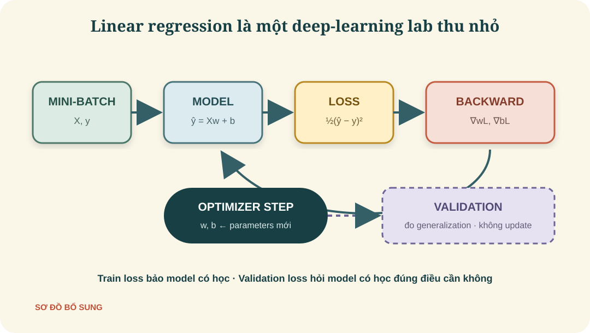
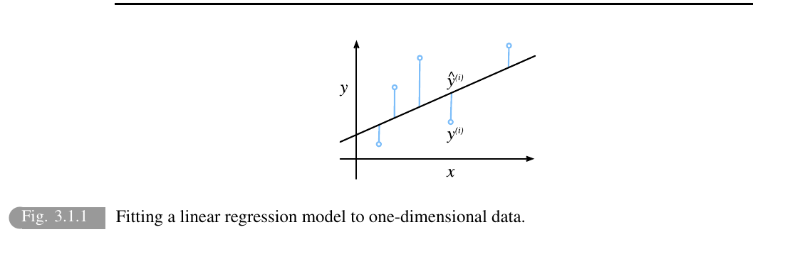
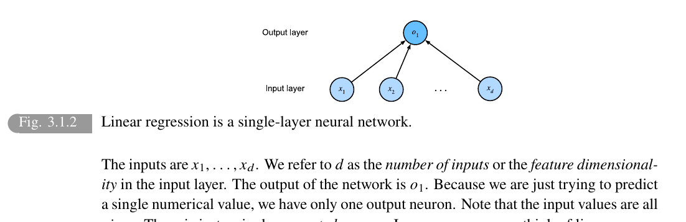
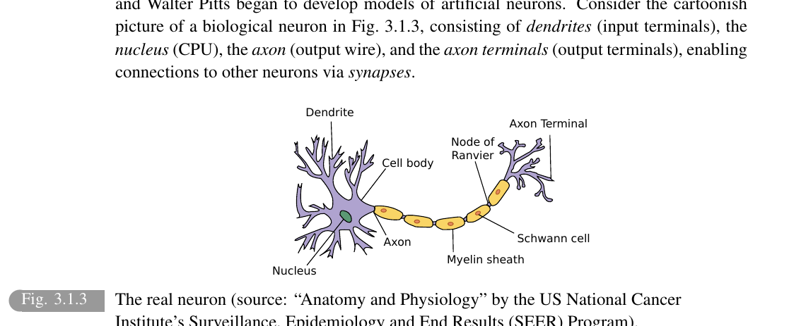
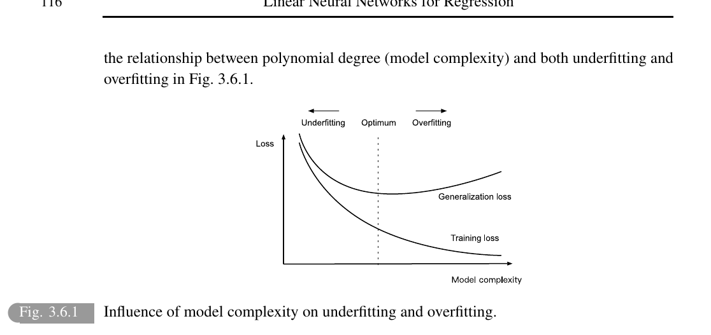
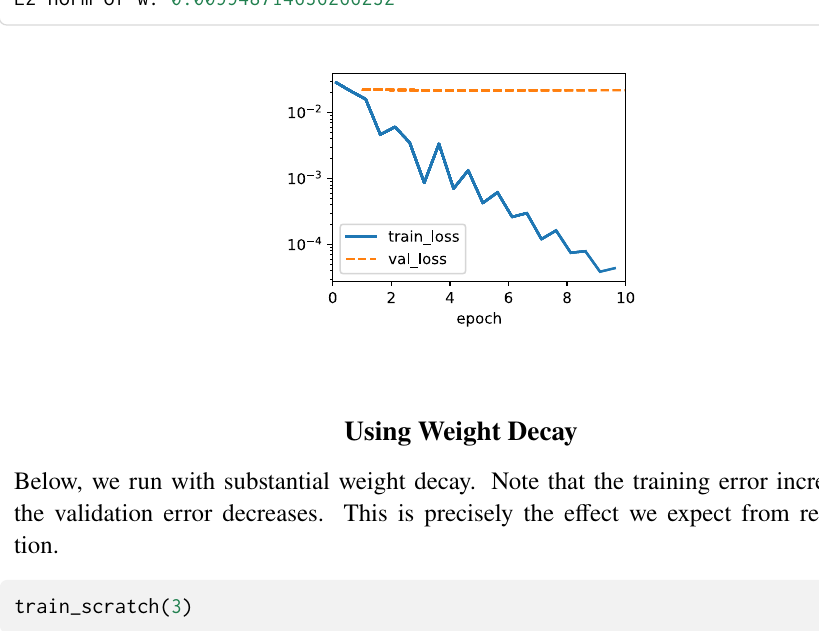
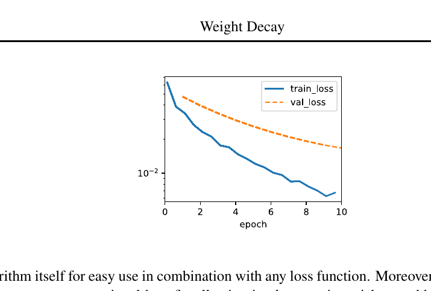

# Linear Neural Networks for Regression

> **Ý chính trong một câu:** Linear regression là “phòng thí nghiệm thu nhỏ” của deep learning: có model, loss, gradient, mini-batch, optimizer, training loop và bài toán generalization trong một hệ thống đủ đơn giản để ta hiểu từng dòng.

## Mục tiêu học tập

Học xong chương này, bạn có thể:

- viết mô hình $\hat y=Xw+b$ và kiểm tra đúng shape;
- giải thích squared loss, nghiệm giải tích và mini-batch SGD;
- tự sinh dữ liệu, cài linear regression từ đầu rồi cài lại bằng `torch.nn`;
- tổ chức code theo `Module`, `DataModule`, `Trainer`;
- phân biệt training error, validation error và generalization error;
- nhận diện underfitting/overfitting và dùng weight decay để regularize.

## Bản đồ chương



| Khối | Chương này trả lời |
|---|---|
| Model | Dự đoán tuyến tính được viết thế nào? |
| Data | Tạo và chia batch ra sao? |
| Loss | Sai số số thực được đo bằng gì? |
| Optimizer | Gradient sửa $w,b$ thế nào? |
| Generalization | Làm tốt trên mẫu mới hay chỉ nhớ mẫu cũ? |
| Regularization | Kìm độ phức tạp bằng weight decay ra sao? |

## Bức tranh tổng quan

Ta dùng {{term:linear-regression|linear regression}} vì nó vừa có nghiệm toán học rõ ràng, vừa dùng đúng quy trình của neural network lớn. Nếu hiểu sâu chương này, về sau khi model phức tạp hơn bạn vẫn nhận ra cùng bộ xương: forward → loss → backward → update → evaluate.

<!-- pagebreak -->

## 3.1 Linear Regression — Hồi quy tuyến tính

### 3.1.1 Basics — Những viên gạch đầu tiên

Giả sử dự đoán giá nhà từ diện tích $x_1$ và tuổi nhà $x_2$:

#### Model — Mô hình

$$\hat y=w_1x_1+w_2x_2+b.$$

- $x_1,x_2$: features;
- $w_1,w_2$: {{term:weight|weights}}, mức tác động của từng feature;
- $b$: {{term:bias|bias}}, mức nền khi các feature bằng 0;
- $\hat y$: dự đoán, khác $y$ là giá thật.

Đây là {{term:affine-transformation|affine transformation}}. Trong ML người ta thường gọi gọn là “linear” dù có thêm bias.



#### Vector hóa model

Với $n$ examples, mỗi example có $d$ features, đặt $X\in\mathbb R^{n\times d}$, $w\in\mathbb R^d$, $b\in\mathbb R$. Khi đó

$$\hat{\mathbf y}=X\mathbf w+b.$$

Shape đi qua phép tính:

```text
X: (n, d)  @  w: (d,)  ->  Xw: (n,)  +  b: scalar  ->  y_hat: (n,)
```

$b$ được broadcast tới $n$ dự đoán.

#### Loss Function — Đo sai

Squared loss cho example $i$:

$$\ell^{(i)}(w,b)=\frac12\left(\hat y^{(i)}-y^{(i)}\right)^2.$$

Loss của dataset là trung bình:

$$L(w,b)=\frac1n\sum_{i=1}^n\ell^{(i)}(w,b).$$

Hệ số $1/2$ chỉ để đạo hàm của bình phương mất hệ số 2. Bình phương làm lỗi lớn bị phạt mạnh; vì vậy outlier có ảnh hưởng lớn.

<!-- pagebreak -->

#### Analytic Solution — Nghiệm giải tích

Gộp bias vào một cột toàn số 1 trong $X$, nghiệm least squares là

$$w^*=(X^\top X)^{-1}X^\top y,$$

nếu $X^\top X$ khả nghịch. Ý nghĩa: gradient của loss bằng 0 tại nghiệm tối ưu.

Trong code thực tế, **không nên tự tính inverse** vì chậm và kém ổn định số. Dùng least-squares solver:

```python
solution = torch.linalg.lstsq(X, y.unsqueeze(1)).solution
```

Nghiệm giải tích rất đẹp nhưng không mở rộng thuận tiện cho neural network phi tuyến và dataset cực lớn. Vì thế ta học gradient-based optimization.

#### Minibatch Stochastic Gradient Descent

{{term:minibatch-sgd|Minibatch stochastic gradient descent}} chọn một batch $\mathcal B$, tính gradient trung bình rồi cập nhật:

$$
(w,b)\leftarrow(w,b)-\frac{\eta}{|\mathcal B|}
\sum_{i\in\mathcal B}\partial_{(w,b)}\ell^{(i)}(w,b).
$$

- $|\mathcal B|$: batch size;
- $\eta$: {{term:learning-rate|learning rate}};
- batch size và learning rate là {{term:hyperparameter|hyperparameters}} do ta chọn, không phải parameters học từ gradient.

Batch toàn dataset cho gradient chính xác nhưng tốn mỗi bước. Batch rất nhỏ rẻ hơn nhưng nhiễu. Minibatch tận dụng tốt phần cứng và tạo cân bằng thực dụng.

#### Predictions — Dự đoán sau huấn luyện

Sau khi tìm được $\hat w,\hat b$, ta tính $\hat y=X\hat w+\hat b$ cho example mới. Giai đoạn này thường gọi là {{term:inference|inference}}. “Dự đoán” không nhất thiết là tương lai; có thể là ước lượng giá hiện tại.

### 3.1.2 Vectorization for Speed

Không viết vòng lặp Python qua từng example nếu có thể tính cả tensor. Matrix operations đẩy công việc xuống code tối ưu và phần cứng song song.

```python
import time
import torch

n = 100_000
a, b = torch.ones(n), torch.ones(n)
start = time.perf_counter()
c = a + b
print(c.shape, time.perf_counter() - start)
```

### 3.1.3 The Normal Distribution and Squared Loss

Giả sử dữ liệu sinh theo

$$y=w^\top x+b+\epsilon,\qquad \epsilon\sim\mathcal N(0,\sigma^2).$$

Maximize likelihood của dữ liệu tương đương minimize tổng squared errors (bỏ các hằng số không phụ thuộc $w,b$). Vì vậy squared loss không chỉ tiện tính; nó gắn với giả định noise Gaussian, độc lập và variance cố định.

Nếu noise có outlier nặng hoặc variance đổi theo $x$, giả định này yếu; MAE, Huber loss hoặc mô hình phân phối khác có thể hợp hơn.

<!-- pagebreak -->

### 3.1.4 Linear Regression as a Neural Network

Linear regression có thể vẽ như neural network một layer: mọi input nối tới output nên là {{term:fully-connected-layer|fully connected layer}}. Nó không có hidden layer hay activation phi tuyến.



#### Biology — Phép ẩn dụ neuron sinh học

Neural network lấy cảm hứng lỏng lẻo từ neuron sinh học: nhiều đầu vào, sự tích hợp tín hiệu và đầu ra. Nhưng artificial neuron là phép toán, không phải mô phỏng đầy đủ tế bào thần kinh.



### 3.1.5 Summary — Điều cần mang theo

Linear regression = affine model + squared loss + cách tìm parameters. Nó vừa có nghiệm đóng vừa có thể học bằng SGD, nên là cầu nối lý tưởng từ toán sang training loop.

### 3.1.6 Exercises — Bài tập nền tảng

<details>
<summary>Bài 1–4: mean, affine, quadratic và rank</summary>

1. Minimize $\sum_i(x_i-b)^2$: cho đạo hàm theo $b$ bằng 0, nhận $b^*=n^{-1}\sum_i x_i$ — sample mean và cũng là MLE của mean khi noise Gaussian. Nếu đổi sang $\sum_i|x_i-b|$, nghiệm là median (hoặc cả khoảng giữa hai giá trị trung tâm khi $n$ chẵn).
2. Đặt $x'=(x,1)$ và $w'=(w,b)$, ta có $x^\top w+b={x'}^\top w'$. Affine trên $x$ chính là linear trên không gian đã thêm tọa độ hằng 1.
3. Muốn quadratic, tạo feature layer chứa mọi $x_i$ và $x_ix_j$ với $j\le i$, rồi dùng một linear output. Hai linear layers thông thường không tự sinh tích $x_ix_j$.
4. Nếu $X^\top X$ không full rank, inverse không tồn tại và parameters không duy nhất. Pseudoinverse hoặc L2 regularization cho nghiệm xác định. Thêm noise IID variance $\sigma^2$ làm full rank với xác suất 1 trong điều kiện thường; $E[(X+E)^\top(X+E)]=X^\top X+n\sigma^2I$. SGD vẫn tối ưu prediction trong column space, còn thành phần null space phụ thuộc initialization.
</details>

<details>
<summary>Bài 5–6: Laplace noise và hai linear layers</summary>

5. Với $p(\epsilon)=\tfrac12e^{-|\epsilon|}$, negative log-likelihood bằng hằng số cộng $\sum_i|y_i-x_i^\top w-b|$. Bài toán đa biến thường không có closed form; dùng minibatch subgradient với dấu của residual. Gần optimum, điểm không trơn khiến bước cố định dao động; dùng learning rate giảm dần hoặc Huber loss.
6. Hợp hai linear/affine layers vẫn chỉ là một affine layer: $W_2(W_1x+b_1)+b_2=(W_2W_1)x+(W_2b_1+b_2)$. Cần activation phi tuyến giữa hai tầng để tăng sức biểu diễn.
</details>

<details>
<summary>Bài 7–8: giá thực tế và số táo bán được</summary>

7. Additive Gaussian noise cho phép giá âm và giả định cùng một mức dao động tuyệt đối ở mọi giá. Regression trên log-price bảo đảm prediction sau khi mũ hóa là dương và hợp với biến động theo tỉ lệ. Với penny stock, tick size làm giá rời rạc và một tick là thay đổi phần trăm rất lớn; thanh khoản cũng giới hạn mức giá giao dịch được.
8. Số táo là số nguyên không âm nên Gaussian không hợp. Với $K\sim\operatorname{Poisson}(\lambda)$, $E[K]=\sum_{k\ge1}k e^{-\lambda}\lambda^k/k!=\lambda$. NLL bỏ hằng số là $\lambda-k\log\lambda$; nếu model dự đoán $a=\log\lambda$, loss là $e^a-ka$ cộng $\log k!$.
</details>

<!-- pagebreak -->

## 3.2 Object-Oriented Design for Implementation

Sách giới thiệu cách tổ chức thí nghiệm để tránh notebook biến thành một chuỗi cell phụ thuộc lộn xộn.

### 3.2.1 Utilities — Tiện ích

Một decorator kiểu `add_to_class` có thể gắn method vào class sau khi định nghĩa. Đây là kỹ thuật phục vụ cách trình bày của sách; trong dự án thật, viết method trực tiếp hoặc dùng composition thường dễ theo dõi hơn.

### 3.2.2 Models — Module

{{term:module|Module}} đóng gói model, forward pass, loss, optimizer và logging. Tư duy quan trọng hơn class cụ thể: một đối tượng chịu trách nhiệm cho “model học thế nào”.

### 3.2.3 Data — DataModule

{{term:data-module|DataModule}} chịu trách nhiệm tạo dữ liệu, chia train/validation, batching và preprocessing. Nhờ vậy model không phải biết dữ liệu đến từ CSV, ảnh hay dữ liệu giả.

### 3.2.4 Training — Trainer

{{term:trainer|Trainer}} điều phối:

```text
for epoch:
    for batch in train_dataloader:
        loss = model.training_step(batch)
        backward + optimizer step
    evaluate on validation_dataloader
```

Tách trách nhiệm giúp thay model mà giữ data/trainer, hoặc thay data mà giữ model. Nhưng đừng tạo abstraction quá sớm cho thí nghiệm vài dòng.

### 3.2.5 Summary

Ba vai trò: **Module biết phép học**, **DataModule biết dữ liệu**, **Trainer biết lịch chạy**.

### 3.2.6 Exercises

<details>
<summary>2 bài thiết kế</summary>

1. Các bản đầy đủ của `HyperParameters`, `ProgressBoard`, `Module`, `DataModule` và `Trainer` nằm trong thư viện D2L. Khi đã quen, hãy đọc source để thấy `save_hyperparameters` thu thập arguments và Trainer nối các object; kỹ thuật này phục vụ cách trình bày của sách, không phải API bắt buộc của PyTorch.
2. Nếu bỏ `self.save_hyperparameters()` khỏi `B.__init__`, `self.a` và `self.b` không tự xuất hiện; truy cập chúng sẽ gây `AttributeError` trừ khi tự gán `self.a=a`, `self.b=b`. Lý do: base class dùng inspection để sao chép constructor arguments thành attributes.
</details>

<!-- pagebreak -->

## 3.3 Synthetic Regression Data — Dữ liệu hồi quy tổng hợp

Ta tạo dữ liệu biết trước “đáp án thật” để kiểm tra code huấn luyện:

$$y=Xw+b+\epsilon,$$

với $w=[2,-3.4]^\top$, $b=4.2$, $\epsilon\sim\mathcal N(0,0.01^2)$.

### 3.3.1 Generating the Dataset

```python
import torch

torch.manual_seed(42)
n, d = 1000, 2
true_w = torch.tensor([2.0, -3.4])
true_b = 4.2
X = torch.randn(n, d)
y = X @ true_w + true_b
y += torch.randn_like(y) * 0.01
print(X.shape, y.shape)  # (1000, 2), (1000,)
```

Đây là unit test cho quy trình: nếu model đúng và optimizer hoạt động, learned parameters phải gần `true_w`, `true_b`.

### 3.3.2 Reading the Dataset — Chia minibatch

```python
def data_iter(batch_size, X, y):
    indices = torch.randperm(len(X))
    for start in range(0, len(X), batch_size):
        batch = indices[start:start + batch_size]
        yield X[batch], y[batch]
```

Mỗi epoch xáo trộn thứ tự để batch không mang cấu trúc cố định. Batch cuối có thể nhỏ hơn.

### 3.3.3 Concise Implementation of the Data Loader

```python
from torch.utils.data import DataLoader, TensorDataset

loader = DataLoader(TensorDataset(X, y), batch_size=32, shuffle=True)
features, labels = next(iter(loader))
print(features.shape, labels.shape)  # (32, 2), (32,)
```

### 3.3.4 Summary

Dữ liệu tổng hợp giúp phân biệt bug code với độ khó dữ liệu thật. `DataLoader` chuẩn hóa batching, shuffle và có thể song song hóa việc đọc.

### 3.3.5 Exercises

<details>
<summary>4 nhóm bài về synthetic data và loader</summary>

1. Nếu số examples không chia hết batch size, batch cuối ngắn hơn. Với `DataLoader(..., drop_last=True)`, có thể bỏ batch cuối; thường không cần bỏ trừ khi layer/thuật toán đòi shape cố định.
2. Dataset quá lớn thì không giữ hết trong RAM: đọc theo shard/chunk, memory-map hoặc streaming. Để shuffle trên đĩa, trộn thứ tự các shard rồi trộn trong buffer; một pseudorandom permutation theo index tránh lưu cả bảng hoán vị và giảm random I/O.
3. Generator on-the-fly chỉ cần sinh `X_batch`, noise và `y_batch` bên trong `__iter__`; mỗi lần gọi iterator dùng trạng thái RNG tiếp theo nên có dữ liệu mới.
4. Muốn mỗi lần giống nhau, tạo `torch.Generator()` với seed cố định **bên trong** lần bắt đầu iterator, hoặc cache dataset. Seed một lần bên ngoài không đủ vì RNG state vẫn tiến.
</details>

<!-- pagebreak -->

## 3.4 Linear Regression Implementation from Scratch

“From scratch” ở đây vẫn dùng tensor và autograd, nhưng tự viết model, loss, update và loop.

### 3.4.1 Defining the Model

```python
torch.manual_seed(42)
w = torch.randn(d, requires_grad=True) * 0.01
w = w.detach().requires_grad_()  # biến thành leaf tensor
b = torch.zeros(1, requires_grad=True)

def linear(X, w, b):
    return X @ w + b
```

Khởi tạo nhỏ phá đối xứng và tránh dự đoán ban đầu quá lớn. `w` phải là leaf tensor để `.grad` được điền trực tiếp.

### 3.4.2 Defining the Loss Function

```python
def squared_loss(y_hat, y):
    return (y_hat - y) ** 2 / 2
```

Hàm trả loss từng example; training step lấy mean.

### 3.4.3 Defining the Optimization Algorithm

```python
def sgd(params, lr):
    with torch.no_grad():
        for param in params:
            param -= lr * param.grad
            param.grad.zero_()
```

`torch.no_grad()` rất quan trọng: update parameter là thao tác của optimizer, không nên trở thành một phần của graph tiếp theo.

### 3.4.4 Training

```python
lr, epochs, batch_size = 0.03, 3, 32

for epoch in range(epochs):
    for X_batch, y_batch in data_iter(batch_size, X, y):
        loss = squared_loss(linear(X_batch, w, b), y_batch).mean()
        loss.backward()
        sgd([w, b], lr)
    with torch.no_grad():
        full_loss = squared_loss(linear(X, w, b), y).mean()
    print(f"epoch {epoch + 1}: loss={full_loss.item():.6f}")

print("w error:", true_w - w.detach())
print("b error:", true_b - b.item())
```

Thứ tự bắt buộc: **zero cũ → forward → loss → backward → update**. Ở code trên, `sgd` zero ngay sau update, nên batch kế tiếp sạch gradient.

### 3.4.5 Summary

Bạn vừa thấy toàn bộ engine huấn luyện. Framework sau này rút gọn cú pháp, không đổi logic.

### 3.4.6 Exercises

<details>
<summary>Bài 1–4: initialization, định luật vật lý và đạo hàm bậc hai</summary>

1. Khởi tạo $w=0$ vẫn học được trong linear regression vì gradient các weight phụ thuộc features và residual. Variance khởi tạo 1000 cho prediction/loss khổng lồ, dễ khiến update bất ổn hoặc overflow; giảm scale hoặc learning rate.
2. Định luật Ohm $V=RI$ là linear regression một feature: input $I$, target $V$, parameter $R$ (và bias nên gần 0). Autograd tối ưu squared loss để ước lượng điện trở.
3. Với Planck’s law, $T$ là parameter dương; tính $B(\lambda,T)$ bằng tensor operations, so với spectral density đo được và backprop theo $T$. Có thể parameterize $T=e^a$ để giữ dương; cần scale đơn vị cẩn thận vì exponential dễ overflow/underflow.
4. Đạo hàm bậc hai cần graph của gradient và tốn bộ nhớ; Hessian đầy đủ tăng theo bình phương số parameters. Dùng `create_graph=True` khi thật sự cần, Hessian-vector product hoặc approximation thay vì dựng Hessian đầy đủ.
</details>

<details>
<summary>Bài 5–7: shape, learning rate và batch cuối</summary>

5. `reshape(y, y_hat.shape)` tránh broadcasting ngoài ý muốn, chẳng hạn `(batch,1) - (batch,)` thành `(batch,batch)` thay vì `(batch,1)`.
6. Learning rate lớn hơn có thể giảm loss nhanh rồi diverge; tăng epochs chỉ giúp nếu update ổn định và chưa hội tụ. Hãy vẽ loss thay vì chọn theo cảm giác.
7. Nếu không chia hết, `data_iter` trả batch cuối nhỏ hơn. Vì loss lấy mean theo batch thật, update vẫn hợp lệ.
</details>

<details>
<summary>Bài 8–9: robust loss và lý do phải shuffle</summary>

8. Với dữ liệu sạch, absolute loss thường hội tụ chậm hơn ở gần optimum do gradient gần như chỉ là dấu. Khi đặt một target thành 10.000, squared loss bị outlier chi phối mạnh còn absolute loss bền hơn. Huber loss dùng bình phương cho residual nhỏ và tuyến tính cho residual lớn để có cả độ mượt lẫn robust.
9. Không shuffle, dữ liệu xếp thành các khối có gradient đối nghịch có thể làm parameters zig-zag hoặc kết thúc epoch lệch về khối cuối. Shuffle làm mỗi minibatch gần đại diện hơn cho toàn dataset.
</details>

<!-- pagebreak -->

## 3.5 Concise Implementation of Linear Regression

PyTorch đã đóng gói các phần chuẩn, giúp ta tập trung vào thiết kế.

### 3.5.1 Defining the Model

```python
from torch import nn

model = nn.Sequential(nn.LazyLinear(1))
```

`LazyLinear(1)` suy ra số input features ở lần forward đầu. Output ban đầu shape `(batch, 1)`, nên ta đưa `y` về cùng shape.

### 3.5.2 Defining the Loss Function

```python
loss_fn = nn.MSELoss()
```

`MSELoss` dùng mean squared error không có hệ số $1/2$. Vị trí optimum không đổi; scale gradient thay đổi.

### 3.5.3 Defining the Optimization Algorithm

```python
optimizer = torch.optim.SGD(model.parameters(), lr=0.03)
```

### 3.5.4 Training

```python
loader = DataLoader(TensorDataset(X, y.unsqueeze(1)), batch_size=32, shuffle=True)

for epoch in range(3):
    for X_batch, y_batch in loader:
        optimizer.zero_grad()
        prediction = model(X_batch)
        loss = loss_fn(prediction, y_batch)
        loss.backward()
        optimizer.step()
    print(epoch + 1, float(loss))
```

Framework lo parameter registration, initialization và update. Bạn vẫn phải kiểm soát shape và thứ tự loop.

### 3.5.5 Summary

“Concise” giảm boilerplate, không thay thế hiểu biết. Khi loss kỳ lạ, quay về checklist: data, shape, forward, loss, gradient, update.

### 3.5.6 Exercises

<details>
<summary>5 nhóm mở rộng concise implementation</summary>

1. Nếu đổi loss từ **tổng** trên batch sang **trung bình**, gradient nhỏ đi batch size lần; để giữ update tương đương, learning rate của mean phải lớn hơn batch size lần so với learning rate của sum (hoặc ngược lại khi chuyển từ mean sang sum).
2. PyTorch có `nn.HuberLoss(delta=σ)`/`nn.SmoothL1Loss`. Huber dùng quadratic gần 0 và linear ngoài ngưỡng, nên ít nhạy outlier hơn MSE mà vẫn mượt quanh optimum.
3. Gradient weight nằm ở `model[0].weight.grad` sau `loss.backward()` và trước `optimizer.zero_grad()` của vòng kế tiếp.
4. Tăng learning rate/epochs chỉ cải thiện đến một ngưỡng; learning rate quá lớn diverge, còn quá nhiều epochs không đưa loss xuống dưới mức noise và có thể làm overfit dữ liệu thật.
5. Khi số mẫu tăng, sai số ước lượng $\hat w-w$, $\hat b-b$ nhìn chung giảm nhưng có dao động ngẫu nhiên. Dùng số mẫu theo cấp số nhân `5,10,20,50,…` vì cần quan sát nhiều bậc độ lớn; sai số thường giảm theo luật lũy thừa chứ không tuyến tính.
</details>

<!-- pagebreak -->

## 3.6 Generalization — Khả năng dùng trên dữ liệu mới

### 3.6.1 Training Error and Generalization Error

{{term:training-error|Training error}} được đo trên dữ liệu đã dùng để fit. {{term:generalization-error|Generalization error}} là sai số kỳ vọng trên dữ liệu mới từ quá trình thật. Ta không biết chính xác đại lượng thứ hai nên ước lượng bằng {{term:validation-set|validation set}} hoặc test set giữ riêng.

Giả định thường dùng là examples độc lập và cùng phân phối — {{term:iid|IID}}. Nếu dữ liệu triển khai đổi, validation IID cũng có thể quá lạc quan.

#### Model Complexity — Độ phức tạp

Model quá đơn giản có bias lớn; quá linh hoạt dễ khớp nhiễu. Complexity phụ thuộc số parameters, miền giá trị của chúng, kiến trúc và lượng dữ liệu, không chỉ một con số.



### 3.6.2 Underfitting or Overfitting?

- {{term:underfitting|Underfitting}}: train error đã cao → model/optimization chưa nắm nổi tín hiệu.
- {{term:overfitting|Overfitting}}: train error thấp nhưng validation error cao → model khớp cả nhiễu hoặc đặc điểm riêng của train set.

#### Polynomial Curve Fitting

Với polynomial regression, degree thấp hơn quy luật thật dễ underfit; degree quá cao trên ít điểm dễ overfit.

#### Dataset Size

Cùng một model, nhiều dữ liệu đại diện thường giảm overfitting. Model phức tạp hơn cần nhiều thông tin hơn để ràng buộc parameters. Dữ liệu trùng lặp hoặc sai nhãn không có giá trị như cùng số mẫu độc lập, sạch.

### 3.6.3 Model Selection — Chọn model

Không dùng test set để thử đi thử lại hyperparameters; như vậy test set trở thành training signal. Quy trình:

1. fit trên training set;
2. chọn hyperparameters bằng validation set;
3. chỉ đánh giá test set ở quyết định cuối.

Khi dữ liệu ít, {{term:cross-validation|K-fold cross-validation}} chia dữ liệu thành $K$ phần, lần lượt dùng một phần làm validation rồi lấy trung bình. Nó tốn khoảng $K$ lần huấn luyện nhưng cho ước lượng ổn định hơn.

### 3.6.4 Summary

Mục tiêu không phải giảm training loss bằng mọi giá, mà là làm tốt trên dữ liệu phù hợp với lúc triển khai.

### 3.6.5 Exercises

<details>
<summary>Bài 1–3: nội suy polynomial, phụ thuộc và lỗi bằng 0</summary>

1. Với $n$ giá trị $x_i$ phân biệt, Vandermonde matrix full rank và polynomial degree tối đa $n-1$ có $n$ hệ số nên nội suy chính xác $n$ labels. Nếu $x$ trùng nhưng $y$ khác thì không một hàm đơn trị nào fit cả hai.
2. Năm ví dụ không nên coi IID: các giá cổ phiếu liên tiếp; frame liên tiếp trong video; nhiều lần khám của cùng bệnh nhân; thành viên cùng gia đình; click do chính recommender trước đó tạo ra. Weather theo vị trí/thời gian là ví dụ thứ sáu.
3. Training error 0 có thể xảy ra khi model đủ sức nội suy, kể cả labels nhiễu. Generalization error 0 chỉ hợp lý khi target là hàm tất định, model học đúng hàm trên toàn support và không có irreducible noise — điều hiếm trong dữ liệu thật.
</details>

<details>
<summary>Bài 4–7: K-fold, VC dimension và lập luận cần thêm data</summary>

4. K-fold huấn luyện gần như toàn bộ pipeline $K$ lần cho mỗi cấu hình, nên compute và thời gian xấp xỉ nhân $K$.
5. Mỗi fold chỉ train trên $(K-1)/K$ dữ liệu, ít hơn model cuối train trên toàn bộ data; vì vậy error thường hơi bi quan cho model cuối. Các ước lượng fold còn tương quan vì training subsets chồng lặp.
6. VC dimension chỉ hỏi có thể gán nhãn tùy ý hay không, bỏ qua magnitude/margin, phân bố dữ liệu và thuật toán chọn lời giải. Hai function classes cùng khả năng shatter có thể có hành vi thực tế rất khác nếu một lớp cần weights cực lớn.
7. Tạo learning curve: lần lượt train với 10%, 20%, 40%, 80%, 100% dữ liệu hiện có và giữ validation cố định. Nếu validation error vẫn giảm đều theo log số mẫu và chưa bão hòa, đó là bằng chứng thực nghiệm để ngoại suy lợi ích của thêm data.
</details>

<!-- pagebreak -->

## 3.7 Weight Decay — Làm nhỏ trọng số để bớt overfit

### 3.7.1 Norms and Weight Decay

{{term:regularization|Regularization}} thêm thiên kiến có chủ đích để ưu tiên lời giải đơn giản hơn. {{term:weight-decay|Weight decay}} thêm L2 penalty:

$$
L_{total}(w,b)=L_{data}(w,b)+\frac{\lambda}{2}\|w\|_2^2.
$$

- $\lambda\ge0$: độ mạnh regularization;
- bias thường không bị phạt;
- $\lambda=0$: không weight decay;
- $\lambda$ lớn: weights bị kéo mạnh về 0.

Gradient penalty là $\lambda w$, nên SGD update có dạng:

$$w\leftarrow(1-\eta\lambda)w-\eta\nabla_wL_{data}.$$

Tên “decay” đến từ hệ số $(1-\eta\lambda)$ làm weight co lại mỗi bước.

L2 thường phân bố ảnh hưởng qua nhiều feature nhỏ. L1 regularization $\lambda\|w\|_1$ có xu hướng tạo nhiều weight đúng bằng 0, hữu ích cho sparsity nhưng không trơn tại 0.

### 3.7.2 High-Dimensional Linear Regression

Sách minh họa tình huống $d=200$ features nhưng chỉ 20 training examples. Model có nhiều tự do hơn dữ liệu, rất dễ khớp noise. Đây là nơi validation gap và weight decay hiện rõ.

### 3.7.3 Implementation from Scratch

```python
def l2_penalty(w):
    return (w ** 2).sum() / 2

data_loss = squared_loss(linear(X_batch, w, b), y_batch).mean()
loss = data_loss + lambd * l2_penalty(w)
loss.backward()
```

Theo dõi cả train/validation loss và `torch.linalg.vector_norm(w)`. Penalty có tác dụng nếu norm giảm và validation cải thiện, không chỉ vì total loss thay đổi.

### 3.7.4 Concise Implementation

Trong PyTorch, optimizer có `weight_decay`:

```python
optimizer = torch.optim.SGD([
    {"params": model[0].weight, "weight_decay": 3.0},
    {"params": model[0].bias, "weight_decay": 0.0},
], lr=0.003)
```





### 3.7.5 Summary

Weight decay đánh đổi một chút fit trên training set để hy vọng prediction ổn định hơn trên dữ liệu mới. Chọn $\lambda$ bằng validation, không bằng test.

### 3.7.6 Exercises

<details>
<summary>6 nhóm bài về regularization</summary>

1. Quét $\lambda$ trên log scale. Khi $\lambda$ tăng, train loss thường tăng và weight norm giảm; validation loss thường giảm rồi tăng — quá ít gây overfit, quá nhiều gây underfit.
2. “Tối ưu” trên validation chỉ là tốt nhất trong các giá trị đã thử và chịu nhiễu lấy mẫu. Có thể nested validation hoặc lặp nhiều seed để ước lượng chắc hơn; trong thực hành, một vùng $\lambda$ ổn định thường quan trọng hơn chữ số cuối.
3. Với L1, $w_i\leftarrow w_i-\eta(\partial_iL+\lambda\operatorname{sign}(w_i))$; tại 0 dùng subgradient trong $[-\lambda,\lambda]$. Proximal update dùng soft-thresholding và tạo đúng số 0 rõ hơn.
4. Với matrix $W$, $\|W\|_F^2=\sum_{ij}W_{ij}^2=\operatorname{tr}(W^\top W)$, là dạng tương tự $w^\top w$.
5. Ngoài weight decay: thêm dữ liệu đại diện, data augmentation, early stopping, model đơn giản hơn, feature selection, dropout hoặc ensemble. Phải chọn bằng validation phù hợp với deployment.
6. MAP estimation tối thiểu hóa `negative log-likelihood + negative log-prior`. Gaussian prior $p(w)\propto\exp(-\lambda\|w\|^2/2)$ cho L2 penalty; Laplace prior cho L1 penalty.
</details>

<!-- pagebreak -->

## Điểm hay và ý nghĩa

- **Một model nhỏ chứa cả deep-learning workflow:** học được linear regression nghĩa là bạn đã chạy qua forward, loss, backward và optimizer.
- **Nghiệm giải tích là mốc kiểm tra:** ta có thể so SGD với lời giải least squares.
- **Generalization đổi mục tiêu tư duy:** một model không được đánh giá bằng việc nhớ quá khứ, mà bằng khả năng dùng trên mẫu mới.
- **Weight decay là thiên kiến có ích:** đôi khi chấp nhận train loss cao hơn lại làm hệ thống tốt hơn ngoài training set.

## Sau chương này bạn làm được gì?

Bạn có thể tự tạo dataset $y=Xw+b+\epsilon$, viết linear regression bằng tensor/autograd, huấn luyện bằng mini-batch SGD, kiểm tra learned parameters, chuyển sang API `nn`, chia validation đúng vai trò và chẩn đoán underfit/overfit. Bạn cũng biết thêm L2 penalty và chọn $\lambda$ dựa trên validation.

## Tóm tắt kiến thức — Một training loop để nhớ

```python
for X_batch, y_batch in loader:
    optimizer.zero_grad()       # 1. xóa gradient cũ
    y_hat = model(X_batch)      # 2. forward
    loss = loss_fn(y_hat, y_batch)  # 3. đo sai
    loss.backward()             # 4. chain rule
    optimizer.step()            # 5. cập nhật parameters
```

Sau mỗi epoch: đo validation, quan sát gap, rồi mới quyết định model, data hay regularization cần thay đổi.

## Bài tập tổng kết có lời giải

### Bài A — Một update bằng tay

Một example có $x=2$, $y=5$, model $\hat y=wx+b$ với $w=1,b=0$. Dùng loss $\frac12(\hat y-y)^2$ và $\eta=0.1$. Tính một bước SGD.

<details>
<summary>Gợi ý rồi lời giải</summary>

Known: $\hat y=2$, residual $r=-3$. $\partial\ell/\partial w=rx=-6$, $\partial\ell/\partial b=r=-3$.

$$w\leftarrow1-0.1(-6)=1.6,\qquad b\leftarrow0-0.1(-3)=0.3.$$

Dự đoán mới là $1.6\cdot2+0.3=3.5$, gần 5 hơn. **Bẫy:** quên nhân gradient của residual với $x$ khi tính theo $w$.
</details>

### Bài B — Chẩn đoán learning curves

Train loss giảm tới gần 0, validation loss giảm ba epoch rồi tăng. Điều gì xảy ra và làm gì trước?

<details>
<summary>Gợi ý rồi lời giải</summary>

Đây là dấu hiệu overfitting sau epoch tốt nhất. Giữ checkpoint tại validation minimum; thử thêm data/augmentation, giảm model complexity hoặc tăng regularization. Không tune theo test set.
</details>

### Bài C — Weight decay bằng số

Với $w=4$, data gradient $=2$, $\eta=0.1$, $\lambda=0.5$, update L2 là bao nhiêu?

<details>
<summary>Gợi ý rồi lời giải</summary>

Total gradient $=2+0.5\cdot4=4$. Vậy $w_{new}=4-0.1\cdot4=3.6$. Kiểm tra bằng dạng decay: $(1-0.05)4-0.1\cdot2=3.6$.
</details>

<!-- pagebreak -->

## Thuật ngữ cần nhớ

| English term | Hiểu ngắn gọn |
|---|---|
| Linear regression | dự đoán số bằng tổ hợp tuyến tính của features |
| Weight / bias | mức tác động của feature / mức nền |
| Squared loss | phạt bình phương residual |
| Mini-batch SGD | ước lượng gradient từ một nhóm nhỏ rồi update |
| Learning rate | độ dài bước update |
| Epoch | một lượt đi qua training set |
| Inference | dùng model đã học để dự đoán |
| Training / validation error | lỗi trên data fit / data dùng chọn thiết kế |
| Generalization | chất lượng trên dữ liệu mới |
| Underfitting / overfitting | chưa học đủ tín hiệu / học cả nhiễu |
| Regularization | thiên kiến giúp hạn chế độ phức tạp |
| Weight decay | L2 regularization làm weights co lại |

## Checklist tự đánh giá

- [ ] Tôi viết được shape của $X,w,b,\hat y$.
- [ ] Tôi giải thích được vì sao squared loss liên quan Gaussian noise.
- [ ] Tôi viết đúng thứ tự zero–forward–loss–backward–step.
- [ ] Tôi dùng `no_grad()` đúng chỗ khi update thủ công.
- [ ] Tôi phân biệt validation set và test set.
- [ ] Tôi nhìn learning curves và chẩn đoán underfit/overfit.
- [ ] Tôi giải thích được tác động của $\lambda$ trong weight decay.

## Nguồn và phạm vi

- Nguồn chính: *Dive into Deep Learning*, Chapter 3 — **Linear Neural Networks for Regression**.
- Trang in: **82–124**; trang vật lý trong `didl.pdf`: **122–164**.
- Figure 3.1.1, 3.1.2, 3.1.3, 3.6.1 và hai đồ thị weight decay được trích trực tiếp từ PDF; mỗi ảnh có `.source.json` provenance.
- Code được viết lại bằng PyTorch để độc lập với helper của sách. “Sơ đồ bổ sung” do vở học tạo, không phải hình gốc.
