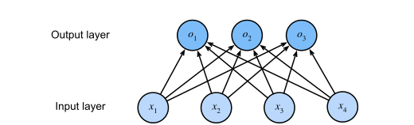

# Linear Neural Networks for Classification

> **Ý chính trong một câu:** chương 3 hỏi *"bao nhiêu?"*; chương này hỏi *"loại nào?"* — và để trả lời, ta phải biến output thô của một layer tuyến tính thành **một phân phối xác suất hợp lệ**, rồi đo sai lệch bằng thước đo đến từ lý thuyết thông tin.

## Mục tiêu học tập

Học xong chương, bạn có thể:

- [ ] giải thích vì sao {{term:one-hot-encoding|one-hot encoding}} phù hợp hơn số nguyên cho nhãn phân loại;
- [ ] viết lại công thức {{term:softmax|softmax}} và nói rõ nó giải quyết hai vấn đề gì của output thô;
- [ ] dẫn ra {{term:cross-entropy-loss|cross-entropy loss}} từ maximum likelihood;
- [ ] chứng minh gradient của cross-entropy là **hiệu giữa dự đoán và thực tế**, và nói vì sao điều đó quan trọng;
- [ ] giải thích {{term:entropy|entropy}}, {{term:surprisal|surprisal}} và cross-entropy bằng ngôn ngữ nén dữ liệu;
- [ ] mô tả thủ thuật {{term:logsumexp|LogSumExp}} và vì sao cần nó;
- [ ] phân biệt {{term:empirical-error|empirical error}} với {{term:population-error|population error}}, và biết cần bao nhiêu mẫu để ước lượng chính xác tới mức mong muốn;
- [ ] giải thích {{term:adaptive-overfitting|adaptive overfitting}} và vì sao dùng lại test set nhiều lần là nguy hiểm;
- [ ] nêu ý nghĩa của {{term:vc-dimension|VC dimension}} và giới hạn thực tế của nó;
- [ ] phân biệt {{term:covariate-shift|covariate shift}}, {{term:label-shift|label shift}} và {{term:concept-shift|concept shift}}, và biết cách sửa covariate shift.

## Bản đồ chương

```text
CÂU HỎI ĐỔI: "bao nhiêu?" → "LOẠI NÀO?"
                    │
   4.1 SOFTMAX REGRESSION — nền tảng toán học
       one-hot → layer tuyến tính → softmax → cross-entropy
       gradient = ŷ − y  (giống hệt linear regression!)
       + lý thuyết thông tin: entropy, surprisal, cross-entropy
                    │
   4.2–4.5 TỪ LÝ THUYẾT SANG CODE CHẠY ĐƯỢC
       4.2 dataset Fashion-MNIST   4.3 lớp Classifier cơ sở
       4.4 hiện thực từ đầu        4.5 hiện thực gọn + LogSumExp
                    │
   4.6 KHI NÀO TIN ĐƯỢC KẾT QUẢ? (lý thuyết)
       test set → sai số O(1/√n) → dùng lại test set thì hỏng
       → VC dimension: đảm bảo a priori nhưng quá bi quan
                    │
   4.7 KHI THẾ GIỚI THAY ĐỔI (thực tế)
       covariate shift | label shift | concept shift
       → phát hiện và hiệu chỉnh → và trách nhiệm khi triển khai
```

## Bức tranh tổng quan

Mục 3.1 đã giới thiệu linear regression. **Regression là cái búa ta với tay lấy khi muốn trả lời câu hỏi *bao nhiêu?*** — giá nhà bao nhiêu đô la, đội bóng thắng bao nhiêu trận, bệnh nhân nằm viện bao nhiêu ngày.

Chương này gác lại câu hỏi *bao nhiêu?* để tập trung vào câu hỏi ***loại nào?***:

- Email này thuộc thư mục spam hay hộp thư đến?
- Khách hàng này có khả năng đăng ký dịch vụ hay không?
- Ảnh này là con lừa, con chó, con mèo, hay con gà trống?

**Một lưu ý về thuật ngữ.** Sách chỉ ra rằng giới thực hành dùng chữ "classification" cho **hai** bài toán hơi khác nhau: (i) những bài chỉ quan tâm tới **gán cứng** ví dụ vào một lớp; và (ii) những bài muốn **gán mềm**, tức đánh giá **xác suất** mỗi lớp. Ranh giới hay bị mờ, một phần vì ngay cả khi chỉ cần gán cứng, ta vẫn thường dùng model gán mềm.

Còn có những trường hợp **nhiều nhãn cùng đúng** — một bài báo có thể đồng thời thuộc chủ đề giải trí, kinh doanh và du hành vũ trụ. Bài toán đó gọi là **multilabel classification**, nằm ngoài phạm vi chương này.

**Điều bạn cần mang theo:** linear regression và minibatch SGD (chương 3), khái niệm overfitting/generalization (mục 3.6), và các thao tác tensor cơ bản (chương 2).

**Hai nửa của chương.** Nửa đầu (4.1–4.5) xây dựng và hiện thực softmax regression. Nửa sau (4.6–4.7) lùi lại một bước để hỏi hai câu khó hơn: *"con số accuracy tôi báo cáo đáng tin tới đâu?"* và *"nếu thế giới thay đổi sau khi tôi triển khai thì sao?"*. Hai mục này ít công thức hơn nhưng có lẽ **quan trọng hơn** cho người làm thật.

<!-- pagebreak -->

## 4.1 Softmax Regression

### 4.1.1 Classification

**Bài toán đồ chơi.** Mỗi input là một ảnh xám $2\times2$. Ta biểu diễn mỗi pixel bằng một số vô hướng, được bốn feature $x_1, x_2, x_3, x_4$. Mỗi ảnh thuộc một trong ba lớp: "mèo", "gà", "chó".

**Chọn cách biểu diễn nhãn thế nào?** Có hai lựa chọn hiển nhiên.

Cách tự nhiên nhất là chọn $y \in \{1, 2, 3\}$, trong đó các số nguyên đại diện cho $\{\text{chó}, \text{mèo}, \text{gà}\}$. Đây là cách **lưu trữ** thông tin rất tốt trên máy tính. Và nếu các lớp có **thứ tự tự nhiên** — ví dụ dự đoán $\{\text{sơ sinh}, \text{tập đi}, \text{thiếu niên}, \text{thanh niên}, \text{trưởng thành}, \text{cao tuổi}\}$ — thì thậm chí nên coi đây là bài toán **ordinal regression** và giữ nguyên định dạng đó.

Nhưng nói chung, **bài toán phân loại không đi kèm thứ tự tự nhiên giữa các lớp**. Nếu gán mèo = 1, gà = 2, chó = 3, ta vô tình nói với model rằng "gà nằm giữa mèo và chó", và "chó xa mèo gấp đôi gà xa mèo" — những phát biểu hoàn toàn vô nghĩa.

May mắn là các nhà thống kê đã nghĩ ra cách biểu diễn dữ liệu phân loại từ lâu: **{{term:one-hot-encoding|one-hot encoding}}**. Đó là một vector có số thành phần bằng số lớp; thành phần ứng với lớp của ví dụ được đặt bằng 1, mọi thành phần khác bằng 0:

$$
y \in \{(1,0,0),\ (0,1,0),\ (0,0,1)\}
$$

tương ứng với "mèo", "gà", "chó".

**Linear Model.** Để ước lượng xác suất có điều kiện của mọi lớp, ta cần một model có **nhiều output**, mỗi lớp một output. Mỗi output ứng với một hàm affine riêng. Với 4 feature và 3 lớp, ta cần **12** số vô hướng cho weight và **3** cho bias:

$$
\begin{aligned}
o_1 &= x_1 w_{11} + x_2 w_{12} + x_3 w_{13} + x_4 w_{14} + b_1,\\
o_2 &= x_1 w_{21} + x_2 w_{22} + x_3 w_{23} + x_4 w_{24} + b_2,\\
o_3 &= x_1 w_{31} + x_2 w_{32} + x_3 w_{33} + x_4 w_{34} + b_3.
\end{aligned}
$$



Giống linear regression, ta dùng mạng nơ-ron **một tầng**. Và vì mỗi output $o_1, o_2, o_3$ phụ thuộc vào **mọi** input $x_1, \ldots, x_4$, output layer cũng được gọi là **fully connected layer**.

Viết gọn bằng vector và ma trận: $\mathbf{o} = \mathbf{W}\mathbf{x} + \mathbf{b}$, với $\mathbf{W}$ là ma trận $3\times4$ và $\mathbf{b} \in \mathbb{R}^3$.

> **Một chi tiết tinh tế của sách:** về lý thuyết ta chỉ cần **ít hơn một** output, vì lớp cuối bằng 1 trừ tổng các lớp còn lại. Nhưng **vì lý do đối xứng**, sách dùng cách tham số hoá hơi dư thừa. Đây là lựa chọn thiết kế, không phải sai sót.

### The Softmax — vì sao không dùng thẳng $\mathbf{o}$?

Ta có thể thử tối thiểu hoá trực tiếp sai khác giữa $\mathbf{o}$ và nhãn $\mathbf{y}$. Cách đó **hoạt động tốt một cách đáng ngạc nhiên**, nhưng vẫn không thoả đáng vì hai lý do:

1. **Không có gì đảm bảo output cộng lại bằng 1** như xác suất phải thế.
2. **Không có gì đảm bảo output không âm**, hay không vượt quá 1.

Cả hai làm bài toán ước lượng khó giải và nghiệm rất **mong manh với outlier**. Sách cho một ví dụ sinh động: nếu ta giả định có phụ thuộc tuyến tính dương giữa số phòng ngủ và khả năng ai đó mua nhà, thì xác suất có thể **vượt quá 1** khi gặp một căn biệt thự!

Vậy ta cần một cơ chế để "ép" output vào khuôn.

**Cách của softmax.** Dùng hàm mũ $P(y = i) \propto \exp(o_i)$. Điều này thoả mãn yêu cầu: xác suất tăng theo $o_i$, đơn điệu, và **luôn không âm**. Sau đó **chuẩn hoá** bằng cách chia cho tổng:

$$
\hat{\mathbf{y}} = \operatorname{softmax}(\mathbf{o})
\quad\text{với}\quad
\hat{y}_i = \frac{\exp(o_i)}{\sum_j \exp(o_j)}.
$$

**Đọc công thức bằng lời:** tử số biến mọi số thực — kể cả số âm — thành số dương. Mẫu số cộng tất cả lại để chúng tổng bằng 1. Vì $\exp$ đơn điệu tăng, **thứ tự được bảo toàn**: $o_i > o_j \Rightarrow \hat{y}_i > \hat{y}_j$. Nói cách khác, softmax **không đổi kết luận**, nó chỉ biến điểm số thành xác suất.

**Kiểm tra bằng số.** Với $\mathbf{o} = (1, 2, 3)$: $e^1 \approx 2.72$, $e^2 \approx 7.39$, $e^3 \approx 20.09$; tổng $\approx 30.2$. Vậy $\hat{\mathbf{y}} \approx (0.09,\ 0.24,\ 0.67)$. Cộng lại đúng bằng 1 ✓, và lớp 3 vẫn thắng ✓.

> **Ranh giới:** sách nêu một cách khác là **probit model** — giả định $\mathbf{y} = \mathbf{o} + \boldsymbol{\epsilon}$ với nhiễu chuẩn. Nó hấp dẫn về mặt ý tưởng nhưng **không hiệu quả bằng** và không cho bài toán tối ưu đẹp như softmax.

### 4.1.2 Loss Function

**Log-Likelihood.** Softmax cho ta $\hat{\mathbf{y}}$, hiểu là xác suất có điều kiện ước lượng của mỗi lớp. Ta so sánh ước lượng với thực tế bằng cách hỏi: *theo model của ta, các lớp thật có xác suất bao nhiêu?*

$$
P(\mathbf{Y} \mid \mathbf{X}) = \prod_{i=1}^{n} P(\mathbf{y}^{(i)} \mid \mathbf{x}^{(i)}).
$$

Vì tích của nhiều số hạng rất bất tiện, ta lấy **logarit âm** để có bài toán tương đương là cực tiểu negative log-likelihood:

$$
-\log P(\mathbf{Y}\mid\mathbf{X}) = \sum_{i=1}^{n} -\log P(\mathbf{y}^{(i)}\mid\mathbf{x}^{(i)})
= \sum_{i=1}^{n} l(\mathbf{y}^{(i)}, \hat{\mathbf{y}}^{(i)}),
$$

trong đó với mỗi cặp nhãn $\mathbf{y}$ và dự đoán $\hat{\mathbf{y}}$ trên $q$ lớp, hàm loss là:

$$
l(\mathbf{y}, \hat{\mathbf{y}}) = -\sum_{j=1}^{q} y_j \log \hat{y}_j .
$$

Hàm loss này gọi là **{{term:cross-entropy-loss|cross-entropy loss}}**.

**Hai quan sát quan trọng về nó:**

1. Vì $\mathbf{y}$ là one-hot, **tổng qua mọi toạ độ $j$ triệt tiêu hết trừ đúng một số hạng**. Nói cách khác, loss chỉ quan tâm tới xác suất mà model gán cho **lớp đúng**.
2. Loss **bị chặn dưới bởi 0**: không thành phần nào của $\hat{\mathbf{y}}$ lớn hơn 1, nên logarit âm của chúng không thể nhỏ hơn 0. Và $l = 0$ **chỉ khi** ta dự đoán lớp đúng với **độ chắc chắn tuyệt đối** — điều **không bao giờ xảy ra** với tham số hữu hạn, vì đẩy một output softmax tới 1 đòi hỏi đẩy input tương ứng tới vô cùng.

> **Một hệ quả đáng nhớ:** ngay cả khi model có thể gán xác suất 0 cho một lớp, bất kỳ sai lầm nào khi gán độ tự tin cao như vậy sẽ chịu **loss vô hạn** ($\log 0 = -\infty$). Cross-entropy **phạt rất nặng sự tự tin sai lầm** — đây là một tính chất, không phải lỗi.

### Softmax và Cross-Entropy — gradient đẹp đến bất ngờ

Thay định nghĩa softmax vào loss, ta được:

$$
\begin{aligned}
l(\mathbf{y}, \hat{\mathbf{y}}) &= -\sum_{j=1}^{q} y_j \log \frac{\exp(o_j)}{\sum_{k=1}^{q}\exp(o_k)} \\
&= \sum_{j=1}^{q} y_j \log \sum_{k=1}^{q}\exp(o_k) - \sum_{j=1}^{q} y_j o_j \\
&= \log \sum_{k=1}^{q}\exp(o_k) - \sum_{j=1}^{q} y_j o_j .
\end{aligned}
$$

(Bước cuối dùng $\sum_j y_j = 1$ vì $\mathbf{y}$ là one-hot.)

Giờ lấy đạo hàm theo một logit $o_j$ bất kỳ:

$$
\partial_{o_j} l(\mathbf{y}, \hat{\mathbf{y}})
= \frac{\exp(o_j)}{\sum_{k=1}^{q}\exp(o_k)} - y_j
= \operatorname{softmax}(\mathbf{o})_j - y_j .
$$

**Đây là kết quả đẹp nhất của cả mục.** Đạo hàm chính là **hiệu giữa xác suất model gán và điều thực sự xảy ra**.

Theo đúng lời sách: điều này **rất giống** thứ ta đã thấy ở regression, nơi gradient là hiệu giữa quan sát $y$ và ước lượng $\hat{y}$. **Và đó không phải trùng hợp.** Trong **mọi** model thuộc họ mũ (exponential family), gradient của log-likelihood đều có đúng dạng này. Sự thật đó khiến việc tính gradient trở nên rất dễ trong thực tế.

**Nhãn mềm.** Nếu thay vì quan sát một kết quả duy nhất, ta quan sát **cả một phân phối** trên các kết quả — ví dụ $\mathbf{y} = (0.1, 0.2, 0.7)$ thay vì $(0,0,1)$ — thì **công thức loss vẫn hoạt động tốt**, chỉ là cách diễn giải tổng quát hơn: nó là **kỳ vọng** của loss trên phân phối nhãn.

### 4.1.3 Information Theory Basics

Nhiều bài báo deep learning dùng trực giác và thuật ngữ từ lý thuyết thông tin. Sách gọi mục này là **"cẩm nang sinh tồn"** — chỉ đủ để hiểu tên gọi.

**{{term:entropy|Entropy}}.** Ý tưởng trung tâm của lý thuyết thông tin là **lượng hoá lượng thông tin chứa trong dữ liệu**. Với một phân phối $P$, entropy của nó là:

$$
H[P] = \sum_j -P(j)\log P(j).
$$

Một trong các định lý nền tảng nói rằng để mã hoá dữ liệu rút ngẫu nhiên từ $P$, ta cần **ít nhất $H[P]$ "nat"** (Shannon, 1948).

> **"Nat" là gì?** Nó là đơn vị tương đương bit nhưng dùng cơ số $e$ thay vì cơ số 2. Vậy một nat bằng $\frac{1}{\log 2} \approx 1.44$ bit.

**{{term:surprisal|Surprisal}} — nén và dự đoán là một.** Bạn có thể tự hỏi nén thì liên quan gì tới dự đoán. Hãy hình dung một dòng dữ liệu cần nén. Nếu ta **luôn dễ dàng đoán được token kế tiếp**, thì dữ liệu đó dễ nén. Lấy ví dụ cực đoan: mọi token trong dòng đều giống nhau. Dòng đó rất nhàm chán — và cũng **rất dễ đoán**. Vì token luôn như nhau, ta **không cần truyền thông tin gì cả** để mô tả nội dung dòng.

> **Dễ đoán thì dễ nén.**

Nhưng nếu ta không đoán hoàn hảo được mọi sự kiện, thỉnh thoảng ta sẽ **ngạc nhiên**. Độ ngạc nhiên **lớn hơn khi sự kiện được gán xác suất thấp hơn**. Claude Shannon chọn

$$
\log \frac{1}{P(j)} = -\log P(j)
$$

để lượng hoá **độ ngạc nhiên** khi quan sát sự kiện $j$ mà ta đã gán cho nó xác suất (chủ quan) $P(j)$.

Và entropy chính là **độ ngạc nhiên kỳ vọng** khi ta gán đúng những xác suất khớp với quá trình sinh dữ liệu thật.

**Cross-Entropy nhìn lại.** Nếu entropy là mức ngạc nhiên của người **biết** xác suất thật, thì cross-entropy là gì?

Cross-entropy **từ $P$ tới $Q$**, ký hiệu $H(P, Q)$, là **độ ngạc nhiên kỳ vọng của một người quan sát có xác suất chủ quan $Q$ khi nhìn thấy dữ liệu thực ra được sinh theo $P$**:

$$
H(P, Q) \stackrel{\text{def}}{=} \sum_j -P(j)\log Q(j).
$$

Cross-entropy thấp nhất đạt được khi $Q = P$; khi đó $H(P,P) = H(P)$.

**Tóm lại, ta có thể hiểu mục tiêu cross-entropy theo hai cách:**

| Cách hiểu | Phát biểu |
|---|---|
| Thống kê | **cực đại likelihood** của dữ liệu quan sát được |
| Lý thuyết thông tin | **cực tiểu độ ngạc nhiên** (và do đó số bit) cần để truyền đạt các nhãn |

### 4.1.4 Summary and Discussion

- Trong mục này ta gặp hàm loss **không tầm thường đầu tiên**, cho phép tối ưu trên **không gian output rời rạc**. Điểm then chốt trong thiết kế là ta đã dùng cách tiếp cận **xác suất**, coi các lớp rời rạc như những lần rút từ một phân phối xác suất.
- Ta gặp **softmax**, một activation function tiện lợi biến output của một layer thông thường thành **phân phối xác suất rời rạc hợp lệ**.
- Đạo hàm của cross-entropy loss khi kết hợp với softmax **hành xử rất giống** đạo hàm của squared error: nó lấy **hiệu giữa hành vi kỳ vọng và dự đoán**.
- Ta chạm tới những liên hệ thú vị với **vật lý thống kê** và **lý thuyết thông tin**.

**Một lưu ý về chi phí tính toán mà sách nêu rõ:** với bất kỳ fully connected layer nào có $d$ input và $q$ output, chi phí tham số và tính toán là $O(dq)$ — có thể **cao đến mức không dùng được** trong thực tế. May mắn là chi phí này giảm được bằng xấp xỉ và nén. Ví dụ Deep Fried Convnets dùng kết hợp hoán vị, biến đổi Fourier và co giãn để giảm từ **bậc hai xuống log-tuyến tính**.

### 4.1.5 Exercises

1. Ta có thể khám phá sâu hơn mối liên hệ giữa **họ phân phối mũ** và softmax.
   1. Tính **đạo hàm bậc hai** của cross-entropy loss $l(\mathbf{y}, \hat{\mathbf{y}})$ cho softmax.
   2. Tính **phương sai** của phân phối cho bởi $\operatorname{softmax}(\mathbf{o})$ và chỉ ra rằng nó **khớp** với đạo hàm bậc hai tính ở trên.
2. Giả sử ta có ba lớp xuất hiện với xác suất bằng nhau, tức vector xác suất là $(\tfrac13, \tfrac13, \tfrac13)$.
   1. Vấn đề gì xảy ra nếu ta cố thiết kế một **mã nhị phân** cho nó?
   2. Bạn thiết kế được mã tốt hơn không? Gợi ý: chuyện gì xảy ra nếu ta mã hoá **hai quan sát độc lập**? Còn nếu mã hoá $n$ quan sát cùng lúc?
3. Khi mã hoá tín hiệu truyền trên dây vật lý, kỹ sư không phải lúc nào cũng dùng mã nhị phân. Ví dụ **PAM-3** dùng **ba** mức tín hiệu $\{-1, 0, 1\}$ thay vì hai mức $\{0, 1\}$. Bạn cần bao nhiêu đơn vị **tam phân** để truyền một số nguyên trong khoảng $\{0, \ldots, 7\}$? Vì sao điều này có thể là ý hay xét về mặt điện tử?
4. **Bradley–Terry model** dùng model logistic để mô tả sở thích. Để người dùng chọn giữa táo và cam, ta giả định có điểm số $o_{\text{apple}}$ và $o_{\text{orange}}$. Yêu cầu là điểm số lớn hơn phải dẫn tới khả năng chọn cao hơn, và món có điểm cao nhất là món có khả năng được chọn cao nhất (Bradley và Terry, 1952). Hãy **chứng minh softmax thoả mãn yêu cầu này**.

<details markdown="1"><summary>Gợi ý</summary>

Câu 1: lấy đạo hàm lần nữa biểu thức $\partial_{o_j} l = \hat{y}_j - y_j$, nhớ rằng $\hat{y}_j$ **phụ thuộc vào mọi** $o_k$. Câu 2: entropy của phân phối đều trên 3 lớp là $\log_2 3 \approx 1.585$ bit — con số đó có phải số nguyên không? Câu 4: softmax là **đơn điệu** theo từng logit; đó chính là toàn bộ điều cần chứng minh.
</details>

<details markdown="1"><summary>Lời giải</summary>

**Câu 1.**

**(a) Đạo hàm bậc hai.** Ta đã có $\partial_{o_j} l = \hat{y}_j - y_j$. Lấy đạo hàm lần nữa theo $o_k$:

$$
\partial^2_{o_j o_k} l = \partial_{o_k}\hat{y}_j .
$$

Với $\hat{y}_j = \frac{\exp(o_j)}{\sum_i \exp(o_i)}$, quy tắc thương cho:

$$
\partial_{o_k}\hat{y}_j =
\begin{cases}
\hat{y}_j(1 - \hat{y}_j) & \text{nếu } j = k \\
-\hat{y}_j \hat{y}_k & \text{nếu } j \ne k
\end{cases}
$$

Viết gọn thành ma trận Hessian:
$$
\nabla^2_{\mathbf{o}}\, l = \operatorname{diag}(\hat{\mathbf{y}}) - \hat{\mathbf{y}}\hat{\mathbf{y}}^\top .
$$

**(b) Phương sai.** Xét biến ngẫu nhiên $Z$ nhận giá trị $j$ với xác suất $\hat{y}_j$, và vector chỉ thị one-hot $\mathbf{e}_Z$ của nó. Khi đó:

$$
\operatorname{Cov}(\mathbf{e}_Z) = \mathbb{E}[\mathbf{e}_Z\mathbf{e}_Z^\top] - \mathbb{E}[\mathbf{e}_Z]\mathbb{E}[\mathbf{e}_Z]^\top
= \operatorname{diag}(\hat{\mathbf{y}}) - \hat{\mathbf{y}}\hat{\mathbf{y}}^\top .
$$

(Số hạng đầu là $\operatorname{diag}(\hat{\mathbf{y}})$ vì $\mathbf{e}_Z\mathbf{e}_Z^\top$ chỉ có một phần tử 1 trên đường chéo.)

**Hai kết quả trùng khớp hoàn toàn.** ✓

**Vì sao điều này không phải trùng hợp?** Đây là một tính chất tổng quát của **họ phân phối mũ**: đạo hàm bậc nhất của log-partition function cho **kỳ vọng**, đạo hàm bậc hai cho **hiệp phương sai**. Softmax regression chỉ là một thành viên của họ đó.

Một hệ quả thực hành: Hessian là ma trận **nửa xác định dương** (vì nó là ma trận hiệp phương sai), nên cross-entropy loss **lồi** theo các logit — đó là lý do softmax regression tối ưu tương đối dễ.

**Câu 2.**

**(a) Vấn đề với mã nhị phân.** Entropy của phân phối đều trên 3 lớp là

$$
H = -3 \times \tfrac13\log_2\tfrac13 = \log_2 3 \approx 1.585 \text{ bit}.
$$

Nhưng mã nhị phân **chỉ dùng được số bit nguyên**. Dùng 1 bit thì không đủ (chỉ mã hoá được 2 lớp); dùng 2 bit thì mã hoá được 4 lớp — **lãng phí** $2 - 1.585 = 0.415$ bit mỗi ký hiệu, tức hơn **26%**.

**(b) Mã tốt hơn.** Chính là gợi ý của đề bài: **mã hoá nhiều quan sát cùng lúc**.

Với 2 quan sát độc lập, có $3^2 = 9$ tổ hợp, cần $\lceil\log_2 9\rceil = 4$ bit, tức $2$ bit mỗi quan sát — chưa cải thiện.

Với 3 quan sát: $3^3 = 27$ tổ hợp, cần $\lceil\log_2 27\rceil = 5$ bit, tức $5/3 \approx 1.67$ bit mỗi quan sát — **đã tốt hơn**.

Với 5 quan sát: $3^5 = 243$, cần $\lceil\log_2 243\rceil = 8$ bit, tức $1.6$ bit mỗi quan sát.

Khi $n \to \infty$: $\frac{\lceil n\log_2 3\rceil}{n} \to \log_2 3 = 1.585$ — **tiệm cận chính xác entropy**.

Đây chính là nội dung **định lý mã hoá nguồn** của Shannon: entropy là cận dưới, và mã hoá khối đủ dài sẽ tiến tới cận đó.

**Câu 3.** Với 3 mức tín hiệu, mỗi đơn vị tam phân mang $\log_2 3 \approx 1.585$ bit. Để truyền một số nguyên trong $\{0,\ldots,7\}$ — tức 8 giá trị, cần $\log_2 8 = 3$ bit:

$$
\left\lceil \frac{\log 8}{\log 3} \right\rceil = \lceil 1.89 \rceil = \mathbf{2} \text{ đơn vị tam phân}
$$

(Kiểm tra: $3^2 = 9 \ge 8$ ✓, còn $3^1 = 3 < 8$ ✗.)

So sánh: nhị phân cần **3** đơn vị, tam phân chỉ cần **2**.

**Vì sao đây là ý hay về mặt điện tử?** Vài lý do thực tế:

- **Ít chuyển mạch hơn cho cùng lượng dữ liệu** → tần số tín hiệu thấp hơn → **ít nhiễu điện từ** và ít suy hao trên dây.
- **Băng thông hiệu dụng cao hơn** trên cùng một sợi dây vật lý.
- Cụ thể với PAM-3 dùng $\{-1, 0, 1\}$: mức $0$ nghĩa là **không có dòng**, nên tiêu thụ điện trung bình thấp hơn so với chỉ có hai mức khác 0.

Cái giá: ba mức khó phân biệt hơn hai mức khi có nhiễu, nên cần tỉ số tín hiệu/nhiễu tốt hơn. Đây là đánh đổi mà Ethernet 1000BASE-T thực sự chấp nhận — nó dùng đúng PAM-5.

**Câu 4.** Cần chứng minh softmax thoả hai yêu cầu.

**Yêu cầu 1 — điểm số lớn hơn dẫn tới khả năng chọn cao hơn.** Với hai lựa chọn, softmax rút về hàm logistic:

$$
P(\text{apple}) = \frac{e^{o_a}}{e^{o_a} + e^{o_b}} = \frac{1}{1 + e^{-(o_a - o_b)}} = \sigma(o_a - o_b).
$$

Lấy đạo hàm theo $o_a$:

$$
\frac{\partial P(\text{apple})}{\partial o_a} = \sigma(o_a - o_b)\big(1 - \sigma(o_a - o_b)\big) > 0
$$

vì $\sigma \in (0,1)$ nên tích này **luôn dương**. Vậy tăng $o_a$ **luôn** làm tăng $P(\text{apple})$ ✓

**Yêu cầu 2 — món điểm cao nhất là món dễ được chọn nhất.** Với nhiều lựa chọn, vì $\exp$ là hàm **đơn điệu tăng nghiêm ngặt** và mẫu số $\sum_k e^{o_k}$ **như nhau cho mọi lớp**, ta có:

$$
o_i > o_j \iff e^{o_i} > e^{o_j} \iff \frac{e^{o_i}}{\sum_k e^{o_k}} > \frac{e^{o_j}}{\sum_k e^{o_k}} \iff \hat{y}_i > \hat{y}_j .
$$

Vậy softmax **bảo toàn thứ tự** hoàn toàn, và $\arg\max_i \hat{y}_i = \arg\max_i o_i$ ✓

Điểm đáng nhớ từ chứng minh này: **mẫu số chung là lý do softmax không đổi thứ hạng**. Nó chỉ chuẩn hoá, không sắp xếp lại.

**Bẫy thường gặp:** tưởng softmax "làm mềm" max nên có thể đổi kết quả argmax. Không — nó đổi *giá trị*, giữ nguyên *thứ tự*.
</details>

<!-- pagebreak -->

## 4.2 The Image Classification Dataset

### Trực giác

MNIST (LeCun và cộng sự, 1998) từng là dataset chuẩn cho classification. Vấn đề là các model đơn giản giờ đạt trên 95% accuracy trên MNIST — **quá dễ để phân biệt model tốt với model kém**. Sách chuyển sang **Fashion-MNIST**, cùng kích thước nhưng khó hơn.

### 4.2.1 Loading the Dataset

Fashion-MNIST gồm ảnh từ **10 lớp**, mỗi lớp có **6000 ảnh** trong tập training và **1000** trong tập test. Tập test dùng để đánh giá hiệu năng model — **và tuyệt đối không được dùng để train**. Vậy tập training và tập test chứa lần lượt **60 000** và **10 000** ảnh.

```python
class FashionMNIST(d2l.DataModule):
    """Fashion-MNIST dataset."""
    def __init__(self, batch_size=64, resize=(28, 28)):
        super().__init__()
        self.save_hyperparameters()
        trans = transforms.Compose([transforms.Resize(resize),
                                    transforms.ToTensor()])
        self.train = torchvision.datasets.FashionMNIST(
            root=self.root, train=True, transform=trans, download=True)
        self.val = torchvision.datasets.FashionMNIST(
            root=self.root, train=False, transform=trans, download=True)


data = FashionMNIST(resize=(32, 32))
len(data.train), len(data.val)        # (60000, 10000)
data.train[0][0].shape                # torch.Size([1, 32, 32])
```

Shape `[1, 32, 32]` đọc là `(số channel, cao, rộng)`. Chỉ có **1 channel** vì ảnh là ảnh xám.

Mười lớp có tên: t-shirt, trousers, pullover, dress, coat, sandal, shirt, sneaker, bag, ankle boot.

### 4.2.2 Reading a Minibatch

```python
X, y = next(iter(data.train_dataloader()))
print(X.shape, X.dtype, y.shape, y.dtype)
# torch.Size([64, 1, 32, 32]) torch.float32 torch.Size([64]) torch.int64
```

Chú ý dtype: feature là `float32`, còn nhãn là `int64` — **chỉ số lớp**, không phải one-hot. Trong thực tế, PyTorch nhận chỉ số lớp trực tiếp và tự xử lý phần one-hot bên trong `CrossEntropyLoss`.

> **Data iterator là thành phần then chốt cho hiệu năng.** Sách nhấn mạnh điểm này: ta có thể dùng GPU để tính toán hiệu quả, nhưng nếu việc nạp dữ liệu chậm thì GPU sẽ **ngồi chơi chờ dữ liệu**. Đây là nút thắt rất thường gặp mà người mới hay bỏ qua.

### 4.2.4 Summary

- Giờ ta có một dataset thực tế hơn một chút để dùng cho classification. Fashion-MNIST là dataset phân loại trang phục gồm ảnh thuộc 10 lớp.
- Như thường làm với ảnh, ta đọc chúng thành tensor shape **(batch size, số channel, cao, rộng)**.
- **Data iterator là thành phần then chốt** cho hiệu năng.

### 4.2.5 Exercises

1. Việc **giảm `batch_size`** (chẳng hạn xuống 1) có ảnh hưởng tới hiệu năng đọc dữ liệu không?
2. Hiệu năng của data iterator rất quan trọng. Bạn có nghĩ hiện thực hiện tại đã đủ nhanh chưa? Hãy khám phá các tuỳ chọn để cải thiện nó. Dùng một **system profiler** để tìm xem nút thắt nằm ở đâu.
3. Xem tài liệu API trực tuyến của framework. Còn những dataset nào khác có sẵn?

<details markdown="1"><summary>Gợi ý</summary>

Câu 1: với mỗi minibatch có một chi phí **cố định** (gọi hàm, đồng bộ, chuyển dữ liệu) không phụ thuộc kích thước batch. Batch nhỏ nghĩa là nhiều batch hơn — chi phí cố định đó nhân lên bao nhiêu lần?
</details>

<details markdown="1"><summary>Lời giải</summary>

**Câu 1.** **Có, ảnh hưởng rất lớn** — và theo hướng xấu.

Nguyên nhân là **chi phí cố định (overhead) mỗi batch**: mỗi lần lấy một minibatch, Python phải gọi hàm, gom các mẫu thành tensor, có thể chuyển dữ liệu giữa các tiến trình worker. Chi phí này gần như **không phụ thuộc** vào kích thước batch.

Với `batch_size=64`, chi phí đó được chia cho 64 mẫu. Với `batch_size=1`, nó phải gánh cho **một** mẫu — tức chi phí trên mỗi mẫu **cao gấp 64 lần**.

Thêm vào đó, batch nhỏ không tận dụng được phép tính vector hoá: nhân ma trận $64 \times d$ hiệu quả hơn nhiều so với 64 lần nhân vector $1 \times d$.

Đây là lý do `batch_size` là một **đánh đổi**: batch lớn chạy nhanh hơn nhưng mỗi epoch có ít bước cập nhật hơn, và cần nhiều bộ nhớ hơn.

**Câu 2.** Các hướng cải thiện, theo thứ tự tác động:

- **`num_workers > 0`** trong `DataLoader`: nạp dữ liệu song song ở các tiến trình riêng, để CPU chuẩn bị batch kế tiếp trong khi GPU đang tính batch hiện tại. Đây thường là cải thiện lớn nhất.
- **`pin_memory=True`**: cho phép chuyển dữ liệu sang GPU không đồng bộ và nhanh hơn.
- **Tiền xử lý một lần rồi lưu lại** thay vì `Resize` mỗi lần đọc.
- **`persistent_workers=True`**: tránh khởi động lại worker sau mỗi epoch.

Để tìm nút thắt, dùng `torch.profiler` hoặc `cProfile`, hoặc đơn giản là đo thời gian một epoch **chỉ nạp dữ liệu** (không chạy model) rồi so với thời gian một epoch đầy đủ. Nếu hai con số gần nhau, bạn đang bị giới hạn bởi dữ liệu chứ không phải bởi tính toán.

**Câu 3.** `torchvision.datasets` có rất nhiều: MNIST, KMNIST, EMNIST, CIFAR-10/100, SVHN, ImageNet, COCO, VOC, Places365, Caltech, CelebA, và nhiều dataset khác cho detection, segmentation, video.

Điểm đáng chú ý: hầu hết dùng chung giao diện (`root`, `train`, `transform`, `download`), nên đổi dataset thường chỉ là đổi **một dòng**. Đó là giá trị thật của thiết kế API này.

**Bẫy thường gặp:** đặt `num_workers` quá cao (ví dụ bằng số CPU logic). Quá nhiều worker gây tranh chấp và **làm chậm đi**; thường 4–8 là đủ.
</details>

<!-- pagebreak -->

## 4.3 The Base Classification Model

### Trực giác

Classification là bài toán đủ phổ biến để **đáng có những hàm tiện ích riêng**. Mục này định nghĩa một lớp `Classifier` cơ sở mà mọi model phân loại sau này sẽ kế thừa.

### 4.3.1 Lớp `Classifier`

```python
class Classifier(d2l.Module):
    """Lớp cơ sở cho mọi model phân loại."""
    def validation_step(self, batch):
        Y_hat = self(*batch[:-1])
        self.plot('loss', self.loss(Y_hat, batch[-1]), train=False)
        self.plot('acc', self.accuracy(Y_hat, batch[-1]), train=False)
```

Chú ý nó báo cáo **cả** loss **và** accuracy trên tập validation. Đây không phải sự dư thừa — chúng đo hai thứ khác nhau, và bài tập 3 dưới đây khai thác đúng điểm này.

### 4.3.2 Accuracy

Accuracy là **tỉ lệ dự đoán đúng**. Khác với loss, nó **không khả vi** (nó là hàm bậc thang), nên không train trực tiếp được — nhưng nó lại là thứ ta thường quan tâm nhất.

```python
@d2l.add_to_class(Classifier)
def accuracy(self, Y_hat, Y, averaged=True):
    """Tính số dự đoán đúng."""
    Y_hat = Y_hat.reshape((-1, Y_hat.shape[-1]))
    # argmax theo chiều lớp cho chỉ số lớp được dự đoán.
    preds = Y_hat.argmax(axis=1).type(Y.dtype)
    compare = (preds == Y.reshape(-1)).type(torch.float32)
    return compare.mean() if averaged else compare
```

> **Vì sao tách rời loss và accuracy?** Sách nói rõ: *"dù ta thường quan tâm chủ yếu tới accuracy, ta train classifier để tối ưu nhiều mục tiêu khác vì lý do thống kê và tính toán."* Cross-entropy khả vi nên train được; accuracy thì không. Nhưng cross-entropy cũng cho **nhiều thông tin hơn**: nó phân biệt được "đoán đúng nhưng do dự" với "đoán đúng và rất chắc chắn", còn accuracy thì không.

### 4.3.3 Summary

- Classification là bài toán đủ phổ biến để xứng đáng có các hàm tiện ích riêng.
- Điều quan trọng bậc nhất trong classification là **accuracy** của classifier.
- Lưu ý rằng dù ta thường quan tâm chủ yếu tới accuracy, ta lại train classifier để tối ưu **nhiều mục tiêu khác** vì lý do thống kê và tính toán.
- Dù hàm loss nào được cực tiểu khi training, việc có một phương thức tiện lợi để đánh giá accuracy vẫn rất hữu ích.

### 4.3.4 Exercises

1. Ký hiệu $L_v$ là validation loss, và $L_v^q$ là ước lượng "nhanh và bẩn" của nó tính bằng cách lấy trung bình hàm loss như trong mục này. Cuối cùng, ký hiệu $l_v^b$ là loss trên minibatch cuối. Hãy biểu diễn $L_v$ theo $L_v^q$, $l_v^b$, và kích thước mẫu cùng kích thước minibatch.
2. Chứng minh rằng ước lượng nhanh và bẩn $L_v^q$ là **không chệch** (unbiased). Tức là chỉ ra $E[L_v] = E[L_v^q]$. Vậy vì sao bạn **vẫn** muốn dùng $L_v$ thay vì $L_v^q$?
3. Cho một hàm loss đa lớp, ký hiệu $l(y, y')$ là hình phạt khi ước lượng $y'$ trong khi ta thấy $y$, và cho xác suất $p(y \mid x)$, hãy phát biểu quy tắc chọn $y'$ **tối ưu**. Gợi ý: biểu diễn loss kỳ vọng, dùng $l$ và $p(y\mid x)$.

<details markdown="1"><summary>Gợi ý</summary>

Câu 1: chuyện gì xảy ra khi tổng số mẫu **không chia hết** cho kích thước minibatch? Câu 3: với mỗi lựa chọn $y'$, hãy viết ra loss trung bình bạn phải chịu, rồi chọn $y'$ làm nó nhỏ nhất.
</details>

<details markdown="1"><summary>Lời giải</summary>

**Câu 1.** Vấn đề nằm ở **minibatch cuối cùng thường không đầy**.

Gọi $n$ là tổng số mẫu validation, $b$ là kích thước minibatch, $m = \lceil n/b \rceil$ là số minibatch, và $r = n - (m-1)b$ là kích thước minibatch cuối (với $1 \le r \le b$).

Ước lượng nhanh lấy trung bình **các trung bình minibatch**, tức mỗi minibatch có trọng số như nhau:
$$
L_v^q = \frac{1}{m}\sum_{i=1}^{m} l_v^{(i)}
$$

Loss đúng lấy trung bình **trên từng mẫu**:
$$
L_v = \frac{1}{n}\sum_{i=1}^{m} (\text{số mẫu trong batch } i) \cdot l_v^{(i)}
$$

Tách riêng batch cuối:
$$
L_v = \frac{b}{n}\sum_{i=1}^{m-1} l_v^{(i)} + \frac{r}{n} l_v^b
= \frac{b}{n}\left(m L_v^q - l_v^b\right) + \frac{r}{n}l_v^b
$$

$$
\boxed{\,L_v = \frac{mb}{n}L_v^q + \frac{r - b}{n}\,l_v^b\,}
$$

**Kiểm tra tính hợp lý:** nếu $n$ chia hết cho $b$ thì $r = b$ và $mb = n$, nên $L_v = L_v^q$ — hai cách trùng nhau ✓. Sai lệch chỉ xuất hiện khi batch cuối thiếu.

**Câu 2.** $L_v^q$ **không chệch** vì mọi mẫu validation đều rút từ cùng một phân phối.

Gọi $\ell_j$ là loss trên mẫu $j$, với $E[\ell_j] = \mu$ cho mọi $j$. Trung bình của bất kỳ minibatch nào cũng có kỳ vọng $\mu$ (kỳ vọng của trung bình các biến cùng kỳ vọng). Vậy:

$$
E[L_v^q] = \frac{1}{m}\sum_{i=1}^{m} E[l_v^{(i)}] = \frac{1}{m}\cdot m\mu = \mu = E[L_v].
$$

**Vậy vì sao vẫn dùng $L_v$?** Vì **không chệch không có nghĩa là tốt như nhau**. Hai lý do:

1. **Phương sai lớn hơn.** $L_v^q$ gán cho minibatch cuối (nhỏ) **cùng trọng số** với các minibatch đầy. Một ước lượng từ $r$ mẫu nhiễu hơn ước lượng từ $b$ mẫu, nên việc gán trọng số bằng nhau làm tăng phương sai tổng thể. $L_v$ gán trọng số theo số mẫu, đúng cách giảm phương sai.
2. **Khả năng so sánh.** Nếu bạn đổi `batch_size`, $L_v^q$ sẽ thay đổi chút ít ngay cả khi model không đổi, vì $r$ đổi. $L_v$ thì ổn định. Với một đại lượng dùng để **so sánh model**, tính ổn định đó rất quan trọng.

**Câu 3.** Ta chọn $y'$ để **cực tiểu loss kỳ vọng**.

Với một $x$ cho trước, nếu ta dự đoán $y'$, loss kỳ vọng là:

$$
\mathbb{E}_{y \sim p(\cdot\mid x)}\big[l(y, y')\big] = \sum_{y} p(y\mid x)\, l(y, y').
$$

Vậy quy tắc tối ưu (gọi là **quy tắc quyết định Bayes**) là:

$$
\boxed{\;y^*(x) = \arg\min_{y'} \sum_{y} p(y \mid x)\, l(y, y')\;}
$$

**Trường hợp đặc biệt quan trọng.** Nếu $l$ là **0–1 loss** (phạt 1 khi sai, 0 khi đúng), thì:

$$
\sum_y p(y\mid x)\,l(y,y') = \sum_{y \ne y'} p(y\mid x) = 1 - p(y'\mid x),
$$

nên cực tiểu biểu thức này tương đương **cực đại** $p(y'\mid x)$ — tức chỉ cần chọn lớp có xác suất cao nhất.

**Nhưng đây mới là điểm quan trọng:** quy tắc "chọn lớp có xác suất cao nhất" **chỉ tối ưu với 0–1 loss**. Nếu các loại sai lầm có **chi phí khác nhau**, nó không còn đúng.

Ví dụ chẩn đoán y tế: bỏ sót một ca ung thư ($l = 100$) tệ hơn nhiều so với báo động giả ($l = 1$). Khi đó ngay cả khi $p(\text{ung thư}\mid x) = 0.1$ — tức "khoẻ mạnh" có xác suất cao hơn nhiều — loss kỳ vọng khi nói "khoẻ mạnh" là $0.1 \times 100 = 10$, còn khi nói "ung thư" là $0.9 \times 1 = 0.9$. **Nên dự đoán "ung thư"** dù nó ít khả năng hơn.

Đây chính là ý mà bài tập 4.4.7 câu 3 sẽ hỏi lại.

**Bẫy thường gặp:** lấy `argmax` của softmax một cách máy móc trong mọi tình huống. Đó chỉ đúng khi mọi sai lầm tốn như nhau.
</details>

<!-- pagebreak -->

## 4.4 Softmax Regression Implementation from Scratch

### Trực giác

Vì softmax regression quá nền tảng, sách cho rằng **bạn nên biết cách tự hiện thực nó**. Ở đây ta giới hạn việc tự viết ở phần cốt lõi — softmax và hàm loss — còn phần chung (nạp dữ liệu, vòng lặp train) thì dùng lại.

### 4.4.1 The Softmax

Nhớ lại softmax cần ba bước: (i) luỹ thừa từng phần tử; (ii) cộng theo mỗi hàng để có hằng số chuẩn hoá; (iii) chia mỗi hàng cho hằng số của nó.

```python
def softmax(X):
    X_exp = torch.exp(X)
    # keepdims=True để phép chia broadcast đúng theo hàng.
    partition = X_exp.sum(1, keepdims=True)
    return X_exp / partition
```

```python
X = torch.rand((2, 5))
X_prob = softmax(X)
X_prob.sum(1)      # tensor([1., 1.]) — mỗi hàng là một phân phối hợp lệ
```

> **Cảnh báo được sách nêu thẳng:** hiện thực này **đúng về mặt toán học nhưng cẩu thả về mặt kỹ thuật**. Ta không phòng ngừa tràn số hay mất số (overflow/underflow) do các số hạng lớn hoặc rất nhỏ của hàm mũ. Mục 4.5 sẽ sửa.

### 4.4.2 The Model

```python
class SoftmaxRegressionScratch(d2l.Classifier):
    def __init__(self, num_inputs, num_outputs, lr, sigma=0.01):
        super().__init__()
        self.save_hyperparameters()
        self.W = torch.normal(0, sigma, size=(num_inputs, num_outputs),
                              requires_grad=True)
        self.b = torch.zeros(num_outputs, requires_grad=True)

    def forward(self, X):
        # Trải ảnh thành vector: (batch, 1, 28, 28) -> (batch, 784)
        X = X.reshape((-1, self.W.shape[0]))
        return softmax(torch.matmul(X, self.W) + self.b)
```

Chú ý bước `reshape`: softmax regression **không hiểu cấu trúc không gian** của ảnh, nó chỉ thấy một vector 784 chiều. Đây là hạn chế thật mà chương 7 (CNN) sẽ khắc phục.

### 4.4.3 The Cross-Entropy Loss

Đây là chỗ có một thủ thuật đáng học. Thay vì tạo one-hot rồi nhân, ta dùng **chỉ mục** để lấy thẳng xác suất của lớp đúng:

```python
y = torch.tensor([0, 2])
y_hat = torch.tensor([[0.1, 0.3, 0.6], [0.3, 0.2, 0.5]])
y_hat[[0, 1], y]        # tensor([0.1, 0.5])
```

Dòng cuối lấy phần tử `[0, 0]` và `[1, 2]` — tức xác suất mà model gán cho **lớp đúng** của từng mẫu. Đây chính là phép "tổng triệt tiêu hết trừ một số hạng" ở mục 4.1.2, nhưng hiện thực bằng chỉ mục thay vì phép nhân với one-hot — **nhanh hơn và ít bộ nhớ hơn**.

```python
def cross_entropy(y_hat, y):
    return -torch.log(y_hat[list(range(len(y_hat))), y]).mean()
```

### 4.4.6 Summary

- Đến đây ta đã có chút kinh nghiệm giải các bài toán linear regression và classification.
- Với nó, ta đã chạm tới thứ có thể xem là **trình độ tiên tiến của mô hình thống kê những năm 1960–1970**.
- Mục sau sẽ cho thấy cách tận dụng framework để hiện thực cùng model này hiệu quả hơn nhiều.

### 4.4.7 Exercises

1. Trong mục này, ta hiện thực trực tiếp hàm softmax theo đúng định nghĩa toán học. Như đã bàn ở mục 4.1, điều này có thể gây **bất ổn số học**.
   1. Kiểm tra xem `softmax` còn hoạt động đúng không nếu một input có giá trị $100$.
   2. Kiểm tra xem `softmax` còn hoạt động đúng không nếu giá trị lớn nhất trong mọi input **nhỏ hơn** $-100$.
   3. Hiện thực một cách sửa bằng cách nhìn giá trị **tương đối so với phần tử lớn nhất** trong tham số.
2. Hiện thực một hàm `cross_entropy` theo đúng định nghĩa của cross-entropy loss $\sum_i y_i \log \hat{y}_i$.
   1. Thử nó trong ví dụ code của mục này.
   2. Vì sao bạn nghĩ nó chạy **chậm hơn**?
   3. Bạn có nên dùng nó không? Khi nào thì hợp lý?
   4. Bạn cần cẩn thận điều gì? Gợi ý: xét **miền xác định** của logarit.
3. Trả về nhãn có khả năng cao nhất có **luôn** là ý hay không? Ví dụ, bạn có làm vậy với **chẩn đoán y tế** không? Bạn sẽ xử lý thế nào?
4. Giả sử ta muốn dùng softmax regression để dự đoán từ kế tiếp dựa trên một số feature. Những vấn đề gì có thể phát sinh từ một **vocabulary lớn**?
5. Thí nghiệm với các hyperparameter của code trong mục này. Cụ thể:
   1. Vẽ đồ thị validation loss thay đổi thế nào khi bạn đổi **learning rate**.
   2. Validation loss và training loss có thay đổi khi bạn đổi **kích thước minibatch** không? Cần lớn hay nhỏ tới đâu mới thấy ảnh hưởng?

<details markdown="1"><summary>Gợi ý</summary>

Câu 1: `float32` chứa được số lớn nhất khoảng $3.4\times10^{38}$; $e^{100}$ bằng bao nhiêu? Câu 2b: hãy đếm số phép tính khi nhân với one-hot so với khi lấy chỉ mục. Câu 3: xem lại lời giải bài tập 4.3.4 câu 3. Câu 4: chi phí của fully connected layer là $O(dq)$ — chuyện gì xảy ra khi $q$ là 50 000?
</details>

<details markdown="1"><summary>Lời giải</summary>

**Câu 1.**

**(a) Input có giá trị 100.** $e^{100} \approx 2.7\times10^{43}$, vượt xa giới hạn của `float32` ($\approx 3.4\times10^{38}$). Kết quả là **`inf`**, và sau đó `inf/inf = nan`. Softmax **hỏng hoàn toàn**.

**(b) Mọi input nhỏ hơn $-100$.** Khi đó $e^{-100} \approx 3.7\times10^{-44}$, nhỏ hơn số dương nhỏ nhất biểu diễn được bình thường của `float32` ($\approx 1.2\times10^{-38}$). Mọi phần tử **mất số về 0**, nên mẫu số cũng bằng 0, và ta lại được **`nan`**.

Hai trường hợp này là **underflow** và **overflow** — hai mặt của cùng một vấn đề.

**(c) Cách sửa.** Trừ đi phần tử lớn nhất trước khi luỹ thừa:

```python
def softmax_stable(X):
    X_max = X.max(dim=1, keepdim=True).values
    X_exp = torch.exp(X - X_max)      # số mũ lớn nhất giờ bằng 0
    return X_exp / X_exp.sum(1, keepdims=True)
```

**Vì sao điều này hợp lệ?** Vì softmax **bất biến với phép cộng hằng số**:

$$
\frac{e^{o_j - c}}{\sum_k e^{o_k - c}} = \frac{e^{-c}e^{o_j}}{e^{-c}\sum_k e^{o_k}} = \frac{e^{o_j}}{\sum_k e^{o_k}}
$$

Hệ số $e^{-c}$ triệt tiêu. Sau khi trừ max, số mũ lớn nhất là $e^0 = 1$ — **không bao giờ tràn**. Các số hạng khác nhỏ hơn 1; chúng có thể mất số về 0, nhưng điều đó vô hại vì chúng vốn đã không đáng kể.

**Câu 2.**

**(a) Hiện thực theo định nghĩa:**

```python
def cross_entropy_full(y_hat, y, num_classes):
    y_onehot = F.one_hot(y, num_classes).type(torch.float32)
    return -(y_onehot * torch.log(y_hat)).sum(dim=1).mean()
```

**(b) Vì sao chậm hơn.** Ba lý do cộng dồn:

1. Phải **tạo ma trận one-hot** kích thước `(batch, num_classes)` — tốn bộ nhớ và thời gian cấp phát.
2. Phải tính $\log \hat{y}_j$ cho **mọi** lớp, dù chỉ cần một.
3. Phải nhân và cộng qua toàn bộ hàng.

Hiện thực bằng chỉ mục chỉ đọc **một** phần tử mỗi hàng. Với 10 lớp, khác biệt nhỏ; với vocabulary 50 000 từ (xem câu 4), khác biệt là **50 000 lần**.

**(c) Có nên dùng không?** Với nhãn cứng (one-hot) thì **không** — phiên bản chỉ mục cho cùng kết quả và nhanh hơn nhiều.

Nhưng nó **hợp lý khi nhãn là mềm** — tức $\mathbf{y}$ là một phân phối thật chứ không phải one-hot. Điều này xảy ra với **label smoothing**, **knowledge distillation** (nhãn là output của model thầy), hoặc khi dữ liệu có nhiều người gán nhãn không thống nhất. Trong những trường hợp đó, phép chỉ mục **không dùng được** vì không có một "lớp đúng" duy nhất. Đây đúng là trường hợp tổng quát mà mục 4.1.2 đã nhắc tới.

**(d) Cần cẩn thận điều gì.** Miền xác định của logarit: $\log 0 = -\infty$. Nếu $\hat{y}_j$ mất số về 0 cho lớp đúng, loss thành `inf` và gradient thành `nan`.

Cách phòng: hoặc cộng một $\epsilon$ nhỏ (`torch.log(y_hat + 1e-10)`), hoặc — tốt hơn nhiều — **không bao giờ tính softmax rồi log riêng rẽ**, mà dùng `log_softmax` gộp lại, đúng như mục 4.5 sẽ làm.

**Câu 3.** **Không, không phải lúc nào cũng nên.** Với chẩn đoán y tế thì đặc biệt không nên.

Lý do đã phân tích ở bài tập 4.3.4 câu 3: `argmax` chỉ tối ưu khi **mọi sai lầm tốn như nhau**. Trong y tế, **âm tính giả** (bỏ sót bệnh) thường nghiêm trọng hơn nhiều so với **dương tính giả** (báo động nhầm, dẫn tới xét nghiệm thêm).

Cách xử lý trong thực tế:

1. **Dùng quy tắc quyết định Bayes có trọng số chi phí** thay vì `argmax` (xem lời giải 4.3.4 câu 3).
2. **Hạ ngưỡng quyết định**: thay vì đòi $p > 0.5$, báo dương tính khi $p > 0.1$ — chấp nhận nhiều báo động giả để giảm bỏ sót.
3. **Thêm lựa chọn "từ chối trả lời"**: khi model không đủ tự tin, chuyển ca đó cho bác sĩ thay vì đoán bừa.
4. **Hiệu chỉnh xác suất (calibration)**: mạng nơ-ron nổi tiếng là **quá tự tin**; xác suất 0.9 của model không có nghĩa nó đúng 90% số lần. Cần hiệu chỉnh trước khi dùng xác suất để ra quyết định.

**Câu 4.** Với vocabulary lớn (ví dụ 50 000 từ), nhiều vấn đề phát sinh cùng lúc:

| Vấn đề | Chi tiết |
|---|---|
| **Bộ nhớ và tính toán** | Output layer có $O(dq)$ tham số. Với $d = 512$, $q = 50\,000$: **25.6 triệu** tham số chỉ riêng layer cuối |
| **Chi phí softmax** | Mẫu số cộng qua **toàn bộ** vocabulary ở **mọi** bước — chính là nút thắt mà mục 15.2 giải bằng negative sampling và hierarchical softmax |
| **Dữ liệu thưa** | Phân bố từ theo định luật Zipf: phần lớn từ xuất hiện rất ít lần, không đủ để học vector tốt |
| **Từ ngoài từ điển** | Từ chưa gặp không có output nào ứng với nó |

Ba trong bốn vấn đề này chính là động cơ cho chương 15: **subword embedding** (mục 15.6) giải bài toán từ hiếm và từ lạ; **negative sampling** và **hierarchical softmax** (mục 15.2) giải bài toán chi phí softmax.

**Câu 5.**

**(a) Learning rate.** Đường cong điển hình có hình chữ U:

- $\eta$ **quá nhỏ** (ví dụ 0.001): loss giảm rất chậm, chưa hội tụ khi hết epoch.
- $\eta$ **vừa phải** (khoảng 0.1 cho model này): giảm nhanh và ổn định.
- $\eta$ **quá lớn** (ví dụ 10): loss dao động mạnh hoặc **phân kỳ** thành `nan`.

Mẹo thực hành: tăng learning rate theo cấp số nhân trong vài trăm bước và vẽ loss — điểm loss giảm dốc nhất là vùng learning rate tốt.

**(b) Kích thước minibatch.** Có ảnh hưởng, nhưng qua một cơ chế gián tiếp: batch nhỏ cho gradient **nhiễu hơn**, mà nhiễu đó lại có tác dụng **chính quy hoá nhẹ**.

- `batch_size` rất nhỏ (1–8): training loss nhiễu, nhưng validation loss đôi khi **tốt hơn** nhờ hiệu ứng chính quy hoá.
- `batch_size` lớn (512+): training mượt và nhanh, nhưng có thể tổng quát hoá kém hơn một chút nếu không chỉnh learning rate.

**Điểm quan trọng nhất:** batch size và learning rate **không độc lập**. Quy tắc kinh nghiệm phổ biến là khi nhân đôi batch size thì cũng **nhân đôi learning rate**, để độ lớn bước cập nhật trên mỗi mẫu giữ nguyên. Nếu bạn đổi batch size mà giữ nguyên learning rate rồi thấy kết quả tệ đi, rất có thể bạn đang đo tác động của learning rate chứ không phải của batch size.

**Bẫy thường gặp:** kết luận "batch size nhỏ tốt hơn" mà không chỉnh learning rate theo. Đó là so sánh không công bằng.
</details>

<!-- pagebreak -->

## 4.5 Concise Implementation of Softmax Regression

### 4.5.1 Defining the Model

```python
class SoftmaxRegression(d2l.Classifier):
    def __init__(self, num_outputs, lr):
        super().__init__()
        self.save_hyperparameters()
        self.net = nn.Sequential(nn.Flatten(), nn.LazyLinear(num_outputs))

    def forward(self, X):
        return self.net(X)
```

Chú ý model này **không có softmax**! Nó chỉ trả về **logit** thô. Lý do nằm ở mục tiếp theo.

### 4.5.2 Softmax Revisited — thủ thuật LogSumExp

Ở mục 4.4 ta tính output của model rồi áp cross-entropy loss. Việc này **hoàn toàn hợp lý về mặt toán học, nhưng mạo hiểm về mặt tính toán**, vì tràn số và mất số khi luỹ thừa.

Nhớ lại softmax tính $\hat{y}_j = \frac{\exp(o_j)}{\sum_k \exp(o_k)}$:

- Nếu một số $o_k$ **rất lớn** (rất dương), $\exp(o_k)$ có thể lớn hơn số lớn nhất mà kiểu dữ liệu chứa được → **overflow**.
- Nếu mọi tham số là số âm rất lớn → **underflow**.

Sách cho con số cụ thể: số thực dấu phẩy động **độ chính xác đơn** phủ xấp xỉ khoảng $10^{-38}$ tới $10^{38}$. Vậy nếu số hạng lớn nhất của $\mathbf{o}$ nằm ngoài khoảng $[-90, 90]$, kết quả **sẽ không ổn định**.

**Cách khắc phục thứ nhất — trừ đi max.** Đặt $\bar{o} = \max_k o_k$:

$$
\hat{y}_j = \frac{\exp(o_j - \bar{o})\exp(\bar{o})}{\sum_k \exp(o_k - \bar{o})\exp(\bar{o})}
= \frac{\exp(o_j - \bar{o})}{\sum_k \exp(o_k - \bar{o})} .
$$

Sau phép trừ, số mũ lớn nhất bằng 0 nên **không thể tràn**. Các số hạng khác có thể mất số về 0, nhưng khi đó chúng vốn đã không đáng kể.

**Cách khắc phục thứ hai — đừng tính softmax rồi mới lấy log.** Vì loss cần $\log \hat{y}_j$, ta gộp hai bước lại:

$$
\log \hat{y}_j = o_j - \bar{o} - \log\left(\sum_k \exp(o_k - \bar{o})\right).
$$

**Vế phải không có phép chia nào, và không có $\exp$ nào có thể tràn.** Đây gọi là thủ thuật **{{term:logsumexp|LogSumExp}}**, và nó là lý do `nn.CrossEntropyLoss` của PyTorch nhận **logit thô** chứ không nhận xác suất.

```python
@d2l.add_to_class(d2l.Classifier)
def loss(self, Y_hat, Y, averaged=True):
    Y_hat = Y_hat.reshape((-1, Y_hat.shape[-1]))
    Y = Y.reshape((-1,))
    # F.cross_entropy nhận LOGIT, tự làm log_softmax bên trong một cách ổn định.
    return F.cross_entropy(Y_hat, Y, reduction='mean' if averaged else 'none')
```

> **Đây là bài học quan trọng nhất của mục:** nếu bạn thấy ai đó gọi `softmax()` rồi `log()`, đó gần như chắc chắn là lỗi. Framework cung cấp phiên bản gộp chính vì lý do này.

### 4.5.4 Summary

- API cấp cao **rất tiện** ở chỗ chúng giấu đi những khía cạnh có thể nguy hiểm như bất ổn số học. Hơn nữa chúng cho phép thiết kế model gọn gàng với rất ít dòng code.
- **Đây vừa là phúc vừa là hoạ.** Lợi ích hiển nhiên là làm mọi thứ dễ tiếp cận, kể cả với kỹ sư chưa từng học một lớp thống kê nào.
- **Nhưng việc giấu đi những cạnh sắc cũng có giá của nó:** nó làm giảm động lực tự thêm các thành phần mới, vì ta không còn "cơ bắp quen tay". Và nó làm việc **sửa lỗi** khó hơn khi có gì đó trục trặc.

### 4.5.5 Exercises

1. Deep learning dùng nhiều định dạng số khác nhau: FP64 (rất hiếm), FP32, BFLOAT16 (tốt cho biểu diễn nén), FP16 (rất bất ổn), TF32 (định dạng mới của NVIDIA), và INT8. Hãy tính **đối số nhỏ nhất và lớn nhất của hàm mũ** mà kết quả không dẫn tới underflow hay overflow.
2. INT8 là định dạng rất hạn chế, gồm các số khác 0 từ $1$ tới $255$. Làm sao mở rộng **dải động** của nó mà không dùng thêm bit? Phép nhân và cộng thông thường còn hoạt động không?
3. Tăng số epoch khi training. Vì sao validation accuracy có thể **giảm** sau một thời gian? Ta sửa thế nào?
4. Chuyện gì xảy ra khi bạn **tăng learning rate**? So sánh đường cong loss với vài learning rate. Cái nào tốt hơn? Khi nào?

<details markdown="1"><summary>Gợi ý</summary>

Câu 1: với mỗi định dạng, tìm số lớn nhất $M$ nó biểu diễn được, rồi giải $e^x = M$. Câu 3: nghĩ về khoảng cách giữa training loss và validation loss khi train quá lâu.
</details>

<details markdown="1"><summary>Lời giải</summary>

**Câu 1.** Với mỗi định dạng, giá trị lớn nhất là $M$ và nhỏ nhất dương chuẩn hoá là $m$; đối số an toàn của $\exp$ là $[\ln m,\ \ln M]$:

| Định dạng | Bit mũ | $M$ (xấp xỉ) | $\ln M$ | $m$ (xấp xỉ) | $\ln m$ |
|---|---|---|---|---|---|
| **FP64** | 11 | $1.8\times10^{308}$ | $\approx 709$ | $2.2\times10^{-308}$ | $\approx -708$ |
| **FP32** | 8 | $3.4\times10^{38}$ | $\approx 88.7$ | $1.2\times10^{-38}$ | $\approx -87.3$ |
| **FP16** | 5 | $65\,504$ | $\approx 11.1$ | $6.1\times10^{-5}$ | $\approx -9.7$ |
| **BFLOAT16** | 8 | $3.4\times10^{38}$ | $\approx 88.7$ | $1.2\times10^{-38}$ | $\approx -87.3$ |
| **TF32** | 8 | $3.4\times10^{38}$ | $\approx 88.7$ | $1.2\times10^{-38}$ | $\approx -87.3$ |

**Hai quan sát quan trọng:**

1. **FP16 có dải cực hẹp**: chỉ $[-9.7,\ 11.1]$. Đó chính là lý do sách gọi nó là "rất bất ổn" — trong một mạng thật, logit dễ dàng vượt khỏi khoảng này. Đây cũng là lý do mixed-precision training cần **loss scaling**.
2. **BFLOAT16 có cùng dải với FP32** dù chỉ dùng 16 bit, vì nó giữ nguyên 8 bit mũ và cắt bớt phần định trị. Nó **đánh đổi độ chính xác lấy dải động** — và với deep learning, dải động quan trọng hơn. Đó chính là ý "tốt cho biểu diễn nén" mà đề bài nhắc tới.

Con số $\pm 88$ của FP32 khớp với ngưỡng $\pm 90$ mà mục 4.5.2 nêu ✓

**Câu 2.** Cách mở rộng dải động mà không thêm bit là dùng **thang đo phi tuyến** thay vì tuyến tính.

**Cách 1 — lượng tử hoá có hệ số tỉ lệ (scale).** Lưu thêm một số thực `scale` (dùng chung cho cả tensor), và giá trị thật là `int8_value × scale`. Dải động giờ do `scale` quyết định, không do 8 bit. Đây là cách các framework thực sự dùng.

**Cách 2 — thang logarit.** Lưu $\log$ của giá trị thay vì chính giá trị. Với 8 bit, ta phủ được dải rộng hơn rất nhiều, nhưng độ phân giải tương đối giảm.

**Phép nhân và cộng còn hoạt động không?** Đây là phần đáng suy nghĩ, và câu trả lời **khác nhau cho hai phép**:

- **Nhân**: hoạt động tốt. Với cách 1: $(a \cdot s)(b \cdot s) = (ab)s^2$ — chỉ cần nhân các số nguyên rồi cập nhật scale. Với thang log càng dễ: nhân thành **cộng**.
- **Cộng**: **có vấn đề**. Với cách 1, hai tensor có scale khác nhau phải đưa về cùng scale trước khi cộng, nghĩa là phải chia lại và **làm tròn** — mất độ chính xác. Với thang log, cộng còn tệ hơn: $\log(a+b)$ không biểu diễn đơn giản qua $\log a$ và $\log b$, phải dùng LogSumExp — đúng thủ thuật ở mục 4.5.2!

Ngoài ra, tích của hai số int8 cần tới 16 bit để chứa, nên hiện thực thật luôn **tích luỹ vào int32** rồi mới lượng tử hoá lại.

**Câu 3.** Validation accuracy giảm sau một thời gian là dấu hiệu kinh điển của **overfitting**: model tiếp tục giảm training loss bằng cách ghi nhớ nhiễu trong tập train, mà nhiễu đó không tổng quát hoá.

Với softmax regression trên Fashion-MNIST, hiệu ứng này khá nhẹ vì model rất đơn giản (chỉ khoảng 7850 tham số). Nhưng nó vẫn xuất hiện nếu train đủ lâu.

Cách sửa, theo thứ tự đơn giản dần:

1. **Early stopping** — dừng khi validation loss bắt đầu tăng. Đơn giản nhất và hiệu quả. Mục 5.5.3 sẽ bàn kỹ.
2. **Weight decay** ($\ell_2$ regularization) — mục 3.7.
3. **Thêm dữ liệu** hoặc augmentation.
4. **Giảm learning rate theo lịch** — giúp hội tụ ổn định hơn ở cuối.

**Câu 4.** Đã trả lời ở bài tập 4.4.7 câu 5a. Bổ sung một điểm cho mục này: vì hiện thực gọn dùng `F.cross_entropy` ổn định về số học, model **chịu được learning rate lớn hơn** so với hiện thực từ đầu ở mục 4.4 — hiện thực kia có thể cho `nan` ngay khi logit vừa lớn lên.

Đó là một minh hoạ cụ thể cho điều mục 4.5.4 nói: API cấp cao giấu đi những cạnh sắc, và ở đây việc giấu đó thực sự có lợi.

**Bẫy thường gặp:** dùng `nn.Softmax` ở layer cuối rồi lại đưa vào `nn.CrossEntropyLoss`. Softmax bị áp **hai lần**, gradient trở nên rất nhỏ, và model học cực chậm mà không báo lỗi gì.
</details>

<!-- pagebreak -->

## 4.6 Generalization in Classification

### Trực giác

Sách mở đầu bằng một quan sát sắc bén: ta **có thể** đạt accuracy hoàn hảo trên tập training bằng cách **ghi nhớ toàn bộ dataset** ngay trong epoch đầu, rồi tra bảng mỗi khi gặp lại một ảnh. Nhưng việc nhớ chính xác nhãn của chính xác những ví dụ training **không nói gì** về cách phân loại ví dụ mới. Không có hướng dẫn gì thêm, ta phải quay về đoán bừa khi gặp ví dụ lạ.

Ba câu hỏi cấp bách:

1. Ta cần **bao nhiêu ví dụ test** để ước lượng tốt accuracy của classifier trên tổng thể?
2. Chuyện gì xảy ra nếu ta **liên tục đánh giá model trên cùng một test set**?
3. Vì sao ta nên kỳ vọng việc khớp model tuyến tính với tập training lại tốt hơn cái trò ghi nhớ ngây thơ kia?

> **Sách nói trước kết luận, và nó rất đáng chú ý:** hoá ra ta **thường có thể đảm bảo generalization trước (a priori)**. Với nhiều model, và với bất kỳ cận trên mong muốn nào cho generalization gap, ta thường xác định được số mẫu $n$ cần thiết. Nhưng cũng hoá ra rằng dù những đảm bảo đó là nền tảng trí tuệ sâu sắc, chúng **có ích rất hạn chế** cho người làm deep learning: chúng đòi hỏi một số lượng ví dụ **phi lý**.

### 4.6.1 The Test Set

Cố định một classifier $f$, không quan tâm nó được tạo ra thế nào. Giả sử ta có một dataset **mới tinh** gồm $n$ ví dụ $\mathcal{D} = (\mathbf{x}^{(i)}, y^{(i)})$ **chưa từng dùng để train**.

**{{term:empirical-error|Empirical error}}** của $f$ trên $\mathcal{D}$ là tỉ lệ ví dụ mà dự đoán không khớp nhãn thật:

$$
\epsilon_{\mathcal{D}}(f) = \frac{1}{n}\sum_{i=1}^{n} \mathbb{1}\big(f(\mathbf{x}^{(i)}) \ne y^{(i)}\big).
$$

**{{term:population-error|Population error}}** là **kỳ vọng** của tỉ lệ đó trên toàn bộ tổng thể:

$$
\epsilon(f) = \mathbb{E}_{(\mathbf{x},y)\sim P}\big[\mathbb{1}(f(\mathbf{x}) \ne y)\big]
= \int\int \mathbb{1}(f(\mathbf{x}) \ne y)\, p(\mathbf{x}, y)\, d\mathbf{x}\, dy .
$$

$\epsilon(f)$ là thứ ta **thực sự quan tâm**, nhưng không quan sát trực tiếp được — giống như không thể biết chiều cao trung bình của một dân số lớn mà không đo từng người. Ta chỉ **ước lượng** được từ mẫu.

**Và đây là điểm mấu chốt:** vì $\epsilon(f)$ là một **kỳ vọng** và $\epsilon_{\mathcal{D}}(f)$ là **trung bình mẫu**, việc ước lượng population error chính là bài toán **ước lượng trung bình** kinh điển.

Theo **định lý giới hạn trung tâm**, với $n$ mẫu ngẫu nhiên, sai số ước lượng giảm theo tốc độ

$$
O\!\left(\frac{1}{\sqrt{n}}\right).
$$

**Con số này đáng nhớ.** Muốn giảm sai số **một nửa**, ta cần **gấp bốn lần** số mẫu. Muốn giảm mười lần, cần **gấp một trăm lần**. Đây là lý do test set nhỏ cho ước lượng rất không đáng tin, và vì sao tăng gấp đôi test set lại cải thiện ít đến vậy.

### 4.6.2 Test Set Reuse — vì sao test set "chết" sau lần dùng đầu

Sách kể một câu chuyện rất đời thường. Bạn train model $f_1$, giữ gìn sự trong sạch của test set bằng cách dò hyperparameter trên validation set, rồi đánh giá một lần trên test set và báo cáo một ước lượng không chệch.

Mọi thứ có vẻ ổn. **Nhưng đêm đó bạn tỉnh giấc lúc 3 giờ sáng với một ý tưởng mới.** Hôm sau bạn code model $f_2$, dò hyperparameter trên validation set, và thấy nó có vẻ tốt hơn $f_1$ nhiều. Rồi niềm vui chợt tắt khi bạn chuẩn bị đánh giá cuối cùng: **bạn không còn test set nữa!**

Dù $\mathcal{D}$ vẫn nằm trên máy chủ, bạn đối mặt **hai vấn đề đáng gờm**:

**Vấn đề 1 — phát hiện sai (false discovery).** Khi thu thập test set, bạn tính số mẫu cần thiết với giả định **đánh giá một classifier duy nhất**. Nếu giờ đánh giá $k$ classifier trên cùng test set, ta phải lo về **kiểm định đa giả thuyết**.

Trước đây bạn có thể 95% chắc rằng $\epsilon_{\mathcal{D}}(f) \in \epsilon(f) \pm 0.01$ cho **một** classifier, nên xác suất kết quả sai lệch chỉ 5%. Nhưng với $k$ classifier, khó đảm bảo rằng **không một cái nào** trong số đó có điểm test sai lệch. Sách nói thẳng: **với 20 classifier, bạn có thể hoàn toàn không đủ năng lực loại trừ khả năng ít nhất một cái nhận điểm sai lệch.**

**Vấn đề 2 — {{term:adaptive-overfitting|adaptive overfitting}}.** Đây là vấn đề tinh vi hơn. Phân tích về test set dựa trên giả định classifier được chọn **không hề tiếp xúc với test set**, nên test set có thể coi là rút ngẫu nhiên từ tổng thể.

Nhưng ở đây, bạn không chỉ kiểm định nhiều hàm — **hàm thứ hai được chọn SAU KHI bạn quan sát điểm test của hàm thứ nhất**. Một khi thông tin từ test set đã rò rỉ tới người làm model, **nó không bao giờ còn là test set thật theo nghĩa chặt chẽ nữa**.

Sách cân bằng lại một chút: dù về lý thuyết ta có thể làm rò rỉ toàn bộ thông tin từ một holdout set và kịch bản xấu nhất là ảm đạm, những phân tích đó **có thể quá bảo thủ**.

**Lời khuyên thực hành của sách:**

- Tạo test set **thật**.
- Tham khảo nó **càng ít lần càng tốt**.
- Tính tới kiểm định đa giả thuyết khi báo cáo khoảng tin cậy.
- **Cảnh giác cao hơn** khi rủi ro lớn và dataset nhỏ.
- Khi chạy một loạt benchmark, nên **giữ nhiều test set** để sau mỗi vòng, test set cũ có thể "giáng cấp" thành validation set.

### 4.6.3 Statistical Learning Theory

**Test set là tất cả những gì ta thực sự có, vậy mà sự thật đó lại kỳ lạ không thoả mãn.** Sách nêu ba lý do:

1. Ta **hiếm khi có test set thật** — trừ khi chính ta tạo ra dataset, có lẽ ai đó đã đánh giá classifier của họ trên "test set" của ta rồi.
2. Ngay cả khi ta là người đầu tiên, ta sớm thấy bực bội, mong có thể đánh giá các nỗ lực tiếp theo mà không có cảm giác day dứt rằng không thể tin vào con số của mình.
3. Và ngay cả một test set thật cũng chỉ cho ta biết **hậu nghiệm (post hoc)** rằng classifier đã tổng quát hoá, **chứ không phải** rằng ta có lý do gì để kỳ vọng **trước (a priori)** rằng nó sẽ tổng quát hoá.

Từ đó ta thấy được sức hút của **statistical learning theory** — nhánh toán học của machine learning nhằm làm sáng tỏ các nguyên lý nền tảng giải thích **vì sao/khi nào** model train trên dữ liệu thực nghiệm **có thể/sẽ** tổng quát hoá sang dữ liệu chưa thấy.

**Vấn đề mới so với mục 4.6.1.** Trước đây classifier **cố định** và ta chỉ cần dataset để đánh giá. Và đúng là **mọi classifier cố định đều tổng quát hoá**: sai số của nó trên một dataset chưa thấy là ước lượng không chệch của population error.

Nhưng ta nói được gì khi classifier được **train và đánh giá trên cùng một dataset**?

**Lời giải tham vọng: uniform convergence.** Ta muốn chứng minh rằng với xác suất cao, empirical error của **mọi** classifier trong lớp $\mathcal{F}$ sẽ **đồng thời** hội tụ về true error của nó.

Rõ ràng ta **không thể** phát biểu như vậy cho mọi lớp model $\mathcal{F}$. Nhớ lại lớp "máy ghi nhớ" luôn đạt empirical error 0 nhưng không bao giờ hơn đoán bừa trên tổng thể — **lớp đó quá linh hoạt**. Mặt khác, một classifier cố định thì vô dụng: nó tổng quát hoá hoàn hảo nhưng không khớp cả dữ liệu train lẫn test.

> **Câu hỏi trung tâm của học máy**, theo cách đóng khung lịch sử, là một **đánh đổi**: giữa lớp model linh hoạt hơn (**phương sai cao**) khớp dữ liệu train tốt hơn nhưng có nguy cơ overfitting, và lớp model cứng nhắc hơn (**độ chệch cao**) tổng quát hoá tốt nhưng có nguy cơ underfitting.

**{{term:vc-dimension|VC dimension}}.** Trong một loạt bài báo nền tảng, Vapnik và Chervonenkis đã mở rộng lý thuyết hội tụ của tần suất tương đối sang các lớp hàm tổng quát hơn. Một trong những đóng góp then chốt là **Vapnik–Chervonenkis dimension**, đo (một khái niệm về) độ phức tạp của một lớp model.

**VC dimension lượng hoá số điểm dữ liệu lớn nhất mà ta có thể gán *bất kỳ* cách gán nhãn (nhị phân) tuỳ ý nào, và với mỗi cách gán đều tìm được một model trong lớp khớp với nó.**

Ví dụ của sách: model tuyến tính trên input $d$ chiều có VC dimension $d + 1$. Dễ thấy một đường thẳng có thể gán mọi cách gán nhãn cho **ba** điểm trong hai chiều, **nhưng không thể** cho bốn.

Kết quả then chốt của họ chặn hiệu giữa empirical error và population error theo VC dimension và số mẫu. Nhưng sách nói rõ hạn chế:

> **Đáng tiếc, lý thuyết này thường quá bi quan với các model phức tạp hơn**, và việc có được đảm bảo đó thường đòi hỏi **nhiều ví dụ hơn hẳn** so với số thực sự cần để đạt sai số mong muốn.

### 4.6.4 Summary

- Cách đánh giá model trực tiếp nhất là tham khảo một **test set** gồm dữ liệu chưa từng thấy. Đánh giá trên test set cho ước lượng **không chệch** của sai số thật và hội tụ ở tốc độ $O(1/\sqrt{n})$ khi test set lớn lên.
- Đánh giá trên test set là **nền tảng** của nghiên cứu machine learning hiện đại. **Tuy nhiên**, test set hiếm khi là test set thật (được nhiều nhà nghiên cứu dùng đi dùng lại). Một khi cùng một test set được dùng để đánh giá nhiều model, việc kiểm soát phát hiện sai trở nên khó khăn.
- Trong thực tế, mức nghiêm trọng của vấn đề phụ thuộc vào **kích thước holdout set** và việc nó chỉ dùng để chọn hyperparameter hay đang rò rỉ thông tin trực tiếp hơn. Dù sao, nên tạo test set thật (hoặc nhiều test set) và **bảo thủ hết mức** về tần suất sử dụng.
- Hy vọng đưa ra lời giải thoả đáng hơn, các nhà lý thuyết học thống kê đã phát triển phương pháp đảm bảo **uniform convergence** trên một lớp model. Bất kỳ kết quả nào như vậy cũng phải phụ thuộc vào **một tính chất của lớp model** — và VC dimension là một trong những tính chất đó.

### 4.6.5 Exercises

1. Nếu ta muốn ước lượng sai số của một model cố định $f$ với độ chính xác $0.0001$ và xác suất lớn hơn 99.9%, ta cần **bao nhiêu mẫu**?
2. Giả sử người khác sở hữu một test set có nhãn $\mathcal{D}$ và chỉ công bố **input không nhãn** (feature). Giờ giả sử bạn chỉ truy cập được nhãn test set bằng cách chạy một model $f$ (không ràng buộc gì về lớp model) trên từng input không nhãn và nhận về sai số tương ứng $\epsilon_{\mathcal{D}}(f)$. Bạn cần đánh giá **bao nhiêu model** trước khi làm rò rỉ toàn bộ test set và do đó **có thể tỏ ra** đạt sai số 0, bất kể sai số thật của bạn là bao nhiêu?
3. VC dimension của lớp **đa thức bậc năm** là bao nhiêu?
4. VC dimension của **hình chữ nhật có cạnh song song với trục** trên dữ liệu hai chiều là bao nhiêu?

<details markdown="1"><summary>Gợi ý</summary>

Câu 1: dùng bất đẳng thức Hoeffding $P(|\hat\epsilon - \epsilon| > \alpha) \le 2\exp(-2n\alpha^2)$. Câu 2: mỗi lần chạy cho bạn bao nhiêu **bit** thông tin về nhãn? Câu 3: đa thức bậc 5 một biến có bao nhiêu hệ số tự do? Câu 4: hình chữ nhật có 4 bậc tự do, nhưng VC dimension không phải lúc nào cũng bằng số tham số — hãy thử dựng 4 điểm và 5 điểm.
</details>

<details markdown="1"><summary>Lời giải</summary>

**Câu 1.** Dùng bất đẳng thức Hoeffding cho biến Bernoulli:

$$
P\big(|\epsilon_{\mathcal{D}}(f) - \epsilon(f)| > \alpha\big) \le 2\exp(-2n\alpha^2).
$$

Ta muốn vế phải $\le \delta = 0.001$ với $\alpha = 0.0001$:

$$
2\exp(-2n\alpha^2) \le 0.001
\;\Longrightarrow\;
\exp(-2n\alpha^2) \le 5\times10^{-4}
\;\Longrightarrow\;
2n\alpha^2 \ge \ln 2000 \approx 7.6
$$

$$
n \ge \frac{7.6}{2 \times (10^{-4})^2} = \frac{7.6}{2\times10^{-8}} = \mathbf{3.8 \times 10^{8}}
$$

Tức khoảng **380 triệu mẫu**.

**Con số này đáng dừng lại suy nghĩ.** Để biết accuracy của một model tới bốn chữ số thập phân, ta cần một test set lớn hơn toàn bộ ImageNet gấp **hàng trăm lần**. Đây chính là cái giá của tốc độ $O(1/\sqrt{n})$: chia $\alpha$ cho 10 thì $n$ nhân 100.

Bài học thực hành: khi ai đó báo cáo accuracy "92.37%" trên test set 10 000 mẫu, ba chữ số cuối **không có ý nghĩa thống kê** — với $n = 10^4$, sai số chuẩn đã khoảng $0.3\%$.

**Câu 2.** Đây là câu hỏi về **rò rỉ thông tin**, và câu trả lời phụ thuộc bạn khai thác khéo tới đâu.

**Cách ngây thơ:** với test set $n$ mẫu nhị phân, có $2^n$ cách gán nhãn. Mỗi truy vấn trả về một số $\epsilon_{\mathcal{D}}(f) \in \{0, 1/n, 2/n, \ldots, 1\}$, tức $n+1$ giá trị khả dĩ, mang khoảng $\log_2(n+1)$ bit. Cần $n$ bit để biết toàn bộ nhãn, nên cận dưới là $\approx n/\log_2(n+1)$ truy vấn.

**Cách khéo — và đây mới là câu trả lời thực sự:** ta có thể xác định nhãn **từng mẫu một** bằng $n$ truy vấn.

Chạy model $f_0$ dự đoán "lớp 0" cho tất cả, ghi lại $\epsilon_0$. Rồi với mỗi $i$, chạy $f_i$ giống $f_0$ nhưng **lật dự đoán ở mẫu $i$**. Nếu $\epsilon_i < \epsilon_0$ thì mẫu $i$ có nhãn 1; nếu $\epsilon_i > \epsilon_0$ thì nhãn 0.

Vậy **$n + 1$ truy vấn là đủ** để biết toàn bộ nhãn, sau đó ta nộp model tra bảng và được báo sai số 0.

Điểm quan trọng: đề bài nói rõ "**không ràng buộc gì về lớp model**". Chính sự tự do đó khiến tấn công này khả thi. Đây không phải trò chơi lý thuyết — nó là lý do các benchmark nghiêm túc **giới hạn số lần nộp** (ví dụ Kaggle giới hạn 5 lần/ngày) và giữ một phần test set hoàn toàn bí mật.

**Câu 3.** Đa thức bậc năm một biến có dạng $a_0 + a_1x + \cdots + a_5x^5$, tức **6 tham số tự do**.

Với các lớp hàm tuyến tính theo tham số, VC dimension bằng số tham số tự do. Vậy:

$$
\text{VC}(\text{đa thức bậc } 5) = \mathbf{6}
$$

Cách hiểu trực quan: một đa thức bậc 5 cắt trục hoành tối đa 5 lần, nên nó chia trục số thành tối đa 6 khoảng, mỗi khoảng gán được một nhãn tuỳ ý. Vậy nó "phá vỡ" (shatter) được 6 điểm nhưng không phá vỡ được 7.

Tổng quát: đa thức bậc $d$ có VC dimension $d + 1$ — khớp với công thức $d+1$ cho model tuyến tính $d$ chiều mà sách nêu, vì đa thức bậc $d$ chính là model tuyến tính trên feature $(1, x, \ldots, x^d)$.

**Câu 4.** VC dimension của hình chữ nhật có cạnh song song với trục trên $\mathbb{R}^2$ là **4**.

**Chứng minh $\ge 4$:** đặt 4 điểm ở vị trí "kim cương" — trên cùng, dưới cùng, trái nhất, phải nhất. Với bất kỳ tập con nào trong 4 điểm đó, tồn tại một hình chữ nhật chứa **đúng** tập con ấy: lấy hình chữ nhật bao nhỏ nhất của tập con đó; vì mỗi điểm là cực trị theo một hướng, các điểm ngoài tập con luôn nằm ngoài hình chữ nhật này.

**Chứng minh $< 5$:** cho 5 điểm bất kỳ. Chọn ra (tối đa) 4 điểm cực trị: trên nhất, dưới nhất, trái nhất, phải nhất. Điểm thứ năm $p$ nằm **bên trong** hình chữ nhật bao của 4 điểm kia. Giờ xét cách gán nhãn "4 điểm cực trị là dương, $p$ là âm". Bất kỳ hình chữ nhật nào chứa cả 4 điểm cực trị cũng **buộc phải chứa** $p$. Vậy cách gán nhãn này không thực hiện được ✗

**Điểm đáng chú ý:** hình chữ nhật có **4 tham số** ($x_{\min}, x_{\max}, y_{\min}, y_{\max}$) và VC dimension cũng là 4 — trùng nhau ở đây. Nhưng **đó không phải quy luật chung**. Ví dụ kinh điển: lớp hàm $\{\operatorname{sign}(\sin(\theta x))\}$ chỉ có **một** tham số nhưng VC dimension **vô hạn**.

Điều này minh hoạ cảnh báo của mục 4.6.3: VC dimension đo **độ linh hoạt**, không đo **số tham số** — và với mạng nơ-ron sâu, hai thứ đó cách xa nhau đến mức lý thuyết trở nên gần như vô dụng. Mục 5.5 sẽ quay lại chính điểm này.

**Bẫy thường gặp:** tưởng "nhiều tham số hơn = VC dimension cao hơn = tổng quát hoá kém hơn". Deep learning là phản ví dụ lớn nhất cho chuỗi suy luận đó.
</details>

<!-- pagebreak -->

## 4.7 Environment and Distribution Shift

### Trực giác

Sách mở đầu bằng một lời tự phê bình thẳng thắn: ở các mục trước, ta khớp model vào đủ loại dataset **mà chưa bao giờ dừng lại để nghĩ xem dữ liệu đến từ đâu, hay rốt cuộc ta định làm gì với output**. Quá thường xuyên, người làm machine learning có dữ liệu trong tay là lao vào phát triển model mà không dừng để cân nhắc những vấn đề nền tảng này.

**Rất nhiều thất bại khi triển khai machine learning đều truy về đúng sai lầm đó.** Đôi khi model có vẻ hoạt động tuyệt vời theo test accuracy nhưng **thất bại thảm hại khi triển khai** vì phân phối dữ liệu đột ngột đổi. Nguy hiểm hơn, đôi khi **chính việc triển khai model lại là nguyên nhân** làm nhiễu loạn phân phối dữ liệu.

**Ví dụ về giày.** Giả sử ta train model dự đoán ai sẽ trả nợ thay vì vỡ nợ, và phát hiện rằng **lựa chọn giày dép** của người nộp đơn có liên hệ với rủi ro vỡ nợ (giày Oxford báo hiệu trả nợ; giày thể thao báo hiệu vỡ nợ).

Ở đây, cú nhảy thiếu cân nhắc từ nhận dạng mẫu sang **ra quyết định**, cùng với việc không suy xét nghiêm túc về môi trường, có thể dẫn tới hậu quả tai hại. Bởi vì ngay khi ta bắt đầu ra quyết định dựa trên giày dép, **khách hàng sẽ hiểu ra và thay đổi hành vi**. Chẳng mấy chốc, mọi người nộp đơn đều đi giày Oxford — mà **không hề có cải thiện nào về khả năng trả nợ**.

> **Hãy dành một phút để ngẫm điều này**, vì những vấn đề tương tự tràn ngập trong nhiều ứng dụng machine learning: **bằng cách đưa các quyết định dựa trên model vào môi trường, ta có thể làm hỏng chính model đó.**

### 4.7.1 Types of Distribution Shift

Ta giả định dữ liệu training được lấy mẫu từ phân phối $p_S(\mathbf{x}, y)$ nhưng dữ liệu test sẽ gồm các ví dụ không nhãn rút từ phân phối **khác** $p_T(\mathbf{x}, y)$.

**Một thực tế tỉnh táo cần đối mặt ngay:** không có bất kỳ giả định nào về cách $p_S$ và $p_T$ liên hệ với nhau, **học một classifier bền vững là điều bất khả thi**.

Sách đưa ví dụ cực đoan: phân phối input giữ nguyên $p_S(\mathbf{x}) = p_T(\mathbf{x})$ nhưng **nhãn bị đảo hết**: $p_T(y\mid\mathbf{x}) = 1 - p_S(y\mid\mathbf{x})$. Nếu Chúa bỗng quyết định rằng từ nay mọi con "mèo" là chó và ngược lại, mà không có thay đổi gì trong phân phối input, ta **không thể nào** phân biệt tình huống này với tình huống không có gì thay đổi.

May mắn là dưới **một số giả định hạn chế** về cách dữ liệu có thể đổi, các thuật toán có nguyên tắc vẫn có thể phát hiện dịch chuyển và đôi khi thích nghi ngay trong lúc chạy.

**Ba loại dịch chuyển chính:**

| Loại | Cái gì đổi | Cái gì **không** đổi | Giả định nhân quả tự nhiên |
|---|---|---|---|
| **Covariate shift** | $p(\mathbf{x})$ | $p(y \mid \mathbf{x})$ | $\mathbf{x}$ **gây ra** $y$ |
| **Label shift** | $p(y)$ | $p(\mathbf{x} \mid y)$ | $y$ **gây ra** $\mathbf{x}$ |
| **Concept shift** | chính **định nghĩa** của nhãn | — | — |

**Covariate shift.** Có lẽ là loại được nghiên cứu nhiều nhất. Ta giả định phân phối input có thể đổi theo thời gian, nhưng **hàm gán nhãn** $p(y\mid\mathbf{x})$ **không đổi**. Nhà thống kê gọi đây là covariate shift vì vấn đề nảy sinh từ dịch chuyển trong phân phối của các **biến hiệp biến** (feature).

Ví dụ của sách rất rõ: phân biệt mèo và chó, trong đó **tập training gồm ảnh chụp** còn **tập test chỉ chứa tranh hoạt hình**. Train trên một dataset có đặc tính khác hẳn tập test có thể gây rắc rối nếu không có kế hoạch mạch lạc để thích nghi với miền mới.

*(Ghi chú của người biên soạn: Figure 4.7.1 và 4.7.2 của sách minh hoạ cặp ảnh chụp và tranh hoạt hình này. Hai hình đó dùng ảnh stock có bản quyền Getty Images nên không được sao chép vào bộ ghi chú này; nội dung của chúng đã được mô tả đầy đủ bằng lời ở trên.)*

**Label shift.** Bài toán ngược lại. Ta giả định **phân phối biên của nhãn** $p(y)$ có thể đổi nhưng **phân phối có điều kiện theo lớp** $p(\mathbf{x}\mid y)$ giữ **cố định** giữa các miền.

Label shift là giả định hợp lý khi ta tin rằng **$y$ gây ra $\mathbf{x}$**. Ví dụ: ta muốn dự đoán chẩn đoán từ triệu chứng, ngay cả khi tỉ lệ mắc các bệnh thay đổi theo thời gian. Label shift là giả định phù hợp vì **bệnh gây ra triệu chứng**, không phải ngược lại.

> **Một mẹo thực hành của sách:** trong vài trường hợp suy biến, cả label shift lẫn covariate shift có thể **cùng đúng**. Khi đó thường có lợi khi dùng phương pháp xuất phát từ giả định label shift, vì chúng thao tác trên những đối tượng **giống nhãn** (thường ít chiều), thay vì những đối tượng **giống input** (thường rất nhiều chiều trong deep learning).

**Concept shift.** Phát sinh khi **chính định nghĩa của nhãn thay đổi**. Nghe kỳ lạ — mèo vẫn là mèo mà? Nhưng nhiều lớp khác **chịu thay đổi về cách dùng theo thời gian**: tiêu chí chẩn đoán bệnh tâm thần, thế nào là hợp thời trang, và các chức danh nghề nghiệp đều chịu concept shift đáng kể.

Ví dụ minh hoạ của sách rất sinh động: nếu ta di chuyển quanh nước Mỹ, dịch chuyển nguồn dữ liệu theo **địa lý**, ta sẽ thấy concept shift đáng kể trong cách gọi tên **nước ngọt**.

")

Cùng một thứ đồ uống được gọi là "pop" ở vùng Trung Tây, "soda" ở vùng Đông Bắc, và "coke" ở miền Nam. **Nhãn không đổi bản chất vật lý — chỉ có ngôn ngữ đổi.**

Nếu ta xây hệ thống dịch máy, phân phối $p(y\mid\mathbf{x})$ có thể khác nhau tuỳ vị trí. Vấn đề này **khó phát hiện**. Ta chỉ có thể hy vọng khai thác được rằng dịch chuyển chỉ diễn ra **từ từ**, theo nghĩa thời gian hoặc địa lý.

### 4.7.2 Examples of Distribution Shift

Sách kể vài câu chuyện có thật, và chúng đáng đọc kỹ hơn bất kỳ định nghĩa nào.

**Chẩn đoán y tế.** Một startup phát triển xét nghiệm máu cho một bệnh **chủ yếu ảnh hưởng nam giới lớn tuổi**. Họ có mẫu máu bệnh nhân, nhưng rất khó lấy mẫu máu từ **nam giới khoẻ mạnh** so với bệnh nhân đã ở trong hệ thống y tế. Để bù lại, họ **xin hiến máu từ sinh viên trong khuôn viên đại học** làm nhóm đối chứng khoẻ mạnh.

Kết quả, như các tác giả giải thích cho họ: phân biệt hai nhóm với độ chính xác gần như hoàn hảo là **rất dễ** — nhưng đó là vì các đối tượng khác nhau về **tuổi, nồng độ hormone, hoạt động thể chất, chế độ ăn, lượng rượu** và nhiều yếu tố khác **không liên quan gì tới bệnh**. Với bệnh nhân thật thì điều đó không xảy ra. Đây là covariate shift cực đoan và **không sửa được bằng phương pháp thông thường**. Sách kết luận ngắn gọn: **họ đã lãng phí một khoản tiền đáng kể.**

**Xe tự lái.** Một công ty dùng **dữ liệu tổng hợp từ engine render game** làm dữ liệu train bổ sung cho bộ phát hiện lề đường. Nó hoạt động rất tốt trên "dữ liệu test" cũng lấy từ engine render. Nhưng trong xe thật thì **thảm hoạ**. Hoá ra lề đường được render với **texture rất đơn giản**, và quan trọng hơn, **toàn bộ** lề đường được render với **cùng một** texture — bộ phát hiện đã học đúng "feature" đó rất nhanh.

**Xe tăng trong rừng.** Chuyện tương tự xảy ra với quân đội Mỹ khi họ lần đầu thử phát hiện xe tăng trong rừng. Họ chụp ảnh trên không khu rừng **không có** xe tăng, rồi lái xe tăng vào rừng và chụp bộ ảnh thứ hai. Classifier có vẻ hoạt động **hoàn hảo**. Đáng tiếc, nó chỉ học được cách phân biệt **cây có bóng với cây không bóng** — bộ ảnh đầu chụp sáng sớm, bộ thứ hai chụp giữa trưa.

**Phân phối không dừng.** Tình huống tinh vi hơn khi phân phối đổi **chậm** mà model không được cập nhật đủ. Vài ví dụ điển hình:

- Ta train model quảng cáo tính toán rồi **quên cập nhật** (ví dụ quên đưa vào việc một thiết bị mới tên iPad vừa ra mắt).
- Ta xây bộ lọc spam. Nó hoạt động tốt với mọi spam đã thấy. Nhưng rồi **spammer khôn lên** và soạn tin nhắn kiểu mới.
- Ta xây hệ gợi ý sản phẩm. Nó chạy tốt suốt mùa đông nhưng rồi **tiếp tục gợi ý mũ ông già Noel rất lâu sau Giáng sinh**.

### 4.7.3 Correction of Distribution Shift

**Empirical Risk và Risk.** Khi training, ta lặp qua dữ liệu và cực tiểu loss trên tập train:

$$
\text{minimize}_f \; \frac{1}{n}\sum_{i=1}^{n} l\big(f(\mathbf{x}_i), y_i\big).
$$

Đại lượng này gọi là **{{term:empirical-risk|empirical risk}}**. Nó là **xấp xỉ** của **risk** — kỳ vọng của loss trên **toàn bộ** phân phối dữ liệu thật:

$$
\mathbb{E}_{p(\mathbf{x}, y)}\big[l(f(\mathbf{x}), y)\big] = \int\int l(f(\mathbf{x}), y)\, p(\mathbf{x}, y)\, d\mathbf{x}\, dy .
$$

Trong thực tế ta **luôn** làm empirical risk minimization, vì toàn bộ tổng thể không có sẵn.

**Covariate Shift Correction.** Giả sử ta muốn ước lượng phụ thuộc $P(y\mid\mathbf{x})$ và có dữ liệu có nhãn $(\mathbf{x}_i, y_i)$. Đáng tiếc, các $\mathbf{x}_i$ rút từ **phân phối nguồn** $q(\mathbf{x})$ chứ không phải **phân phối đích** $p(\mathbf{x})$. May mắn là giả định covariate shift nghĩa là phân phối có điều kiện **không đổi**: $p(y\mid\mathbf{x}) = q(y\mid\mathbf{x})$.

Nếu $q(\mathbf{x})$ "sai", ta sửa được bằng đồng nhất thức đơn giản sau trong risk:

$$
\int\int l(f(\mathbf{x}), y)\, p(y\mid\mathbf{x})\, p(\mathbf{x})\, d\mathbf{x}\, dy
= \int\int l(f(\mathbf{x}), y)\, q(y\mid\mathbf{x})\, q(\mathbf{x})\, \frac{p(\mathbf{x})}{q(\mathbf{x})}\, d\mathbf{x}\, dy .
$$

Nói cách khác, ta cần **gán lại trọng số cho mỗi ví dụ** theo tỉ số giữa xác suất nó được rút từ phân phối đúng và từ phân phối sai:

$$
\beta_i \stackrel{\text{def}}{=} \frac{p(\mathbf{x}_i)}{q(\mathbf{x}_i)} .
$$

<div class="algorithm-block" markdown="1">
<p class="algorithm-label">LUỒNG THUẬT TOÁN · HIỆU CHỈNH COVARIATE SHIFT</p>

**Đầu vào:** dữ liệu training có nhãn từ $q$, dữ liệu test **không nhãn** từ $p$.

1. Gộp hai tập lại, gán nhãn nhị phân: **0** cho mẫu từ tập training ($q$), **1** cho mẫu từ tập test ($p$).
2. Train một **classifier nhị phân** $h$ để phân biệt hai nguồn.
3. Với mỗi mẫu training $\mathbf{x}_i$, tính trọng số từ output của classifier đó:
   $$\beta_i = \frac{p(\mathbf{x}_i)}{q(\mathbf{x}_i)} \approx \frac{h(\mathbf{x}_i)}{1 - h(\mathbf{x}_i)} = \exp(h_{\text{logit}}(\mathbf{x}_i)).$$
4. Train lại model chính bằng **weighted empirical risk minimization**, mỗi mẫu có trọng số $\beta_i$.

**Đầu ra:** model được hiệu chỉnh cho phân phối đích.
</div>

> **Chú ý bước 2 rất thông minh:** ta **không** cần biết $p$ và $q$ dưới dạng công thức. Ta chỉ cần biết **tỉ số** của chúng, mà một classifier nhị phân cho ta đúng tỉ số đó. Đây là một mẫu tư duy dùng lại được ở nhiều nơi trong machine learning.

**Một cảnh báo thực hành:** nếu $\beta_i$ rất lớn với một vài mẫu, weighted risk bị vài mẫu đó chi phối và ước lượng trở nên rất nhiễu. Thực tế người ta thường **cắt ngọn** $\beta_i$ ở một giá trị trần. Và nếu miền nguồn và miền đích gần như không chồng lấn, hiệu chỉnh này **không cứu được** — đúng như trường hợp startup xét nghiệm máu ở trên.

### 4.7.4 A Taxonomy of Learning Problems

Sách khái quát các tình huống học khác nhau: **batch learning** (nhận một lô dữ liệu, train một lần, triển khai), **online learning** (dữ liệu tới từng mẫu một), **bandits** (tập hành động hữu hạn), **control** (môi trường **nhớ** những gì ta đã làm), và **reinforcement learning** (môi trường có thể **hợp tác hoặc đối kháng**). Chương 17 đã đi sâu vào hai loại cuối.

### 4.7.5 Fairness, Accountability, and Transparency in Machine Learning

Đây là mục ngắn nhưng sách đặt nó ở vị trí quan trọng, và đáng đọc nguyên ý.

> Cuối cùng, cần nhớ rằng khi triển khai hệ thống machine learning, **bạn không chỉ đang tối ưu một model dự đoán — bạn thường đang cung cấp một công cụ sẽ được dùng để (một phần hoặc hoàn toàn) tự động hoá các quyết định**. Những hệ thống kỹ thuật này có thể tác động tới **cuộc sống của những cá nhân chịu ảnh hưởng của các quyết định đó**. Bước nhảy từ việc xét các **dự đoán** sang việc **ra quyết định** không chỉ đặt ra câu hỏi kỹ thuật mới, mà cả một loạt câu hỏi đạo đức.

Nối lại với ví dụ mở đầu: ngay khi ta dùng giày dép để quyết định cho vay, ta không chỉ sai về mặt thống kê — ta đang **từ chối tín dụng cho người thật** dựa trên một tương quan giả. Đó là lý do mục này không phải phần phụ lục mà là một phần của bài học kỹ thuật.

### 4.7.6 Summary

- Trong nhiều trường hợp, tập training và tập test **không đến từ cùng một phân phối**. Đây gọi là **distribution shift**.
- **Risk** là kỳ vọng của loss trên toàn bộ tổng thể dữ liệu rút từ phân phối thật của chúng. Tuy nhiên, toàn bộ tổng thể này thường không có sẵn. **Empirical risk** là loss trung bình trên dữ liệu training, dùng để xấp xỉ risk. Trong thực tế ta thực hiện empirical risk minimization.
- Dưới các giả định tương ứng, **covariate shift và label shift có thể được phát hiện và hiệu chỉnh** tại thời điểm test. Không tính tới độ chệch này có thể trở thành vấn đề lúc triển khai.
- Trong một số trường hợp, **môi trường có thể ghi nhớ các hành động tự động và phản ứng theo những cách bất ngờ**. Ta phải tính tới khả năng này khi xây model và tiếp tục theo dõi các hệ thống đang chạy, cởi mở với khả năng rằng model và môi trường sẽ vướng vào nhau theo những cách không lường trước.

### 4.7.7 Exercises

1. Điều gì có thể xảy ra khi ta **thay đổi hành vi của một công cụ tìm kiếm**? Người dùng có thể làm gì? Còn các nhà quảng cáo?
2. Hãy **hiện thực một bộ phát hiện covariate shift**. Gợi ý: xây một classifier.
3. Hãy **hiện thực một bộ hiệu chỉnh covariate shift**.
4. Ngoài distribution shift, còn điều gì khác có thể ảnh hưởng tới việc **empirical risk xấp xỉ risk** tốt tới đâu?

<details markdown="1"><summary>Gợi ý</summary>

Câu 1: nhớ lại ví dụ giày dép ở đầu mục — ai có động cơ thay đổi hành vi khi biết hệ thống hoạt động thế nào? Câu 2 và 3: toàn bộ thuật toán đã có trong khối "LUỒNG THUẬT TOÁN" ở mục 4.7.3. Câu 4: empirical risk là **trung bình mẫu**; những giả định nào phải đúng để trung bình mẫu xấp xỉ tốt kỳ vọng?
</details>

<details markdown="1"><summary>Lời giải</summary>

**Câu 1.** Đây là ví dụ kinh điển về **môi trường phản ứng lại model** — cùng cơ chế với ví dụ giày dép.

**Người dùng sẽ làm gì:** họ học cách "chơi" với hệ thống. Nếu search engine bắt đầu ưu tiên trang tải nhanh, người dùng chẳng đổi gì. Nhưng nếu nó ưu tiên trang có nhiều từ khoá, người dùng tìm kiếm sẽ **đổi cách gõ truy vấn** để khớp với thứ họ biết là sẽ ra kết quả tốt. Phân phối truy vấn — tức $p(\mathbf{x})$ — **dịch chuyển vì chính model**.

**Nhà quảng cáo sẽ làm gì:** phản ứng mạnh hơn nhiều, vì họ có **động cơ tài chính trực tiếp**. Toàn bộ ngành SEO tồn tại chính vì điều này. Nếu thuật toán thưởng cho backlink, một thị trường mua bán backlink xuất hiện. Nếu nó thưởng cho nội dung dài, nội dung sẽ dài ra mà không hay hơn.

**Hệ quả kỹ thuật:** đây **không phải** covariate shift thông thường mà ta hiệu chỉnh được bằng cách gán lại trọng số, vì dịch chuyển là **nội sinh** — nó do chính model gây ra và sẽ đổi tiếp khi ta cập nhật model. Đây là vòng phản hồi, và đúng như mục 4.7.4 nói, nó thuộc về **control** chứ không phải supervised learning.

Cách xử lý thực tế: cập nhật model liên tục, giữ một phần traffic làm đối chứng ngẫu nhiên, và thiết kế tín hiệu **khó giả mạo** (ví dụ hành vi người dùng thật thay vì đặc điểm trang web).

**Câu 2.** Bộ phát hiện chính là bước 1–2 của thuật toán ở mục 4.7.3:

```python
def detect_covariate_shift(X_train, X_test, clf):
    """Trả về AUC của classifier phân biệt hai nguồn dữ liệu.

    AUC ≈ 0.5 nghĩa là hai phân phối không phân biệt được (không có shift).
    AUC → 1.0 nghĩa là chúng rất khác nhau (shift mạnh).
    """
    X = np.vstack([X_train, X_test])
    # 0 = nguồn (train), 1 = đích (test)
    y = np.hstack([np.zeros(len(X_train)), np.ones(len(X_test))])
    # Dùng cross-validation để AUC không bị thổi phồng do overfitting.
    scores = cross_val_predict(clf, X, y, cv=5, method='predict_proba')[:, 1]
    return roc_auc_score(y, scores)
```

**Cách đọc kết quả** — đây mới là phần quan trọng:

| AUC | Diễn giải |
|---|---|
| $\approx 0.5$ | Không phân biệt được train với test → **không có covariate shift đáng kể** |
| $0.6 - 0.8$ | Có dịch chuyển vừa phải → nên hiệu chỉnh |
| $> 0.9$ | Dịch chuyển rất mạnh → hiệu chỉnh có thể **không cứu nổi** (xem câu 3) |

Chú ý phải dùng **cross-validation**: nếu đánh giá classifier trên chính dữ liệu nó được train, AUC sẽ cao giả tạo và ta báo động nhầm.

**Câu 3.** Bộ hiệu chỉnh là bước 3–4:

```python
def covariate_shift_weights(X_train, X_test, clf, clip=10.0):
    """Tính trọng số beta cho từng mẫu training."""
    X = np.vstack([X_train, X_test])
    y = np.hstack([np.zeros(len(X_train)), np.ones(len(X_test))])
    clf.fit(X, y)
    p = clf.predict_proba(X_train)[:, 1]        # P(đến từ tập test | x)
    beta = p / (1.0 - p + 1e-12)                # tỉ số p(x)/q(x)
    # Cắt ngọn: vài trọng số khổng lồ sẽ chi phối toàn bộ loss.
    return np.clip(beta, 0, clip)


# Rồi train model chính với các trọng số này:
loss = (beta_tensor * per_sample_loss).mean()
```

**Ba điều cần cẩn thận khi dùng thật:**

1. **Cắt ngọn là bắt buộc.** Nếu một mẫu training có $p \approx 0.999$, thì $\beta \approx 1000$ — mẫu đó một mình chi phối toàn bộ gradient. Ngưỡng cắt thường đặt ở 10–100.
2. **Kích thước mẫu hiệu dụng giảm.** Sau khi gán trọng số, số mẫu "thực sự có ích" là $(\sum\beta_i)^2 / \sum\beta_i^2$, có thể nhỏ hơn $n$ rất nhiều. Nếu nó tụt xuống vài phần trăm của $n$, hiệu chỉnh đang không giúp gì mà chỉ làm tăng phương sai.
3. **Chồng lấn miền là điều kiện tiên quyết.** Nếu $q(\mathbf{x}) \approx 0$ ở những vùng mà $p(\mathbf{x}) > 0$, thì $\beta$ tiến tới vô cùng và **không phép gán trọng số nào sửa được**. Đây đúng là tình huống của startup xét nghiệm máu: sinh viên đại học và nam giới lớn tuổi bị bệnh gần như không chồng lấn về tuổi tác, nên không có lượng dữ liệu nào cứu được thiết kế đó.

**Câu 4.** Ngoài distribution shift, có vài yếu tố khác làm empirical risk xấp xỉ risk kém đi:

| Yếu tố | Vì sao nó phá vỡ xấp xỉ |
|---|---|
| **Mẫu không độc lập** | Định luật số lớn giả định các mẫu i.i.d. Dữ liệu chuỗi thời gian, ảnh liên tiếp trong một video, hay nhiều mẫu từ cùng một bệnh nhân đều **tương quan** — số mẫu hiệu dụng nhỏ hơn $n$ rất nhiều |
| **Kích thước mẫu nhỏ** | Sai số $O(1/\sqrt{n})$ — với $n$ nhỏ, empirical risk chỉ là ước lượng rất thô (xem bài tập 4.6.5 câu 1) |
| **Nhiễu nhãn** | Nếu nhãn training có lỗi, ta đang cực tiểu risk đối với một phân phối nhãn **sai** |
| **Thiên lệch lấy mẫu** | Dữ liệu không được lấy ngẫu nhiên từ tổng thể — ví dụ khảo sát chỉ hỏi người có điện thoại |
| **Kiểm duyệt / survivorship bias** | Ta chỉ quan sát được một phần tổng thể. Ví dụ dữ liệu vay chỉ có người **được duyệt vay**, nên ta không bao giờ biết ai bị từ chối mà lẽ ra đã trả nợ tốt |
| **Adaptive overfitting** | Nếu ta đã dùng dữ liệu để chọn model, empirical risk không còn không chệch (mục 4.6.2) |

Yếu tố **kiểm duyệt** đặc biệt đáng nhớ vì nó khó thấy nhất: dữ liệu trông hoàn toàn bình thường, model đánh giá tốt trên holdout, nhưng cả tập dữ liệu đã bị lọc qua một quyết định trong quá khứ. Không có bộ phát hiện covariate shift nào bắt được điều này, vì phần tổng thể bị thiếu **hoàn toàn không có mặt** trong dữ liệu.

**Bẫy thường gặp:** chạy bộ phát hiện covariate shift, thấy AUC = 0.52, rồi kết luận "dữ liệu ổn". Nó chỉ nói rằng **feature** của train và test giống nhau — nó không nói gì về nhãn, về tính độc lập của mẫu, hay về những gì đã bị lọc mất trước khi dữ liệu đến tay bạn.
</details>

<!-- pagebreak -->

## Điểm hay và ý nghĩa

**Gradient giống hệt linear regression.** Khoảnh khắc đẹp nhất của chương là khi $\partial_{o_j} l = \hat{y}_j - y_j$ hiện ra. Ta đổi từ regression sang classification, đổi squared loss sang cross-entropy, thêm cả một hàm softmax — vậy mà gradient vẫn là **"dự đoán trừ thực tế"**. Và sách chỉ ra đó không phải trùng hợp: **mọi** model thuộc họ phân phối mũ đều có dạng gradient này.

**Softmax không sắp xếp lại, nó chỉ chuẩn hoá.** Vì mẫu số chung cho mọi lớp và $\exp$ đơn điệu, softmax **bảo toàn thứ tự** tuyệt đối. Nó không đổi *quyết định* của model, chỉ đổi *cách diễn giải* điểm số. Hiểu điều này giúp tránh một lỗi phổ biến: tưởng phải có softmax mới lấy được argmax.

**Cross-entropy có hai cách đọc và cả hai đều đúng.** Nhà thống kê nói "cực đại likelihood"; kỹ sư thông tin nói "cực tiểu số bit cần để truyền nhãn". Đó là **cùng một công thức**. Những cầu nối như vậy giữa các ngành không chỉ đẹp — chúng cho ta thêm một bộ trực giác để suy luận khi bí.

**Thủ thuật LogSumExp là bài học về việc "đừng làm theo đúng công thức".** Công thức nói: tính softmax, rồi lấy log. Máy tính nói: làm thế sẽ tràn số. Lời giải — gộp hai bước và trừ đi max — đúng về toán, ổn định về số, và là lý do `CrossEntropyLoss` nhận logit thô. Đây là mẫu tư duy lặp lại khắp deep learning.

**Mục 4.6 là một cú tát tỉnh người.** Ta cần **380 triệu** mẫu để biết accuracy tới bốn chữ số. Test set "chết" ngay sau lần dùng đầu. VC dimension cho đảm bảo trước nhưng đòi hỏi số mẫu phi lý. Sách không giấu những sự thật khó chịu này — và người đọc sẽ thận trọng hơn rất nhiều khi báo cáo con số.

**Mục 4.7 nhắc rằng model sống trong một thế giới biết phản ứng.** Ví dụ giày Oxford là hoàn hảo: model tìm ra một tương quan thật, dùng nó để ra quyết định, và **chính hành động đó phá huỷ tương quan**. Không có công thức toán nào cảnh báo bạn về điều này — chỉ có thói quen tự hỏi *"ai sẽ thay đổi hành vi khi biết hệ thống này hoạt động thế nào?"*.

## Sau chương này bạn làm được gì?

- Giải thích vì sao one-hot phù hợp hơn số nguyên cho nhãn không có thứ tự.
- Viết lại softmax và chứng minh nó bảo toàn thứ tự.
- Dẫn cross-entropy từ maximum likelihood, và chứng minh gradient là $\hat{y} - y$.
- Giải thích entropy, surprisal và cross-entropy bằng ngôn ngữ nén dữ liệu.
- Viết một hàm softmax **ổn định số học** và nói rõ vì sao phép trừ max là hợp lệ.
- Nhận ra lỗi "softmax rồi log" và biết cách sửa.
- Tính số mẫu cần để đạt độ chính xác mong muốn bằng bất đẳng thức Hoeffding.
- Giải thích adaptive overfitting và vì sao Kaggle giới hạn số lần nộp.
- Tính VC dimension cho vài lớp model đơn giản và nói rõ giới hạn của khái niệm đó.
- Phân biệt ba loại distribution shift và chọn đúng giả định theo chiều nhân quả.
- Hiện thực bộ phát hiện và hiệu chỉnh covariate shift, và biết khi nào chúng **không** cứu được.

## Tóm tắt kiến thức

**Mô hình tư duy gọn:**

```text
   one-hot y ─┐
              ├─► o = Wx + b ─► softmax ─► ŷ ─► cross-entropy ─► loss
   feature x ─┘      (logit)                          │
                                                       ▼
                                          gradient = ŷ − y
                                       (giống hệt linear regression!)

   THỰC HÀNH: đừng tính softmax rồi log — dùng LogSumExp gộp lại

   ┌──── TIN ĐƯỢC CON SỐ KHÔNG? ────┐   ┌──── THẾ GIỚI CÓ ĐỔI KHÔNG? ────┐
   │ test set → sai số O(1/√n)       │   │ covariate: p(x) đổi             │
   │ dùng lại → adaptive overfitting │   │ label:     p(y) đổi             │
   │ VC dim  → đảm bảo nhưng bi quan │   │ concept:   ĐỊNH NGHĨA nhãn đổi  │
   └─────────────────────────────────┘   └─────────────────────────────────┘
```

**Checklist tự kiểm tra:**

- [ ] Tôi nói được hai vấn đề của output thô mà softmax giải quyết.
- [ ] Tôi dẫn được cross-entropy từ maximum likelihood.
- [ ] Tôi chứng minh được $\partial_{o_j} l = \hat{y}_j - y_j$.
- [ ] Tôi giải thích được vì sao trừ max không đổi kết quả softmax.
- [ ] Tôi biết vì sao `CrossEntropyLoss` nhận logit chứ không nhận xác suất.
- [ ] Tôi giải thích được tốc độ $O(1/\sqrt{n})$ và hệ quả của nó.
- [ ] Tôi nói được vì sao test set "chết" sau lần dùng đầu tiên.
- [ ] Tôi phân biệt được covariate shift với label shift bằng chiều nhân quả.
- [ ] Tôi mô tả được cách dùng một classifier nhị phân để ước lượng $p(\mathbf{x})/q(\mathbf{x})$.

## Bài tập

Các bài dưới đây là **Bài tập bổ sung** của người biên soạn. Bài tập gốc của sách nằm trong từng mục ở trên.

**Bài 1 — Nhớ và hiểu.** Không nhìn lại bài, điền bảng: với covariate shift, label shift và concept shift, nêu (a) đại lượng nào thay đổi, (b) đại lượng nào giữ nguyên, (c) chiều nhân quả tự nhiên, (d) một ví dụ thực tế.

**Bài 2 — Tính toán.** Cho logit $\mathbf{o} = (2, 1, -1)$ và nhãn thật là lớp thứ nhất (chỉ số 0). Tính (a) $\hat{\mathbf{y}}$, (b) cross-entropy loss, (c) gradient $\partial l/\partial \mathbf{o}$. Kiểm tra rằng tổng các thành phần gradient bằng 0 và giải thích vì sao.

**Bài 3 — Áp dụng.** Bạn có test set 2000 mẫu và model đạt accuracy 91%. Ước lượng khoảng tin cậy 95% cho accuracy thật. Sau đó tính test set cần lớn bao nhiêu để thu hẹp khoảng đó xuống còn một nửa.

**Bài 4 — Mở rộng.** Bạn xây model duyệt hồ sơ vay tại một ngân hàng. Model được train trên dữ liệu 5 năm qua và đạt AUC 0.87 trên holdout. Hãy nêu **ba** lý do khác nhau khiến hiệu năng thật khi triển khai có thể thấp hơn nhiều, mỗi lý do thuộc một khái niệm khác nhau trong chương này.

## Gợi ý và lời giải

<details markdown="1"><summary>Gợi ý cho cả bốn bài</summary>

Bài 2c: dùng $\partial_{o_j} l = \hat{y}_j - y_j$; tổng $\hat{y}_j$ bằng bao nhiêu, tổng $y_j$ bằng bao nhiêu? Bài 3: sai số chuẩn của tỉ lệ là $\sqrt{p(1-p)/n}$, và khoảng 95% là $\pm 1.96$ lần sai số chuẩn. Bài 4: nghĩ tới mục 4.6.2, mục 4.7.1, và lời giải bài tập 4.7.7 câu 4.
</details>

<details markdown="1"><summary>Lời giải Bài 1</summary>

| | Covariate shift | Label shift | Concept shift |
|---|---|---|---|
| **(a) Cái gì đổi** | $p(\mathbf{x})$ | $p(y)$ | chính **định nghĩa** của nhãn |
| **(b) Cái gì giữ nguyên** | $p(y \mid \mathbf{x})$ | $p(\mathbf{x} \mid y)$ | — (không có gì được giả định cố định) |
| **(c) Chiều nhân quả** | $\mathbf{x}$ gây ra $y$ | $y$ gây ra $\mathbf{x}$ | — |
| **(d) Ví dụ** | train trên ảnh chụp, test trên tranh hoạt hình | tỉ lệ mắc bệnh đổi theo mùa, triệu chứng thì không | "nước ngọt" gọi là pop/soda/coke tuỳ vùng |

**Mẹo nhớ chiều nhân quả — đây là phần hay bị lẫn nhất.** Hãy hỏi: *"cái nào tồn tại trước?"*

- Ảnh con mèo tồn tại trước, rồi ta gán nhãn "mèo" → $\mathbf{x}$ gây ra $y$ → **covariate shift**.
- Bệnh tồn tại trước, rồi nó sinh ra triệu chứng → $y$ gây ra $\mathbf{x}$ → **label shift**.

**Bẫy thường gặp:** tưởng concept shift chỉ là một dạng của hai loại kia. Nó khác về bản chất: hai loại đầu giả định **có một sự thật cố định** mà chỉ phân phối quanh nó thay đổi; concept shift nói rằng **chính sự thật đó** đã đổi.
</details>

<details markdown="1"><summary>Lời giải Bài 2</summary>

**(a) Tính $\hat{\mathbf{y}}$.** Để ổn định, trừ max trước: $\bar{o} = 2$, nên $\mathbf{o} - \bar{o} = (0, -1, -3)$.

$$
e^0 = 1,\qquad e^{-1} \approx 0.3679,\qquad e^{-3} \approx 0.0498
$$
$$
\text{tổng} = 1 + 0.3679 + 0.0498 = 1.4177
$$
$$
\hat{\mathbf{y}} = \left(\frac{1}{1.4177},\ \frac{0.3679}{1.4177},\ \frac{0.0498}{1.4177}\right) \approx \mathbf{(0.705,\ 0.259,\ 0.035)}
$$

Kiểm tra: tổng $= 0.999 \approx 1$ ✓ và thứ tự khớp với thứ tự logit ✓

**(b) Cross-entropy loss.** Nhãn là lớp 0, tức $\mathbf{y} = (1, 0, 0)$:

$$
l = -\log \hat{y}_0 = -\log(0.705) \approx \mathbf{0.349}
$$

Để so sánh: nếu model đoán hoàn hảo ($\hat{y}_0 = 1$) thì $l = 0$; nếu đoán bừa ($\hat{y}_0 = 1/3$) thì $l = \log 3 \approx 1.099$. Vậy 0.349 là khá tốt.

**(c) Gradient.** Dùng $\partial_{o_j} l = \hat{y}_j - y_j$:

$$
\frac{\partial l}{\partial \mathbf{o}} = (0.705 - 1,\ 0.259 - 0,\ 0.035 - 0) = \mathbf{(-0.295,\ 0.259,\ 0.035)}
$$

**Kiểm tra tổng bằng 0:**
$$
-0.295 + 0.259 + 0.035 = -0.001 \approx 0 \;✓
$$

**Vì sao tổng phải bằng 0?** Vì
$$
\sum_j (\hat{y}_j - y_j) = \sum_j \hat{y}_j - \sum_j y_j = 1 - 1 = 0 .
$$

Cả $\hat{\mathbf{y}}$ (do softmax) và $\mathbf{y}$ (do one-hot) đều là phân phối xác suất, nên tổng của cả hai đều bằng 1.

**Ý nghĩa hình học rất đáng chú ý:** gradient luôn nằm trong siêu phẳng có tổng bằng 0. Điều này phản ánh chính sự dư thừa mà mục 4.1.1 nhắc tới — cộng một hằng số vào **mọi** logit không đổi gì cả, nên gradient không bao giờ có thành phần theo hướng đó.

Đọc dấu: thành phần của lớp đúng **âm** (gradient descent sẽ **tăng** $o_0$), các thành phần khác **dương** (sẽ **giảm** chúng). Đúng như mong muốn.

**Bẫy thường gặp:** quên rằng gradient này là theo **logit**, không phải theo weight. Để có gradient theo $\mathbf{W}$ còn phải nhân với $\mathbf{x}$ qua quy tắc dây chuyền.
</details>

<details markdown="1"><summary>Lời giải Bài 3</summary>

**Khoảng tin cậy 95%.** Accuracy là tỉ lệ, nên sai số chuẩn là:

$$
\text{SE} = \sqrt{\frac{p(1-p)}{n}} = \sqrt{\frac{0.91 \times 0.09}{2000}} = \sqrt{\frac{0.0819}{2000}} = \sqrt{4.095\times10^{-5}} \approx 0.0064
$$

Khoảng 95% là $\pm 1.96 \times \text{SE}$:

$$
0.91 \pm 1.96(0.0064) = 0.91 \pm 0.0125 \;\Rightarrow\; \mathbf{[0.898,\ 0.923]}
$$

Tức accuracy thật nằm đâu đó giữa **89.8%** và **92.3%**.

**Đây là điều đáng suy nghĩ:** khoảng rộng tới $2.5$ điểm phần trăm. Nếu một model khác đạt 92% trên cùng test set, bạn **không thể** kết luận nó tốt hơn — hai khoảng tin cậy chồng lấn rất nhiều.

**Thu hẹp khoảng xuống một nửa.** Vì SE tỉ lệ với $1/\sqrt{n}$, để giảm nửa khoảng ta cần:

$$
\frac{1}{\sqrt{n_{\text{mới}}}} = \frac{1}{2}\cdot\frac{1}{\sqrt{2000}}
\;\Longrightarrow\;
n_{\text{mới}} = 4 \times 2000 = \mathbf{8000}
$$

Cần **gấp bốn lần** — đúng như quy luật $O(1/\sqrt{n})$ ở mục 4.6.1.

**Liên hệ với bài tập 4.6.5 câu 1:** ở đó ta tính rằng muốn độ chính xác $0.0001$ cần 380 triệu mẫu. Ở đây ta thấy cùng quy luật ở quy mô đời thường: mỗi lần muốn chính xác gấp đôi, phải trả gấp bốn.

**Bài học thực hành:** khi báo cáo accuracy, hãy luôn kèm khoảng tin cậy. "91.0%" trên 2000 mẫu nên viết là "91% (95% CI: 89.8–92.3%)" — cách viết đó trung thực hơn nhiều và ngăn người đọc đọc quá nhiều vào những chữ số không có ý nghĩa.

**Bẫy thường gặp:** dùng công thức này khi các mẫu test **không độc lập** (ví dụ nhiều khung hình từ cùng một video). Khi đó số mẫu hiệu dụng nhỏ hơn $n$ rất nhiều và khoảng tin cậy thật **rộng hơn** con số tính ra.
</details>

<details markdown="1"><summary>Lời giải Bài 4</summary>

**Ba lý do, mỗi lý do thuộc một khái niệm khác nhau của chương:**

**Lý do 1 — Adaptive overfitting (mục 4.6.2).** AUC 0.87 gần như chắc chắn **không phải** con số bạn đo một lần rồi dừng. Trong quá trình phát triển, bạn đã thử nhiều kiến trúc, nhiều bộ feature, nhiều hyperparameter — và mỗi lần đều xem điểm holdout để quyết định bước tiếp theo. Thông tin từ holdout đã rò rỉ vào model.

Hệ quả: 0.87 là **ước lượng lạc quan**. Hiệu năng thật trên dữ liệu hoàn toàn mới sẽ thấp hơn, và mức thấp hơn bao nhiêu tỉ lệ với số lần bạn đã tham khảo holdout.

Cách giảm nhẹ: giữ một test set **khoá kín**, chỉ mở đúng một lần trước khi triển khai.

**Lý do 2 — Concept shift và covariate shift (mục 4.7.1).** Dữ liệu 5 năm qua bao gồm cả những giai đoạn kinh tế khác với hiện tại. Cả ba loại dịch chuyển đều có thể xảy ra:

- **Covariate shift**: hồ sơ người vay đổi (thu nhập trung bình, cơ cấu nghề nghiệp, độ tuổi).
- **Label shift**: tỉ lệ vỡ nợ nền đổi theo chu kỳ kinh tế.
- **Concept shift**: nghiêm trọng nhất — nếu ngân hàng đổi tiêu chí phê duyệt, hoặc quy định pháp lý đổi, thì **định nghĩa của "hồ sơ tốt" đã đổi**.

**Lý do 3 — Kiểm duyệt dữ liệu (survivorship bias, lời giải 4.7.7 câu 4).** Đây là lý do tinh vi nhất và thường bị bỏ sót nhất.

Dữ liệu 5 năm qua **chỉ chứa những hồ sơ đã được duyệt vay**. Với những hồ sơ bị từ chối, ta **không bao giờ biết** họ có trả nợ hay không — không có nhãn. Vậy model được train trên một mẫu đã bị lọc qua quyết định của hệ thống cũ (dù là người hay model trước).

Hậu quả: model học cách dự đoán vỡ nợ **trong nhóm đã được duyệt**, chứ không phải trong toàn bộ nhóm nộp đơn. Khi triển khai để quyết định **ai được duyệt**, nó đang được dùng cho một tổng thể mà nó chưa từng thấy.

Điều làm lý do này đặc biệt nguy hiểm: **bộ phát hiện covariate shift ở bài tập 4.7.7 câu 2 sẽ không bắt được nó**, vì phần dữ liệu bị thiếu hoàn toàn vắng mặt — không có gì để so sánh.

**Một lý do thứ tư đáng nhắc — vòng phản hồi (mục 4.7).** Giống ví dụ giày Oxford: một khi tiêu chí duyệt vay được biết (hoặc đoán ra), người nộp đơn và các dịch vụ tư vấn sẽ **tối ưu hồ sơ** theo đúng tiêu chí đó, làm mất đi giá trị dự báo của chính những feature ấy.

**Và một ghi chú không thuần kỹ thuật, theo tinh thần mục 4.7.5:** model này quyết định ai được vay tiền. Nếu dữ liệu quá khứ phản ánh những thiên lệch trong quyết định của con người, model sẽ **học và tự động hoá chính những thiên lệch đó** ở quy mô lớn hơn. Đánh giá hiệu năng **tách riêng theo từng nhóm nhân khẩu** là bắt buộc, không phải tuỳ chọn — và AUC tổng thể 0.87 có thể che giấu hiệu năng rất khác nhau giữa các nhóm.
</details>

## Thuật ngữ cần nhớ

| English term | Chú thích tiếng Việt | Ví dụ ngắn |
|---|---|---|
| **One-hot encoding** | Vector có đúng một số 1 tại vị trí lớp đúng, còn lại là 0 | "mèo" = $(1,0,0)$ |
| **Softmax** | Biến logit thành phân phối xác suất hợp lệ, giữ nguyên thứ tự | $\hat y_j = e^{o_j}/\sum_k e^{o_k}$ |
| **Logit** | Output thô của layer tuyến tính, **trước** softmax | `CrossEntropyLoss` nhận logit |
| **Cross-entropy loss** | Loss cho phân loại; dẫn từ maximum likelihood | $l = -\sum_j y_j\log\hat y_j$ |
| **Entropy** | Số nat tối thiểu cần để mã hoá dữ liệu từ một phân phối | $H[P] = -\sum_j P(j)\log P(j)$ |
| **Surprisal** | Độ ngạc nhiên khi thấy một sự kiện đã gán xác suất $P(j)$ | $-\log P(j)$ |
| **LogSumExp** | Gộp softmax và log, trừ max trước, để tránh tràn/mất số | Lý do không gọi `softmax()` rồi `log()` |
| **Empirical error** | Tỉ lệ sai trên một **tập mẫu** cụ thể | Đo được trực tiếp |
| **Population error** | Tỉ lệ sai kỳ vọng trên **toàn tổng thể** | Thứ ta thật sự quan tâm nhưng không đo được |
| **Adaptive overfitting** | Test set mất giá trị khi bị dùng lại nhiều lần để chọn model | Lý do Kaggle giới hạn số lần nộp |
| **VC dimension** | Số điểm lớn nhất mà một lớp model gán được **mọi** cách gán nhãn | Model tuyến tính $d$ chiều có VC $= d+1$ |
| **Empirical risk** | Loss trung bình trên dữ liệu training, xấp xỉ của risk thật | Thứ ta thực sự cực tiểu khi train |
| **Covariate shift** | $p(\mathbf x)$ đổi, $p(y\mid\mathbf x)$ giữ nguyên; $\mathbf x$ gây ra $y$ | Train trên ảnh chụp, test trên tranh vẽ |
| **Label shift** | $p(y)$ đổi, $p(\mathbf x\mid y)$ giữ nguyên; $y$ gây ra $\mathbf x$ | Tỉ lệ mắc bệnh đổi, triệu chứng không đổi |
| **Concept shift** | Chính **định nghĩa** của nhãn thay đổi | "pop" / "soda" / "coke" tuỳ vùng |

## Nguồn và phạm vi

- *Dive into Deep Learning* (Zhang, Lipton, Li, Smola), Chương 4 "Linear Neural Networks for Classification", trang sách **125–166**, trang PDF vật lý **165–206** của `../didl.pdf`.
- Mọi tiêu đề mục, công thức, giá trị hyperparameter (Fashion-MNIST 60 000 / 10 000 ảnh, 10 lớp, khoảng an toàn $[-90, 90]$ của FP32) và đề bài tập trong chương này được đối chiếu trực tiếp với PDF nguồn.
- **Hình gốc trích từ PDF** (kèm sidecar `.source.json` ghi nguồn): Figure 4.1.1 (tr. 127) và Figure 4.7.3 (tr. 157).
- **Hình của sách được mô tả bằng lời thay vì sao chép:** Figure 4.7.1 và 4.7.2 (tr. 156) minh hoạ covariate shift bằng cặp ảnh chụp / tranh hoạt hình. Hai hình này dùng ảnh stock có bản quyền (Getty Images, iStock) nên **không được sao chép** vào bộ ghi chú; nội dung và ý nghĩa của chúng đã được diễn giải đầy đủ trong mục 4.7.1. Figure 4.7.3 được đưa vào vì nó có giấy phép **CC-BY** cho phép sử dụng lại kèm ghi công.
- **Nội dung bổ sung có nhãn rõ** của người biên soạn: toàn bộ mục "Bài tập" ở cuối chương; bảng dải số của các định dạng dấu phẩy động trong lời giải 4.5.5; các ghi chú về hiệu chỉnh xác suất (calibration), label smoothing, knowledge distillation, lượng tử hoá có scale, survivorship bias, và đánh giá tách theo nhóm nhân khẩu — những nội dung này **không** thuộc phạm vi sách và được nêu để trả lời các câu hỏi mở.
- Các bài báo được sách trích dẫn và nhắc lại ở đây: Shannon (1948), Vapnik và Chervonenkis (1964–1991), Bradley và Terry (1952), Dwork và cộng sự (2015), LeCun và cộng sự (1998), Fechner (1860), Cover và Thomas (1999), MacKay (2003), Yang và cộng sự (2015), Sindhwani và cộng sự (2015), Zhang và cộng sự (2021).
