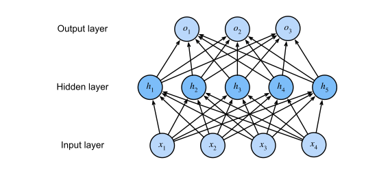
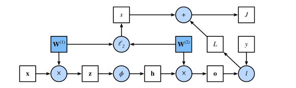
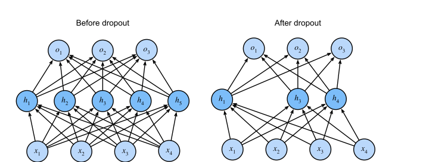

# Multilayer Perceptrons

> **Ý chính trong một câu:** xếp chồng hai layer tuyến tính vẫn chỉ cho một hàm tuyến tính — **phi tuyến giữa chúng** mới là thứ biến mạng nơ-ron từ một phép biến đổi affine thành một bộ xấp xỉ hàm vạn năng.

## Mục tiêu học tập

Học xong chương, bạn có thể:

- [ ] nêu ba hạn chế của model tuyến tính và cho ví dụ phá vỡ giả định **đơn điệu**;
- [ ] giải thích vì sao xếp chồng layer tuyến tính **không** tăng sức biểu diễn nếu thiếu {{term:activation-function|activation function}};
- [ ] so sánh {{term:relu|ReLU}}, {{term:sigmoid|sigmoid}} và tanh về hình dạng, đạo hàm và trường hợp dùng;
- [ ] phát biểu **định lý xấp xỉ vạn năng** và nói rõ nó **không** hứa hẹn điều gì;
- [ ] mô tả {{term:forward-propagation|forward propagation}} và {{term:backpropagation|backpropagation}}, và giải thích vì sao training tốn nhiều bộ nhớ hơn prediction;
- [ ] giải thích {{term:vanishing-gradient|vanishing gradient}} và {{term:exploding-gradient|exploding gradient}} qua tích các ma trận;
- [ ] nêu vấn đề **đối xứng hoán vị** và vì sao không được khởi tạo mọi weight bằng nhau;
- [ ] dẫn ra {{term:xavier-initialization|Xavier initialization}} từ yêu cầu về phương sai;
- [ ] giải thích vì sao lý thuyết generalization cổ điển **không giải thích được** deep learning;
- [ ] mô tả {{term:dropout|dropout}}, chứng minh nó không chệch, và nói vì sao chỉ dùng lúc training.

## Bản đồ chương

```text
   5.1 VÌ SAO CẦN HIDDEN LAYER
       tuyến tính ⇒ đơn điệu ⇒ không mô hình hoá được nhiều thứ
       hidden layer + PHI TUYẾN ⇒ xấp xỉ vạn năng
       (ReLU · sigmoid · tanh)
                    │
   5.2 HIỆN THỰC (từ đầu và gọn)
                    │
   5.3 CƠ CHẾ BÊN TRONG: forward + backward + computational graph
       → giải thích vì sao training tốn bộ nhớ hơn prediction
                    │
   5.4 KHI MỌI THỨ HỎNG: gradient biến mất hoặc bùng nổ
       nguyên nhân: tích L ma trận
       cách chữa: ReLU, phá vỡ đối xứng, Xavier init
                    │
   5.5 GENERALIZATION TRONG DEEP LEARNING (lý thuyết cổ điển bó tay)
       → 5.6 DROPOUT: tiêm nhiễu KHÔNG CHỆCH vào từng layer
                    │
   5.7 RÁP TẤT CẢ: dự đoán giá nhà trên Kaggle
```

## Bức tranh tổng quan

Chương 4 đã cho ta classifier nhận ra 10 loại trang phục từ ảnh độ phân giải thấp. Dọc đường, ta học cách xử lý dữ liệu, ép output thành phân phối xác suất hợp lệ, áp hàm loss phù hợp, và cực tiểu nó theo tham số.

Giờ khi đã nắm những cơ chế đó trong bối cảnh model tuyến tính đơn giản, ta có thể khởi hành khám phá **deep neural network** — lớp model phong phú hơn mà cuốn sách này chủ yếu quan tâm.

**Điều bạn cần mang theo:** softmax regression và cross-entropy (chương 4), automatic differentiation (mục 2.5), và khái niệm overfitting cùng weight decay (mục 3.6, 3.7).

**Câu hỏi xuyên suốt chương.** Mọi thứ trong chương này đều trả lời một trong ba câu hỏi:

| Mục | Câu hỏi |
|---|---|
| 5.1–5.2 | *Làm sao thêm sức biểu diễn?* → hidden layer + phi tuyến |
| 5.3–5.4 | *Làm sao train nó, và vì sao việc đó hay hỏng?* → backprop + khởi tạo |
| 5.5–5.7 | *Làm sao nó tổng quát hoá được, và làm sao giúp nó tốt hơn?* → dropout + thực hành |

<!-- pagebreak -->

## 5.1 Multilayer Perceptrons

### 5.1.1 Hidden Layers

Mục 3.1.1 mô tả **phép biến đổi affine** là phép biến đổi tuyến tính cộng thêm bias. Softmax regression ánh xạ input thẳng sang output qua **một** phép affine, rồi softmax.

Nếu nhãn thật sự liên hệ với input qua một phép affine đơn giản thì cách này đã đủ. **Nhưng tuyến tính là một giả định MẠNH.**

**Hạn chế của model tuyến tính.** Tuyến tính kéo theo giả định **yếu hơn** là **đơn điệu**: bất kỳ sự tăng nào của một feature cũng phải **luôn** làm output tăng (nếu weight dương), hoặc **luôn** làm output giảm (nếu weight âm).

Đôi khi điều đó hợp lý. Ví dụ dự đoán ai sẽ trả nợ: hợp lý khi giả định rằng, các yếu tố khác như nhau, người thu nhập cao hơn **luôn** có khả năng trả nợ cao hơn.

**Nhưng đơn điệu không đồng nghĩa với tuyến tính.** Sách chỉ ra: tăng thu nhập từ $0 lên $50 000 có lẽ làm khả năng trả nợ tăng nhiều hơn so với tăng từ $1 triệu lên $1.05 triệu. Ta có thể xử lý bằng hậu xử lý — dùng ánh xạ logistic, tức lấy logarit của xác suất.

**Và có những ví dụ phá vỡ hẳn tính đơn điệu.** Ví dụ hay nhất của sách: dự đoán **sức khoẻ theo nhiệt độ cơ thể**.

- Với người có nhiệt độ **trên 37°C**, nhiệt độ **cao hơn** báo hiệu rủi ro **lớn hơn**.
- Nhưng nếu nhiệt độ **tụt xuống dưới 37°C**, nhiệt độ **thấp hơn** lại báo hiệu rủi ro **lớn hơn**!

Quan hệ này có hình chữ U — không hàm tuyến tính nào mô tả được. Ta lại có thể lách bằng tiền xử lý thông minh: dùng **khoảng cách tới 37°C** làm feature.

**Nhưng phân loại ảnh mèo và chó thì sao?** Việc tăng cường độ của pixel tại vị trí (13, 17) có nên **luôn** làm tăng (hoặc luôn làm giảm) khả năng ảnh đó là chó không?

Dựa vào model tuyến tính tương đương với giả định ngầm rằng **điều kiện duy nhất để phân biệt mèo với chó là đánh giá độ sáng của từng pixel riêng lẻ**. Cách tiếp cận đó **chắc chắn thất bại** trong một thế giới mà **đảo ngược ảnh vẫn giữ nguyên lớp**.

Và khác với hai ví dụ trước, ở đây **không rõ** ta có thể sửa bằng tiền xử lý đơn giản nào. Lý do là **ý nghĩa của một pixel phụ thuộc vào ngữ cảnh của nó** theo những cách phức tạp.

### Incorporating Hidden Layers

Ta vượt qua hạn chế của model tuyến tính bằng cách đưa vào **một hoặc nhiều hidden layer**. Cách dễ nhất là **xếp chồng nhiều fully connected layer** lên nhau. Mỗi layer nuôi layer phía trên, cho tới khi sinh ra output.

Ta có thể hiểu $L-1$ layer đầu là **biểu diễn (representation)** và layer cuối là **bộ dự đoán tuyến tính**. Kiến trúc này gọi là **multilayer perceptron**, viết tắt **{{term:multilayer-perceptron|MLP}}**.



MLP này có 4 input, 3 output, và hidden layer chứa 5 hidden unit.

> **Chú ý cách đếm layer:** vì input layer **không thực hiện phép tính nào**, sinh output với mạng này đòi hỏi hiện thực phép tính cho **cả** hidden layer **và** output layer; do đó **số layer của MLP này là hai**, không phải ba. Đây là quy ước dễ gây nhầm lẫn.

### From Linear to Nonlinear — và vì sao phi tuyến là bắt buộc

Ký hiệu $\mathbf{X} \in \mathbb{R}^{n\times d}$ là minibatch $n$ ví dụ, mỗi ví dụ $d$ feature. Với MLP một hidden layer có $h$ hidden unit, ký hiệu $\mathbf{H} \in \mathbb{R}^{n\times h}$ là output của hidden layer — gọi là **hidden representation**.

Vì cả hidden layer lẫn output layer đều fully connected, ta có $\mathbf{W}^{(1)} \in \mathbb{R}^{d\times h}$, $\mathbf{b}^{(1)} \in \mathbb{R}^{1\times h}$, $\mathbf{W}^{(2)} \in \mathbb{R}^{h\times q}$, $\mathbf{b}^{(2)} \in \mathbb{R}^{1\times q}$:

$$
\begin{aligned}
\mathbf{H} &= \mathbf{X}\mathbf{W}^{(1)} + \mathbf{b}^{(1)},\\
\mathbf{O} &= \mathbf{H}\mathbf{W}^{(2)} + \mathbf{b}^{(2)}.
\end{aligned}
$$

**Nhưng đây là vấn đề chí mạng.** Thay dòng đầu vào dòng sau:

$$
\mathbf{O} = (\mathbf{X}\mathbf{W}^{(1)} + \mathbf{b}^{(1)})\mathbf{W}^{(2)} + \mathbf{b}^{(2)}
= \mathbf{X}\underbrace{\mathbf{W}^{(1)}\mathbf{W}^{(2)}}_{\textstyle \mathbf{W}} + \underbrace{\mathbf{b}^{(1)}\mathbf{W}^{(2)} + \mathbf{b}^{(2)}}_{\textstyle \mathbf{b}}.
$$

**Ta vừa quay về đúng một model tuyến tính!** Mọi công sức thêm layer đều vô ích, vì tích của hai ma trận vẫn là một ma trận.

**Lời giải: chèn một hàm phi tuyến $\sigma$ giữa hai layer.**

$$
\begin{aligned}
\mathbf{H} &= \sigma\big(\mathbf{X}\mathbf{W}^{(1)} + \mathbf{b}^{(1)}\big),\\
\mathbf{O} &= \mathbf{H}\mathbf{W}^{(2)} + \mathbf{b}^{(2)}.
\end{aligned}
$$

$\sigma$ gọi là **{{term:activation-function|activation function}}** và được áp **từng phần tử**. Giờ hai layer **không gộp lại được** nữa, và ta thực sự có thêm sức biểu diễn.

> **Đây là một trong những ý quan trọng nhất của cả cuốn sách.** Chiều sâu chỉ có giá trị khi có phi tuyến giữa các layer. Bài tập 5.1.4 câu 1 yêu cầu chứng minh chính điều này.

### Universal Approximators

Deep network mạnh tới đâu? Câu hỏi này đã được trả lời nhiều lần — Cybenko (1989) cho MLP, Micchelli (1984) cho không gian Hilbert hạt nhân tái sinh.

Những kết quả này gợi ý rằng **ngay cả với mạng một hidden layer, cho đủ nút (có thể nhiều đến phi lý) và đúng bộ weight, ta có thể mô hình hoá bất kỳ hàm nào**.

**Nhưng sách lập tức hạ nhiệt, và phần này mới đáng nhớ:**

> **Việc thực sự HỌC được hàm đó mới là phần khó.** Bạn có thể nghĩ về mạng nơ-ron hơi giống ngôn ngữ lập trình C. Ngôn ngữ đó, như mọi ngôn ngữ hiện đại khác, có khả năng biểu diễn **bất kỳ chương trình tính toán được nào**. Nhưng **thực sự viết ra một chương trình đáp ứng đúng yêu cầu của bạn mới là phần khó.**

Và thêm một cảnh báo: chỉ vì mạng một hidden layer **có thể** học bất kỳ hàm nào **không có nghĩa bạn nên** giải mọi bài toán bằng nó. Mạng **sâu hơn** thường học cùng một hàm với ít nút hơn rất nhiều.

### 5.1.2 Activation Functions

Activation function quyết định một nơ-ron có được kích hoạt hay không. Chúng là **toán tử khả vi** biến tín hiệu input thành output, và phần lớn **thêm tính phi tuyến**.

**ReLU.** Lựa chọn phổ biến nhất, nhờ vừa dễ hiện thực vừa cho hiệu năng tốt trên nhiều nhiệm vụ:

$$
\operatorname{ReLU}(x) = \max(x, 0).
$$

ReLU **giữ lại phần tử dương và loại bỏ phần tử âm** bằng cách đặt activation về 0.

```python
x = torch.arange(-8.0, 8.0, 0.1, requires_grad=True)
y = torch.relu(x)
```

**Đạo hàm:** khi input âm, đạo hàm bằng **0**; khi input dương, đạo hàm bằng **1**. ReLU **không khả vi** đúng tại 0; theo quy ước ta lấy đạo hàm trái và nói đạo hàm bằng 0 tại điểm đó. Sách đùa rằng ta "thoát" được điều này vì input gần như không bao giờ đúng bằng 0 — nhà toán học sẽ nói nó không khả vi trên một tập độ đo 0.

**Vì sao ReLU tốt?** Theo đúng lời sách:

> Lý do dùng ReLU là **đạo hàm của nó rất ngoan**: chúng hoặc **triệt tiêu**, hoặc **cho tham số đi qua nguyên vẹn**. Điều này làm việc tối ưu ổn định hơn và nó **giảm nhẹ vấn đề vanishing gradient** vốn đã hành hạ các thế hệ mạng nơ-ron trước.

**Sigmoid.** Biến input trên toàn $\mathbb{R}$ thành output trong khoảng $(0, 1)$ — vì thế còn gọi là **hàm ép (squashing function)**:

$$
\operatorname{sigmoid}(x) = \frac{1}{1 + \exp(-x)}.
$$

**Bối cảnh lịch sử của sách rất đáng đọc.** Ở các mạng nơ-ron sớm nhất, các nhà khoa học quan tâm tới việc mô hình hoá nơ-ron sinh học **hoặc bắn xung, hoặc không bắn**. Nên những người tiên phong — quay về tới McCulloch và Pitts, hai người phát minh nơ-ron nhân tạo — tập trung vào **đơn vị ngưỡng**.

Khi sự chú ý chuyển sang học dựa trên gradient, sigmoid là lựa chọn tự nhiên vì nó là một **xấp xỉ trơn, khả vi** của đơn vị ngưỡng.

**Nhưng ngày nay sigmoid đã phần lớn bị thay bởi ReLU** ở các hidden layer. Lý do sách nêu rõ: **sigmoid gây khó khăn cho tối ưu vì gradient của nó biến mất với cả tham số dương lớn VÀ âm lớn**, dẫn tới những vùng bằng phẳng rất khó thoát ra.

Dù vậy sigmoid vẫn quan trọng: nó được dùng rộng rãi ở **output unit** khi ta muốn diễn giải output là xác suất cho phân loại nhị phân. Và ở chương 10 về RNN, ta sẽ thấy các kiến trúc dùng sigmoid để **điều khiển dòng thông tin** qua thời gian.

**tanh.** Cũng ép input vào một khoảng, nhưng là $(-1, 1)$:

$$
\tanh(x) = \frac{1 - \exp(-2x)}{1 + \exp(-2x)}.
$$

Hình dạng giống sigmoid nhưng **đối xứng qua gốc toạ độ**. Bài tập 5.1.4 câu 5 khai thác chính quan hệ này.

**Bảng so sánh:**

| | ReLU | Sigmoid | tanh |
|---|---|---|---|
| Miền giá trị | $[0, \infty)$ | $(0, 1)$ | $(-1, 1)$ |
| Đạo hàm | 0 hoặc 1 | $\le 0.25$, **biến mất ở hai đầu** | $\le 1$, biến mất ở hai đầu |
| Đối xứng qua 0 | không | không | **có** |
| Dùng ở đâu ngày nay | **hidden layer** (mặc định) | output nhị phân, cổng trong RNN | hidden layer trong RNN |

### 5.1.3 Summary and Discussion

- Giờ ta biết cách đưa **phi tuyến** vào để xây các kiến trúc mạng nơ-ron nhiều tầng có sức biểu diễn.
- Kiến thức của bạn đã đặt bạn ngang tầm một người thực hành khoảng **năm 1990**. Ở một số mặt bạn còn có lợi thế hơn bất kỳ ai thời đó, vì bạn có thể tận dụng các framework mã nguồn mở mạnh mẽ để xây model nhanh chóng chỉ với vài dòng code.
- Trước đây, train những mạng này đòi hỏi nhà nghiên cứu **tự code layer và đạo hàm bằng C, Fortran, hay thậm chí Lisp** (trường hợp LeNet).

### 5.1.4 Exercises

1. Chứng minh rằng thêm layer vào một deep network **tuyến tính** — tức mạng không có phi tuyến $\sigma$ — **không bao giờ tăng** sức biểu diễn của mạng. Cho một ví dụ mà nó **thực sự làm giảm** sức biểu diễn.
2. Tính đạo hàm của hàm kích hoạt **pReLU**.
3. Tính đạo hàm của hàm kích hoạt **Swish** $x\,\operatorname{sigmoid}(\beta x)$.
4. Chứng minh rằng một MLP chỉ dùng ReLU (hoặc pReLU) tạo ra một **hàm tuyến tính từng khúc liên tục**.
5. Sigmoid và tanh rất giống nhau.
   1. Chứng minh $\tanh(x) + 1 = 2\operatorname{sigmoid}(2x)$.
   2. Chứng minh rằng các lớp hàm được tham số hoá bởi hai phi tuyến này là **đồng nhất**. Gợi ý: layer affine cũng có số hạng bias.
6. Giả sử ta có một phi tuyến áp cho **một minibatch tại một thời điểm**, chẳng hạn batch normalization. Bạn dự đoán điều này gây ra những vấn đề gì?
7. Cho một ví dụ mà gradient **biến mất** với hàm kích hoạt sigmoid.

<details markdown="1"><summary>Gợi ý</summary>

Câu 1: tích của hai ma trận là một ma trận — nhưng **hạng** của tích đó thì sao? Câu 4: ReLU chia không gian input thành các vùng; trong mỗi vùng, những unit nào đang hoạt động? Câu 5a: viết cả hai vế theo $e^{-2x}$. Câu 6: model có phụ thuộc vào **các mẫu khác trong cùng batch** không? Điều đó ảnh hưởng gì lúc suy luận?
</details>

<details markdown="1"><summary>Lời giải</summary>

**Câu 1.** **Chứng minh không tăng sức biểu diễn.** Một mạng tuyến tính $L$ layer tính:

$$
\mathbf{o} = \mathbf{W}^{(L)}\cdots\mathbf{W}^{(2)}\mathbf{W}^{(1)}\mathbf{x} + \mathbf{b}
$$

Tích $\mathbf{W}^{(L)}\cdots\mathbf{W}^{(1)}$ **là một ma trận duy nhất** $\mathbf{W}$, và tổ hợp các bias cũng là một vector $\mathbf{b}$. Vậy mạng $L$ layer tính **đúng** hàm $\mathbf{o} = \mathbf{W}\mathbf{x} + \mathbf{b}$ — cùng lớp hàm với **một** layer. Không có gì được thêm vào.

**Ví dụ nó làm GIẢM sức biểu diễn.** Đây là phần thú vị hơn, và mấu chốt là **hạng ma trận**.

Xét input $d = 10$ chiều, output $q = 10$ chiều. Một layer duy nhất $\mathbf{W} \in \mathbb{R}^{10\times10}$ có thể có hạng tối đa **10** — nó biểu diễn được mọi phép biến đổi tuyến tính từ $\mathbb{R}^{10}$ sang $\mathbb{R}^{10}$.

Giờ chèn một hidden layer chỉ có **2** unit: $\mathbf{W}^{(1)} \in \mathbb{R}^{10\times2}$ và $\mathbf{W}^{(2)} \in \mathbb{R}^{2\times10}$. Vì

$$
\operatorname{rank}(\mathbf{W}^{(2)}\mathbf{W}^{(1)}) \le \min\big(\operatorname{rank}(\mathbf{W}^{(1)}), \operatorname{rank}(\mathbf{W}^{(2)})\big) \le 2,
$$

tích này **không bao giờ** có hạng vượt 2. Vậy mạng hai layer này **không thể** biểu diễn phép đồng nhất (hạng 10), trong khi một layer thì làm được.

**Bài học:** thêm layer hẹp tạo ra một **nút thắt cổ chai**. Không có phi tuyến, chiều sâu chỉ có thể **làm hại**, không bao giờ giúp. (Ghi chú: nút thắt này lại **hữu ích** một cách có chủ đích trong autoencoder và các phương pháp giảm chiều — nhưng đó là khi ta *muốn* nén.)

**Câu 2.** pReLU (parametrized ReLU) định nghĩa là:

$$
\operatorname{pReLU}(x) = \max(0, x) + \alpha \min(0, x)
$$

Đạo hàm:

$$
\frac{d}{dx}\operatorname{pReLU}(x) =
\begin{cases}
1 & \text{nếu } x > 0\\
\alpha & \text{nếu } x < 0\\
\text{không xác định} & \text{tại } x = 0
\end{cases}
$$

**Vì sao pReLU tồn tại:** với ReLU thường ($\alpha = 0$), một nơ-ron luôn nhận input âm sẽ có gradient **vĩnh viễn bằng 0** và không bao giờ học lại được — hiện tượng gọi là **"dying ReLU"**. Đặt $\alpha$ nhỏ (ví dụ 0.01) giữ cho gradient luôn khác 0.

**Câu 3.** Swish: $f(x) = x\,\sigma(\beta x)$ với $\sigma$ là sigmoid.

Dùng quy tắc tích và $\sigma'(u) = \sigma(u)(1-\sigma(u))$:

$$
f'(x) = \sigma(\beta x) + x \cdot \beta\,\sigma(\beta x)\big(1 - \sigma(\beta x)\big)
$$

Viết gọn bằng cách đặt $s = \sigma(\beta x)$:

$$
\boxed{\,f'(x) = s + \beta x\, s(1-s) = s\big(1 + \beta x(1 - s)\big)\,}
$$

**Kiểm tra hai giới hạn:** khi $x \to +\infty$, $s \to 1$ nên $f' \to 1$ (giống ReLU). Khi $x \to -\infty$, $s \to 0$ nên $f' \to 0$ (cũng giống ReLU). Nhưng ở giữa, Swish **trơn** và có một vùng $f'$ hơi **âm** quanh $x$ âm nhỏ — đó là điều ReLU không có, và được cho là giúp tối ưu.

**Câu 4.** Ý tưởng chứng minh: ReLU **chia không gian input thành các vùng đa diện**, và trong mỗi vùng, mạng là **affine**.

Với một input $\mathbf{x}$ cố định, mỗi ReLU unit hoặc đang "bật" (input dương, hành xử như hàm đồng nhất) hoặc "tắt" (output 0). Cố định **mẫu bật/tắt** của toàn mạng, mỗi ReLU trở thành phép nhân với hằng số 0 hoặc 1 — tức **tuyến tính**. Ghép các layer affine với các phép nhân hằng số vẫn cho một hàm **affine**.

Tập các $\mathbf{x}$ cho cùng một mẫu bật/tắt là giao của các nửa không gian (mỗi điều kiện $\mathbf{w}^\top\mathbf{x} + b > 0$ là một nửa không gian), tức một **đa diện lồi**. Vậy không gian input được chia thành hữu hạn đa diện, và trên mỗi đa diện hàm là affine.

**Liên tục:** tại biên giữa hai vùng, một unit nào đó có input đúng bằng 0, nên $\max(0, 0) = 0$ dù tính từ phía nào — hai biểu thức affine **khớp nhau** tại biên. Vậy hàm liên tục ✓

Đây là lý do mọi mạng ReLU, dù sâu đến đâu, vẫn chỉ là **hàm tuyến tính từng khúc** — nó xấp xỉ đường cong bằng cách ghép rất nhiều mảnh phẳng.

**Câu 5.**

**(a)** Viết cả hai vế theo $e^{-2x}$:

$$
\tanh(x) + 1 = \frac{1 - e^{-2x}}{1 + e^{-2x}} + 1 = \frac{1 - e^{-2x} + 1 + e^{-2x}}{1 + e^{-2x}} = \frac{2}{1 + e^{-2x}}
$$

$$
2\operatorname{sigmoid}(2x) = 2 \cdot \frac{1}{1 + e^{-2x}} = \frac{2}{1 + e^{-2x}}
$$

Hai vế bằng nhau ✓

**(b)** Từ (a) ta có $\tanh(x) = 2\sigma(2x) - 1$. Vậy tanh chỉ là sigmoid sau một phép **co giãn input** (nhân 2), **co giãn output** (nhân 2) và **tịnh tiến output** (trừ 1).

Giờ xét một layer dùng tanh: $\mathbf{h} = \tanh(\mathbf{W}\mathbf{x} + \mathbf{b})$, rồi layer sau tính $\mathbf{W}'\mathbf{h} + \mathbf{b}'$. Thay vào:

$$
\mathbf{W}'\big(2\sigma(2\mathbf{W}\mathbf{x} + 2\mathbf{b}) - 1\big) + \mathbf{b}'
= \underbrace{(2\mathbf{W}')}_{\tilde{\mathbf{W}}'}\,\sigma\big(\underbrace{(2\mathbf{W})}_{\tilde{\mathbf{W}}}\mathbf{x} + \underbrace{(2\mathbf{b})}_{\tilde{\mathbf{b}}}\big) + \underbrace{(\mathbf{b}' - \mathbf{W}'\mathbf{1})}_{\tilde{\mathbf{b}}'}
$$

Ta thu được **đúng** một mạng sigmoid với tham số đã đổi. Đây chính là chỗ **gợi ý của đề bài phát huy tác dụng**: số hạng $-\mathbf{W}'\mathbf{1}$ được **hấp thụ vào bias** $\mathbf{b}'$. Không có bias thì phép biến đổi này không thực hiện được.

Vậy hai lớp hàm **đồng nhất** — mọi hàm biểu diễn được bằng mạng tanh cũng biểu diễn được bằng mạng sigmoid và ngược lại.

**Hệ quả thực hành đáng chú ý:** nếu hai lớp hàm đồng nhất, vì sao thực tế tanh thường train tốt hơn sigmoid? Vì **tối ưu** khác nhau, không phải vì **sức biểu diễn** khác nhau. tanh có trung bình 0 nên gradient ở layer sau ít bị lệch hệ thống hơn.

**Câu 6.** Một phi tuyến phụ thuộc cả minibatch — như batch normalization — gây ra vài vấn đề:

1. **Output phụ thuộc các mẫu khác trong batch.** Dự đoán cho mẫu $i$ đổi tuỳ theo những mẫu nào tình cờ nằm cùng batch. Điều này vi phạm giả định thường thấy rằng model là một hàm của **riêng** input đó.
2. **Train và inference hành xử khác nhau.** Lúc inference ta thường xử lý một mẫu một lúc, nên không có batch để tính thống kê. Phải dùng **trung bình động** ước lượng lúc train — tạo ra sự **lệch pha giữa train và test**.
3. **Nhạy với kích thước batch.** Batch rất nhỏ cho ước lượng trung bình/phương sai rất nhiễu. Đây là lý do batch norm hoạt động kém với `batch_size` nhỏ, và là động cơ cho layer norm và group norm.
4. **Khó dùng với dữ liệu chuỗi độ dài thay đổi**, nơi việc gom batch vốn đã phức tạp.

Đáng chú ý là điểm 1 và 2 giải thích vì sao **Transformer dùng layer normalization** chứ không dùng batch normalization: layer norm chuẩn hoá **trong từng mẫu**, nên không có phụ thuộc chéo giữa các mẫu.

**Câu 7.** Gradient sigmoid là $\sigma'(x) = \sigma(x)(1-\sigma(x))$, đạt **cực đại chỉ 0.25** tại $x = 0$, và tiến nhanh về 0 ở hai phía.

**Ví dụ cụ thể:** lấy $x = 10$. Khi đó $\sigma(10) \approx 0.99995$, nên

$$
\sigma'(10) \approx 0.99995 \times 0.00005 \approx 4.5 \times 10^{-5}.
$$

Gradient nhỏ hơn 0.25 khoảng **5000 lần**.

**Vì sao đây là thảm hoạ trong mạng sâu:** backpropagation **nhân** các gradient qua từng layer. Với 10 layer sigmoid, ngay cả ở trường hợp **tốt nhất** ($x = 0$ ở mọi layer), gradient bị nhân với $0.25^{10} \approx 10^{-6}$. Layer đầu gần như **không nhận được tín hiệu học nào**.

Đây chính xác là vấn đề mà mục 5.4.1 sẽ phân tích kỹ, và là lý do chính khiến ReLU — với đạo hàm bằng **1** ở vùng dương — thay thế sigmoid trong hidden layer.

**Bẫy thường gặp:** dùng sigmoid ở hidden layer của mạng sâu "vì nó cho xác suất". Xác suất chỉ cần ở **output**; ở giữa, nó chỉ làm gradient chết dần.
</details>

<!-- pagebreak -->

## 5.2 Implementation of Multilayer Perceptrons

### 5.2.1 Implementation from Scratch

MLP có nhiều layer hơn softmax regression, nên ta khai báo nhiều bộ tham số hơn. Sách dùng một hidden layer với **256 unit** cho Fashion-MNIST (784 input, 10 output).

```python
class MLPScratch(d2l.Classifier):
    def __init__(self, num_inputs, num_outputs, num_hiddens, lr, sigma=0.01):
        super().__init__()
        self.save_hyperparameters()
        # Hai bộ tham số: input -> hidden, rồi hidden -> output.
        self.W1 = nn.Parameter(torch.randn(num_inputs, num_hiddens) * sigma)
        self.b1 = nn.Parameter(torch.zeros(num_hiddens))
        self.W2 = nn.Parameter(torch.randn(num_hiddens, num_outputs) * sigma)
        self.b2 = nn.Parameter(torch.zeros(num_outputs))


def relu(X):
    a = torch.zeros_like(X)
    return torch.max(X, a)


@d2l.add_to_class(MLPScratch)
def forward(self, X):
    X = X.reshape((-1, self.num_inputs))
    H = relu(torch.matmul(X, self.W1) + self.b1)   # phi tuyến ở ĐÂY
    return torch.matmul(H, self.W2) + self.b2      # output là logit thô
```

> **Chú ý hai chi tiết.** Thứ nhất, `relu` nằm giữa hai phép nhân ma trận — bỏ nó đi thì toàn mạng gộp thành một layer (mục 5.1.1). Thứ hai, `forward` trả về **logit thô**, không có softmax, vì `CrossEntropyLoss` sẽ tự lo — đúng như bài học LogSumExp ở mục 4.5.2.

**Vì sao chọn 256 hidden unit?** Sách lưu ý rằng ta thường chọn chiều rộng layer là **luỹ thừa của 2**, vì điều đó **hiệu quả hơn về mặt tính toán** do cách bộ nhớ được cấp phát và định địa chỉ trong phần cứng.

### 5.2.2 Concise Implementation

```python
class MLP(d2l.Classifier):
    def __init__(self, num_outputs, num_hiddens, lr):
        super().__init__()
        self.save_hyperparameters()
        self.net = nn.Sequential(nn.Flatten(), nn.LazyLinear(num_hiddens),
                                 nn.ReLU(), nn.LazyLinear(num_outputs))
```

Bản gọn ngắn hơn nhiều và **không cần khai báo shape của input** nhờ `LazyLinear` — cơ chế mà mục 6.4 sẽ giải thích.

### 5.2.3 Summary

- Giờ ta đã quen hơn với việc thiết kế deep network, bước từ một layer lên nhiều layer không còn là thách thức lớn. Cụ thể, ta **dùng lại được** thuật toán training và bộ nạp dữ liệu.
- **Tuy nhiên**, hiện thực MLP từ đầu vẫn lộn xộn: việc đặt tên và theo dõi tham số khiến model khó mở rộng. Ví dụ, hãy tưởng tượng muốn chèn thêm một layer giữa layer 42 và 43 — nó sẽ phải là "layer 42b", trừ khi ta chịu đổi tên hàng loạt.

*(Đây chính là động cơ cho chương 6.)*

### 5.2.4 Exercises

1. Đổi số hidden unit `num_hiddens` và vẽ đồ thị xem số đó ảnh hưởng thế nào tới accuracy. Giá trị tốt nhất của hyperparameter này là bao nhiêu?
2. Thử **thêm một hidden layer** và xem nó ảnh hưởng thế nào tới kết quả.
3. Vì sao chèn một hidden layer **chỉ có một nơ-ron** là ý tồi? Điều gì có thể hỏng?
4. Đổi learning rate thay đổi kết quả thế nào? Với mọi tham số khác cố định, learning rate nào cho kết quả tốt nhất? Nó liên hệ thế nào với số epoch?
5. Hãy tối ưu **đồng thời mọi hyperparameter**: learning rate, số epoch, số hidden layer, và số hidden unit mỗi layer.
   1. Kết quả tốt nhất bạn đạt được là gì?
   2. Vì sao xử lý **nhiều** hyperparameter cùng lúc lại khó hơn nhiều?
   3. Mô tả một chiến lược hiệu quả để tối ưu nhiều tham số cùng lúc.
6. So sánh tốc độ giữa hiện thực bằng framework và hiện thực từ đầu cho một bài toán khó. Nó thay đổi thế nào theo độ phức tạp của mạng?
7. Đo tốc độ nhân tensor–ma trận với ma trận **căn chỉnh tốt** và **căn chỉnh lệch**. Ví dụ, thử với ma trận có chiều 1024, 1025, 1026, 1028 và 1032.
   1. Điều này khác nhau thế nào giữa GPU và CPU?
   2. Xác định độ rộng bus bộ nhớ của CPU và GPU của bạn.
8. Thử các hàm kích hoạt khác nhau. Cái nào hoạt động tốt nhất?
9. Có khác biệt giữa các cách khởi tạo weight của mạng không? Nó có quan trọng không?

<details markdown="1"><summary>Gợi ý</summary>

Câu 3: nhớ lại lời giải bài tập 5.1.4 câu 1 về **hạng ma trận**. Câu 5b: nếu mỗi hyperparameter có 5 giá trị và bạn có 4 hyperparameter, cần thử bao nhiêu tổ hợp? Câu 7: 1024 là luỹ thừa của 2, còn 1025 thì không — điều đó ảnh hưởng gì tới cách dữ liệu nằm trong bộ nhớ đệm?
</details>

<details markdown="1"><summary>Lời giải</summary>

**Câu 1.** Quan hệ có hình vòm: tăng `num_hiddens` từ rất nhỏ (ví dụ 8) lên vài trăm cải thiện accuracy rõ rệt, sau đó **bão hoà** và cuối cùng có thể **giảm nhẹ** do overfitting.

Với Fashion-MNIST, giá trị quanh **256–512** thường tốt. Nhưng điểm đáng nói là **đường cong khá phẳng** ở vùng đó — chênh lệch giữa 256 và 512 nhỏ hơn nhiều so với chênh lệch giữa 8 và 256. Bài học: đừng tốn nhiều công dò chính xác con số này.

**Câu 2.** Thêm một hidden layer thường cải thiện **một chút** trên Fashion-MNIST, và đôi khi **không cải thiện gì**.

Lý do: Fashion-MNIST là bài toán tương đối dễ, và một hidden layer đã đủ sức biểu diễn. Thêm chiều sâu chỉ giúp rõ rệt khi bài toán thực sự cần các biểu diễn phân cấp — điều mà ảnh 28×28 xám không đòi hỏi nhiều.

Đáng chú ý: mạng sâu hơn cũng **khó train hơn** (mục 5.4), nên lợi ích về sức biểu diễn có thể bị mất vào khó khăn tối ưu.

**Câu 3.** Đây là hệ quả trực tiếp của lời giải bài tập 5.1.4 câu 1: hidden layer một nơ-ron tạo ra một **nút thắt cổ chai hạng 1**.

Toàn bộ thông tin từ 784 input phải đi qua **một con số duy nhất** trước khi tới 10 output. Bất kể hai layer có weight thế nào, ánh xạ tổng thể có hạng tối đa **1**. Model không thể phân biệt 10 lớp bằng một chiều.

Cụ thể, output sẽ luôn có dạng $\mathbf{o} = \mathbf{w}_2 \cdot \sigma(\mathbf{w}_1^\top\mathbf{x} + b_1) + \mathbf{b}_2$ — mọi thành phần của $\mathbf{o}$ đều là **cùng một số vô hướng** nhân với các hệ số khác nhau. Thứ tự các lớp **không bao giờ đổi** theo input. Accuracy sẽ gần với mức đoán bừa.

**Câu 4.** Tương tự bài tập 4.4.7 câu 5a. Bổ sung cho MLP: mạng sâu hơn thường cần learning rate **nhỏ hơn**, vì gradient được nhân qua nhiều layer nên dao động lớn hơn.

Về quan hệ với số epoch: hai thứ này **đánh đổi với nhau**. Learning rate nhỏ cần nhiều epoch hơn để hội tụ; learning rate lớn hội tụ nhanh nhưng có thể dừng ở nghiệm kém hơn hoặc phân kỳ. Lịch giảm learning rate (bắt đầu lớn, giảm dần) lấy được phần tốt của cả hai.

**Câu 5.**

**(a)** Với Fashion-MNIST và MLP, kết quả tốt thường quanh **88–90%** validation accuracy. Vượt qua mức đó cần CNN (chương 7) chứ không phải chỉnh hyperparameter.

**(b) Vì sao nhiều hyperparameter khó hơn nhiều?** Ba lý do:

1. **Bùng nổ tổ hợp.** Với 4 hyperparameter, mỗi cái 5 giá trị, grid search cần $5^4 = 625$ lần train. Với 6 hyperparameter thì là $15\,625$.
2. **Chúng tương tác với nhau.** Learning rate tốt nhất **phụ thuộc** vào batch size, số layer, và cách khởi tạo. Không thể tối ưu từng cái độc lập rồi ghép lại.
3. **Mỗi lần đánh giá rất đắt** — phải train xong một model. Và kết quả **nhiễu** do khởi tạo ngẫu nhiên, nên đôi khi ta chọn nhầm cấu hình chỉ vì nó gặp may.

Thêm nữa, việc dò nhiều lần trên validation set dẫn thẳng tới **adaptive overfitting** (mục 4.6.2).

**(c) Chiến lược hiệu quả:**

- **Random search thay vì grid search.** Bergstra và Bengio (2012) chỉ ra rằng với cùng ngân sách, random search tìm được cấu hình tốt hơn. Lý do: thường chỉ vài hyperparameter thực sự quan trọng, và random search lấy mẫu **nhiều giá trị khác nhau** cho từng cái, trong khi grid search lãng phí vào việc lặp lại cùng giá trị.
- **Dò theo thang logarit** cho learning rate và weight decay (thử $10^{-4}, 10^{-3}, 10^{-2}$ thay vì $0.001, 0.002, 0.003$).
- **Tối ưu Bayes** — dùng chính GP của chương 18! Nó mô hình hoá quan hệ giữa hyperparameter và hiệu năng, rồi chọn điểm thử tiếp theo ở nơi bất định cao nhất.
- **Successive halving / Hyperband**: train nhiều cấu hình với ngân sách nhỏ, loại bỏ phần tệ nhất, dồn ngân sách cho phần còn lại.
- **Dò tuần tự theo mức quan trọng**: learning rate trước (quan trọng nhất), rồi kiến trúc, rồi chính quy hoá.

**Câu 6.** Hiện thực bằng framework thường **nhanh hơn**, và khoảng cách **nới rộng** theo độ phức tạp mạng.

Lý do: framework dùng kernel BLAS/cuDNN được tối ưu thủ công, gộp các phép toán (fusion), và giảm chi phí gọi hàm Python. Với mạng nhỏ, chi phí Python chiếm tỉ trọng lớn; với mạng lớn, phép tính ma trận chiếm ưu thế và framework tận dụng phần cứng tốt hơn nhiều.

**Câu 7.** Đây là bài tập rất đáng làm vì nó dạy một điều ít người biết.

Ma trận có chiều là **luỹ thừa của 2** (1024) thường nhanh hơn ma trận chiều lẻ (1025) một cách **đáng kể** — đôi khi tới vài chục phần trăm. Nguyên nhân:

- **Căn chỉnh bộ nhớ đệm.** Dữ liệu được nạp theo **cache line** (thường 64 byte). Chiều là bội của cache line cho phép nạp trọn vẹn; chiều lệch làm mỗi hàng bắt đầu ở giữa một cache line, gây nạp thừa.
- **Vector hoá.** Lệnh SIMD xử lý 4, 8 hoặc 16 phần tử cùng lúc. Chiều chia hết cho kích thước vector tránh được phần dư phải xử lý riêng.
- **Chia khối (tiling).** Thư viện BLAS chia ma trận thành khối vừa cache; chiều "đẹp" chia khối trọn vẹn.

**(a)** Hiệu ứng thường **rõ hơn trên GPU**, vì GPU thực thi theo warp (32 luồng) và rất nhạy với việc truy cập bộ nhớ có được **gộp (coalesced)** hay không. Trên CPU hiệu ứng vẫn có nhưng nhẹ hơn nhờ cache lớn và bộ dự đoán tốt.

**(b)** Trên macOS: `sysctl -a | grep cachelinesize` cho kích thước cache line CPU. Với GPU, `nvidia-smi -q` hoặc thông số kỹ thuật của card cho băng thông và độ rộng bus bộ nhớ.

Đây cũng chính là lý do mục 5.2.1 nói rằng chiều rộng layer thường chọn là **luỹ thừa của 2**.

**Câu 8.** ReLU thường là lựa chọn tốt nhất cho hidden layer — nhanh nhất và ít vấn đề gradient nhất. Các biến thể hiện đại (GELU, Swish, SiLU) đôi khi tốt hơn một chút, đặc biệt ở mạng rất sâu, nhưng chênh lệch nhỏ.

Sigmoid và tanh ở hidden layer sẽ **tệ hơn rõ rệt** trên mạng sâu — chính là bài tập 5.1.4 câu 7.

**Câu 9.** **Có, rất quan trọng** — và đó là toàn bộ nội dung mục 5.4.2.

Nếu khởi tạo mọi weight **bằng nhau**, các hidden unit sẽ mãi mãi giống hệt nhau (đối xứng hoán vị). Nếu khởi tạo **quá lớn**, activation bão hoà hoặc gradient bùng nổ. Nếu **quá nhỏ**, tín hiệu tắt dần qua các layer.

Với MLP một hidden layer trên Fashion-MNIST, `sigma=0.01` hoạt động ổn. Nhưng hãy thử `sigma=1.0` và `sigma=0.0001` để thấy khác biệt — đó là cách tốt nhất để thấy vì sao mục 5.4 tồn tại.

**Bẫy thường gặp:** khởi tạo mọi weight bằng **0**. Mạng sẽ không học được gì cả, vì mọi gradient đều giống nhau và mọi unit cập nhật y hệt nhau mãi mãi.
</details>

<!-- pagebreak -->

## 5.3 Forward Propagation, Backward Propagation, and Computational Graphs

### Trực giác

Tới giờ ta đã train model bằng minibatch SGD, nhưng khi hiện thực thuật toán, ta **chỉ lo về forward propagation**; framework lo phần backpropagation tự động.

Mục này **mở nắp** cơ chế đó ra. Sách dùng một câu rất hợp cảnh: việc này có thể hơi nhàm, nhưng như nghệ sĩ funk James Brown nói, bạn phải *"trả giá để làm ông chủ"*.

### 5.3.1 Forward Propagation

**{{term:forward-propagation|Forward propagation}}** là việc **tính và LƯU TRỮ** các biến trung gian (kể cả output) của một mạng nơ-ron, theo thứ tự từ input layer tới output layer.

> **Chú ý chữ "lưu trữ".** Nó không chỉ là tính toán — các giá trị trung gian phải được **giữ lại**, và đó là lý do training tốn nhiều bộ nhớ hơn prediction. Mục 5.3.4 sẽ quay lại điểm này.

Giả sử input là $\mathbf{x} \in \mathbb{R}^d$ và hidden layer không có bias. Biến trung gian là:

$$
\mathbf{z} = \mathbf{W}^{(1)}\mathbf{x},
$$

với $\mathbf{W}^{(1)} \in \mathbb{R}^{h\times d}$. Cho $\mathbf{z}$ qua activation function $\phi$ ta được vector activation dài $h$:

$$
\mathbf{h} = \phi(\mathbf{z}).
$$

Rồi output layer (giả sử chỉ có weight):

$$
\mathbf{o} = \mathbf{W}^{(2)}\mathbf{h}.
$$

Với hàm loss $l$ và nhãn $y$, loss cho một ví dụ là $L = l(\mathbf{o}, y)$.

Theo định nghĩa $\ell_2$ regularization với hyperparameter $\lambda$, số hạng chính quy hoá là:

$$
s = \frac{\lambda}{2}\left(\lVert\mathbf{W}^{(1)}\rVert_F^2 + \lVert\mathbf{W}^{(2)}\rVert_F^2\right),
$$

trong đó **chuẩn Frobenius** của ma trận đơn giản là chuẩn $\ell_2$ áp dụng sau khi trải phẳng ma trận thành vector.

Cuối cùng, loss có chính quy hoá của model trên một ví dụ là:

$$
J = L + s .
$$

Ta gọi $J$ là **objective function**.

### 5.3.2 Computational Graph of Forward Propagation

Vẽ **computational graph** giúp ta hình dung các phụ thuộc giữa toán tử và biến trong phép tính.



Trong hình, **hình vuông là biến** và **hình tròn là toán tử**. Góc dưới bên trái là input, góc trên bên phải là output. Chú ý hướng mũi tên (biểu thị dòng dữ liệu) chủ yếu **sang phải và lên trên**.

### 5.3.3 Backpropagation

**{{term:backpropagation|Backpropagation}}** là phương pháp tính gradient của tham số mạng nơ-ron. Nói ngắn gọn, nó **duyệt mạng theo thứ tự ngược**, từ output về input layer, theo **quy tắc dây chuyền** của giải tích.

Thuật toán **lưu lại các biến trung gian** (đạo hàm riêng) cần dùng khi tính gradient theo một số tham số.

Giả sử ta có hàm $\mathsf{Y} = f(\mathsf{X})$ và $\mathsf{Z} = g(\mathsf{Y})$, với input và output $\mathsf{X}, \mathsf{Y}, \mathsf{Z}$ là tensor có shape tuỳ ý. Dùng quy tắc dây chuyền:

$$
\frac{\partial \mathsf{Z}}{\partial \mathsf{X}} = \operatorname{prod}\left(\frac{\partial \mathsf{Z}}{\partial \mathsf{Y}}, \frac{\partial \mathsf{Y}}{\partial \mathsf{X}}\right).
$$

Toán tử $\operatorname{prod}$ nhân các đối số của nó **sau khi** đã thực hiện các thao tác cần thiết như chuyển vị và hoán đổi vị trí input. Với vector, nó đơn giản là phép nhân ma trận.

### 5.3.4 Training Neural Networks — vì sao training tốn bộ nhớ

Đây là phần có giá trị thực hành nhất của mục.

Khi training, forward và backward propagation **phụ thuộc lẫn nhau**:

- Với forward propagation, ta duyệt computational graph **theo chiều phụ thuộc** và tính mọi biến trên đường đi.
- Chúng sau đó được dùng cho backpropagation, nơi **thứ tự tính trên graph bị đảo ngược**.

Lấy mạng đơn giản ở trên làm ví dụ. Một mặt, tính số hạng chính quy hoá $s$ khi forward phụ thuộc vào **giá trị hiện tại** của $\mathbf{W}^{(1)}$ và $\mathbf{W}^{(2)}$ — do thuật toán tối ưu cung cấp theo backpropagation ở vòng lặp gần nhất. Mặt khác, tính gradient khi backpropagation phụ thuộc vào **giá trị hiện tại của $\mathbf{h}$** — do forward propagation cung cấp.

Vì vậy, khi train mạng nơ-ron, sau khi khởi tạo tham số, ta **luân phiên** forward và backward propagation, cập nhật tham số bằng gradient từ backpropagation.

> **Và đây là hệ quả quan trọng nhất:** backpropagation **tái sử dụng các giá trị trung gian đã lưu** từ forward propagation để tránh tính trùng lặp. Một hệ quả là **ta phải giữ lại các giá trị trung gian cho tới khi backpropagation hoàn tất**.
>
> Đây cũng là một trong những lý do **training đòi hỏi nhiều bộ nhớ hơn hẳn so với chỉ dự đoán**. Hơn nữa, kích thước các giá trị trung gian đó **tỉ lệ thô với số layer của mạng nhân với batch size**. Vì vậy train mạng sâu hơn với batch size lớn hơn **dễ dẫn tới lỗi out-of-memory**.

**Công thức đáng nhớ:** bộ nhớ activation $\approx$ (số layer) $\times$ (batch size) $\times$ (kích thước activation mỗi layer).

Khi bạn gặp lỗi CUDA out of memory, ba đòn bẩy để giảm — theo đúng công thức đó — là giảm batch size, giảm số layer, hoặc giảm chiều rộng layer.

### 5.3.5 Summary

- **Forward propagation** tuần tự tính và lưu các biến trung gian trong computational graph định nghĩa bởi mạng nơ-ron. Nó đi từ input tới output layer.
- **Backpropagation** tuần tự tính và lưu gradient của các biến trung gian và tham số theo **thứ tự ngược lại**.
- Khi train model deep learning, forward propagation và backpropagation **phụ thuộc lẫn nhau**, và training đòi hỏi **nhiều bộ nhớ hơn đáng kể** so với prediction.

### 5.3.6 Exercises

1. Giả sử input $\mathbf{X}$ vào một hàm vô hướng $f$ là ma trận $n\times m$. Chiều của gradient của $f$ theo $\mathbf{X}$ là bao nhiêu?
2. **Thêm bias** vào hidden layer của model mô tả trong mục này (bạn không cần đưa bias vào số hạng chính quy hoá).
   1. Vẽ computational graph tương ứng.
   2. Dẫn ra các phương trình forward và backward propagation.
3. Tính **dấu chân bộ nhớ** cho training và prediction trong model mô tả ở mục này.
4. Giả sử bạn muốn tính **đạo hàm bậc hai**. Chuyện gì xảy ra với computational graph? Bạn dự đoán phép tính mất bao lâu?
5. Giả sử computational graph **quá lớn so với GPU** của bạn.
   1. Bạn có thể chia nó trên nhiều GPU không?
   2. Ưu và nhược điểm so với training trên minibatch nhỏ hơn là gì?

<details markdown="1"><summary>Gợi ý</summary>

Câu 1: gradient của một hàm vô hướng theo một biến luôn có **cùng shape** với biến đó. Câu 3: đếm số biến trung gian phải giữ lại trong mỗi trường hợp. Câu 4: đạo hàm bậc hai là "backprop của backprop" — graph nào phải được xây thêm?
</details>

<details markdown="1"><summary>Lời giải</summary>

**Câu 1.** Gradient có **chiều $n \times m$** — **giống hệt** $\mathbf{X}$.

Quy tắc tổng quát: gradient của một **hàm vô hướng** theo một biến luôn có cùng shape với biến đó. Trực giác: với mỗi phần tử $X_{ij}$, ta cần biết "nếu tăng $X_{ij}$ một chút thì $f$ đổi bao nhiêu?" — tức một số cho mỗi phần tử.

Đây là lý do trong PyTorch, `x.grad` luôn có cùng shape với `x`. Nếu bạn thấy shape khác, gần như chắc chắn hàm của bạn không phải vô hướng.

**Câu 2.**

**(a) Computational graph.** So với Figure 5.3.1, chỉ thêm **một nút biến** $\mathbf{b}^{(1)}$ nối vào toán tử cộng ngay sau phép nhân $\mathbf{W}^{(1)}\mathbf{x}$:

```text
x ──► × ──► + ──► φ ──► h ──► × ──► o ──► l ──► L ──► + ──► J
      ▲     ▲                 ▲                      ▲
   W⁽¹⁾   b⁽¹⁾              W⁽²⁾                     s ◄── W⁽¹⁾, W⁽²⁾
```

**(b) Forward propagation** giờ là:

$$
\mathbf{z} = \mathbf{W}^{(1)}\mathbf{x} + \mathbf{b}^{(1)},\quad
\mathbf{h} = \phi(\mathbf{z}),\quad
\mathbf{o} = \mathbf{W}^{(2)}\mathbf{h},\quad
L = l(\mathbf{o}, y),\quad
J = L + s.
$$

**Backpropagation.** Đi ngược từ $J$:

$$
\frac{\partial J}{\partial L} = 1, \qquad
\frac{\partial J}{\partial \mathbf{o}} = \frac{\partial l(\mathbf{o}, y)}{\partial \mathbf{o}}
$$

$$
\frac{\partial J}{\partial \mathbf{W}^{(2)}} = \frac{\partial J}{\partial \mathbf{o}}\mathbf{h}^\top + \lambda\mathbf{W}^{(2)}
$$

$$
\frac{\partial J}{\partial \mathbf{h}} = \mathbf{W}^{(2)\top}\frac{\partial J}{\partial \mathbf{o}}, \qquad
\frac{\partial J}{\partial \mathbf{z}} = \frac{\partial J}{\partial \mathbf{h}} \odot \phi'(\mathbf{z})
$$

$$
\frac{\partial J}{\partial \mathbf{W}^{(1)}} = \frac{\partial J}{\partial \mathbf{z}}\mathbf{x}^\top + \lambda\mathbf{W}^{(1)},
\qquad
\boxed{\frac{\partial J}{\partial \mathbf{b}^{(1)}} = \frac{\partial J}{\partial \mathbf{z}}}
$$

**Chú ý dòng cuối:** gradient theo bias **đúng bằng** $\partial J/\partial\mathbf{z}$, không cần nhân với gì cả. Lý do: $\partial\mathbf{z}/\partial\mathbf{b}^{(1)} = \mathbf{I}$. Đó là vì sao đề bài nói bias không cần vào số hạng chính quy hoá — và cũng là lý do bias thường không bị weight decay trong thực tế.

**Câu 3.** Gọi $d$ = chiều input, $h$ = số hidden unit, $q$ = số output.

**Prediction (inference):**
- Tham số: $\mathbf{W}^{(1)}$ ($dh$) + $\mathbf{W}^{(2)}$ ($hq$) — **bắt buộc**.
- Biến trung gian: chỉ cần **một** tại một thời điểm, vì sau khi tính $\mathbf{h}$ ta có thể **giải phóng** $\mathbf{z}$, và sau khi tính $\mathbf{o}$ có thể giải phóng $\mathbf{h}$.

$$
\text{Bộ nhớ}_{\text{predict}} \approx \underbrace{dh + hq}_{\text{tham số}} + \underbrace{O(\max(d, h, q))}_{\text{một activation}}
$$

**Training:**
- Tham số: như trên.
- **Gradient** của tham số: **bằng đúng kích thước tham số** ($dh + hq$).
- **Mọi** biến trung gian $\mathbf{z}, \mathbf{h}, \mathbf{o}$ phải **giữ lại** cho tới khi backprop xong.
- Nếu dùng optimizer có trạng thái (Adam giữ 2 giá trị mỗi tham số): thêm $2(dh + hq)$.

$$
\text{Bộ nhớ}_{\text{train}} \approx \underbrace{k(dh + hq)}_{k=2\text{ với SGD},\ 4\text{ với Adam}} + \underbrace{B(d + h + q)}_{\text{activation, nhân batch size }B}
$$

**Điểm mấu chốt:** phần activation **nhân với batch size $B$**, còn phần tham số thì không. Với mạng sâu và batch lớn, activation **chiếm phần lớn** bộ nhớ — đúng như mục 5.3.4 cảnh báo.

**Câu 4.** Computational graph **lớn lên đáng kể**, và thời gian tính tăng theo.

Cơ chế: để tính đạo hàm bậc hai, framework phải **backprop qua chính quá trình backprop**. Nghĩa là khi tính gradient bậc nhất, nó phải **xây thêm một computational graph** cho các phép tính gradient đó (trong PyTorch là `create_graph=True`), rồi backprop qua graph mới này.

Hệ quả:

- **Bộ nhớ**: tăng vì phải giữ cả graph của forward pass lẫn graph của backward pass.
- **Thời gian**: thường **gấp 2–4 lần** so với gradient bậc nhất cho một tích Hessian–vector.
- **Hessian đầy đủ** thì tệ hơn nhiều: với $n$ tham số, nó có $n^2$ phần tử. Với chỉ 1 triệu tham số, đó là $10^{12}$ số — **không khả thi**.

Đây là lý do các phương pháp bậc hai trong deep learning **không bao giờ dựng Hessian đầy đủ**, mà chỉ dùng **tích Hessian–vector** (chi phí tương đương vài lần backprop) hoặc các xấp xỉ đường chéo/khối.

**Câu 5.**

**(a) Có, chia được.** Đây gọi là **model parallelism**: đặt layer 1–5 trên GPU 0, layer 6–10 trên GPU 1, và chuyển activation qua lại giữa chúng.

Với model rất lớn, còn có các kỹ thuật tinh vi hơn: **tensor parallelism** (chia một layer theo chiều ngang) và **pipeline parallelism** (chia theo layer nhưng cho nhiều microbatch chạy chồng lấn để GPU không nhàn rỗi).

**(b) So sánh với giảm batch size:**

| | Chia trên nhiều GPU | Giảm batch size |
|---|---|---|
| **Ưu** | giữ nguyên batch size, gradient ổn định; xử lý được model không vừa một GPU | đơn giản, không cần code thêm; chạy trên một GPU |
| **Nhược** | chi phí **truyền thông** giữa GPU; GPU có thể **nhàn rỗi** chờ nhau (trừ khi dùng pipeline); code phức tạp hơn nhiều | gradient **nhiễu hơn**; có thể cần chỉnh learning rate; **không cứu được** nếu ngay cả batch size 1 cũng không vừa |

**Một lựa chọn thứ ba đáng nhắc:** **gradient accumulation** — chạy nhiều microbatch nhỏ, cộng dồn gradient, rồi mới cập nhật một lần. Nó cho **hiệu ứng của batch lớn** mà chỉ cần bộ nhớ của batch nhỏ, và không cần nhiều GPU. Đây thường là giải pháp đầu tiên nên thử.

**Bẫy thường gặp:** nhầm **model parallelism** (chia model) với **data parallelism** (sao chép model, chia dữ liệu). Data parallelism phổ biến hơn nhiều và dễ hơn nhiều, nhưng nó **không giúp** khi model không vừa một GPU.
</details>

<!-- pagebreak -->

## 5.4 Numerical Stability and Initialization

### 5.4.1 Vanishing and Exploding Gradients

Xét một mạng sâu $L$ layer, input $\mathbf{x}$ và output $\mathbf{o}$. Mỗi layer $l$ định nghĩa bởi một phép biến đổi $f_l$ tham số hoá bởi weight $\mathbf{W}^{(l)}$, với output là $\mathbf{h}^{(l)}$ (đặt $\mathbf{h}^{(0)} = \mathbf{x}$):

$$
\mathbf{h}^{(l)} = f_l(\mathbf{h}^{(l-1)}) \quad\text{và do đó}\quad \mathbf{o} = f_L \circ \cdots \circ f_1(\mathbf{x}).
$$

Gradient của $\mathbf{o}$ theo bộ tham số $\mathbf{W}^{(l)}$ bất kỳ là:

$$
\partial_{\mathbf{W}^{(l)}}\mathbf{o} =
\underbrace{\partial_{\mathbf{h}^{(L-1)}}\mathbf{h}^{(L)}}_{\mathbf{M}^{(L)}}
\cdot \cdots \cdot
\underbrace{\partial_{\mathbf{h}^{(l)}}\mathbf{h}^{(l+1)}}_{\mathbf{M}^{(l+1)}}
\cdot
\underbrace{\partial_{\mathbf{W}^{(l)}}\mathbf{h}^{(l)}}_{\mathbf{v}^{(l)}}.
$$

**Nói cách khác, gradient này là TÍCH của $L - l$ ma trận.**

> **Đây là căn nguyên của mọi vấn đề trong mục này.** Ta gặp đúng những rắc rối về underflow số học thường xuất hiện khi **nhân quá nhiều xác suất với nhau**.

Với xác suất, mẹo thông dụng là chuyển sang **không gian log**, tức dịch áp lực từ phần định trị sang phần mũ của biểu diễn số. **Đáng tiếc, vấn đề ở đây nghiêm trọng hơn:** ban đầu các ma trận $\mathbf{M}^{(l)}$ có thể có **giá trị riêng rất đa dạng**. Chúng có thể nhỏ hoặc lớn, và **tích của chúng có thể RẤT LỚN hoặc RẤT NHỎ**.

**Và rủi ro vượt xa vấn đề biểu diễn số.** Gradient có độ lớn không lường trước còn **đe doạ tính ổn định của thuật toán tối ưu**. Ta có thể gặp cập nhật tham số hoặc:

- **quá lớn**, phá huỷ model — vấn đề **{{term:exploding-gradient|exploding gradient}}**; hoặc
- **quá nhỏ** — vấn đề **{{term:vanishing-gradient|vanishing gradient}}**, khiến việc học bất khả thi vì tham số hầu như không nhúc nhích sau mỗi lần cập nhật.

**Vanishing gradient và sigmoid.** Một thủ phạm thường gặp là lựa chọn activation function $\sigma$. Trong lịch sử, sigmoid $1/(1+\exp(-x))$ phổ biến vì nó giống một hàm ngưỡng. Vì mạng nơ-ron nhân tạo thời đầu lấy cảm hứng từ mạng nơ-ron sinh học, ý tưởng nơ-ron bắn xung **hoàn toàn hoặc không chút nào** nghe rất hấp dẫn.

Nhưng như đã thấy ở bài tập 5.1.4 câu 7, gradient sigmoid biến mất khi input lớn — **cả dương lẫn âm**. Khi backprop qua nhiều layer, trừ khi ta ở vùng Goldilocks nơi mọi input gần 0, gradient của tích tổng thể **có thể biến mất**.

Đó là lý do **ReLU, ổn định hơn (nhưng kém hợp lý về mặt thần kinh học), đã nổi lên thành lựa chọn mặc định** của giới thực hành.

**Exploding gradient.** Vấn đề ngược lại cũng khó chịu không kém. Để thấy rõ, ta nhân 100 ma trận Gaussian ngẫu nhiên với một ma trận khởi tạo — với phương sai ta chọn, tích **bùng nổ**. Nếu điều này xảy ra vì khởi tạo của một deep network, ta **không có cơ hội** làm optimizer hội tụ.

### Breaking the Symmetry

Còn một vấn đề nữa trong thiết kế mạng nơ-ron: **đối xứng vốn có trong cách tham số hoá**.

Giả sử ta có MLP đơn giản với một hidden layer và **hai** unit. Ta có thể **hoán vị** weight $\mathbf{W}^{(1)}$ của layer đầu và hoán vị tương ứng weight của output layer để thu được **cùng một hàm**. Không có gì đặc biệt phân biệt hidden unit thứ nhất với thứ hai — ta có **đối xứng hoán vị** giữa các hidden unit của mỗi layer.

**Đây không chỉ là phiền toái lý thuyết.** Hãy xét MLP một hidden layer hai unit đó. Giả sử output layer biến hai hidden unit thành một output. Hãy tưởng tượng điều gì xảy ra nếu ta khởi tạo **mọi tham số của hidden layer bằng cùng một hằng số $c$**:

1. Khi forward propagation, **cả hai hidden unit nhận cùng input và cùng tham số**, nên sinh ra **cùng một activation** đưa vào output unit.
2. Khi backpropagation, đạo hàm theo hai unit đó **giống hệt nhau**.
3. Sau khi cập nhật, chúng **vẫn giống hệt nhau**.

Kết quả: dù có bao nhiêu hidden unit, mạng **hành xử như thể chỉ có một**. Gradient descent **không bao giờ phá vỡ được đối xứng này**, và ta không bao giờ hiện thực hoá được sức biểu diễn của mạng.

> **Kết luận:** **khởi tạo ngẫu nhiên là chìa khoá** để phá vỡ đối xứng trước khi tối ưu. (Ghi chú: dropout ở mục 5.6 cũng phá vỡ đối xứng, nhưng khởi tạo ngẫu nhiên vẫn là cơ chế chính.)

### 5.4.2 Parameter Initialization — Xavier Initialization

Hãy xem phân bố thang đo của output $o_i$ của một fully connected layer **không có phi tuyến**. Với $n_{\text{in}}$ input $x_j$ và weight $w_{ij}$:

$$
o_i = \sum_{j=1}^{n_{\text{in}}} w_{ij} x_j .
$$

Giả sử các weight $w_{ij}$ đều rút **độc lập** từ cùng một phân phối có **trung bình 0 và phương sai $\sigma^2$** (không nhất thiết Gaussian — chỉ cần trung bình và phương sai tồn tại). Giả sử thêm rằng input $x_j$ cũng có trung bình 0, phương sai $\gamma^2$, và độc lập với $w_{ij}$ cùng độc lập với nhau.

Khi đó:

$$
\mathbb{E}[o_i] = \sum_j \mathbb{E}[w_{ij}]\,\mathbb{E}[x_j] = 0,
$$

$$
\operatorname{Var}[o_i] = \sum_{j=1}^{n_{\text{in}}} \mathbb{E}[w_{ij}^2 x_j^2] = n_{\text{in}}\sigma^2\gamma^2 .
$$

**Đây là chỗ mấu chốt.** Để phương sai **không đổi** khi đi qua layer, ta cần $n_{\text{in}}\sigma^2 = 1$.

Nhưng khi backpropagation, gradient đi theo **chiều ngược**, và lập luận tương tự cho điều kiện $n_{\text{out}}\sigma^2 = 1$.

**Ta rơi vào thế lưỡng nan: không thể thoả mãn cả hai điều kiện cùng lúc** (trừ khi $n_{\text{in}} = n_{\text{out}}$). Thay vào đó, ta đơn giản tìm cách thoả mãn:

$$
\tfrac{1}{2}(n_{\text{in}} + n_{\text{out}})\,\sigma^2 = 1
\qquad\text{hay tương đương}\qquad
\boxed{\;\sigma = \sqrt{\frac{2}{n_{\text{in}} + n_{\text{out}}}}\;}
$$

Đây chính là lập luận nền tảng của **{{term:xavier-initialization|Xavier initialization}}**, đặt theo tên tác giả đầu tiên của nó (Glorot và Bengio, 2010).

Thông thường Xavier initialization lấy mẫu weight từ phân phối Gaussian trung bình 0, phương sai $\sigma^2 = \frac{2}{n_{\text{in}} + n_{\text{out}}}$. Ta cũng có thể chuyển sang phân phối đều: chú ý rằng $U(-a, a)$ có phương sai $\frac{a^2}{3}$, nên ta chọn $a$ tương ứng.

> **Cách nhớ:** Xavier là một **thoả hiệp**. Nó không giữ phương sai hoàn hảo theo chiều xuôi, cũng không theo chiều ngược — nó **lấy trung bình cộng** hai yêu cầu.

### 5.4.3 Summary

- **Vanishing và exploding gradient là vấn đề phổ biến** trong deep network. Cần **rất cẩn thận khi khởi tạo tham số** để đảm bảo gradient và tham số được kiểm soát tốt.
- Cần có **heuristic khởi tạo** để đảm bảo gradient ban đầu không quá lớn cũng không quá nhỏ.
- **Khởi tạo ngẫu nhiên là chìa khoá** để đảm bảo đối xứng được phá vỡ trước khi tối ưu.
- **Xavier initialization** gợi ý rằng, với mỗi layer, phương sai của bất kỳ output nào **không bị ảnh hưởng bởi số input**, và phương sai của bất kỳ gradient nào **không bị ảnh hưởng bởi số output**.
- Hàm kích hoạt **ReLU giảm nhẹ** vấn đề vanishing gradient, giúp tăng tốc hội tụ.

### 5.4.4 Exercises

1. Bạn có thiết kế được **trường hợp khác** mà mạng nơ-ron thể hiện đối xứng cần phá vỡ, ngoài đối xứng hoán vị giữa các layer của MLP không?
2. Ta có thể khởi tạo **mọi tham số weight bằng cùng một giá trị** trong linear regression hoặc softmax regression không?
3. Tra các **cận giải tích cho giá trị riêng của tích hai ma trận**. Điều đó cho bạn biết gì về việc đảm bảo gradient được điều kiện tốt?
4. Nếu ta biết rằng một số số hạng **phân kỳ**, ta có thể sửa sau khi nó xảy ra không? Hãy xem bài báo về **layerwise adaptive rate scaling** để lấy cảm hứng (You và cộng sự, 2017).

<details markdown="1"><summary>Gợi ý</summary>

Câu 2: điểm khác biệt then chốt so với MLP là gì — linear regression có "hidden unit" nào để hoán vị không? Câu 3: giá trị riêng của tích **không** đơn giản bằng tích các giá trị riêng; hãy tra bất đẳng thức về **giá trị kỳ dị**. Câu 4: nếu gradient của một layer quá lớn, ta có thể chuẩn hoá nó **theo từng layer** thay vì dùng một learning rate chung.
</details>

<details markdown="1"><summary>Lời giải</summary>

**Câu 1.** Có, vài dạng đối xứng khác:

| Dạng đối xứng | Mô tả |
|---|---|
| **Hoán vị kênh trong CNN** | Các filter trong cùng một convolutional layer có thể hoán vị (kèm hoán vị tương ứng ở layer sau) mà không đổi hàm |
| **Đối xứng tỉ lệ với ReLU** | Nhân weight vào một ReLU unit với $c > 0$ và chia weight ra khỏi nó cho $c$ cho **cùng một hàm**, vì $\operatorname{ReLU}(cx) = c\operatorname{ReLU}(x)$ |
| **Đối xứng dấu với tanh** | Vì $\tanh$ lẻ, đổi dấu weight vào **và** ra của một unit cho cùng một hàm |
| **Hoán vị attention head** | Trong Transformer, các head trong cùng một layer có thể hoán vị |

Đối xứng tỉ lệ đặc biệt đáng chú ý vì nó **không** được phá vỡ bởi khởi tạo ngẫu nhiên — nó tạo ra cả một **quỹ đạo liên tục** các nghiệm tương đương, gây khó khăn cho việc phân tích mặt loss và cho weight decay (vì hai nghiệm tương đương có thể có chuẩn rất khác nhau).

**Câu 2.** **Có, được** — và đây là điểm khác biệt quan trọng so với MLP.

Lý do: linear regression và softmax regression **không có hidden unit**. Mỗi output $o_i$ có bộ weight riêng $\mathbf{w}_i$ nối thẳng tới input, và **không có sự hoán đổi nào** giữa chúng vì mỗi output ứng với một lớp/mục tiêu **cụ thể, đã được xác định**.

Cụ thể với softmax regression khởi tạo $\mathbf{W} = \mathbf{0}$: mọi $\hat{y}_j = 1/q$ (đoán đều). Gradient theo hàng $j$ là $(\hat{y}_j - y_j)\mathbf{x}^\top$ — **khác nhau cho từng $j$** vì $y_j$ khác nhau. Vậy các hàng lập tức tách ra sau bước đầu tiên ✓

Đối chiếu với MLP: ở đó gradient của hai hidden unit **giống hệt nhau** vì chúng chơi vai trò hoán đổi được. Đó mới là nguồn của vấn đề.

**Trong thực tế** người ta vẫn thường khởi tạo ngẫu nhiên nhỏ cho cả linear model, nhưng đó là vì thói quen và vì lý do tối ưu nhẹ, không phải vì bắt buộc.

**Câu 3.** Giá trị riêng của tích ma trận **không** đơn giản bằng tích giá trị riêng (điều đó chỉ đúng khi hai ma trận giao hoán). Nhưng có cận cho **giá trị kỳ dị**:

$$
\sigma_{\max}(\mathbf{AB}) \le \sigma_{\max}(\mathbf{A})\,\sigma_{\max}(\mathbf{B}),
\qquad
\sigma_{\min}(\mathbf{AB}) \ge \sigma_{\min}(\mathbf{A})\,\sigma_{\min}(\mathbf{B}).
$$

**Điều này nói gì về gradient?** Áp cho tích $L$ ma trận:

$$
\sigma_{\max}\left(\prod_{l=1}^{L}\mathbf{M}^{(l)}\right) \le \prod_{l=1}^{L}\sigma_{\max}(\mathbf{M}^{(l)}).
$$

Nếu mỗi $\sigma_{\max}(\mathbf{M}^{(l)}) = 1.1$, thì sau 100 layer cận trên là $1.1^{100} \approx 13\,781$ — **bùng nổ**. Nếu mỗi cái bằng $0.9$, ta được $0.9^{100} \approx 2.6\times10^{-5}$ — **biến mất**.

**Bài học thiết kế:** để gradient được điều kiện tốt, ta muốn mọi $\sigma(\mathbf{M}^{(l)})$ **gần 1**, tức **số điều kiện** $\sigma_{\max}/\sigma_{\min}$ gần 1. Đây chính xác là thứ Xavier initialization nhắm tới về mặt phương sai.

Và đây cũng là lý do sâu xa của một số kỹ thuật hiện đại: **orthogonal initialization** (đặt mọi giá trị kỳ dị đúng bằng 1), **spectral normalization** (chia weight cho $\sigma_{\max}$), và **residual connection** (thêm đường tắt $\mathbf{h} + f(\mathbf{h})$ làm ma trận Jacobian gần với ma trận đơn vị). *(Ghi chú của người biên soạn: hai kỹ thuật đầu nằm ngoài phạm vi sách; residual connection được trình bày ở mục 8.6.)*

**Câu 4.** **Có, sửa được sau khi xảy ra** — và đó chính là ý tưởng của LARS mà đề bài gợi ý.

**Cách đơn giản nhất: gradient clipping.** Nếu chuẩn gradient vượt ngưỡng $\theta$, ta co nó lại:

$$
\mathbf{g} \leftarrow \min\left(1, \frac{\theta}{\lVert\mathbf{g}\rVert}\right)\mathbf{g}.
$$

Cách này giữ **hướng** gradient nhưng chặn **độ lớn**. Rất phổ biến khi train RNN và Transformer.

**Cách tinh vi hơn: LARS (Layer-wise Adaptive Rate Scaling).** Vấn đề với một learning rate toàn cục là **các layer khác nhau có thang gradient rất khác nhau**. LARS đặt learning rate **riêng cho từng layer**, tỉ lệ với tỉ số giữa chuẩn weight và chuẩn gradient của layer đó:

$$
\eta^{(l)} = \eta \cdot \frac{\lVert\mathbf{W}^{(l)}\rVert}{\lVert\nabla\mathbf{W}^{(l)}\rVert}.
$$

Ý tưởng: bước cập nhật nên có độ lớn **tương đối** so với chính weight, chứ không phải một hằng số tuyệt đối. Nhờ đó mọi layer tiến với "tốc độ tương đối" như nhau, bất kể thang gradient của chúng.

You và cộng sự (2017) dùng LARS để train ResNet với batch size rất lớn (32 000) — điều trước đó không làm được vì gradient của các layer mất cân bằng.

**So sánh ba cách tiếp cận:**

| Cách | Khi nào tác động |
|---|---|
| **Khởi tạo tốt** (Xavier) | **trước** khi train — phòng bệnh |
| **Kiến trúc** (ReLU, residual) | trong suốt quá trình — giảm nguyên nhân |
| **Clipping / LARS** | **sau** khi gradient đã xấu — chữa bệnh |

Trong thực tế người ta dùng **cả ba**, vì không cái nào một mình đủ cho mạng rất sâu.

**Bẫy thường gặp:** dùng gradient clipping với ngưỡng quá nhỏ. Khi đó **mọi** gradient đều bị co, và learning rate hiệu dụng trở nên nhỏ một cách khó đoán — model học rất chậm mà không rõ lý do.
</details>

<!-- pagebreak -->

## 5.5 Generalization in Deep Learning

### Trực giác

Mục 4.6 đã giới thiệu overfitting và lý thuyết học thống kê. Mục này quay lại câu hỏi đó cho **deep network**, và câu trả lời hoá ra **rất khác** — đủ khác để sách phải viết một mục riêng.

### 5.5.1 Revisiting Overfitting and Regularization

Theo định lý **"không có bữa trưa miễn phí"** của Wolpert và Macready (1995), **mọi thuật toán học đều tổng quát hoá tốt hơn trên dữ liệu có phân phối nào đó, và tệ hơn trên phân phối khác**. Vì vậy, với một tập training hữu hạn, model phải dựa vào **giả định**.

Để đạt hiệu năng ngang người, có thể hữu ích khi nhận diện những **{{term:inductive-bias|inductive bias}}** phản ánh cách con người nghĩ về thế giới. Inductive bias thể hiện sự **ưu tiên** cho những nghiệm có tính chất nhất định. Ví dụ, một MLP sâu có inductive bias hướng tới việc **xây hàm phức tạp bằng cách ghép các hàm đơn giản**.

**Bức tranh cổ điển.** Trong quan điểm truyền thống, khi model overfit, ta cho rằng nó **quá phức tạp**, và cách chữa là giảm số feature, giảm số tham số khác 0, hoặc giảm độ lớn tham số.

**Nhưng deep learning làm phức tạp bức tranh này theo những cách phản trực giác.** Sách nêu ra một chuỗi quan sát ngày càng kỳ lạ:

**Thứ nhất**, với bài toán phân loại, model của ta thường **đủ sức biểu diễn để khớp hoàn hảo mọi ví dụ training**, kể cả trên dataset hàng triệu mẫu. Trong bức tranh cổ điển, ta sẽ nghĩ tình huống này nằm ở **cực phải** của trục độ phức tạp, và mọi cải thiện về generalization phải đến từ chính quy hoá.

**Nhưng đó là lúc mọi thứ bắt đầu kỳ lạ.**

**Thứ hai**, với nhiều nhiệm vụ deep learning, ta thường chọn giữa các kiến trúc **mà tất cả đều đạt training loss thấp tuỳ ý (và training error bằng 0)**. Vì mọi model đang xét đều đạt training error 0, **con đường duy nhất để cải thiện là giảm overfitting**.

**Thứ ba — và đây là điều lạ nhất**: thường thì dù đã khớp hoàn hảo dữ liệu training, ta vẫn có thể **giảm generalization error thêm nữa bằng cách làm model CÀNG BIỂU DIỄN MẠNH HƠN** — thêm layer, thêm nút, hoặc train nhiều epoch hơn.

**Thứ tư**, quan hệ giữa generalization gap và **độ phức tạp** của model (đo bằng độ sâu hoặc chiều rộng) có thể **không đơn điệu**: độ phức tạp cao hơn ban đầu làm hại nhưng sau đó lại **giúp** — mẫu hình gọi là **"double descent"** (Nakkiran và cộng sự, 2021).

Vì vậy, người làm deep learning sở hữu một **túi mẹo**, một số có vẻ hạn chế model và một số có vẻ làm nó biểu diễn mạnh hơn — **và tất cả, theo một nghĩa nào đó, đều được dùng để giảm overfitting**.

**Lý thuyết cổ điển bó tay.** Sách nói thẳng:

> Vì deep neural network có khả năng khớp **nhãn tuỳ ý** ngay cả với dataset lớn, và dù ta có dùng các phương pháp quen thuộc như chính quy hoá $\ell_2$, các cận generalization cổ điển dựa trên độ phức tạp — ví dụ dựa trên VC dimension hay Rademacher complexity — **không giải thích được vì sao mạng nơ-ron tổng quát hoá**.

Đây là một thừa nhận đáng chú ý, và nó nối trực tiếp với cảnh báo ở mục 4.6.3 rằng VC dimension "quá bi quan với model phức tạp hơn".

### 5.5.2 Inspiration from Nonparametrics

Khi mới tiếp cận, ta dễ nghĩ deep network là **model có tham số** (parametric). Suy cho cùng, chúng **có** hàng triệu tham số: khi cập nhật model ta cập nhật tham số, khi lưu model ta ghi tham số ra đĩa.

Nhưng sách đề xuất một **đổi góc nhìn**: dù mạng nơ-ron rõ ràng **có** tham số, đôi khi sẽ **hiệu quả hơn khi nghĩ về chúng như model phi tham số**.

**Vậy điều gì khiến một model là phi tham số?** Tên gọi bao trùm nhiều cách tiếp cận, nhưng một chủ đề chung là: **phương pháp phi tham số có độ phức tạp TĂNG khi lượng dữ liệu tăng**.

Ví dụ đơn giản nhất là **$k$-nearest neighbor**. Lúc training, model chỉ đơn giản **ghi nhớ dataset**. Lúc dự đoán, khi gặp điểm mới $\mathbf{x}$, nó tra $k$ láng giềng gần nhất.

Khi $k = 1$, thuật toán này **luôn đạt training error bằng 0**. Nhưng điều đó **không có nghĩa nó không tổng quát hoá** — thực ra, dưới vài điều kiện nhẹ, 1-nearest neighbor là **nhất quán** (cuối cùng hội tụ về bộ dự đoán tối ưu).

> **Đây là phép loại suy then chốt của mục.** Cả 1-NN lẫn deep network đều đạt training error 0. Với model cổ điển, điều đó là dấu hiệu chắc chắn của overfitting. Với 1-NN, nó không — và ta có lý thuyết giải thích tại sao. Có lẽ deep network cũng cần một khung lý thuyết tương tự, chứ không phải khung dựa trên đếm tham số.

### 5.5.3 Early Stopping

**{{term:early-stopping|Early stopping}}** là một trong những công cụ thực dụng nhất, và nó nằm ở ranh giới thú vị giữa "chính quy hoá" và "tối ưu".

Ý tưởng: thay vì để model chạy tới khi training loss về 0, ta **theo dõi validation loss và dừng khi nó bắt đầu xấu đi**.

**Vì sao nó là một dạng chính quy hoá?** Vì nó **giới hạn không gian nghiệm mà tối ưu có thể với tới**. Với learning rate và số bước cố định, gradient descent chỉ đi được một quãng hữu hạn khỏi điểm khởi tạo. Dừng sớm nghĩa là giữ tham số **gần điểm khởi tạo hơn** — về mặt tác dụng, tương tự như đặt một ràng buộc lên chuẩn tham số, giống weight decay.

Một quan sát thực nghiệm mà sách nhấn mạnh: mạng nơ-ron thường **khớp dữ liệu sạch trước, rồi mới khớp nhãn nhiễu sau**. Vì vậy dừng sớm có thể bắt được model **sau khi** nó đã học các mẫu thật nhưng **trước khi** nó bắt đầu ghi nhớ nhiễu. Đây là lý do early stopping đặc biệt hiệu quả khi nhãn có nhiễu.

### 5.5.4 Classical Regularization Methods for Deep Networks

Sách lưu ý rằng các phương pháp cổ điển như **weight decay** vẫn được dùng rộng rãi trong deep learning, **nhưng vai trò của chúng đã đổi**: chúng không còn được hiểu là "giới hạn độ phức tạp model" theo nghĩa cổ điển, mà đúng hơn là những công cụ thực nghiệm giúp tối ưu và tổng quát hoá tốt hơn.

### 5.5.5 Summary

- Khác với model tuyến tính cổ điển — vốn thường có **ít tham số hơn ví dụ** — deep network thường **quá tham số hoá (over-parametrized)** và với phần lớn nhiệm vụ có khả năng **khớp hoàn hảo tập training**.
- **Chế độ nội suy (interpolation regime)** này thách thức nhiều trực giác đã ăn sâu.
- Về mặt chức năng, mạng nơ-ron **trông giống** model có tham số. Nhưng nghĩ về chúng như model **phi tham số** đôi khi là nguồn trực giác đáng tin hơn.
- Vì thường mọi deep network đang xét đều có thể khớp mọi nhãn training, **gần như mọi cải thiện phải đến từ việc giảm overfitting** (thu hẹp generalization gap).

### 5.5.6 Exercises

1. Theo nghĩa nào các **thước đo độ phức tạp cổ điển** thất bại trong việc giải thích generalization của deep neural network?
2. Vì sao **early stopping** được coi là một kỹ thuật chính quy hoá?
3. Các nhà nghiên cứu thường xác định **tiêu chí dừng** thế nào?
4. Yếu tố quan trọng nào dường như phân biệt các trường hợp mà early stopping mang lại **cải thiện lớn** về generalization?
5. Ngoài generalization, hãy mô tả **một lợi ích khác** của early stopping.

<details markdown="1"><summary>Gợi ý</summary>

Câu 1: xem lại mục 4.6.3 và hỏi VC dimension của một mạng có hàng triệu tham số là bao nhiêu. Câu 2: early stopping giới hạn cái gì? Câu 4: nghĩ tới chất lượng nhãn. Câu 5: điều gì tốn kém nhất khi train deep network?
</details>

<details markdown="1"><summary>Lời giải</summary>

**Câu 1.** Thước đo cổ điển thất bại theo ít nhất ba nghĩa:

1. **Cận trở nên rỗng (vacuous).** VC dimension của một mạng tỉ lệ (ít nhất) với số tham số. Với mạng 10 triệu tham số, cận generalization trở thành một số **lớn hơn 1** — tức nó nói "sai số của bạn ở đâu đó giữa 0 và hơn 100%", một phát biểu **không mang thông tin gì**.

2. **Chúng không phân biệt được các trường hợp thực tế khác nhau.** Zhang và cộng sự (2021) chỉ ra rằng **cùng một kiến trúc** có thể (a) khớp nhãn thật và tổng quát hoá tốt, hoặc (b) khớp **nhãn ngẫu nhiên hoàn toàn** và không tổng quát hoá gì. Vì cả hai dùng cùng một model class, **mọi cận chỉ dựa trên model class đều gán cho chúng cùng một giá trị** — nên không thể giải thích khác biệt.

3. **Chúng dự đoán sai chiều.** Lý thuyết cổ điển nói thêm tham số sẽ làm generalization tệ đi. Thực tế double descent cho thấy điều ngược lại xảy ra sau một ngưỡng nhất định.

**Điều còn thiếu:** cận cổ điển chỉ nhìn **model class**, không nhìn **thuật toán tối ưu** hay **dữ liệu**. Nhưng SGD không khám phá toàn bộ model class — nó có **thiên lệch ngầm (implicit bias)** hướng tới một số nghiệm nhất định. Lý thuyết hiện đại tìm cách đưa thiên lệch đó vào.

**Câu 2.** Early stopping là chính quy hoá vì nó **giới hạn không gian nghiệm hiệu dụng**.

Lập luận chính xác nhất: với gradient descent từ điểm khởi tạo $\theta_0$ với learning rate $\eta$ và $T$ bước, tham số cuối thoả $\lVert\theta_T - \theta_0\rVert \le \eta T \max_t \lVert\nabla L_t\rVert$. Dừng ở $T$ nhỏ nghĩa là tham số **bị ràng buộc trong một quả cầu** quanh điểm khởi tạo.

Với model tuyến tính và squared loss, người ta **chứng minh được** rằng early stopping tương đương chính xác với chính quy hoá $\ell_2$ với hệ số $\lambda$ phụ thuộc $\eta T$. Với mạng phi tuyến, tương đương không còn chính xác nhưng trực giác vẫn đúng.

Cách nhìn thứ hai, mang tính thực nghiệm: mạng học **tín hiệu trước, nhiễu sau**. Dừng sớm là dừng ở khoảng giữa.

**Câu 3.** Trong thực tế, tiêu chí dừng thường kết hợp vài yếu tố:

- **Patience**: dừng nếu validation loss không cải thiện trong $p$ epoch liên tiếp (phổ biến $p = 5$–$20$). Cần `patience` vì validation loss **nhiễu** — một epoch xấu không có nghĩa đã tới đỉnh.
- **Ngưỡng cải thiện tối thiểu** (`min_delta`): chỉ tính là "cải thiện" nếu giảm được ít nhất một lượng nào đó, tránh việc dao động nhỏ làm kéo dài training vô ích.
- **Khôi phục weight tốt nhất**: dừng ở epoch $T$ nhưng **trả về** tham số của epoch có validation loss thấp nhất, không phải tham số cuối.
- **Ngân sách tối đa**: giới hạn cứng số epoch hoặc thời gian, bất kể validation loss.

Đại lượng theo dõi cũng là một lựa chọn: **validation loss** nhạy hơn, **validation accuracy** khớp hơn với thứ ta quan tâm nhưng thô hơn (nó là hàm bậc thang).

**Câu 4.** Yếu tố quan trọng nhất là **nhiễu trong nhãn**.

Khi nhãn sạch, mạng khớp dữ liệu và tiếp tục train hầu như không hại gì — đường cong validation phẳng ra chứ không đi lên rõ rệt. Early stopping tiết kiệm thời gian nhưng không cải thiện nhiều.

Khi nhãn **có nhiễu**, bức tranh khác hẳn: mạng khớp các mẫu đúng trước (vì chúng nhất quán và củng cố lẫn nhau), rồi sau đó phải **ghi nhớ từng mẫu nhiễu một** (vì chúng không nhất quán với nhau). Giai đoạn ghi nhớ này làm validation loss **tăng rõ rệt**. Dừng ở đáy đường cong mang lại cải thiện lớn.

Yếu tố thứ hai: **kích thước dataset so với sức chứa model**. Dataset nhỏ với model lớn thì giai đoạn ghi nhớ đến sớm và rõ, nên early stopping quan trọng hơn.

**Câu 5.** Lợi ích rõ ràng nhất là **tiết kiệm chi phí tính toán**.

Train deep network tốn kém — cả thời gian, tiền GPU, lẫn năng lượng. Nếu model đã đạt hiệu năng tốt nhất ở epoch 30 nhưng ta đặt 200 epoch, ta lãng phí **85%** ngân sách tính toán mà không thu được gì.

Với các model lớn hiện đại, đây không phải khoản nhỏ: một lần train có thể tốn hàng nghìn đô la tiền GPU.

Vài lợi ích khác đáng nhắc:

- **Dò hyperparameter nhanh hơn.** Nếu mỗi lần train dừng sớm, ta thử được nhiều cấu hình hơn trong cùng ngân sách. Đây chính là ý tưởng nền của Hyperband (bài tập 5.2.4 câu 5c).
- **Một hyperparameter ít hơn phải chỉnh.** Với early stopping, số epoch không còn là thứ phải dò — nó tự xác định.
- **Tác động môi trường thấp hơn**, một cân nhắc ngày càng được nêu ra trong nghiên cứu deep learning.

**Bẫy thường gặp:** dùng **test set** để quyết định khi nào dừng. Đó là rò rỉ thông tin trực tiếp và làm test set mất giá trị (mục 4.6.2). Phải dùng validation set riêng.
</details>

<!-- pagebreak -->

## 5.6 Dropout

### Trực giác

Hãy nghĩ về điều ta mong muốn ở một model dự đoán tốt: nó phải **hoạt động tốt trên dữ liệu chưa thấy**. Lý thuyết generalization cổ điển gợi ý rằng để thu hẹp khoảng cách train–test, ta nên nhắm tới một **model đơn giản**.

Sự đơn giản có thể đến dưới nhiều dạng:

- **Ít chiều** — ta đã khám phá điều này khi bàn về hàm cơ sở đơn thức ở mục 3.6.
- **Chuẩn tham số nhỏ** — như khi bàn về weight decay ($\ell_2$) ở mục 3.7.
- **Tính trơn (smoothness)** — tức hàm **không nên nhạy với thay đổi nhỏ ở input**.

Khái niệm thứ ba là chìa khoá của mục này. Ví dụ, khi phân loại ảnh, ta kỳ vọng rằng **thêm một chút nhiễu ngẫu nhiên vào pixel gần như vô hại**.

**Cơ sở lý thuyết.** Bishop (1995) đã hình thức hoá ý tưởng này khi chứng minh rằng **train với nhiễu ở input tương đương với chính quy hoá Tikhonov**. Công trình đó vẽ ra một liên hệ toán học rõ ràng giữa yêu cầu hàm **trơn** (và do đó đơn giản) với yêu cầu nó **chống chịu được nhiễu loạn ở input**.

**Bước nhảy của dropout.** Srivastava và cộng sự (2014) phát triển một ý tưởng thông minh để áp ý của Bishop **vào cả các layer BÊN TRONG** của mạng. Ý tưởng đó — gọi là **{{term:dropout|dropout}}** — tiêm nhiễu trong lúc tính mỗi layer nội bộ khi forward propagation.

Tên gọi "dropout" đến từ việc ta **thực sự loại bỏ (drop out) một số nơ-ron** trong lúc training. Suốt quá trình training, ở mỗi vòng lặp, dropout chuẩn gồm việc **đặt về 0 một phần các nút trong mỗi layer** trước khi tính layer tiếp theo.

> **Sách rất thẳng thắn về nguồn gốc ý tưởng:** *"Nói rõ, chúng tôi đang áp đặt câu chuyện của riêng mình khi nối với Bishop. Bài báo gốc về dropout đưa ra trực giác qua một phép loại suy đáng ngạc nhiên tới sinh sản hữu tính."* Các tác giả gốc lập luận rằng overfitting của mạng nơ-ron đặc trưng bởi trạng thái mà mỗi layer **dựa vào một mẫu activation cụ thể** ở layer trước — họ gọi là **co-adaptation**. Dropout, theo họ, phá vỡ co-adaptation giống như sinh sản hữu tính phá vỡ các gen đồng thích nghi.
>
> Sách nhận xét thêm: *"Dù lời biện minh đó cho lý thuyết này chắc chắn còn phải tranh luận, bản thân kỹ thuật dropout đã chứng tỏ sức sống bền bỉ."*

### Thách thức: tiêm nhiễu thế nào cho KHÔNG CHỆCH

Thách thức then chốt là **tiêm nhiễu ra sao**. Một ý tưởng là tiêm theo cách **không chệch (unbiased)**, sao cho **giá trị kỳ vọng của mỗi layer — khi cố định các layer khác — bằng đúng giá trị nó sẽ có nếu không có nhiễu**.

Trong công trình của Bishop, ông cộng nhiễu Gaussian vào input của một model tuyến tính: ở mỗi vòng lặp, cộng nhiễu $\epsilon \sim \mathcal{N}(0, \sigma^2)$ vào input $\mathbf{x}$, cho điểm nhiễu $\mathbf{x}' = \mathbf{x} + \epsilon$. Về kỳ vọng, $\mathbb{E}[\mathbf{x}'] = \mathbf{x}$ ✓

**Dropout làm điều tương tự nhưng bằng cách khác.** Trong dropout chuẩn, ta đặt về 0 một phần các nút trong mỗi layer rồi **khử chệch (debias)** layer đó bằng cách chuẩn hoá theo tỉ lệ nút được giữ lại.

Cụ thể, với **xác suất dropout $p$**, mỗi activation trung gian $h$ được thay bằng biến ngẫu nhiên $h'$:

$$
h' =
\begin{cases}
0 & \text{với xác suất } p \\[1mm]
\dfrac{h}{1-p} & \text{ngược lại}
\end{cases}
$$

**Theo thiết kế, kỳ vọng không đổi:**

$$
\mathbb{E}[h'] = p \cdot 0 + (1-p)\cdot\frac{h}{1-p} = h \;✓
$$

> **Chú ý phép chia cho $1-p$.** Đây là chi tiết dễ bỏ sót nhưng thiết yếu. Nếu chỉ đặt về 0 mà không chia, activation trung bình sẽ **co lại** theo hệ số $1-p$, và các layer sau sẽ nhận input có thang đo sai. Phép chia đưa kỳ vọng về đúng giá trị gốc.

### 5.6.1 Dropout in Practice

Nhớ lại MLP với một hidden layer và năm hidden unit ở Figure 5.1.1. Khi áp dropout cho hidden layer, đặt về 0 mỗi hidden unit với xác suất $p$, kết quả có thể xem là **một mạng chỉ chứa một tập con các nơ-ron gốc**.



Trong hình, $h_2$ và $h_5$ bị loại bỏ. Do đó, việc tính output **không còn phụ thuộc** vào $h_2$ hay $h_5$, và gradient tương ứng của chúng cũng **triệt tiêu** khi backpropagation.

> **Theo cách này, việc tính output layer KHÔNG THỂ phụ thuộc quá mức vào bất kỳ một phần tử nào** trong $h_1, \ldots, h_5$.

Đây chính là ý "phá vỡ co-adaptation": nếu model không thể trông cậy vào một unit cụ thể luôn có mặt, nó buộc phải **phân tán thông tin** ra nhiều unit.

**Dropout lúc test.** Thông thường, ta **tắt dropout khi suy luận**. Cho một model đã train và một mẫu mới, ta không loại bỏ nút nào và do đó không cần chuẩn hoá lại.

### 5.6.2 Implementation from Scratch

```python
def dropout_layer(X, dropout):
    assert 0 <= dropout <= 1
    if dropout == 1:                      # bỏ hết
        return torch.zeros_like(X)
    # Mask nhị phân: 1 với xác suất (1 - dropout), 0 với xác suất dropout.
    mask = (torch.rand(X.shape) > dropout).float()
    # Chia cho (1 - dropout) để giữ kỳ vọng không đổi.
    return mask * X / (1.0 - dropout)
```

Chú ý cách hiện thực dùng **phép nhân với mask** thay vì thực sự chọn ra các phần tử. Lý do thực dụng: nhân ma trận nhanh hơn nhiều so với đánh chỉ số rời rạc trên GPU.

Trong model, dropout **chỉ áp khi đang training**:

```python
@d2l.add_to_class(DropoutMLPScratch)
def forward(self, X):
    H1 = self.relu(self.lin1(X.reshape((X.shape[0], -1))))
    if self.training:                     # CHỈ lúc train
        H1 = dropout_layer(H1, self.dropout_1)
    H2 = self.relu(self.lin2(H1))
    if self.training:
        H2 = dropout_layer(H2, self.dropout_2)
    return self.lin3(H2)
```

### 5.6.3 Concise Implementation

```python
class DropoutMLP(d2l.Classifier):
    def __init__(self, num_outputs, num_hiddens_1, num_hiddens_2,
                 dropout_1, dropout_2, lr):
        super().__init__()
        self.save_hyperparameters()
        self.net = nn.Sequential(
            nn.Flatten(), nn.LazyLinear(num_hiddens_1), nn.ReLU(),
            nn.Dropout(dropout_1),
            nn.LazyLinear(num_hiddens_2), nn.ReLU(),
            nn.Dropout(dropout_2),
            nn.LazyLinear(num_outputs))
```

`nn.Dropout` tự biết đang ở chế độ train hay eval nhờ `model.train()` / `model.eval()` — nên ta không cần kiểm tra `self.training` bằng tay. Nhưng **quên gọi `model.eval()` lúc đánh giá là một lỗi rất phổ biến**, và nó làm kết quả nhiễu một cách khó hiểu.

### 5.6.4 Summary

- Ngoài việc kiểm soát số chiều và độ lớn vector weight, **dropout là một công cụ nữa để tránh overfitting**.
- Các công cụ này thường được dùng **kết hợp**.
- Lưu ý rằng **dropout chỉ dùng khi training**: nó thay một activation $h$ bằng một biến ngẫu nhiên có **giá trị kỳ vọng bằng $h$**.

### 5.6.5 Exercises

1. Chuyện gì xảy ra nếu bạn đổi **xác suất dropout của layer thứ nhất và thứ hai**? Cụ thể, nếu bạn **hoán đổi** hai giá trị đó thì sao? Hãy thiết kế một thí nghiệm để trả lời, mô tả kết quả **định lượng**, và tóm tắt các kết luận định tính.
2. Tăng số epoch và so sánh kết quả khi dùng dropout với khi không dùng.
3. **Phương sai của activation** ở mỗi hidden layer là bao nhiêu khi có và khi không có dropout? Vẽ đồ thị cho thấy đại lượng này tiến hoá thế nào theo thời gian ở cả hai model.
4. Vì sao dropout **thường không dùng lúc test**?
5. Dùng model trong mục này làm ví dụ, hãy so sánh tác động của dropout với weight decay. Chuyện gì xảy ra khi dùng **đồng thời** cả hai? Kết quả có cộng dồn không? Có bị giảm hiệu quả (hoặc tệ hơn) không? Chúng có triệt tiêu lẫn nhau không?
6. Chuyện gì xảy ra nếu ta áp dropout cho **từng weight riêng lẻ** của ma trận weight thay vì cho activation?
7. Hãy phát minh một kỹ thuật khác để tiêm nhiễu ngẫu nhiên ở mỗi layer, khác với dropout chuẩn. Bạn có phát triển được phương pháp vượt dropout trên Fashion-MNIST (với kiến trúc cố định) không?

<details markdown="1"><summary>Gợi ý</summary>

Câu 1: layer nào gần input hơn, và layer đó mang thông tin "thô" hay "đã trừu tượng"? Câu 4: xem lại công thức kỳ vọng — lúc test ta muốn kết quả **xác định** hay **ngẫu nhiên**? Câu 6: dropout trên weight có tên riêng — nó tạo ra bao nhiêu mask khác nhau so với dropout trên activation?
</details>

<details markdown="1"><summary>Lời giải</summary>

**Câu 1.** Sách dùng `dropout_1 = 0.5` (layer gần input hơn) và `dropout_2 = 0.5`. Thí nghiệm đáng làm là thử các cặp bất đối xứng, ví dụ $(0.2, 0.5)$ so với $(0.5, 0.2)$.

**Kết quả định tính thường thấy:** đặt dropout **cao hơn ở layer gần input** có xu hướng hại nhiều hơn.

**Lý do:** layer đầu mang biểu diễn còn **thô và ít dư thừa** — thông tin chưa được phân tán ra nhiều unit. Loại bỏ mạnh ở đó **phá huỷ thông tin** trước khi mạng kịp trích xuất nó. Layer sau mang biểu diễn **trừu tượng và dư thừa hơn**, nên chịu được dropout mạnh hơn.

Đây cũng là lý do quy ước thực hành phổ biến: **dropout tăng dần theo độ sâu**, và thường **không** áp dropout ngay trên input (hoặc chỉ với $p$ rất nhỏ như 0.1–0.2).

**Cách thiết kế thí nghiệm cho đàng hoàng:** chạy mỗi cấu hình với **ít nhất 3 seed** khác nhau và báo cáo trung bình ± độ lệch chuẩn. Chênh lệch giữa hai cấu hình dropout thường nhỏ hơn dao động giữa các seed, nên một lần chạy không kết luận được gì.

**Câu 2.** Với **nhiều epoch**, khác biệt trở nên rõ rệt:

- **Không dropout**: training accuracy tiến sát 100% trong khi validation accuracy đạt đỉnh rồi **giảm** — overfitting kinh điển.
- **Có dropout**: training accuracy tăng **chậm hơn** và dừng ở mức thấp hơn (vì mỗi bước chỉ train một "mạng con"), nhưng validation accuracy **ổn định** lâu hơn và thường đạt đỉnh cao hơn.

Điểm đáng chú ý: dropout làm **training loss xấu đi** nhưng **validation loss tốt lên**. Nếu bạn thấy dropout làm training loss tốt hơn, gần như chắc chắn bạn đã quên gọi `model.eval()`.

**Câu 3.** Về mặt lý thuyết, dropout **tăng phương sai** của activation.

Với activation $h$ và xác suất dropout $p$, biến ngẫu nhiên $h'$ có:

$$
\mathbb{E}[h'] = h, \qquad
\mathbb{E}[h'^2] = (1-p)\left(\frac{h}{1-p}\right)^2 = \frac{h^2}{1-p}
$$

$$
\operatorname{Var}[h'] = \frac{h^2}{1-p} - h^2 = h^2\,\frac{p}{1-p}
$$

**Kiểm tra:** với $p = 0$, phương sai bằng 0 (không có nhiễu) ✓. Với $p = 0.5$, phương sai bằng $h^2$ — bằng đúng bình phương chính activation, tức nhiễu rất mạnh. Khi $p \to 1$, phương sai **bùng nổ**.

Đây là công thức giải thích vì sao $p$ lớn (ví dụ 0.9) hầu như không dùng được: tín hiệu bị nhiễu nhấn chìm.

Về mặt thực nghiệm, khi vẽ theo thời gian: model **không** dropout có phương sai activation **tăng dần** khi nó học các đặc trưng chuyên biệt hoá cao; model **có** dropout giữ phương sai ổn định hơn, phản ánh biểu diễn phân tán hơn.

**Câu 4.** Ba lý do, và lý do đầu là quan trọng nhất:

1. **Ta muốn dự đoán XÁC ĐỊNH.** Nếu bật dropout lúc test, chạy cùng một input hai lần cho **hai kết quả khác nhau**. Điều đó không chấp nhận được với hầu hết ứng dụng.
2. **Dropout là công cụ chính quy hoá cho TRAINING.** Mục đích của nó là ngăn co-adaptation trong lúc học. Lúc suy luận, việc học đã xong — không còn gì để chính quy hoá.
3. **Dùng cả mạng cho dự đoán tốt hơn.** Nhờ phép chuẩn hoá $1/(1-p)$, mạng đầy đủ lúc test xấp xỉ **trung bình của tất cả các mạng con** đã được train. Đó là một dạng ensemble miễn phí, và ensemble thì tốt hơn một thành viên.

**Ngoại lệ đáng nhắc:** có một kỹ thuật gọi là **Monte Carlo dropout** cố tình **bật** dropout lúc test, chạy nhiều lần, rồi dùng độ phân tán của các dự đoán làm **ước lượng độ bất định**. Nhưng đó là dùng dropout cho một mục đích hoàn toàn khác — ước lượng epistemic uncertainty, đúng khái niệm ở mục 18.1. *(Ghi chú của người biên soạn: kỹ thuật này nằm ngoài phạm vi sách.)*

**Câu 5.** Cả hai đều chống overfitting nhưng qua **cơ chế khác nhau**:

| | Dropout | Weight decay |
|---|---|---|
| Tác động lên | **activation** (ngẫu nhiên) | **weight** (tất định) |
| Cơ chế | phá vỡ co-adaptation, ép biểu diễn phân tán | co weight về 0, ưu tiên hàm trơn |
| Chi phí | thêm nhiễu, cần nhiều epoch hơn | gần như không |

**Dùng đồng thời:** thường có **cộng dồn nhưng với lợi ích giảm dần**. Vì cả hai đều nhắm tới cùng mục tiêu, tổng tác động **nhỏ hơn tổng hai tác động riêng lẻ**.

**Chúng không triệt tiêu nhau**, nhưng dùng cả hai ở cường độ cao có thể dẫn tới **underfitting** — model bị ràng buộc quá mức và không khớp nổi cả dữ liệu training.

Khuyến nghị thực hành: bắt đầu với **một** trong hai, chỉnh nó, rồi mới cân nhắc thêm cái kia. Trong CNN hiện đại, weight decay phổ biến hơn; trong Transformer, dropout phổ biến hơn.

**Câu 6.** Áp dropout cho **từng weight** thay vì activation có tên riêng: **DropConnect** (Wan và cộng sự, 2013).

**Khác biệt về số lượng mask:** với layer có $n$ input và $m$ output, dropout trên activation có $2^m$ mask khả dĩ (một bit mỗi unit), còn DropConnect có $2^{nm}$ mask (một bit mỗi weight). Đó là một tập ensemble **lớn hơn theo cấp số nhân**.

**Hệ quả:**

- Về lý thuyết, DropConnect là tổng quát hoá của dropout (dropout tương đương DropConnect khi các weight cùng vào một unit bị loại **cùng lúc**).
- Về thực nghiệm, DropConnect đôi khi tốt hơn một chút nhưng **không đáng kể**, trong khi **tốn kém hơn nhiều**: phải sinh mask kích thước $n\times m$ thay vì $m$, và không tận dụng được tối ưu nhân ma trận chuẩn.
- Việc khử chệch cũng phức tạp hơn vì không có một phép chia đơn giản.

Đó là lý do dropout thắng trong thực tế: **tỉ lệ lợi ích trên chi phí** tốt hơn hẳn.

**Câu 7.** Vài kỹ thuật tiêm nhiễu khác, mỗi cái với một ý tưởng riêng:

| Kỹ thuật | Ý tưởng |
|---|---|
| **Gaussian dropout** | Thay vì nhân với 0/1, nhân activation với $\mathcal{N}(1, \sigma^2)$ — nhiễu **liên tục** thay vì nhị phân, và cũng không chệch |
| **DropBlock** | Loại bỏ **các vùng liền kề** thay vì từng đơn vị rời rạc; hiệu quả hơn cho CNN vì pixel lân cận rất tương quan |
| **Stochastic depth** | Bỏ **cả layer** (với residual connection) thay vì bỏ unit; dùng trong ResNet rất sâu |
| **Label smoothing** | Tiêm nhiễu vào **nhãn** thay vì activation: thay one-hot bằng $(1-\epsilon)$ cho lớp đúng và $\epsilon/(q-1)$ chia đều cho các lớp khác |
| **Mixup** | Trộn tuyến tính **cặp mẫu** và nhãn của chúng |

**Có vượt được dropout trên Fashion-MNIST không?** Với kiến trúc MLP cố định và dataset đơn giản này, khác biệt giữa các kỹ thuật **rất nhỏ** — thường nằm trong dao động giữa các seed. Fashion-MNIST không đủ khó để phân biệt chúng.

Bài học thực sự từ câu hỏi này: **chọn benchmark đủ khó** để so sánh có ý nghĩa. Muốn thấy DropBlock hơn dropout, phải thử trên CNN với CIFAR-10 hoặc ImageNet, không phải MLP trên Fashion-MNIST.

**Bẫy thường gặp:** so sánh hai kỹ thuật chính quy hoá bằng **một lần chạy mỗi cái**, rồi tuyên bố cái thắng. Với chênh lệch nhỏ, đó chỉ là đo nhiễu của seed.
</details>

<!-- pagebreak -->

## 5.7 Predicting House Prices on Kaggle

### Trực giác

Mục cuối chương ráp mọi thứ lại trên một bài toán thật: **dự đoán giá nhà** trên Kaggle. Dataset này đặc biệt vì nó có **dữ liệu lộn xộn kiểu đời thực** — nhiều kiểu dữ liệu trộn lẫn, giá trị thiếu, và feature phân loại.

### 5.7.4 Data Preprocessing

**Bước 1 — bỏ cột ID.** Feature đầu tiên là **định danh**. Nó giúp model xác định từng ví dụ training, nhưng **không mang thông tin gì cho việc dự đoán**, nên phải loại bỏ trước khi đưa vào model.

> Đây là một cái bẫy thật: nếu giữ ID, model có thể "học" mối liên hệ giả giữa số thứ tự và giá nhà, đặc biệt nếu dữ liệu được sắp xếp theo một thứ tự nào đó.

**Bước 2 — xử lý feature số.** Với giá trị thiếu, sách dùng một heuristic: **thay bằng trung bình của feature đó**. Sau đó **chuẩn hoá** mọi feature về trung bình 0 và phương sai 1:

$$
x \leftarrow \frac{x - \mu}{\sigma}.
$$

**Kiểm tra rằng phép này đúng:** $\mathbb{E}\left[\frac{x-\mu}{\sigma}\right] = \frac{\mu - \mu}{\sigma} = 0$ ✓ và $\mathbb{E}\left[\left(\frac{x-\mu}{\sigma}\right)^2\right] = \frac{\sigma^2}{\sigma^2} = 1$ ✓

**Hai lý do chuẩn hoá** mà sách nêu, và lý do thứ hai tinh tế hơn:

1. **Tiện cho tối ưu.** Feature ở các thang đo rất khác nhau làm mặt loss bị kéo dài, khiến gradient descent hội tụ chậm.
2. **Ta không biết trước feature nào sẽ quan trọng**, nên **không muốn phạt hệ số của một feature nặng hơn feature khác**. Weight decay phạt theo độ lớn hệ số, mà hệ số lại phụ thuộc thang đo của feature — nếu không chuẩn hoá, weight decay sẽ vô tình ưu ái các feature có thang đo lớn.

**Bước 3 — xử lý feature phân loại.** Chuyển thành **one-hot** (dùng `pd.get_dummies`), biến mỗi giá trị rời rạc thành một cột chỉ thị.

### 5.7.5 Error Measure

Sách bắt đầu bằng một **model tuyến tính với squared loss**, và giải thích rõ vì sao:

> Model tuyến tính sẽ không cho ta bài nộp thắng giải, nhưng nó **kiểm tra tỉnh táo (sanity check)** xem dữ liệu có mang thông tin có nghĩa không. **Nếu ta không làm tốt hơn đoán bừa ở đây, rất có thể có lỗi trong khâu xử lý dữ liệu.** Và nếu mọi thứ chạy tốt, model tuyến tính đóng vai trò **baseline**, cho ta cảm nhận model đơn giản cách các model tốt nhất bao xa, và do đó ta nên kỳ vọng thu được bao nhiêu từ những model phức tạp hơn.

**Đây là lời khuyên thực hành rất đáng nhớ** và áp dụng được cho mọi dự án, không riêng bài này.

**Vì sao dùng log của giá?** Với giá nhà, cũng như giá cổ phiếu, ta quan tâm tới **lượng tương đối** nhiều hơn lượng tuyệt đối. Ta quan tâm tới sai số tương đối $\frac{y - \hat{y}}{y}$ hơn là sai số tuyệt đối $y - \hat{y}$.

Ví dụ của sách rất rõ: nếu dự đoán lệch $100 000 khi ước tính giá nhà ở vùng nông thôn Ohio — nơi nhà điển hình giá $125 000 — thì ta đang làm **rất tệ**. Nhưng nếu lệch cùng số tiền đó ở Los Altos Hills, California — nơi giá nhà trung vị vượt **$4 triệu** — thì đó lại là dự đoán **chính xác đến kinh ngạc**.

Cách xử lý: **đo sai lệch trên logarit của giá**. Đây cũng chính là thước đo sai số chính thức mà cuộc thi dùng. Vì với $\delta$ nhỏ, $|\log y - \log\hat{y}| \le \delta$ tương đương $e^{-\delta} \le \frac{\hat{y}}{y} \le e^{\delta}$ — tức **một ràng buộc lên tỉ số**, đúng thứ ta muốn.

Từ đó ta có **root-mean-squared-error trên logarit**:

$$
\sqrt{\frac{1}{n}\sum_{i=1}^{n}\big(\log y_i - \log \hat{y}_i\big)^2}.
$$

### 5.7.6 $K$-Fold Cross-Validation

Mục 3.6.3 đã giới thiệu cross-validation. Ở đây nó đặc biệt hữu ích vì dataset **nhỏ** (khoảng 1460 mẫu train) — tách riêng một validation set cố định sẽ lãng phí dữ liệu quý và cho ước lượng rất nhiễu.

<div class="algorithm-block" markdown="1">
<p class="algorithm-label">LUỒNG THUẬT TOÁN · K-FOLD CROSS-VALIDATION</p>

**Đầu vào:** tập training, số fold $K$.

1. Chia dữ liệu training thành $K$ phần (**fold**) không giao nhau, kích thước xấp xỉ bằng nhau.
2. Với mỗi $i = 1, \ldots, K$:
   1. Dùng fold thứ $i$ làm **validation set**.
   2. Dùng $K-1$ fold còn lại làm **training set**.
   3. Train model và ghi lại validation error.
3. **Lấy trung bình** $K$ validation error để có ước lượng cuối cùng.

**Đầu ra:** một ước lượng hiệu năng ít nhiễu hơn, và mọi mẫu đều được dùng cho cả train lẫn validate (ở các vòng khác nhau).
</div>

Sách dùng $K = 5$.

> **Cái giá:** ta phải train model **$K$ lần** thay vì một lần. Với dataset nhỏ thì chấp nhận được; với dataset lớn và model đắt thì thường không.

### 5.7.7 Model Selection

Sách lưu ý rằng trong cuộc thi này, hyperparameter được chọn dựa trên kết quả $K$-fold cross-validation, **không** dựa trên điểm trên bảng xếp hạng — đúng tinh thần cảnh báo về adaptive overfitting ở mục 4.6.2.

### 5.7.9 Summary and Discussion

- **Dữ liệu thực thường chứa hỗn hợp nhiều kiểu dữ liệu và cần tiền xử lý.**
- **Co giãn dữ liệu số về trung bình 0 và phương sai 1 là mặc định tốt.** Thay giá trị thiếu bằng trung bình của chúng cũng vậy.
- Hơn nữa, biến feature phân loại thành **feature chỉ thị** cho phép ta xử lý chúng như vector one-hot.
- Khi ta **quan tâm tới sai số tương đối nhiều hơn sai số tuyệt đối**, có thể đo sai lệch trên **logarit** của dự đoán.
- Để chọn model và điều chỉnh hyperparameter, ta có thể dùng **$K$-fold cross-validation**.

### 5.7.10 Exercises

1. Nộp dự đoán của bạn cho mục này lên Kaggle. Chúng tốt tới đâu?
2. Thay giá trị thiếu bằng trung bình có **luôn** là ý hay không? Gợi ý: bạn có dựng được tình huống mà giá trị **không** bị thiếu một cách ngẫu nhiên không?
3. Cải thiện điểm số bằng cách chỉnh hyperparameter qua $K$-fold cross-validation.
4. Cải thiện điểm số bằng cách cải thiện model (ví dụ thêm layer, weight decay, dropout).
5. Chuyện gì xảy ra nếu ta **không chuẩn hoá** các feature số liên tục như đã làm trong mục này?

<details markdown="1"><summary>Gợi ý</summary>

Câu 2: hãy nghĩ tới một cột "thu nhập" trong khảo sát — ai là người **không trả lời** câu hỏi đó? Câu 5: xem lại hai lý do chuẩn hoá ở mục 5.7.4, rồi hỏi điều gì hỏng khi bỏ mỗi lý do.
</details>

<details markdown="1"><summary>Lời giải</summary>

**Câu 1.** Model tuyến tính baseline thường cho RMSLE khoảng **0.16–0.18**; MLP có chỉnh hyperparameter có thể xuống khoảng **0.13–0.15**. Các bài nộp top thường dùng gradient boosting (XGBoost, LightGBM) và ensemble, đạt quanh **0.11–0.12**.

**Một quan sát đáng suy nghĩ:** với dữ liệu bảng (tabular) như thế này, **cây quyết định tăng cường thường thắng mạng nơ-ron**. Deep learning vượt trội ở dữ liệu có cấu trúc không gian hoặc tuần tự (ảnh, văn bản, âm thanh), còn với bảng số thì các phương pháp dựa trên cây vẫn rất cạnh tranh.

**Câu 2.** **Không, không phải lúc nào cũng tốt** — và tình huống phản ví dụ rất quan trọng.

Thay bằng trung bình chỉ hợp lý khi dữ liệu thiếu **ngẫu nhiên hoàn toàn** (MCAR). Nhưng dữ liệu thường thiếu **không ngẫu nhiên**, và **chính việc thiếu đã mang thông tin**.

**Ví dụ cụ thể theo gợi ý đề bài:** trong khảo sát, cột "thu nhập" bị bỏ trống **không đồng đều** — người thu nhập rất cao hoặc rất thấp có xu hướng từ chối trả lời nhiều hơn người thu nhập trung bình. Thay bằng trung bình sẽ **kéo chính những trường hợp cực đoan về giữa**, xoá mất tín hiệu mạnh nhất.

**Trong dataset giá nhà cụ thể này:** cột `PoolQC` (chất lượng bể bơi) thiếu ở hầu hết hàng — nhưng nó không "thiếu", nó có nghĩa là **nhà không có bể bơi**. Thay bằng "chất lượng bể bơi trung bình" là vô nghĩa hoàn toàn.

**Cách xử lý tốt hơn:**

1. **Thêm cột chỉ thị "đã thiếu"** bên cạnh giá trị đã điền, để model tự học xem việc thiếu có mang thông tin không.
2. **Điền theo ngữ nghĩa**: với `PoolQC`, điền "None" như một hạng mục phân loại riêng.
3. **Điền theo trung vị** thay vì trung bình khi phân phối lệch.
4. **Điền theo model** (ví dụ kNN hoặc hồi quy từ các cột khác).

**Câu 3 và 4.** Các hướng cải thiện, theo thứ tự tác động thường thấy:

- **Feature engineering** — thường quan trọng hơn kiến trúc với dữ liệu bảng. Ví dụ: tạo `TotalSF` = tổng diện tích các tầng, `Age` = năm bán trừ năm xây, log-transform các feature lệch.
- **Weight decay** — dataset nhỏ nên rất dễ overfit; đây thường là đòn bẩy lớn nhất về mặt chính quy hoá.
- **Kiến trúc**: một hoặc hai hidden layer với 64–256 unit thường đủ. Mạng sâu hơn dễ overfit trên 1460 mẫu.
- **Dropout** — hữu ích nhưng cẩn thận, với dataset nhỏ dropout mạnh dễ gây underfit.
- **Ensemble** — trung bình dự đoán của $K$ model từ $K$-fold thường tốt hơn bất kỳ model đơn lẻ nào, và gần như miễn phí vì ta đã train chúng rồi.

**Câu 5.** Bỏ chuẩn hoá làm hỏng **cả hai** lý do nêu ở mục 5.7.4:

**Hậu quả 1 — tối ưu chậm hoặc phân kỳ.** Các feature trong dataset này có thang đo rất khác nhau: `LotArea` cỡ hàng chục nghìn, `OverallQual` từ 1 đến 10, `YearBuilt` quanh 2000. Mặt loss trở thành một **thung lũng rất hẹp và dài**, và gradient descent sẽ **dao động qua lại** theo hướng dốc thay vì đi dọc thung lũng.

Cụ thể: gradient theo weight của `LotArea` lớn hơn gradient theo weight của `OverallQual` **hàng nghìn lần**. Một learning rate phù hợp cho cái này sẽ hoàn toàn sai cho cái kia. Thực tế model thường **phân kỳ ngay** hoặc học cực chậm.

**Hậu quả 2 — weight decay trở nên bất công.** Đây là hậu quả tinh tế hơn. Để có cùng ảnh hưởng lên dự đoán, weight của một feature thang đo lớn phải **nhỏ** và weight của feature thang đo nhỏ phải **lớn**. Nhưng weight decay phạt theo $\lVert\mathbf{w}\rVert^2$, nên nó sẽ **phạt nặng hơn** các feature thang đo nhỏ — hoàn toàn tuỳ tiện và không liên quan gì tới việc feature đó có hữu ích hay không.

**Hậu quả 3 — khởi tạo trở nên sai.** Xavier initialization (mục 5.4.2) giả định input có phương sai chuẩn hoá. Với input thang đo hàng chục nghìn, activation ở layer đầu sẽ **bùng nổ** ngay từ bước forward đầu tiên.

**Một lưu ý về cách làm đúng:** phải tính $\mu$ và $\sigma$ **chỉ từ tập training**, rồi áp cùng giá trị đó cho tập test. Tính từ cả hai tập gộp lại là một dạng **rò rỉ dữ liệu** — thông tin từ test set đã lọt vào quá trình tiền xử lý.

**Bẫy thường gặp:** gọi `fit_transform` trên cả train và test. Phải là `fit_transform` trên train, rồi chỉ `transform` trên test.
</details>

<!-- pagebreak -->

## Điểm hay và ý nghĩa

**Phi tuyến là toàn bộ lý do deep learning tồn tại.** Phép tính hai dòng ở mục 5.1.1 — thay $\mathbf{H}$ vào $\mathbf{O}$ và thấy hai ma trận gộp thành một — là một trong những lập luận quan trọng nhất cuốn sách. Không có $\sigma$, chiều sâu **không những vô ích mà còn có hại** (bài tập 5.1.4 câu 1).

**Định lý xấp xỉ vạn năng hứa ít hơn ta tưởng.** Phép so sánh với ngôn ngữ C của sách rất đắt: C biểu diễn được mọi chương trình tính toán được, nhưng **viết được chương trình bạn cần mới là phần khó**. Tương tự, mạng một tầng *có thể* biểu diễn mọi hàm, nhưng *học* được nó lại là chuyện khác hoàn toàn.

**Một tích ma trận giải thích cả hai thất bại.** Vanishing và exploding gradient trông như hai vấn đề riêng, nhưng chúng là **cùng một hiện tượng**: gradient là tích của $L$ ma trận, và tích đó hoặc co về 0 hoặc nổ ra vô cùng tuỳ giá trị riêng. Nhìn ra điều đó làm mọi cách chữa — ReLU, Xavier, residual connection, gradient clipping — trở nên có hệ thống.

**Đối xứng hoán vị là một cái bẫy đẹp.** Khởi tạo mọi weight bằng nhau nghe hợp lý và "trung lập". Nhưng nó biến một mạng $h$ unit thành một mạng **1 unit**, vĩnh viễn. Và gradient descent **không bao giờ** tự thoát ra được. Đây là ví dụ hay về việc một tính chất toán học vô hại trên giấy lại giết chết mô hình trong thực tế.

**Xavier là một thoả hiệp trung thực.** Hai yêu cầu — giữ phương sai theo chiều xuôi và chiều ngược — **không thể cùng thoả** trừ khi layer vuông. Thay vì giả vờ giải được, Glorot và Bengio lấy trung bình cộng. Nhiều kết quả trong deep learning có hình dạng như vậy: không phải lời giải tối ưu, mà là một thoả hiệp hoạt động tốt.

**Mục 5.5 thừa nhận lý thuyết đang thiếu.** Sách nói thẳng rằng cận dựa trên VC dimension **không giải thích được** vì sao deep network tổng quát hoá. Một cuốn giáo trình dám viết "chúng tôi chưa hiểu tại sao nó hoạt động" là điều đáng quý — và gợi ý nhìn mạng nơ-ron như model **phi tham số** là một hướng đi thực sự hữu ích.

**Dropout là một ý tưởng đơn giản được làm cho đúng.** Phần thông minh không phải là "bỏ ngẫu nhiên vài nơ-ron" — mà là phép chia cho $1-p$ giữ cho kỳ vọng **không đổi**. Không có chi tiết đó, mọi layer sau sẽ nhận input sai thang đo, và mạng lúc test sẽ hành xử khác hẳn lúc train.

## Sau chương này bạn làm được gì?

- Chứng minh rằng mạng tuyến tính nhiều layer tương đương một layer, và cho ví dụ chiều sâu làm **giảm** sức biểu diễn.
- Chọn activation function có lập luận, và giải thích vì sao ReLU thay thế sigmoid ở hidden layer.
- Phát biểu định lý xấp xỉ vạn năng **cùng với** giới hạn của nó.
- Dẫn ra phương trình forward và backward cho một MLP có bias.
- Ước lượng dấu chân bộ nhớ khi training so với prediction, và biết ba đòn bẩy để giảm.
- Giải thích vanishing/exploding gradient qua tích ma trận và giá trị riêng.
- Nhận ra đối xứng hoán vị và giải thích vì sao khởi tạo ngẫu nhiên là bắt buộc.
- Dẫn ra Xavier initialization từ yêu cầu phương sai, và nói rõ nó là một thoả hiệp.
- Giải thích vì sao lý thuyết generalization cổ điển thất bại với deep network.
- Hiện thực dropout đúng cách, chứng minh nó không chệch, và nhớ gọi `model.eval()`.
- Xây pipeline tiền xử lý cho dữ liệu bảng: xử lý giá trị thiếu, chuẩn hoá, one-hot, và chọn thước đo sai số phù hợp.

## Tóm tắt kiến thức

**Mô hình tư duy gọn:**

```text
   x ──► W⁽¹⁾x + b⁽¹⁾ ──► σ(·) ──► W⁽²⁾h + b⁽²⁾ ──► o
                          ▲
                   KHÔNG CÓ σ thì hai layer
                   gộp thành MỘT (và có thể
                   còn mất hạng → tệ hơn!)

   TRAIN NÓ                          KHI NÓ HỎNG
   forward: tính VÀ LƯU              gradient = tích L ma trận
   backward: dùng lại giá trị đã lưu    ├─ tích → 0  : vanishing
      │                                  └─ tích → ∞  : exploding
      └─► bộ nhớ ≈ L × B × kích thước    cách chữa: ReLU, Xavier,
          (lý do train tốn hơn predict)   phá vỡ đối xứng, clipping

   TỔNG QUÁT HOÁ
   lý thuyết cổ điển bó tay (cận rỗng, double descent)
      └─► công cụ thực dụng: early stopping · weight decay · DROPOUT
                                                    │
                                    h' = 0 (xác suất p) hoặc h/(1−p)
                                    ⇒ E[h'] = h  ← phép chia là mấu chốt
```

**Checklist tự kiểm tra:**

- [ ] Tôi chứng minh được hai layer tuyến tính gộp thành một.
- [ ] Tôi nói được vì sao chiều sâu có thể **giảm** sức biểu diễn nếu layer hẹp.
- [ ] Tôi so sánh được ReLU, sigmoid, tanh về đạo hàm.
- [ ] Tôi giải thích được vì sao training tốn nhiều bộ nhớ hơn prediction.
- [ ] Tôi viết được công thức bộ nhớ activation và ba cách giảm nó.
- [ ] Tôi giải thích được vanishing gradient bằng tích ma trận.
- [ ] Tôi nói được vì sao không được khởi tạo mọi weight bằng nhau trong MLP — nhưng **được** trong softmax regression.
- [ ] Tôi dẫn được công thức Xavier và biết nó là thoả hiệp giữa hai yêu cầu nào.
- [ ] Tôi chứng minh được dropout không chệch, và nói được vì sao cần chia cho $1-p$.
- [ ] Tôi biết vì sao phải tắt dropout lúc test.

## Bài tập

Các bài dưới đây là **Bài tập bổ sung** của người biên soạn. Bài tập gốc của sách nằm trong từng mục ở trên.

**Bài 1 — Nhớ và hiểu.** Không nhìn lại bài, điền bảng: với ReLU, sigmoid và tanh, nêu (a) công thức, (b) miền giá trị, (c) giá trị lớn nhất của đạo hàm, (d) vấn đề chính, (e) dùng ở đâu ngày nay.

**Bài 2 — Tính toán.** Một MLP có input 784 chiều, hai hidden layer 256 unit, output 10 lớp, train với `batch_size = 128`. Tính (a) tổng số tham số, (b) bộ nhớ cho tham số + gradient với SGD (float32), (c) bộ nhớ cho activation mỗi minibatch.

**Bài 3 — Áp dụng.** Với Xavier initialization, tính $\sigma$ cho ba layer của Bài 2. Sau đó tính $\sigma$ nếu thay bằng công thức "chỉ giữ phương sai chiều xuôi" ($\sigma = \sqrt{1/n_{\text{in}}}$) và nhận xét khác biệt.

**Bài 4 — Mở rộng.** Bạn train một mạng 30 layer dùng sigmoid và khởi tạo mọi weight từ $\mathcal{N}(0, 1)$. Sau 100 bước, loss không giảm chút nào. Hãy chẩn đoán **ba** nguyên nhân khả dĩ, mỗi nguyên nhân thuộc một khái niệm khác nhau trong chương, và nêu cách sửa cho từng cái.

## Gợi ý và lời giải

<details markdown="1"><summary>Gợi ý cho cả bốn bài</summary>

Bài 2a: mỗi fully connected layer có $n_{\text{in}} \times n_{\text{out}}$ weight cộng $n_{\text{out}}$ bias. Bài 3: dùng $\sigma = \sqrt{2/(n_{\text{in}} + n_{\text{out}})}$. Bài 4: nghĩ tới mục 5.4.1, mục 5.4.2, và phần "Breaking the Symmetry".
</details>

<details markdown="1"><summary>Lời giải Bài 1</summary>

| | ReLU | Sigmoid | tanh |
|---|---|---|---|
| **(a) Công thức** | $\max(x, 0)$ | $\dfrac{1}{1+e^{-x}}$ | $\dfrac{1-e^{-2x}}{1+e^{-2x}}$ |
| **(b) Miền giá trị** | $[0, \infty)$ | $(0, 1)$ | $(-1, 1)$ |
| **(c) Đạo hàm max** | **1** (với mọi $x>0$) | **0.25** (tại $x=0$) | **1** (tại $x=0$) |
| **(d) Vấn đề chính** | "dying ReLU" — nơ-ron kẹt ở 0 vĩnh viễn | gradient biến mất ở **cả hai** đầu; output không đối xứng qua 0 | gradient biến mất ở hai đầu |
| **(e) Dùng ở đâu** | **hidden layer** — mặc định hiện nay | output nhị phân; cổng trong LSTM/GRU | hidden layer trong RNN; nơi cần output đối xứng |

**Điểm mấu chốt ở cột (c):** ReLU có đạo hàm **đúng bằng 1** ở vùng dương, nên tích qua $L$ layer vẫn là 1 — không co lại. Sigmoid có đạo hàm tối đa 0.25, nên tích qua 10 layer đã là $0.25^{10} \approx 10^{-6}$.

**Bẫy thường gặp:** nghĩ tanh "an toàn" vì đạo hàm max bằng 1. Nó tốt hơn sigmoid nhưng vẫn bão hoà ở hai đầu — chỉ ReLU mới thực sự không co gradient ở vùng hoạt động.
</details>

<details markdown="1"><summary>Lời giải Bài 2</summary>

**(a) Tổng số tham số.**

| Layer | Weight | Bias | Tổng |
|---|---|---|---|
| $784 \to 256$ | $784 \times 256 = 200\,704$ | $256$ | $200\,960$ |
| $256 \to 256$ | $256 \times 256 = 65\,536$ | $256$ | $65\,792$ |
| $256 \to 10$ | $256 \times 10 = 2\,560$ | $10$ | $2\,570$ |
| **Tổng** | | | $\mathbf{269\,322}$ |

**(b) Bộ nhớ tham số + gradient (SGD, float32 = 4 byte).**

Gradient có **cùng kích thước** tham số (bài tập 5.3.6 câu 1), nên:

$$
2 \times 269\,322 \times 4\ \text{byte} = 2\,154\,576\ \text{byte} \approx \mathbf{2.15\ MB}
$$

(Nếu dùng Adam, thêm 2 giá trị mỗi tham số nữa → khoảng **4.3 MB**.)

**(c) Bộ nhớ activation mỗi minibatch.**

Các activation phải giữ lại: input, $\mathbf{h}^{(1)}$, $\mathbf{h}^{(2)}$, output — và với mỗi layer có phi tuyến, cả **trước** và **sau** ReLU (framework thường giữ cả hai):

$$
128 \times (784 + 256 + 256 + 256 + 256 + 10) \times 4\ \text{byte}
$$
$$
= 128 \times 1818 \times 4 = 930\,816\ \text{byte} \approx \mathbf{0.93\ MB}
$$

**Nhận xét quan trọng.** Ở quy mô nhỏ này, tham số (2.15 MB) **lớn hơn** activation (0.93 MB). Nhưng activation **nhân với batch size** còn tham số thì không.

Với `batch_size = 1024`: activation thành $\approx 7.4$ MB, vượt tham số. Với mạng 50 layer và ảnh 224×224, activation dễ dàng chiếm **hàng chục GB** trong khi tham số chỉ vài trăm MB.

Đây chính xác là điều mục 5.3.4 cảnh báo, và là lý do khi hết bộ nhớ, **giảm batch size** thường là cách nhanh nhất.
</details>

<details markdown="1"><summary>Lời giải Bài 3</summary>

**Xavier:** $\sigma = \sqrt{\dfrac{2}{n_{\text{in}} + n_{\text{out}}}}$

| Layer | $n_{\text{in}}$ | $n_{\text{out}}$ | $\sigma_{\text{Xavier}}$ | $\sigma_{\text{xuôi}} = \sqrt{1/n_{\text{in}}}$ |
|---|---|---|---|---|
| 1 | 784 | 256 | $\sqrt{2/1040} \approx \mathbf{0.0439}$ | $\sqrt{1/784} \approx 0.0357$ |
| 2 | 256 | 256 | $\sqrt{2/512} \approx \mathbf{0.0625}$ | $\sqrt{1/256} = 0.0625$ |
| 3 | 256 | 10 | $\sqrt{2/266} \approx \mathbf{0.0867}$ | $\sqrt{1/256} = 0.0625$ |

**Nhận xét — và đây là phần đáng học.**

**Layer 2 cho kết quả GIỐNG HỆT** ở cả hai công thức. Lý do: khi $n_{\text{in}} = n_{\text{out}}$, thế lưỡng nan ở mục 5.4.2 **biến mất** — hai điều kiện trùng nhau và thoả mãn được đồng thời. Xavier chỉ là thoả hiệp khi layer **không vuông**.

**Layer 1 và 3 khác nhau, và khác theo hai chiều ngược nhau:**

- Layer 1 thu hẹp ($784 \to 256$): Xavier cho $\sigma$ **lớn hơn** công thức xuôi, vì nó cũng lo cho chiều ngược (nơi $n_{\text{out}} = 256$ nhỏ hơn).
- Layer 3 thu hẹp mạnh ($256 \to 10$): Xavier cho $\sigma$ **lớn hơn nhiều** ($0.0867$ so với $0.0625$), vì $n_{\text{out}} = 10$ rất nhỏ kéo mẫu số xuống.

**Ý nghĩa:** công thức "chỉ chiều xuôi" bảo toàn phương sai activation hoàn hảo nhưng làm **gradient co lại** ở các layer thu hẹp. Xavier hy sinh một chút ở cả hai chiều để **không chiều nào bị tệ hẳn**.

**Ghi chú thực hành:** với mạng dùng ReLU, biến thể **He initialization** ($\sigma = \sqrt{2/n_{\text{in}}}$) thường tốt hơn, vì ReLU làm mất một nửa activation (phần âm) nên cần nhân đôi phương sai để bù. Xavier được dẫn ra cho layer **không có phi tuyến**, nên nó hơi quá bảo thủ với ReLU. *(Ghi chú của người biên soạn: He initialization không nằm trong phạm vi mục 5.4.)*
</details>

<details markdown="1"><summary>Lời giải Bài 4</summary>

Tình huống này có **ít nhất ba** lỗi cùng lúc, và mỗi lỗi một mình đã đủ giết mạng.

**Nguyên nhân 1 — Vanishing gradient do sigmoid (mục 5.4.1).**

Đạo hàm sigmoid tối đa chỉ **0.25**. Qua 30 layer, ngay cả ở trường hợp tốt nhất (mọi input đúng bằng 0), gradient bị nhân với:

$$
0.25^{30} \approx 8.6 \times 10^{-19}
$$

Layer đầu nhận gradient nhỏ hơn layer cuối **gần 19 bậc độ lớn** — tức hoàn toàn bằng 0 trong `float32`. Những layer đó **không học gì cả**.

**Cách sửa:** thay sigmoid bằng **ReLU** ở hidden layer. Đạo hàm bằng 1 ở vùng dương nên tích không co.

**Nguyên nhân 2 — Khởi tạo quá lớn (mục 5.4.2).**

$\mathcal{N}(0, 1)$ nghĩa là $\sigma = 1$. Với layer 256 input, Xavier khuyến nghị $\sigma \approx 0.0625$ — nhỏ hơn **16 lần**.

Với $\sigma = 1$, phương sai của pre-activation là $n_{\text{in}}\sigma^2\gamma^2 = 256\gamma^2$, tức **lớn gấp 256 lần** phương sai input. Sau vài layer, pre-activation có độ lớn hàng trăm hoặc hàng nghìn.

**Và điều này làm nguyên nhân 1 tệ hơn rất nhiều.** Với $|x|$ lớn, sigmoid **bão hoà hoàn toàn**: $\sigma(100) \approx 1$ và đạo hàm $\approx 10^{-44}$. Không phải 0.25 nữa — gradient chết ngay ở layer đầu tiên.

**Cách sửa:** dùng **Xavier** (hoặc He với ReLU) thay vì $\mathcal{N}(0,1)$.

**Nguyên nhân 3 — Thiếu cơ chế cho mạng sâu (mục 5.4.1 và 5.3.4).**

Ngay cả với ReLU và Xavier, **30 layer vẫn rất sâu** cho một mạng thuần tuý tuần tự. Tích của 30 ma trận Jacobian vẫn dễ lệch khỏi 1, và không có gì giữ cho tín hiệu ổn định qua chừng ấy tầng.

**Cách sửa:** thêm **residual connection** ($\mathbf{h}^{(l+1)} = \mathbf{h}^{(l)} + f(\mathbf{h}^{(l)})$), làm Jacobian gần với ma trận đơn vị nên gradient truyền được qua nhiều layer. Đây chính là ý tưởng của ResNet (mục 8.6). Kèm theo là **normalization layer** (batch norm hoặc layer norm) giữ activation ở thang đo ổn định.

**Thứ tự chẩn đoán thực tế.** Nếu gặp tình huống này, hãy kiểm tra theo thứ tự này:

1. **In ra chuẩn gradient của từng layer.** Nếu layer đầu có chuẩn nhỏ hơn layer cuối nhiều bậc độ lớn → vanishing gradient, xác nhận nguyên nhân 1.
2. **In ra thống kê activation của từng layer.** Nếu phương sai tăng vọt theo độ sâu → khởi tạo sai, xác nhận nguyên nhân 2.
3. **Thử mạng nông hơn** (ví dụ 3 layer) với cùng cấu hình. Nếu nó học được → vấn đề là độ sâu, xác nhận nguyên nhân 3.

**Một nguyên nhân thứ tư luôn đáng kiểm tra:** learning rate. Nếu nó quá nhỏ, loss cũng "không giảm chút nào" mà chẳng liên quan gì tới ba nguyên nhân trên. Luôn thử tăng/giảm learning rate 10 lần trước khi kết luận vấn đề nằm ở kiến trúc.

**Bẫy thường gặp:** sửa **một** nguyên nhân rồi kết luận "vẫn không chạy, vậy chẩn đoán sai". Với mạng 30 layer sigmoid khởi tạo $\mathcal{N}(0,1)$, phải sửa **cả ba** mới thấy mạng học.
</details>

## Thuật ngữ cần nhớ

| English term | Chú thích tiếng Việt | Ví dụ ngắn |
|---|---|---|
| **Multilayer perceptron (MLP)** | Nhiều fully connected layer xếp chồng, có phi tuyến giữa chúng | 784 → 256 → 10 |
| **Hidden layer** | Layer nằm giữa input và output, không quan sát trực tiếp được | MLP một hidden layer có "hai layer" theo quy ước sách |
| **Activation function** | Hàm phi tuyến áp từng phần tử; thiếu nó thì chiều sâu vô nghĩa | ReLU, sigmoid, tanh |
| **ReLU** | $\max(x, 0)$ — đạo hàm là 0 hoặc 1, nên không co gradient | Lựa chọn mặc định cho hidden layer |
| **Sigmoid** | Ép mọi số thực vào $(0,1)$; gradient biến mất ở hai đầu | Dùng ở output nhị phân và cổng RNN |
| **Universal approximation** | Mạng một hidden layer đủ rộng biểu diễn được mọi hàm — nhưng **học** được là chuyện khác | "Như ngôn ngữ C: biểu diễn được mọi chương trình" |
| **Forward propagation** | Tính **và lưu trữ** các biến trung gian từ input tới output | Chữ "lưu trữ" là lý do train tốn bộ nhớ |
| **Backpropagation** | Tính gradient theo thứ tự ngược bằng quy tắc dây chuyền, tái dùng giá trị đã lưu | Bộ nhớ ≈ số layer × batch size |
| **Vanishing gradient** | Tích các ma trận Jacobian co về 0, layer đầu không học được | $0.25^{30} \approx 10^{-18}$ với sigmoid |
| **Exploding gradient** | Tích đó bùng nổ, cập nhật quá lớn phá huỷ model | Chữa bằng clipping hoặc khởi tạo tốt |
| **Xavier initialization** | $\sigma = \sqrt{2/(n_{\text{in}}+n_{\text{out}})}$ — thoả hiệp giữa hai yêu cầu phương sai | Trùng với "chỉ chiều xuôi" khi layer vuông |
| **Inductive bias** | Sự ưu tiên ngầm của model cho một số loại nghiệm nhất định | MLP ưu tiên hàm ghép từ các hàm đơn giản |
| **Early stopping** | Dừng train khi validation loss bắt đầu xấu đi | Hiệu quả nhất khi nhãn có nhiễu |
| **Dropout** | Đặt ngẫu nhiên activation về 0 với xác suất $p$, rồi chia cho $1-p$ | $\mathbb{E}[h'] = h$ — phép chia là mấu chốt |
| **$K$-fold cross-validation** | Chia train thành $K$ phần, lần lượt lấy một phần làm validation | Sách dùng $K = 5$ cho dataset 1460 mẫu |

## Nguồn và phạm vi

- *Dive into Deep Learning* (Zhang, Lipton, Li, Smola), Chương 5 "Multilayer Perceptrons", trang sách **167–206**, trang PDF vật lý **207–246** của `../didl.pdf`.
- Mọi tiêu đề mục, công thức, giá trị hyperparameter (256 hidden unit, $K = 5$ fold, công thức Xavier) và đề bài tập trong chương này được đối chiếu trực tiếp với PDF nguồn.
- **Hình gốc trích từ PDF** (kèm sidecar `.source.json` ghi nguồn): Figure 5.1.1 (tr. 169), Figure 5.3.1 (tr. 181), Figure 5.6.1 (tr. 195).
- **Hình không trích:** Figure 5.7.1, 5.7.2 và 5.7.3 là ảnh chụp màn hình trang web Kaggle. Chúng chỉ minh hoạ thao tác giao diện, không mang nội dung kỹ thuật, nên được mô tả bằng lời trong mục 5.7 thay vì sao chép.
- **Nội dung bổ sung có nhãn rõ** của người biên soạn: toàn bộ mục "Bài tập" ở cuối chương; các ghi chú về He initialization, orthogonal initialization, spectral normalization, gradient accumulation, Monte Carlo dropout, DropConnect, DropBlock, label smoothing, Mixup, Hyperband, và tối ưu Bayes — những nội dung này **không** thuộc phạm vi sách và được nêu để trả lời các câu hỏi mở.
- Các bài báo được sách trích dẫn và nhắc lại ở đây: Cybenko (1989), Micchelli (1984), Nair và Hinton (2010), McCulloch và Pitts (1943), LeCun và cộng sự (1998), Glorot và Bengio (2010), You và cộng sự (2017), Bishop (1995), Srivastava và cộng sự (2014), Wolpert và Macready (1995), Zhang và cộng sự (2021), Nakkiran và cộng sự (2021), Ioffe và Szegedy (2015).
