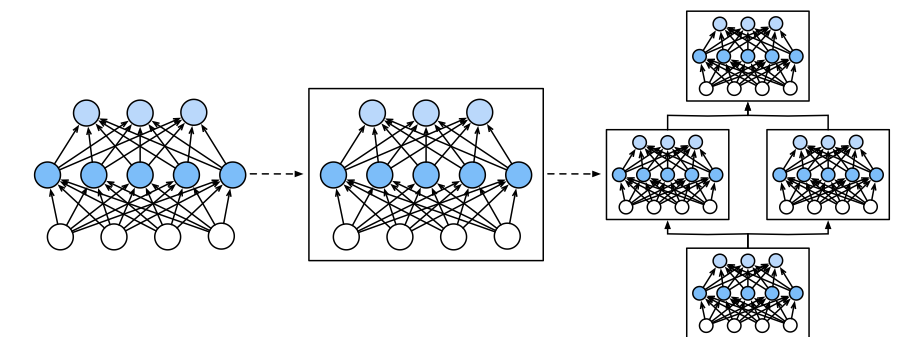
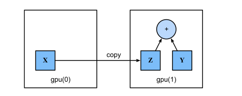

# Builders’ Guide

> **Ý chính trong một câu:** năm chương đầu dạy bạn *deep learning là gì*; chương này dạy bạn **công cụ để xây nó** — cách gói layer thành module tái sử dụng được, quản lý tham số, viết layer riêng, lưu model ra đĩa, và đưa mọi thứ lên GPU.

## Mục tiêu học tập

Học xong chương, bạn có thể:

- [ ] giải thích khái niệm {{term:module|module}} và vì sao nó nằm giữa "layer" và "toàn bộ model";
- [ ] tự viết một module bằng cách kế thừa `nn.Module` và hiện thực `forward`;
- [ ] hiện thực lại `Sequential` từ đầu và nói rõ vì sao phải dùng `_modules` chứ không phải list Python;
- [ ] truy cập, duyệt và **buộc chung** (tie) tham số giữa các layer;
- [ ] dùng bộ khởi tạo có sẵn và viết bộ khởi tạo riêng;
- [ ] giải thích {{term:lazy-initialization|lazy initialization}} và vì sao nó tiện cho CNN;
- [ ] viết layer riêng **có** và **không có** tham số;
- [ ] lưu và nạp tensor cùng `state_dict`, và nói rõ **cái gì không được lưu**;
- [ ] quản lý thiết bị tính toán, và tránh những phép chuyển dữ liệu vô tình làm chậm chương trình.

## Bản đồ chương

```text
   VẤN ĐỀ: hiện thực MLP từ đầu (mục 5.2) rất lộn xộn —
   đặt tên tham số thủ công, chèn thêm layer là phải đổi tên hàng loạt
                            │
   6.1 MODULE — trừu tượng hoá nằm giữa layer và model
       một layer · một khối nhiều layer · cả model — đều là module
                            │
   ┌────────────────────────┴────────────────────────┐
   │              VÒNG ĐỜI CỦA THAM SỐ               │
   │  6.2 truy cập & buộc chung                      │
   │  6.3 khởi tạo (có sẵn và tự viết)               │
   │  6.4 lazy init — suy ra shape khi thấy dữ liệu  │
   └────────────────────────┬────────────────────────┘
                            │
   6.5 LAYER RIÊNG (có / không có tham số)
                            │
   6.6 LƯU VÀ NẠP — tensor, state_dict; kiến trúc thì KHÔNG lưu được
                            │
   6.7 GPU — đặt dữ liệu và model ở đâu, và tránh chuyển qua lại
```

## Bức tranh tổng quan

Song hành với dataset khổng lồ và phần cứng mạnh, **công cụ phần mềm tốt đã đóng vai trò không thể thiếu** trong tiến bộ nhanh chóng của deep learning.

Sách kể một lịch sử ngắn rất đáng đọc. Bắt đầu từ thư viện **Theano** mang tính mở đường ra mắt năm 2007, các công cụ mã nguồn mở linh hoạt đã cho phép nhà nghiên cứu **dựng nguyên mẫu model nhanh chóng**, tránh việc lặp lại công việc khi tái sử dụng các thành phần chuẩn, mà vẫn giữ được khả năng can thiệp ở mức thấp.

Theo thời gian, các thư viện deep learning đã tiến hoá để cung cấp **những trừu tượng ngày càng thô hơn**. Sách đưa ra một phép so sánh rất đắt:

> Giống như nhà thiết kế bán dẫn đã đi từ việc đặc tả **transistor** sang **mạch logic** rồi sang **viết code**, các nhà nghiên cứu mạng nơ-ron đã chuyển từ việc nghĩ về hành vi của **từng nơ-ron nhân tạo** sang hình dung mạng theo **cả layer**, và nay thường thiết kế kiến trúc theo **những khối lớn hơn nhiều**.

**Vì sao chương này tồn tại.** Mục 5.2.3 đã chỉ ra vấn đề rất cụ thể: hiện thực MLP từ đầu *"vẫn lộn xộn: việc đặt tên và theo dõi tham số khiến model khó mở rộng. Ví dụ, hãy tưởng tượng muốn chèn thêm một layer giữa layer 42 và 43 — nó sẽ phải là 'layer 42b', trừ khi ta chịu đổi tên hàng loạt."*

Chương này là câu trả lời cho vấn đề đó.

**Điều bạn cần mang theo:** MLP và cách hiện thực nó (chương 5), automatic differentiation (mục 2.5), và các thao tác tensor cơ bản (chương 2).

> **Ghi chú về cách đọc chương này.** Khác với các chương trước, đây là chương về **kỹ thuật phần mềm** chứ không phải về toán. Ít công thức hơn, nhưng những gì học được ở đây bạn sẽ **dùng trong mọi dự án về sau**. Hãy đọc kèm việc gõ thử code.

<!-- pagebreak -->

## 6.1 Layers and Modules

### Trực giác

Khi mới giới thiệu mạng nơ-ron, ta tập trung vào model tuyến tính một output — cả model chỉ gồm **một nơ-ron**. Nơ-ron đó (i) nhận một tập input; (ii) sinh ra một output vô hướng; và (iii) có một tập tham số cập nhật được.

Rồi khi nghĩ tới mạng nhiều output, ta dùng số học vector hoá để mô tả **cả một layer** nơ-ron. Giống như từng nơ-ron, layer (i) nhận một tập input, (ii) sinh output tương ứng, và (iii) được mô tả bởi một tập tham số điều chỉnh được.

Điều thú vị là **với MLP, cả model lẫn từng layer cấu thành đều chia sẻ cấu trúc này**. Cả model nhận input thô (feature), sinh output (dự đoán), và có tham số (gộp từ mọi layer). Tương tự, mỗi layer riêng lẻ nhận input (từ layer trước), sinh output (làm input cho layer sau), và có tập tham số riêng.

**Nhưng nơ-ron, layer và model vẫn chưa đủ.** Sách chỉ ra rằng ta thường thấy tiện khi nói về những thành phần **lớn hơn một layer nhưng nhỏ hơn cả model**.

Ví dụ cụ thể: kiến trúc **ResNet-152**, cực kỳ phổ biến trong computer vision, có **hàng trăm layer**. Những layer này gồm các **mẫu lặp lại của NHÓM layer**. Hiện thực mạng như vậy từng layer một sẽ rất **nhàm chán và dễ sai**.

Và mối lo này **không chỉ là giả thuyết** — các mẫu thiết kế như vậy rất phổ biến trong thực tế. Kiến trúc ResNet đã thắng các cuộc thi ImageNet và COCO 2015 cho cả nhận dạng lẫn phát hiện, và vẫn là kiến trúc được chọn cho nhiều nhiệm vụ thị giác.

### Module — trừu tượng hoá cần thiết

Để hiện thực những mạng phức tạp đó, ta đưa vào khái niệm **{{term:module|module}}** của mạng nơ-ron.

**Một module có thể mô tả một layer duy nhất, một thành phần gồm nhiều layer, hoặc CHÍNH CẢ MODEL.** Lợi ích của trừu tượng hoá này là các module có thể **ghép lại thành những khối lớn hơn, thường là đệ quy**.



> Bằng cách định nghĩa code sinh ra module với độ phức tạp tuỳ ý theo yêu cầu, ta có thể **viết code gọn đến bất ngờ mà vẫn hiện thực được mạng nơ-ron phức tạp**.

**Từ góc nhìn lập trình, một module được biểu diễn bởi một CLASS.** Bất kỳ lớp con nào của nó cũng phải:

1. định nghĩa một phương thức **forward propagation** biến input thành output;
2. **lưu trữ** mọi tham số cần thiết.

Chú ý rằng một số module **không cần tham số nào cả**.

Cuối cùng, module phải có phương thức **backpropagation** để tính gradient. May mắn là nhờ phép màu hậu trường của **automatic differentiation** (mục 2.5), khi định nghĩa module riêng ta **chỉ cần lo về tham số và phương thức forward propagation**.

### 6.1.1 A Custom Module

```python
class MLP(nn.Module):
    def __init__(self):
        # Gọi __init__ của lớp cha để khởi tạo phần "housekeeping".
        super().__init__()
        self.hidden = nn.LazyLinear(256)
        self.out = nn.LazyLinear(10)

    # Chỉ cần định nghĩa forward; backward do autograd lo.
    def forward(self, X):
        return self.out(F.relu(self.hidden(X)))
```

Chú ý việc gán `self.hidden = ...` không chỉ là gán thuộc tính Python thông thường — `nn.Module` **ghi nhận** nó và tự động đưa tham số của layer con vào danh sách tham số của module cha. Đó là toàn bộ "housekeeping" mà sách nhắc tới.

### 6.1.2 The Sequential Module

Để hiểu `Sequential` hoạt động thế nào, hãy tự hiện thực nó. Sách nêu rõ nó cần làm **hai việc**:

1. Một phương thức để **thêm module** vào danh sách, từng cái một.
2. Một phương thức **forward propagation** để truyền input qua chuỗi module, **theo đúng thứ tự** chúng được thêm vào.

```python
class MySequential(nn.Module):
    def __init__(self, *args):
        super().__init__()
        for idx, module in enumerate(args):
            # _modules là một OrderedDict do nn.Module quản lý.
            self.add_module(str(idx), module)

    def forward(self, X):
        for module in self.children():
            X = module(X)
        return X
```

> **Vì sao dùng `_modules` chứ không phải một list Python?** Đây chính là nội dung bài tập 6.1.5 câu 1, và là điểm quan trọng nhất của mục này. Lợi ích chính là trong quá trình khởi tạo tham số của module, framework **biết phải tìm tham số cần khởi tạo ở đâu** — nó duyệt qua `_modules`. Một list Python thường thì `nn.Module` **không biết tới**.

### 6.1.3 Executing Code in the Forward Propagation Method

`Sequential` giúp việc xây model dễ dàng, nhưng **không phải mọi kiến trúc đều là chuỗi đơn giản**. Khi cần linh hoạt hơn, ta tự định nghĩa module.

Sách đưa một ví dụ cố tình kỳ quặc để minh hoạ mức tự do:

```python
class FixedHiddenMLP(nn.Module):
    def __init__(self):
        super().__init__()
        # Weight ngẫu nhiên KHÔNG train được: nó không phải parameter.
        self.rand_weight = torch.rand((20, 20))
        self.linear = nn.LazyLinear(20)

    def forward(self, X):
        X = self.linear(X)
        X = F.relu(X @ self.rand_weight + 1)
        # Dùng lại CÙNG một layer — tức tham số được chia sẻ (tied).
        X = self.linear(X)
        # Luồng điều khiển Python tuỳ ý ngay trong forward!
        while X.abs().sum() > 1:
            X /= 2
        return X.sum()
```

Ba điều đáng chú ý trong ví dụ này:

1. `rand_weight` là tensor thường, **không** phải `nn.Parameter`, nên nó **không được train** và không xuất hiện trong `parameters()`.
2. `self.linear` được gọi **hai lần** — đây là một dạng chia sẻ tham số.
3. `while` loop chạy **ngay trong forward pass** — autograd vẫn theo dõi được, vì graph được xây động khi thực thi.

### 6.1.4 Summary

- **Layer riêng lẻ có thể là module. Nhiều layer có thể tạo thành một module. Nhiều module có thể tạo thành một module.**
- Một module **có thể chứa code**.
- Module lo rất nhiều việc housekeeping, bao gồm **khởi tạo tham số** và **backpropagation**.
- Việc nối tuần tự các layer và module được xử lý bởi module `Sequential`.

### 6.1.5 Exercises

1. Những vấn đề gì sẽ xảy ra nếu bạn đổi `MySequential` để lưu module trong một **list Python**?
2. Hiện thực một module nhận **hai module** làm tham số, gọi là `net1` và `net2`, và trả về **output nối lại** của cả hai mạng trong forward propagation. Đây còn gọi là **parallel module**.
3. Giả sử bạn muốn nối **nhiều instance của cùng một mạng**. Hãy hiện thực một **factory function** sinh ra nhiều instance của cùng một module và xây một mạng lớn hơn từ đó.

<details markdown="1"><summary>Gợi ý</summary>

Câu 1: thử viết một phiên bản dùng `self.modules_list = list(args)` rồi gọi `net.parameters()` — bạn thấy gì? Câu 3: "factory function" nghĩa là một hàm **tạo ra** module, không phải một module.
</details>

<details markdown="1"><summary>Lời giải</summary>

**Câu 1.** Dùng list Python thường gây **nhiều vấn đề nghiêm trọng**, tất cả đều bắt nguồn từ việc `nn.Module` **không biết tới** nội dung của list đó.

```python
class BrokenSequential(nn.Module):
    def __init__(self, *args):
        super().__init__()
        self.mods = list(args)      # ✗ list thường — nn.Module không thấy
```

**Hậu quả cụ thể:**

| Vấn đề | Chi tiết |
|---|---|
| **`parameters()` trả về rỗng** | Optimizer không nhận được tham số nào → **model không bao giờ học** |
| **`.to(device)` không chuyển các layer con** | Chuyển model lên GPU nhưng layer con vẫn ở CPU → lỗi "expected all tensors on same device" |
| **`state_dict()` thiếu tham số** | Lưu model xong, nạp lại thì trọng số rỗng |
| **`.train()` / `.eval()` không lan xuống** | Dropout và batch norm **không đổi chế độ** lúc đánh giá |

Điểm nguy hiểm nhất là **vấn đề đầu tiên im lặng**: code chạy không lỗi, loss được tính, `optimizer.step()` được gọi — nhưng không có gì thay đổi. Bạn sẽ ngồi gỡ lỗi learning rate hàng giờ.

**Cách sửa đúng:** dùng `nn.ModuleList` (nếu cần index) hoặc `nn.ModuleDict` (nếu cần tên), hoặc gọi `self.add_module(name, mod)` như hiện thực của sách. Cả ba đều đăng ký module con với framework.

**Câu 2.**

```python
class Parallel(nn.Module):
    """Chạy hai mạng con trên cùng input rồi nối output lại."""
    def __init__(self, net1, net2):
        super().__init__()
        self.net1 = net1            # gán thuộc tính → tự động được đăng ký
        self.net2 = net2

    def forward(self, X):
        # Nối theo chiều feature; chiều batch (dim 0) phải khớp.
        return torch.cat((self.net1(X), self.net2(X)), dim=1)
```

```python
net = Parallel(nn.Sequential(nn.LazyLinear(32), nn.ReLU()),
               nn.Sequential(nn.LazyLinear(16), nn.ReLU()))
X = torch.rand(4, 20)
net(X).shape        # torch.Size([4, 48])  ← 32 + 16
```

Chú ý: vì `net1` và `net2` được gán làm **thuộc tính**, chúng tự động được đăng ký — không cần `add_module`. Đó là điểm khác với câu 1, nơi ta cất chúng vào một list.

**Vì sao mẫu này hữu ích:** nó chính là nền của **inception module** (chạy nhiều kích thước kernel song song rồi nối lại) và của **multi-head attention** (mỗi head là một nhánh song song).

**Câu 3.**

```python
def block_factory(num_blocks, in_features, out_features):
    """Sinh ra num_blocks bản sao ĐỘC LẬP của cùng một kiến trúc."""
    blocks = []
    for i in range(num_blocks):
        blocks.append(nn.Sequential(
            nn.LazyLinear(out_features), nn.ReLU()))
    return nn.Sequential(*blocks)


net = block_factory(4, 20, 64)
```

**Một cái bẫy rất đáng nêu.** So sánh hai cách viết sau:

```python
# ✓ ĐÚNG: mỗi block có tham số RIÊNG
blocks = [nn.LazyLinear(64) for _ in range(4)]

# ✗ SAI (nếu bạn muốn tham số riêng): cả 4 vị trí là CÙNG MỘT object
block = nn.LazyLinear(64)
blocks = [block] * 4
```

Cách thứ hai tạo ra **bốn tham chiếu tới cùng một layer**, nên tham số bị **chia sẻ** giữa cả bốn vị trí. Đôi khi đó đúng là điều bạn muốn (xem mục 6.2.2 về tied parameters), nhưng nếu vô tình thì model sẽ có ít tham số hơn dự kiến rất nhiều và học kém.

**Bẫy thường gặp:** gọi `[nn.Linear(...)] * n` rồi thắc mắc vì sao `len(list(net.parameters()))` nhỏ hơn mong đợi.
</details>

<!-- pagebreak -->

## 6.2 Parameter Management

### Trực giác

Sau khi chọn được kiến trúc và hyperparameter, ta bước vào vòng lặp training với mục tiêu tìm bộ tham số cực tiểu hàm loss. Đôi khi ta cần **trích xuất tham số** — để tái sử dụng trong bối cảnh khác, để lưu model ra đĩa, hoặc để khảo sát nhằm hiểu thêm.

### 6.2.1 Parameter Access

```python
net = nn.Sequential(nn.LazyLinear(8), nn.ReLU(), nn.LazyLinear(1))
X = torch.rand(size=(2, 4))
net(X).shape

net[2].state_dict()
# OrderedDict([('weight', tensor([[...]])), ('bias', tensor([...]))])
```

**Truy cập một tham số cụ thể:**

```python
type(net[2].bias), net[2].bias.data
# (torch.nn.parameter.Parameter, tensor([...]))
```

Chú ý phân biệt hai thứ:

- `net[2].bias` là một `Parameter` — một object phức hợp chứa giá trị, gradient và siêu dữ liệu.
- `net[2].bias.data` là **tensor giá trị** thuần tuý.

Và `net[2].weight.grad` cho gradient — **`None` cho tới khi backward được gọi**.

**Duyệt mọi tham số cùng lúc:**

```python
[(name, param.shape) for name, param in net.named_parameters()]
# [('0.weight', torch.Size([8, 4])), ('0.bias', torch.Size([8])),
#  ('2.weight', torch.Size([1, 8])), ('2.bias', torch.Size([1]))]
```

Chú ý cách đặt tên `'0.weight'`, `'2.weight'` — **chỉ số phản ánh vị trí trong `Sequential`**, và layer 1 (ReLU) không xuất hiện vì nó không có tham số. Với module lồng nhau, tên trở thành đường dẫn phân cấp kiểu `'block1.0.weight'`.

### 6.2.2 Tied Parameters

Thường ta muốn **chia sẻ tham số giữa nhiều layer**. Đây là cách làm gọn gàng:

```python
# Ta cần cấp phát shared TRƯỚC, rồi dùng lại object đó ở nhiều vị trí.
shared = nn.LazyLinear(8)
net = nn.Sequential(nn.LazyLinear(8), nn.ReLU(),
                    shared, nn.ReLU(),
                    shared, nn.ReLU(),
                    nn.LazyLinear(1))
net(X)

# Kiểm tra: hai vị trí có CÙNG giá trị
print(net[2].weight.data[0] == net[4].weight.data[0])
# Đổi một cái thì cái kia cũng đổi — vì chúng là MỘT object
net[2].weight.data[0, 0] = 100
print(net[2].weight.data[0] == net[4].weight.data[0])   # vẫn True
```

> **Chú ý:** ở đây ta cần chạy forward propagation `net(X)` **trước khi** truy cập tham số, vì `LazyLinear` chưa biết shape cho tới lúc đó (mục 6.4).

**Điều gì xảy ra với gradient khi tham số được buộc chung?** Vì đây là **cùng một object**, gradient từ cả hai vị trí được **cộng dồn** vào cùng một `.grad`. Đây chính là hành vi đúng — nó tương đương với việc lấy đạo hàm của một hàm mà cùng một biến xuất hiện ở nhiều chỗ.

### 6.2.3 Summary

- Ta có **vài cách** để truy cập và buộc chung tham số model.

### 6.2.4 Exercises

1. Dùng model `NestMLP` định nghĩa ở mục 6.1 và truy cập tham số của các layer khác nhau.
2. Xây một MLP chứa một layer có **tham số chia sẻ** và train nó. Trong quá trình training, hãy quan sát tham số model và gradient của mỗi layer.
3. **Vì sao chia sẻ tham số lại là ý hay?**

<details markdown="1"><summary>Gợi ý</summary>

Câu 2: gradient tại layer chia sẻ có bằng gradient của một layer thường không, hay lớn hơn? Câu 3: nghĩ về số tham số, về dữ liệu cần thiết, và về việc ta muốn model học **cùng một phép biến đổi** ở nhiều vị trí.
</details>

<details markdown="1"><summary>Lời giải</summary>

**Câu 1.** Với module lồng nhau, tên tham số trở thành **đường dẫn phân cấp**:

```python
print([(name, p.shape) for name, p in net.named_parameters()])
# [('net.0.weight', ...), ('net.0.bias', ...), ('linear.weight', ...), ...]
```

Truy cập trực tiếp bằng cách đi theo cấu trúc: `net.net[0].weight`, hoặc dùng `net.get_parameter('net.0.weight')`.

Điểm đáng chú ý: `named_parameters()` **duyệt đệ quy** toàn bộ cây module, nên nó luôn cho danh sách đầy đủ dù cấu trúc lồng sâu tới đâu. Đây chính là điều bạn **mất đi** nếu dùng list Python (bài tập 6.1.5 câu 1).

**Câu 2.** Quan sát then chốt: **gradient tại layer chia sẻ là TỔNG gradient từ mọi vị trí nó xuất hiện**.

```python
shared = nn.Linear(8, 8)
net = nn.Sequential(nn.Linear(4, 8), nn.ReLU(), shared, nn.ReLU(), shared, nn.Linear(8, 1))
loss = net(X).sum()
loss.backward()
# shared.weight.grad chứa TỔNG đóng góp từ cả hai lần sử dụng
```

Điều này đúng về mặt toán học. Nếu hàm loss là $L(\mathbf{W}, \mathbf{W})$ — cùng một $\mathbf{W}$ ở hai vị trí — thì theo quy tắc dây chuyền:

$$
\frac{\partial L}{\partial \mathbf{W}} = \left.\frac{\partial L}{\partial \mathbf{W}_1}\right|_{\mathbf{W}_1 = \mathbf{W}} + \left.\frac{\partial L}{\partial \mathbf{W}_2}\right|_{\mathbf{W}_2 = \mathbf{W}}
$$

**Hệ quả thực hành:** gradient tại layer chia sẻ thường **lớn hơn** gradient tại layer thường, đơn giản vì nó là tổng của nhiều số hạng. Với mạng chia sẻ tham số qua **nhiều** bước (như RNN chia sẻ qua $T$ bước thời gian), tổng này có thể rất lớn — và đó là một lý do RNN thường cần **gradient clipping**.

**Câu 3.** Chia sẻ tham số có **bốn** lợi ích, và chúng khác nhau về bản chất:

**1. Ít tham số hơn → ít overfit hơn.** Đây là lợi ích hiển nhiên nhất. Model có ít bậc tự do hơn nên cần ít dữ liệu hơn để ước lượng tốt.

**2. Mã hoá một giả định đúng về bài toán.** Đây mới là lý do sâu sắc nhất. Chia sẻ tham số không phải mẹo tiết kiệm — nó là cách **nói với model rằng cùng một phép biến đổi nên được áp ở nhiều vị trí**:

| Kiến trúc | Chia sẻ gì | Giả định được mã hoá |
|---|---|---|
| **CNN** | cùng filter trượt khắp ảnh | *"Phát hiện cạnh ở góc trên trái cũng giống ở góc dưới phải"* — bất biến tịnh tiến |
| **RNN** | cùng weight qua mọi bước thời gian | *"Quy tắc cập nhật trạng thái không đổi theo thời gian"* |
| **Embedding buộc chung** | embedding input và output dùng chung ma trận | *"Từ được biểu diễn như nhau dù ở đầu vào hay đầu ra"* |
| **Siamese network** | hai nhánh dùng chung weight | *"Hai input phải được mã hoá theo cùng một cách để so sánh được"* |

**3. Bộ nhớ nhỏ hơn.** Với model rất lớn, buộc chung embedding input và output có thể tiết kiệm hàng trăm triệu tham số.

**4. Tổng quát hoá sang độ dài/kích thước khác.** Vì RNN dùng chung weight qua mọi bước, nó xử lý được chuỗi **dài hơn** những gì nó từng thấy lúc train. CNN tương tự với ảnh kích thước khác.

**Khi nào chia sẻ tham số là ý TỒI:** khi giả định đằng sau nó **sai**. Ví dụ, nếu các vị trí trong input thực sự có vai trò khác nhau (như các cột khác nhau trong một bảng dữ liệu), ép chúng dùng chung phép biến đổi sẽ làm model kém đi.

**Bẫy thường gặp:** vô tình chia sẻ tham số bằng `[layer] * n` (bài tập 6.1.5 câu 3) rồi tưởng model có nhiều tham số hơn thực tế.
</details>

<!-- pagebreak -->

## 6.3 Parameter Initialization

### Trực giác

Mục 5.4 đã bàn về **vì sao** khởi tạo quan trọng — đối xứng hoán vị, vanishing/exploding gradient, và công thức Xavier. Mục này bàn về **cách làm** trong framework.

Mặc định, PyTorch khởi tạo weight và bias bằng cách lấy mẫu từ một khoảng tính theo chiều input và output. Module `nn.init` cung cấp nhiều phương pháp khởi tạo sẵn.

### 6.3.1 Built-in Initialization

**Khởi tạo Gaussian:**

```python
def init_normal(module):
    if type(module) == nn.Linear:
        nn.init.normal_(module.weight, mean=0, std=0.01)
        nn.init.zeros_(module.bias)


# apply duyệt ĐỆ QUY mọi submodule và gọi hàm trên từng cái.
net.apply(init_normal)
```

**Khởi tạo khác nhau cho từng layer** — rất hữu ích khi các layer có vai trò khác nhau:

```python
def init_xavier(module):
    if type(module) == nn.Linear:
        nn.init.xavier_uniform_(module.weight)


def init_constant_42(module):
    if type(module) == nn.Linear:
        nn.init.constant_(module.weight, 42)


net[0].apply(init_xavier)         # layer đầu dùng Xavier
net[2].apply(init_constant_42)    # layer cuối dùng hằng số (chỉ để minh hoạ!)
```

> **Cảnh báo nối với mục 5.4:** khởi tạo mọi weight bằng hằng số 42 như trên **chỉ là ví dụ minh hoạ cú pháp**. Trong thực tế nó vi phạm nguyên tắc phá vỡ đối xứng và mạng sẽ không học được — xem phần "Breaking the Symmetry" ở mục 5.4.2.

**Khởi tạo tự viết.** Đôi khi framework không có sẵn phương pháp ta cần. Ví dụ của sách định nghĩa:

$$
w \sim
\begin{cases}
U(5, 10) & \text{với xác suất } \tfrac14 \\
0 & \text{với xác suất } \tfrac12 \\
U(-10, -5) & \text{với xác suất } \tfrac14
\end{cases}
$$

```python
def my_init(module):
    if type(module) == nn.Linear:
        nn.init.uniform_(module.weight, -10, 10)
        # Giữ lại weight có |w| >= 5, phần còn lại về 0.
        module.weight.data *= module.weight.data.abs() >= 5
```

Và ta luôn có thể **gán trực tiếp**:

```python
net[0].weight.data[:] += 1
net[0].weight.data[0, 0] = 42
```

### 6.3.2 Summary

- Ta có thể khởi tạo tham số bằng **bộ khởi tạo có sẵn** và bằng **bộ khởi tạo tự viết**.

### 6.3.3 Exercises

Tra cứu tài liệu trực tuyến để biết thêm các bộ khởi tạo có sẵn.

<details markdown="1"><summary>Gợi ý</summary>

Xem `torch.nn.init` — chú ý đặc biệt tới những bộ khởi tạo có tham số `nonlinearity` hoặc `gain`, và tự hỏi vì sao chúng cần biết hàm kích hoạt.
</details>

<details markdown="1"><summary>Lời giải</summary>

Module `torch.nn.init` cung cấp các bộ khởi tạo chính sau:

| Hàm | Dùng khi nào |
|---|---|
| `xavier_uniform_` / `xavier_normal_` | Mạng dùng tanh hoặc sigmoid (mục 5.4.2) |
| `kaiming_uniform_` / `kaiming_normal_` | Mạng dùng **ReLU** — nhân đôi phương sai để bù phần activation bị cắt |
| `orthogonal_` | Đặt mọi giá trị kỳ dị bằng 1; tốt cho RNN vì giữ gradient ổn định qua nhiều bước |
| `normal_`, `uniform_`, `constant_`, `zeros_`, `ones_` | Cơ bản, dùng cho bias hoặc khi tự thiết kế |
| `sparse_` | Mỗi cột chỉ có một số phần tử khác 0 |
| `eye_`, `dirac_` | Khởi tạo gần với phép đồng nhất |

**Điểm đáng chú ý — tham số `gain` và `nonlinearity`.** Câu hỏi "vì sao bộ khởi tạo cần biết hàm kích hoạt?" chạm đúng vào điều mục 5.4.2 để lại dang dở.

Xavier được dẫn ra cho layer **không có phi tuyến**. Nhưng hàm kích hoạt **làm đổi phương sai**:

- **tanh** gần như giữ nguyên phương sai quanh 0 → `gain = 1`, Xavier đúng như đã dẫn.
- **ReLU** cắt bỏ một nửa (phần âm) → phương sai output còn **một nửa** → cần nhân đôi để bù, tức `gain = √2`. Đó chính là **Kaiming (He) initialization**.

```python
# Hai cách viết tương đương cho ReLU:
nn.init.kaiming_normal_(w, nonlinearity='relu')
nn.init.normal_(w, std=math.sqrt(2.0 / fan_in))
```

**Quy tắc thực hành:** dùng Kaiming cho mạng ReLU, Xavier cho tanh/sigmoid, orthogonal cho RNN. Với các kiến trúc hiện đại, đây thường đã là mặc định của framework nên ta hiếm khi phải đặt tay.

**Bẫy thường gặp:** dùng Xavier cho một mạng ReLU rất sâu. Nó không sai hẳn nhưng hơi bảo thủ, và tín hiệu sẽ tắt dần qua nhiều tầng — đúng vấn đề mục 5.4.1 mô tả.
</details>

<!-- pagebreak -->

## 6.4 Lazy Initialization

### Trực giác

Sách mở đầu bằng một quan sát tự trào: cho tới giờ, có vẻ ta đã **cẩu thả** khi dựng mạng. Cụ thể, ta làm những việc **không trực giác** sau, mà lẽ ra không nên chạy được:

- Ta định nghĩa kiến trúc mạng **mà không chỉ định số chiều của input**.
- Ta thêm layer **mà không chỉ định chiều output của layer trước**.
- Ta thậm chí "khởi tạo" các tham số đó **trước khi cung cấp đủ thông tin** để xác định model cần bao nhiêu tham số.

**Bạn có thể ngạc nhiên vì code chạy được.** Suy cho cùng, framework **không có cách nào** biết được chiều input của mạng.

**Thủ thuật ở đây là framework HOÃN việc khởi tạo**, chờ tới lần đầu tiên ta truyền dữ liệu qua model, để **suy ra kích thước của từng layer ngay tại thời điểm đó**. Đây gọi là **{{term:lazy-initialization|lazy initialization}}**.

> **Vì sao điều này càng tiện hơn về sau:** khi làm việc với convolutional neural network, kỹ thuật này còn tiện hơn nữa, vì chiều input (ví dụ độ phân giải ảnh) **ảnh hưởng tới chiều của mọi layer tiếp theo**. Khả năng đặt tham số mà không cần biết trước giá trị của chiều đó, ngay lúc viết code, **đơn giản hoá rất nhiều** việc đặc tả và sửa đổi model.

### Cơ chế

```python
net = nn.Sequential(nn.LazyLinear(256), nn.ReLU(), nn.LazyLinear(10))

# Lúc này framework CHƯA khởi tạo tham số nào.
net[0].weight
# <UninitializedParameter>
```

Ở thời điểm này, **mạng không thể nào biết chiều của weight ở input layer**, vì chiều input vẫn chưa xác định.

```python
X = torch.rand(2, 20)
net(X)          # truyền dữ liệu qua → framework khởi tạo

net[0].weight.shape
# torch.Size([256, 20])   ← 20 được SUY RA từ dữ liệu
```

**Cơ chế lan truyền shape:**

1. Layer đầu thấy input có 20 feature → khởi tạo $\mathbf{W}_1$ với shape $(256, 20)$.
2. Output của nó có 256 feature → layer hai biết chiều input của mình là 256 → khởi tạo $\mathbf{W}_2$ shape $(10, 256)$.
3. Chuỗi này lan tới hết mạng.

> **Lưu ý thực hành:** vì tham số chưa tồn tại trước lần forward đầu tiên, bạn **không thể** gọi `optimizer = SGD(net.parameters(), ...)` trước khi truyền dữ liệu. Thứ tự đúng là: dựng mạng → truyền một batch giả → tạo optimizer. Hoặc dùng `nn.Linear` với shape tường minh nếu muốn tránh phức tạp.

### 6.4.1 Summary

- **Lazy initialization có thể rất tiện**, cho phép framework **tự suy ra shape tham số**, giúp việc sửa đổi kiến trúc dễ dàng và **loại bỏ một nguồn lỗi phổ biến**.
- Ta truyền dữ liệu qua model để framework cuối cùng khởi tạo tham số.

### 6.4.2 Exercises

1. Chuyện gì xảy ra nếu bạn **chỉ định chiều input cho layer đầu tiên** nhưng không cho các layer sau? Bạn có nhận được khởi tạo **ngay lập tức** không?
2. Chuyện gì xảy ra nếu bạn chỉ định **chiều không khớp nhau**?
3. Bạn cần làm gì nếu có input với **chiều thay đổi**? Gợi ý: xem phần **buộc chung tham số** (parameter tying).

<details markdown="1"><summary>Gợi ý</summary>

Câu 1: khởi tạo lan từ trái sang phải — nếu layer đầu đã biết shape thì layer hai có biết ngay không? Câu 3: nếu input có chiều khác nhau mà bạn muốn dùng **cùng** một layer cho chúng, weight phải có shape thế nào?
</details>

<details markdown="1"><summary>Lời giải</summary>

**Câu 1.** Nếu bạn chỉ định chiều input cho layer đầu (dùng `nn.Linear(20, 256)` thay vì `nn.LazyLinear(256)`) nhưng để các layer sau lazy, thì:

**Layer đầu được khởi tạo NGAY LẬP TỨC** — nó đã có đủ thông tin.

**Nhưng các layer sau thì KHÔNG.** Lý do tinh tế: framework khởi tạo theo cơ chế **lan truyền shape khi dữ liệu thực sự chảy qua**, chứ không phải bằng cách suy luận tĩnh trên đồ thị. Dù về nguyên tắc nó *có thể* suy ra rằng layer hai nhận 256 input, PyTorch không làm vậy — nó chờ tới khi thấy tensor thật.

```python
net = nn.Sequential(nn.Linear(20, 256), nn.ReLU(), nn.LazyLinear(10))
net[0].weight.shape       # torch.Size([256, 20])  ← đã có
net[2].weight             # <UninitializedParameter>  ← chưa có
```

**Hệ quả thực hành:** dù bạn chỉ định shape cho một số layer, vẫn phải chạy một lần forward trước khi tạo optimizer.

**Câu 2.** Bạn nhận **lỗi runtime**, và nó xảy ra **khi truyền dữ liệu**, không phải lúc dựng mạng.

```python
net = nn.Sequential(nn.Linear(20, 256), nn.ReLU(), nn.Linear(128, 10))
#                                                            ^^^ sai: phải là 256
X = torch.rand(2, 20)
net(X)
# RuntimeError: mat1 and mat2 shapes cannot be multiplied (2x256 and 128x10)
```

**Điểm đáng chú ý về thời điểm báo lỗi.** Mạng được **dựng thành công** — Python không phàn nàn gì khi bạn viết `nn.Linear(128, 10)` sau một layer xuất ra 256 chiều. Lỗi chỉ lộ ra lúc chạy.

Đây chính là lý do sách nói lazy initialization **"loại bỏ một nguồn lỗi phổ biến"**: khi dùng `LazyLinear`, loại sai sót này **không thể xảy ra**, vì chiều input luôn được suy ra chứ không do bạn gõ tay.

Với mạng sâu và nhiều phép biến đổi shape (flatten, pooling, convolution), tính nhẩm chiều là việc rất dễ sai — và lazy initialization xoá bỏ hoàn toàn nhóm lỗi này.

**Câu 3.** Đây là câu hỏi hay nhất trong mục, và gợi ý về parameter tying chỉ đúng một phần câu trả lời.

**Vấn đề cốt lõi:** một `nn.Linear` có weight shape cố định $(n_{\text{out}}, n_{\text{in}})$. Nếu input đổi chiều, phép nhân ma trận **không thực hiện được**. Lazy init chỉ giúp ở **lần đầu tiên** — sau đó shape bị khoá.

```python
net = nn.Sequential(nn.LazyLinear(10))
net(torch.rand(2, 20))     # OK: khoá shape ở 20
net(torch.rand(2, 30))     # RuntimeError — shape đã cố định
```

**Ba cách xử lý, tuỳ bản chất bài toán:**

**Cách 1 — đệm hoặc cắt về độ dài cố định.** Đơn giản nhất và rất phổ biến. Đây đúng là điều mục 16.1.2 làm với đánh giá phim (`num_steps = 500`). Nhược điểm: mất thông tin nếu cắt, lãng phí tính toán nếu đệm.

**Cách 2 — dùng phép gộp không phụ thuộc độ dài.** Thay vì fully connected trên toàn chuỗi, dùng một phép **pooling** gộp chiều thay đổi về chiều cố định:

```python
class VariableLengthNet(nn.Module):
    def __init__(self, d_model, num_outputs):
        super().__init__()
        self.proj = nn.LazyLinear(d_model)     # áp cho TỪNG phần tử
        self.out = nn.Linear(d_model, num_outputs)

    def forward(self, X):                      # X: (batch, seq_len, features)
        H = F.relu(self.proj(X))               # (batch, seq_len, d_model)
        H = H.mean(dim=1)                      # gộp chiều thay đổi đi
        return self.out(H)                     # (batch, num_outputs)
```

Đây chính là ý tưởng của **max-over-time pooling** ở mục 16.3.2.

**Cách 3 — chia sẻ tham số qua các vị trí (đúng gợi ý của đề bài).** Thay vì một weight lớn cho cả input, dùng **cùng một** phép biến đổi nhỏ áp lặp lại:

- **RNN** chia sẻ weight qua mọi bước thời gian → xử lý được chuỗi dài tuỳ ý.
- **CNN** chia sẻ filter qua mọi vị trí không gian → xử lý được ảnh kích thước tuỳ ý (nếu kết hợp với global pooling).
- **Transformer** chia sẻ cùng một projection cho mọi token.

Đây là lý do sâu xa khiến những kiến trúc đó xử lý được input độ dài thay đổi, trong khi MLP thuần thì không — và nó nối thẳng về lợi ích số 4 trong lời giải bài tập 6.2.4 câu 3.

**Bẫy thường gặp:** dùng `nn.Flatten()` rồi `nn.LazyLinear()` cho dữ liệu chuỗi, thấy chạy được với batch đầu tiên, rồi gặp lỗi khi batch sau có độ dài khác.
</details>

<!-- pagebreak -->

## 6.5 Custom Layers

### Trực giác

Một yếu tố đứng sau thành công của deep learning là **sự sẵn có của rất nhiều loại layer** có thể ghép lại một cách sáng tạo để thiết kế kiến trúc phù hợp với đủ loại nhiệm vụ. Các nhà nghiên cứu đã phát minh layer chuyên cho xử lý ảnh, văn bản, lặp trên dữ liệu tuần tự, và thực hiện quy hoạch động.

**Sớm hay muộn, bạn sẽ cần một layer chưa tồn tại trong framework.** Khi đó bạn phải tự xây.

### 6.5.1 Layers without Parameters

Bắt đầu bằng layer **không có tham số nào của riêng nó**. Lớp `CenteredLayer` sau đơn giản là **trừ đi trung bình** khỏi input. Để xây nó, ta chỉ cần kế thừa lớp layer cơ sở và hiện thực hàm forward propagation:

```python
class CenteredLayer(nn.Module):
    def __init__(self):
        super().__init__()

    def forward(self, X):
        return X - X.mean()


layer = CenteredLayer()
layer(torch.tensor([1.0, 2, 3, 4, 5]))
# tensor([-2., -1.,  0.,  1.,  2.])
```

Ta có thể **nhúng nó vào model phức tạp hơn** như bất kỳ layer nào:

```python
net = nn.Sequential(nn.LazyLinear(128), CenteredLayer())
Y = net(torch.rand(4, 8))
Y.mean()        # gần 0 (sai số dấu phẩy động rất nhỏ)
```

> **Chú ý:** `Y.mean()` không đúng bằng 0 mà là một số cỡ $10^{-9}$. Đó là **sai số làm tròn của dấu phẩy động**, không phải lỗi — với dữ liệu lớn hơn nữa, các đại lượng có thể lệch đáng kể hơn.

### 6.5.2 Layers with Parameters

Giờ ta xây layer **có** tham số học được. Ta dùng hàm dựng sẵn để tạo tham số, và chúng lo việc housekeeping cơ bản — đáng chú ý nhất là **truy cập, khởi tạo, chia sẻ, lưu và nạp**.

Sách hiện thực lại `Linear` từ đầu:

```python
class MyLinear(nn.Module):
    def __init__(self, in_units, units):
        super().__init__()
        # nn.Parameter đánh dấu tensor này là tham số CẦN TRAIN.
        self.weight = nn.Parameter(torch.randn(in_units, units))
        self.bias = nn.Parameter(torch.randn(units))

    def forward(self, X):
        linear = torch.matmul(X, self.weight.data) + self.bias.data
        return F.relu(linear)


linear = MyLinear(5, 3)
linear.weight
```

**Điểm then chốt là `nn.Parameter`.** Bọc một tensor trong `nn.Parameter` làm ba việc cùng lúc:

1. Đăng ký nó vào `parameters()` → optimizer sẽ cập nhật nó.
2. Đặt `requires_grad=True` → autograd theo dõi nó.
3. Đưa nó vào `state_dict()` → nó được lưu và nạp cùng model.

Một tensor thường (như `rand_weight` ở mục 6.1.3) **không** có ba tính chất này.

Ta dùng layer tự viết y như layer có sẵn:

```python
net = nn.Sequential(MyLinear(64, 8), MyLinear(8, 1))
net(torch.rand(2, 64))
```

### 6.5.3 Summary

- Ta có thể thiết kế **layer riêng** thông qua lớp layer cơ sở. Điều này cho phép định nghĩa layer linh hoạt, hành xử **khác với mọi layer có sẵn** trong thư viện.
- Một khi đã định nghĩa, layer riêng có thể được gọi trong **bối cảnh và kiến trúc bất kỳ**.
- Layer có thể có **tham số cục bộ**, tạo ra thông qua các hàm dựng sẵn.

### 6.5.4 Exercises

1. Thiết kế một layer nhận input và tính **phép rút gọn tensor**, tức nó trả về $y_k = \sum_{i,j} W_{ijk} x_i x_j$.
2. Thiết kế một layer trả về **nửa đầu các hệ số Fourier** của dữ liệu.

<details markdown="1"><summary>Gợi ý</summary>

Câu 1: chú ý $x$ xuất hiện **hai lần** — đây là dạng song tuyến tính. Dùng `torch.einsum` để viết gọn. Câu 2: `torch.fft.rfft` đã trả về đúng nửa phổ không dư thừa cho input thực.
</details>

<details markdown="1"><summary>Lời giải</summary>

**Câu 1.** Đây là một **bilinear layer** — output là dạng toàn phương của input.

```python
class TensorReduction(nn.Module):
    """Tính y_k = sum_{i,j} W_{ijk} x_i x_j."""
    def __init__(self, dim_in, dim_out):
        super().__init__()
        # Tham số là một tensor BA chiều, không phải ma trận.
        self.weight = nn.Parameter(torch.randn(dim_in, dim_in, dim_out))

    def forward(self, X):
        # X: (batch, dim_in) -> Y: (batch, dim_out)
        # 'bi,ijk,bj->bk': lấy x_i và x_j từ cùng một mẫu b, cộng qua i và j.
        return torch.einsum('bi,ijk,bj->bk', X, self.weight, X)


layer = TensorReduction(10, 5)
layer(torch.rand(4, 10)).shape      # torch.Size([4, 5])
```

**Chi phí đáng chú ý:** số tham số là $d_{\text{in}}^2 \times d_{\text{out}}$ — **bậc hai** theo chiều input. Với $d_{\text{in}} = 1000$ và $d_{\text{out}} = 10$, đó là **10 triệu** tham số cho một layer. Đây là lý do bilinear layer hiếm khi dùng ở chiều cao mà không có phân rã hạng thấp.

**Vì sao layer này hữu ích:** nó mô hình hoá **tương tác cặp** giữa các feature một cách tường minh. Một layer tuyến tính chỉ biểu diễn được $\sum_i w_i x_i$; layer này biểu diễn được $\sum_{ij} w_{ij} x_i x_j$ — tức nó "biết" rằng feature $i$ và $j$ cùng lớn thì khác với chỉ một trong hai lớn. Ý tưởng này xuất hiện trong factorization machine và trong bilinear pooling cho thị giác.

**Câu 2.**

```python
class FourierHalf(nn.Module):
    """Trả về nửa đầu các hệ số Fourier (không có tham số học được)."""
    def forward(self, X):
        # rfft khai thác tính đối xứng của phổ với input thực:
        # nó chỉ trả về n//2 + 1 hệ số thay vì n.
        return torch.fft.rfft(X, dim=-1)


layer = FourierHalf()
X = torch.rand(4, 16)
layer(X).shape        # torch.Size([4, 9])  ← 16//2 + 1
```

**Vì sao `rfft` đã cho "nửa đầu" sẵn.** Với tín hiệu **thực**, phổ Fourier có tính **đối xứng Hermite**: $X[n-k] = \overline{X[k]}$. Nghĩa là nửa sau không mang thông tin mới — nó là liên hợp phức của nửa đầu theo thứ tự ngược. Vì vậy `rfft` trả về $n/2 + 1$ hệ số thay vì $n$, tiết kiệm một nửa bộ nhớ và tính toán mà **không mất thông tin gì**.

Nếu muốn dùng `fft` đầy đủ rồi tự cắt:

```python
def forward(self, X):
    return torch.fft.fft(X, dim=-1)[..., :X.shape[-1] // 2]
```

**Một lưu ý về gradient:** output là số **phức**, mà nhiều hàm loss không nhận số phức. Trong thực tế ta thường lấy **biên độ** `torch.abs(...)` hoặc tách phần thực và ảo thành hai kênh trước khi đưa vào layer sau.

**Layer này dùng ở đâu:** biến đổi Fourier rất hữu ích khi tín hiệu có cấu trúc tuần hoàn — xử lý âm thanh, chuỗi thời gian, và các kiến trúc như FNO (Fourier Neural Operator) cho phương trình vi phân.

**Bẫy thường gặp:** quên rằng layer này **không có tham số** nên `net.parameters()` sẽ không chứa gì từ nó — điều đó hoàn toàn bình thường, giống `CenteredLayer` và `nn.ReLU`.
</details>

<!-- pagebreak -->

## 6.6 File I/O

### Trực giác

Tới giờ ta đã bàn cách xử lý dữ liệu và cách xây, train, kiểm thử model deep learning. Nhưng đến một lúc, ta sẽ **đủ hài lòng với model đã học** để muốn **lưu kết quả** dùng về sau trong nhiều bối cảnh khác nhau (thậm chí để dự đoán khi triển khai).

Ngoài ra, khi chạy một quá trình training dài, cách làm tốt nhất là **lưu kết quả trung gian định kỳ (checkpointing)** để đảm bảo ta không mất vài ngày tính toán nếu vấp dây nguồn máy chủ.

### 6.6.1 Loading and Saving Tensors

Với từng tensor, ta gọi trực tiếp `load` và `save`:

```python
x = torch.arange(4)
torch.save(x, 'x-file')
x2 = torch.load('x-file')
```

Ta cũng lưu được **danh sách** và **từ điển** tensor:

```python
y = torch.zeros(4)
torch.save([x, y], 'x-files')
x2, y2 = torch.load('x-files')

mydict = {'x': x, 'y': y}
torch.save(mydict, 'mydict')
mydict2 = torch.load('mydict')
```

### 6.6.2 Loading and Saving Model Parameters

Lưu từng vector weight (hay từng tensor) thì được, nhưng rất rối nếu ta muốn lưu **cả model** với hàng trăm nhóm tham số. Vì vậy framework cung cấp cơ chế tích hợp.

**Nhưng đây là điều quan trọng nhất của mục, và sách nói rất rõ:**

> Chi tiết cần lưu ý là cơ chế này lưu **tham số** của model chứ **KHÔNG lưu cả model**. Ví dụ, nếu ta có MLP 3 layer, ta cần **chỉ định kiến trúc riêng**. Lý do là bản thân model có thể chứa **code Python tuỳ ý**, nên không thể tuần tự hoá một cách tự nhiên. Vì vậy, để khôi phục model, ta cần **sinh kiến trúc bằng code** rồi mới nạp tham số từ đĩa.

```python
net = MLP()
X = torch.randn(size=(2, 20))
Y = net(X)

# Lưu tham số
torch.save(net.state_dict(), 'mlp.params')

# Khôi phục: PHẢI dựng lại kiến trúc bằng code trước
clone = MLP()
clone.load_state_dict(torch.load('mlp.params'))
clone.eval()        # chuyển sang chế độ đánh giá

Y_clone = clone(X)
Y_clone == Y        # tensor([[True, True, ...]])
```

> **Chú ý `clone.eval()`.** Nếu model có dropout hoặc batch norm, quên dòng này sẽ làm dự đoán **ngẫu nhiên** và khác với model gốc — đúng cái bẫy nêu ở mục 5.6.3.

### 6.6.3 Summary

- Các hàm `save` và `load` có thể dùng để **đọc ghi file cho object tensor**.
- Ta có thể **lưu và nạp toàn bộ tập tham số** của mạng qua một từ điển tham số.
- **Lưu kiến trúc thì phải làm bằng CODE, không phải bằng tham số.**

### 6.6.4 Exercises

1. Ngay cả khi không cần triển khai model đã train sang thiết bị khác, lợi ích thực tế của việc **lưu tham số model** là gì?
2. Giả sử ta muốn **tái sử dụng chỉ một phần** của một mạng để đưa vào mạng có kiến trúc khác. Bạn sẽ làm thế nào để dùng, chẳng hạn, **hai layer đầu** từ một mạng cũ trong mạng mới?
3. Bạn sẽ làm thế nào để lưu **cả kiến trúc lẫn tham số**? Bạn sẽ áp những hạn chế gì lên kiến trúc?

<details markdown="1"><summary>Gợi ý</summary>

Câu 1: chuyện gì xảy ra nếu máy chủ mất điện ở giờ thứ 40 của một lượt train 48 giờ? Câu 2: `state_dict` là một từ điển — bạn lọc được các key của nó không? Câu 3: sách nói kiến trúc không tuần tự hoá được vì nó chứa **code Python tuỳ ý**; vậy hạn chế cần áp là gì?
</details>

<details markdown="1"><summary>Lời giải</summary>

**Câu 1.** Có nhiều lợi ích ngay cả khi không đổi thiết bị:

| Lợi ích | Chi tiết |
|---|---|
| **Checkpointing** | Lý do sách nhấn mạnh ở đầu mục: nếu training 48 giờ bị gián đoạn ở giờ 40, checkpoint cho phép tiếp tục thay vì làm lại từ đầu |
| **Chọn model tốt nhất** | Lưu checkpoint ở mỗi epoch rồi giữ lại cái có validation loss thấp nhất — đây chính là phần "khôi phục weight tốt nhất" của early stopping (mục 5.5.3) |
| **Tái lập kết quả** | Có thể tái tạo chính xác một kết quả đã báo cáo nhiều tháng sau |
| **Transfer learning** | Dùng lại weight đã train cho nhiệm vụ khác (mục 14.2) |
| **Ensemble** | Lưu nhiều model rồi trung bình dự đoán |
| **Phân tích hậu kỳ** | Khảo sát weight để hiểu model đã học gì, mà không phải train lại |
| **Gỡ lỗi** | So sánh checkpoint ở các thời điểm để tìm khi nào training bắt đầu hỏng |

Checkpointing đặc biệt quan trọng với model lớn, nơi một lượt train có thể tốn hàng nghìn đô la tiền GPU.

**Câu 2.** Vì `state_dict` là một **từ điển thông thường** với key là đường dẫn tên tham số (mục 6.2.1), ta **lọc nó được**:

```python
# Nạp state_dict của mạng cũ
old_state = torch.load('old_net.params')

# Giữ lại chỉ các key thuộc hai layer đầu
prefix_keep = ('0.', '2.')       # tên layer trong Sequential
partial = {k: v for k, v in old_state.items() if k.startswith(prefix_keep)}

# Nạp vào mạng mới, cho phép thiếu key
new_net = nn.Sequential(nn.Linear(20, 256), nn.ReLU(),
                        nn.Linear(256, 128), nn.ReLU(),
                        nn.Linear(128, 5))          # layer cuối MỚI
missing, unexpected = new_net.load_state_dict(partial, strict=False)
print("thiếu:", missing)          # các layer mới, sẽ dùng khởi tạo ngẫu nhiên
```

Tham số `strict=False` là mấu chốt: nó cho phép nạp một phần và **báo cáo** những key thiếu/thừa thay vì báo lỗi.

**Cách thứ hai, sạch hơn nếu bạn kiểm soát được kiến trúc:** dựng mạng mới bằng cách **tái sử dụng chính các object layer**:

```python
old_net = MLP()
old_net.load_state_dict(torch.load('old_net.params'))

new_net = nn.Sequential(
    old_net.hidden,              # dùng lại NGUYÊN object → mang theo weight
    nn.ReLU(),
    nn.LazyLinear(5))            # phần mới
```

Chú ý cách này tạo **chia sẻ tham số** nếu `old_net` vẫn được dùng — nếu muốn bản sao độc lập, dùng `copy.deepcopy`.

**Trong thực tế**, đây chính là cách fine-tuning hoạt động: mục 14.2 sao chép mọi layer trừ output layer, rồi thay head mới.

**Câu 3.** Câu trả lời chia làm hai phần: **cách làm** và **cái giá phải trả**.

**Cách 1 — `torch.save(model)` (pickle cả object).**

```python
torch.save(net, 'whole_model.pt')
net2 = torch.load('whole_model.pt')
```

Cách này **có vẻ** lưu được cả kiến trúc, nhưng thực ra pickle chỉ lưu **tham chiếu tới định nghĩa class**. Khi nạp, Python vẫn phải **import được đúng class đó** từ cùng đường dẫn module. Nếu bạn đổi tên file, đổi cấu trúc thư mục, hoặc chuyển sang máy khác không có code — nạp sẽ **thất bại**.

**Cách 2 — TorchScript (`torch.jit`).** Đây là câu trả lời đúng cho việc thực sự lưu kiến trúc:

```python
scripted = torch.jit.script(net)      # hoặc torch.jit.trace(net, example_input)
scripted.save('model.pt')
loaded = torch.jit.load('model.pt')   # chạy được KHÔNG CẦN code gốc
```

**Hạn chế phải áp lên kiến trúc** — và đây chính là điều đề bài hỏi:

| Hạn chế | Vì sao |
|---|---|
| **Không dùng luồng điều khiển Python tuỳ ý** | `torch.jit.trace` chỉ ghi lại **một** đường đi; nhánh `if` phụ thuộc dữ liệu sẽ bị cố định. `script` xử lý được nhưng chỉ với tập con của Python |
| **Chú thích kiểu (type annotation)** | TorchScript là ngôn ngữ **có kiểu tĩnh**; các kiểu động của Python phải được khai báo |
| **Không dùng thư viện ngoài tuỳ ý** | Chỉ các phép toán TorchScript hiểu được |
| **Shape phải ổn định** hoặc được khai báo động | Đặc biệt với `trace` |

**Nối về ví dụ ở mục 6.1.3:** nhớ lại `FixedHiddenMLP` có một vòng `while X.abs().sum() > 1`. Đó chính xác là loại code mà `trace` **không lưu đúng được** — nó sẽ ghi lại số vòng lặp của lần chạy mẫu và cố định con số đó.

**Cách 3 — ONNX.** Xuất sang định dạng trung gian chạy được ở nhiều runtime khác (không cần PyTorch). Hạn chế tương tự TorchScript, cộng thêm việc không phải phép toán nào cũng có ánh xạ ONNX tương ứng.

**Cách 4 — cách thực dụng nhất.** Lưu `state_dict` **cộng với** một file cấu hình (JSON/YAML) ghi lại các hyperparameter kiến trúc, rồi dựng lại bằng code:

```python
config = {'num_hiddens': 256, 'num_layers': 3, 'dropout': 0.5}
torch.save({'config': config, 'state_dict': net.state_dict()}, 'ckpt.pt')

ckpt = torch.load('ckpt.pt')
net = build_model(**ckpt['config'])          # code của bạn dựng lại kiến trúc
net.load_state_dict(ckpt['state_dict'])
```

Đây là cách phần lớn dự án thực tế dùng, vì nó giữ được **toàn bộ tự do của Python** mà vẫn tái lập được.

**Bẫy thường gặp:** dùng `torch.save(model)` rồi refactor code, đổi tên class hay chuyển file sang thư mục khác — và không nạp lại được checkpoint nữa.
</details>

<!-- pagebreak -->

## 6.7 GPUs

### Trực giác

Sách mở đầu bằng một con số ấn tượng: **hiệu năng GPU đã tăng gấp 1000 lần mỗi thập kỷ kể từ năm 2000**. Điều này mở ra cơ hội lớn, nhưng cũng cho thấy **đã có nhu cầu rất lớn** cho hiệu năng như vậy.

Mục này bàn cách khai thác hiệu năng đó. Để chạy chương trình trong mục, cần ít nhất **hai GPU** — sách thừa nhận điều này *"có thể là xa xỉ với hầu hết máy tính để bàn, nhưng dễ dàng có được trên cloud"*. Gần như mọi mục khác của sách **không** cần nhiều GPU; ở đây chỉ để minh hoạ **luồng dữ liệu giữa các thiết bị**.

### 6.7.1 Computing Devices

Trong PyTorch, **mọi array đều có một device**, thường gọi là **context**. Cho tới giờ, mặc định mọi biến và phép tính liên quan đều được gán cho **CPU**.

> **Một phân biệt quan trọng mà sách nêu rõ:** thiết bị `cpu` nghĩa là **toàn bộ CPU vật lý và bộ nhớ** — phép tính của PyTorch sẽ cố dùng mọi lõi CPU. Nhưng thiết bị `gpu` **chỉ đại diện cho MỘT card** và bộ nhớ tương ứng. Nếu có nhiều GPU, ta dùng `torch.device(f'cuda:{i}')` cho GPU thứ $i$ (đánh số từ 0). Ngoài ra, `gpu:0` và `gpu` là tương đương.

```python
def cpu():
    """Lấy thiết bị CPU."""
    return torch.device('cpu')


def gpu(i=0):
    """Lấy thiết bị GPU thứ i."""
    return torch.device(f'cuda:{i}')


torch.cuda.device_count()        # số GPU khả dụng
```

**Vì sao việc gán thiết bị lại quan trọng:**

> Bằng cách gán array cho context một cách thông minh, ta có thể **giảm thiểu thời gian chuyển dữ liệu giữa các thiết bị**. Ví dụ, khi train mạng nơ-ron trên máy chủ có GPU, ta thường muốn **tham số model nằm trên GPU**.

### 6.7.2 Tensors and GPUs

```python
x = torch.tensor([1, 2, 3])
x.device                         # device(type='cpu') — mặc định

# Tạo thẳng trên GPU
X = torch.ones(2, 3, device=try_gpu())
Y = torch.rand(2, 3, device=try_gpu(1))
```

**Copying — và đây là cái bẫy quan trọng nhất của mục.**

Nếu muốn tính `X + Y`, ta phải **quyết định thực hiện phép này ở đâu**.



Như hình minh hoạ, ta có thể chuyển `X` sang GPU thứ hai rồi thực hiện phép tính ở đó.

> **KHÔNG được** chỉ đơn giản cộng `X` và `Y`, vì điều đó sẽ gây **ngoại lệ**. Runtime **không biết phải làm gì**: nó không tìm thấy dữ liệu trên cùng một thiết bị nên nó thất bại. Vì `Y` nằm trên GPU thứ hai, ta phải **chuyển `X` tới đó** trước khi cộng.

```python
Z = X.cuda(1)        # sao chép X sang GPU 1
print(X)             # vẫn trên cuda:0
print(Z)             # trên cuda:1
Y + Z                # giờ mới cộng được
```

**Chi phí ẩn của việc chuyển dữ liệu.** Đây là phần thực hành quan trọng nhất, và sách nói rất thẳng ở mục Summary:

> Bạn có thể **mất hiệu năng đáng kể** khi di chuyển dữ liệu mà không cẩn thận. Một sai lầm điển hình như sau: **tính loss cho mỗi minibatch trên GPU rồi báo cáo lại cho người dùng trên dòng lệnh** (hoặc ghi vào một mảng NumPy) sẽ **kích hoạt global interpreter lock, làm đình trệ mọi GPU**.

Nói cách khác, một dòng `print(loss.item())` vô hại trong vòng lặp training có thể làm chậm cả quá trình, vì `.item()` **buộc phải đồng bộ**: CPU phải chờ GPU tính xong mới lấy được con số.

**Cách làm tốt hơn:** cấp phát bộ nhớ để ghi log **trên GPU** và chỉ chuyển những giá trị lớn hơn về CPU sau mỗi epoch, thay vì mỗi minibatch.

### 6.7.3 Neural Networks and GPUs

Tương tự, model có thể chỉ định thiết bị:

```python
net = nn.Sequential(nn.LazyLinear(1))
net = net.to(device=try_gpu())

net(X)                           # X cũng phải trên cùng GPU
net[0].weight.data.device        # device(type='cuda', index=0)
```

**Quy tắc vàng:** framework deep learning **đòi hỏi mọi dữ liệu input cho một phép tính phải nằm trên cùng một thiết bị**, dù đó là CPU hay cùng một GPU.

### 6.7.4 Summary

- Ta có thể **chỉ định thiết bị** cho lưu trữ và tính toán, như CPU hoặc GPU. Mặc định, dữ liệu được tạo trong bộ nhớ chính rồi dùng CPU để tính.
- Framework deep learning đòi hỏi **mọi dữ liệu input cho một phép tính phải ở trên cùng một thiết bị**, dù đó là CPU hay cùng một GPU.
- Bạn có thể **mất hiệu năng đáng kể khi di chuyển dữ liệu thiếu cẩn thận**. Một sai lầm điển hình: tính loss cho mỗi minibatch trên GPU rồi báo cáo về cho người dùng trên dòng lệnh (hoặc ghi log vào mảng NumPy) sẽ kích hoạt global interpreter lock làm đình trệ mọi GPU. **Tốt hơn nhiều là cấp phát bộ nhớ để ghi log ngay trên GPU** và chỉ chuyển những log lớn hơn về sau.

### 6.7.5 Exercises

1. Thử một tác vụ tính toán **lớn hơn**, chẳng hạn nhân các ma trận lớn, và xem khác biệt tốc độ giữa CPU và GPU. Còn với tác vụ có **ít phép tính** thì sao?
2. Ta nên **đọc và ghi tham số model trên GPU** thế nào?
3. Đo thời gian tính **1000 phép nhân ma trận–ma trận** của các ma trận $100\times100$ và ghi log chuẩn Frobenius của ma trận output **từng kết quả một**. So sánh với việc giữ log trên GPU và **chỉ chuyển kết quả cuối** về.
4. Đo xem mất bao lâu để thực hiện **hai phép nhân ma trận trên hai GPU cùng lúc**. So sánh với việc tính **tuần tự trên một GPU**. Gợi ý: bạn sẽ thấy tốc độ tăng gần như tuyến tính.

<details markdown="1"><summary>Gợi ý</summary>

Câu 1: GPU có chi phí cố định để khởi động một kernel — với tác vụ nhỏ, chi phí đó so với thời gian tính toán thế nào? Câu 3: đây chính là sai lầm mà mục Summary cảnh báo — hãy đo nó. Câu 4: chú ý `torch.cuda.synchronize()` trước khi dừng đồng hồ.
</details>

<details markdown="1"><summary>Lời giải</summary>

**Câu 1.** Kết quả có hình dạng rất rõ ràng và đáng nhớ:

| Kích thước ma trận | CPU vs GPU |
|---|---|
| $10\times10$ | **CPU nhanh hơn** — chi phí khởi động kernel GPU áp đảo |
| $100\times100$ | xấp xỉ nhau |
| $1000\times1000$ | GPU nhanh hơn khoảng **10–50 lần** |
| $10000\times10000$ | GPU nhanh hơn **hàng trăm lần** |

**Vì sao tác vụ nhỏ lại chậm trên GPU?** Mỗi lần gọi một phép toán GPU có chi phí cố định: khởi động kernel, đồng bộ, và có thể cả chuyển dữ liệu. Chi phí này cỡ **vài microgiây** — không đáng kể so với một phép nhân ma trận $1000\times1000$ (mất hàng mili giây), nhưng **lớn hơn nhiều** so với một phép nhân $10\times10$.

Bài học thực hành: **gom các phép toán nhỏ lại thành phép lớn** thay vì gọi GPU nhiều lần. Đây cũng là lý do batch size lớn hiệu quả hơn trên GPU.

**Đo đúng cách** — chú ý phải đồng bộ:

```python
import time

def benchmark(size, device, n=100):
    A = torch.randn(size, size, device=device)
    B = torch.randn(size, size, device=device)
    torch.cuda.synchronize() if device.type == 'cuda' else None
    t0 = time.time()
    for _ in range(n):
        C = A @ B
    torch.cuda.synchronize() if device.type == 'cuda' else None
    return time.time() - t0
```

**Không có `synchronize()`, phép đo sẽ SAI**: lệnh GPU là bất đồng bộ, nên `time.time()` sẽ dừng ngay khi lệnh được **xếp hàng**, không phải khi nó **hoàn thành**. Bạn sẽ thấy GPU "nhanh không tưởng" — vì bạn đang đo thời gian gọi hàm, không phải thời gian tính.

**Câu 2.** Tham số nằm trên thiết bị nào thì `state_dict` cũng trả về tensor trên thiết bị đó.

**Lưu:** hoạt động bình thường, nhưng tensor được lưu **kèm thông tin thiết bị**.

**Nạp — và đây là chỗ có cái bẫy:**

```python
# ✗ Có thể lỗi nếu file được lưu từ GPU mà máy hiện tại không có GPU
state = torch.load('model.params')

# ✓ ĐÚNG: map_location chỉ định nạp về đâu
state = torch.load('model.params', map_location='cpu')
net.load_state_dict(state)
net.to(device)          # rồi mới chuyển lên thiết bị mong muốn
```

**Quy tắc thực hành:** luôn **lưu từ CPU** (hoặc nạp với `map_location='cpu'`), rồi chuyển lên thiết bị sau. Checkpoint như vậy **di động** giữa các máy, kể cả máy không có GPU.

Một lưu ý nữa: khi dùng `DataParallel`, tên key trong `state_dict` sẽ có tiền tố `module.`. Muốn nạp vào model thường, phải bỏ tiền tố đó đi.

**Câu 3.** Đây là bài tập đo trực tiếp sai lầm mà mục Summary cảnh báo.

```python
A = torch.randn(100, 100, device=gpu())
B = torch.randn(100, 100, device=gpu())

# Cách TỆ: chuyển về CPU sau MỖI phép tính
t0 = time.time()
logs = []
for _ in range(1000):
    C = A @ B
    logs.append(C.norm().item())      # .item() BUỘC đồng bộ CPU-GPU
torch.cuda.synchronize()
slow = time.time() - t0

# Cách TỐT: giữ log trên GPU, chỉ chuyển MỘT lần ở cuối
t0 = time.time()
logs_gpu = torch.zeros(1000, device=gpu())
for i in range(1000):
    C = A @ B
    logs_gpu[i] = C.norm()            # ở nguyên trên GPU
result = logs_gpu.cpu()               # một lần chuyển duy nhất
torch.cuda.synchronize()
fast = time.time() - t0
```

**Kết quả điển hình: cách tốt nhanh hơn 5–20 lần**, dù **khối lượng tính toán y hệt**.

**Vì sao chênh lệch lớn đến vậy?** Mỗi `.item()` buộc CPU **chờ** GPU hoàn thành mọi lệnh đang xếp hàng. Bình thường, CPU chạy trước, xếp hàng loạt lệnh cho GPU, và GPU xử lý liên tục — **hai bên chạy song song**. Mỗi lần đồng bộ, đường ống đó bị **xả sạch** và GPU phải ngồi chờ CPU xếp lệnh tiếp.

Đây chính xác là "kích hoạt global interpreter lock làm đình trệ mọi GPU" mà sách mô tả.

**Bài học cho vòng lặp training thật:** đừng gọi `loss.item()` mỗi minibatch để in. Hãy cộng dồn loss trên GPU và chỉ chuyển về một lần mỗi epoch.

**Câu 4.** Với hai GPU độc lập, hai phép nhân ma trận chạy **song song thực sự**, cho tốc độ tăng gần **2 lần** — đúng như gợi ý của đề bài về "tốc độ tăng gần như tuyến tính".

```python
A0 = torch.randn(4096, 4096, device=gpu(0))
A1 = torch.randn(4096, 4096, device=gpu(1))

# Song song: hai lệnh được XẾP HÀNG liên tiếp, GPU chạy đồng thời
t0 = time.time()
C0 = A0 @ A0
C1 = A1 @ A1
torch.cuda.synchronize()          # chờ CẢ HAI xong
parallel = time.time() - t0

# Tuần tự trên một GPU
t0 = time.time()
C0 = A0 @ A0
torch.cuda.synchronize()
C0b = A0 @ A0
torch.cuda.synchronize()
sequential = time.time() - t0
```

**Vì sao nó song song được mà không cần code đa luồng?** Vì lệnh GPU **bất đồng bộ**: khi CPU gọi `A0 @ A0`, nó chỉ **xếp lệnh vào hàng đợi** của GPU 0 rồi **trả về ngay**. Dòng tiếp theo xếp lệnh vào hàng đợi của GPU 1. Hai GPU khi đó xử lý **đồng thời**.

Chính vì vậy `torch.cuda.synchronize()` ở cuối là **bắt buộc** — không có nó, ta chỉ đo thời gian xếp hàng.

**Khi nào tỉ lệ tăng tốc KHÔNG còn tuyến tính:** khi hai GPU phải **trao đổi dữ liệu** với nhau. Đây là trường hợp của data parallelism trong training thật — sau mỗi bước, các GPU phải cộng gộp gradient (all-reduce), và chi phí truyền thông đó làm tỉ lệ tăng tốc dưới tuyến tính, đặc biệt khi model lớn và kết nối giữa GPU chậm.

**Bẫy thường gặp:** đo thời gian GPU mà quên `synchronize()`. Đây là lỗi benchmark phổ biến nhất trong deep learning, và nó cho ra những con số đẹp đến mức vô lý.
</details>

<!-- pagebreak -->

## Điểm hay và ý nghĩa

**Một trừu tượng hoá, ba mức độ.** Ý tưởng trung tâm của chương gọn trong bốn câu của mục 6.1.4: *"Layer riêng lẻ có thể là module. Nhiều layer có thể tạo thành một module. Nhiều module có thể tạo thành một module. Một module có thể chứa code."* Chính tính **đệ quy** đó làm ResNet-152 với hàng trăm layer trở nên viết được.

**Phép so sánh với thiết kế bán dẫn rất đắt.** Kỹ sư từng đặc tả từng transistor, rồi chuyển lên mạch logic, rồi lên code. Nhà nghiên cứu mạng nơ-ron đi đúng con đường đó: từ nơ-ron, lên layer, lên module. Mỗi nấc trừu tượng hoá không làm mất khả năng can thiệp ở mức dưới — nó chỉ giúp bạn **không phải** can thiệp khi không cần.

**Bài học về `_modules` là bài học về kỹ thuật phần mềm.** Vì sao không dùng list Python? Vì framework cần **biết** tham số ở đâu để khởi tạo, chuyển thiết bị, lưu và đổi chế độ. Và điều nguy hiểm nhất là khi làm sai, **không có lỗi nào được báo** — model chỉ đơn giản không học. Đây là loại lỗi tốn nhiều giờ nhất.

**Lazy initialization xoá bỏ cả một nhóm lỗi.** Tính nhẩm chiều qua nhiều layer convolution và pooling là việc rất dễ sai, và lỗi chỉ lộ ra lúc chạy. Bằng cách **suy ra** shape thay vì bắt bạn gõ, framework loại bỏ hoàn toàn nhóm lỗi đó — đúng như mục 6.4.1 nói.

**Tham số lưu được, kiến trúc thì không.** Đây là một giới hạn **có lý do sâu xa**: model chứa code Python tuỳ ý, mà code thì không tuần tự hoá tự nhiên được. Chính cái vòng `while` trong `FixedHiddenMLP` ở mục 6.1.3 minh hoạ vì sao. Hiểu điều này giải thích vì sao TorchScript phải **hạn chế** ngôn ngữ mới lưu được kiến trúc.

**Một dòng `print` có thể làm chậm cả cụm GPU.** Cảnh báo ở mục 6.7.4 là loại kiến thức chỉ có được qua kinh nghiệm đau thương. `loss.item()` trông vô hại, nhưng nó **phá vỡ tính bất đồng bộ** vốn là nguồn hiệu năng của GPU. Bài tập 6.7.5 câu 3 bắt bạn tự đo, và con số sẽ thuyết phục hơn bất kỳ lời giải thích nào.

## Sau chương này bạn làm được gì?

- Viết một module riêng bằng cách kế thừa `nn.Module`, và biết chỉ cần hiện thực `forward`.
- Giải thích vì sao phải dùng `nn.ModuleList` thay vì list Python, và nhận ra triệu chứng khi làm sai.
- Truy cập, duyệt và buộc chung tham số, và hiểu gradient của tham số chia sẻ là **tổng** các đóng góp.
- Chọn bộ khởi tạo phù hợp với hàm kích hoạt, và viết bộ khởi tạo riêng.
- Giải thích lazy initialization và biết phải chạy forward trước khi tạo optimizer.
- Viết layer riêng có và không có tham số, và biết `nn.Parameter` làm ba việc gì.
- Lưu và nạp checkpoint đúng cách, kể cả nạp **một phần** cho transfer learning.
- Giải thích vì sao kiến trúc không lưu được tự nhiên, và nêu hạn chế của TorchScript.
- Quản lý thiết bị, và nhận ra những phép đồng bộ vô tình làm đình trệ GPU.
- Đo hiệu năng GPU đúng cách với `torch.cuda.synchronize()`.

## Tóm tắt kiến thức

**Mô hình tư duy gọn:**

```text
   MODULE = đơn vị trừu tượng có thể là layer, khối, hay CẢ MODEL
            (ghép đệ quy được → viết ResNet-152 trong vài chục dòng)
                              │
   ┌──────────────────────────┼──────────────────────────┐
   │        VÒNG ĐỜI CỦA MỘT MODEL TRONG CODE            │
   │                                                     │
   │  dựng (6.1) → khởi tạo (6.3) → lazy shape (6.4)     │
   │       ↓                                             │
   │  tham số (6.2): truy cập · duyệt · buộc chung       │
   │       ↓                                             │
   │  mở rộng (6.5): layer riêng, có/không tham số       │
   │       ↓                                             │
   │  lưu (6.6): state_dict ✓   kiến trúc ✗ (phải có code)│
   │       ↓                                             │
   │  chạy (6.7): mọi tensor PHẢI cùng thiết bị          │
   └─────────────────────────────────────────────────────┘

   BA CÁI BẪY IM LẶNG (chạy được nhưng sai):
     list Python thay ModuleList  → parameters() rỗng, model không học
     quên model.eval()            → dropout vẫn bật lúc đánh giá
     loss.item() mỗi minibatch    → đồng bộ liên tục, GPU đình trệ
```

**Checklist tự kiểm tra:**

- [ ] Tôi giải thích được module là gì và vì sao nó ghép đệ quy được.
- [ ] Tôi nêu được bốn hậu quả của việc dùng list Python thay `nn.ModuleList`.
- [ ] Tôi biết gradient của tham số chia sẻ là tổng, và vì sao điều đó đúng về mặt toán.
- [ ] Tôi nói được vì sao Kaiming hợp với ReLU còn Xavier hợp với tanh.
- [ ] Tôi giải thích được vì sao phải chạy forward trước khi tạo optimizer với `LazyLinear`.
- [ ] Tôi biết `nn.Parameter` khác tensor thường ở ba điểm nào.
- [ ] Tôi nêu được vì sao kiến trúc không lưu được tự nhiên.
- [ ] Tôi nạp được một phần `state_dict` với `strict=False`.
- [ ] Tôi biết vì sao phải gọi `torch.cuda.synchronize()` khi đo thời gian.
- [ ] Tôi chỉ ra được vì sao `loss.item()` trong vòng lặp làm chậm GPU.

## Bài tập

Các bài dưới đây là **Bài tập bổ sung** của người biên soạn. Bài tập gốc của sách nằm trong từng mục ở trên.

**Bài 1 — Nhớ và hiểu.** Không nhìn lại bài, nêu ba cái bẫy "im lặng" trong chương này (code chạy không báo lỗi nhưng kết quả sai), và với mỗi cái: triệu chứng, nguyên nhân, cách sửa.

**Bài 2 — Đọc code.** Đoạn sau có **ba** lỗi. Hãy tìm và sửa từng lỗi.

```python
class MyNet(nn.Module):
    def __init__(self, n):
        super().__init__()
        self.blocks = [nn.LazyLinear(64) for _ in range(n)]
        self.head = nn.LazyLinear(10)

    def forward(self, X):
        for blk in self.blocks:
            X = F.relu(blk(X))
        return self.head(X)

net = MyNet(3)
opt = torch.optim.SGD(net.parameters(), lr=0.1)
net = net.cuda()
```

**Bài 3 — Áp dụng.** Bạn có một mạng đã train gồm `nn.Sequential(Linear(784,512), ReLU(), Linear(512,256), ReLU(), Linear(256,10))` và muốn tái sử dụng **hai layer đầu** cho một nhiệm vụ mới có 20 lớp. Viết code làm việc đó, và nêu **hai** quyết định thiết kế bạn phải đưa ra.

**Bài 4 — Mở rộng.** Bạn cần một layer "gated residual": $\mathbf{y} = \mathbf{x} + g \odot f(\mathbf{x})$, trong đó $f$ là một MLP hai layer và $g$ là một **vector cổng học được** (một giá trị mỗi kênh, qua sigmoid). Hãy hiện thực nó, và giải thích vì sao khởi tạo $g$ gần 0 lại là ý hay.

## Gợi ý và lời giải

<details markdown="1"><summary>Gợi ý cho cả bốn bài</summary>

Bài 2: ba lỗi nằm ở ba mục khác nhau của chương — 6.1, 6.4 và 6.7. Bài 3: hai quyết định liên quan tới việc có **đóng băng** layer cũ không, và có **sao chép** hay **chia sẻ** chúng. Bài 4: nếu $g \approx 0$ thì layer tính ra gì ở bước đầu tiên?
</details>

<details markdown="1"><summary>Lời giải Bài 1</summary>

| Bẫy | Triệu chứng | Nguyên nhân | Cách sửa |
|---|---|---|---|
| **List Python thay `nn.ModuleList`** (6.1.5) | Loss không giảm chút nào dù code chạy trơn tru; `.to(device)` gây lỗi thiết bị | `nn.Module` không đăng ký các layer trong list thường, nên `parameters()` bỏ sót chúng | Dùng `nn.ModuleList`, `nn.ModuleDict`, hoặc `add_module()` |
| **Quên `model.eval()`** (5.6.3, 6.6.2) | Chạy cùng input hai lần cho hai kết quả khác nhau; validation loss nhiễu bất thường và tệ hơn training loss | Dropout và batch norm vẫn ở chế độ training | Gọi `model.eval()` trước khi đánh giá, `model.train()` trước khi train tiếp |
| **`.item()` trong vòng lặp** (6.7.4) | Training chậm hơn nhiều so với dự tính; GPU utilization thấp | Mỗi `.item()` buộc đồng bộ CPU–GPU, xả sạch đường ống lệnh | Cộng dồn trên GPU, chỉ chuyển về CPU một lần mỗi epoch |

**Điểm chung của cả ba:** không có exception nào được ném ra. Đây là loại lỗi tệ nhất vì bạn sẽ đi tìm nguyên nhân ở chỗ khác — chỉnh learning rate, đổi kiến trúc, nghi ngờ dữ liệu — trong khi vấn đề nằm ở vài ký tự code.

**Cách phòng chung:** sau khi dựng model, luôn kiểm tra `len(list(net.parameters()))` xem có đúng số layer mong đợi không. Đó là một dòng code và nó bắt được bẫy nguy hiểm nhất trong ba cái.
</details>

<details markdown="1"><summary>Lời giải Bài 2</summary>

**Lỗi 1 — list Python (mục 6.1.5 câu 1).**

```python
self.blocks = [nn.LazyLinear(64) for _ in range(n)]    # ✗
```

Các layer này **không được đăng ký**, nên `net.parameters()` chỉ trả về tham số của `head`. Ba block kia **không bao giờ được train** và không được chuyển lên GPU.

**Sửa:**
```python
self.blocks = nn.ModuleList([nn.LazyLinear(64) for _ in range(n)])
```

**Lỗi 2 — tạo optimizer trước khi lazy init (mục 6.4).**

```python
opt = torch.optim.SGD(net.parameters(), lr=0.1)        # ✗ tham số chưa tồn tại
```

Với `LazyLinear`, tham số là `UninitializedParameter` cho tới lần forward đầu tiên. Tạo optimizer lúc này sẽ lỗi hoặc giữ tham chiếu tới tham số rỗng.

**Sửa:** chạy một batch giả trước:
```python
net(torch.rand(2, 784))                # khởi tạo shape
opt = torch.optim.SGD(net.parameters(), lr=0.1)
```

**Lỗi 3 — thứ tự `.cuda()` và tạo optimizer (mục 6.7).**

```python
opt = torch.optim.SGD(net.parameters(), lr=0.1)
net = net.cuda()                                       # ✗ sai thứ tự
```

`net.cuda()` **thay thế** các tensor tham số bằng bản sao trên GPU. Optimizer vẫn giữ tham chiếu tới **tensor CPU cũ**, nên nó sẽ cập nhật những tensor mà model không còn dùng nữa. Model **không học được gì** — và lại là một lỗi im lặng.

**Sửa:** chuyển thiết bị **trước**, rồi mới tạo optimizer.

**Phiên bản đúng hoàn chỉnh:**

```python
class MyNet(nn.Module):
    def __init__(self, n):
        super().__init__()
        self.blocks = nn.ModuleList([nn.LazyLinear(64) for _ in range(n)])
        self.head = nn.LazyLinear(10)

    def forward(self, X):
        for blk in self.blocks:
            X = F.relu(blk(X))
        return self.head(X)


net = MyNet(3)
net(torch.rand(2, 784))                  # 1. khởi tạo lazy shape
net = net.cuda()                         # 2. chuyển thiết bị
opt = torch.optim.SGD(net.parameters(), lr=0.1)   # 3. rồi mới tạo optimizer
```

**Thứ tự đúng đáng nhớ: dựng → forward một lần → chuyển thiết bị → tạo optimizer.**
</details>

<details markdown="1"><summary>Lời giải Bài 3</summary>

```python
import copy

old = nn.Sequential(nn.Linear(784, 512), nn.ReLU(),
                    nn.Linear(512, 256), nn.ReLU(),
                    nn.Linear(256, 10))
old.load_state_dict(torch.load('old.params'))

# Lấy hai Linear đầu (chỉ số 0 và 2 trong Sequential; 1 và 3 là ReLU)
new = nn.Sequential(
    copy.deepcopy(old[0]), nn.ReLU(),
    copy.deepcopy(old[2]), nn.ReLU(),
    nn.Linear(256, 20))                   # head mới cho 20 lớp
```

**Quyết định thiết kế 1 — sao chép hay chia sẻ?**

- `copy.deepcopy(old[0])` tạo **bản sao độc lập**: train mạng mới không ảnh hưởng mạng cũ.
- Gán thẳng `old[0]` tạo **chia sẻ tham số**: hai mạng dùng chung weight, và gradient từ cả hai sẽ cộng dồn (mục 6.2.2).

Chọn **deepcopy** trừ khi bạn thực sự muốn train hai mạng cùng lúc với weight chung (như trong siamese network).

**Quyết định thiết kế 2 — đóng băng hay fine-tune?**

```python
# Lựa chọn A: đóng băng layer cũ, chỉ train head mới
for p in list(new[0].parameters()) + list(new[2].parameters()):
    p.requires_grad = False

# Lựa chọn B: fine-tune tất cả, nhưng learning rate khác nhau
opt = torch.optim.SGD([
    {'params': list(new[0].parameters()) + list(new[2].parameters()), 'lr': 1e-4},
    {'params': new[4].parameters(), 'lr': 1e-3},      # head mới học nhanh hơn
])
```

**Chọn cái nào?** Đây chính là câu hỏi của mục 14.2:

| Tình huống | Nên chọn |
|---|---|
| Dữ liệu mới **rất ít** | **Đóng băng** — tránh phá hỏng biểu diễn đã học |
| Dữ liệu mới **nhiều** và khác miền | **Fine-tune tất cả** với learning rate nhỏ |
| Ở giữa | Fine-tune với learning rate phân tầng (lựa chọn B) |

**Một quyết định thứ ba đáng nhắc:** kiểm tra xem chiều có khớp không. Ở đây layer 2 xuất ra 256 chiều và head mới nhận 256 — khớp. Nếu không khớp, phải thêm một layer chuyển tiếp hoặc chọn điểm cắt khác.

**Bẫy thường gặp:** dùng `new = nn.Sequential(old[0], ..., )` mà không deepcopy, rồi train, rồi ngạc nhiên vì mạng cũ cũng đổi theo.
</details>

<details markdown="1"><summary>Lời giải Bài 4</summary>

```python
class GatedResidual(nn.Module):
    """y = x + sigmoid(g) * f(x), với g là cổng học được theo từng kênh."""
    def __init__(self, dim, hidden=None):
        super().__init__()
        hidden = hidden or dim * 4
        self.f = nn.Sequential(
            nn.Linear(dim, hidden), nn.ReLU(), nn.Linear(hidden, dim))
        # Khởi tạo âm lớn ⇒ sigmoid(g) ≈ 0 ⇒ layer bắt đầu như phép ĐỒNG NHẤT.
        self.gate = nn.Parameter(torch.full((dim,), -3.0))

    def forward(self, X):
        return X + torch.sigmoid(self.gate) * self.f(X)


layer = GatedResidual(64)
X = torch.rand(8, 64)
layer(X).shape        # torch.Size([8, 64])
```

**Vì sao khởi tạo $g$ gần 0 là ý hay?** Có ba lý do, và chúng nối về ba mục khác nhau của sách.

**Lý do 1 — layer bắt đầu như phép đồng nhất.** Với `gate = -3.0`, ta có $\sigma(-3) \approx 0.047$, nên ở bước đầu tiên:

$$
\mathbf{y} \approx \mathbf{x} + 0.047\, f(\mathbf{x}) \approx \mathbf{x}.
$$

Mạng khởi đầu bằng cách **truyền tín hiệu qua gần như nguyên vẹn**, rồi **dần dần học xem có nên dùng nhánh $f$ hay không**. Nếu nhánh đó hữu ích, gradient sẽ đẩy $g$ lên; nếu không, nó ở nguyên gần 0 và nhánh bị vô hiệu hoá.

**Lý do 2 — gradient ổn định ngay từ đầu (mục 5.4.1).** Nhớ lại gradient là tích của $L$ ma trận Jacobian. Với $\mathbf{y} = \mathbf{x} + \epsilon f(\mathbf{x})$ và $\epsilon$ nhỏ, Jacobian là $\mathbf{I} + \epsilon \mathbf{J}_f$ — **rất gần ma trận đơn vị**. Tích của nhiều ma trận như vậy **không co cũng không nổ**.

Đây chính xác là lý do residual connection giúp train mạng rất sâu, và việc thêm cổng khởi tạo nhỏ làm hiệu ứng đó mạnh hơn nữa.

**Lý do 3 — tránh phá hỏng tín hiệu khi thêm layer vào model đã train.** Nếu bạn chèn layer này vào một mạng pretrained, khởi tạo cổng gần 0 đảm bảo mạng **hành xử y hệt như trước** ở bước đầu. Nhờ đó ta không mất kiến thức đã có — đúng tinh thần fine-tuning ở mục 14.2.

**Ba chi tiết hiện thực đáng chú ý:**

1. `nn.Parameter` làm `gate` **được train** (mục 6.5.2). Nếu dùng tensor thường, cổng sẽ mãi mãi ở $-3.0$.
2. Cổng có **một giá trị mỗi kênh** (`torch.full((dim,), ...)`), không phải một số vô hướng — nhờ đó mạng học được rằng một số kênh cần nhánh $f$ còn số khác thì không.
3. Dùng `sigmoid` chứ không kẹp thô, để cổng **khả vi** ở mọi nơi.

**Kỹ thuật này có thật trong thực tế:** các biến thể của nó xuất hiện trong Highway Network, trong ReZero (khởi tạo hệ số đúng bằng 0), và trong LayerScale của một số Vision Transformer. Tất cả đều dựa trên cùng một ý: **bắt đầu gần phép đồng nhất, rồi học cách rời xa nó**. *(Ghi chú của người biên soạn: các kiến trúc này nằm ngoài phạm vi sách.)*

**Bẫy thường gặp:** khởi tạo `gate = 0.0` thay vì `-3.0`. Khi đó $\sigma(0) = 0.5$, tức nhánh $f$ đã đóng góp **một nửa** ngay từ đầu — mất hoàn toàn tính chất "bắt đầu như phép đồng nhất".
</details>

## Thuật ngữ cần nhớ

| English term | Chú thích tiếng Việt | Ví dụ ngắn |
|---|---|---|
| **Module** | Đơn vị trừu tượng có thể là một layer, một khối nhiều layer, hoặc cả model; ghép đệ quy được | `nn.Sequential` cũng là một module |
| **Forward propagation method** | Phương thức bắt buộc của mọi module, biến input thành output | Chỉ cần viết `forward`; autograd lo `backward` |
| **`nn.Parameter`** | Bọc một tensor để nó được train, được theo dõi gradient, và được lưu trong `state_dict` | Khác hẳn tensor thường như `rand_weight` |
| **`nn.ModuleList`** | Danh sách module **được framework đăng ký**, khác với list Python thường | Dùng list thường làm `parameters()` rỗng |
| **Tied parameters** | Nhiều vị trí dùng chung một object tham số; gradient được **cộng dồn** | CNN chia sẻ filter, RNN chia sẻ weight theo thời gian |
| **Lazy initialization** | Hoãn khởi tạo tham số tới lần forward đầu tiên để **suy ra shape** từ dữ liệu | `nn.LazyLinear(256)` không cần biết chiều input |
| **`state_dict`** | Từ điển chứa mọi tham số của model, dùng để lưu và nạp | Lưu **tham số**, không lưu kiến trúc |
| **Checkpointing** | Lưu kết quả trung gian định kỳ khi training dài | Tránh mất nhiều ngày tính toán nếu gián đoạn |
| **Device / context** | Nơi tensor được lưu và tính toán (`cpu`, `cuda:0`, `cuda:1`) | Mọi input của một phép tính phải cùng thiết bị |
| **`torch.cuda.synchronize()`** | Chờ GPU hoàn thành mọi lệnh đang xếp hàng | Bắt buộc khi **đo thời gian** GPU |

## Nguồn và phạm vi

- *Dive into Deep Learning* (Zhang, Lipton, Li, Smola), Chương 6 "Builders' Guide", trang sách **207–232**, trang PDF vật lý **247–272** của `../didl.pdf`.
- Mọi tiêu đề mục, đoạn code, và đề bài tập trong chương này được đối chiếu trực tiếp với PDF nguồn.
- **Hình gốc trích từ PDF** (kèm sidecar `.source.json` ghi nguồn): Figure 6.1.1 (tr. 208) và Figure 6.7.1 (tr. 229).
- **Nội dung bổ sung có nhãn rõ** của người biên soạn: toàn bộ mục "Bài tập" ở cuối chương; bảng hậu quả của việc dùng list Python; các ghi chú về Kaiming/orthogonal initialization, TorchScript và ONNX, `map_location` khi nạp checkpoint, `strict=False` khi nạp một phần, và các kiến trúc Highway Network / ReZero / LayerScale — những nội dung này **không** thuộc phạm vi sách và được nêu để trả lời các câu hỏi mở.
- Sách nhắc tới thư viện **Theano** (2007) và kiến trúc **ResNet** (He và cộng sự, 2016) trong phần mở đầu chương.
