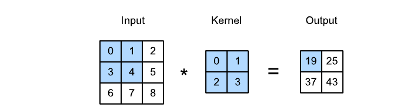
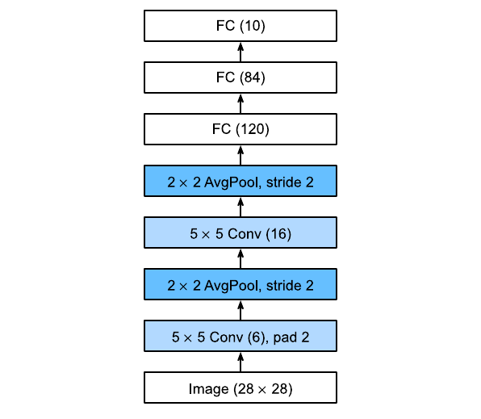

# Convolutional Neural Networks

> **Ý chính trong một câu:** CNN tận dụng hai sự thật của ảnh — pixel gần nhau thường liên quan và cùng một mẫu có thể xuất hiện ở mọi vị trí — để học tốt với ít parameters hơn MLP.

## Mục tiêu học tập

Học xong chương, bạn có thể:

- giải thích locality, translation equivariance và parameter sharing;
- tự tính cross-correlation 2D, output shape, padding và stride;
- theo dõi shape qua nhiều input/output channels, $1\times1$ convolution và pooling;
- cài một phép cross-correlation nhỏ và dựng LeNet bằng PyTorch;
- phân biệt feature map với receptive field và chẩn đoán lỗi shape phổ biến.

## Bản đồ chương

```text
Ảnh có cấu trúc không gian
  ├─ locality → chỉ nhìn một cửa sổ nhỏ
  ├─ translation equivariance → dùng lại cùng kernel ở mọi vị trí
  └─ channels → học nhiều loại feature cùng lúc
        ↓
conv + activation → feature maps → pooling/downsampling
        ↓
chồng nhiều tầng → receptive field lớn dần → LeNet phân loại ảnh
```

## Bức tranh tổng quan

Nếu trải ảnh RGB $1000\times1000$ thành vector rồi nối đầy đủ tới 1000 hidden units, riêng tầng đầu đã có khoảng $3\times10^9$ weights. CNN thay ma trận khổng lồ bằng một {{term:convolution-kernel|kernel}} nhỏ được quét khắp ảnh. Đây là một **inductive bias**: ta chủ động giả định cấu trúc cục bộ và khả năng dùng lại detector. Khi giả định đúng, model cần ít dữ liệu hơn; khi vị trí tuyệt đối quyết định nhãn, bias này có thể không phù hợp.

<!-- pagebreak -->

## 7.1 From Fully Connected Layers to Convolutions

### 7.1.1 Invariance

Một detector nhận ra mắt mèo ở góc trái cũng nên nhận ra nó ở góc phải. Chính xác hơn, tầng convolution thường {{term:translation-equivariance|translation equivariant}}: dịch input làm feature map dịch tương ứng. Invariance hoàn toàn thường xuất hiện sau pooling hoặc global aggregation, khi output cuối ít quan tâm vị trí.

Ba nguyên tắc thiết kế của sách:

1. cùng một patch được xử lý giống nhau ở mọi vị trí;
2. tầng đầu chỉ nhìn vùng lân cận;
3. tầng sâu ghép feature cục bộ thành cấu trúc lớn hơn.

### 7.1.2 Constraining the MLP

Với input $X$ và hidden map $H$, một tầng tổng quát cần weight bốn chiều. Ép weight không phụ thuộc vị trí $(i,j)$ tạo **parameter sharing**; ép weight bằng 0 ngoài vùng $[-\Delta,\Delta]$ tạo locality:

$$
[H]_{i,j}=u+\sum_{a=-\Delta}^{\Delta}\sum_{b=-\Delta}^{\Delta}
[V]_{a,b}[X]_{i+a,j+b}.
$$

Thay vì hàng nghìn tỷ parameters, kernel nhỏ chỉ cần vài chục parameters trên mỗi cặp channels. Đổi lại, model không còn tự do gán một luật hoàn toàn khác cho từng pixel.

### 7.1.3 Convolutions

Convolution toán học lật một hàm trước khi trượt. Các thư viện deep learning thường thực hiện {{term:cross-correlation|cross-correlation}} không lật kernel nhưng vẫn gọi layer là convolution. Vì kernel được học, khác biệt quy ước hiếm khi ảnh hưởng việc huấn luyện.

### 7.1.4 Channels

Ảnh màu thường có shape `(batch, 3, height, width)`. Kernel vì vậy phải gom qua mọi input channels; mỗi output channel học một feature khác, chẳng hạn cạnh dọc, texture hoặc một bộ phận vật thể. Tổng quát:

$$
H_{i,j,d}=u_d+\sum_{a,b}\sum_c V_{a,b,c,d}X_{i+a,j+b,c}.
$$

### 7.1.5 Summary and Discussion

- Locality giảm vùng kết nối; parameter sharing giảm số weights theo vị trí.
- Nhiều channels lấy lại sức biểu diễn đã mất vì hai ràng buộc trên.
- CNN là lựa chọn có lý do, không phải một chuỗi layer được ghép tùy ý.

### 7.1.6 Exercises

1. Với $\Delta=0$, chứng minh layer chỉ trộn channels độc lập ở mỗi pixel.
2. Viết convolution 1D cho audio và giải thích khi nào locality hợp lý; liên hệ spectrogram với ảnh 2D.
3. Cho một ví dụ translation equivariance là bias xấu.
4. Nêu khó khăn khi áp dụng convolution cho text.
5. Phân tích điều xảy ra với object ở mép ảnh.
6. Chứng minh convolution thật thỏa $f*g=g*f$ bằng đổi biến chỉ số.

<details markdown="1"><summary>Gợi ý và lời giải ngắn</summary>

1. Khi $\Delta=0$, chỉ còn $H_{i,j,d}=u_d+\sum_cV_{0,0,c,d}X_{i,j,c}$: đó là cùng một MLP tuyến tính trên vector channels tại từng pixel, tức $1\times1$ convolution.
2. Với audio, $y_t=\sum_a k_a x_{t+a}$. Locality hợp với phoneme/ngưỡng âm ngắn; spectrogram biến time-frequency thành lưới 2D. Không gian tần số không hoàn toàn giống không gian ảnh nên phép dịch theo tần số phải được cân nhắc.
3. Dự đoán “bầu trời” và “đường” thường phụ thuộc vị trí trên/dưới; padding cũng vô tình đưa thông tin vị trí vào model.
4. Text có thứ tự và khoảng cách token; dịch một cụm có thể đổi ngữ pháp, nên invariance không mạnh như trong ảnh.
5. Kernel thiếu context ngoài biên; padding quyết định cách bổ sung context đó.
6. Với convolution rời rạc, đặt $b=i-a$: $\sum_a f(a)g(i-a)=\sum_b g(b)f(i-b)$.
</details>

<!-- pagebreak -->

## 7.2 Convolutions for Images

### 7.2.1 The Cross-Correlation Operation



Đặt kernel lên một patch cùng kích thước, nhân từng phần tử rồi cộng. Ví dụ ô output đầu:

$$0\cdot0+1\cdot1+3\cdot2+4\cdot3=19.$$

Input $n_h\times n_w$, kernel $k_h\times k_w$, không padding và stride 1 cho output:

$$ (n_h-k_h+1)\times(n_w-k_w+1). $$

```python
import torch


def cross_correlation_2d(x: torch.Tensor, kernel: torch.Tensor) -> torch.Tensor:
    """Compute 2D cross-correlation for two rank-2 tensors."""
    kernel_height, kernel_width = kernel.shape
    output_height = x.shape[0] - kernel_height + 1
    output_width = x.shape[1] - kernel_width + 1
    output = torch.zeros((output_height, output_width), dtype=x.dtype)
    for row in range(output_height):
        for column in range(output_width):
            patch = x[row : row + kernel_height, column : column + kernel_width]
            output[row, column] = (patch * kernel).sum()
    return output
```

### 7.2.2 Convolutional Layers

Một convolutional layer gồm kernel học được và bias. Forward chạy cross-correlation; backward tính gradient cho kernel giống mọi parameter khác. Trong PyTorch, `nn.Conv2d(in_channels, out_channels, kernel_size)` nhận NCHW.

### 7.2.3 Object Edge Detection in Images

Kernel `[1, -1]` lấy chênh lệch hai cột cạnh nhau. Vùng đồng màu cho 0; biên dọc cho giá trị lớn dương hoặc âm. Đây là detector do ta thiết kế bằng tay.

### 7.2.4 Learning a Kernel

Thay vì đoán kernel, khởi tạo ngẫu nhiên rồi tối ưu squared error giữa output và edge map mong muốn. Sau vài bước gradient descent, weights tiến gần `[1, -1]`. Đây là chuyển dịch quan trọng từ **feature engineering** sang học feature từ dữ liệu.

### 7.2.5 Cross-Correlation and Convolution

Convolution thật lật kernel theo cả hai trục; cross-correlation không lật. Nếu training end-to-end, model có thể học phiên bản kernel đã lật nên sức biểu diễn như nhau.

### 7.2.6 Feature Map and Receptive Field

Output của convolution gọi là {{term:feature-map|feature map}}. {{term:receptive-field|Receptive field}} của một activation là vùng input có thể ảnh hưởng tới nó. Chồng hai kernel $3\times3$, stride 1 tạo receptive field $5\times5$, không phải $6\times6$, vì hai cửa sổ chồng lên nhau.

### 7.2.7 Summary

Cross-correlation là phép tính lõi; kernel có thể phát hiện cạnh, làm mờ, làm sắc hoặc được học tự động. Mỗi activation chỉ phụ thuộc patch cục bộ, rất phù hợp tối ưu song song trên GPU.

### 7.2.8 Exercises

1. Tạo ảnh có cạnh chéo; thử kernel cạnh dọc trên ảnh, ảnh chuyển vị và kernel chuyển vị.
2. Thiết kế kernel phát hiện cạnh theo hướng, đạo hàm bậc hai và blur.
3. Quan sát lỗi autograd nếu thao tác cập nhật parameter sai cách.
4. Biểu diễn cross-correlation thành matrix multiplication bằng cách trải mọi patch thành hàng.

<details markdown="1"><summary>Gợi ý và lời giải ngắn</summary>

- Chuyển vị cả ảnh hoặc kernel đổi hướng detector; kernel đạo hàm bậc hai 1D tối thiểu có ba phần tử `[1,-2,1]`.
- Blur $3\times3$ đơn giản dùng mọi weight bằng $1/9$; nó giảm nhiễu cao tần nhưng làm mất cạnh.
- Cách matrix hóa thường gọi là `im2col`: tạo matrix `(số_patch, k_h*k_w*c)` rồi nhân với kernel đã flatten.
</details>

<!-- pagebreak -->

## 7.3 Padding and Stride

### 7.3.1 Padding

{{term:padding|Padding}} thêm hàng/cột, thường là số 0, quanh input để giữ kích thước và dùng pixel biên nhiều hơn. Với tổng padding $p_h,p_w$:

$$
h_{out}=n_h-k_h+p_h+1,\qquad
w_{out}=n_w-k_w+p_w+1.
$$

Kernel lẻ $k$ thường chọn padding mỗi phía $(k-1)/2$ để output cùng kích thước khi stride 1.

### 7.3.2 Stride

{{term:stride|Stride}} là số pixel kernel nhảy sau mỗi phép tính. Với stride $s_h,s_w$:

$$
h_{out}=\left\lfloor\frac{n_h-k_h+p_h}{s_h}\right\rfloor+1,
\quad
w_{out}=\left\lfloor\frac{n_w-k_w+p_w}{s_w}\right\rfloor+1.
$$

Stride lớn giảm resolution, FLOPs và memory nhưng có thể bỏ qua chi tiết nhỏ.

### 7.3.3 Summary and Discussion

Default là padding 0, stride 1. “Same convolution” thường giữ spatial shape; stride 2 thường giảm chiều cao và rộng xấp xỉ một nửa. Zero padding rẻ nhưng có thể tạo artifacts ở biên.

### 7.3.4 Exercises

1. Tính output của input `(8, 8)`, kernel `(3, 5)`, padding `(0, 1)`, stride `(3, 4)`.
2. Giải thích stride 2 trên audio.
3. Cài mirror padding.
4. Nêu lợi ích tính toán và thống kê của stride lớn.
5. Suy nghĩ cách tạo “stride $1/2$”.

<details markdown="1"><summary>Gợi ý và lời giải ngắn</summary>

1. Nếu PyTorch hiểu padding mỗi phía là `(0,1)`, output là $\lfloor(8-3)/3\rfloor+1=2$ theo cao và $\lfloor(8+2-5)/4\rfloor+1=2$ theo rộng.
2. Stride 2 giữ một output cho mỗi hai vị trí thời gian: downsampling; cần chống aliasing khi tín hiệu có tần số cao.
3. Dùng `torch.nn.functional.pad(x, pad, mode="reflect")`.
4. Ít output làm giảm FLOPs/memory; đồng thời tạo chút bất biến với dịch chuyển nhỏ nhưng có thể mất chi tiết.
5. Stride nhỏ hơn 1 tương đương upsampling/interpolation hoặc transposed convolution, không phải bước nhảy chỉ số thông thường.
</details>

<!-- pagebreak -->

## 7.4 Multiple Input and Multiple Output Channels

### 7.4.1 Multiple Input Channels

Với $c_i$ input channels, mỗi output channel có $c_i$ kernels 2D; cross-correlate từng channel rồi cộng. Kernel shape của một output là `(c_i, k_h, k_w)`.

### 7.4.2 Multiple Output Channels

Muốn $c_o$ feature maps, dùng $c_o$ bộ kernels. Weight tensor PyTorch có shape `(c_o, c_i, k_h, k_w)`, bias có shape `(c_o,)`. Mỗi output channel có thể chuyên biệt hóa một pattern.

### 7.4.3 1 × 1 Convolutional Layer

Kernel $1\times1$ không trộn các vị trí lân cận; nó trộn channels tại từng pixel bằng cùng một linear layer. Nó dùng để đổi số channels, tạo bottleneck và giảm chi phí trước convolution lớn.

### 7.4.4 Discussion

Chi phí xấp xỉ:

$$O(h\,w\,k_hk_w\,c_i c_o).$$

Tăng gấp đôi cả $c_i$ và $c_o$ làm FLOPs gần gấp bốn. Vì vậy thiết kế channels quan trọng không kém depth.

### 7.4.5 Exercises

1. Ghép hai convolutions tuyến tính liên tiếp thành một convolution lớn hơn; xét chiều kernel tương đương.
2. Tính FLOPs và memory cho input/kernel nhiều channels.
3. Phân tích khi tăng gấp đôi input/output channels hoặc padding.
4. Giải thích vì sao hai cách tính $1\times1$ có thể sai khác rất nhỏ do floating point.
5. Trình bày `im2col` cho kernel không phải $1\times1$.
6. Giải thích vì sao tính nhiều cột output cùng lúc tận dụng cache tốt hơn.
7. Phân tích tốc độ và hạn chế của block-diagonal/grouped channel mixing.

<details markdown="1"><summary>Gợi ý chính</summary>

- Không activation, hai kernel $k_1,k_2$ cho receptive kernel $k_1+k_2-1$; chiều ngược lại không phải kernel nào cũng phân rã được.
- Forward cần xấp xỉ $h_{out}w_{out}c_oc_i k_hk_w$ phép nhân; activations thường chiếm memory lớn hơn weights.
- Group thành $b$ blocks giảm channel-mixing cost gần $b$ lần nhưng cắt trao đổi giữa groups; channel shuffle hoặc $1\times1$ convolution có thể nối lại.
</details>

<!-- pagebreak -->

## 7.5 Pooling

### 7.5.1 Maximum Pooling and Average Pooling

{{term:pooling|Pooling}} trượt một cửa sổ nhưng không có weights học được. Max-pooling lấy cực đại, giữ tín hiệu feature mạnh; average pooling lấy trung bình, làm mượt. Pooling tạo một mức ổn định trước dịch chuyển nhỏ nhưng không làm model bất biến tuyệt đối.

### 7.5.2 Padding and Stride

Pooling dùng cùng công thức output shape như convolution. Thiết lập cổ điển `kernel_size=2, stride=2` giảm height và width một nửa, tức số phần tử mỗi channel còn một phần tư.

### 7.5.3 Multiple Channels

Pooling xử lý từng channel độc lập và không cộng qua channels, nên số output channels bằng số input channels.

### 7.5.4 Summary

Max-pooling thường phù hợp khi “feature có xuất hiện trong vùng không?” quan trọng hơn vị trí chính xác; average pooling phù hợp khi mức trung bình mang nghĩa. CNN hiện đại cũng thường dùng stride convolution để downsample.

### 7.5.5 Exercises

1. Cài average pooling bằng convolution cố định.
2. Giải thích vì sao một convolution tuyến tính không thể biểu diễn max-pooling cho mọi input.
3. Biểu diễn $\max(a,b)$ bằng ReLU và mở rộng ý tưởng cho cửa sổ.
4. Tính computational cost của pooling.
5. So sánh thống kê max/average pooling.
6. Thay min-pooling bằng phép toán nào?
7. Vì sao softmax pooling ít phổ biến hơn?

<details markdown="1"><summary>Gợi ý và lời giải ngắn</summary>

1. Kernel $p_h\times p_w$ có mọi weight $1/(p_hp_w)$.
2. Max là hàm phi tuyến, còn convolution không activation là tuyến tính.
3. $\max(a,b)=\operatorname{ReLU}(a-b)+b$; ghép cặp nhiều lần để lấy max nhiều phần tử.
4. Mỗi output cần $p_hp_w-1$ comparisons hoặc additions; nhân với số output positions và channels.
6. $\min(X)=-\max(-X)$.
7. Softmax pooling thêm exponentials, nhạy temperature và đắt hơn trong khi max/mean đã hiệu quả.
</details>

<!-- pagebreak -->

## 7.6 Convolutional Neural Networks (LeNet)

### 7.6.1 LeNet



LeNet-5 có hai phần: convolutional encoder và dense classifier. Bản trong sách dùng hai block `Conv → Sigmoid → AvgPool`, rồi `Flatten → Linear(120) → Linear(84) → Linear(10)`.

```python
from torch import nn


class LeNet(nn.Module):
    """LeNet-style classifier for NCHW grayscale images."""

    def __init__(self, num_classes: int = 10) -> None:
        super().__init__()
        self.network = nn.Sequential(
            nn.Conv2d(1, 6, kernel_size=5, padding=2),
            nn.Sigmoid(),
            nn.AvgPool2d(kernel_size=2, stride=2),
            nn.Conv2d(6, 16, kernel_size=5),
            nn.Sigmoid(),
            nn.AvgPool2d(kernel_size=2, stride=2),
            nn.Flatten(),
            nn.Linear(16 * 5 * 5, 120),
            nn.Sigmoid(),
            nn.Linear(120, 84),
            nn.Sigmoid(),
            nn.Linear(84, num_classes),
        )

    def forward(self, images):
        # images: (batch, 1, 28, 28) → logits: (batch, 10)
        return self.network(images)
```

Shape trace: `1×28×28 → 6×28×28 → 6×14×14 → 16×10×10 → 16×5×5 → 400 → 120 → 84 → 10`.

### 7.6.2 Training

Sách huấn luyện trên Fashion-MNIST bằng cross-entropy và minibatch SGD. CNN có ít parameters hơn dense layer nhưng mỗi kernel weight được dùng ở nhiều vị trí, nên vẫn tốn nhiều phép nhân. Khi debug, hãy in shape một batch và logits trước khi chạy nhiều epoch.

<div class="algorithm-block" markdown="1">
<p class="algorithm-label">CHECKLIST · TRAIN MỘT CNN</p>

**Đầu vào:** images NCHW và labels `torch.long`.

1. Forward để nhận logits `(batch, classes)`; không softmax trước `CrossEntropyLoss`.
2. Tính loss, `optimizer.zero_grad()`, `loss.backward()`, rồi `optimizer.step()`.
3. Đánh giá validation trong `model.eval()` và `torch.no_grad()`.
4. Ghi cả loss lẫn accuracy; kiểm tra overfitting thay vì chỉ nhìn training loss.

**Đầu ra:** model tốt nhất theo validation metric, không phải epoch cuối một cách máy móc.
</div>

### 7.6.3 Summary

LeNet chứng minh chuỗi conv–pool có thể học feature trực tiếp từ pixel. Kiến trúc cũ nhưng “xương sống” — extract spatial features, giảm resolution, phân loại — vẫn hiện diện trong CNN hiện đại.

### 7.6.4 Exercises

1. Hiện đại hóa LeNet: AvgPool → MaxPool, Sigmoid → ReLU.
2. Tune kernel size, channels, số conv/dense layers, learning rate và epochs.
3. Thử model trên MNIST gốc.
4. Hiển thị activations tầng 1 và 2 cho sweater/coat.
5. Quan sát activations với ảnh ngoài phân bố như mèo, xe hoặc noise.

<details markdown="1"><summary>Cách làm có kiểm soát</summary>

- Tạo baseline cố định seed, split và số epochs; mỗi lần chỉ đổi một nhóm yếu tố.
- Dùng forward hook hoặc tách `nn.Sequential` để lấy feature maps; chuẩn hóa từng map trước khi vẽ.
- Với ảnh ngoài phân bố, activation vẫn có thể mạnh: CNN phát hiện texture/cạnh chứ không tự biết input “không thuộc Fashion-MNIST”. Đừng diễn giải activation mạnh là model tự tin đúng.
</details>

<!-- pagebreak -->

## Điểm hay và ý nghĩa

- **Một bias đúng đổi cả độ khó bài toán:** locality + sharing biến layer bất khả thi thành layer vài trăm weights.
- **Feature hierarchy:** tầng nông thấy cạnh; tầng sâu có receptive field lớn để ghép cạnh thành bộ phận và vật thể.
- **Shapes là công cụ suy luận:** hiểu NCHW và công thức output giúp debug CNN nhanh hơn đoán lỗi từ stack trace.

## Sau chương này bạn làm được gì?

Bạn có thể tự tính output của Conv2d/Pool2d, chọn padding/stride, giải thích vì sao $1\times1$ conv hữu ích, dựng LeNet và kiểm tra shape/loss đúng trước khi training.

## Tóm tắt kiến thức

- Convolution dùng kernel cục bộ và chia sẻ weights.
- Nhiều output channels là nhiều feature detectors.
- Padding giữ biên/kích thước; stride và pooling giảm resolution.
- Receptive field tăng theo depth.
- LeNet là CNN hoàn chỉnh đầu tiên trong lộ trình này.

## Bài tập tổng hợp

1. Với input `(8, 3, 32, 32)`, `Conv2d(3, 16, 3, padding=1, stride=2)`, hãy tính output shape và số parameters.
2. Thiết kế CNN nhỏ cho ảnh RGB `64×64`, ghi shape sau từng layer và giữ classifier dưới một triệu parameters.
3. So sánh ba model chỉ khác cách downsample: max-pool, average-pool, stride-2 convolution.

<details markdown="1"><summary>Gợi ý rồi lời giải bài 1</summary>

**Gợi ý:** tính spatial shape trước, rồi dùng $c_o(c_i k_hk_w+1)$.

**Lời giải:** height/width $=\lfloor(32+2-3)/2\rfloor+1=16$, nên output `(8,16,16,16)`. Parameters $=16(3\cdot3\cdot3+1)=448$. Bẫy thường gặp là nhân thêm batch/spatial positions vào số parameters; weight được dùng lại ở mọi vị trí.
</details>

## Thuật ngữ cần nhớ

| Term | Hiểu ngắn gọn | Ví dụ |
|---|---|---|
| convolution kernel | cửa sổ weights học được | kernel $3\times3$ |
| cross-correlation | trượt, nhân từng ô rồi cộng | phép Conv2d thực tế |
| feature map | bản đồ activation của một detector | channel cạnh dọc |
| padding | thêm biên quanh input | pad 1 giữ size với kernel 3 |
| stride | độ dài bước trượt | stride 2 giảm gần một nửa |
| pooling | gộp một vùng không cần weights | max trong cửa sổ $2\times2$ |
| receptive field | vùng input ảnh hưởng một activation | tầng sâu nhìn vùng lớn hơn |

## Nguồn và phạm vi

- *Dive into Deep Learning*, Chương 7, trang sách 233–267.
- PDF vật lý 273–307; hình được trích trực tiếp từ Figure 7.2.1 và Figure 7.6.2.
- Code là bản PyTorch tối giản hóa để học shape và convention; không chép nguyên framework trợ giúp của sách.
