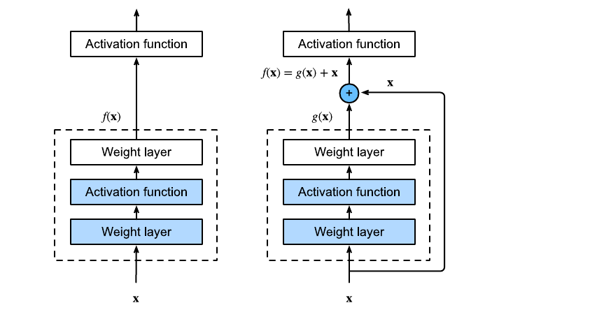
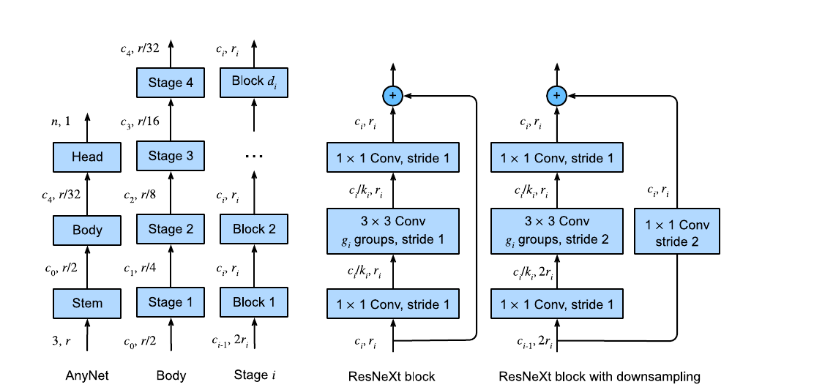

# Modern Convolutional Neural Networks

> **Ý chính trong một câu:** lịch sử CNN hiện đại là quá trình biến những layer rời rạc thành block tái sử dụng, giúp tín hiệu và gradient đi qua mạng sâu dễ hơn, rồi tìm quy luật thiết kế thay vì chỉ thử mò từng kiến trúc.

## Mục tiêu học tập

Học xong chương, bạn có thể:

- kể được bước tiến AlexNet → VGG → NiN → GoogLeNet → ResNet/ResNeXt → DenseNet → RegNet;
- giải thích batch normalization, residual connection và dense connection;
- đọc kiến trúc theo stem, body/stages, head và lần theo tensor shapes;
- chọn giữa tăng depth, width, branches và groups dựa trên chi phí;
- cài một residual block đúng quy ước PyTorch.

## Bản đồ chương

| Cột mốc | Ý tưởng cốt lõi | Vấn đề được giải |
|---|---|---|
| AlexNet | CNN sâu, ReLU, dropout, augmentation | feature học được thắng feature thủ công |
| VGG | block lặp lại nhiều conv $3\times3$ | kiến trúc dễ mô tả và mở rộng |
| NiN | $1\times1$ conv, global average pooling | trộn channels, giảm dense head |
| GoogLeNet | nhiều nhánh Inception | nhìn nhiều scale cùng lúc |
| BatchNorm | chuẩn hóa activation theo batch | training mạng sâu ổn định hơn |
| ResNet/ResNeXt | shortcut, grouped conv | học residual và mở rộng cardinality |
| DenseNet | concatenate mọi feature trước | tái dùng feature mạnh |
| RegNet | rút quy luật từ design space | thiết kế có hệ thống |

## Bức tranh tổng quan

Không có một định lý nói “mạng này chắc chắn tốt nhất”. Các kiến trúc trong chương phản ánh sự kết hợp giữa trực giác, thí nghiệm và giới hạn phần cứng. Điều nên học không chỉ là tên model, mà là **mẫu thiết kế** có thể tái dùng ở model khác.

<!-- pagebreak -->

## 8.1 Deep Convolutional Neural Networks (AlexNet)

### 8.1.1 Representation Learning

Trước AlexNet, computer vision thường dùng pipeline thủ công: thiết kế feature như SIFT, gom chúng, rồi đưa vào classifier. {{term:representation-learning|Representation learning}} để mạng tự học feature từ pixel theo mục tiêu cuối. AlexNet cho thấy với đủ data, compute và regularization, feature học được có thể vượt feature do con người thiết kế.

### 8.1.2 AlexNet

AlexNet có 5 convolutional layers và 3 fully connected layers. So với LeNet, nó:

- dùng ảnh lớn và nhiều channels hơn;
- thay sigmoid bằng ReLU để giảm gradient saturation;
- dùng max-pooling, dropout và image augmentation;
- có dense head 4096–4096 rất lớn, là điểm yếu về memory.

Đừng học thuộc từng con số như thần chú. Hãy đọc logic: kernel lớn/stride lớn ở đầu giảm nhanh resolution; các conv $3\times3$ sau đó học feature; classifier lớn đưa ra logits.

### 8.1.3 Training

Sách resize Fashion-MNIST từ $28\times28$ lên $224\times224$ để giữ kiến trúc AlexNet; đây là minh họa, không thêm thông tin mới và khá tốn compute. Learning rate nhỏ hơn LeNet vì mạng sâu/rộng hơn.

### 8.1.4 Discussion

AlexNet là cột mốc lịch sử nhưng không còn là lựa chọn hiệu quả: hai dense layers chiếm hàng chục triệu parameters. Giá trị lâu dài là bằng chứng rằng learned features, ReLU, dropout, augmentation và GPU training phối hợp được ở quy mô lớn.

### 8.1.5 Exercises

1. Tách memory/FLOPs của conv và dense layers; xét khác nhau giữa training và inference.
2. Đề xuất trade-off compute–memory nếu thiết kế accelerator.
3. Giải thích vì sao benchmark hiện đại ít dùng AlexNet.
4. Tăng epochs và so với LeNet.
5. Rút gọn AlexNet cho ảnh $28\times28$.
6. Đổi batch size và đo throughput, accuracy, GPU memory.
7. Thêm ReLU/dropout/augmentation cho LeNet.
8. Thử làm AlexNet overfit bằng cách giảm regularization hoặc dữ liệu.

<details markdown="1"><summary>Hướng giải</summary>

- Parameters tập trung ở dense head, còn FLOPs thường tập trung ở convolutions trên feature maps lớn.
- Training cần giữ activations và gradients nên memory lớn hơn inference.
- Model cho $28\times28$ nên dùng kernel/stride đầu nhỏ hơn, không phóng ảnh lên chỉ để khớp kiến trúc.
- Muốn chứng minh tác dụng regularization, giữ nguyên seed/split rồi lần lượt bỏ dropout, augmentation hoặc giảm training set.
</details>

<!-- pagebreak -->

## 8.2 Networks Using Blocks (VGG)

### 8.2.1 VGG Blocks

Một VGG block gồm vài lần `Conv3×3(pad=1) → ReLU`, sau đó `MaxPool2×2(stride=2)`. Nhiều conv trước khi pool cho mạng sâu hơn mà spatial resolution chưa giảm quá nhanh. Hai conv $3\times3$ có receptive field $5\times5$ và thêm một nonlinearity so với một conv $5\times5$.

```python
from torch import nn


def vgg_block(num_convs: int, in_channels: int, out_channels: int) -> nn.Sequential:
    layers: list[nn.Module] = []
    for layer_index in range(num_convs):
        current_in = in_channels if layer_index == 0 else out_channels
        layers.extend([
            nn.Conv2d(current_in, out_channels, kernel_size=3, padding=1),
            nn.ReLU(),
        ])
    layers.append(nn.MaxPool2d(kernel_size=2, stride=2))
    return nn.Sequential(*layers)
```

### 8.2.2 VGG Network

VGG là một **family** được mô tả bằng danh sách `(số conv, số output channels)` cho từng block. VGG-11 dùng năm blocks; resolution giảm dần, channels tăng tới 512, rồi dense head tương tự AlexNet. Đây là bước tiến về abstraction: code thiết kế bằng blocks thay vì khai từng layer.

### 8.2.3 Training

Sách dùng phiên bản giảm channels để train nhanh trên Fashion-MNIST. Khi scale một kiến trúc, giảm width theo cùng hệ số giúp FLOPs giảm mạnh vì chi phí conv phụ thuộc cả input và output channels.

### 8.2.4 Summary

VGG cho thấy sâu và hẹp với nhiều conv nhỏ có thể tốt hơn nông và kernel lớn. Pattern “nhiều biến đổi giữ resolution, rồi downsample” tồn tại trong rất nhiều mạng sau này.

### 8.2.5 Exercises

1. In kích thước activation của từng VGG block.
2. So sánh parameters/FLOPs của AlexNet và VGG.
3. Phân tích thời điểm channels tăng so với resolution giảm.
4. So sánh nhiều conv nhỏ với một conv lớn về receptive field, parameters và nonlinearities.

<details markdown="1"><summary>Gợi ý chính</summary>

Hai conv $3\times3$ với $c$ channels dùng khoảng $18c^2$ weights; một conv $5\times5$ dùng $25c^2$. Hai conv còn có hai ReLU. Khi height/width giảm nửa, tăng channels gấp đôi giữ activation count gần tương đương nhưng conv FLOPs có thể vẫn tăng.
</details>

<!-- pagebreak -->

## 8.3 Network in Network (NiN)

### 8.3.1 NiN Blocks

NiN thay một conv đơn bằng “MLP tại mỗi pixel”: conv spatial rồi hai conv $1\times1$. Conv spatial gom lân cận; $1\times1$ conv trộn channels và thêm nonlinearities mà không đổi vị trí.

### 8.3.2 NiN Model

Sau nhiều NiN blocks, model đưa channels về đúng số classes rồi dùng global average pooling. Mỗi class có một feature map; trung bình toàn bản đồ tạo logit. Cách này loại dense head khổng lồ và buộc correspondence rõ hơn giữa channel cuối với class.

### 8.3.3 Training

Pipeline giống AlexNet/VGG, nhưng cần kiểm tra output sau global pooling có shape `(batch, classes, 1, 1)` rồi flatten thành `(batch, classes)`.

### 8.3.4 Summary

NiN đóng góp hai ý tưởng bền vững: dùng $1\times1$ conv để tăng sức biểu diễn theo channels và global average pooling để giảm parameters/overfitting ở classifier.

### 8.3.5 Exercises

1. Vì sao hai $1\times1$ conv tương đương MLP dùng chung ở mọi pixel?
2. Thay global average pooling bằng dense layer và so sánh parameters.
3. Thử bỏ một $1\times1$ conv hoặc đổi số channels.
4. Giải thích vì sao NiN khó thêm fully connected layer tùy ý trước logits mà vẫn giữ diễn giải class maps.

<!-- pagebreak -->

## 8.4 Multi-Branch Networks (GoogLeNet)

### 8.4.1 Inception Blocks

Inception chạy song song bốn nhánh: $1\times1$; $1\times1→3\times3$; $1\times1→5\times5$; pool $3\times3→1\times1$. Output được concatenate theo channel. Các $1\times1$ bottlenecks giảm channels trước kernel đắt.

Trực giác: thay vì chọn trước “feature cần nhìn scale nào”, block học cách kết hợp nhiều scale. Điều kiện bắt buộc là các nhánh có cùng height/width.

### 8.4.2 GoogLeNet Model

GoogLeNet có stem, nhiều Inception stages xen giữa max-pooling, rồi global average pooling và classifier. Sách trình bày các blocks theo nhóm để đọc shape dễ hơn.

### 8.4.3 Training

Train trên Fashion-MNIST resize $96\times96$. Do nhiều nhánh, lỗi thường gặp là padding sai khiến concatenate thất bại; hãy assert spatial shape của từng branch.

### 8.4.4 Discussion

GoogLeNet vừa tăng sức biểu diễn vừa kiểm soát compute qua bottleneck. Nhược điểm là kiến trúc nhiều nhánh khó đọc/tune hơn VGG. Ý tưởng parallel branches tiếp tục xuất hiện trong ResNeXt và nhiều module hiện đại.

### 8.4.5 Exercises

1. Xây Inception với các cấu hình channels khác và tính output channels.
2. So sánh FLOPs có/không có $1\times1$ bottleneck.
3. Chọn kernel/padding để mọi nhánh cùng resolution.
4. Thử thêm một nhánh dilation hoặc average pooling và đánh giá công bằng.

<details markdown="1"><summary>Ví dụ tính bottleneck</summary>

Conv $5\times5$ từ 192→32 channels tốn $25\cdot192\cdot32$ weights. Thêm $1\times1$ 192→16 rồi $5\times5$ 16→32 chỉ tốn $192\cdot16+25\cdot16\cdot32$, giảm hơn 4 lần. Bẫy: quên cộng chi phí tầng $1\times1$.
</details>

<!-- pagebreak -->

## 8.5 Batch Normalization

### 8.5.1 Training Deep Networks

Mạng sâu nhạy với scale của activations. {{term:batch-normalization|Batch normalization}} (BN) chuẩn hóa từng feature bằng thống kê minibatch, rồi học lại scale $\gamma$ và shift $\beta$:

$$
\operatorname{BN}(x)=\gamma\odot
\frac{x-\hat\mu_B}{\sqrt{\hat\sigma_B^2+\epsilon}}+\beta.
$$

$\epsilon$ chống chia 0. BN không chỉ “đưa về chuẩn tắc”; $\gamma,\beta$ cho model khôi phục scale thích hợp. Noise từ batch statistics cũng tạo hiệu ứng regularization.

### 8.5.2 Batch Normalization Layers

Với fully connected layer, BN tính mean/variance theo batch cho mỗi feature. Với Conv2d, nó gom cả batch và spatial positions cho từng channel. Training dùng batch statistics và cập nhật moving averages; inference dùng moving averages. Vì vậy `model.train()` và `model.eval()` thực sự thay đổi hành vi BN.

### 8.5.3 Implementation from Scratch

Một bản tự cài cần phân biệt training/inference, broadcasting đúng axes, `eps`, learnable `gamma/beta`, và moving mean/variance không nhận gradient. Đây là exercise hiểu cơ chế; production nên dùng layer framework đã tối ưu.

### 8.5.4 LeNet with Batch Normalization

Chèn BN sau linear/conv và trước activation theo cấu hình trong sách. Với conv channels $C$, `BatchNorm2d(C)` có $2C$ parameters học được; moving statistics là buffers.

### 8.5.5 Concise Implementation

PyTorch cung cấp `nn.BatchNorm1d` cho dense/sequence phù hợp và `nn.BatchNorm2d` cho NCHW. Luôn khớp `num_features` với số output channels/features của tầng trước.

### 8.5.6 Discussion

BN làm optimization dễ hơn và cho phép learning rate lớn hơn, nhưng phụ thuộc batch size; batch quá nhỏ tạo thống kê nhiễu. Layer normalization ở Chương 11 chuẩn hóa theo feature của từng example nên hợp sequence/Transformer hơn.

### 8.5.7 Exercises

1. Bỏ affine $\gamma,\beta$ và đo ảnh hưởng.
2. So sánh BN trước/sau activation.
3. Đổi batch size; quan sát stability và accuracy.
4. Cố tình quên `eval()` để thấy inference thay đổi.
5. So sánh custom BN với PyTorch về output, gradient và tốc độ.
6. Có cần bias ở conv ngay trước BN không?

<details markdown="1"><summary>Gợi ý và lời giải ngắn</summary>

- Bias trước BN phần lớn bị trừ bởi mean, nên thường đặt `bias=False`.
- Batch nhỏ làm mean/variance dao động; có thể dùng GroupNorm/LayerNorm khi phù hợp.
- Test custom layer: copy cùng $\gamma,\beta$, dùng cùng input, so output ở train rồi eval; moving-stat update khiến hai mode không thể trộn lẫn.
</details>

<!-- pagebreak -->

## 8.6 Residual Networks (ResNet) and ResNeXt

### 8.6.1 Function Classes

Thêm layer không đảm bảo function class mới chứa function class cũ. Nếu block mới dễ biểu diễn identity, mạng sâu ít nhất có con đường giữ nguyên mapping cũ. Đây là động lực của shortcut.

### 8.6.2 Residual Blocks



Thay vì học trực tiếp $f(x)$, residual branch học $g(x)=f(x)-x$, rồi output:

$$y=\operatorname{ReLU}(g(x)+x).$$

Nếu identity đã tốt, chỉ cần đẩy residual weights về gần 0. Khi shape khác, shortcut dùng conv $1\times1$ và stride để khớp channels/resolution.

```python
from torch import nn


class ResidualBlock(nn.Module):
    def __init__(self, in_channels: int, out_channels: int, stride: int = 1) -> None:
        super().__init__()
        self.residual = nn.Sequential(
            nn.Conv2d(in_channels, out_channels, 3, stride, 1, bias=False),
            nn.BatchNorm2d(out_channels),
            nn.ReLU(),
            nn.Conv2d(out_channels, out_channels, 3, padding=1, bias=False),
            nn.BatchNorm2d(out_channels),
        )
        self.shortcut = (
            nn.Identity() if in_channels == out_channels and stride == 1
            else nn.Conv2d(in_channels, out_channels, 1, stride, bias=False)
        )
        self.activation = nn.ReLU()

    def forward(self, x):
        # Both paths must have identical NCHW shape before addition.
        return self.activation(self.residual(x) + self.shortcut(x))
```

### 8.6.3 ResNet Model

ResNet có stem, bốn stages; block đầu mỗi stage (trừ stage đầu) giảm resolution và tăng channels. Cuối cùng global average pooling + linear head. ResNet-18 dùng basic blocks; model sâu hơn thường dùng bottleneck blocks.

### 8.6.4 Training

Quy trình tương tự CNN trước, nhưng residual path giúp gradient có đường trực tiếp hơn. Không nên kết luận shortcut “giải quyết hoàn toàn” vanishing gradient; initialization, normalization và optimizer vẫn quan trọng.

### 8.6.5 ResNeXt

ResNeXt thay conv giữa bằng grouped convolution. Số groups/cardinality mở thêm một trục scale ngoài depth và width. Với cùng channel sizes, $g$ groups giảm kết nối và chi phí conv giữa gần $g$ lần; các $1\times1$ conv trộn channels trước/sau.

### 8.6.6 Summary and Discussion

Residual connection khiến identity dễ biểu diễn và hỗ trợ mạng rất sâu. ResNeXt cho nhiều nhánh đồng dạng dưới dạng grouped conv hiệu quả. Hai ý tưởng này đã lan sang Transformer và graph networks.

### 8.6.7 Exercises

1. Đo variance activation qua depth có/không shortcut.
2. Thử post-activation và pre-activation residual blocks.
3. Giải thích điều kiện shape khi cộng shortcut.
4. So sánh tăng depth, width và cardinality dưới cùng FLOPs.
5. Tính parameters của grouped conv.
6. Thử zero-initialize BN cuối residual branch.

<details markdown="1"><summary>Gợi ý tính grouped convolution</summary>

Conv thường có $c_oc_i k^2$ weights. Chia thành $g$ groups, mỗi output chỉ thấy $c_i/g$ inputs nên còn $c_oc_i k^2/g$. Điều kiện: $c_i$ và $c_o$ chia hết cho $g$. Giảm cost cũng giảm tương tác trực tiếp giữa channels.
</details>

<!-- pagebreak -->

## 8.7 Densely Connected Networks (DenseNet)

### 8.7.1 From ResNet to DenseNet

ResNet cộng $x$ với feature mới; DenseNet concatenate chúng:

$$x_l=[x_0,x_1,\ldots,x_{l-1}].$$

Mỗi layer truy cập trực tiếp mọi feature trước. Số channels tăng theo depth với **growth rate** $k$.

### 8.7.2 Dense Blocks

Mỗi unit thường `BN → ReLU → Conv` tạo $k$ channels mới rồi concat với input. Nếu input có $c$ channels và block có $L$ units, output có $c+Lk$ channels.

### 8.7.3 Transition Layers

Vì channels tăng liên tục, transition layer dùng $1\times1$ conv để nén channels và average pooling stride 2 để giảm resolution.

### 8.7.4 DenseNet Model

Model xen kẽ dense blocks và transition layers, rồi BN/ReLU/global average pooling/head. Shape bookkeeping là phần quan trọng nhất khi cài.

### 8.7.5 Training

DenseNet tái dùng feature tốt và gradient đi ngắn, nhưng concatenate nhiều activations có thể tốn memory. Checkpointing có thể đổi thêm compute lấy memory.

### 8.7.6 Summary and Discussion

DenseNet làm luồng feature tường minh hơn ResNet: feature cũ không bị cộng lẫn mà được giữ thành channels riêng. Đổi lại, width tăng và implementation/memory phức tạp hơn.

### 8.7.7 Exercises

1. Tính số channels sau từng dense block.
2. So sánh addition của ResNet với concatenation của DenseNet.
3. Thay đổi growth rate và compression ratio.
4. Đo parameters, FLOPs và peak memory.
5. Giải thích vì sao transition layer cần cả conv lẫn pooling.

<!-- pagebreak -->

## 8.8 Designing Convolution Network Architectures

### 8.8.1 The AnyNet Design Space



AnyNet tách model thành stem, body gồm bốn stages và head. Các lựa chọn gồm width $c_i$, depth $d_i$, group width $g_i$ và bottleneck ratio $k_i$. Việc mô tả **design space** quan trọng hơn săn một model đơn lẻ.

### 8.8.2 Distributions and Parameters of Design Spaces

17 hyperparameters chỉ với hai giá trị đã cho $2^{17}=131072$ cấu hình. Sách trình bày cách sample nhiều mạng nhỏ, train ngắn như proxy, rồi so distribution lỗi bằng empirical CDF:

$$\hat F(e)=\frac1n\sum_{i=1}^{n}\mathbf1(e_i\le e).$$

Nếu đường CDF của design space nằm cao/trái hơn, một mạng sample ngẫu nhiên từ đó có xu hướng đạt lỗi thấp hơn. Mục tiêu là tìm quy luật chung, không chỉ “winner” may mắn.

### 8.8.3 RegNet

Kết quả thu gọn: dùng chung bottleneck ratio và group width giữa stages; width/depth không giảm khi đi sâu; width lý tưởng tăng gần tuyến tính theo block index rồi lượng tử hóa thành stages. RegNetX dùng grouped blocks; RegNetY thêm squeeze-and-excitation.

### 8.8.4 Training

Sách train một RegNetX 32-layer rút gọn trên Fashion-MNIST. Khi so design spaces, phải giữ data, recipe và compute budget nhất quán; nếu không ta đang so training recipe chứ không riêng architecture.

### 8.8.5 Discussion

CNN mang bias locality/translation mạnh. Transformer ít bias hơn nhưng scale tốt khi data/compute rất lớn. Bài học không phải “CNN đã lỗi thời”, mà là mức bias phù hợp phụ thuộc quy mô và mục tiêu triển khai.

### 8.8.6 Exercises

1. Tăng lên bốn stages và thiết kế RegNetX sâu hơn.
2. Thay ResNeXt block bằng ResNet block rồi so sánh.
3. Cố tình vi phạm quy luật RegNet để tìm yếu tố $d_i,c_i,g_i,k_i$ nhạy nhất.
4. Áp dụng tư duy design space cho MLP; kiểm tra khả năng extrapolate từ model nhỏ lên lớn.

<details markdown="1"><summary>Cách làm thí nghiệm đúng</summary>

Đặt budget theo FLOPs hoặc thời gian, sample nhiều cấu hình thay vì một cấu hình, chạy nhiều seeds cho nhóm cuối. Báo distribution/median chứ không chỉ best run. Một thay đổi có accuracy cao hơn nhưng gấp nhiều lần latency không phải chiến thắng nếu mục tiêu là deployment.
</details>

<!-- pagebreak -->

## Điểm hay và ý nghĩa

- VGG biến kiến trúc thành block; ResNet biến identity thành trường hợp dễ; RegNet biến “thử kiến trúc” thành nghiên cứu cả distribution.
- Global average pooling cho thấy bỏ parameters đôi khi làm model tốt hơn vì đúng bias.
- Shortcut và normalization không chỉ dành cho CNN; chúng là nền móng của Transformer.

## Sau chương này bạn làm được gì?

Bạn có thể đọc sơ đồ CNN theo stages, cài residual block, kiểm tra shortcut shapes, tính nhanh cost của bottleneck/grouped conv và lập một ablation công bằng giữa các kiến trúc.

## Tóm tắt kiến thức

- Depth cần pattern lặp, normalization và đường truyền gradient tốt.
- Multi-branch nhìn nhiều scale; $1\times1$ conv kiểm soát channels/cost.
- ResNet cộng feature; DenseNet nối feature.
- Architecture phải đánh giá cùng recipe và compute budget.

## Bài tập tổng hợp

1. Với input 64 channels, so parameters của conv $3\times3$ 64→128: thường, 8 groups, và bottleneck 64→32→128.
2. Vẽ shape trace cho một stage gồm 3 residual blocks, block đầu stride 2 và đổi 64→128 channels.
3. Viết bảng ablation gồm baseline, +BN, +shortcut, +augmentation và định nghĩa metric/seed trước khi chạy.

<details markdown="1"><summary>Lời giải bài 1</summary>

- Conv thường: $128\cdot64\cdot9=73{,}728$ weights.
- 8 groups: $73{,}728/8=9{,}216$ weights.
- Bottleneck dùng $1\times1$ 64→32 rồi $3\times3$ 32→32 rồi $1\times1$ 32→128: $2048+9216+4096=15{,}360$ weights. Chưa tính bias/BN; bẫy là chỉ tính conv giữa.
</details>

## Thuật ngữ cần nhớ

| Term | Hiểu ngắn gọn |
|---|---|
| block | nhóm layers tái sử dụng như một đơn vị |
| batch normalization | chuẩn hóa bằng batch statistics rồi học scale/shift |
| residual connection | cộng shortcut identity với nhánh học residual |
| grouped convolution | chia channels thành nhóm convolution độc lập |
| growth rate | số channels mới mỗi DenseNet unit thêm vào |
| design space | tập kiến trúc được sinh bởi các quy tắc/hyperparameters |

## Nguồn và phạm vi

- *Dive into Deep Learning*, Chương 8, trang sách 268–324.
- PDF vật lý 308–364; hình trích trực tiếp từ Figure 8.6.2 và Figure 8.8.1.
- Kiến trúc được giải thích theo phiên bản trong PDF; code rút gọn để nhấn mạnh convention và tensor shapes.
