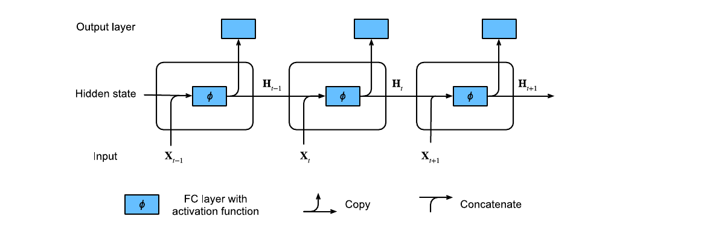

# Recurrent Neural Networks

> **Ý chính trong một câu:** RNN xử lý chuỗi bằng cách mang một hidden state đi qua thời gian, dùng chung parameters ở mọi bước và học bằng backpropagation trên đồ thị đã “trải” theo thời gian.

## Mục tiêu học tập

Học xong chương, bạn có thể:

- biến time series/text thành cặp input–target đúng thứ tự;
- giải thích autoregressive model, language model và perplexity;
- viết phương trình hidden state và đọc shape của RNN;
- huấn luyện character-level language model bằng gradient clipping;
- giải thích BPTT, exploding/vanishing gradients và cách detach state đúng lúc.

## Bản đồ chương

```text
sequence x₁, x₂, …
  ├─ dự báo số: dùng lịch sử để đoán xₜ
  └─ văn bản: tokenize → vocabulary → token IDs
                      ↓
language model: P(x₁,…,xₜ)=∏P(xₜ|x₍<t₎)
                      ↓
RNN: Hₜ = φ(XₜWₓₕ + Hₜ₋₁Wₕₕ + b)
                      ↓
unroll theo thời gian → BPTT → clip gradient → decode token kế tiếp
```

## Bức tranh tổng quan

Với ảnh tĩnh, mỗi example có shape cố định và các pixel được xử lý cùng lúc. Với chuỗi, thứ tự mang nghĩa và độ dài có thể thay đổi: “chó cắn người” khác “người cắn chó”. {{term:recurrent-neural-network|Recurrent neural network}} dùng cùng một cell ở mọi time step; hidden state là bản tóm tắt học được của quá khứ. Đây không phải “bộ nhớ hoàn hảo”: thông tin dài hạn vẫn có thể mờ đi, là lý do Chương 10 cần gates.

<!-- pagebreak -->

## 9.1 Working with Sequences

### 9.1.1 Autoregressive Models

Ở thời điểm $t$, ta chỉ được dùng quá khứ $x_{t-1},x_{t-2},\ldots$ để dự đoán $x_t$. Mô hình đơn giản dùng cửa sổ độ dài $\tau$:

$$\hat x_t=f(x_{t-1},\ldots,x_{t-\tau}).$$

Đây là autoregressive model hữu hạn. Cửa sổ lớn có thêm context nhưng input lớn và khó học hơn. Một lựa chọn khác là latent state $h_t=g(h_{t-1},x_{t-1})$, chính là tư tưởng recurrent.

### 9.1.2 Sequence Models

Sách tạo chuỗi tổng hợp $x_t=\sin(0.01t)+\epsilon_t$ rồi dùng các $\tau$ giá trị trước làm features. Với series dài $T$, ta có xấp xỉ $T-\tau$ examples. Tuy các cửa sổ chồng nhau không IID hoàn toàn, minibatch training vẫn hữu ích trong thực tế.

### 9.1.3 Training

Một MLP nhỏ có thể học one-step prediction bằng squared loss. Cần chia train/test theo **thời gian**, không shuffle toàn bộ rồi chia, vì làm vậy cho model nhìn gián tiếp tương lai.

### 9.1.4 Prediction

- **one-step prediction:** tại mỗi $t$, dùng observations thật gần nhất;
- **multi-step prediction:** sau điểm cuối, dùng chính prediction trước làm input tiếp.

Sai số multi-step tích lũy vì model dần ăn dữ liệu do chính nó sinh, khác distribution lúc training.

### 9.1.5 Summary

Autoregression biến chuỗi thành supervised examples. Dự báo càng xa càng khó vì uncertainty và model error cùng lan truyền.

### 9.1.6 Exercises

1. Tăng $\tau$ và quan sát one-step/multi-step error.
2. Dự báo xa hơn rồi vẽ error theo horizon.
3. Thử MLP sâu/rộng hơn và đánh giá overfitting.
4. Nếu toàn bộ chuỗi được biết khi training, giải thích vì sao random split gây leakage.
5. Thử dữ liệu không stationary và rolling validation.

<details markdown="1"><summary>Hướng giải</summary>

Giữ một đoạn cuối theo thời gian làm test. Với mỗi horizon $k$, tính metric riêng thay vì gộp; đường error thường tăng theo $k$. Nếu tăng $\tau$ làm validation xấu, model có thể đang học noise hoặc thiếu data cho số features lớn.
</details>

<!-- pagebreak -->

## 9.2 Converting Raw Text into Sequence Data

### 9.2.1 Reading the Dataset

Sách dùng *The Time Machine* của H. G. Wells. Pipeline chuẩn hóa ký tự không phải chữ thành khoảng trắng và chuyển lowercase. Đây là lựa chọn phục vụ demo, không phải quy luật bắt buộc; punctuation/case có thể mang nghĩa ở bài toán thật.

### 9.2.2 Tokenization

{{term:tokenization|Tokenization}} chia text thành units. Word tokens dễ đọc nhưng vocabulary lớn và gặp từ mới; character tokens nhỏ, không gần OOV nhưng sequence dài; subword là thỏa hiệp sẽ gặp ở Chương 15.

### 9.2.3 Vocabulary

{{term:vocabulary|Vocabulary}} ánh xạ token ↔ integer ID. Thường giữ token đặc biệt `<unk>`, có thể thêm `<pad>`, `<bos>`, `<eos>`. Chỉ xây vocab từ training data để tránh leakage; tokens hiếm có thể gộp vào `<unk>`.

```python
from collections import Counter


def build_vocabulary(tokens: list[str], min_frequency: int = 1) -> tuple[dict[str, int], list[str]]:
    """Return token_to_id and id_to_token with a stable <unk> id."""
    counts = Counter(tokens)
    id_to_token = ["<unk>"] + sorted(
        token for token, count in counts.items() if count >= min_frequency
    )
    token_to_id = {token: index for index, token in enumerate(id_to_token)}
    return token_to_id, id_to_token
```

### 9.2.4 Putting It All Together

Corpus là list token IDs; vocab giữ mappings và frequencies. Hãy in vài cặp `(token, id)` và decode lại một đoạn — round trip này bắt nhiều lỗi preprocessing hơn nhìn shape đơn thuần.

### 9.2.5 Exploratory Language Statistics

Tần suất từ thường có long tail gần quy luật Zipf: vài từ cực phổ biến, rất nhiều từ hiếm. Unigram/bigram/trigram distributions cho thấy cụm token có cấu trúc hơn lấy độc lập, nhưng n-gram lớn nhanh và sparse.

### 9.2.6 Summary

Text thô phải qua normalize, tokenize, count, vocabulary và numericalize. Mỗi lựa chọn thay đổi dữ liệu model thật sự thấy.

### 9.2.7 Exercises

1. Tokenize theo word thay vì character; so sequence length và vocab size.
2. Giữ punctuation/case rồi kiểm tra top tokens.
3. Vẽ log frequency theo log rank và quan sát Zipf.
4. So unigram, bigram, trigram; giải thích sparsity.
5. Đặt `min_frequency` khác nhau và đo tỷ lệ `<unk>`.

<!-- pagebreak -->

## 9.3 Language Models

### 9.3.1 Learning Language Models

{{term:language-model|Language model}} gán xác suất cho chuỗi. Chain rule:

$$
P(x_1,\ldots,x_T)=\prod_{t=1}^{T}P(x_t\mid x_1,\ldots,x_{t-1}).
$$

Một n-gram model rút gọn history bằng Markov assumption, ví dụ bigram dùng $P(x_t\mid x_{t-1})$. N-gram dễ đếm nhưng context dài làm số trường hợp bùng nổ; neural LM học representation để chia sẻ thống kê.

### 9.3.2 Perplexity

{{term:perplexity|Perplexity}} là exponential của average negative log-likelihood:

$$
\operatorname{PPL}=\exp\left(-\frac1n\sum_{t=1}^{n}\log P(x_t\mid x_{<t})\right).
$$

PPL có trực giác như số lựa chọn hiệu dụng ở mỗi bước. Model đoán đều trên vocab size $|V|$ có PPL $|V|$; model gán probability 1 cho token đúng có PPL 1. Chỉ so PPL khi tokenization/test set tương thích.

### 9.3.3 Partitioning Sequences

- **random sampling:** mỗi subsequence có vị trí bắt đầu ngẫu nhiên, hidden state thường reset;
- **sequential partitioning:** các minibatches nối tiếp theo thời gian, có thể chuyển state sang batch sau nhưng phải detach graph.

Input `[x_0,…,x_{T-2}]`, target `[x_1,…,x_{T-1}]`: target là input dịch trái một token.

### 9.3.4 Summary and Discussion

Language modeling là self-supervised: câu tự cung cấp next-token targets. PPL đo xác suất token đúng nhưng không tự đảm bảo text hữu ích, factual hay an toàn.

### 9.3.5 Exercises

1. Tính PPL của uniform, perfect và always-wrong model.
2. Viết likelihood cho trigram model.
3. So random/sequential iterator; kiểm tra có bỏ/mất token không.
4. Giải thích vì sao PPL không so trực tiếp giữa word- và character-tokenization.

<details markdown="1"><summary>Lời giải cốt lõi</summary>

- Uniform: mỗi token có probability $1/|V|$, NLL trung bình $\log|V|$, nên PPL $|V|$.
- Perfect: NLL 0, PPL 1. Gán 0 cho token đúng làm NLL/PPL vô hạn.
- Trigram: $P(x_1)P(x_2\mid x_1)\prod_{t=3}^TP(x_t\mid x_{t-2},x_{t-1})$.
</details>

<!-- pagebreak -->

## 9.4 Recurrent Neural Networks

### 9.4.1 Neural Networks without Hidden States

Nếu mỗi time step chỉ dùng $X_t$, một MLP áp dụng độc lập không biết tokens trước đó. Ghép một cửa sổ cố định giải quyết phần nào nhưng không có memory độ dài linh hoạt.

### 9.4.2 Recurrent Neural Networks with Hidden States



Vanilla RNN:

$$
H_t=\phi(X_tW_{xh}+H_{t-1}W_{hh}+b_h),\qquad
O_t=H_tW_{hq}+b_q.
$$

Với batch $n$, input size $d$, hidden size $h$, vocab/output $q$: $X_t\in\mathbb R^{n\times d}$, $H_t\in\mathbb R^{n\times h}$, $O_t\in\mathbb R^{n\times q}$. Parameters không tăng theo sequence length vì cùng matrices được tái dùng.

### 9.4.3 RNN-Based Character-Level Language Models

Ở mỗi bước, input là character hiện tại; output logits dự đoán character kế. Khi generate, token vừa chọn trở thành input tiếp. Hidden state chứa context như “tim” có thể khiến “e” có probability cao.

### 9.4.4 Summary

RNN là feedforward graph khi được unroll theo thời gian. Recurrent edge chỉ truyền từ $t-1$ sang $t$, nên thứ tự tính rõ ràng.

### 9.4.5 Exercises

1. Nếu dùng word one-hot, tính input/output dimensions.
2. Chứng minh concatenate $X_t,H_{t-1}$ rồi nhân một matrix tương đương hai tích ở công thức.
3. Tính parameter count theo $d,h,q$.
4. Giải thích hidden state khác model parameters.

<details markdown="1"><summary>Lời giải parameter count</summary>

RNN cell có $dh+h^2+h$ parameters; output layer có $hq+q$. Hidden state có $nh$ **giá trị tạm theo batch**, không phải learnable parameters. Bẫy phổ biến là nhân parameter count với số time steps; weights được share.
</details>

<!-- pagebreak -->

## 9.5 Recurrent Neural Network Implementation

### 9.5.1 RNN Model

Input token IDs thường được one-hot thành `(time, batch, vocab)` hoặc embedding thành `(time, batch, embed)`. Scratch implementation khởi tạo $W_{xh},W_{hh},b_h,W_{hq},b_q$ và hidden zeros.

### 9.5.2 RNN-Based Language Model

Wrapper chịu trách nhiệm: đổi ID sang representation, gọi recurrent layer, reshape output từ `(time,batch,hidden)` thành logits `(time*batch,vocab)`. Phải giữ cùng flatten order cho labels.

```python
import torch
from torch import nn


class CharacterRNN(nn.Module):
    def __init__(self, vocab_size: int, hidden_size: int) -> None:
        super().__init__()
        self.rnn = nn.RNN(vocab_size, hidden_size)
        self.output = nn.Linear(hidden_size, vocab_size)
        self.vocab_size = vocab_size

    def forward(self, token_ids: torch.Tensor, state: torch.Tensor | None = None):
        # token_ids: (batch, time) → one_hot: (time, batch, vocab)
        one_hot = torch.nn.functional.one_hot(
            token_ids.T, num_classes=self.vocab_size
        ).float()
        hidden_sequence, next_state = self.rnn(one_hot, state)
        logits = self.output(hidden_sequence).reshape(-1, self.vocab_size)
        return logits, next_state
```

### 9.5.3 Gradient Clipping

Nếu gradient norm lớn, update có thể phá model. {{term:gradient-clipping|Gradient clipping}} theo global norm:

$$
g\leftarrow \min\left(1,\frac{\theta}{\|g\|}\right)g.
$$

Hướng gradient giữ nguyên, độ dài bị giới hạn bởi $\theta$. Clipping chữa exploding gradients tức thời, không chữa nguyên nhân vanishing gradients.

### 9.5.4 Training

<div class="algorithm-block" markdown="1">
<p class="algorithm-label">THUẬT TOÁN · TRAIN RNN LANGUAGE MODEL</p>

**Đầu vào:** batch token IDs `x`, targets dịch một bước `y`, hidden state.

1. Nếu dùng sequential iterator, detach state khỏi graph batch trước; nếu random iterator, reset state.
2. Forward toàn subsequence, flatten logits/targets cùng thứ tự.
3. Tính cross-entropy trung bình trên mọi valid tokens.
4. Backward, clip global gradient norm, optimizer step.
5. Báo perplexity bằng `exp(total_nll / valid_token_count)`.

**Đầu ra:** parameters đã cập nhật và state cho subsequence kế tiếp.
</div>

### 9.5.5 Decoding

Warm-up model bằng prefix thật, sau đó lặp: lấy logits cuối → chọn token → đưa lại làm input. Greedy decoding dễ lặp; sampling có temperature tạo đa dạng nhưng temperature quá cao làm nhiễu.

### 9.5.6 Summary

Scratch RNN làm rõ state, weight sharing, flatten order và clipping. Những chi tiết này vẫn cần hiểu khi dùng API ngắn gọn.

### 9.5.7 Exercises

1. Đổi one-hot sang embedding và so parameters/FLOPs.
2. Thử hidden size, sequence length, learning rate và clipping threshold.
3. Generate với prefixes/temperature khác.
4. Kiểm tra bug khi không detach state.
5. So random và sequential sampling.

<!-- pagebreak -->

## 9.6 Concise Implementation of Recurrent Neural Networks

### 9.6.1 Defining the Model

`nn.RNN(input_size, hidden_size)` gói việc tính mọi time steps bằng implementation tối ưu. Output chứa hidden ở mọi bước; state chứa hidden cuối cho từng layer/direction. Luôn đọc docs về axis order (`batch_first`) thay vì đoán.

### 9.6.2 Training and Predicting

Training/decoding giống bản scratch. Khác biệt chủ yếu là layer quản lý parameters và kernel tính toán hiệu quả. API ngắn không loại bỏ yêu cầu detach state, clip gradient và khớp logits/labels.

### 9.6.3 Summary

Framework giúp code ngắn và nhanh; scratch implementation giúp hiểu shape và state. Cả hai nên cho xu hướng PPL/generation tương tự khi cấu hình ngang nhau.

### 9.6.4 Exercises

1. So tốc độ scratch và `nn.RNN`.
2. Dùng `batch_first=True` rồi sửa toàn bộ shape comments.
3. Thay character tokens bằng word tokens.
4. Kiểm tra reproducibility với seed và deterministic settings phù hợp.

<!-- pagebreak -->

## 9.7 Backpropagation Through Time

### 9.7.1 Analysis of Gradients in RNNs

Do $H_t$ phụ thuộc $H_{t-1}$, gradient tới một parameter là tổng ảnh hưởng qua nhiều paths và chứa tích nhiều Jacobians. Nếu norm các Jacobian thường <1, gradient biến mất; >1, gradient bùng nổ. Truncated BPTT cắt graph sau một số bước để giảm compute/memory và variance.

Ba chiến lược được sách thảo luận:

- full BPTT: chính xác trên toàn sequence nhưng đắt và dễ bất ổn;
- truncation: giới hạn history gradient, thực dụng nhất;
- random truncation: unbiased trong lý thuyết nhưng variance cao.

### 9.7.2 Backpropagation Through Time in Detail

Với scalar minh họa $h_t=f(x_t,h_{t-1},w_h)$, chain rule có recurrence:

$$
\frac{\partial h_t}{\partial w_h}=
\frac{\partial f_t}{\partial w_h}+
\frac{\partial f_t}{\partial h_{t-1}}
\frac{\partial h_{t-1}}{\partial w_h}.
$$

Mở recurrence tạo tổng các tích đạo hàm qua thời gian. Đây là nguồn memory dài hạn lẫn instability. `state.detach()` không xóa giá trị state; nó chỉ cắt quan hệ autograd với lịch sử trước.

### 9.7.3 Summary

BPTT chỉ là backpropagation trên recurrent graph đã unroll. Truncation là bias có chủ ý để bài toán khả thi; clipping giới hạn explosion; gated RNN ở chương sau tạo đường lưu thông tin tốt hơn.

### 9.7.4 Exercises

1. Tự đạo hàm recurrence cho hidden linear scalar.
2. Tìm điều kiện gradient vanish/explode khi hệ số recurrent cố định $a$.
3. So memory của full và truncated BPTT.
4. Giải thích vì sao detach mỗi time step làm model mất khả năng học phụ thuộc dài hơn một bước.
5. Thử sequence length khác và đo gradient norm.

<details markdown="1"><summary>Lời giải mô hình scalar</summary>

Nếu $h_t=a h_{t-1}+b x_t$, ảnh hưởng của $h_{t-k}$ lên $h_t$ là $a^k$. Với $|a|<1$ nó tiến 0; $|a|>1$ nó tăng vô hạn; $|a|=1$ giữ độ lớn nhưng phi tuyến/ma trận thực tế phức tạp hơn. Bẫy: clipping $a^k$ sau khi backward không thể khôi phục gradient đã biến mất.
</details>

<!-- pagebreak -->

## Điểm hay và ý nghĩa

- Language modeling tự tạo hàng triệu labels bằng cách dịch sequence một bước.
- Hidden state tách “memory đang chạy” khỏi parameters được học và dùng chung.
- BPTT cho thấy vấn đề của RNN nằm trong tích đạo hàm qua thời gian, chuẩn bị trực tiếp cho LSTM/GRU.

## Sau chương này bạn làm được gì?

Bạn có thể tạo sequence batches không rò rỉ tương lai, tính/diễn giải PPL, dựng character RNN, quản lý hidden state và giải thích vì sao cần detach + gradient clipping.

## Tóm tắt kiến thức

- Chuỗi cần bảo toàn order và đánh giá theo thời gian.
- LM factorize joint probability thành next-token conditionals.
- RNN dùng hidden state và share weights qua time.
- Multi-step prediction/decoding tích lũy sai số.
- BPTT có thể vanish/explode; truncation và clipping là biện pháp thực dụng.

## Bài tập tổng hợp

1. Với vocab 30, hidden 64 và one-hot input, tính parameter count của một vanilla RNN + output layer.
2. Cho probabilities token đúng `[0.5, 0.25, 0.125]`, tính PPL.
3. Viết checklist kiểm tra data iterator để chắc target đúng là input dịch một bước.

<details markdown="1"><summary>Gợi ý và lời giải</summary>

1. RNN: $30\cdot64+64^2+64=6080$; output: $64\cdot30+30=1950$; tổng 8030.
2. NLL trung bình $=-(\log0.5+\log0.25+\log0.125)/3=\log4$, nên PPL 4.
3. Decode vài rows; kiểm tra `target[:, :-1] == input[:, 1:]`; xác nhận padding không đi vào loss và split theo thời gian khi dự báo.
</details>

## Thuật ngữ cần nhớ

| Term | Hiểu ngắn gọn |
|---|---|
| autoregressive | dự đoán hiện tại từ quá khứ |
| tokenization | chia dữ liệu thành units rời rạc |
| vocabulary | ánh xạ token và integer ID |
| language model | gán xác suất cho chuỗi/token kế tiếp |
| perplexity | exponential của average token NLL |
| hidden state | memory tạm truyền qua time steps |
| gradient clipping | giới hạn global gradient norm |
| BPTT | backpropagation trên RNN unroll theo thời gian |

## Nguồn và phạm vi

- *Dive into Deep Learning*, Chương 9, trang sách 325–368.
- PDF vật lý 365–408; Figure 9.4.1 được trích trực tiếp từ PDF.
- Ví dụ code dùng PyTorch thuần và giữ đúng ý tưởng character-level RNN của sách.
