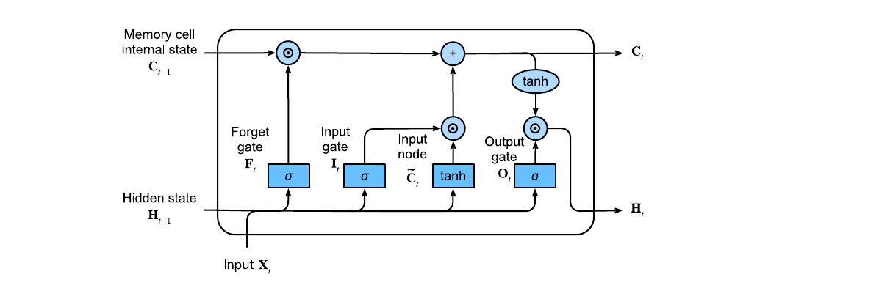
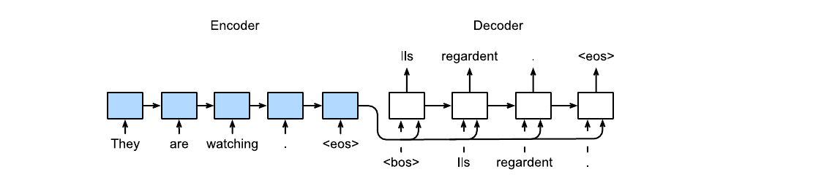

# Modern Recurrent Neural Networks

> **Ý chính trong một câu:** LSTM/GRU dùng gates để kiểm soát memory, còn encoder–decoder và beam search biến recurrent model thành hệ sinh chuỗi có input/output khác độ dài.

## Mục tiêu học tập

Học xong chương, bạn có thể:

- giải thích và tính các gates của LSTM/GRU;
- phân biệt deep, bidirectional và unidirectional RNN;
- chuẩn bị parallel corpus với `<pad>`, `<bos>`, `<eos>` và valid lengths;
- mô tả encoder–decoder, teacher forcing và masked loss;
- tính BLEU đơn giản và so greedy với beam search.

## Bản đồ chương

```text
Vanilla RNN khó giữ gradient dài hạn
  ├─ LSTM: cell state + input/forget/output gates
  └─ GRU: hidden state + reset/update gates
         ↓
  deep RNN (nhiều tầng) / bidirectional RNN (hai hướng)
         ↓
machine translation data → encoder tóm tắt source
                         → decoder sinh target
         ↓
teacher forcing + masked loss → inference token-by-token
         ↓
greedy / beam search → BLEU
```

## Bức tranh tổng quan

Vanilla RNN buộc hidden state vừa nhớ dài hạn vừa phản ứng với input mới. Gates là những van mềm có giá trị 0–1, học cách giữ, quên và phơi bày thông tin. Phần sau chương dùng các cell này để xây machine translation — ví dụ kinh điển của sequence-to-sequence.

<!-- pagebreak -->

## 10.1 Long Short-Term Memory (LSTM)

### 10.1.1 Gated Memory Cell

{{term:lstm|LSTM}} duy trì cell state $C_t$ ngoài hidden state $H_t$. Với input $X_t$ và state trước $H_{t-1}$:

$$
I_t=\sigma(X_tW_{xi}+H_{t-1}W_{hi}+b_i),
$$
$$
F_t=\sigma(X_tW_{xf}+H_{t-1}W_{hf}+b_f),
\quad
O_t=\sigma(X_tW_{xo}+H_{t-1}W_{ho}+b_o).
$$

Candidate memory:

$$\widetilde C_t=\tanh(X_tW_{xc}+H_{t-1}W_{hc}+b_c).$$

Cập nhật và output:

$$
C_t=F_t\odot C_{t-1}+I_t\odot\widetilde C_t,
\qquad
H_t=O_t\odot\tanh(C_t).
$$



Đọc bằng lời: forget gate quyết định giữ bao nhiêu memory cũ; input gate ghi bao nhiêu candidate mới; output gate cho phần nào của cell state đi ra hidden. Dấu $\odot$ là nhân từng phần tử.

### 10.1.2 Implementation from Scratch

Bản scratch cần bốn nhóm affine transforms cho `input`, `forget`, `output`, `candidate`. Mỗi gate output shape `(batch, hidden_size)`. Khởi tạo forget bias dương đôi khi giúp giữ memory lúc đầu, nhưng sách dùng cách khởi tạo thống nhất để minh họa.

<div class="algorithm-block" markdown="1">
<p class="algorithm-label">THUẬT TOÁN · MỘT TIME STEP LSTM</p>

**Đầu vào:** $X_t$, $(H_{t-1},C_{t-1})$.

1. Tính ba sigmoid gates $I_t,F_t,O_t$.
2. Tính candidate $\widetilde C_t$ bằng `tanh`.
3. Trộn memory cũ và mới để có $C_t$.
4. Lọc `tanh(C_t)` qua output gate để có $H_t$.

**Đầu ra:** $(H_t,C_t)$; cả hai phải được chuyển tới time step sau.
</div>

### 10.1.3 Concise Implementation

PyTorch: `nn.LSTM(input_size, hidden_size, num_layers)`. State là tuple `(h_n, c_n)`, mỗi tensor shape `(layers*directions, batch, hidden)`. Đừng truyền chỉ `h_n` như với vanilla RNN/GRU.

### 10.1.4 Summary

LSTM tạo một đường cell state có cập nhật cộng, giúp thông tin/gradient đi qua nhiều bước hơn. Nó không đảm bảo nhớ vô hạn; gates vẫn phải học và sequence dài vẫn tốn compute.

### 10.1.5 Exercises

1. Điều gì xảy ra khi $F_t=1,I_t=0$ hoặc $F_t=0,I_t=1$?
2. Tính parameter count LSTM theo input size $d$ và hidden $h$.
3. So gradient path của cell state với vanilla RNN.
4. Thử quên truyền `c_n` và quan sát chất lượng.
5. So scratch với `nn.LSTM` về shape/tốc độ.

<details markdown="1"><summary>Lời giải cốt lõi</summary>

- $F=1,I=0$: giữ nguyên memory cũ; $F=0,I=1$: thay bằng candidate mới.
- Bốn affine groups cho input và hidden: $4(dh+h^2+h)$ parameters theo cách viết một bias/gate; PyTorch có thể lưu hai bias vectors cho mỗi layer nên count thực tế theo API khác một chút.
</details>

<!-- pagebreak -->

## 10.2 Gated Recurrent Units (GRU)

### 10.2.1 Reset Gate and Update Gate

{{term:gru|GRU}} gộp cell và hidden state, dùng reset $R_t$ và update $Z_t$:

$$
R_t=\sigma(X_tW_{xr}+H_{t-1}W_{hr}+b_r),\quad
Z_t=\sigma(X_tW_{xz}+H_{t-1}W_{hz}+b_z).
$$

### 10.2.2 Candidate Hidden State

$$
\widetilde H_t=\tanh(X_tW_{xh}+(R_t\odot H_{t-1})W_{hh}+b_h).
$$

Reset gần 0 làm candidate ít nhìn state cũ; gần 1 gần vanilla recurrence.

### 10.2.3 Hidden State

$$H_t=Z_t\odot H_{t-1}+(1-Z_t)\odot\widetilde H_t.$$

Update gần 1 giữ memory cũ; gần 0 thay bằng candidate. Lưu ý một số tài liệu đổi tên/quy ước $Z$; luôn đọc công thức thay vì chỉ nhớ lời.

### 10.2.4 Implementation from Scratch

Scratch GRU có ba groups parameters thay vì bốn của LSTM. State chỉ gồm $H_t$, nên code và memory đơn giản hơn.

### 10.2.5 Concise Implementation

`nn.GRU` có interface gần `nn.RNN`; output và `h_n` theo cùng convention layers/directions. GRU thường nhanh hơn LSTM một chút, nhưng model nào tốt hơn phụ thuộc task/data/budget.

### 10.2.6 Summary

Reset gate điều khiển quá khứ khi tạo candidate; update gate nội suy state cũ và mới. GRU là gated RNN gọn, không phải “LSTM phiên bản luôn kém hơn”.

### 10.2.7 Exercises

1. Xét các cực trị của reset/update gates.
2. Tính parameter count và so với LSTM.
3. Đặt cùng hidden size/budget rồi so tốc độ, PPL.
4. Tìm lỗi nếu công thức trộn $Z$ và $1-Z$ không khớp tài liệu.
5. Thử khởi tạo update bias khác 0.

<details markdown="1"><summary>Gợi ý parameter count</summary>

Theo công thức một bias/gate, GRU có $3(dh+h^2+h)$ parameters, khoảng $3/4$ LSTM cùng $d,h$. So sánh công bằng hơn là giữ compute/parameter budget gần nhau chứ không chỉ hidden size.
</details>

<!-- pagebreak -->

## 10.3 Deep Recurrent Neural Networks

RNN một layer học dynamics theo thời gian; {{term:deep-rnn|deep RNN}} còn xếp nhiều recurrent layers theo chiều sâu. Ở layer $l$:

$$H_t^{(l)}=\phi_l(H_t^{(l-1)}W_{xh}^{(l)}+H_{t-1}^{(l)}W_{hh}^{(l)}+b_h^{(l)}).$$

### 10.3.1 Implementation from Scratch

Với mỗi time step, tính lần lượt layer 1→L; mỗi layer giữ state riêng. Output sequence của layer dưới là input sequence của layer trên. Dropout thường đặt **giữa layers**, không tự động trên recurrent transition cuối.

### 10.3.2 Concise Implementation

Dùng `num_layers` trong `nn.RNN/LSTM/GRU`. `h_n` có trục đầu bằng số layers × directions; lấy nhầm `h_n[-1]` có thể sai khi bidirectional.

### 10.3.3 Summary

Depth tăng khả năng biến đổi ở mỗi time step; sequence length tăng chiều sâu theo thời gian. Hai dạng depth cùng ảnh hưởng gradient nhưng không giống nhau.

### 10.3.4 Exercises

1. Vẽ graph RNN hai layers qua ba time steps.
2. Ghi shape output/state cho LSTM 3 layers.
3. So tăng hidden size với tăng layers dưới cùng parameter budget.
4. Thử dropout giữa layers và quan sát overfitting.

<!-- pagebreak -->

## 10.4 Bidirectional Recurrent Neural Networks

Bidirectional RNN chạy một recurrence trái→phải và một phải→trái, rồi concatenate states. Token giữa câu thấy cả context trước/sau. Nó hợp tagging/encoding khi toàn sequence đã có sẵn, nhưng không dùng trực tiếp để autoregressive generation vì sẽ nhìn tương lai.

### 10.4.1 Implementation from Scratch

Cần hai bộ recurrent parameters. Reverse input cho backward direction, sau đó đảo output về thứ tự gốc trước khi concatenate.

### 10.4.2 Concise Implementation

Đặt `bidirectional=True`. Output feature cuối có size `2*hidden_size`; state trục đầu xen theo layer/direction. Classifier phải nhận đúng chiều gấp đôi.

### 10.4.3 Summary

Bidirectional model đổi latency/causality lấy context hai phía. Không phải cứ accuracy tốt hơn là deploy được trong streaming.

### 10.4.4 Exercises

1. Nêu task dùng/không dùng được bidirectional RNN.
2. Xác định shape với 2 layers, 2 directions.
3. Giải thích leakage nếu dùng nó cho next-token prediction.
4. Đo latency offline và streaming.

<details markdown="1"><summary>Lời giải leakage</summary>

Backward state tại vị trí $t$ đã đọc $x_{t+1},x_{t+2},…$. Nếu dùng nó để dự đoán $x_{t+1}$, target đã nằm trong input context. Masking không tự sửa kiến trúc recurrent hai chiều; generation causal phải chỉ dùng quá khứ.
</details>

<!-- pagebreak -->

## 10.5 Machine Translation and the Dataset

### 10.5.1 Downloading and Preprocessing the Dataset

Sách dùng English–French parallel corpus. Tiền xử lý thay non-breaking spaces, lowercase và chèn space trước punctuation. Mỗi dòng là source–target cách nhau bằng tab.

### 10.5.2 Tokenization

Mỗi câu được tokenize theo word. Source và target cần vocab riêng vì ngôn ngữ khác nhau. Token `<eos>` đánh dấu kết thúc; `<bos>` khởi động decoder; `<pad>` làm batch chữ nhật; `<unk>` nhận token hiếm.

### 10.5.3 Loading Sequences of Fixed Length

Truncate câu dài hơn `num_steps`, thêm `<eos>`, rồi pad câu ngắn. `valid_len` đếm tokens thật gồm `<eos>` nhưng không gồm `<pad>`; nó dùng cho masked loss/attention.

```python
import torch


def sequence_mask(values: torch.Tensor, valid_lengths: torch.Tensor) -> torch.Tensor:
    """Mask positions at or beyond each sequence's valid length."""
    steps = torch.arange(values.shape[1], device=values.device)
    return steps.unsqueeze(0) < valid_lengths.unsqueeze(1)
```

### 10.5.4 Reading the Dataset

DataLoader trả source IDs, source valid lengths, target IDs, target valid lengths. Trước training, decode ít nhất một batch để chắc `<eos>`/padding ở đúng phía và source/target không bị đảo.

### 10.5.5 Summary

Machine translation là supervised sequence transduction. Padding chỉ là kỹ thuật batching; nó không phải nội dung và không được góp vào loss.

### 10.5.6 Exercises

1. Thử tokenization theo character/subword.
2. Đổi `num_steps` và đo tỷ lệ truncate/padding.
3. Vì sao vocab phải chỉ fit trên train split?
4. Kiểm tra valid lengths bằng mask trực quan.
5. Xử lý punctuation/case khác nhau và đánh giá trade-off.

<!-- pagebreak -->

## 10.6 The Encoder−Decoder Architecture

Encoder–decoder tách hai trách nhiệm: encoder biến input biến độ dài thành state/context; decoder dùng state và target prefix để sinh output biến độ dài.

### 10.6.1 Encoder

Interface nhận `X` và optional metadata, trả encoded representation. Representation có thể là một vector cuối, cả sequence states, hoặc cấu trúc phức tạp hơn.

### 10.6.2 Decoder

Decoder có `init_state(encoder_outputs, ...)` và `forward(X, state)`. State phải chứa đủ context lẫn memory decoding đang chạy.

### 10.6.3 Putting the Encoder and Decoder Together

Wrapper gọi encoder → khởi tạo decoder state → decoder. Interface thống nhất cho phép thay RNN encoder bằng Transformer encoder mà training loop ít đổi.

### 10.6.4 Summary

Encoder–decoder là abstraction, không phải một kiến trúc duy nhất. Nút thắt context vector cố định của seq2seq RNN sẽ được attention giải quyết ở Chương 11.

### 10.6.5 Exercises

1. Định nghĩa interfaces tối thiểu cho encoder/decoder.
2. Cho ví dụ encoder output không phải vector cố định.
3. Phân biệt decoder state với token output.

<!-- pagebreak -->

## 10.7 Sequence-to-Sequence Learning for Machine Translation



### 10.7.1 Teacher Forcing

{{term:teacher-forcing|Teacher forcing}} đưa token target thật trước đó vào decoder khi training. Decoder input là `<bos>, y_1,…,y_{T-1}`; labels là `y_1,…,y_T=<eos>`. Training song song/ổn định hơn, nhưng inference phải dùng token model vừa sinh — tạo exposure mismatch.

### 10.7.2 Encoder

RNN encoder nhận embeddings của source tokens và trả toàn output + final hidden state. Bản cơ bản dùng final state làm context $c=q(h_1,…,h_T)=h_T$.

### 10.7.3 Decoder

Mỗi target embedding được concatenate với context, đưa qua decoder RNN rồi linear projection ra vocab logits. Final encoder state khởi tạo decoder hidden.

### 10.7.4 Encoder–Decoder for Sequence-to-Sequence Learning

Gắn hai module theo interface 10.6. Source/target vocab sizes có thể khác; embedding dimensions không bắt buộc giống, nhưng hidden interface phải tương thích.

### 10.7.5 Loss Function with Masking

Cross-entropy được tính từng token, nhân mask rồi chia theo số valid tokens. Nếu chia cả padding, câu ngắn bị đánh giá sai nhẹ và model có thể học dự đoán `<pad>`.

### 10.7.6 Training

<div class="algorithm-block" markdown="1">
<p class="algorithm-label">THUẬT TOÁN · TRAIN SEQ2SEQ</p>

**Đầu vào:** source, source lengths, target, target lengths.

1. Tạo decoder input bằng `<bos>` + target bỏ token cuối.
2. Encoder đọc source; decoder chạy bằng teacher forcing.
3. So decoder logits với target thật ở cùng vị trí.
4. Mask `<pad>`, tính mean trên valid tokens, backward và clip gradients.

**Đầu ra:** model học xác suất $P(y_t\mid y_{<t},x)$.
</div>

### 10.7.7 Prediction

Encode source một lần. Bắt đầu bằng `<bos>`, lặp decoder one step, chọn token, cập nhật state; dừng khi gặp `<eos>` hoặc max steps. `eval()` và `no_grad()` là bắt buộc.

### 10.7.8 Evaluation of Predicted Sequences

{{term:bleu|BLEU}} kết hợp n-gram precision với brevity penalty:

$$
\mathrm{BLEU}=\exp\left(\min\left(0,1-\frac{\ell_{ref}}{\ell_{pred}}\right)\right)
\prod_{n=1}^{k}p_n^{1/2^n}.
$$

Clipped precision ngăn lặp một token để gian lận count. BLEU hữu ích cho so sánh corpus nhưng không đo đầy đủ nghĩa, factuality hay độ tự nhiên.

### 10.7.9 Summary

Seq2seq dùng encoder context và autoregressive decoder. Teacher forcing giúp training; masking bảo vệ loss; BLEU đánh giá overlap n-gram có phạt câu quá ngắn.

### 10.7.10 Exercises

1. Đảo source sequence và đo ảnh hưởng lên RNN encoder.
2. Thay GRU bằng LSTM/vanilla RNN.
3. Tăng layers/hidden/embedding và kiểm tra overfitting.
4. Bỏ teacher forcing hoặc dùng scheduled sampling.
5. Viết masked loss và unit test mọi-padding/một-token.
6. Tính BLEU thủ công cho câu ngắn.
7. Quan sát lỗi lặp/thiếu `<eos>` khi decode.

<!-- pagebreak -->

## 10.8 Beam Search

### 10.8.1 Greedy Search

Greedy chọn token probability cao nhất tại mỗi bước. Nhanh, nhưng lựa chọn tốt cục bộ có thể dẫn tới sequence probability thấp về sau.

### 10.8.2 Exhaustive Search

Vocab $|V|$, length $T$ có $|V|^T$ sequences, không khả thi. Nó là chuẩn ý tưởng, không phải giải pháp production.

### 10.8.3 Beam Search

{{term:beam-search|Beam search}} giữ $k$ prefixes có log-probability tốt nhất. Mỗi bước mở rộng mỗi prefix với vocabulary, chấm tổng log-probabilities, giữ top $k$; sequence gặp `<eos>` được đưa vào candidates hoàn chỉnh.

$$\log P(y_{1:T}\mid x)=\sum_{t=1}^{T}\log P(y_t\mid y_{<t},x).$$

Vì tổng log-probability thiên về câu ngắn, thường dùng length penalty. Beam lớn tìm kỹ hơn nhưng không bảo đảm chất lượng ngôn ngữ tăng mãi.

### 10.8.4 Summary

Greedy là beam size 1; exhaustive là giữ mọi path; beam search nằm giữa cost và search quality. Search không sửa model distribution sai.

### 10.8.5 Exercises

1. Chạy ví dụ vocab nhỏ bằng tay với beam size 2.
2. So complexity greedy, beam và exhaustive.
3. Thử length penalty khác nhau.
4. Vì sao beam lớn đôi khi cho câu ngắn/kém đa dạng?
5. So beam với sampling cho translation và creative generation.

<details markdown="1"><summary>Gợi ý complexity</summary>

Greedy chấm $|V|$ tokens mỗi bước; beam chấm khoảng $k|V|$ và chọn top-$k$; exhaustive tăng theo $|V|^T$. Trong thực tế logits cho $k$ prefixes được batch hóa, nhưng memory state cũng tăng theo $k$.
</details>

<!-- pagebreak -->

## Điểm hay và ý nghĩa

- Gates là cơ chế học được để chọn giữ/quên, thay vì đặt memory horizon cố định.
- Encoder–decoder tách representation của input khỏi quy trình sinh output; abstraction này dẫn thẳng tới Transformer.
- Teacher forcing phơi bày khác biệt giữa training và inference — một mẫu vấn đề xuất hiện ở nhiều generative models.

## Sau chương này bạn làm được gì?

Bạn có thể đọc state tuple của LSTM/GRU, chọn causal/bidirectional đúng task, chuẩn bị translation batch, mô tả training seq2seq, mask padding và viết beam search ở mức thuật toán.

## Tóm tắt kiến thức

- LSTM: ba gates + candidate + cell state; GRU: hai gates + một state.
- Deep tăng tầng; bidirectional thêm context tương lai nhưng không causal.
- Seq2seq học $P(y_t\mid y_{<t},x)$.
- Training dùng target prefix; inference dùng prediction prefix.
- BLEU đo overlap; beam search xấp xỉ tìm sequence tốt.

## Bài tập tổng hợp

1. Cho $F=0.8,I=0.2,C_{t-1}=1,\widetilde C=0.5,O=0.6$, tính $C_t,H_t$.
2. Với target `[a,b,<eos>,<pad>]`, viết decoder input và mask.
3. Cho hai bước probabilities, chứng minh greedy có thể thua một sequence bắt đầu bằng token hạng hai.

<details markdown="1"><summary>Lời giải bài 1–2</summary>

1. $C_t=0.8\cdot1+0.2\cdot0.5=0.9$; $H_t=0.6\tanh(0.9)\approx0.430$. Sanity check: $H_t$ nằm trong $[-0.6,0.6]$.
2. Decoder input `[<bos>,a,b,<eos>]`; labels `[a,b,<eos>,<pad>]`; mask `[1,1,1,0]`. Không tính loss ở `<pad>`.
</details>

## Thuật ngữ cần nhớ

| Term | Hiểu ngắn gọn |
|---|---|
| gate | vector 0–1 điều tiết luồng thông tin |
| LSTM | gated RNN có cell state riêng |
| GRU | gated RNN gọn với reset/update gates |
| bidirectional | đọc sequence theo cả hai hướng |
| encoder–decoder | mã hóa input rồi sinh output |
| teacher forcing | dùng target prefix thật khi training |
| BLEU | n-gram precision có brevity penalty |
| beam search | giữ nhiều prefixes tốt trong decoding |

## Nguồn và phạm vi

- *Dive into Deep Learning*, Chương 10, trang sách 369–408.
- PDF vật lý 409–448; hình trích trực tiếp từ Figure 10.1.4 và Figure 10.7.1.
- Công thức gate, seq2seq, masking, BLEU và beam search bám theo thứ tự của bản PDF.
