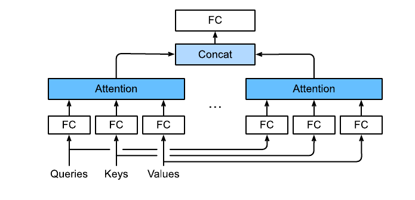
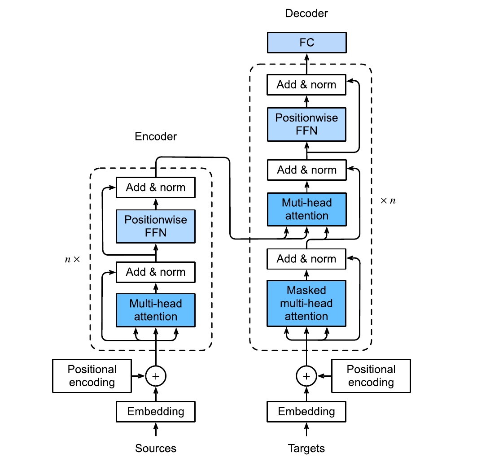

# Attention Mechanisms and Transformers

> **Ý chính trong một câu:** attention cho mỗi query tự chọn thông tin liên quan từ các key–value pairs; Transformer xếp cơ chế đó thành kiến trúc xử lý chuỗi song song và scale rất mạnh.

## Mục tiêu học tập

Học xong chương, bạn có thể:

- giải thích query, key, value và attention weights bằng cả trực giác lẫn công thức;
- cài scaled dot-product attention có mask và đọc tensor shapes;
- phân biệt additive, self-, cross- và multi-head attention;
- giải thích positional encoding, Transformer encoder/decoder và causal mask;
- mô tả Vision Transformer cùng ba họ pretraining encoder-only, encoder–decoder, decoder-only.

## Bản đồ chương

```text
query: tôi đang cần gì?
keys: mỗi mục nói về điều gì? ── score ── softmax ── weights
values: nội dung thực sự cần lấy ──────────────── weighted sum
                                ↓
self-attention + multi-head + positionwise FFN + residual + layer norm
                                ↓
Transformer encoder / causal decoder / encoder–decoder
                                ↓
ViT, BERT, T5, GPT và large-scale pretraining
```

## Bức tranh tổng quan

Seq2seq RNN ép cả câu nguồn vào một state cuối; câu dài dễ tạo bottleneck. Attention mở một “bộ nhớ tra cứu”: ở mỗi bước decoder, query hiện tại chấm điểm toàn bộ encoder states và lấy weighted average. Transformer bỏ recurrence, dùng attention làm phép trộn chính nên mọi vị trí có thể tính song song trong một layer.

<!-- pagebreak -->

## 11.1 Queries, Keys, and Values

Trong lookup cứng, query phải khớp chính xác key. {{term:attention|Attention}} là lookup mềm: query $q$ so với từng key $k_i$, softmax scores thành weights $\alpha_i$, rồi trộn values $v_i$:

$$
\alpha_i=\operatorname{softmax}_i(a(q,k_i)),\qquad
o=\sum_i\alpha_i v_i.
$$

Weights không âm và tổng bằng 1, nên output là convex combination của values. Key quyết định **được chọn bao nhiêu**; value quyết định **nội dung được lấy**. Một vector có thể tạo cả key và value qua hai projections khác nhau.

### 11.1.1 Visualization

Attention matrix có rows là queries và columns là keys. Heatmap giúp xem model tập trung ở đâu, nhưng weight cao không tự động là giải thích nhân quả cho quyết định của model.

### 11.1.2 Summary

Attention pooling trả weighted sum theo similarity giữa query và keys. Query phụ thuộc nhu cầu hiện tại nên cùng một memory có thể được đọc khác nhau.

### 11.1.3 Exercises

1. Khi mọi scores bằng nhau, output là gì?
2. Khi một score tiến vô hạn so với phần còn lại, output tiến tới đâu?
3. Phân biệt hard lookup và differentiable soft attention.
4. Vẽ attention heatmap có row/column labels đúng.

<details markdown="1"><summary>Lời giải ngắn</summary>

Scores bằng nhau cho weights $1/n$, tức mean của values. Một score áp đảo làm weight tương ứng tiến 1, output tiến tới value đó. Softmax giữ phép chọn khả vi nhưng mọi mục vẫn có thể nhận weight nhỏ.
</details>

<!-- pagebreak -->

## 11.2 Attention Pooling by Similarity

### 11.2.1 Kernels and Data

Sách dùng regression 1D: $y_i=2\sin(x_i)+x_i^{0.8}+\epsilon_i$. Kernel regression dự đoán tại query $x$ bằng trung bình có trọng số của $y_i$, trong đó điểm $x_i$ gần query nhận weight lớn.

### 11.2.2 Attention Pooling via Nadaraya–Watson Regression

Với Gaussian kernel $K(u)\propto\exp(-u^2/2)$:

$$
f(x)=\sum_i\frac{\exp\left(-\frac12(x-x_i)^2\right)}
{\sum_j\exp\left(-\frac12(x-x_j)^2\right)}y_i.
$$

Đây chính là attention: query $x$, keys $x_i$, values $y_i$, score âm bình phương khoảng cách. Không có parameters học được nhưng đã thể hiện đầy đủ “chấm điểm → softmax → weighted sum”.

### 11.2.3 Adapting Attention Pooling

Thêm parameter $w$ vào score $-\frac12((x-x_i)w)^2$ để học độ rộng kernel. $|w|$ lớn tạo attention nhọn/cục bộ; nhỏ tạo attention phẳng. Bài học: attention scoring function cũng có thể học từ data.

### 11.2.4 Summary

Nadaraya–Watson nối kernel smoothing cổ điển với neural attention. Heatmap weights cho thấy bias–variance: quá phẳng underfit, quá nhọn dễ bám noise.

### 11.2.5 Exercises

1. Thử Gaussian kernels với bandwidth khác.
2. Khi training data được lặp đôi, prediction có đổi không?
3. Thêm nhiều noise và quan sát learned sharpness.
4. Thay score bằng absolute distance.
5. Giải thích leave-one-out khi query chính là training key.

<!-- pagebreak -->

## 11.3 Attention Scoring Functions

### 11.3.1 Dot Product Attention

Dot product lớn khi vectors cùng hướng và có norm lớn. Với queries $Q$ và keys $K$, score matrix là $QK^\top$. Dot product yêu cầu cùng dimension cho query/key sau projection.

### 11.3.2 Convenience Functions

Hai tiện ích quan trọng của sách:

- masked softmax: loại padding/positions tương lai trước softmax bằng score rất âm;
- batched matrix multiplication: tính scores và weighted values cho cả batch.

Mask phải được áp dụng **trước** softmax; nhân probabilities với 0 sau softmax làm tổng weights không còn 1 nếu không chuẩn hóa lại.

### 11.3.3 Scaled Dot Product Attention

Nếu components độc lập mean 0 variance 1, dot product của $d$ components có variance $d$. Chia $\sqrt d$ giữ scale ổn định:

$$
\operatorname{Attention}(Q,K,V)=
\operatorname{softmax}\left(\frac{QK^\top}{\sqrt d}\right)V.
$$

```python
import math
import torch


def scaled_dot_product_attention(
    queries: torch.Tensor,
    keys: torch.Tensor,
    values: torch.Tensor,
    allowed: torch.Tensor | None = None,
) -> tuple[torch.Tensor, torch.Tensor]:
    """Attention for tensors shaped (batch, queries/keys, feature)."""
    scores = queries @ keys.transpose(-2, -1) / math.sqrt(queries.shape[-1])
    if allowed is not None:
        scores = scores.masked_fill(~allowed, float("-inf"))
    weights = torch.softmax(scores, dim=-1)
    return weights @ values, weights
```

### 11.3.4 Additive Attention

Khi query/key dimensions khác, project rồi cộng:

$$a(q,k)=w_v^\top\tanh(W_q q+W_k k).$$

Additive attention linh hoạt nhưng thường chậm hơn optimized matrix multiplication của dot-product attention.

### 11.3.5 Summary

Scaled dot-product phù hợp cùng dimension và GPU; additive attention học phép so sánh phi tuyến. Cả hai kết thúc bằng masked softmax và weighted sum of values.

### 11.3.6 Exercises

1. Chứng minh variance dot product tăng theo $d$ dưới giả định độc lập.
2. Tạo causal mask tam giác.
3. Unit test padding positions nhận weight 0.
4. So additive/dot-product về parameters và shapes.
5. Điều gì xảy ra nếu một row bị mask toàn bộ?

<details markdown="1"><summary>Gợi ý và cảnh báo</summary>

Variance của tổng $\sum_{j=1}^dq_jk_j$ là tổng variances, xấp xỉ $d$. Chia $\sqrt d$ đưa variance về gần 1. Row mask toàn bộ cho softmax của toàn `-inf`, dễ ra NaN; data/mask phải bảo đảm mỗi query có ít nhất một key hợp lệ hoặc xử lý riêng.
</details>

<!-- pagebreak -->

## 11.4 The Bahdanau Attention Mechanism

### 11.4.1 Model

Seq2seq cũ dùng một context cố định $c=h_T$. Bahdanau attention cho decoder state $s_{t-1}$ làm query, mọi encoder outputs $h_1,…,h_T$ làm keys/values. Mỗi target step nhận context riêng:

$$c_t=\sum_i\alpha_{t,i}h_i.$$

### 11.4.2 Defining the Decoder with Attention

Mỗi bước: chấm query với encoder outputs → context $c_t$ → concatenate với embedding token trước → RNN decoder → logits. Source padding được mask bằng valid lengths.

### 11.4.3 Training

Vẫn teacher forcing và masked token loss. Attention weights có thể được lưu để vẽ alignment source–target. Ví dụ khi sinh một từ tiếng Pháp, model có thể tập trung vào từ/cụm tiếng Anh liên quan.

### 11.4.4 Summary

Bahdanau attention tháo bottleneck vector cố định và cho alignment mềm, học end-to-end. Decoder vẫn recurrent nên các target steps chưa song song hoàn toàn.

### 11.4.5 Exercises

1. Viết shapes query/keys/values trong batch.
2. So context cố định với context theo time step.
3. Vẽ alignment và kiểm tra source padding.
4. Thay GRU bằng LSTM; state query lấy từ đâu?
5. Phân tích complexity theo source/target lengths.

<!-- pagebreak -->

## 11.5 Multi-Head Attention



### 11.5.1 Model

{{term:multi-head-attention|Multi-head attention}} dùng $h$ projections khác nhau:

$$
head_i=f(QW_i^Q,KW_i^K,VW_i^V),qquad
O=\operatorname{Concat}(head_1,…,head_h)W^O.
$$

Mỗi head có thể học kiểu quan hệ khác. Thông thường `model_dim` chia hết cho `num_heads`, nên head dimension $d_h=d/h$.

### 11.5.2 Implementation

Implementation reshape `(batch, steps, model_dim)` thành `(batch*num_heads, steps, head_dim)`, chạy attention song song, rồi đảo reshape. Mask/valid lengths phải được lặp đúng theo heads.

<div class="algorithm-block" markdown="1">
<p class="algorithm-label">SHAPE TRACE · MULTI-HEAD ATTENTION</p>

**Đầu vào:** `Q (B,Q,d)`, `K,V (B,K,d)`, $h$ heads.

1. Linear projections vẫn cho dimension $d$.
2. Split $d=h\cdot d_h$, chuyển heads vào batch: `(B*h, steps, d_h)`.
3. Attention từng head trả `(B*h, Q, d_h)`.
4. Ghép lại `(B,Q,d)` và qua output projection.

**Đầu ra:** cùng model dimension $d$, phù hợp residual addition.
</div>

### 11.5.3 Summary

Multi-head không chỉ chạy cùng attention nhiều lần; mỗi head có projections riêng, rồi output projection cho phép trộn thông tin giữa heads.

### 11.5.4 Exercises

1. Tính parameter count theo $d,h$.
2. Vì sao tăng heads mà giữ $d$ không làm projection parameters tăng mạnh?
3. Kiểm tra reshape/transpose bằng tensor có số dễ nhận.
4. Thử head count không chia hết model dimension.
5. Vẽ heatmap từng head và tránh diễn giải quá mức.

<details markdown="1"><summary>Lời giải parameter count</summary>

Bỏ bias, bốn projections $W^Q,W^K,W^V,W^O$ mỗi cái $d\times d$, tổng $4d^2$, gần như không phụ thuộc số heads nếu tổng model dimension giữ nguyên. Heads làm thay đổi cách chia không gian và attention computation, không nhân cả dimension lên $h$ lần.
</details>

<!-- pagebreak -->

## 11.6 Self-Attention and Positional Encoding

### 11.6.1 Self-Attention

{{term:self-attention|Self-attention}} lấy Q, K, V từ cùng sequence. Mỗi token trực tiếp trộn thông tin từ mọi token khác trong một layer. Encoder self-attention thường nhìn hai phía; decoder self-attention dùng causal mask.

### 11.6.2 Comparing CNNs, RNNs, and Self-Attention

Với sequence length $n$, representation size $d$, kernel $k$:

| Layer | Complexity | Sequential operations | Max path length |
|---|---:|---:|---:|
| convolution | $O(knd^2)$ | $O(1)$ | $O(n/k)$ |
| recurrent | $O(nd^2)$ | $O(n)$ | $O(n)$ |
| self-attention | $O(n^2d)$ | $O(1)$ | $O(1)$ |

Self-attention song song và nối xa tốt, nhưng quadratic theo length. Với $n\gg d$, attention có thể đắt hơn recurrence/convolution.

### 11.6.3 Positional Encoding

Attention thuần không biết thứ tự nếu hoán vị tokens cùng cách. {{term:positional-encoding|Positional encoding}} sinusoidal thêm vector theo vị trí:

$$
p_{i,2j}=\sin\left(\frac{i}{10000^{2j/d}}\right),\quad
p_{i,2j+1}=\cos\left(\frac{i}{10000^{2j/d}}\right).
$$

Các tần số khác nhau mã hóa vị trí; nhờ đẳng thức lượng giác, shift tương đối có thể biểu diễn tuyến tính từ sin/cos. Đây là encoding cố định; learned/relative encodings là các lựa chọn khác.

### 11.6.4 Summary

Self-attention bỏ recurrence nhưng cũng bỏ order, nên cần positional information. Nó đổi sequential bottleneck lấy memory/computation quadratic.

### 11.6.5 Exercises

1. Chứng minh self-attention không positional encoding là permutation equivariant.
2. Tính complexity cho $n=128,d=512$ và $n=4096,d=512$.
3. Vẽ vài chiều sinusoidal encoding.
4. Dùng công thức sin/cos để liên hệ $p_{i+\delta}$ với $p_i$.
5. So absolute learned với sinusoidal khi extrapolate length.

<!-- pagebreak -->

## 11.7 The Transformer Architecture

### 11.7.1 Model



Transformer encoder layer: multi-head self-attention → add & norm → positionwise FFN → add & norm. Decoder thêm masked self-attention và encoder–decoder cross-attention. Embedding được nhân $\sqrt d$ trước khi cộng positional encoding trong bản sách.

### 11.7.2 Positionwise Feed-Forward Networks

Cùng một MLP hai tầng được áp dụng độc lập ở mọi position:

$$\operatorname{FFN}(x)=W_2\operatorname{ReLU}(W_1x+b_1)+b_2.$$

Attention trộn **giữa positions**; FFN biến đổi **trong feature dimension** của từng position.

### 11.7.3 Residual Connection and Layer Normalization

Mỗi sublayer dùng residual rồi {{term:layer-normalization|layer normalization}}. LayerNorm chuẩn hóa theo feature dimension của từng token, không phụ thuộc batch statistics, phù hợp variable-length sequence và inference.

### 11.7.4 Encoder

Encoder stack $N$ blocks. Source padding mask ngăn token thật attend `<pad>`. Output giữ shape `(batch, source_steps, model_dim)` để decoder cross-attend mọi source positions.

### 11.7.5 Decoder

Decoder masked self-attention chỉ nhìn target prefix; cross-attention dùng decoder states làm queries, encoder outputs làm keys/values. Khi autoregressive inference, cache keys/values của prefixes giúp tránh tính lại toàn bộ lịch sử.

### 11.7.6 Training

Sách train Transformer nhỏ cho English–French. Vẫn teacher forcing, valid-length masking, cross-entropy và BLEU; điểm khác là architecture không recurrent và target causal mask cho phép tính mọi training positions song song.

<div class="algorithm-block" markdown="1">
<p class="algorithm-label">DATA FLOW · TRANSFORMER DECODER LAYER</p>

**Đầu vào:** target representations $Y$, encoder memory $M$.

1. Masked self-attention: Q=K=V=$Y$, chỉ nhìn target prefix.
2. Residual + LayerNorm.
3. Cross-attention: Q từ decoder; K,V từ $M$.
4. Residual + LayerNorm.
5. Positionwise FFN, residual + LayerNorm.

**Đầu ra:** target representations giàu source context, vẫn shape `(B,T,d)`.
</div>

### 11.7.7 Summary

Transformer xen kẽ token mixing bằng attention và channel mixing bằng FFN, giữ shape nhờ residual. Causal mask là ranh giới làm decoder sinh hợp lệ.

### 11.7.8 Exercises

1. Theo dõi mọi shape trong encoder/decoder block.
2. Bỏ positional encoding và quan sát chất lượng.
3. Bỏ causal mask để phát hiện target leakage.
4. So LayerNorm trước/sau sublayer.
5. Đổi số heads, FFN hidden size, layers dưới budget cố định.
6. Tính attention memory theo sequence length.
7. Vẽ encoder–decoder attention cho ví dụ dịch.

<details markdown="1"><summary>Checklist bắt lỗi Transformer</summary>

- `model_dim % num_heads == 0`.
- Padding mask broadcast đúng batch/head/query axes.
- Causal mask loại mọi key index lớn hơn query index.
- Residual operands cùng shape.
- `CrossEntropyLoss` nhận logits, không nhận probabilities.
- Validation/inference dừng ở `<eos>` và không dùng target thật.
</details>

<!-- pagebreak -->

## 11.8 Transformers for Vision

### 11.8.1 Model

{{term:vision-transformer|Vision Transformer}} (ViT) coi ảnh là sequence patches. Thêm learnable `<cls>` token, positional embeddings, Transformer encoder; representation của `<cls>` đi qua classification head.

### 11.8.2 Patch Embedding

Ảnh $(B,C,H,W)$ được chia patch $P\times P$, số tokens $N=HW/P^2$. Flatten mỗi patch $CP^2$ rồi linear projection tới $d$. Conv2d với `kernel_size=P, stride=P` thực hiện đúng việc chia và chiếu patch.

### 11.8.3 Vision Transformer Encoder

ViT trong sách dùng pre-normalization: LayerNorm trước attention/MLP rồi cộng shortcut. Dropout có thể áp dụng cho embeddings, attention và MLP.

### 11.8.4 Putting It All Together

Pipeline shape: `(B,C,H,W) → (B,N,d) → prepend <cls> → (B,N+1,d) → encoder → cls head`. Positional embedding phải có đủ $N+1$ positions; ảnh resolution khác có thể cần interpolation.

### 11.8.5 Training

Sách train ViT nhỏ trên Fashion-MNIST. ViT ít image-specific bias hơn CNN, nên thường cần nhiều data/augmentation/pretraining để phát huy ở scale lớn.

### 11.8.6 Summary and Discussion

Patch embedding nối ảnh với sequence model. Patch nhỏ giữ chi tiết nhưng làm $N$ lớn và attention cost tăng theo $N^2$; patch lớn rẻ nhưng mất chi tiết.

### 11.8.7 Exercises

1. Tính số patches cho ảnh $224\times224$, patch 16.
2. Tính attention matrix size theo patch 16 và 8.
3. Cài patch embedding bằng Conv2d và so với unfold+Linear.
4. Thay `<cls>` bằng mean pooling.
5. Thử positional embedding fixed/learned.
6. So ViT nhỏ với CNN dưới cùng parameters/recipe.

<details markdown="1"><summary>Lời giải kích thước</summary>

Patch 16: $14\times14=196$ patches, cộng `<cls>` là 197 tokens; một head có attention matrix $197\times197$. Patch 8: $28\times28=784$ patches, tức matrix $785\times785$, số entries gần gấp 16 — vì số tokens gấp 4 và cost bình phương.
</details>

<!-- pagebreak -->

## 11.9 Large-Scale Pretraining with Transformers

### 11.9.1 Encoder-Only

BERT là encoder-only, pretrained bằng masked language modeling: che một số tokens và dùng context hai phía để đoán. Fine-tuning thêm head cho classification, token labeling hoặc QA. Representation mạnh nhưng không tự nhiên cho autoregressive generation trái→phải.

### 11.9.2 Encoder–Decoder

T5 xem mọi task như text-to-text. Pretraining che **spans** liên tiếp; encoder đọc corrupted text, decoder sinh các spans bị che với sentinel tokens. Cross-attention hợp task input→output như translation/summarization.

### 11.9.3 Decoder-Only

GPT-style model dùng causal language modeling: dự đoán token kế từ prefix. Cùng objective với generation lúc inference. Prompt có thể cung cấp zero-shot, one-shot hoặc few-shot demonstrations mà không cập nhật parameters — gọi là {{term:in-context-learning|in-context learning}}.

### 11.9.4 Scalability

Sách trình bày empirical scaling: loss thường cải thiện trơn theo power-law khi tăng model size, data và compute trong vùng đo. Scaling law là quan sát thực nghiệm, không bảo đảm mọi task/miền tiếp tục cải thiện vô hạn; data quality, optimization và inference cost vẫn giới hạn.

### 11.9.5 Large Language Models

{{term:large-language-model|Large language model}} là Transformer LM quy mô lớn pretrained trên corpus rộng, có thể thích nghi bằng prompting hoặc fine-tuning. Emergent-looking capabilities có thể xuất hiện khi metric vượt ngưỡng, nhưng model vẫn tối ưu next-token likelihood và có thể hallucinate, phản ánh bias dữ liệu hoặc thất bại ngoài phân bố.

### 11.9.6 Summary and Discussion

Ba mode dùng cùng building blocks nhưng mask/objective khác:

| Mode | Context | Hợp với |
|---|---|---|
| encoder-only | hai phía | hiểu/biểu diễn input |
| encoder–decoder | source đầy đủ + target prefix | biến input thành output |
| decoder-only | prefix causal | sinh/tiếp tục chuỗi |

Scale mang lại khả năng mới nhưng kéo theo chi phí training/inference, dữ liệu, đánh giá, độ tin cậy và trách nhiệm triển khai.

### 11.9.7 Exercises

1. Chọn architecture mode cho sentiment, translation và text completion.
2. So MLM, span corruption và causal LM objectives.
3. Giải thích zero/one/few-shot bằng ví dụ prompt.
4. Vì sao validation loss thấp không đủ chứng minh factuality?
5. Phân tích trade-off model/data/compute dưới budget cố định.
6. Nêu rủi ro khi benchmark bị lẫn vào pretraining data.
7. So fine-tuning với in-context learning về parameters, latency và dữ liệu.

<!-- pagebreak -->

## Điểm hay và ý nghĩa

- Attention biến truy xuất memory thành phép toán differentiable và phụ thuộc query.
- Transformer tách hai loại mixing: attention trộn tokens, FFN trộn features.
- Một kiến trúc lõi thích nghi sang text, ảnh và pretraining chỉ bằng input representation, masks và objectives.

## Sau chương này bạn làm được gì?

Bạn có thể tính attention bằng tay, cài mask đúng, lần shape qua multi-head/Transformer, giải thích vì sao cần position, chọn encoder/decoder mode và đọc sơ đồ ViT/BERT/T5/GPT mà không nhầm vai trò.

## Tóm tắt kiến thức

- Query chấm keys; softmax weights trộn values.
- Scaled dot product chia $\sqrt d$; masks đặt trước softmax.
- Multi-head chia representation thành nhiều phép nhìn song song.
- Transformer = attention + FFN + residual + LayerNorm + position.
- Causal decoder không được nhìn target tương lai.
- Pretraining mode quyết định context và loại task tự nhiên.

## Bài tập tổng hợp

1. Với query `[1,0]`, keys `[[1,0],[0,1]]`, values `[[2,0],[0,4]]`, tính scaled dot-product attention.
2. Viết causal mask cho sequence length 4 và giải thích từng row.
3. Với `(B,T,d)=(8,128,512)`, 8 heads, ghi mọi shape từ projection tới output.

<details markdown="1"><summary>Gợi ý và lời giải bài 1</summary>

Scores trước scale `[1,0]`; chia $\sqrt2$ được `[0.707,0]`. Softmax xấp xỉ `[0.670,0.330]`. Output $=0.670[2,0]+0.330[0,4]\approx[1.340,1.320]`. Sanity check: mỗi output coordinate nằm giữa các values tương ứng vì weights không âm, tổng 1.
</details>

## Thuật ngữ cần nhớ

| Term | Hiểu ngắn gọn |
|---|---|
| query/key/value | nhu cầu / địa chỉ so khớp / nội dung lấy |
| attention weight | mức đóng góp của từng value |
| self-attention | Q,K,V cùng đến từ một sequence |
| cross-attention | query và memory đến từ hai nguồn |
| multi-head attention | nhiều không gian attention song song |
| positional encoding | đưa thứ tự/vị trí vào representation |
| LayerNorm | chuẩn hóa features trong từng token |
| Transformer | kiến trúc attention–FFN có residual/norm |
| in-context learning | học cách trả lời từ examples trong prompt, không update weights |

## Nguồn và phạm vi

- *Dive into Deep Learning*, Chương 11, trang sách 409–467.
- PDF vật lý 449–507; hình trích trực tiếp từ Figure 11.5.1 và Figure 11.7.1.
- Phần pretraining phản ánh phạm vi của bản PDF: encoder-only, encoder–decoder, decoder-only, scalability và LLMs.
