# Computer Vision

> **Ý chính trong một câu:** chương này đi từ câu hỏi “ảnh này là gì?” sang những câu hỏi khó hơn — “vật nằm ở đâu?”, “pixel này thuộc về ai?”, “làm sao vẽ lại ảnh theo phong cách khác?” — và cho thấy cả bốn câu hỏi đều dùng chung một ý tưởng: **features nhiều tầng** của CNN.

## Mục tiêu học tập

Học xong chương, bạn có thể:

- [ ] giải thích vì sao {{term:image-augmentation|image augmentation}} giúp model tổng quát hóa tốt hơn, và vì sao chỉ bật nó lúc training;
- [ ] mô tả bốn bước của {{term:fine-tuning|fine-tuning}} và nói rõ vì sao head mới học nhanh còn body học chậm;
- [ ] biểu diễn một {{term:bounding-box|bounding box}} theo hai cách và đổi qua lại giữa chúng;
- [ ] tính {{term:intersection-over-union|IoU}} bằng tay cho hai box nhỏ;
- [ ] mô tả cách gán ground-truth box cho {{term:anchor-box|anchor boxes}}, cách tính offset labels, và cách {{term:non-maximum-suppression|NMS}} lọc kết quả;
- [ ] giải thích vì sao feature maps ở nhiều tầng cho phép detect vật ở nhiều kích thước;
- [ ] so sánh {{term:single-shot-multibox-detection|SSD}} với họ R-CNN và nói rõ mỗi bên đánh đổi gì;
- [ ] tính shape output của {{term:transposed-convolution|transposed convolution}} và giải thích nó “ngược” với convolution ở chỗ nào;
- [ ] mô tả {{term:fully-convolutional-network|FCN}} cho {{term:semantic-segmentation|semantic segmentation}};
- [ ] viết lại ba thành phần loss của {{term:neural-style-transfer|neural style transfer}} và nói mỗi loss kéo ảnh về phía nào;
- [ ] tổ chức một pipeline thi ảnh trên Kaggle có validation và file submission đúng định dạng.

## Bản đồ chương

```text
ẢNH + ÍT NHÃN
 │
 ├─ 14.1 augmentation ─┐
 │                     ├─→ classification tốt hơn
 ├─ 14.2 fine-tuning ──┘
 │
 ├─ VẬT Ở ĐÂU?  (14.3 → 14.8)
 │    14.3 bounding box → 14.4 anchors + IoU + NMS
 │        → 14.5 nhiều scale → 14.6 dataset
 │        → 14.7 SSD (một giai đoạn)
 │        → 14.8 R-CNN → Fast → Faster → Mask (hai giai đoạn)
 │
 ├─ PIXEL NÀY THUỘC AI?  (14.9 → 14.11)
 │    14.9 semantic segmentation → 14.10 transposed conv
 │        → 14.11 FCN (output cùng H×W với input)
 │
 ├─ 14.12 style transfer: CNN đóng băng, ảnh mới là biến số
 │
 └─ 14.13–14.14 hai cuộc thi Kaggle để ráp mọi thứ lại
```

## Bức tranh tổng quan

Chương 7 và chương 8 đã dạy CNN và dùng nó cho image classification. Chương này giữ nguyên bộ xương đó nhưng đổi **câu hỏi**, và mỗi câu hỏi mới lại kéo theo một định dạng nhãn mới, một loss mới, một kiểu output mới.

| Nhiệm vụ | Model trả về cái gì | Shape output điển hình | Ví dụ |
|---|---|---|---|
| Image classification | một nhãn cho cả ảnh | `(batch, num_classes)` | “ảnh này có mèo” |
| Object detection | nhiều bộ `(class, score, box)` | danh sách dài thay đổi | “mèo ở góc trên bên phải” |
| Semantic segmentation | một nhãn cho **mỗi pixel** | `(batch, num_classes, H, W)` | “vùng này là mèo, vùng kia là nền” |
| Instance segmentation | mask riêng cho **từng cá thể** | box + mask mỗi instance | “con chó thứ nhất, con chó thứ hai” |

**Điều bạn cần mang theo từ các chương trước:** convolution và pooling (chương 7), ResNet/VGG và ý tưởng “tầng sâu hơn thấy vùng rộng hơn” (chương 8), softmax cross-entropy (chương 4), và SGD cùng learning rate (chương 3, 12).

**Sợi chỉ xuyên suốt:** CNN không chỉ cho một vector cuối cùng. Nó cho một **chồng feature maps**, mỗi tầng mô tả ảnh ở mức trừu tượng khác nhau. Detection dùng chồng đó để nhìn vật ở nhiều kích thước; segmentation dùng nó rồi phóng ngược về kích thước ảnh; style transfer đọc hai tầng khác nhau để tách “nội dung” khỏi “phong cách”.

<!-- pagebreak -->

## 14.1 Image Augmentation

### Trực giác

Bạn dạy một đứa trẻ nhận ra con mèo bằng đúng **một** tấm ảnh: mèo nằm giữa khung hình, ánh sáng vàng, quay mặt sang trái. Đứa trẻ có thể học nhầm rằng “mèo = vật ở giữa ảnh có màu vàng”. Nếu bạn cho xem cùng con mèo đó nhưng lệch sang trái, phóng to, dưới ánh đèn trắng, nó buộc phải tìm đặc điểm **thật sự** của mèo.

{{term:image-augmentation|Image augmentation}} làm đúng việc đó: từ ảnh training có sẵn, sinh ra các phiên bản “giống nhưng không trùng” bằng các biến đổi ngẫu nhiên. Sách nêu hai cách hiểu, và cả hai đều đúng:

1. **Làm tập training to ra** — mỗi epoch model thấy một biến thể khác.
2. **Buộc model bớt dựa vào thuộc tính không quan trọng** — vị trí, độ sáng, màu sắc cụ thể.

Sách còn nhận xét rằng augmentation gần như không thể thiếu đối với thành công của AlexNet thời điểm đó.

### 14.1.1 Common Image Augmentation Methods

Sách dùng một ảnh mèo 400×500 và một hàm phụ `apply` để chạy cùng một phép augmentation nhiều lần rồi xem kết quả:

```python
import torch
import torchvision
from torch import nn
from d2l import torch as d2l


def apply(img, aug, num_rows=2, num_cols=4, scale=1.5):
    """Chạy phép augmentation `aug` nhiều lần trên cùng một ảnh rồi hiển thị."""
    Y = [aug(img) for _ in range(num_rows * num_cols)]
    d2l.show_images(Y, num_rows, num_cols, scale=scale)
```

**Flipping and Cropping — lật và cắt.**

```python
# Lật trái–phải với xác suất 50%: phép augmentation lâu đời và phổ biến nhất.
apply(img, torchvision.transforms.RandomHorizontalFlip())

# Lật trên–dưới ít phổ biến hơn, nhưng với ảnh con mèo này vẫn không cản trở nhận dạng.
apply(img, torchvision.transforms.RandomVerticalFlip())
```

Vì sao crop lại quan trọng? Chương 7.5 đã nói pooling làm convolution bớt nhạy với **vị trí** của vật. Crop ngẫu nhiên tấn công đúng vấn đề đó từ phía dữ liệu: nếu con mèo lúc ở giữa, lúc ở góc, lúc to, lúc nhỏ, model không thể học “mèo luôn ở chính giữa”.

```python
# Cắt một vùng có diện tích bằng 10%–100% ảnh gốc, tỉ lệ rộng/cao lấy ngẫu nhiên
# trong khoảng 0.5–2, rồi resize vùng đó về 200×200 pixel.
shape_aug = torchvision.transforms.RandomResizedCrop(
    (200, 200), scale=(0.1, 1), ratio=(0.5, 2))
apply(img, shape_aug)
```

> **Quy ước của sách:** trong mục này, “một số ngẫu nhiên giữa $a$ và $b$” luôn có nghĩa là một giá trị liên tục lấy đều từ đoạn $[a, b]$.

**Changing Colors — đổi màu.** Có bốn thứ chỉnh được: `brightness` (độ sáng), `contrast` (tương phản), `saturation` (độ bão hòa) và `hue` (tông màu).

```python
# brightness=0.5 nghĩa là độ sáng mới nằm giữa 50% (1 - 0.5) và 150% (1 + 0.5) ảnh gốc.
apply(img, torchvision.transforms.ColorJitter(
    brightness=0.5, contrast=0, saturation=0, hue=0))

# Chỉnh cả bốn yếu tố cùng lúc.
color_aug = torchvision.transforms.ColorJitter(
    brightness=0.5, contrast=0.5, saturation=0.5, hue=0.5)
apply(img, color_aug)
```

**Combining Multiple Methods — phối hợp nhiều phép.** Thực tế hiếm khi dùng một phép đơn lẻ; `Compose` xâu chuỗi chúng lại:

```python
augs = torchvision.transforms.Compose([
    torchvision.transforms.RandomHorizontalFlip(), color_aug, shape_aug])
apply(img, augs)
```

> **Ranh giới của ý tưởng này:** một phép augmentation chỉ hợp lệ khi nó **không đổi nhãn**. Lật trái–phải một con mèo vẫn là mèo, nhưng lật trái–phải chữ “b” sẽ ra “d”, và lật một biển báo rẽ phải sẽ thành rẽ trái. Câu hỏi phải tự đặt cho mỗi phép là: *“sau biến đổi này, nhãn cũ còn đúng không?”*

### 14.1.2 Training with Image Augmentation

Sách chuyển từ Fashion-MNIST sang **CIFAR-10**, và nêu rõ lý do: trong Fashion-MNIST vị trí và kích thước vật đã được chuẩn hóa sẵn, còn CIFAR-10 có khác biệt đáng kể về màu và kích thước — nên mới có đất cho augmentation thể hiện.

Điểm quan trọng nhất của mục này nằm ở chỗ **train và test không dùng chung transform**:

```python
# Lúc training: lật ngẫu nhiên rồi mới chuyển sang tensor.
train_augs = torchvision.transforms.Compose([
    torchvision.transforms.RandomHorizontalFlip(),
    torchvision.transforms.ToTensor()])

# Lúc dự đoán: KHÔNG dùng phép ngẫu nhiên nào, để kết quả có tính xác định.
test_augs = torchvision.transforms.Compose([
    torchvision.transforms.ToTensor()])


def load_cifar10(is_train, augs, batch_size):
    """Đọc CIFAR-10 và áp augmentation qua tham số `transform` của dataset."""
    dataset = torchvision.datasets.CIFAR10(
        root="../data", train=is_train, transform=augs, download=True)
    return torch.utils.data.DataLoader(
        dataset, batch_size=batch_size, shuffle=is_train,
        num_workers=d2l.get_dataloader_workers())
```

`ToTensor` biến minibatch ảnh thành số thực 32-bit trong khoảng $[0, 1]$ với shape `(batch_size, channels, height, width)`.

Sách train ResNet-18 (mục 8.6) trên nhiều GPU bằng `train_ch13`, hàm này về sau còn được dùng lại cho cả fine-tuning và fine-tune BERT.

### 14.1.3 Summary

- Augmentation sinh ảnh ngẫu nhiên từ dữ liệu training có sẵn để cải thiện khả năng tổng quát hóa.
- Để có kết quả xác định lúc dự đoán, ta thường **chỉ** augment các ví dụ training, không dùng phép ngẫu nhiên khi predict.
- Các framework cung cấp rất nhiều phép augmentation và chúng có thể áp dụng đồng thời.

### 14.1.4 Exercises

1. Train model mà **không** dùng augmentation: `train_with_data_aug(test_augs, test_augs)`. So sánh training accuracy và testing accuracy giữa hai trường hợp có và không có augmentation. Thí nghiệm so sánh này có ủng hộ được luận điểm “augmentation làm giảm overfitting” không? Vì sao?
2. Phối hợp nhiều phép augmentation khác nhau khi train trên CIFAR-10. Test accuracy có tăng không?
3. Tra tài liệu trực tuyến của framework: nó còn cung cấp những phép augmentation nào khác?

<details markdown="1"><summary>Gợi ý</summary>

Với câu 1, hãy nghĩ xem *khoảng cách* giữa train accuracy và test accuracy nói lên điều gì, chứ đừng chỉ nhìn test accuracy. Với câu 3, hãy phân loại các phép theo thứ nguyên chúng tác động: hình học, màu sắc, hay xóa/che thông tin.
</details>

<details markdown="1"><summary>Lời giải</summary>

**Câu 1.** Bỏ augmentation thì training accuracy thường tăng nhanh hơn và đạt mức cao hơn, còn test accuracy thường thấp hơn — tức **khoảng cách train–test nới rộng**. Đó chính là dấu hiệu kinh điển của overfitting, nên thí nghiệm này *ủng hộ* luận điểm.

Nhưng cần cẩn thận khi kết luận: một lần chạy đơn lẻ không đủ. Augmentation đồng thời làm bài toán khó hơn, nên loss training cao hơn *không* tự động nghĩa là generalization tốt hơn. Muốn chắc chắn, hãy chạy vài seed khác nhau và so sánh khoảng cách train–test, chứ không so hai con số đơn lẻ.

**Câu 2.** Thường có cải thiện, nhưng không tự động. Thêm `RandomResizedCrop` và `ColorJitter` vào `RandomHorizontalFlip` giúp nhiều trên CIFAR-10. Tuy nhiên augmentation quá mạnh (ví dụ crop chỉ còn 10% diện tích, hue lệch tối đa) có thể phá mất ngữ nghĩa của lớp và làm accuracy *giảm*. Đây là một hyperparameter cần dò, không phải một công tắc bật là tốt.

**Câu 3.** Ngoài các phép đã nêu, `torchvision.transforms` còn có `RandomRotation`, `RandomAffine`, `RandomPerspective`, `RandomGrayscale`, `GaussianBlur`, và `RandomErasing`. Cách sắp xếp hữu ích:

| Nhóm | Ví dụ | Rủi ro với nhãn |
|---|---|---|
| Hình học | rotation, affine, perspective | có thể đổi nhãn với chữ/số/biển báo có hướng |
| Màu sắc | grayscale, blur, jitter | nguy hiểm khi màu chính là dấu hiệu phân biệt lớp |
| Xóa thông tin | random erasing, cutout | nếu che đúng vùng quyết định thì nhãn thành sai |

**Bẫy thường gặp:** áp augmentation ngẫu nhiên lúc test rồi thấy accuracy dao động giữa các lần chạy và tưởng model không ổn định.
</details>

<!-- pagebreak -->

## 14.2 Fine-Tuning

### Trực giác

Tập dữ liệu thực tế của bạn thường nằm **lưng chừng**: lớn hơn Fashion-MNIST (60 000 ảnh) nhưng nhỏ hơn ImageNet (hơn 10 triệu ảnh, 1000 lớp) rất nhiều. Sách lấy ví dụ: muốn nhận ra 100 loại ghế, bạn chụp 1000 ảnh mỗi loại — vẫn chưa bằng một phần mười ImageNet. Model đủ lớn cho ImageNet sẽ overfit trên tập ghế đó.

Giải pháp hiển nhiên là thu thập thêm dữ liệu, nhưng sách chỉ ra rằng chi phí gán nhãn rất lớn (riêng ImageNet đã tốn hàng triệu đô la tiền tài trợ nghiên cứu).

Giải pháp thứ hai là {{term:transfer-learning|transfer learning}}: chuyển kiến thức từ **source dataset** sang **target dataset**. Phần lớn ảnh ImageNet chẳng liên quan gì tới ghế, nhưng model học trên đó đã biết trích xuất **cạnh, texture, hình dạng, cách các bộ phận ghép lại** — và những đặc trưng chung này cũng hữu ích cho việc nhận ra ghế.

### 14.2.1 Steps

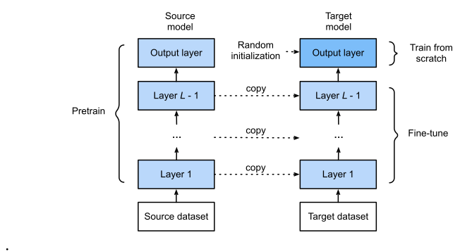

<div class="algorithm-block" markdown="1">
<p class="algorithm-label">LUỒNG THUẬT TOÁN · FINE-TUNING (4 BƯỚC THEO SÁCH)</p>

**Đầu vào:** một source dataset lớn (ví dụ ImageNet) và một target dataset nhỏ có $k$ lớp.

1. **Pretrain** một model — gọi là *source model* — trên source dataset.
2. Tạo *target model*, **sao chép toàn bộ thiết kế và tham số** của source model **trừ output layer**. Giả định ở đây là: các tham số này chứa kiến thức học được từ source dataset và kiến thức đó cũng dùng được cho target dataset; còn output layer thì gắn chặt với nhãn của source dataset nên bỏ đi.
3. **Thêm output layer mới** cho target model với số output bằng $k$, và khởi tạo ngẫu nhiên tham số của riêng layer này.
4. **Train target model trên target dataset.** Output layer được học lại từ đầu, còn mọi layer khác được *fine-tune* từ tham số của source model.

**Đầu ra:** một model đạt độ chính xác cao trên target dataset dù target dataset nhỏ.
</div>

Sách kết lại bằng một câu đáng nhớ: **khi target dataset nhỏ hơn source dataset rất nhiều, fine-tuning giúp cải thiện khả năng tổng quát hóa của model.**

### 14.2.2 Hot Dog Recognition

Ví dụ cụ thể: phân biệt “hot dog” với “không phải hot dog”. Dataset lấy từ ảnh trên mạng, gồm **1400 ảnh dương** (có hot dog) và chừng đó ảnh âm (món ăn khác); mỗi lớp lấy 1000 ảnh để train, phần còn lại để test.

Ảnh trong tập này khác nhau về kích thước và tỉ lệ khung hình, nên hai giai đoạn được xử lý khác nhau:

```python
# Ba giá trị mean/std chuẩn của ImageNet — phải dùng đúng bộ này vì model
# pretrained đã được huấn luyện trên dữ liệu chuẩn hóa như vậy.
normalize = torchvision.transforms.Normalize(
    [0.485, 0.456, 0.406], [0.229, 0.224, 0.225])

train_augs = torchvision.transforms.Compose([
    torchvision.transforms.RandomResizedCrop(224),   # cắt ngẫu nhiên rồi scale về 224×224
    torchvision.transforms.RandomHorizontalFlip(),
    torchvision.transforms.ToTensor(),
    normalize])

test_augs = torchvision.transforms.Compose([
    torchvision.transforms.Resize([256, 256]),       # đưa cả hai cạnh về 256
    torchvision.transforms.CenterCrop(224),          # rồi cắt chính giữa 224×224
    torchvision.transforms.ToTensor(),
    normalize])
```

Bước thay output layer chỉ gọn vài dòng:

```python
finetune_net = torchvision.models.resnet18(pretrained=True)
# ResNet-18 gốc có fc: Linear(512 -> 1000). Ta thay bằng Linear(512 -> 2).
finetune_net.fc = nn.Linear(finetune_net.fc.in_features, 2)
nn.init.xavier_uniform_(finetune_net.fc.weight)
```

**Vì sao hai learning rate khác nhau?** Body đã biết nhìn cạnh và texture — cập nhật mạnh sẽ *phá* representation tốt sẵn có. Ngược lại `fc` vừa khởi tạo ngẫu nhiên, chưa biết gì, nên cần học nhanh. Sách hiện thực ý này bằng cách cho output layer learning rate **gấp mười lần** phần còn lại:

```python
def train_fine_tuning(net, learning_rate, batch_size=128, num_epochs=5,
                      param_group=True):
    """Nếu param_group=True, tham số của output layer dùng learning rate gấp 10 lần."""
    ...
    if param_group:
        params_1x = [param for name, param in net.named_parameters()
                     if name not in ["fc.weight", "fc.bias"]]
        trainer = torch.optim.SGD(
            [{'params': params_1x},
             {'params': net.fc.parameters(), 'lr': learning_rate * 10}],
            lr=learning_rate, weight_decay=0.001)
    ...
```

Sách so sánh `finetune_net` (fine-tune, `lr=5e-5`) với `scratch_net` (train từ đầu, `lr=5e-4`) và model fine-tuned thắng rõ rệt.

### 14.2.3 Summary

- Transfer learning chuyển kiến thức học được từ source dataset sang target dataset; fine-tuning là kỹ thuật phổ biến của transfer learning.
- Target model sao chép mọi thiết kế cùng tham số của source model **trừ output layer**, rồi tinh chỉnh chúng dựa trên target dataset. Output layer của target model phải được train từ đầu.
- Nói chung, fine-tune tham số cũ dùng learning rate **nhỏ hơn**, còn train output layer từ đầu có thể dùng learning rate **lớn hơn**.

### 14.2.4 Exercises

1. Tiếp tục **tăng dần learning rate** của `finetune_net`. Accuracy thay đổi thế nào?
2. Tiếp tục chỉnh hyperparameters của cả `finetune_net` và `scratch_net` trong thí nghiệm so sánh. Chúng còn khác nhau về accuracy nữa không?
3. Đặt tham số của mọi layer **trước** output layer của `finetune_net` bằng đúng tham số source model và **không cập nhật** chúng khi training. Accuracy thay đổi ra sao? Có thể dùng đoạn mã sau:

   ```python
   for param in finetune_net.parameters():
       param.requires_grad = False
   ```

4. Thực tế trong ImageNet **có** lớp “hotdog”. Trọng số tương ứng của nó ở output layer lấy được bằng:

   ```python
   weight = pretrained_net.fc.weight
   hotdog_w = torch.split(weight.data, 1, dim=0)[934]
   ```

   Làm sao tận dụng được trọng số này?

<details markdown="1"><summary>Gợi ý</summary>

Câu 1: nhớ lại bước 4 của thuật toán — body đang mang thông tin quý. Learning rate lớn làm gì với thông tin đó? Câu 3: chú ý đoạn mã đó đóng băng **toàn bộ** tham số, kể cả `fc`; hãy nghĩ xem phải sửa gì để chỉ đóng băng body. Câu 4: `hotdog_w` là một vector 512 chiều sống trong đúng không gian feature mà `finetune_net.fc` nhận vào.
</details>

<details markdown="1"><summary>Lời giải</summary>

**Câu 1.** Accuracy ban đầu có thể nhích lên một chút, sau đó **giảm rõ rệt** khi learning rate tiếp tục tăng. Lý do: gradient lớn ghi đè lên các feature pretrained, phá đi chính thứ khiến fine-tuning có giá trị — hiện tượng thường gọi là *catastrophic forgetting*. Ở learning rate rất lớn, fine-tuning thậm chí có thể tệ hơn train từ đầu.

**Câu 2.** Khi cả hai được chỉnh kỹ, khoảng cách **thu hẹp nhưng thường không biến mất** với dataset nhỏ như hot dog. Đây chính là điểm mấu chốt: lợi ích của fine-tuning lớn nhất khi target dataset nhỏ; khi target dataset đủ lớn, train từ đầu dần bắt kịp.

**Câu 3.** Chạy nguyên đoạn mã như đề bài sẽ đóng băng **cả `fc`**, và vì `fc` mới khởi tạo ngẫu nhiên nên model gần như đoán bừa. Ý đồ đúng là đóng băng body rồi vẫn train head:

```python
for name, param in finetune_net.named_parameters():
    param.requires_grad = name in ("fc.weight", "fc.bias")
```

Lúc này ResNet-18 trở thành một **feature extractor cố định** và ta chỉ học một linear classifier trên 512 chiều. Kết quả thường thấp hơn fine-tune toàn bộ một chút, nhưng train nhanh hơn nhiều và ít overfit hơn khi dữ liệu rất ít.

**Câu 4.** `hotdog_w` có shape `(1, 512)` — đúng shape một hàng của `finetune_net.fc.weight`. Vậy thay vì khởi tạo ngẫu nhiên hàng “có hot dog”, ta gán luôn trọng số đã học từ ImageNet cho nó:

```python
finetune_net.fc.weight.data[1] = hotdog_w.squeeze(0)   # hàng ứng với lớp "hot dog"
```

Head khi đó khởi động từ một hướng đã biết là có nghĩa, nên hội tụ nhanh hơn.

**Bẫy thường gặp:** quên rằng chỉ số 934 chỉ đúng với thứ tự lớp của ImageNet-1k; đổi checkpoint khác là chỉ số đổi theo.
</details>

<!-- pagebreak -->

## 14.3 Object Detection and Bounding Boxes

### Trực giác

Image classification ngầm giả định trong ảnh chỉ có **một** vật chính. Đời thực không như vậy: ảnh có con chó bên trái và con mèo bên phải. Ta muốn biết cả **loại** lẫn **vị trí cụ thể** của chúng. Sách gọi nhiệm vụ này là {{term:object-detection|object detection}} (hay *object recognition*), và nêu vài ứng dụng: xe tự lái phải phát hiện xe, người đi bộ, đường và vật cản để lập lộ trình; robot định vị vật khi di chuyển; hệ thống an ninh phát hiện vật bất thường.

### 14.3.1 Bounding Boxes

Vị trí của một vật được mô tả bằng một {{term:bounding-box|bounding box}} — một hình chữ nhật. Có hai cách viết cùng một hình chữ nhật đó, và bạn sẽ gặp đi gặp lại cả hai:

| Cách biểu diễn | Bốn số là gì | Tiện cho việc gì |
|---|---|---|
| **Hai góc** (corner) | $(x_1, y_1, x_2, y_2)$ — góc trên-trái và góc dưới-phải | tính diện tích giao/hợp, vẽ hình |
| **Tâm–kích thước** (center) | $(x_c, y_c, w, h)$ — tâm, chiều rộng, chiều cao | tính offset giữa hai box |

Công thức đổi qua lại rất trực tiếp. Từ hai góc sang tâm–kích thước:

$$
x_c=\frac{x_1+x_2}{2},\quad
y_c=\frac{y_1+y_2}{2},\quad
w=x_2-x_1,\quad
h=y_2-y_1 .
$$

và ngược lại:

$$
x_1=x_c-\frac{w}{2},\quad
y_1=y_c-\frac{h}{2},\quad
x_2=x_c+\frac{w}{2},\quad
y_2=y_c+\frac{h}{2}.
$$

```python
#@save
def box_corner_to_center(boxes):
    """Đổi từ (góc trên-trái, góc dưới-phải) sang (tâm, rộng, cao).

    boxes: tensor shape (n, 4) với n là số bounding boxes.
    """
    x1, y1, x2, y2 = boxes[:, 0], boxes[:, 1], boxes[:, 2], boxes[:, 3]
    cx = (x1 + x2) / 2
    cy = (y1 + y2) / 2
    w = x2 - x1
    h = y2 - y1
    return torch.stack((cx, cy, w, h), axis=-1)          # (n, 4)


#@save
def box_center_to_corner(boxes):
    """Đổi từ (tâm, rộng, cao) sang (góc trên-trái, góc dưới-phải)."""
    cx, cy, w, h = boxes[:, 0], boxes[:, 1], boxes[:, 2], boxes[:, 3]
    x1 = cx - 0.5 * w
    y1 = cy - 0.5 * h
    x2 = cx + 0.5 * w
    y2 = cy + 0.5 * h
    return torch.stack((x1, y1, x2, y2), axis=-1)        # (n, 4)
```

> **Lưu ý về trục toạ độ:** trong ảnh, gốc toạ độ nằm ở **góc trên bên trái**, trục $x$ hướng sang phải, trục $y$ hướng **xuống dưới**. Vì vậy “góc dưới-phải” có cả $x$ và $y$ lớn hơn “góc trên-trái”.

### 14.3.2 Summary

- Object detection không chỉ nhận ra mọi vật quan tâm trong ảnh mà còn xác định **vị trí** của chúng; vị trí thường được biểu diễn bằng một bounding box hình chữ nhật.
- Ta có thể chuyển đổi qua lại giữa hai cách biểu diễn bounding box thông dụng.

### 14.3.3 Exercises

1. Tìm một ảnh khác và thử gán nhãn một bounding box bao quanh vật. So sánh việc gán nhãn bounding box với gán nhãn category: việc nào thường tốn thời gian hơn?
2. Vì sao chiều trong cùng của tham số `boxes` trong `box_corner_to_center` và `box_center_to_corner` **luôn** bằng 4?

<details markdown="1"><summary>Gợi ý</summary>

Câu 1: đếm số thao tác chuột cần cho mỗi loại nhãn, rồi nhân với số vật trong ảnh. Câu 2: một hình chữ nhật có các cạnh song song với trục cần tối thiểu bao nhiêu số thực để xác định duy nhất?
</details>

<details markdown="1"><summary>Lời giải</summary>

**Câu 1.** Gán category chỉ cần **một** lựa chọn cho cả ảnh. Gán bounding box cần kéo chuột xác định hai góc **cho từng vật**, rồi còn phải căn chỉnh lại cho khít. Vì vậy gán nhãn detection tốn thời gian hơn nhiều — thường gấp hàng chục lần trên ảnh nhiều vật. Đây chính là lý do thực tế khiến các dataset detection nhỏ hơn dataset classification, và cũng là lý do mục 14.6 phải tự tạo một dataset chuối nhỏ để minh hoạ.

**Câu 2.** Vì một hình chữ nhật có cạnh song song với trục trong mặt phẳng 2 chiều có đúng **4 bậc tự do**. Cả hai cách biểu diễn đều mã hoá bốn bậc tự do đó: hai góc $(x_1, y_1, x_2, y_2)$, hoặc tâm cộng kích thước $(x_c, y_c, w, h)$. Đổi biểu diễn là một song ánh giữa hai bộ bốn số, không thêm cũng không mất thông tin.

Chiều trong cùng luôn là 4 còn vì lý do kỹ thuật: code viết theo kiểu vectorized, chiều đầu `n` để tự do cho *số lượng* box, chiều cuối cố định để `boxes[:, 0]`, `boxes[:, 1]`, … luôn trỏ đúng thành phần.

**Bẫy thường gặp:** trộn lẫn hai biểu diễn — đưa `(x_c, y_c, w, h)` vào hàm tính IoU vốn mong đợi `(x_1, y_1, x_2, y_2)`. Code chạy trót lọt, chỉ có kết quả là sai.
</details>

<!-- pagebreak -->

## 14.4 Anchor Boxes

### Trực giác

Detector không thể “đoán thẳng” ra hình chữ nhật từ hư không. Chiến lược phổ biến là: **rải sẵn thật nhiều box ứng viên**, hỏi mỗi box “bên trong có vật không, và là vật gì?”, rồi **chỉnh biên** của box cho khít hơn. Các box ứng viên rải sẵn đó gọi là {{term:anchor-box|anchor boxes}}.

Hãy hình dung như việc dò kim trong đống rơm bằng một bộ khung lưới trong suốt đủ mọi kích cỡ: bạn đặt từng khung lên ảnh, hỏi “khung này có bao quanh vật không?”, rồi xê dịch khung nào có vẻ đúng cho vừa khít.

### 14.4.1 Generating Multiple Anchor Boxes

Giả sử ảnh có chiều cao $h$ và chiều rộng $w$. Tại **mỗi pixel** ta sinh các anchor boxes hình dạng khác nhau, xác định bởi hai tham số:

- **scale** $s \in (0, 1]$ — box chiếm bao nhiêu phần ảnh;
- **aspect ratio** $r > 0$ — tỉ lệ rộng trên cao.

Khi đó chiều rộng và chiều cao của anchor box là:

$$
w_{\text{anchor}} = w s \sqrt{r},
\qquad
h_{\text{anchor}} = \frac{h s}{\sqrt{r}} .
$$

**Đọc công thức này bằng lời:** $s$ tăng thì cả hai cạnh cùng to ra (box phình đều). $r$ tăng thì $\sqrt{r}$ tăng, cạnh ngang dài ra còn cạnh dọc ngắn lại — box trở nên **nằm ngang**. Với $r = 1$ ta có $\sqrt{r}=1$, box vuông theo tỉ lệ ảnh. Tích $w_{\text{anchor}} \cdot h_{\text{anchor}} = w h s^2$ không phụ thuộc $r$, nên **đổi $r$ giữ nguyên diện tích, chỉ đổi hình dáng**.

Nếu lấy $n$ scale $s_1,\dots,s_n$ và $m$ aspect ratio $r_1,\dots,r_m$ rồi dùng **mọi tổ hợp** tại mọi pixel, ta được $whnm$ anchor boxes — quá nhiều để tính. Sách chỉ giữ những tổ hợp **chứa $s_1$ hoặc $r_1$**:

$$
(s_1, r_1), (s_1, r_2), \ldots, (s_1, r_m), (s_2, r_1), (s_3, r_1), \ldots, (s_n, r_1).
$$

Tức mỗi pixel có $n + m - 1$ anchor boxes, và cả ảnh có $wh(n + m - 1)$ box.

**Kiểm tra bằng số:** ảnh 561×728, `sizes=[0.75, 0.5, 0.25]` ($n=3$), `ratios=[1, 2, 0.5]` ($m=3$) cho $n+m-1 = 5$ box mỗi pixel, tổng cộng $561 \times 728 \times 5 = 2\,042\,040$ box. Đúng bằng shape sách in ra: `torch.Size([1, 2042040, 4])`.

```python
Y = multibox_prior(X, sizes=[0.75, 0.5, 0.25], ratios=[1, 2, 0.5])
Y.shape                      # torch.Size([1, 2042040, 4])

# Đổi shape thành (H, W, boxes_per_pixel, 4) để lấy anchor tại một pixel cụ thể.
boxes = Y.reshape(h, w, 5, 4)
boxes[250, 250, 0, :]        # tensor([0.06, 0.07, 0.63, 0.82])
```

Bốn số trả về là $(x_1, y_1, x_2, y_2)$ đã được **chia cho chiều rộng và chiều cao ảnh**, nên đều nằm trong $[0, 1]$ — đó là lý do chúng nhỏ hơn 1 dù box khá to.

Hai triệu box cho một ảnh là con số báo động; mục 14.5 sẽ xử lý đúng vấn đề đó.

### 14.4.2 Intersection over Union (IoU)

Ta nói một anchor box “bao quanh con chó **khá tốt**”. Làm sao lượng hoá chữ “khá tốt”?

Coi mỗi bounding box là một **tập hợp pixel**. Với hai tập $\mathcal{A}$ và $\mathcal{B}$, chỉ số Jaccard là:

$$
J(\mathcal{A}, \mathcal{B}) = \frac{|\mathcal{A} \cap \mathcal{B}|}{|\mathcal{A} \cup \mathcal{B}|}.
$$

Áp vào hai bounding box, chỉ số Jaccard của hai tập pixel được gọi là {{term:intersection-over-union|intersection over union}} (IoU) — tỉ số giữa **diện tích giao** và **diện tích hợp**.

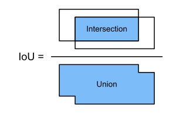

IoU luôn nằm trong $[0, 1]$: bằng **0** khi hai box hoàn toàn không chồng lấn, bằng **1** khi hai box trùng khít.

**Ví dụ tính tay.** Lấy $A=(0,0,2,2)$ và $B=(1,1,3,3)$ theo kiểu hai góc.

- Phần giao: $x$ từ $\max(0,1)=1$ đến $\min(2,3)=2$; $y$ tương tự. Diện tích giao $= 1 \times 1 = 1$.
- Diện tích $A = 4$, diện tích $B = 4$.
- Diện tích hợp $= 4 + 4 - 1 = 7$.
- $\text{IoU} = 1/7 \approx 0.143$.

Chú ý cách tính hợp: **cộng hai diện tích rồi trừ phần giao**, vì phần giao đã bị đếm hai lần. Đây chính là dòng cuối trong `box_iou`:

```python
#@save
def box_iou(boxes1, boxes2):
    """IoU từng cặp giữa hai danh sách box, cả hai ở dạng (x1, y1, x2, y2)."""
    box_area = lambda boxes: ((boxes[:, 2] - boxes[:, 0]) *
                              (boxes[:, 3] - boxes[:, 1]))
    areas1 = box_area(boxes1)                             # (n1,)
    areas2 = box_area(boxes2)                             # (n2,)
    # `None` thêm một trục để broadcast thành mọi cặp: (n1, n2, 2)
    inter_upperlefts = torch.max(boxes1[:, None, :2], boxes2[:, :2])
    inter_lowerrights = torch.min(boxes1[:, None, 2:], boxes2[:, 2:])
    # clamp(min=0): hai box rời nhau cho cạnh âm, phải kẹp về 0.
    inters = (inter_lowerrights - inter_upperlefts).clamp(min=0)
    inter_areas = inters[:, :, 0] * inters[:, :, 1]       # (n1, n2)
    union_areas = areas1[:, None] + areas2 - inter_areas  # (n1, n2)
    return inter_areas / union_areas
```

### 14.4.3 Labeling Anchor Boxes in Training Data

Trong tập training, **mỗi anchor box được coi là một ví dụ huấn luyện**, và mỗi ví dụ cần hai nhãn:

1. **class** — lớp của vật liên quan tới anchor box đó (lớp 0 dành cho background);
2. **offset** — độ lệch của ground-truth box so với anchor box.

**Assigning Ground-Truth Bounding Boxes to Anchor Boxes.** Cho $n_a$ anchor boxes $A_1,\dots,A_{n_a}$ và $n_b$ ground-truth boxes $B_1,\dots,B_{n_b}$ (với $n_a \ge n_b$). Lập ma trận $\mathbf{X} \in \mathbb{R}^{n_a \times n_b}$, phần tử $x_{ij}$ là IoU giữa anchor $A_i$ và ground-truth $B_j$.

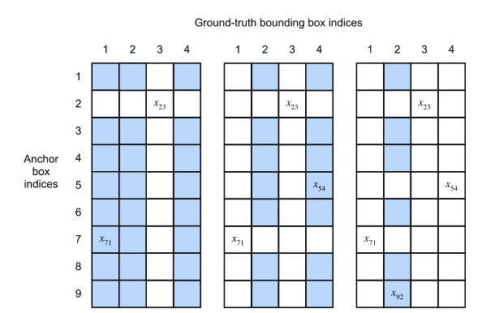

<div class="algorithm-block" markdown="1">
<p class="algorithm-label">LUỒNG THUẬT TOÁN · GÁN GROUND-TRUTH CHO ANCHORS</p>

**Đầu vào:** ma trận IoU $\mathbf{X}$ kích thước $n_a \times n_b$, ngưỡng `iou_threshold` (mặc định 0.5).

1. Tìm phần tử **lớn nhất** trong $\mathbf{X}$, gọi chỉ số hàng và cột là $i_1$, $j_1$. Gán ground-truth $B_{j_1}$ cho anchor $A_{i_1}$ — hợp lý vì đây là cặp gần nhau nhất trong tất cả các cặp. Sau đó **xoá toàn bộ hàng $i_1$ và cột $j_1$**.
2. Tìm phần tử lớn nhất trong phần còn lại, gọi là $i_2$, $j_2$; gán $B_{j_2}$ cho $A_{i_2}$; xoá hàng $i_2$ và cột $j_2$.
3. Lặp cho đến khi **cả $n_b$ cột đều đã bị xoá**. Lúc này $n_b$ anchor đã có ground-truth riêng — mỗi ground-truth chắc chắn được ít nhất một anchor phụ trách.
4. Duyệt $n_a - n_b$ anchor **còn lại**. Với anchor $A_i$, tìm trên hàng $i$ ground-truth $B_j$ có IoU lớn nhất, và **chỉ gán** $B_j$ cho $A_i$ nếu IoU đó **vượt ngưỡng** cho trước. Anchor không đạt ngưỡng được gán nhãn background.

**Đầu ra:** với mỗi anchor, hoặc một ground-truth box được gán, hoặc nhãn background.
</div>

Bước 1–3 đảm bảo **không ground-truth nào bị bỏ quên**, kể cả vật nhỏ mà mọi anchor đều khớp kém. Bước 4 thu nạp thêm các anchor “đủ tốt” làm ví dụ dương phụ.

**Labeling Classes and Offsets.** Anchor $A$ được gán ground-truth $B$ thì lấy luôn class của $B$. Còn offset thì cần một phép biến đổi. Gọi tâm, rộng, cao của $A$ là $(x_a, y_a, w_a, h_a)$ và của $B$ là $(x_b, y_b, w_b, h_b)$. Sách dùng phép biến đổi:

$$
\left(
\frac{\frac{x_b-x_a}{w_a}-\mu_x}{\sigma_x},\;
\frac{\frac{y_b-y_a}{h_a}-\mu_y}{\sigma_y},\;
\frac{\log\frac{w_b}{w_a}-\mu_w}{\sigma_w},\;
\frac{\log\frac{h_b}{h_a}-\mu_h}{\sigma_h}
\right)
$$

với giá trị mặc định $\mu_x=\mu_y=\mu_w=\mu_h=0$, $\sigma_x=\sigma_y=0.1$, $\sigma_w=\sigma_h=0.2$.

**Vì sao lại rắc rối thế thay vì lấy hiệu trực tiếp?** Ba lý do, đọc ngay trên công thức:

- **Chia cho $w_a$, $h_a$:** lệch 10 pixel là rất lớn với box 20 pixel nhưng không đáng kể với box 400 pixel. Chia cho kích thước anchor biến độ lệch thành **tỉ lệ**, nên mọi box đóng góp ở cùng thang đo.
- **Lấy $\log$ của tỉ số kích thước:** tỉ số $w_b/w_a$ luôn dương và lệch (0.5 và 2 là hai phía đối xứng nhau nhưng khoảng cách số học khác nhau). $\log$ đưa chúng về $-0.69$ và $+0.69$ — **đối xứng quanh 0**, dễ hồi quy hơn.
- **Chia cho $\sigma$:** giãn các giá trị ra cho phân bố đều hơn quanh 0, đúng khẩu vị của network.

Đây cũng là nguồn gốc các hằng số kỳ lạ trong code: nhân 10 chính là chia cho $\sigma=0.1$, nhân 5 là chia cho $\sigma=0.2$.

```python
#@save
def offset_boxes(anchors, assigned_bb, eps=1e-6):
    """Biến đổi độ lệch giữa anchor và ground-truth thành nhãn offset."""
    c_anc = d2l.box_corner_to_center(anchors)
    c_assigned_bb = d2l.box_corner_to_center(assigned_bb)
    # 10 = 1/0.1 (sigma_x, sigma_y); 5 = 1/0.2 (sigma_w, sigma_h)
    offset_xy = 10 * (c_assigned_bb[:, :2] - c_anc[:, :2]) / c_anc[:, 2:]
    offset_wh = 5 * torch.log(eps + c_assigned_bb[:, 2:] / c_anc[:, 2:])
    return torch.cat([offset_xy, offset_wh], axis=1)
```

### 14.4.4 Predicting Bounding Boxes with Non-Maximum Suppression

Lúc dự đoán, mọi anchor đều nhận một class và một offset. Áp offset ngược lại vào anchor ta được **predicted bounding box**:

```python
#@save
def offset_inverse(anchors, offset_preds):
    """Nghịch đảo phép biến đổi offset để lấy lại toạ độ box dự đoán."""
    anc = d2l.box_corner_to_center(anchors)
    pred_bbox_xy = (offset_preds[:, :2] * anc[:, 2:] / 10) + anc[:, :2]
    pred_bbox_wh = torch.exp(offset_preds[:, 2:] / 5) * anc[:, 2:]
    pred_bbox = torch.cat((pred_bbox_xy, pred_bbox_wh), axis=1)
    return d2l.box_center_to_corner(pred_bbox)
```

Vấn đề: rất nhiều anchor cạnh nhau cùng trùm lên một con chó, nên ta nhận về hàng chục box gần như y hệt cho **cùng một** con chó. {{term:non-maximum-suppression|Non-maximum suppression}} (NMS) dọn đống đó.

<div class="algorithm-block" markdown="1">
<p class="algorithm-label">LUỒNG THUẬT TOÁN · NON-MAXIMUM SUPPRESSION</p>

**Đầu vào:** danh sách $L$ các predicted box kèm confidence, ngưỡng `iou_threshold`.

1. Chọn box $B$ có **confidence cao nhất** trong $L$, đưa nó vào danh sách kết quả và loại khỏi $L$.
2. Tính IoU giữa $B$ và **mọi box còn lại** trong $L$. Loại khỏi $L$ mọi box có IoU với $B$ **vượt ngưỡng** — chúng được coi là cùng chỉ một vật với $B$.
3. Lặp bước 1–2 cho tới khi $L$ rỗng.

**Đầu ra:** mỗi vật còn đúng một box — box tự tin nhất trong nhóm chồng lấn của nó.
</div>

NMS là thuật toán **tham lam**: nó tin tuyệt đối vào box có score cao nhất và xoá thẳng những box chồng lấn. Bài tập 4 của mục này hỏi đúng vào chỗ yếu đó.

### 14.4.5 Summary

- Ta sinh anchor boxes với các hình dạng khác nhau, lấy mỗi pixel của ảnh làm tâm.
- Intersection over union (IoU), còn gọi là chỉ số Jaccard, đo độ giống nhau của hai bounding box; nó là tỉ số giữa diện tích giao và diện tích hợp.
- Trong tập training, mỗi anchor box cần **hai** loại nhãn: class của vật liên quan, và offset của ground-truth box so với anchor box.
- Lúc dự đoán, ta dùng non-maximum suppression (NMS) để loại các box dự đoán giống nhau, nhờ đó output gọn lại.

### 14.4.6 Exercises

1. Đổi giá trị `sizes` và `ratios` trong hàm `multibox_prior`. Các anchor boxes sinh ra thay đổi thế nào?
2. Dựng và vẽ hai bounding box có IoU bằng 0.5. Chúng chồng lên nhau ra sao?
3. Sửa biến `anchors` ở mục 14.4.3 và 14.4.4. Kết quả thay đổi thế nào?
4. Non-maximum suppression là thuật toán tham lam, nó dập các box dự đoán bằng cách **xoá** chúng. Có khả năng nào một vài box bị xoá thật ra lại hữu ích không? Làm sao sửa thuật toán để dập một cách **mềm**? Bạn có thể tham khảo Soft-NMS (Bodla và cộng sự, 2017).
5. Thay vì được thiết kế thủ công, non-maximum suppression có thể **học** được không?

<details markdown="1"><summary>Gợi ý</summary>

Câu 2: chọn hai hình vuông cạnh 1 lệch nhau theo một trục, rồi giải phương trình $\frac{\text{giao}}{\text{hợp}} = 0.5$ theo độ lệch. Câu 4: nghĩ tới hai người đứng sát nhau trong ảnh — chuyện gì xảy ra với box của người phía sau? Câu 5: NMS nhận vào tập box kèm score và trả ra tập con; hãy hỏi thành phần nào ở đây có thể thay bằng một hàm khả vi.
</details>

<details markdown="1"><summary>Lời giải</summary>

**Câu 1.** Số anchor mỗi pixel là $n + m - 1$, nên thêm một scale hoặc một ratio chỉ làm tăng **một** box mỗi pixel, không nhân lên. Tăng các giá trị trong `sizes` làm mọi box to ra; tăng `ratios` vượt 1 cho box nằm ngang, giảm xuống dưới 1 cho box thẳng đứng. Quan trọng: vì chỉ giữ các tổ hợp chứa $s_1$ hoặc $r_1$, **phần tử đầu tiên** của mỗi danh sách có sức ảnh hưởng lớn hơn hẳn các phần tử sau.

**Câu 2.** Lấy hai hình vuông cạnh $1$, lệch nhau $d$ theo trục $x$: $A=(0,0,1,1)$ và $B=(d,0,1+d,1)$.

- giao $= (1-d) \times 1 = 1-d$
- hợp $= 1 + 1 - (1-d) = 1+d$

Đặt $\frac{1-d}{1+d} = 0.5 \Rightarrow 2(1-d) = 1+d \Rightarrow d = \frac{1}{3}$.

Vậy $A=(0,0,1,1)$ và $B=(1/3, 0, 4/3, 1)$ có IoU đúng $0.5$, và chúng chồng lên nhau **hai phần ba** chiều rộng. Con số này đáng nhớ: IoU 0.5 *trông* chồng nhiều hơn cảm giác trực giác ban đầu.

**Câu 3.** Dịch `anchors` ra xa ground-truth làm IoU giảm; khi mọi IoU tụt dưới ngưỡng 0.5, bước 4 của thuật toán gán không nhận thêm anchor nào, nên gần như mọi anchor thành background và offset labels chỉ còn ở vài anchor được ép gán ở bước 1–3. Ở phía NMS, hạ confidence của box tốt nhất xuống dưới một box chồng lấn sẽ làm NMS giữ **box khác**, cho thấy kết quả phụ thuộc mạnh vào thứ tự score.

**Câu 4.** Có, và đây là lỗi thật trong thực tế: khi **hai vật cùng lớp đứng chồng nhau** (hai người, hai xe nối đuôi), box của vật thứ hai có IoU cao với box của vật thứ nhất nên bị xoá — detector bỏ sót hẳn một vật.

Soft-NMS sửa bằng cách **không xoá mà giảm điểm**. Thay vì đặt score về 0 khi IoU vượt ngưỡng, nó nhân score với một hệ số giảm dần theo IoU, ví dụ dạng Gaussian:

$$
s_i \leftarrow s_i \, e^{-\frac{\text{IoU}(B, B_i)^2}{\sigma}} .
$$

Box chồng lấn nhiều bị phạt nặng nhưng vẫn **còn cơ hội** vượt ngưỡng cuối nếu ban đầu nó rất tự tin.

**Câu 5.** Có. Hướng đi là coi NMS như một bước **học được** chứ không phải hậu xử lý cố định: cho một network nhỏ nhận vào các box, score và quan hệ chồng lấn giữa chúng rồi tự học mức phạt (dòng nghiên cứu learning-NMS / relation networks). Hướng triệt để hơn là thiết kế model sao cho **không cần NMS**: mỗi vật chỉ được một truy vấn phụ trách, ép buộc bằng một phép gán một-một trong hàm loss (ý tưởng của các detector kiểu DETR). *(Ghi chú của người biên soạn: hai hướng này nằm ngoài phạm vi sách, nêu ở đây để trả lời câu hỏi mở.)*

**Bẫy thường gặp:** đặt ngưỡng NMS quá thấp vì tưởng “càng gọn càng tốt”, rồi vô tình xoá mất các vật đứng cạnh nhau.
</details>

<!-- pagebreak -->

## 14.5 Multiscale Object Detection

### Trực giác

Mục 14.4 để lại một con số đáng sợ: ảnh 561×728 với 5 anchor mỗi pixel cho **hơn hai triệu** box cần gán nhãn và dự đoán. Phải giảm, nhưng giảm thế nào cho hợp lý?

Hai quan sát của sách dẫn đường:

1. **Không cần lấy mọi pixel làm tâm.** Chỉ cần lấy mẫu đều một phần nhỏ các pixel.
2. **Vật nhỏ thì cần nhiều vị trí hơn vật lớn.** Sách đưa ví dụ đếm rất gọn: trên ảnh $2\times2$, vật kích thước $1\times1$ có **4** vị trí khả dĩ, vật $1\times2$ có **2**, vật $2\times2$ chỉ có **1**. Vậy khi dùng anchor nhỏ để bắt vật nhỏ, ta lấy mẫu nhiều vùng; với vật lớn thì lấy mẫu ít vùng là đủ.

### 14.5.1 Multiscale Anchor Boxes

Ý tưởng hiện thực: thay vì rải anchor trên **ảnh**, ta rải trên **feature map**. Nhớ lại mục 7.2, output hai chiều của một convolutional layer gọi là feature map. Chọn shape feature map là chọn luôn lưới tâm anchor trên ảnh.

```python
def display_anchors(fmap_w, fmap_h, s):
    d2l.set_figsize()
    # Hai chiều đầu không ảnh hưởng output nên để tuỳ ý.
    fmap = torch.zeros((1, 10, fmap_h, fmap_w))
    anchors = d2l.multibox_prior(fmap, sizes=s, ratios=[1, 2, 0.5])
    bbox_scale = torch.tensor((w, h, w, h))
    d2l.show_bboxes(d2l.plt.imshow(img).axes, anchors[0] * bbox_scale)
```

Vì toạ độ anchor đã chia cho chiều rộng/cao của **feature map**, chúng nằm trong $[0,1]$ và biểu thị **vị trí tương đối**. Nhờ vậy tâm các anchor luôn phân bố **đều** trên ảnh gốc, bất kể feature map to hay nhỏ.

Sách chạy ba lần và ta thấy rõ quy luật:

| Feature map | scale | Kết quả |
|---|---|---|
| $4 \times 4$ | 0.15 | 16 tâm phân bố đều, các anchor **không** chồng nhau — hợp để bắt vật nhỏ |
| $2 \times 2$ | 0.4 | 4 tâm, anchor lớn hơn và **bắt đầu chồng lấn** |
| $1 \times 1$ | 0.8 | 1 tâm ngay giữa ảnh, một anchor rất lớn |

Giảm một nửa chiều cao và rộng của feature map thì số tâm giảm bốn lần, còn scale thì tăng lên — đúng tinh thần quan sát số 2 ở trên.

### 14.5.2 Multiscale Detection

Ở một scale nào đó, giả sử ta có $c$ feature maps kích thước $h \times w$. Theo cách trên, ta sinh $hw$ **nhóm** anchor, mỗi nhóm gồm $a$ anchor cùng tâm. Ví dụ ở scale đầu tiên, với 10 feature map $4\times4$, ta có 16 nhóm, mỗi nhóm 3 anchor.

Phần sâu sắc nhất của mục này là lập luận về {{term:receptive-field|receptive field}}:

> Giả sử $c$ feature maps đó là output trung gian của CNN khi lan truyền xuôi trên ảnh. Vì mỗi feature map có $hw$ vị trí không gian khác nhau, cùng một vị trí không gian có thể xem như có $c$ **units**. Theo định nghĩa receptive field ở mục 7.2, $c$ units tại cùng một vị trí không gian có **cùng receptive field** trên ảnh input: chúng biểu diễn thông tin ảnh trong cùng một vùng.

Từ đó suy ra cách làm: **biến $c$ units tại một vị trí thành class và offset của các anchor sinh ra tại chính vị trí đó.** Nói cách khác, ta dùng thông tin của ảnh trong một receptive field nhất định để dự đoán các anchor nằm gần receptive field đó.

Và khi feature maps ở các tầng khác nhau có receptive field **kích thước khác nhau**, chúng dùng để bắt vật kích thước khác nhau. Ta thiết kế network sao cho units của feature maps gần output layer có receptive field rộng hơn, nhờ đó phát hiện được vật lớn hơn trong ảnh.

> **Tóm một câu:** ta khai thác được representation nhiều tầng của deep network để làm multiscale object detection. Mục 14.7 sẽ biến ý tưởng này thành code chạy được.

### 14.5.3 Summary

- Ở nhiều scale khác nhau, ta sinh anchor boxes kích thước khác nhau để phát hiện vật kích thước khác nhau.
- Bằng cách định nghĩa shape của feature maps, ta xác định được tâm của các anchor box lấy mẫu đều trên ảnh bất kỳ.
- Ta dùng thông tin ảnh trong một receptive field nhất định để dự đoán class và offset của các anchor gần receptive field đó.
- Nhờ deep learning, ta tận dụng được biểu diễn ảnh phân tầng ở nhiều mức cho multiscale object detection.

### 14.5.4 Exercises

1. Theo các thảo luận ở mục 8.1, deep neural networks học các features phân cấp với mức trừu tượng tăng dần. Trong multiscale object detection, feature maps ở các scale khác nhau có tương ứng với các mức trừu tượng khác nhau không? Vì sao có hoặc vì sao không?
2. Ở scale đầu tiên (`fmap_w=4, fmap_h=4`) trong thí nghiệm ở mục 14.5.1, hãy sinh các anchor boxes phân bố đều nhưng **có thể chồng lấn** nhau.
3. Cho một biến feature map có shape $1 \times c \times h \times w$, với $c$, $h$, $w$ lần lượt là số channel, chiều cao và chiều rộng. Làm sao biến nó thành class và offset của các anchor box? Shape của output là gì?

<details markdown="1"><summary>Gợi ý</summary>

Câu 1: hãy tách bạch hai chuyện — feature maps ở các **tầng** khác nhau, và feature maps ở các **scale** khác nhau. Trong một CNN thông thường thì hai chuyện đó có trùng nhau không? Câu 2: ở thí nghiệm gốc scale là 0.15 và các anchor vừa khít không chạm nhau; cạnh anchor bằng bao nhiêu phần ảnh thì bắt đầu chồng? Câu 3: xem lại mục 14.4 — mỗi anchor cần bao nhiêu số cho class và bao nhiêu số cho offset?
</details>

<details markdown="1"><summary>Lời giải</summary>

**Câu 1.** **Có** — trong kiến trúc mà các scale lấy từ các tầng khác nhau, như SSD ở mục 14.7. Feature map lớn lấy từ tầng nông mang features mức thấp (cạnh, texture) với receptive field hẹp; feature map nhỏ lấy từ tầng sâu mang features mức cao (bộ phận, toàn vật) với receptive field rộng. Hai trục — độ phân giải không gian và mức trừu tượng — bị **gắn chặt** với nhau.

Nhưng cần nói rõ giới hạn: sự tương ứng này đến từ *thiết kế*, chứ không phải tất yếu. Nếu ta lấy nhiều scale bằng cách resize ảnh input rồi chạy **cùng một** tầng, thì mọi scale có cùng mức trừu tượng. Chính vì mối gắn kết này gây khó (vật nhỏ chỉ được features mức thấp phục vụ) mà các kiến trúc sau này thêm đường nối từ trên xuống để trộn features mức cao vào feature map độ phân giải cao.

**Câu 2.** Ở feature map $4\times4$, các tâm cách nhau $1/4$ chiều ảnh. Anchor với $s=0.15$, $r=1$ có cạnh $0.15$ — nhỏ hơn khoảng cách tâm $0.25$ nên không chạm nhau. Muốn chúng chồng lấn, chỉ cần **tăng scale vượt khoảng cách tâm**:

```python
display_anchors(fmap_w=4, fmap_h=4, s=[0.3])   # 0.3 > 0.25 nên các anchor chồng lên nhau
```

Tổng quát: với feature map $n \times n$, các anchor cùng ratio $r=1$ bắt đầu chồng khi $s > 1/n$.

**Câu 3.** Dùng đúng thủ thuật của mục 14.7: một convolutional layer $3\times3$ với padding 1 giữ nguyên $h$ và $w$, chỉ đổi **số channel**. Gọi $a$ là số anchor mỗi vị trí và $q$ là số lớp vật.

- **Class:** mỗi anchor cần $q + 1$ điểm số (cộng 1 cho background), nên output cần $a(q+1)$ channel. Shape: $1 \times a(q+1) \times h \times w$.
- **Offset:** mỗi anchor cần 4 số, nên output cần $4a$ channel. Shape: $1 \times 4a \times h \times w$.

Toàn bộ feature map cho $hwa$ anchor, tức $hwa(q+1)$ giá trị class và $4hwa$ giá trị offset.

Điều làm cách này chạy được là **tương ứng một–một theo vị trí không gian**: channel tại vị trí $(i, j)$ của output nói về đúng những anchor có tâm tại $(i, j)$ của input. Ở mục 14.7, kênh có chỉ số $i(q+1)+j$ chứa dự đoán cho lớp $j$ của anchor $i$.

**Bẫy thường gặp:** dùng fully connected layer cho phần dự đoán này. Sách chỉ rõ điều đó **bất khả thi** vì số tham số quá lớn — đó chính là lý do phải chuyển sang convolution.
</details>

<!-- pagebreak -->

## 14.6 The Object Detection Dataset

### Trực giác

Trong classification có MNIST và Fashion-MNIST để thử nhanh. Detection **không có** tập nhỏ tương đương. Vì vậy các tác giả tự tạo một tập: chụp ảnh chuối, sinh 1000 ảnh chuối với góc xoay và kích thước khác nhau, dán mỗi ảnh chuối vào một vị trí ngẫu nhiên trên ảnh nền, rồi gán nhãn bounding box cho từng quả chuối.

### 14.6.1 Downloading the Dataset

```python
#@save
d2l.DATA_HUB['banana-detection'] = (
    d2l.DATA_URL + 'banana-detection.zip',
    '5de26c8fce5ccdea9f91267273464dc968d20d72')
```

### 14.6.2 Reading the Dataset

Khác biệt quan trọng so với classification: ngoài ảnh, dataset còn có **một file csv** chứa class label và toạ độ góc trên-trái, dưới-phải của ground-truth box.

```python
#@save
def read_data_bananas(is_train=True):
    """Đọc ảnh và nhãn của banana detection dataset."""
    data_dir = d2l.download_extract('banana-detection')
    csv_fname = os.path.join(
        data_dir, 'bananas_train' if is_train else 'bananas_val', 'label.csv')
    csv_data = pd.read_csv(csv_fname).set_index('img_name')
    images, targets = [], []
    for img_name, target in csv_data.iterrows():
        images.append(torchvision.io.read_image(os.path.join(
            data_dir, 'bananas_train' if is_train else 'bananas_val',
            'images', f'{img_name}')))
        # target: (class, x1, y1, x2, y2); ở đây mỗi ảnh chỉ có một quả chuối.
        targets.append(list(target))
    # Chia 256 để đưa toạ độ về [0, 1] (ảnh có cạnh 256 pixel).
    return images, torch.tensor(targets).unsqueeze(1) / 256
```

### 14.6.3 Demonstration

```python
batch_size, edge_size = 32, 256
train_iter, _ = load_data_bananas(batch_size)
batch = next(iter(train_iter))
batch[0].shape, batch[1].shape
# (torch.Size([32, 3, 256, 256]), torch.Size([32, 1, 5]))
```

Đọc kỹ hai shape này, vì chúng nói lên toàn bộ khác biệt giữa detection và classification:

- `batch[0]`: `(batch, channels, height, width)` — giống hệt classification.
- `batch[1]`: `(batch, num_objects, 5)` — **mỗi ảnh có một danh sách vật**, mỗi vật là 5 số `(class, x1, y1, x2, y2)`. Trong tập chuối `num_objects = 1`; với tập thực tế, số vật mỗi ảnh khác nhau nên phải **đệm** (padding) về cùng độ dài, và class $-1$ đánh dấu ô đệm.

### 14.6.4 Summary

- Banana detection dataset mà sách thu thập dùng để minh hoạ các model object detection.
- Việc nạp dữ liệu cho object detection tương tự như cho image classification. Tuy nhiên, trong object detection **nhãn còn chứa thông tin về ground-truth bounding boxes** — thứ không có trong image classification.

### 14.6.5 Exercises

1. Hiển thị thêm các ảnh khác kèm ground-truth bounding boxes trong banana detection dataset. Chúng khác nhau thế nào về bounding boxes và về vật thể?
2. Giả sử ta muốn áp data augmentation, chẳng hạn random cropping, cho object detection. Việc đó khác gì so với trong image classification? Gợi ý: nếu ảnh sau khi cắt chỉ còn chứa một phần nhỏ của vật thì sao?

<details markdown="1"><summary>Gợi ý</summary>

Câu 2: trong classification, transform chỉ tác động lên `X` còn `y` giữ nguyên. Trong detection, `y` chứa **toạ độ**. Điều đó buộc bạn phải làm thêm gì?
</details>

<details markdown="1"><summary>Lời giải</summary>

**Câu 1.** Các quả chuối khác nhau về vị trí, kích thước và góc xoay; box thì khác nhau về tỉ lệ khung hình vì chuối nằm nghiêng cho box gần vuông, còn chuối nằm ngang cho box dẹt. Mọi ảnh chỉ có **một** vật và cùng **một** lớp — đó là lý do tập này chỉ dùng để minh hoạ, không dùng để đánh giá nghiêm túc.

**Câu 2.** Khác biệt cốt lõi: trong classification, nhãn **bất biến** với transform — lật một con mèo vẫn là mèo. Trong detection, nhãn là toạ độ, nên **mọi transform hình học phải được áp song song lên box**. Ba việc phát sinh:

1. **Biến đổi toạ độ.** Cắt ảnh thì phải trừ đi offset của vùng cắt và scale lại; lật ngang thì $x_1 \mapsto W - x_2$, $x_2 \mapsto W - x_1$ (đảo thứ tự, nếu không box sẽ có chiều rộng âm).
2. **Cắt xén box.** Vật nằm vắt qua mép vùng cắt phải bị cắt theo mép ảnh mới.
3. **Quyết định giữ hay bỏ** — đây chính là chỗ gợi ý của đề bài. Nếu vùng cắt chỉ giữ lại một phần nhỏ của quả chuối, cái còn lại **không còn là một quả chuối nhận ra được**, nhưng nhãn vẫn nói “chuối”. Vậy là ta dạy model sai. Quy ước thực tế: bỏ box nếu phần còn lại chiếm dưới một ngưỡng nào đó (thường 30–50%) diện tích gốc, và bỏ luôn cả ảnh cắt nếu nó không còn vật nào.

Chính vì vậy các thư viện detection có lớp augmentation **riêng** (`RandomIoUCrop`, `RandomZoomOut` trong `torchvision.transforms.v2`) nhận vào cả ảnh và box — dùng nhầm transform của classification sẽ làm ảnh đổi mà toạ độ đứng yên, tức là hỏng toàn bộ nhãn một cách âm thầm.

**Bẫy thường gặp:** quên đảo thứ tự $x_1$ và $x_2$ khi lật ngang, tạo ra box có chiều rộng âm khiến IoU ra số vô nghĩa.
</details>

<!-- pagebreak -->

## 14.7 Single Shot Multibox Detection

### Trực giác

Bốn mục trước đã cho đủ nguyên liệu: bounding box, anchor box, multiscale, và dataset. Giờ ta ráp chúng thành một model thật — {{term:single-shot-multibox-detection|single shot multibox detection}} (SSD). Sách mô tả nó là **đơn giản, nhanh và được dùng rộng rãi**.

Tên gọi giải thích chính nó: “single shot” nghĩa là **một lần chạy xuôi duy nhất** cho ra mọi dự đoán, không có giai đoạn đề xuất vùng riêng; “multibox” nghĩa là nhiều anchor box ở nhiều scale.

### 14.7.1 Model

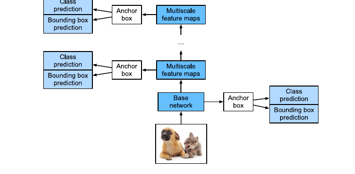

Model gồm một **base network** rồi vài **multiscale feature map blocks**:

- **Base network** trích xuất features từ ảnh nên có thể dùng CNN sâu. Bài báo SSD gốc dùng VGG cắt trước classification layer; ResNet cũng phổ biến. Thiết kế sao cho base network trả feature map **lớn**, nhờ đó sinh được nhiều anchor để bắt vật nhỏ.
- Mỗi **multiscale feature map block** giảm (thường là một nửa) chiều cao và rộng của feature map từ block trước, đồng thời **mở rộng receptive field** của mỗi unit trên ảnh gốc.

Nối lại với mục 14.5: các feature map càng gần đỉnh hình càng nhỏ nhưng receptive field càng rộng, nên **hợp để phát hiện ít vật hơn nhưng lớn hơn**.

**Class Prediction Layer.** Gọi $q$ là số lớp vật, vậy mỗi anchor có $q+1$ lớp (lớp 0 là background). Ở một scale, feature map có kích thước $h \times w$ và mỗi vị trí sinh $a$ anchor, tức cần phân loại $hwa$ anchor. Dùng fully connected layer cho ngần ấy anchor là **bất khả thi** vì số tham số quá lớn.

Thủ thuật (mượn từ mục 8.3 — NiN): **dùng channel của convolutional layer để mã hoá dự đoán**. Class prediction layer là một convolution **không đổi** chiều cao và rộng, nên output và input tương ứng **một–một theo vị trí không gian**. Cần $a(q+1)$ channel output, trong đó kênh chỉ số $i(q+1)+j$ mang dự đoán lớp $j$ ($0 \le j \le q$) cho anchor $i$ ($0 \le i < a$).

```python
def cls_predictor(num_inputs, num_anchors, num_classes):
    """Conv 3×3 padding 1: giữ nguyên H, W; chỉ channel mang dự đoán class."""
    return nn.Conv2d(num_inputs, num_anchors * (num_classes + 1),
                     kernel_size=3, padding=1)


def bbox_predictor(num_inputs, num_anchors):
    """Giống hệt, chỉ khác mỗi anchor cần 4 offset thay vì q+1 class."""
    return nn.Conv2d(num_inputs, num_anchors * 4, kernel_size=3, padding=1)
```

**Concatenating Predictions for Multiple Scales.** Ở các scale khác nhau, feature map có shape khác nhau và số anchor mỗi vị trí cũng có thể khác, nên các output dự đoán có shape khác nhau. Phải gộp chúng lại.

Ví dụ của sách: `Y1` và `Y2` với $q = 10$, 5 anchor mỗi vị trí ở `Y1` và 3 ở `Y2`. Số channel là $5 \times 11 = 55$ và $3 \times 11 = 33$.

```python
def flatten_pred(pred):
    # permute đưa channel ra trong cùng vì channel giữ dự đoán của các anchor
    # cùng tâm — phải để chúng nằm liền nhau trước khi trải phẳng.
    return torch.flatten(pred.permute(0, 2, 3, 1), start_dim=1)


def concat_preds(preds):
    return torch.cat([flatten_pred(p) for p in preds], dim=1)


concat_preds([Y1, Y2]).shape      # torch.Size([2, 25300])
```

Chi tiết dễ bỏ qua nhưng quan trọng: **`permute` trước `flatten`**. Nếu trải phẳng trực tiếp, các giá trị của cùng một anchor sẽ nằm rải rác; sau khi đưa channel vào trong cùng, mỗi anchor chiếm một khối liên tục.

**Downsampling Block.** Áp dụng thiết kế VGG block (mục 8.2.1): hai convolution $3\times3$ padding 1, rồi max-pooling $2\times2$ stride 2.

```python
def down_sample_blk(in_channels, out_channels):
    blk = []
    for _ in range(2):
        blk.append(nn.Conv2d(in_channels, out_channels, kernel_size=3, padding=1))
        blk.append(nn.BatchNorm2d(out_channels))
        blk.append(nn.ReLU())
        in_channels = out_channels
    blk.append(nn.MaxPool2d(2))        # giảm một nửa H và W
    return nn.Sequential(*blk)
```

Sách tính receptive field rất gọn: $1 \times 2 + (3-1) + (3-1) = 6$, nên mỗi unit ở output nhìn thấy vùng $6\times6$ trên input. Vậy downsampling block **mở rộng receptive field** — đúng thứ ta cần cho multiscale.

**Base Network Block và model đầy đủ.** Base network gồm ba downsampling block nhân đôi số channel mỗi lần; với ảnh $256\times256$ nó cho feature map $32\times32$ (vì $256/2^3 = 32$).

Model đầy đủ có **năm block**, mỗi block vừa sinh anchor vừa dự đoán class và offset cho chính các anchor đó:

| Block | Là gì | Feature map (input $256\times256$) |
|---|---|---|
| 1 | base network | $32 \times 32$ |
| 2–4 | downsampling blocks | $16\times16$, $8\times8$, $4\times4$ |
| 5 | global max-pooling | $1 \times 1$ |

Các scale được chọn tăng dần cho các block ngày càng nhỏ:

```python
sizes = [[0.2, 0.272], [0.37, 0.447], [0.54, 0.619],
         [0.71, 0.79], [0.88, 0.961]]
ratios = [[1, 2, 0.5]] * 5
num_anchors = len(sizes[0]) + len(ratios[0]) - 1      # 2 + 3 - 1 = 4
```

Đọc bảng `sizes` theo chiều dọc là thấy ngay ý đồ: block 1 (feature map lớn nhất, nhiều tâm nhất) dùng scale nhỏ nhất 0.2 để bắt vật nhỏ; block 5 (chỉ một tâm) dùng scale 0.88 để bắt vật gần bằng cả ảnh.

### 14.7.2 Training

Object detection có **hai loại loss** và tổng của chúng là loss của model:

1. **Loss cho class của anchor** — dùng lại cross-entropy như classification.
2. **Loss cho offset của anchor dương** (không phải background) — đây là bài toán hồi quy. Sách **không** dùng squared loss mà dùng **$\ell_1$ norm loss**, tức trị tuyệt đối của hiệu giữa dự đoán và ground-truth.

```python
cls_loss = nn.CrossEntropyLoss(reduction='none')
bbox_loss = nn.L1Loss(reduction='none')


def calc_loss(cls_preds, cls_labels, bbox_preds, bbox_labels, bbox_masks):
    batch_size, num_classes = cls_preds.shape[0], cls_preds.shape[2]
    cls = cls_loss(cls_preds.reshape(-1, num_classes),
                   cls_labels.reshape(-1)).reshape(batch_size, -1).mean(dim=1)
    # bbox_masks lọc bỏ anchor background và anchor đệm khỏi phép tính loss.
    bbox = bbox_loss(bbox_preds * bbox_masks,
                     bbox_labels * bbox_masks).mean(dim=1)
    return cls + bbox
```

Biến `bbox_masks` đáng chú ý: phần lớn anchor là background và **không có** ground-truth box để so, nên nếu tính loss cho chúng thì model bị kéo về những con số vô nghĩa. Mask nhân với 0 tại các anchor đó.

Để đánh giá, sách dùng accuracy cho phần class và **mean absolute error** cho phần box (khớp với việc dùng $\ell_1$ loss).

```python
device, net = d2l.try_gpu(), TinySSD(num_classes=1)
trainer = torch.optim.SGD(net.parameters(), lr=0.2, weight_decay=5e-4)
```

### 14.7.3 Prediction

Lúc dự đoán, quy trình đúng như mục 14.4: sinh anchor, dự đoán class và offset, áp `offset_inverse` để ra box, rồi chạy NMS để loại các box trùng lặp — cuối cùng chỉ giữ những box có confidence vượt ngưỡng.

### 14.7.4 Summary

- Single shot multibox detection là một model multiscale object detection. Qua base network và vài multiscale feature map blocks, nó sinh ra số lượng anchor boxes khác nhau với kích thước khác nhau, rồi phát hiện vật kích thước khác nhau bằng cách dự đoán class và offset của các anchor đó (và từ đó ra bounding boxes).
- Khi train model SSD, loss được tính dựa trên giá trị dự đoán và giá trị nhãn của class và offset của các anchor box.

### 14.7.5 Exercises

1. Bạn có cải thiện được single-shot multibox detection bằng cách cải thiện loss function không? Ví dụ, thay $\ell_1$ norm loss bằng **smooth $\ell_1$ norm loss** cho phần offset. Loss này dùng hàm bậc hai quanh 0 cho mượt, độ mượt do hyperparameter $\sigma$ điều khiển:

   $$
   f(x)=
   \begin{cases}
   \dfrac{(\sigma x)^2}{2}, & \text{nếu } |x| < \dfrac{1}{\sigma^2} \\[2mm]
   |x| - \dfrac{0.5}{\sigma^2}, & \text{ngược lại}
   \end{cases}
   $$

   Khi $\sigma$ rất lớn, loss này giống $\ell_1$ norm loss; khi $\sigma$ nhỏ hơn, loss mượt hơn.

2. Khi một anchor box không được gán ground-truth, ta gán nhãn background cho nó. Số anchor background thường áp đảo. Hãy tìm hiểu cách cân bằng lại, ví dụ bằng **focal loss**. *(Bài tập bổ sung của người biên soạn, dựa trên phần thảo luận của mục.)*

<details markdown="1"><summary>Gợi ý</summary>

Câu 1: hãy xét đạo hàm của $|x|$ tại $x = 0$ và hỏi điều gì xảy ra với gradient khi dự đoán gần đúng. Câu 2: nếu 99% ví dụ là background và model đoán “background” cho tất cả thì loss trung bình bằng bao nhiêu?
</details>

<details markdown="1"><summary>Lời giải</summary>

**Câu 1.** Có, và lý do nằm ở **đạo hàm**.

- $\ell_2$ (squared) loss có đạo hàm $2x$: khi sai số lớn, gradient lớn — một box lệch nhiều sẽ áp đảo cả batch. Đó là lý do sách tránh nó cho offset.
- $\ell_1$ loss có đạo hàm $\pm 1$ ở mọi nơi: bền với outlier, nhưng **không mượt tại 0**. Khi dự đoán đã gần đúng, gradient vẫn giữ nguyên độ lớn 1, làm quá trình dao động quanh nghiệm.
- **Smooth $\ell_1$** lấy phần tốt của cả hai: bậc hai gần 0 nên gradient **nhỏ dần** khi tiến tới nghiệm (hội tụ êm), tuyến tính ở xa nên vẫn bền với outlier.

Đọc công thức đề bài: $\sigma$ lớn thì ngưỡng $1/\sigma^2$ nhỏ, vùng bậc hai co lại, loss tiến về $\ell_1$ — đúng như đề nói.

**Câu 2.** Nếu 99% anchor là background, model đoán “background” cho tất cả đã đạt 99% accuracy và loss rất thấp, nên gradient gần như không đẩy model đi tìm vật. Đây là **class imbalance** nghiêm trọng.

Hai cách xử lý:

- **Hard negative mining** (cách của bài báo SSD gốc): sau khi tính loss, chỉ giữ lại các background có loss cao nhất sao cho tỉ lệ âm:dương khoảng 3:1, bỏ phần còn lại.
- **Focal loss**: nhân cross-entropy với hệ số $(1 - p_t)^\gamma$, trong đó $p_t$ là xác suất model gán cho lớp đúng. Ví dụ dễ (background mà model đã rất chắc chắn) có $p_t \approx 1$ nên hệ số $\approx 0$ — đóng góp của chúng **bị dập tự động**, còn ví dụ khó vẫn giữ nguyên trọng số.

**Bẫy thường gặp:** chỉ nhìn classification accuracy của detector. Với dữ liệu lệch như thế, accuracy gần như luôn đẹp kể cả khi model chẳng phát hiện được gì.
</details>

<!-- pagebreak -->

## 14.8 Region-based CNNs (R-CNNs)

### Trực giác

SSD đi theo triết lý “một lần chạy, đoán hết”. Họ R-CNN đi theo triết lý ngược lại: **trước hết đề xuất vài vùng đáng ngờ, rồi mới xem kỹ từng vùng**. Mục này theo dấu bốn model kế tiếp nhau, và điều đáng học nhất là **mỗi bước cải tiến đều xoá đúng một nút thắt của bước trước**.

### 14.8.1 R-CNNs

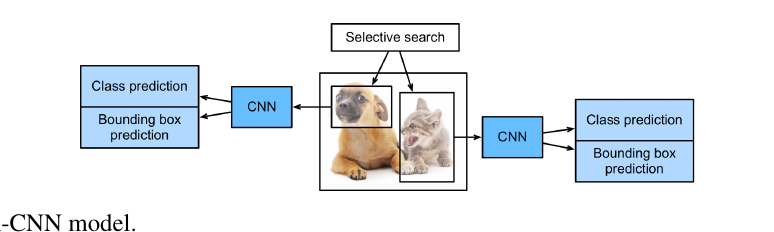

<div class="algorithm-block" markdown="1">
<p class="algorithm-label">LUỒNG THUẬT TOÁN · R-CNN (4 BƯỚC)</p>

1. Chạy **selective search** để trích nhiều region proposals chất lượng cao trên ảnh input (Uijlings và cộng sự, 2013). Các vùng đề xuất này thường được chọn ở nhiều scale với hình dạng và kích thước khác nhau. Mỗi region proposal được gán một class và một ground-truth bounding box.
2. Chọn một CNN đã pretrained và **cắt bỏ phần trước output layer**. Resize mỗi region proposal về kích thước input mà network yêu cầu, rồi lan truyền xuôi để lấy features của vùng đó.
3. Lấy features và class label của mỗi region proposal làm một ví dụ. Train **nhiều support vector machine** để phân loại vật, mỗi SVM quyết định riêng xem ví dụ có chứa một lớp cụ thể hay không.
4. Lấy features và bounding box label của mỗi region proposal làm một ví dụ. Train một **linear regression model** để dự đoán ground-truth bounding box.

</div>

**Nút thắt:** R-CNN dùng CNN pretrained để trích features rất hiệu quả, nhưng **chậm**. Hãy hình dung chọn hàng nghìn region proposal từ một ảnh: cần hàng nghìn lượt lan truyền xuôi của CNN chỉ để phát hiện vật trong **một** ảnh. Khối lượng tính toán khổng lồ đó khiến R-CNN không dùng được rộng rãi trong thực tế.

### 14.8.2 Fast R-CNN

**Vấn đề được sửa:** các region proposal thường chồng lấn nhau, nên trích features độc lập cho từng vùng là **tính đi tính lại**. Cải tiến chính của fast R-CNN: **chỉ lan truyền xuôi CNN một lần trên toàn bộ ảnh**.

Các bước chính:

1. Input của CNN là **toàn ảnh**, không phải từng region proposal, và CNN này train được. Với ảnh input, gọi shape output của CNN là $1 \times c \times h_1 \times w_1$.
2. Giả sử selective search sinh $n$ region proposal. Các vùng này (hình dạng khác nhau) đánh dấu các *regions of interest* trên output của CNN. Những vùng quan tâm đó cần được trích thành features **cùng shape** (giả sử cao $h_2$, rộng $w_2$) để dễ ghép lại. Để làm được, fast R-CNN đưa vào layer {{term:roi-pooling|region of interest (RoI) pooling}}: nhận vào output CNN và các region proposal, trả ra features ghép lại có shape $n \times c \times h_2 \times w_2$.
3. Một fully connected layer biến features ghép đó thành output shape $n \times d$, với $d$ tuỳ thiết kế model.
4. Dự đoán class và bounding box cho từng region proposal: biến output của fully connected layer thành output shape $n \times q$ ($q$ là số lớp) và $n \times 4$. Phần class dùng softmax regression.

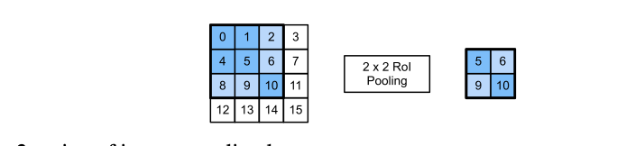

**RoI pooling khác pooling thường ở chỗ nào?** Ở pooling thường (mục 7.5), ta chỉ **gián tiếp** điều khiển shape output qua kích thước cửa sổ, padding và stride. Ở RoI pooling, ta **chỉ định thẳng shape output**.

Cách hoạt động: với vùng quan tâm shape $h \times w$ và output mong muốn $h_2 \times w_2$, chia cửa sổ thành lưới $h_2 \times w_2$ subwindow, mỗi subwindow có kích thước xấp xỉ $(h/h_2) \times (w/w_2)$. Thực tế chiều cao và rộng của subwindow được **làm tròn lên**, và **phần tử lớn nhất** trong subwindow là output. Nhờ đó RoI pooling trích được features cùng shape ngay cả khi các vùng quan tâm có shape khác nhau.

**Ví dụ tính tay (theo hình).** Trên input $4\times4$, chọn vùng quan tâm $3\times3$ ở góc trên-trái, dùng RoI pooling $2\times2$:

| Subwindow | Các phần tử | Max |
|---|---|---|
| trên-trái | 0, 1, 4, 5 | **5** |
| trên-phải | 2, 6 | **6** |
| dưới-trái | 8, 9 | **9** |
| dưới-phải | 10 | **10** |

Output là $\begin{pmatrix} 5 & 6 \\ 9 & 10\end{pmatrix}$. Chú ý các subwindow **không bằng nhau** — chia 3 cho 2 không chẵn, nên phải làm tròn.

### 14.8.3 Faster R-CNN

**Vấn đề được sửa:** để chính xác, fast R-CNN vẫn phải sinh **rất nhiều** region proposal bằng selective search — một thuật toán thủ công, không học được. Faster R-CNN thay selective search bằng một {{term:region-proposal-network|region proposal network}} (RPN).

So với fast R-CNN, faster R-CNN **chỉ đổi cách sinh region proposal**; phần còn lại giữ nguyên. RPN làm việc theo các bước:

1. Dùng convolution $3\times3$ padding 1 biến output CNN thành output mới có $c$ channel. Nhờ vậy mỗi unit dọc theo chiều không gian của feature maps nhận một feature vector độ dài $c$.
2. Lấy mỗi pixel của feature maps làm tâm, sinh nhiều anchor box với scale và aspect ratio khác nhau, rồi gán nhãn cho chúng.
3. Dùng feature vector độ dài $c$ tại tâm mỗi anchor để dự đoán **class nhị phân** (background hay vật) và bounding box cho anchor đó.
4. Xét các box dự đoán có class là “vật”. Loại các kết quả chồng lấn bằng non-maximum suppression. Những box còn lại chính là region proposals mà RoI pooling layer cần.

Điểm quan trọng nhất: RPN là **một phần của model** và được train **chung** với phần còn lại. Nói cách khác, hàm mục tiêu của faster R-CNN không chỉ gồm dự đoán class và bounding box của detection, mà còn gồm dự đoán nhị phân và bounding box của anchor trong RPN. Nhờ train end-to-end, RPN **học được cách sinh region proposal chất lượng cao**, nên vẫn chính xác dù số lượng proposal giảm đi.

### 14.8.4 Mask R-CNN

**Vấn đề được sửa:** nếu tập training còn gán nhãn **ở mức pixel** cho vật, mask R-CNN tận dụng được nhãn chi tiết đó để cải thiện thêm độ chính xác.

Mask R-CNN sửa từ faster R-CNN với hai thay đổi:

- Thay RoI pooling bằng layer **region of interest (RoI) alignment**. Layer này dùng {{term:bilinear-interpolation|bilinear interpolation}} để **giữ lại thông tin không gian** trên feature maps — phù hợp hơn cho dự đoán ở mức pixel. (Nhớ lại RoI pooling phải làm tròn biên subwindow; chính phép làm tròn đó làm lệch vị trí, điều không chấp nhận được khi nhãn là từng pixel.)
- Thêm một {{term:fully-convolutional-network|fully convolutional network}} để dự đoán **vị trí mức pixel** của vật, bên cạnh class và bounding box.

### 14.8.5 Summary

- R-CNN trích nhiều region proposals từ ảnh input, dùng CNN lan truyền xuôi trên **từng** region proposal để trích features, rồi dùng features đó dự đoán class và bounding box của vùng.
- Cải tiến lớn của fast R-CNN so với R-CNN là CNN chỉ lan truyền xuôi **trên toàn ảnh**. Nó cũng đưa vào RoI pooling layer để trích features cùng shape cho các vùng quan tâm có shape khác nhau.
- Faster R-CNN thay selective search của fast R-CNN bằng một region proposal network được **train chung**, nhờ đó vẫn chính xác với số region proposal ít hơn.
- Dựa trên faster R-CNN, mask R-CNN thêm một fully convolutional network để tận dụng nhãn mức pixel, cải thiện thêm độ chính xác của object detection.

### 14.8.6 Exercises

1. Ta có thể đặt object detection thành **một bài toán hồi quy duy nhất** — ví dụ dự đoán bounding boxes và xác suất class — được không? Bạn có thể tham khảo thiết kế của model YOLO (Redmon và cộng sự, 2016).
2. So sánh single shot multibox detection với các phương pháp giới thiệu trong mục này. Khác biệt chính của chúng là gì? Bạn có thể tham khảo Figure 2 của Zhao và cộng sự (2019).

<details markdown="1"><summary>Gợi ý</summary>

Câu 1: SSD đã đi gần tới đó rồi — hãy hỏi phần nào của SSD vẫn còn mang tính “phân loại từng ứng viên”. Câu 2: đếm số lần ảnh đi qua network trong mỗi họ model.
</details>

<details markdown="1"><summary>Lời giải</summary>

**Câu 1.** Được, và đó chính là ý tưởng của YOLO. YOLO chia ảnh thành lưới $S \times S$; mỗi ô **trực tiếp hồi quy** ra một số bounding box kèm điểm tin cậy và một phân bố xác suất trên các lớp. Không có giai đoạn đề xuất vùng, không có bước phân loại từng ứng viên riêng — toàn bộ là một lần chạy xuôi cho ra một tensor cố định.

Đánh đổi: định dạng output cố định giới hạn số vật mỗi ô, nên các phiên bản YOLO đầu gặp khó với vật nhỏ nằm sát nhau. Đổi lại, tốc độ đủ nhanh cho ứng dụng thời gian thực.

**Câu 2.** Khác biệt cốt lõi là **một giai đoạn hay hai giai đoạn**:

| | SSD / YOLO (one-stage) | R-CNN family (two-stage) |
|---|---|---|
| Ứng viên | anchor cố định rải sẵn theo lưới | region proposals (selective search hoặc RPN) |
| Số lần chạy network | một lần xuôi | trích features một lần + một head cho mỗi proposal |
| Phân loại | trực tiếp trên feature map | sau khi RoI pooling/align |
| Tốc độ | nhanh hơn | chậm hơn |
| Độ chính xác | thường thấp hơn, nhất là với vật nhỏ | thường cao hơn |
| Vì sao | không có bước tinh lọc ứng viên; mất cân bằng lớp nặng | RPN đã lọc bớt nền trước khi phân loại |

Cách nhớ: two-stage bỏ công **lọc trước rồi mới xem kỹ**; one-stage **xem hết cùng lúc**. Lọc trước cho độ chính xác; xem hết cùng lúc cho tốc độ.

**Bẫy thường gặp:** coi one-stage luôn kém chính xác. Với focal loss và feature pyramid, khoảng cách đó đã thu hẹp rất nhiều — bảng trên mô tả các thế hệ model trong sách, không phải một quy luật vĩnh viễn.
</details>

<!-- pagebreak -->

## 14.9 Semantic Segmentation and the Dataset

### Trực giác

Từ mục 14.3 đến 14.8, ta dùng **hình chữ nhật** để mô tả vật. Nhưng con chó không phải hình chữ nhật: một box quanh con chó vẫn chứa rất nhiều pixel nền. {{term:semantic-segmentation|Semantic segmentation}} bỏ hẳn hình chữ nhật và hỏi câu hỏi mịn nhất có thể: **pixel này thuộc lớp nào?**

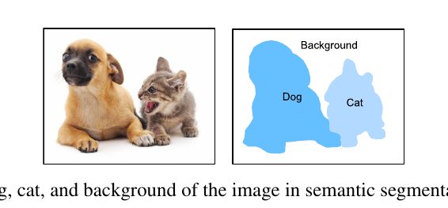

So với object detection, ranh giới được gán nhãn ở mức pixel rõ ràng **mịn hơn hẳn**.

### 14.9.1 Image Segmentation and Instance Segmentation

Có hai nhiệm vụ nghe rất giống nhưng khác về bản chất. Sách phân biệt như sau:

**{{term:image-segmentation|Image segmentation}}** chia ảnh thành vài vùng cấu thành. Các phương pháp cho bài toán này thường khai thác **tương quan giữa các pixel**; nó **không cần** nhãn pixel khi training, và **không đảm bảo** các vùng phân ra sẽ mang đúng ngữ nghĩa ta mong muốn khi dự đoán. Lấy ảnh trên làm input, image segmentation có thể chia con chó thành hai vùng: một vùng phủ mõm và mắt chủ yếu màu đen, vùng kia phủ phần thân còn lại chủ yếu màu vàng.

**{{term:instance-segmentation|Instance segmentation}}** còn gọi là *simultaneous detection and segmentation*. Nó nghiên cứu cách nhận ra vùng mức pixel của **từng cá thể vật** trong ảnh. Khác semantic segmentation, instance segmentation phải phân biệt không chỉ ngữ nghĩa mà cả các cá thể khác nhau. Ví dụ nếu ảnh có **hai** con chó, instance segmentation phải nói được một pixel thuộc con chó **nào**.

Bảng đối chiếu ba khái niệm:

| Nhiệm vụ | Cần nhãn pixel khi train? | Phân biệt hai con chó? | Kết quả có đảm bảo mang ngữ nghĩa? |
|---|---|---|---|
| Image segmentation | không | không | **không** |
| Semantic segmentation | có | không | có |
| Instance segmentation | có | **có** | có |

### 14.9.2 The Pascal VOC2012 Semantic Segmentation Dataset

Một trong những dataset semantic segmentation quan trọng nhất là **Pascal VOC2012**. File tar khoảng 2 GB.

Cấu trúc thư mục nói lên cách dữ liệu được tổ chức:

- `ImageSets/Segmentation` — các file text chỉ định mẫu train và test;
- `JPEGImages` — ảnh input;
- `SegmentationClass` — **nhãn, cũng ở dạng ảnh**, cùng kích thước với ảnh input mà nó gán nhãn.

Đây là điểm đặc trưng của segmentation: **nhãn là một tấm ảnh**. Các pixel cùng màu trong ảnh nhãn thuộc cùng một lớp ngữ nghĩa. Trong ảnh nhãn, **trắng là biên** và **đen là nền**, các màu khác ứng với các lớp khác nhau.

Dataset có **21 lớp** (gồm background), và sách liệt kê đầy đủ bảng màu RGB kèm tên lớp:

```python
#@save
VOC_CLASSES = ['background', 'aeroplane', 'bicycle', 'bird', 'boat',
               'bottle', 'bus', 'car', 'cat', 'chair', 'cow',
               'diningtable', 'dog', 'horse', 'motorbike', 'person',
               'potted plant', 'sheep', 'sofa', 'train', 'tv/monitor']
```

Vì nhãn là màu RGB chứ không phải chỉ số lớp, cần một bảng tra để đổi màu thành chỉ số:

```python
#@save
def voc_colormap2label():
    """Dựng ánh xạ từ giá trị RGB sang chỉ số lớp cho nhãn VOC."""
    colormap2label = torch.zeros(256 ** 3, dtype=torch.long)
    for i, colormap in enumerate(VOC_COLORMAP):
        # Nén 3 byte RGB thành một số nguyên duy nhất để tra bảng cho nhanh.
        colormap2label[
            (colormap[0] * 256 + colormap[1]) * 256 + colormap[2]] = i
    return colormap2label
```

**Vì sao phải cắt ảnh chứ không co giãn?** Đây là ý quan trọng nhất của mục. Trong image classification, ta **rescale** ảnh về shape mà model yêu cầu. Trong semantic segmentation, làm vậy đòi hỏi phải rescale **các lớp pixel dự đoán ngược về shape gốc** của ảnh input — và phép rescale ngược đó có thể **thiếu chính xác**, đặc biệt ở các vùng phân đoạn thuộc lớp khác nhau. Lý do là nội suy giữa hai pixel thuộc hai lớp sẽ tạo ra những giá trị trung gian chẳng ứng với lớp nào.

Để tránh, sách **cắt ảnh về shape cố định** thay vì co giãn. Cụ thể, dùng random cropping từ image augmentation và **cắt đúng cùng một vùng trên cả ảnh input lẫn nhãn**:

```python
#@save
def voc_rand_crop(feature, label, height, width):
    """Cắt ngẫu nhiên cả ảnh feature lẫn ảnh label tại CÙNG một vùng."""
    rect = torchvision.transforms.RandomCrop.get_params(
        feature, (height, width))
    feature = torchvision.transforms.functional.crop(feature, *rect)
    label = torchvision.transforms.functional.crop(label, *rect)
    return feature, label
```

Chú ý `get_params` được gọi **một lần** rồi dùng cho cả hai ảnh. Nếu gọi `RandomCrop` riêng cho từng ảnh, ảnh và nhãn sẽ lệch nhau — một lỗi âm thầm và rất khó phát hiện.

Vì một số ảnh trong dataset nhỏ hơn kích thước cắt, chúng bị lọc bỏ bằng một hàm `filter` riêng trong lớp `VOCSegDataset`.

### 14.9.3 Summary

- Semantic segmentation nhận ra và hiểu nội dung ảnh **ở mức pixel** bằng cách chia ảnh thành các vùng thuộc những lớp ngữ nghĩa khác nhau.
- Một trong những dataset semantic segmentation quan trọng nhất là Pascal VOC2012.
- Trong semantic segmentation, vì ảnh input và nhãn tương ứng **một–một trên từng pixel**, ảnh input được **cắt ngẫu nhiên** về shape cố định thay vì co giãn.

### 14.9.4 Exercises

1. Semantic segmentation có thể áp dụng thế nào trong xe tự lái và chẩn đoán hình ảnh y tế? Bạn nghĩ ra được ứng dụng nào khác không?
2. Nhớ lại các mô tả về data augmentation ở mục 14.1. Trong những phép augmentation dùng cho image classification, phép nào **không khả thi** khi áp dụng cho semantic segmentation?

<details markdown="1"><summary>Gợi ý</summary>

Câu 2: chia các phép augmentation thành hai nhóm — nhóm đổi **hình học** và nhóm đổi **màu**. Với mỗi nhóm, hỏi ảnh nhãn phải được xử lý thế nào, và phép nội suy nào là hợp lệ trên ảnh nhãn.
</details>

<details markdown="1"><summary>Lời giải</summary>

**Câu 1.** Trong xe tự lái: phân biệt mặt đường đi được với lề đường, vạch kẻ, người đi bộ — những ranh giới mà bounding box không mô tả nổi vì đường có hình dạng bất kỳ. Trong y tế: khoanh vùng khối u hoặc cơ quan trên ảnh CT/MRI, nơi **diện tích và hình dạng chính xác** mới là thứ bác sĩ cần, không phải một hình chữ nhật.

Ứng dụng khác: ảnh vệ tinh (phân loại sử dụng đất, theo dõi phá rừng), nông nghiệp (tách cây trồng khỏi cỏ dại để phun thuốc cục bộ), tách nền trong hội nghị video, và kiểm tra chất lượng công nghiệp (khoanh chính xác vết nứt trên bề mặt).

**Câu 2.** Câu trả lời tách làm hai nhóm rõ rệt:

**Vẫn khả thi nhưng phải áp song song lên nhãn** (phép hình học): lật ngang, lật dọc, xoay, cắt. Điều kiện bắt buộc là nhãn phải chịu **đúng** phép biến đổi đó — chính là lý do `voc_rand_crop` gọi `get_params` một lần dùng cho cả hai ảnh. Thêm một điều kiện kỹ thuật: khi phép biến đổi cần nội suy (xoay, scale), ảnh nhãn phải dùng **nearest-neighbour**, tuyệt đối không dùng bilinear — nội suy giữa lớp 3 và lớp 5 cho ra 4, một lớp hoàn toàn khác.

**Khả thi và dễ hơn** (phép màu): `ColorJitter` chỉnh brightness, contrast, saturation, hue chỉ tác động lên ảnh input, **nhãn giữ nguyên**. Nhóm này an toàn nhất.

**Không khả thi theo cách của classification:** `RandomResizedCrop`. Nó cắt rồi **co giãn** về kích thước cố định, mà mục 14.9.2 vừa giải thích rõ tại sao rescale là vấn đề. Đó chính là lý do sách thay nó bằng `voc_rand_crop` — cắt thuần tuý, không co giãn.

**Bẫy thường gặp:** áp augmentation lên ảnh và nhãn bằng hai lời gọi ngẫu nhiên riêng biệt. Training vẫn chạy, loss vẫn giảm chút ít, nhưng model học từ nhãn lệch và kết quả không bao giờ tốt.
</details>

<!-- pagebreak -->

## 14.10 Transposed Convolution

### Trực giác

Có một vấn đề kiến trúc cần giải trước khi làm được semantic segmentation. Mọi layer CNN đã học — convolution (mục 7.2) và pooling (mục 7.5) — đều **giảm** hoặc giữ nguyên chiều không gian. Nhưng segmentation cần output **cùng kích thước** với input, để channel tại một pixel output chứa kết quả phân loại cho pixel input ở đúng vị trí đó.

Vậy ta cần một loại layer **tăng** (upsample) chiều không gian. Đó là {{term:transposed-convolution|transposed convolution}}, còn gọi là *fractionally-strided convolution*.

### 14.10.1 Basic Operation

Tạm bỏ qua channel. Cho input $n_h \times n_w$ và kernel $k_h \times k_w$, với stride 1 và không padding:

<div class="algorithm-block" markdown="1">
<p class="algorithm-label">LUỒNG THUẬT TOÁN · TRANSPOSED CONVOLUTION CƠ BẢN</p>

1. Trượt cửa sổ kernel với stride 1, $n_h$ lần theo mỗi hàng và $n_w$ lần theo mỗi cột, cho tổng cộng $n_h n_w$ **kết quả trung gian**.
2. Mỗi kết quả trung gian là một tensor $(n_h + k_h - 1) \times (n_w + k_w - 1)$ **khởi tạo toàn số 0**.
3. Để tính mỗi tensor trung gian, **mỗi phần tử của input được nhân với kernel**, và tensor $k_h \times k_w$ thu được thay thế một phần của tensor trung gian. Vị trí phần được thay tương ứng với vị trí của phần tử input đã dùng để tính.
4. Cuối cùng, **cộng tất cả** các kết quả trung gian lại để ra output.

</div>

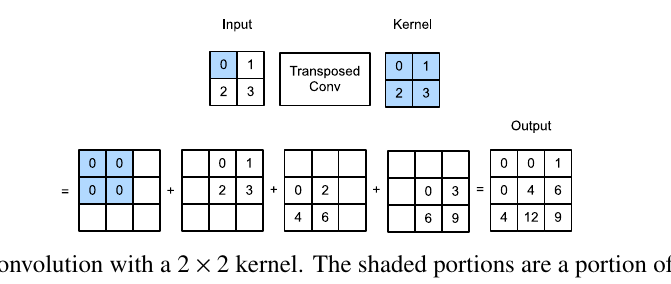

```python
def trans_conv(X, K):
    h, w = K.shape
    Y = torch.zeros((X.shape[0] + h - 1, X.shape[1] + w - 1))
    for i in range(X.shape[0]):
        for j in range(X.shape[1]):
            # Từng phần tử input "phát" kernel ra một vùng của output rồi cộng dồn.
            Y[i: i + h, j: j + w] += X[i, j] * K
    return Y
```

**Câu so sánh đáng nhớ nhất của mục này:** khác với convolution thường (mục 7.2) **thu gọn** (reduce) các phần tử input qua kernel, transposed convolution **phát tán** (broadcast) các phần tử input qua kernel, nên output **lớn hơn** input.

**Ví dụ tính tay.** Với $X = \begin{pmatrix}0 & 1\\ 2 & 3\end{pmatrix}$ và $K = \begin{pmatrix}0 & 1\\ 2 & 3\end{pmatrix}$, output là $3 \times 3$:

- $X_{00}=0$: đóng góp $0 \cdot K$ vào vùng hàng 0–1, cột 0–1 → toàn 0.
- $X_{01}=1$: đóng góp $1 \cdot K$ vào hàng 0–1, cột 1–2.
- $X_{10}=2$: đóng góp $2 \cdot K$ vào hàng 1–2, cột 0–1.
- $X_{11}=3$: đóng góp $3 \cdot K$ vào hàng 1–2, cột 1–2.

Cộng lại cho `tensor([[0., 0., 1.], [0., 4., 6.], [4., 12., 9.]])` — đúng kết quả sách in ra. Ô giữa nhận đóng góp từ cả bốn phần tử input, ô góc chỉ nhận từ một.

Với tensor 4 chiều, dùng API sẵn có:

```python
X, K = X.reshape(1, 1, 2, 2), K.reshape(1, 1, 2, 2)
tconv = nn.ConvTranspose2d(1, 1, kernel_size=2, bias=False)
tconv.weight.data = K
tconv(X)                     # cho cùng kết quả như trans_conv
```

### 14.10.2 Padding, Strides, and Multiple Channels

Đây là chỗ dễ nhầm nhất, vì mọi thứ đều **đảo ngược** so với convolution thường:

| | Convolution thường | Transposed convolution |
|---|---|---|
| **Padding** | áp lên **input** (thêm viền số 0) | áp lên **output** (bớt viền đi) |
| **Stride** | bước trượt trên **input** | bước trượt trên **kết quả trung gian**, tức trên output |

Cụ thể, đặt padding bằng 1 ở cả hai phía của chiều cao và rộng thì **hàng và cột đầu tiên cùng cuối cùng bị xoá khỏi output** của transposed convolution.

```python
tconv = nn.ConvTranspose2d(1, 1, kernel_size=2, padding=1, bias=False)
tconv.weight.data = K
tconv(X)                     # tensor([[[[4.]]]]) — chỉ còn ô giữa của 3×3
```

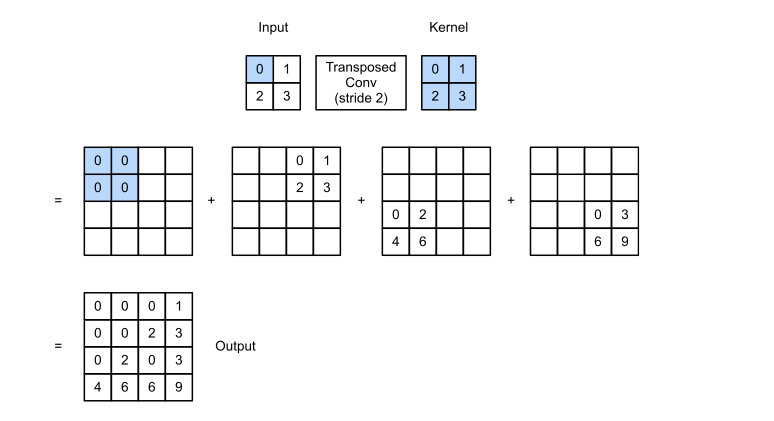

Đổi stride từ 1 thành 2 làm **tăng** chiều cao và rộng của các tensor trung gian, nên output cũng to ra:

```python
tconv = nn.ConvTranspose2d(1, 1, kernel_size=2, stride=2, bias=False)
tconv.weight.data = K
tconv(X).shape               # torch.Size([1, 1, 4, 4]) thay vì 3×3
```

**Multiple channels** hoạt động y như convolution thường: input có $c_i$ channel thì transposed convolution gán một kernel $k_h \times k_w$ cho mỗi input channel; khi có nhiều output channel, mỗi output channel có một kernel $c_i \times k_h \times k_w$.

Và đây là tính chất then chốt cho FCN ở mục sau:

> Nếu đưa $\mathsf{X}$ vào convolutional layer $f$ để ra $\mathsf{Y}=f(\mathsf{X})$, rồi tạo một transposed convolutional layer $g$ với **cùng hyperparameters** như $f$ ngoại trừ số output channel bằng số channel của $\mathsf{X}$, thì $g(\mathsf{Y})$ sẽ có **cùng shape** với $\mathsf{X}$.

```python
X = torch.rand(size=(1, 10, 16, 16))
conv = nn.Conv2d(10, 20, kernel_size=5, padding=2, stride=3)
tconv = nn.ConvTranspose2d(20, 10, kernel_size=5, padding=2, stride=3)
tconv(conv(X)).shape == X.shape          # True
```

### 14.10.3 Connection to Matrix Transposition

Tên gọi “transposed” đến từ **phép chuyển vị ma trận**. Ý tưởng: mọi convolution đều viết lại được thành một phép nhân ma trận.

Với input $\mathsf{X}$ $3\times3$ và kernel $\mathsf{K}$ $2\times2$, `corr2d` cho output $\mathsf{Y}$ $2\times2$. Ta viết lại $\mathsf{K}$ thành một **ma trận trọng số thưa** $W$ kích thước $4 \times 9$ chứa rất nhiều số 0. Khi đó convolution chính là $\mathbf{y} = W\mathbf{x}$, với $\mathbf{x}$ là $\mathsf{X}$ trải phẳng (9 phần tử) và $\mathbf{y}$ là $\mathsf{Y}$ trải phẳng (4 phần tử).

Transposed convolution thì dùng **$W^\top$**: $\mathbf{z} = W^\top \mathbf{y}$, đưa 4 phần tử trở lại 9 phần tử.

Nói theo cách của sách: transposed convolutional layer chỉ đơn giản là **hoán đổi hàm lan truyền xuôi và hàm lan truyền ngược** của convolutional layer. Điều này giải thích luôn vì sao shape khớp nhau: lan truyền ngược của một phép biến đổi tuyến tính bao giờ cũng đưa ta từ shape output về shape input.

### 14.10.4 Summary

- Khác với convolution thường **thu gọn** các phần tử input qua kernel, transposed convolution **phát tán** các phần tử input qua kernel, nên output lớn hơn input.
- Nếu đưa $\mathsf{X}$ vào convolutional layer $f$ để ra $\mathsf{Y}=f(\mathsf{X})$ và tạo transposed convolutional layer $g$ cùng hyperparameters với $f$ ngoại trừ số output channel bằng số channel của $\mathsf{X}$, thì $g(\mathsf{Y})$ có cùng shape với $\mathsf{X}$.
- Ta có thể hiện thực convolution bằng phép nhân ma trận. Transposed convolutional layer chỉ hoán đổi hàm lan truyền xuôi với hàm lan truyền ngược của convolutional layer.

### 14.10.5 Exercises

1. Ở mục 14.10.3, input `X` của convolution và output `Z` của transposed convolution có **cùng shape**. Chúng có **cùng giá trị** không? Vì sao?
2. Dùng phép nhân ma trận để hiện thực convolution có hiệu quả không? Vì sao?

<details markdown="1"><summary>Gợi ý</summary>

Câu 1: nếu $W$ không vuông, $W^\top W$ có bằng ma trận đơn vị không? Hãy thử với một ví dụ một chiều rất nhỏ. Câu 2: đếm số phần tử **khác 0** trong ma trận $4 \times 9$ và so với tổng số ô của nó.
</details>

<details markdown="1"><summary>Lời giải</summary>

**Câu 1.** **Không.** Shape giống nhau nhưng giá trị khác nhau.

Lý do nằm ở đại số tuyến tính: convolution là $\mathbf{y} = W\mathbf{x}$ với $W$ kích thước $4\times9$, transposed convolution là $\mathbf{z} = W^\top\mathbf{y} = W^\top W \mathbf{x}$. Để $\mathbf{z} = \mathbf{x}$ ta cần $W^\top W = I_9$. Nhưng $W$ có hạng nhiều nhất là 4, nên $W^\top W$ là ma trận $9 \times 9$ hạng $\le 4$ — **không thể** là ma trận đơn vị.

Nói bằng lời: convolution từ 9 số xuống 4 số đã **mất thông tin**. Transposed convolution là *chuyển vị*, không phải *nghịch đảo*; nó khôi phục **shape**, không khôi phục **nội dung**. Đây là lý do một FCN phải **học** trọng số của transposed convolution chứ không thể dùng nó như một phép đảo ngược sẵn có.

**Câu 2.** Không hiệu quả về bộ nhớ, dù đúng về mặt toán học.

Trong ví dụ trên, $W$ có $4 \times 9 = 36$ ô nhưng chỉ $4 \times 4 = 16$ ô khác 0 — đã lãng phí hơn một nửa. Và tỉ lệ này **xấu đi rất nhanh** theo kích thước: với ảnh $n \times n$ và kernel $k \times k$, ma trận có cỡ $n^2 \times n^2$ phần tử trong khi mỗi hàng chỉ có $k^2$ giá trị khác 0. Với ảnh $224\times224$, đó là ma trận hơn 2,5 tỉ ô để chứa vài chục nghìn con số thật.

Hiện thực thực tế không dựng ma trận đó mà dùng trực tiếp phép trượt cửa sổ, hoặc thủ thuật `im2col` (trải các mảnh input thành cột rồi nhân với kernel đã trải phẳng) — cách này vẫn tận dụng được thư viện nhân ma trận tối ưu mà không phải lưu ma trận thưa khổng lồ.

**Bẫy thường gặp:** gọi transposed convolution là “deconvolution” rồi tưởng nó đảo ngược được convolution. Nó không đảo ngược; đó chính là nội dung câu 1.
</details>

<!-- pagebreak -->

## 14.11 Fully Convolutional Networks

### Trực giác

Giờ ta có đủ hai mảnh: CNN để trích features (chiều không gian **giảm**), và transposed convolution để upsample (chiều không gian **tăng**). Ghép lại thành một {{term:fully-convolutional-network|fully convolutional network}} (FCN) — mạng biến pixel ảnh thành lớp của pixel (Long và cộng sự, 2015).

Khác với CNN cho classification hay detection, FCN **đưa chiều cao và rộng của feature maps trung gian trở về đúng kích thước ảnh input**. Nhờ đó output phân loại và ảnh input tương ứng **một–một ở mức pixel**: chiều channel tại bất kỳ pixel output nào chứa kết quả phân loại cho pixel input ở cùng vị trí.

### 14.11.1 The Model

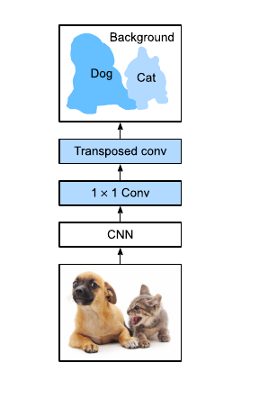

Ba bước, đọc thẳng từ hình:

1. **CNN trích features ảnh.**
2. **Convolution $1\times1$** biến số channel thành **số lớp**.
3. **Transposed convolution** đưa chiều cao và rộng của feature maps về đúng chiều cao và rộng của ảnh input.

Sách dùng ResNet-18 pretrained trên ImageNet. Vài layer cuối của model này gồm global average pooling và một fully connected layer — **không cần** trong FCN nên bị bỏ đi:

```python
pretrained_net = torchvision.models.resnet18(pretrained=True)
# Bỏ hai layer cuối (global avg pool và fc), giữ phần trích features.
net = nn.Sequential(*list(pretrained_net.children())[:-2])

X = torch.rand(size=(1, 3, 320, 480))
net(X).shape        # torch.Size([1, 512, 10, 15]) — H, W giảm 32 lần
```

Con số **32** là chìa khoá cho bước tiếp theo: $320/10 = 480/15 = 32$. Vậy transposed convolution phải phóng to lại đúng 32 lần.

```python
num_classes = 21                       # 21 lớp của Pascal VOC2012
net.add_module('final_conv',
               nn.Conv2d(512, num_classes, kernel_size=1))
net.add_module('transpose_conv',
               nn.ConvTranspose2d(num_classes, num_classes,
                                  kernel_size=64, padding=16, stride=32))
```

**Vì sao `kernel_size=64, padding=16, stride=32`?** `stride=32` cho hệ số phóng đại đúng 32. Với transposed convolution, `kernel_size = 2 * stride` và `padding = stride / 2` là công thức chuẩn để output có kích thước **đúng bằng** input nhân stride, không dư không thiếu. Thay số: $64 = 2 \times 32$ và $16 = 32/2$. Đây cũng chính là cấu hình mà bilinear interpolation cần ở mục tiếp theo.

### 14.11.2 Initializing Transposed Convolutional Layers

Ta đã biết transposed convolutional layer làm tăng chiều cao và rộng của feature maps. Trong xử lý ảnh, việc phóng to ảnh gọi là **upsampling**, và {{term:bilinear-interpolation|bilinear interpolation}} là một trong những kỹ thuật upsampling phổ biến nhất — nó cũng thường được dùng để **khởi tạo** transposed convolutional layer.

Bilinear interpolation hoạt động thế nào? Sách mô tả ba bước:

1. Để tính pixel output tại toạ độ $(x, y)$, trước hết ánh xạ $(x, y)$ sang toạ độ $(x', y')$ trên ảnh input, ví dụ theo tỉ lệ giữa kích thước input và output. Lưu ý $x'$ và $y'$ là **số thực**.
2. Tìm **bốn pixel gần nhất** với toạ độ $(x', y')$ trên ảnh input.
3. Pixel output tại $(x, y)$ được tính từ bốn pixel gần nhất đó và **khoảng cách tương đối** của chúng tới $(x', y')$.

Sách cung cấp hàm `bilinear_kernel` mà không đi sâu vào thiết kế thuật toán:

```python
conv_trans = nn.ConvTranspose2d(3, 3, kernel_size=4, padding=1, stride=2,
                                bias=False)
conv_trans.weight.data.copy_(bilinear_kernel(3, 3, 4))
```

Thử nghiệm cho thấy layer này nhân đôi chiều cao và rộng, và ngoài khác biệt về thang toạ độ, ảnh phóng to bằng bilinear interpolation **trông giống hệt** ảnh gốc. Đó chính là lý do nó là điểm khởi đầu tốt: FCN bắt đầu từ một phép upsample **đã đúng về mặt hình học**, rồi mới học cách cải thiện.

Trong model thật, `final_conv` khởi tạo theo Xavier, còn `transpose_conv` khởi tạo bằng bilinear kernel.

### 14.11.3 Reading the Dataset

Dùng Pascal VOC2012 với `crop_size = (320, 480)` — cả hai số đều chia hết cho 32, nên phép giảm 32 lần rồi phóng 32 lần khớp chính xác.

### 14.11.4 Training

Loss và cách tính accuracy về bản chất **không khác** image classification ở các chương trước. Vì ta dùng **output channel** của transposed convolutional layer để dự đoán lớp cho mỗi pixel, chiều channel được chỉ định trong phép tính loss. Accuracy tính dựa trên độ đúng của lớp dự đoán trên **mọi pixel**.

```python
def loss(inputs, targets):
    # cross_entropy mặc định lấy chiều 1 làm chiều class — đúng với (N, C, H, W).
    # Hai lần mean() lấy trung bình trên chiều rộng rồi chiều cao.
    return F.cross_entropy(inputs, targets, reduction='none').mean(1).mean(1)


num_epochs, lr, wd, devices = 5, 0.001, 1e-3, d2l.try_all_gpus()
trainer = torch.optim.SGD(net.parameters(), lr=lr, weight_decay=wd)
d2l.train_ch13(net, train_iter, test_iter, loss, trainer, num_epochs, devices)
# loss 0.449, train acc 0.861
```

### 14.11.5 Prediction

Khi dự đoán, ta chuẩn hoá ảnh input ở mỗi channel rồi đưa vào CNN. Lớp dự đoán của mỗi pixel là lớp có xác suất cao nhất theo chiều channel, sau đó ánh xạ ngược từ chỉ số lớp sang màu RGB để hiển thị.

### 14.11.6 Summary

- Fully convolutional network trước hết dùng CNN để trích features ảnh, rồi biến số channel thành số lớp qua một convolutional layer $1\times1$, và cuối cùng biến chiều cao và rộng của feature maps về đúng của ảnh input qua transposed convolution.
- Trong fully convolutional network, ta có thể dùng upsampling bằng bilinear interpolation để **khởi tạo** transposed convolutional layer.

### 14.11.7 Exercises

1. Nếu ta dùng khởi tạo Xavier cho transposed convolutional layer trong thí nghiệm, kết quả thay đổi thế nào?
2. Bạn có cải thiện thêm được accuracy của model bằng cách chỉnh hyperparameters không?
3. Dự đoán lớp của **mọi pixel** trong các ảnh test.
4. Bài báo fully convolutional network gốc còn dùng output của **một số layer trung gian** của CNN (Long và cộng sự, 2015). Hãy thử hiện thực ý tưởng này.

<details markdown="1"><summary>Gợi ý</summary>

Câu 1: bilinear kernel đã là một phép phóng to “đúng”; Xavier thì ngẫu nhiên. Với chỉ 5 epoch, điều đó nghĩa là gì? Câu 4: feature map cuối chỉ còn $10\times15$ — phóng thẳng lên $320\times480$ thì biên vật sẽ ra sao? Layer nào trong ResNet còn giữ độ phân giải cao hơn?
</details>

<details markdown="1"><summary>Lời giải</summary>

**Câu 1.** Kết quả **tệ hơn rõ rệt**, nhất là với số epoch ít.

Bilinear kernel cho model một xuất phát điểm đã là phép phóng to hợp lý về mặt hình học — model chỉ cần *tinh chỉnh* nó. Xavier khởi tạo ngẫu nhiên, nên model phải **học lại từ đầu** cả việc "làm sao phóng to một ảnh cho đúng", một việc vốn không cần học. Với 5 epoch, nó đơn giản là không đủ thời gian; output thường nhiễu và biên vật lem nhem.

Đây là một minh hoạ đẹp cho nguyên tắc chung: khi ta **biết trước** nghiệm gần đúng, hãy nhét kiến thức đó vào phần khởi tạo.

**Câu 2.** Có vài hướng: tăng số epoch (5 là rất ít), thử learning rate khác, thêm augmentation (lật ngang, nhớ áp cả lên nhãn), và dùng backbone sâu hơn (ResNet-50 thay ResNet-18). Cải thiện lớn nhất thường đến từ câu 4 chứ không phải từ dò hyperparameter.

**Câu 3.** Về mặt kỹ thuật chỉ là `net(X).argmax(dim=1)` trên toàn ảnh test. Điều đáng nhìn là **kiểu lỗi**: FCN cơ bản cho vùng đúng nhưng **biên rất thô**, vì output $10\times15$ bị phóng thẳng lên $320\times480$ — mỗi ô của feature map cuối chịu trách nhiệm cho một mảng $32\times32$ pixel. Chính quan sát này dẫn thẳng tới câu 4.

**Câu 4.** Đây là kiến trúc FCN-16s và FCN-8s trong bài báo gốc. Ý tưởng: feature map cuối có ngữ nghĩa mạnh nhưng **độ phân giải thấp nhất**; các layer trung gian có ngữ nghĩa yếu hơn nhưng giữ **chi tiết không gian** tốt hơn. Trộn cả hai được cả ngữ nghĩa lẫn biên sắc nét.

Cách làm với ResNet-18 (các layer giảm còn 1/16 và 1/8 kích thước ảnh):

1. Lấy output của `layer3` (stride 16) và `layer4` (stride 32).
2. Cho mỗi nhánh đi qua một convolution $1\times1$ riêng để ra `num_classes` channel.
3. Upsample nhánh stride-32 lên gấp đôi, **cộng** vào nhánh stride-16.
4. Upsample tổng đó lên 16 lần để về kích thước ảnh.

Các đường nối tắt từ tầng nông sang tầng sâu này (gọi là *skip connections*) về sau trở thành ý tưởng trung tâm của U-Net và feature pyramid networks.

**Bẫy thường gặp:** quên rằng `crop_size` phải chia hết cho tổng stride. Chọn $300 \times 450$ thay vì $320 \times 480$ sẽ làm output lệch kích thước so với nhãn.
</details>

<!-- pagebreak -->

## 14.12 Neural Style Transfer

### Trực giác

Nếu bạn thích chụp ảnh, hẳn quen với các bộ lọc. Nhưng một bộ lọc thường chỉ đổi **một** khía cạnh của ảnh; muốn có một phong cách ưng ý, bạn phải thử rất nhiều tổ hợp — phức tạp chẳng kém dò hyperparameter.

{{term:neural-style-transfer|Style transfer}} tự động hoá việc đó bằng cách khai thác representation nhiều tầng của CNN (Gatys và cộng sự, 2016). Nhiệm vụ cần **hai** ảnh input: một **content image** và một **style image**. Ta dùng neural network sửa content image cho nó gần style image về mặt phong cách.

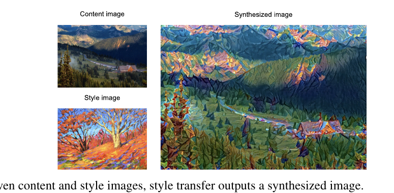

Ví dụ của sách: content image là ảnh phong cảnh chụp ở Mount Rainier National Park gần Seattle, style image là tranh sơn dầu về những cây sồi mùa thu. Ảnh tổng hợp mang nét cọ sơn dầu của style image, màu sắc rực rỡ hơn, nhưng **vẫn giữ hình dạng chính** của vật trong content image.

### 14.12.1 Method

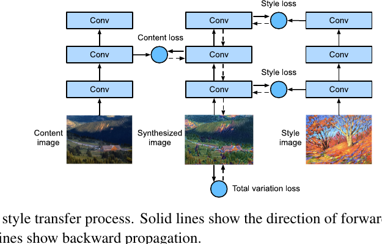

Đây là điểm đảo ngược thú vị nhất của cả chương. Trong mọi mục trước, **weights** là biến số còn dữ liệu cố định. Ở đây thì ngược lại:

<div class="algorithm-block" markdown="1">
<p class="algorithm-label">LUỒNG THUẬT TOÁN · NEURAL STYLE TRANSFER</p>

1. **Khởi tạo synthesized image**, ví dụ bằng chính content image. Ảnh tổng hợp này là **biến duy nhất cần cập nhật** trong quá trình style transfer — nói cách khác, nó chính là "model parameters" được học.
2. Chọn một CNN **pretrained** để trích features ảnh và **đóng băng** tham số của nó trong suốt quá trình. CNN sâu này dùng nhiều layer để trích features phân cấp; ta chọn output của một số layer làm **content features**, một số layer khác làm **style features**.
3. Tính loss function bằng lan truyền xuôi (mũi tên nét liền trong hình), rồi cập nhật "model parameters" — tức ảnh tổng hợp — bằng backpropagation (mũi tên nét đứt).
4. Khi training xong, **xuất ra chính các model parameters** để có ảnh tổng hợp cuối cùng.

</div>

Loss gồm **ba phần**:

1. **content loss** làm ảnh tổng hợp gần content image về content features;
2. **style loss** làm ảnh tổng hợp gần style image về style features;
3. **total variation loss** giúp giảm nhiễu trên ảnh tổng hợp.

Trong hình minh hoạ, network có 3 convolutional layer: layer thứ hai cho content features, layer thứ nhất và thứ ba cho style features.

### 14.12.4 Extracting Features

Sách dùng **VGG-19** pretrained trên ImageNet. Nguyên tắc chọn layer:

> Nói chung, càng gần input layer thì càng dễ trích **chi tiết** của ảnh; ngược lại, càng xa thì càng dễ trích **thông tin toàn cục**.

Từ đó:

- **Content layer** chọn layer **gần output** hơn, để tránh giữ lại quá nhiều chi tiết vụn của content image trong ảnh tổng hợp.
- **Style layers** lấy ở nhiều độ sâu khác nhau, để bắt cả style cục bộ lẫn style toàn cục.

VGG dùng 5 khối convolution (mục 8.2). Sách chọn **convolutional layer cuối của khối thứ tư** làm content layer, và **convolutional layer đầu của mỗi khối** làm style layer:

```python
style_layers, content_layers = [0, 5, 10, 19, 28], [25]
```

Chỉ cần giữ các layer từ input tới layer xa nhất trong hai danh sách, nên `net` được cắt ngắn tới index 28.

### 14.12.5 Defining the Loss Function

**Content loss.** Giống loss của linear regression, nó đo khác biệt về content features giữa ảnh tổng hợp và content image bằng **squared loss**:

```python
def content_loss(Y_hat, Y):
    # Y đã detach nên gradient không chảy ngược về content image.
    return torch.square(Y_hat - Y.detach()).mean()
```

**Style loss.** Cũng dùng squared loss, nhưng "style" phải được biểu diễn thế nào?

Giả sử output của một style layer có 1 ví dụ, $c$ channel, cao $h$, rộng $w$. Ta biến output đó thành ma trận $\mathbf{X}$ có $c$ **hàng** và $hw$ **cột** — tức ghép $c$ vector $\mathbf{x}_1, \ldots, \mathbf{x}_c$, mỗi vector dài $hw$. Vector $\mathbf{x}_i$ biểu diễn style feature của channel $i$.

Trong {{term:gram-matrix|Gram matrix}} $\mathbf{X}\mathbf{X}^\top \in \mathbb{R}^{c \times c}$, phần tử $x_{ij}$ ở hàng $i$ cột $j$ là **tích vô hướng** của $\mathbf{x}_i$ và $\mathbf{x}_j$. Nó biểu diễn **tương quan** giữa style features của channel $i$ và $j$.

**Tại sao Gram matrix lại là "style"?** Chú ý một điều then chốt: Gram matrix **cộng dồn trên mọi vị trí không gian**, nên nó vứt bỏ thông tin "cái gì ở đâu" và chỉ giữ lại "những đặc trưng nào hay xuất hiện cùng nhau". Đó đúng là trực giác về phong cách: nét cọ xoáy màu vàng là phong cách dù nó nằm ở góc nào của bức tranh.

Còn một chi tiết kỹ thuật: khi $hw$ lớn, các giá trị trong Gram matrix cũng lớn theo. Chiều cao và rộng của Gram matrix đều bằng số channel. Để style loss không bị các giá trị đó chi phối, hàm `gram` **chia Gram matrix cho số phần tử của nó**, tức $chw$:

```python
def gram(X):
    num_channels, n = X.shape[1], X.numel() // X.shape[1]
    X = X.reshape((num_channels, n))
    return torch.matmul(X, X.T) / (num_channels * n)


def style_loss(Y_hat, gram_Y):
    # gram_Y (của style image) đã được tính sẵn từ trước.
    return torch.square(gram(Y_hat) - gram_Y.detach()).mean()
```

**Total variation loss.** Đôi khi ảnh tổng hợp học được có nhiều nhiễu tần số cao, tức các pixel sáng hoặc tối bất thường. Một phương pháp khử nhiễu phổ biến là {{term:total-variation-loss|total variation denoising}}. Gọi $x_{i,j}$ là giá trị pixel tại toạ độ $(i, j)$; giảm đại lượng

$$
\sum_{i,j} \left| x_{i,j} - x_{i+1,j} \right| + \left| x_{i,j} - x_{i,j+1} \right|
$$

sẽ làm giá trị các pixel **kề nhau** trên ảnh tổng hợp gần nhau hơn.

```python
def tv_loss(Y_hat):
    return 0.5 * (torch.abs(Y_hat[:, :, 1:, :] - Y_hat[:, :, :-1, :]).mean() +
                  torch.abs(Y_hat[:, :, :, 1:] - Y_hat[:, :, :, :-1]).mean())
```

**Loss tổng.** Là **tổng có trọng số** của ba thành phần. Chỉnh các trọng số này để cân bằng giữa giữ content, chuyển style, và khử nhiễu:

```python
content_weight, style_weight, tv_weight = 1, 1e4, 10
```

Nhìn vào ba con số là hiểu ngay cơ chế: `style_weight` lớn hơn `content_weight` **mười nghìn lần**. Đừng vội kết luận "style quan trọng hơn gấp mười nghìn lần" — lý do là Gram matrix đã chia cho $chw$ nên giá trị của nó rất nhỏ, và trọng số lớn chỉ để **đưa ba loss về cùng thang đo**. Đây là bài học chung: trọng số trong một loss tổng hợp phản ánh cả **thang đo** lẫn **mức ưu tiên**.

### 14.12.6 Initializing the Synthesized Image

Ảnh tổng hợp là biến duy nhất cần cập nhật, nên sách định nghĩa một model đơn giản `SynthesizedImage` và coi ảnh tổng hợp là tham số của nó. Lan truyền xuôi chỉ việc trả về tham số đó.

### 14.12.7 Training

Mỗi vòng lặp: trích content và style features của ảnh tổng hợp, tính ba loss, rồi backpropagation về **pixel**. Gram matrix của style image được tính sẵn một lần vì style image không đổi.

### 14.12.8 Summary

- Loss function thường dùng cho style transfer gồm ba phần: (i) **content loss** làm ảnh tổng hợp gần content image về content features; (ii) **style loss** làm ảnh tổng hợp gần style image về style features; và (iii) **total variation loss** giúp giảm nhiễu trên ảnh tổng hợp.
- Ta có thể dùng một CNN pretrained để trích features ảnh và cực tiểu hoá loss function để liên tục cập nhật ảnh tổng hợp **như thể nó là model parameters** trong quá trình training.
- Ta dùng **Gram matrices** để biểu diễn style output từ các style layers.

### 14.12.9 Exercises

1. Output thay đổi thế nào khi bạn chọn các content layer và style layer khác?
2. Chỉnh các trọng số trong loss function. Output giữ lại nhiều content hơn hay ít nhiễu hơn?
3. Dùng các content image và style image khác. Bạn tạo được ảnh tổng hợp thú vị hơn không?
4. Có thể áp dụng style transfer cho **văn bản** không? Gợi ý: bạn có thể tham khảo bài khảo sát của Hu và cộng sự (2022).

<details markdown="1"><summary>Gợi ý</summary>

Câu 1: nhớ lại nguyên tắc "gần input thì chi tiết, xa input thì toàn cục" — chọn content layer nông hơn thì ảnh tổng hợp sẽ bám content chặt hơn hay lỏng hơn? Câu 4: điều gì trong văn bản đóng vai trò "content" và điều gì đóng vai trò "style"? Việc pixel liên tục còn token rời rạc gây khó khăn gì?
</details>

<details markdown="1"><summary>Lời giải</summary>

**Câu 1.** Đổi **content layer**: chọn layer nông hơn (ví dụ index 10 thay vì 25) buộc ảnh tổng hợp khớp với chi tiết mức thấp, nên nó bám ảnh gốc rất sát và style hầu như không vào được. Chọn layer sâu hơn thì chỉ bố cục tổng thể được giữ, còn style tự do hơn nhiều.

Đổi **style layers**: chỉ dùng các layer nông cho ra style hạt mịn — kết cấu, nét cọ nhỏ — nhưng thiếu cấu trúc lớn. Chỉ dùng các layer sâu cho ra mô-típ lớn nhưng mất chất liệu bề mặt. Sách lấy **cả năm** khối chính vì thế: mỗi độ sâu đóng góp một "tần số" phong cách khác nhau.

**Câu 2.** Đọc thẳng từ tên biến:

- Tăng `content_weight` (hoặc giảm `style_weight`): giữ **nhiều content hơn**, ảnh gần bản gốc hơn, ít chất nghệ thuật hơn.
- Tăng `style_weight`: style áp đảo, hình dạng vật có thể méo đi tới mức khó nhận ra.
- Tăng `tv_weight`: **ít nhiễu hơn**, ảnh mượt hơn. Nhưng tăng quá tay thì ảnh bị bệt, mất cả nét cọ — mà nét cọ chính là thứ ta muốn.

Vậy câu trả lời cho đề bài là: **tuỳ trọng số nào bạn chỉnh** — hai câu hỏi trong đề ứng với hai trọng số khác nhau, và đó chính là điều bài tập muốn bạn nhận ra.

**Câu 3.** Vài kinh nghiệm: style image có kết cấu mạnh, lặp lại (tranh ấn tượng, tranh sơn dầu dày nét) cho kết quả rõ hơn ảnh chụp. Nếu content image và style image lệch nhau nhiều về thang màu, hãy tăng `tv_weight`. Và vì ảnh tổng hợp khởi tạo bằng content image, ảnh content có bố cục rõ ràng thường cho kết quả ổn định hơn.

**Câu 4.** Có, nhưng bài toán khó hơn về bản chất — và lý do rất đáng suy nghĩ.

Với ảnh, pixel **liên tục** nên gradient descent cập nhật trực tiếp được trên pixel. Với văn bản, token **rời rạc**: không có khái niệm "dịch từ này đi 0.01 về phía từ kia", nên không thể tối ưu thẳng trên đầu ra như ở đây.

Ngoài ra, ranh giới content/style trong ngôn ngữ mờ hơn nhiều. Style văn bản (trang trọng hay suồng sã, lịch sự hay thẳng thừng, sắc thái tình cảm) **gắn chặt với từ ngữ**, trong khi ở ảnh thì kết cấu và hình dạng tách khá gọn.

Vì vậy các phương pháp text style transfer đi hướng khác: học không gian ẩn tách content khỏi style, dùng huấn luyện đối kháng, hoặc dùng mô hình ngôn ngữ lớn để diễn đạt lại — chứ không phải backpropagation xuống chính đầu ra như neural style transfer.

**Bẫy thường gặp:** quên `detach()` khi tính content loss hoặc style loss, khiến gradient chảy ngược vào ảnh gốc thay vì chỉ vào ảnh tổng hợp.
</details>

<!-- pagebreak -->

## 14.13 Image Classification (CIFAR-10) on Kaggle

### Trực giác

Đến giờ ta luôn dùng API cấp cao để lấy dataset đã ở dạng tensor. Nhưng dataset thật của bạn thường đến dưới dạng **một đống file ảnh**. Mục này đi từ file ảnh thô, tổ chức, đọc, rồi biến thành tensor — từng bước một, qua cuộc thi Kaggle CIFAR-10.

### 14.13.1 Obtaining and Organizing the Dataset

Dataset của cuộc thi chia thành training set và test set với **50 000** và **300 000** ảnh. Trong test set, **10 000** ảnh dùng để chấm điểm, còn **290 000** ảnh còn lại không được chấm — chúng có mặt chỉ để **gây khó cho việc gian lận** bằng kết quả gán nhãn thủ công. Ảnh đều là file PNG màu (RGB), cao và rộng **32 pixel**, thuộc 10 lớp: máy bay, ô tô, chim, mèo, hươu, chó, ếch, ngựa, tàu thuyền và xe tải.

Sau khi giải nén, cấu trúc như sau:

```text
../data/cifar-10/train/[1-50000].png
../data/cifar-10/test/[1-300000].png
../data/cifar-10/trainLabels.csv
../data/cifar-10/sampleSubmission.csv
```

Sách cung cấp một mẫu nhỏ (1000 ảnh train, 5 ảnh test) qua biến `demo = True`; đặt `demo = False` để dùng dataset đầy đủ.

**Việc quan trọng nhất của mục:** tổ chức lại file vào cấu trúc thư mục mà `ImageFolder` hiểu được, đồng thời **tách ra một validation set**:

```text
train_valid_test/
├── train/        <- chỉ để train
│   ├── airplane/
│   └── ...
├── valid/        <- để chọn hyperparameters
├── train_valid/  <- train + valid, dùng khi train model cuối
└── test/unknown/ <- không có nhãn
```

Tại sao lại có cả `train_valid`? Đây là một quy trình đáng học và dùng lại cho mọi cuộc thi:

1. Train trên `train`, đánh giá trên `valid` để **chọn hyperparameters**.
2. Khi đã chốt hyperparameters, train lại từ đầu trên `train_valid` — **tận dụng toàn bộ dữ liệu có nhãn**.
3. Dự đoán trên `test` và nộp kết quả.

### 14.13.2 Image Augmentation

Ta dùng image augmentation để chống overfitting:

```python
transform_train = torchvision.transforms.Compose([
    torchvision.transforms.Resize(40),
    # Cắt vùng diện tích 64%–100% ảnh gốc, tỉ lệ khung hình giữ nguyên 1:1,
    # rồi scale về 32×32.
    torchvision.transforms.RandomResizedCrop(32, scale=(0.64, 1.0),
                                             ratio=(1.0, 1.0)),
    torchvision.transforms.RandomHorizontalFlip(),
    torchvision.transforms.ToTensor(),
    torchvision.transforms.Normalize([0.4914, 0.4822, 0.4465],
                                     [0.2023, 0.1994, 0.2010])])

# Lúc test CHỈ chuẩn hoá, để loại bỏ tính ngẫu nhiên khỏi kết quả đánh giá.
transform_test = torchvision.transforms.Compose([
    torchvision.transforms.ToTensor(),
    torchvision.transforms.Normalize([0.4914, 0.4822, 0.4465],
                                     [0.2023, 0.1994, 0.2010])])
```

Chú ý bộ mean/std ở đây **khác** bộ của ImageNet dùng ở mục 14.2 — đây là thống kê của riêng CIFAR-10. Quy tắc: chuẩn hoá theo thống kê của **dữ liệu bạn đang dùng**, trừ khi bạn đang fine-tune một model pretrained, khi đó phải theo thống kê mà model đó đã được train.

### 14.13.4 Defining the Model

Sách định nghĩa model ResNet-18 giống mục 8.6.

### 14.13.5–14.13.6 Training and Validating

Hàm train dùng learning rate scheduling: cứ sau `lr_period` epoch thì nhân learning rate với `lr_decay`. Sau khi chọn được hyperparameters trên validation set, ta train lại trên `train_valid` rồi mới dự đoán.

### 14.13.7 Classifying the Testing Set and Submitting Results

Dự đoán trên test set, sắp xếp kết quả theo thứ tự `id` rồi ghi ra `submission.csv` đúng định dạng của `sampleSubmission.csv`.

### 14.13.8 Summary

- Ta có thể đọc các dataset chứa file ảnh thô sau khi tổ chức chúng vào đúng định dạng yêu cầu.
- Ta có thể dùng convolutional neural networks và image augmentation trong một cuộc thi image classification.

### 14.13.9 Exercises

1. Dùng **toàn bộ** dataset CIFAR-10 cho cuộc thi Kaggle này. Đặt hyperparameters `batch_size = 128`, `num_epochs = 100`, `lr = 0.1`, `lr_period = 50`, `lr_decay = 0.1`. Xem bạn đạt accuracy và thứ hạng nào. Bạn có cải thiện thêm được không?
2. Bạn đạt accuracy bao nhiêu khi **không** dùng image augmentation?

<details markdown="1"><summary>Gợi ý</summary>

Câu 1: `lr_period = 50` với `num_epochs = 100` nghĩa là learning rate giảm mấy lần, và vào thời điểm nào? Câu 2: so sánh cả train accuracy lẫn test accuracy như ở bài tập 14.1.4.
</details>

<details markdown="1"><summary>Lời giải</summary>

**Câu 1.** Cấu hình này giảm learning rate **một lần**, ở epoch 50, từ 0.1 xuống 0.01. Đây là lịch bậc thang kinh điển: giai đoạn đầu learning rate lớn để khám phá, giai đoạn sau nhỏ để tinh chỉnh. Với ResNet-18 trên CIFAR-10 đầy đủ, cấu hình này thường cho test accuracy khoảng 0.93–0.95.

Hướng cải thiện: dùng cosine annealing thay bậc thang; thêm `RandomErasing` hoặc `Cutout` vào augmentation; thêm label smoothing; và dùng backbone rộng hơn. Nhưng hãy chốt hyperparameters trên **validation set** rồi mới train lại trên `train_valid` — dò hyperparameter bằng điểm trên bảng xếp hạng chính là overfit vào test set.

**Câu 2.** Không augmentation thì **train accuracy tiến sát 1.0 rất nhanh** còn test accuracy dừng thấp hơn đáng kể, thường kém vài điểm phần trăm. Khoảng cách train–test nới rộng — cùng một dấu hiệu overfitting như bài tập 14.1.4, nhưng lần này trên dataset lớn hơn và model mạnh hơn nên hiệu ứng rõ hơn nhiều.

**Bẫy thường gặp:** để `demo = True` rồi ngạc nhiên vì accuracy quá thấp — 1000 ảnh không đủ để train ResNet-18.
</details>

<!-- pagebreak -->

## 14.14 Dog Breed Identification (ImageNet Dogs) on Kaggle

### Trực giác

Cuộc thi thứ hai nhận ra **120 giống chó khác nhau**. Dataset là một **tập con của ImageNet**, nên khác CIFAR-10 ở một điểm quyết định: ảnh **lớn hơn và có kích thước thay đổi**, thay vì cố định 32×32.

Training set có **10 222** ảnh JPEG ba channel, test set có **10 357**. Các giống gồm Labrador, Poodle, Dachshund, Samoyed, Husky, Chihuahua, Yorkshire Terrier và nhiều giống khác.

### 14.14.2 Image Augmentation

Vì ảnh to hơn và tỉ lệ khung hình thay đổi, các phép augmentation phải chỉnh lại so với CIFAR-10:

```python
transform_train = torchvision.transforms.Compose([
    # Cắt vùng diện tích 8%–100% ảnh gốc, tỉ lệ khung hình từ 3/4 đến 4/3,
    # rồi scale về 224×224 — dải rộng hơn hẳn CIFAR-10 vì ảnh gốc đa dạng hơn.
    torchvision.transforms.RandomResizedCrop(224, scale=(0.08, 1.0),
                                             ratio=(3.0/4.0, 4.0/3.0)),
    torchvision.transforms.RandomHorizontalFlip(),
    torchvision.transforms.ColorJitter(brightness=0.4, contrast=0.4,
                                       saturation=0.4),
    torchvision.transforms.ToTensor(),
    # Chuẩn hoá theo thống kê của ImageNet ĐẦY ĐỦ, khớp với model pretrained.
    torchvision.transforms.Normalize([0.485, 0.456, 0.406],
                                     [0.229, 0.224, 0.225])])
```

### 14.14.4 Fine-Tuning a Pretrained Model

Vì dataset là tập con của ImageNet, ta dùng lại cách tiếp cận của mục 14.2: chọn model pretrained trên **toàn bộ** ImageNet, dùng nó trích features rồi đưa vào một output network nhỏ tự viết. Sách chọn **ResNet-34** pretrained, dùng lại input của output layer (tức features đã trích), và thay output layer gốc bằng một mạng nhỏ gồm **hai fully connected layer** xếp chồng.

Khác biệt so với thí nghiệm hot dog ở mục 14.2: ở đây sách **không train lại** phần pretrained dùng để trích features. Điều đó **giảm thời gian train và bộ nhớ lưu gradient**.

```python
def get_net(devices):
    finetune_net = nn.Sequential()
    finetune_net.features = torchvision.models.resnet34(pretrained=True)
    # Output network nhỏ, train từ đầu: 1000 -> 256 -> 120.
    finetune_net.output_new = nn.Sequential(
        nn.Linear(1000, 256), nn.ReLU(), nn.Linear(256, 120))
    finetune_net = finetune_net.to(devices[0])
    # Đóng băng hoàn toàn phần trích features.
    for param in finetune_net.features.parameters():
        param.requires_grad = False
    return finetune_net
```

### 14.14.8 Summary

- Ảnh trong ImageNet dataset **lớn hơn** (và có kích thước thay đổi) so với ảnh CIFAR-10. Ta có thể chỉnh lại các phép image augmentation cho phù hợp với nhiệm vụ trên dataset khác.
- Để phân loại một tập con của ImageNet, ta có thể tận dụng model pretrained trên **toàn bộ** ImageNet để trích features và chỉ train một output network nhỏ tự viết. Cách này tốn ít thời gian tính toán và bộ nhớ hơn.

### 14.14.9 Exercises

1. Khi dùng dataset đầy đủ của cuộc thi Kaggle, bạn đạt kết quả gì nếu **tăng** `batch_size` và `num_epochs` trong khi đặt các hyperparameters khác là `lr = 0.01`, `lr_period = 10`, `lr_decay = 0.1`?
2. Bạn có kết quả tốt hơn nếu dùng model pretrained **sâu hơn** không? Bạn chỉnh hyperparameters thế nào? Bạn có cải thiện thêm được kết quả không?

<details markdown="1"><summary>Gợi ý</summary>

Câu 1: `lr = 0.01` nhỏ hơn hẳn `lr = 0.1` ở CIFAR-10 — vì sao lại hợp lý khi chỉ train một head nhỏ? Câu 2: nếu backbone bị đóng băng, phần nào của model thật sự hưởng lợi từ việc đổi sang ResNet sâu hơn?
</details>

<details markdown="1"><summary>Lời giải</summary>

**Câu 1.** Với `lr_period = 10` và `lr_decay = 0.1`, learning rate giảm 10 lần **sau mỗi 10 epoch** — lịch giảm mạnh hơn nhiều so với CIFAR-10. Learning rate khởi đầu nhỏ (0.01) là hợp lý vì ta chỉ train một head hai lớp trên **features đã cố định và đã tốt**; không cần bước lớn để khám phá.

Tăng `num_epochs` thường cải thiện tới một mức rồi bão hoà — sau vài lần decay, learning rate nhỏ tới mức model gần như không thay đổi nữa. Tăng `batch_size` làm mỗi epoch nhanh hơn nhưng giảm số bước cập nhật, nên thường nên tăng learning rate theo tỉ lệ để bù.

**Câu 2.** Thường là **có**, vì features tốt hơn kéo theo kết quả tốt hơn — ResNet-50 hay ResNet-101 cho biểu diễn giàu hơn ResNet-34, và ở đây chất lượng features quyết định tất cả vì backbone bị đóng băng.

Hai điểm cần chỉnh khi đổi backbone:

1. **Số chiều đầu vào của head**: `nn.Linear(1000, 256)` giả định backbone trả 1000 chiều. Đổi model thì phải kiểm tra lại con số này.
2. **Bộ nhớ và tốc độ**: model sâu hơn cần giảm `batch_size`.

Hướng cải thiện thêm: **mở băng vài block cuối** của backbone và fine-tune chúng với learning rate rất nhỏ (kết hợp ý của mục 14.2 và mục này); hoặc ensemble nhiều backbone. Đáng chú ý là cuộc thi này chấm bằng **log loss** chứ không phải accuracy, nên việc hiệu chỉnh xác suất (calibration) có giá trị — một model đoán đúng nhưng "quá tự tin" vẫn bị phạt nặng.

**Bẫy thường gặp:** quên rằng nhiều ảnh của cuộc thi này **nằm sẵn** trong tập train ImageNet mà backbone đã học. Điều đó làm validation score đẹp hơn thực tế; đừng dùng nó để so sánh với các bài toán mà model chưa từng thấy dữ liệu.
</details>

<!-- pagebreak -->

## Điểm hay và ý nghĩa

**Một ý tưởng, bốn nhiệm vụ.** Điều đẹp nhất của chương này là cả bốn nhiệm vụ — classification, detection, segmentation, style transfer — đều dùng đúng một quan sát: CNN cho ta một **chồng feature maps**, càng lên cao càng trừu tượng và receptive field càng rộng. Detection đọc chồng đó theo chiều ngang (nhiều scale cùng lúc). Segmentation đi xuống rồi đi lên lại. Style transfer đọc hai tầng khác nhau và gọi tầng nông là "phong cách", tầng sâu là "nội dung".

**Phép đảo vai trò trong style transfer.** Suốt cả cuốn sách, weights là biến số còn dữ liệu cố định. Mục 14.12 đảo ngược: network đóng băng, **ảnh trở thành tham số**. Cùng một cỗ máy gradient descent, chỉ đổi chỗ xem cái gì là biến, đã cho ra một lớp ứng dụng hoàn toàn khác.

**Transposed convolution không phải phép nghịch đảo.** Cái tên đến từ việc chuyển vị ma trận trọng số, và chuyển vị **không phải** nghịch đảo. Nó khôi phục *shape* chứ không khôi phục *nội dung*. Hiểu đúng chỗ này giải thích luôn vì sao FCN phải học trọng số upsampling thay vì dùng một công thức có sẵn.

**Phép biến đổi offset là một bài học về thiết kế mục tiêu.** Không ai bắt buộc phải chia cho $w_a$ rồi lấy $\log$ rồi chia cho $\sigma$. Nhưng chuỗi biến đổi đó biến một đại lượng khó hồi quy (lệch pixel, phụ thuộc kích thước, không đối xứng) thành một đại lượng dễ hồi quy (không thứ nguyên, đối xứng quanh 0, phân bố hợp lý). **Chọn đúng thứ để dự đoán** nhiều khi quan trọng hơn chọn model.

**Sự đánh đổi one-stage và two-stage.** SSD và R-CNN trả lời cùng một câu hỏi bằng hai triết lý đối lập: đoán hết cùng lúc, hay lọc trước rồi xem kỹ. Không bên nào đúng tuyệt đối — đó là một ví dụ sạch đẹp về đánh đổi tốc độ và độ chính xác trong thiết kế hệ thống.

## Sau chương này bạn làm được gì?

- Chọn và phối hợp các phép image augmentation cho một bài toán cụ thể, và **lập luận được** phép nào làm hỏng nhãn.
- Fine-tune một model pretrained, đặt learning rate khác nhau cho body và head, và biết khi nào nên đóng băng hoàn toàn backbone.
- Đổi qua lại hai cách biểu diễn bounding box, và tính IoU bằng tay cho hai box nhỏ.
- Trình bày lại thuật toán gán ground-truth cho anchor, giải thích được vì sao có bước "ép gán" trước bước "theo ngưỡng".
- Giải thích được vì sao offset labels phải qua phép chuẩn hoá log, và đọc ra các hằng số 10 và 5 trong code.
- Mô tả NMS, chỉ ra chỗ nó hỏng (hai vật chồng nhau), và nêu cách sửa bằng Soft-NMS.
- Tính shape output của transposed convolution với padding và stride cho trước.
- Giải thích tại sao segmentation phải **cắt** ảnh chứ không **co giãn**, và tại sao ảnh nhãn chỉ được nội suy nearest-neighbour.
- Viết lại ba loss của style transfer và nói mỗi loss kéo ảnh về phía nào, kể cả vì sao `style_weight` lớn tới `1e4`.
- Tổ chức một pipeline Kaggle có tách validation, train lại trên `train_valid`, và xuất file submission.

## Tóm tắt kiến thức

**Mô hình tư duy gọn:** mọi nhiệm vụ trong chương đều là cùng một CNN, chỉ khác ở **hình dạng output** và **định dạng nhãn**.

```text
                CNN (chồng feature maps nhiều tầng)
                          │
   ┌──────────────┬───────┴────────┬─────────────────┐
một vector      nhiều box      output H×W        features đóng băng
   │               │                │                   │
classification  detection      segmentation        style transfer
   │               │                │                   │
cross-entropy  CE + L1 offset   CE từng pixel    content+style+TV loss
```

**Checklist tự kiểm tra:**

- [ ] Tôi nói được vì sao augmentation chỉ bật lúc training.
- [ ] Tôi tính được IoU của hai box cho bằng số.
- [ ] Tôi giải thích được vì sao mỗi pixel có $n+m-1$ anchor chứ không phải $nm$.
- [ ] Tôi chỉ ra được ba lý do của phép biến đổi offset.
- [ ] Tôi mô tả được NMS và nói được khi nào nó xoá nhầm.
- [ ] Tôi biết padding và stride trong transposed convolution tác động lên **output**, không phải input.
- [ ] Tôi giải thích được vì sao Gram matrix biểu diễn "phong cách" chứ không phải "nội dung".
- [ ] Tôi biết vì sao ảnh nhãn segmentation không được nội suy bilinear.

## Bài tập

Các bài dưới đây là **Bài tập bổ sung** của người biên soạn, dùng để nối các mục lại với nhau. Bài tập gốc của sách nằm trong từng mục ở trên.

**Bài 1 — Nhớ và hiểu.** Không nhìn lại bài, hãy điền bảng sau: với mỗi nhiệm vụ (classification, detection, semantic segmentation, instance segmentation), nêu (a) định dạng nhãn, (b) shape output, (c) loss function.

**Bài 2 — Tính toán.** Cho anchor $A$ có tâm $(50, 50)$, rộng 40, cao 20; ground-truth $B$ có tâm $(54, 48)$, rộng 60, cao 20. Tính bốn giá trị offset label theo công thức của mục 14.4.3.

**Bài 3 — Áp dụng.** Một feature map $8 \times 8$ với 3 anchor mỗi vị trí, bài toán có 5 lớp vật. Nêu shape output của `cls_predictor` và `bbox_predictor`, và tổng số anchor.

**Bài 4 — Mở rộng.** Bạn cần phát hiện vết nứt trên ảnh chụp cầu đường. Vết nứt dài, mảnh, ngoằn ngoèo. Hãy lập luận xem nên dùng object detection hay semantic segmentation, và nêu hai phép augmentation bạn sẽ dùng cùng lý do.

## Gợi ý và lời giải

<details markdown="1"><summary>Gợi ý cho cả bốn bài</summary>

Bài 1: xem lại bảng ở mục "Bức tranh tổng quan". Bài 2: nhớ $\mu = 0$ nên chỉ còn chia cho $\sigma$; $\sigma_x=\sigma_y=0.1$ và $\sigma_w=\sigma_h=0.2$. Bài 3: mỗi anchor cần $q+1$ số cho class và 4 số cho offset. Bài 4: hình chữ nhật bao quanh một vết nứt chéo thì chứa bao nhiêu phần trăm pixel thực sự là vết nứt?
</details>

<details markdown="1"><summary>Lời giải Bài 1</summary>

| Nhiệm vụ | Định dạng nhãn | Shape output | Loss |
|---|---|---|---|
| Classification | một chỉ số lớp cho cả ảnh | `(N, C)` | cross-entropy |
| Detection | danh sách `(class, x1, y1, x2, y2)` | anchor classes + offsets | cross-entropy + $\ell_1$ (có mask) |
| Semantic segmentation | một **ảnh nhãn** cùng kích thước | `(N, C, H, W)` | cross-entropy trên từng pixel |
| Instance segmentation | box + mask cho **từng cá thể** | box + mask mỗi instance | loss của detection + loss của mask |

**Bẫy thường gặp:** quên rằng nhãn của detection có **độ dài thay đổi** theo ảnh, nên phải đệm khi gom batch.
</details>

<details markdown="1"><summary>Lời giải Bài 2</summary>

Biết: $x_a=50, y_a=50, w_a=40, h_a=20$; $x_b=54, y_b=48, w_b=60, h_b=20$.

**Thành phần $x$:**
$$\frac{(x_b-x_a)/w_a - 0}{0.1} = \frac{(54-50)/40}{0.1} = \frac{0.1}{0.1} = 1.0$$

**Thành phần $y$:**
$$\frac{(y_b-y_a)/h_a}{0.1} = \frac{(48-50)/20}{0.1} = \frac{-0.1}{0.1} = -1.0$$

**Thành phần $w$:**
$$\frac{\log(w_b/w_a)}{0.2} = \frac{\log(60/40)}{0.2} = \frac{\log 1.5}{0.2} \approx \frac{0.405}{0.2} \approx 2.03$$

**Thành phần $h$:**
$$\frac{\log(h_b/h_a)}{0.2} = \frac{\log 1}{0.2} = 0$$

Offset label là $(1.0,\ -1.0,\ 2.03,\ 0)$.

**Kiểm tra tính hợp lý:** ground-truth lệch sang phải nên thành phần $x$ dương; lệch lên trên (nhớ trục $y$ hướng xuống) nên thành phần $y$ âm; rộng hơn anchor nên thành phần $w$ dương; cao bằng nhau nên thành phần $h$ đúng bằng 0. Mọi giá trị đều nằm trong khoảng vài đơn vị — chính là thang đo mà phép chuẩn hoá nhắm tới.

**Bẫy thường gặp:** quên nhân với $1/\sigma$, cho ra các số nhỏ hơn 10 lần và lệch hẳn thang đo mà loss mong đợi.
</details>

<details markdown="1"><summary>Lời giải Bài 3</summary>

Với $a = 3$ anchor mỗi vị trí, $q = 5$ lớp, feature map $8 \times 8$:

- **`cls_predictor`**: cần $a(q+1) = 3 \times 6 = 18$ channel. Output shape `(N, 18, 8, 8)`.
- **`bbox_predictor`**: cần $4a = 12$ channel. Output shape `(N, 12, 8, 8)`.
- **Tổng số anchor**: $8 \times 8 \times 3 = 192$.

Kiểm tra chéo: 192 anchor $\times$ 6 lớp $= 1152 = 18 \times 8 \times 8$. ✓ Và 192 anchor $\times$ 4 offset $= 768 = 12 \times 8 \times 8$. ✓

**Bẫy thường gặp:** quên cộng 1 cho lớp background, cho ra 15 channel thay vì 18.
</details>

<details markdown="1"><summary>Lời giải Bài 4</summary>

**Nên dùng semantic segmentation.** Lý do nằm ở hình học: một vết nứt chéo dài 200 pixel nhưng chỉ rộng 3 pixel có bounding box cỡ $150 \times 150$, trong đó **dưới 1%** số pixel thực sự là vết nứt. Box hầu như chỉ chứa nền, nên nó không trả lời được câu hỏi người dùng thực sự quan tâm: vết nứt **dài bao nhiêu**, **rộng bao nhiêu**, đi theo **hướng nào**. Segmentation cho mask theo đúng hình dạng vết nứt nên đo đạc được trực tiếp.

**Hai phép augmentation và lý do:**

1. **Xoay và lật (cả ngang lẫn dọc).** Vết nứt không có hướng ưu tiên — một vết nứt chéo lên hay chéo xuống đều là vết nứt. Bất biến với phép xoay là bất biến **thật** của bài toán này, khác với ảnh chó mèo (lật dọc một con chó cho ra ảnh bất thường). Nhớ áp đúng phép đó lên ảnh nhãn, bằng nội suy nearest-neighbour.

2. **Đổi độ sáng và tương phản (`ColorJitter`).** Ảnh hạ tầng chụp ngoài trời ở đủ điều kiện thời tiết và giờ trong ngày. Augmentation này dạy model nhận ra vết nứt qua **cấu trúc** chứ không qua độ sáng tuyệt đối. Nhóm này an toàn vì nó không đụng tới ảnh nhãn.

**Cân nhắc thêm:** bài toán này mất cân bằng lớp rất nặng (pixel nứt chiếm phần rất nhỏ), nên cross-entropy thuần sẽ bị pixel nền áp đảo — giống hệt vấn đề đã bàn ở bài tập 14.7.5. Dice loss hoặc cross-entropy có trọng số là lựa chọn phù hợp hơn.
</details>

## Thuật ngữ cần nhớ

| English term | Chú thích tiếng Việt | Ví dụ ngắn |
|---|---|---|
| **Image augmentation** | Sinh biến thể ngẫu nhiên của ảnh training để model bớt phụ thuộc yếu tố không quan trọng | Lật ngang với xác suất 50% |
| **Transfer learning** | Chuyển kiến thức từ dataset lớn sang dataset nhỏ | Dùng ResNet ImageNet cho bài toán 2 lớp |
| **Fine-tuning** | Sao chép mọi layer trừ output, rồi học tiếp trên dữ liệu mới | Body `lr=5e-5`, head `lr=5e-4` |
| **Object detection** | Vừa nhận ra lớp vừa xác định vị trí của nhiều vật | Trả về `(chó, 0.9, box)` |
| **Bounding box** | Hình chữ nhật mô tả vị trí một vật, viết theo hai góc hoặc tâm–kích thước | `(x1,y1,x2,y2)` hoặc `(xc,yc,w,h)` |
| **Anchor box** | Box tham chiếu rải sẵn ở nhiều vị trí và tỉ lệ để detector phân loại rồi tinh chỉnh | 5 anchor mỗi pixel |
| **Intersection over union** | Tỉ số diện tích giao trên diện tích hợp của hai box; bằng chỉ số Jaccard | Hai box lệch 1/3 chiều rộng có IoU 0.5 |
| **Non-maximum suppression** | Giữ box tin cậy nhất, xoá các box chồng lấn quá ngưỡng | Từ 30 box còn 1 box mỗi vật |
| **Multiscale object detection** | Dùng feature maps nhiều kích thước để bắt vật nhiều kích thước | Feature map 4×4 bắt vật nhỏ |
| **Receptive field** | Vùng ảnh input ảnh hưởng tới một unit của feature map | Downsampling block cho receptive field 6×6 |
| **Single shot multibox detection** | Detector một giai đoạn: một lần chạy xuôi cho mọi dự đoán | TinySSD với 5 block |
| **Region proposal** | Vùng ứng viên có khả năng chứa vật, đưa vào giai đoạn phân loại | Selective search cho ~2000 vùng |
| **Selective search** | Thuật toán thủ công sinh region proposals dựa trên tương quan pixel | Bước đầu của R-CNN và fast R-CNN |
| **RoI pooling** | Biến features của các vùng khác kích thước thành output shape cố định | Mọi proposal thành 2×2 |
| **Region proposal network** | Network học cách sinh region proposals, train chung với detector | Cải tiến của faster R-CNN |
| **Semantic segmentation** | Gán một lớp ngữ nghĩa cho **mỗi pixel** | 21 lớp của Pascal VOC2012 |
| **Image segmentation** | Chia ảnh thành vùng dựa vào tương quan pixel, **không** cần nhãn | Tách phần đen và phần vàng của con chó |
| **Instance segmentation** | Mask riêng cho từng cá thể, phân biệt được hai vật cùng lớp | Tách con chó thứ nhất và thứ hai |
| **Transposed convolution** | Phép phát tán input qua kernel để **tăng** chiều không gian | `stride=32` phóng to 32 lần |
| **Upsampling** | Tăng độ phân giải không gian của ảnh hoặc feature map | Từ 10×15 lên 320×480 |
| **Bilinear interpolation** | Nội suy từ bốn pixel gần nhất theo khoảng cách tương đối | Khởi tạo transposed conv của FCN |
| **Fully convolutional network** | CNN → conv 1×1 → transposed conv, cho output cùng H×W với input | FCN trên VOC2012 |
| **Neural style transfer** | Cập nhật chính ảnh tổng hợp bằng gradient qua một CNN đóng băng | Ảnh phong cảnh theo nét sơn dầu |
| **Gram matrix** | Ma trận tương quan giữa các feature channel, dùng biểu diễn style | $\mathbf{X}\mathbf{X}^\top$ chia cho $chw$ |
| **Total variation loss** | Phạt chênh lệch giữa các pixel kề nhau để giảm nhiễu | `tv_weight = 10` |

## Nguồn và phạm vi

- *Dive into Deep Learning* (Zhang, Lipton, Li, Smola), Chương 14 "Computer Vision", trang sách **592–689**, trang PDF vật lý **632–729** của `../didl.pdf`.
- Mọi tiêu đề mục, công thức, giá trị hyperparameter và đề bài tập trong chương này được đối chiếu trực tiếp với PDF nguồn.
- **Hình gốc trích từ PDF** (kèm sidecar `.source.json` ghi nguồn): Figure 14.2.1 (tr. 601), 14.4.1 (tr. 613), 14.4.2 (tr. 615), 14.7.1 (tr. 631), 14.8.1 (tr. 642), 14.8.3 (tr. 644), 14.9.1 (tr. 648), 14.10.1 (tr. 655), 14.10.2 (tr. 657), 14.11.1 (tr. 660), 14.12.1 và 14.12.2 (tr. 667).
- **Nội dung bổ sung có nhãn rõ** của người biên soạn: bài tập bổ sung ở mục 14.7.5 (câu 2) và toàn bộ mục "Bài tập" ở cuối chương; các ghi chú hiện đại về learning-NMS, DETR, focal loss, U-Net và feature pyramid networks — những nội dung này **không** thuộc phạm vi sách và được nêu để trả lời các câu hỏi mở của sách.
- Các bài báo được sách trích dẫn và nhắc lại ở đây: Girshick và cộng sự (2014), Girshick (2015), Ren và cộng sự (2015), He và cộng sự (2017), Uijlings và cộng sự (2013), Liu và cộng sự (2016), Long và cộng sự (2015), Gatys và cộng sự (2016), Dumoulin và Visin (2016), Bodla và cộng sự (2017), Redmon và cộng sự (2016), Zhao và cộng sự (2019), Hu và cộng sự (2022).
