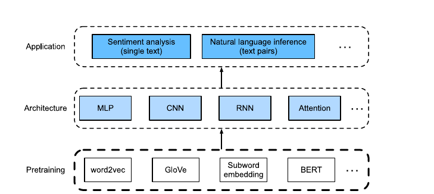
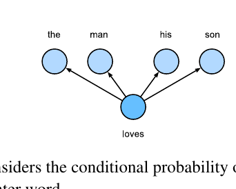
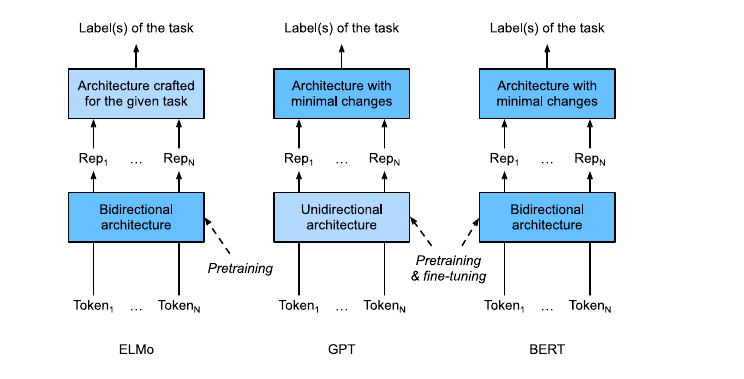

# Natural Language Processing: Pretraining

> **Ý chính trong một câu:** pretraining biến lượng văn bản chưa gắn nhãn khổng lồ thành “bài tập tự tạo”, nhờ đó model học representation hữu ích trước khi được fine-tune cho nhiệm vụ thật.

## Mục tiêu học tập

Học xong chương, bạn có thể:

- giải thích vì sao one-hot không chứa quan hệ nghĩa giữa các từ;
- phân biệt skip-gram và CBOW của {{term:word2vec|word2vec}};
- giải thích negative sampling, hierarchical softmax và pipeline tạo minibatch;
- dùng embedding để tìm từ gần nghĩa và giải analogy;
- mô tả GloVe, fastText và byte pair encoding;
- giải thích BERT tạo input, masked language modeling, next sentence prediction và representation phụ thuộc context.

## Bản đồ chương



```text
one-hot (rời rạc)
  ├─ word2vec: học từ context cục bộ
  │    ├─ negative sampling / hierarchical softmax
  │    └─ embedding → similarity, analogy
  ├─ GloVe: khớp thống kê đồng xuất hiện toàn corpus
  ├─ fastText/BPE: representation dưới mức word
  └─ BERT: cùng token nhưng vector đổi theo context
       ├─ MLM: đoán token bị che
       └─ NSP: đoán quan hệ hai câu
```

## Bức tranh tổng quan

Văn bản có rất nhiều nhưng nhãn cho sentiment, hỏi đáp hay suy luận ngôn ngữ lại đắt. {{term:self-supervised-learning|Self-supervised learning}} lấy chính văn bản làm “đáp án”: che một từ rồi bắt model đoán, hoặc dùng một từ để đoán những từ xung quanh.

Pretraining không trực tiếp giải mọi bài toán. Nó tạo một điểm khởi đầu giàu thông tin. Model downstream sau đó thêm output head và {{term:fine-tuning|fine-tune}} với ít dữ liệu có nhãn hơn.

<!-- pagebreak -->

## 15.1 Word Embedding (word2vec)

### 15.1.1 One-Hot Vectors Are a Bad Choice

Với vocabulary $V$ có $|V|$ từ, one-hot của mỗi từ là vector dài $|V|$ chỉ có một số 1. Dễ tạo, nhưng mọi cặp từ khác nhau đều trực giao nên cosine similarity bằng 0:

$$
\operatorname{cos}(\mathbf{x},\mathbf{y})=
\frac{\mathbf{x}^{\top}\mathbf{y}}{\|\mathbf{x}\|\|\mathbf{y}\|} \in [-1,1].
$$

One-hot nói “hai token khác ID”, nhưng không nói “mèo gần chó hơn gần động cơ”. {{term:word-embedding|Word embedding}} học một vector ngắn, dày đặc để vị trí/hướng của vector mang thông tin thống kê về nghĩa.

### 15.1.2 Self-Supervised word2vec

word2vec tạo supervision từ context trong corpus:

- **skip-gram**: biết center word, đoán context words;
- **CBOW**: biết context words, đoán center word.

Nhãn không do con người viết. Cửa sổ trượt trên câu tự sinh các cặp training.

### 15.1.3 The Skip-Gram Model



Với center $w_c$ và context $w_o$, mỗi từ có hai vector: $\mathbf{v}_c$ khi làm center và $\mathbf{u}_o$ khi làm context. Xác suất là softmax trên dot products:

$$
P(w_o\mid w_c)=\frac{\exp(\mathbf{u}_o^\top\mathbf{v}_c)}
{\sum_{i\in V}\exp(\mathbf{u}_i^\top\mathbf{v}_c)}.
$$

Nếu cặp thường đi cùng, tối ưu làm dot product của chúng lớn tương đối so với các từ khác. Training cực đại likelihood tương đương cực tiểu tổng negative log-likelihood.

### 15.1.4 The Continuous Bag of Words (CBOW) Model

CBOW lấy trung bình vector context $\bar{\mathbf v}_o$ rồi đoán center:

$$
P(w_c\mid W_o)=\frac{\exp(\mathbf{u}_c^\top\bar{\mathbf v}_o)}
{\sum_{i\in V}\exp(\mathbf{u}_i^\top\bar{\mathbf v}_o)}.
$$

“Bag” nghĩa là phép trung bình bỏ thứ tự các từ trong cửa sổ. Đây là giới hạn: “chó cắn người” và “người cắn chó” có cùng bag nếu chỉ nhìn đúng ba từ.

### 15.1.5 Summary

- One-hot không mã hóa similarity; embedding học representation liên tục.
- Skip-gram: center → context. CBOW: context → center.
- Mỗi từ có vai trò/vector center và context trong công thức training.

### 15.1.6 Exercises

1. **Tại sao full softmax đắt?** Mỗi cặp phải tính score cho toàn vocabulary: khoảng $O(|V|d)$. Với hàng triệu token, denominator là nút thắt.
2. **Cụm “new york” học thế nào?** Phát hiện phrase trước, ghép thành token `new_york`, rồi train như một token; phrase detection có thể dựa vào tần suất đồng xuất hiện vượt mức ngẫu nhiên.
3. **Dot product và cosine liên hệ ra sao?** $\mathbf u^\top\mathbf v=\|u\|\|v\|\cos\theta$. Dot product còn bị độ lớn chi phối; cosine tách hướng. Các từ có context giống nhau nhận gradient tương tự nên thường có hướng gần nhau.

<!-- pagebreak -->

## 15.2 Approximate Training

### 15.2.1 Negative Sampling

Thay vì hỏi “context đúng là từ nào trong toàn bộ vocabulary?”, {{term:negative-sampling|negative sampling}} hỏi nhiều câu nhị phân:

- cặp $(w_c,w_o)$ thật là positive;
- lấy $K$ noise words $w_k$ làm negatives.

Loss cho một positive pair:

$$
\ell=-\log\sigma(\mathbf u_o^\top\mathbf v_c)
-\sum_{k=1}^{K}\log\sigma(-\mathbf u_k^\top\mathbf v_c).
$$

Chi phí từ phụ thuộc $|V|$ chuyển thành khoảng $O(Kd)$. Sách lấy noise word với xác suất tỷ lệ $f(w)^{0.75}$: từ phổ biến vẫn dễ được chọn nhưng bớt áp đảo so với lấy đúng tần suất.

### 15.2.2 Hierarchical Softmax

{{term:hierarchical-softmax|Hierarchical softmax}} đặt các từ ở lá của cây nhị phân. Xác suất một từ là tích các quyết định trái/phải trên đường từ root tới lá. Cây cân bằng có đường dài $O(\log |V|)$ nên không cần chấm điểm mọi từ.

| Phương pháp | Việc tính mỗi positive | Trực giác |
|---|---:|---|
| Full softmax | $|V|$ scores | chọn một trong mọi từ |
| Negative sampling | $K+1$ scores | phân biệt thật với noise |
| Hierarchical softmax | $\log |V|$ decisions | đi từ root đến đúng leaf |

### 15.2.3 Summary

- Negative sampling dùng positive/negative events độc lập, chi phí tuyến tính theo số noise words.
- Hierarchical softmax biến dự đoán từ thành chuỗi quyết định trên cây, chi phí logarithm theo vocabulary.

### 15.2.4 Exercises

1. **Lấy noise words ra sao?** Dùng categorical distribution theo $f(w)^{0.75}$ và không chấp nhận word nằm trong contexts thật của center đó.
2. **CBOW dùng hai kỹ thuật này thế nào?** Thay $\mathbf v_c$ bằng vector context trung bình; positive là center thật, negatives là center giả, hoặc đi theo path của center trên cây.
3. **Kiểm tra xác suất cây:** xác suất leaf là tích xác suất từng nhánh; các leaf tạo partition nên tổng bằng 1 nếu mỗi node có hai xác suất bù nhau.

## 15.3 The Dataset for Pretraining Word Embeddings

### 15.3.1 Reading the Dataset

Sách dùng Penn Tree Bank (PTB), mỗi dòng là một câu, từ cách nhau bằng dấu cách. Pipeline đầu tiên tokenize rồi tạo vocabulary, bỏ token quá hiếm để giảm nhiễu.

### 15.3.2 Subsampling

Các từ cực phổ biến như “the” xuất hiện trong gần mọi context nên vừa tốn tính toán vừa ít phân biệt. Xác suất loại token $w_i$ là:

$$
P(\text{discard }w_i)=\max\left(1-\sqrt{t/f(w_i)},0\right),
$$

với $f(w_i)$ là tần suất tương đối và $t$ là ngưỡng nhỏ. Tần suất càng cao, khả năng bị bỏ càng lớn.

### 15.3.3 Extracting Center Words and Context Words

Mỗi token còn lại lần lượt làm center. Window size được lấy ngẫu nhiên từ $1$ đến `max_window_size`; ngẫu nhiên hóa giúp cùng center gặp các context hơi khác nhau qua epoch.

### 15.3.4 Negative Sampling

Với mỗi context thật, lấy một số noise words. Cần tránh chọn chính context thật. Cache các mẫu từ distribution giúp data loader đỡ tốn thời gian.

### 15.3.5 Loading Training Examples in Minibatches

Mỗi example có số context/negative khác nhau nên batch cần padding. Sách tạo:

- `contexts_negatives`: IDs đã pad;
- `masks`: 1 cho vị trí thật, 0 cho padding;
- `labels`: 1 cho context positive, 0 cho negative/padding.

```python
import torch


def masked_binary_loss(
    logits: torch.Tensor,
    labels: torch.Tensor,
    mask: torch.Tensor,
) -> torch.Tensor:
    """Average only valid positions; tensors share shape (batch, steps)."""
    element_loss = torch.nn.functional.binary_cross_entropy_with_logits(
        logits,
        labels.float(),
        reduction="none",
    )
    return (element_loss * mask).sum(dim=1) / mask.sum(dim=1).clamp_min(1)
```

### 15.3.6 Putting It All Together

`load_data_ptb` đóng gói download → tokenize → vocab → subsample → center/context → negatives → DataLoader. Với người mới, nên in shape của một batch trước khi train; đây là cách rẻ nhất để phát hiện mask lệch.

### 15.3.7 Summary

- Subsampling giảm dominance của từ quá phổ biến.
- Padding làm batch chữ nhật; mask phân biệt dữ liệu thật với padding; label phân biệt positive/negative.

### 15.3.8 Exercises

1. Bỏ subsampling làm số cặp tăng mạnh, loader và training chậm hơn; representation dễ bị từ chức năng chi phối.
2. Cache sampling quá nhỏ gọi random nhiều; quá lớn dùng thêm RAM và tạo burst. Hãy benchmark thay vì đoán.
3. Các hyperparameters ảnh hưởng tốc độ gồm batch size, window, số negatives, `num_workers`, min frequency và pin memory.

<!-- pagebreak -->

## 15.4 Pretraining word2vec

### 15.4.1 The Skip-Gram Model

{{term:embedding-layer|Embedding layer}} là một bảng weights shape `(vocab_size, embed_dim)`. Indexing chọn đúng row; đây không phải phép biến đổi “bí ẩn”. Với batch center và nhiều context/negative, batch matrix multiplication tạo mọi dot products.

```python
import torch
from torch import nn


class SkipGram(nn.Module):
    def __init__(self, vocab_size: int, embed_dim: int) -> None:
        super().__init__()
        self.center = nn.Embedding(vocab_size, embed_dim)
        self.context = nn.Embedding(vocab_size, embed_dim)

    def forward(
        self,
        center_ids: torch.Tensor,
        context_ids: torch.Tensor,
    ) -> torch.Tensor:
        # center: (batch, 1, d); context: (batch, steps, d)
        center = self.center(center_ids)
        context = self.context(context_ids)
        return torch.bmm(context, center.transpose(1, 2)).squeeze(-1)
```

**Code convention:** class dùng `PascalCase`, hàm/biến dùng `snake_case`; type hints và shape comments đặt ở biên quan trọng; `forward` chỉ tính output, không nhét training loop vào model.

### 15.4.2 Training

Sách dùng binary cross-entropy cho positive/negative và mask padding, khởi tạo Xavier, optimizer Adam. Loss phải chia theo số vị trí hợp lệ của từng example; nếu chia theo độ dài padded cố định, example ngắn bị đánh giá nhẹ sai lệch.

### 15.4.3 Applying Word Embeddings

Sau training, dùng center embedding. Tính cosine từ query tới mọi rows và lấy top-$k$ (bỏ chính query). Kết quả trên PTB nhỏ chỉ minh họa; corpus lớn mới tạo semantics ổn định.

### 15.4.4 Summary

- Skip-gram + negative sampling có thể cài bằng embedding, batch matrix multiplication và BCE.
- Một ứng dụng trực tiếp là nearest neighbors theo cosine.

### 15.4.5 Exercises

1. Thử từ khác và tune `embed_dim`, window, negatives, epoch; đánh giá bằng ví dụ cố định chứ không chỉ nhìn loss.
2. Resample context/negatives mỗi epoch tăng đa dạng training pairs và giảm việc model nhớ một bộ noise cố định, đổi lại data pipeline nặng hơn.

## 15.5 Word Embedding with Global Vectors (GloVe)

### 15.5.1 Skip-Gram with Global Corpus Statistics

Gọi $x_{ij}$ là số lần $w_j$ xuất hiện trong context của $w_i$, $x_i=\sum_j x_{ij}$ và $p_{ij}=x_{ij}/x_i$. Skip-gram có thể nhìn như đang khớp distribution đồng xuất hiện toàn corpus, nhưng training ngẫu nhiên lặp lại nhiều cặp.

### 15.5.2 The GloVe Model

{{term:glove|GloVe}} precompute $x_{ij}$ rồi tối ưu weighted squared loss:

$$
\sum_{i,j} h(x_{ij})
\left(\mathbf u_j^\top\mathbf v_i+b_i+c_j-\log x_{ij}\right)^2.
$$

Hàm $h$ giảm ảnh hưởng của cặp quá hiếm và chặn ảnh hưởng cặp quá phổ biến. Vì objective đối xứng center/context, representation cuối thường cộng hai vector.

### 15.5.3 Interpreting GloVe from the Ratio of Co-occurrence Probabilities

Tỷ số $p_{ik}/p_{jk}$ cho biết word $k$ nghiêng về nghĩa của $i$ hay $j$. Ví dụ “solid” đi với “ice”, “gas” đi với “steam”; ratio giúp tách quan hệ. GloVe biến cấu trúc ratio này thành quan hệ tuyến tính trong vector space.

### 15.5.4 Summary

- GloVe dùng global co-occurrence counts thay vì chỉ sample cửa sổ trong từng step.
- Objective bình phương có trọng số khớp log-counts.
- Center/context có vai trò toán học đối xứng.

### 15.5.5 Exercises

1. Có thể cho cặp gần nhau weight lớn hơn: khi đếm $x_{ij}$ cộng $1/distance$ thay vì 1.
2. Hai bias center/context cũng đối xứng trong objective; đổi vai trò $i,j$ không làm bản chất thay đổi.

<!-- pagebreak -->

## 15.6 Subword Embedding

### 15.6.1 The fastText Model

word2vec/GloVe xem mỗi word là nguyên tử nên `help`, `helped`, `helping` không chia sẻ parameters. {{term:fasttext|fastText}} biểu diễn center word bằng tổng vector của các character $n$-grams, kể cả token biên `<` và `>`.

Ví dụ với `where`, các 3-grams gồm `<wh`, `whe`, `her`, `ere`, `re>` và cả `<where>`. Rare word có thể học nhờ các mảnh chung; từ ngoài vocabulary vẫn có vector nếu các n-grams đã biết.

### 15.6.2 Byte Pair Encoding

{{term:byte-pair-encoding|Byte pair encoding}} (BPE) bắt đầu từ symbols nhỏ rồi lặp:

1. đếm mọi cặp symbols liền nhau;
2. merge cặp phổ biến nhất thành symbol mới;
3. cập nhật corpus và lặp đến vocabulary size mong muốn.

Ví dụ đơn giản: `l o w </w>` và `l o w e r </w>` có thể lần lượt merge `l+o → lo`, `lo+w → low`. BPE giữ từ phổ biến nguyên hơn và tách từ hiếm thành mảnh quen.

### 15.6.3 Summary

- fastText cộng các subword vectors để khai thác morphology.
- BPE greedily merge cặp symbols phổ biến.
- Subword giảm vấn đề rare/OOV nhưng sequence thường dài hơn.

### 15.6.4 Exercises

1. Số $n$-gram khả dĩ quá lớn gây tốn RAM và nhiều mảnh hiếm; fastText hash n-grams vào số buckets cố định, chấp nhận collision.
2. CBOW subword: thay mỗi context word vector bằng tổng vector các subwords rồi lấy trung bình để đoán center.
3. Từ initial symbol vocabulary $n$ đến size $m$ cần $m-n$ merges nếu mỗi merge thêm đúng một symbol.
4. Muốn trích phrase, coi word là symbol và merge các cặp word liền nhau phổ biến theo cùng ý tưởng.

## 15.7 Word Similarity and Analogy

### 15.7.1 Loading Pretrained Word Vectors

Sách tải GloVe 50/100/300 chiều hoặc fastText, xây `idx_to_token`, `token_to_idx`, và matrix vectors. Unknown token ở index 0. File lớn nên loader phải kiểm tra số chiều và encoding.

### 15.7.2 Applying Pretrained Word Vectors

Similarity dùng cosine. Analogy “man : woman :: son : ?” dùng vector arithmetic:

$$
\mathbf q=\mathbf v_{woman}-\mathbf v_{man}+\mathbf v_{son},
$$

rồi tìm nearest neighbor của $\mathbf q$, bỏ các input tokens. Đây là regularity thống kê chứ không chứng minh model “hiểu” quan hệ như con người.

### 15.7.3 Summary

- Pretrained vectors từ corpus lớn có thể chuyển sang downstream tasks.
- Similarity và analogy là hai cách kiểm tra trực quan representation.

### 15.7.4 Exercises

1. So sánh fastText với GloVe trên từ hiếm/biến thể: fastText thường có lợi vì dùng subwords.
2. Vocabulary rất lớn: dùng approximate nearest neighbor index (HNSW/FAISS), normalize vectors trước, hoặc giới hạn candidate set.

<!-- pagebreak -->

## 15.8 Bidirectional Encoder Representations from Transformers (BERT)

### 15.8.1 From Context-Independent to Context-Sensitive

word2vec/GloVe trả cùng vector cho “bank” trong “deposit money at the bank” và “sit on the river bank”. {{term:context-sensitive-representation|Context-sensitive representation}} tạo vector từ cả token và context: $f(x,c(x))$.

ELMo dùng bidirectional LSTMs. Representation phong phú hơn, nhưng mỗi downstream task vẫn cần architecture được thiết kế riêng để dùng ELMo.

### 15.8.2 From Task-Specific to Task-Agnostic

GPT pretrain Transformer decoder trái → phải rồi thêm output head nhỏ, nên khá task-agnostic. Hạn chế ở bản được sách bàn: representation tại vị trí chỉ thấy context bên trái.

### 15.8.3 BERT: Combining the Best of Both Worlds



{{term:bert|BERT}} dùng Transformer encoder hai chiều và chỉ cần thay output head theo nhiệm vụ. Khi fine-tune, parameters encoder pretrained cũng được cập nhật; output head học từ đầu.

### 15.8.4 Input Representation

BERT nhận một text hoặc một cặp text:

```text
single: [CLS] token_a ... [SEP]
pair:   [CLS] text_A ... [SEP] text_B ... [SEP]
segment:   0 0 ... 0        1 1 ... 1
```

Embedding input là tổng của:

$$
E = E_{token}+E_{segment}+E_{position}.
$$

`[CLS]` đại diện toàn sequence cho classification; `[SEP]` phân cách. `valid_lens` khiến attention bỏ qua padding.

### 15.8.5 Pretraining Tasks

**Masked language modeling (MLM).** Chọn khoảng 15% tokens để dự đoán. Trong số được chọn: 80% thay bằng `[MASK]`, 10% thay token ngẫu nhiên, 10% giữ nguyên. Cách trộn này giảm khoảng cách giữa pretraining (có `[MASK]`) và fine-tuning (không có).

**Next sentence prediction (NSP).** Một nửa cặp là hai câu thật sự liên tiếp; một nửa có câu thứ hai lấy ngẫu nhiên. Classifier đọc vector `[CLS]` để dự đoán True/False.

### 15.8.6 Putting It All Together

`BERTModel` gồm encoder, MLM head và NSP head. Total loss là tổng có trọng số của MLM loss và NSP loss. Cả hai labels tự sinh từ corpus, không cần con người gắn thủ công.

### 15.8.7 Summary

- word2vec/GloVe context-independent; ELMo/GPT/BERT tạo representation theo context.
- BERT kết hợp bidirectional context và kiến trúc downstream thay đổi ít.
- Input embedding = token + segment + position.
- Pretraining trong sách gồm MLM và NSP.

### 15.8.8 Exercises

1. MLM thường cần nhiều step hơn left-to-right LM nếu so cùng số token vì chỉ một phần tokens tạo loss mỗi batch; đổi lại mỗi prediction dùng context hai phía.
2. ReLU cắt âm cứng. GELU nhân $x$ với xác suất một Gaussian gate cho phép giá trị âm nhỏ đi qua mềm hơn; BERT gốc dùng GELU.

<!-- pagebreak -->

## 15.9 The Dataset for Pretraining BERT

Sách dùng WikiText-2 thay vì BookCorpus + Wikipedia khổng lồ. So với PTB, WikiText-2 giữ punctuation, chữ hoa và số, đồng thời lớn hơn hơn hai lần; những chi tiết này hữu ích cho NSP và context.

### 15.9.1 Defining Helper Functions for Pretraining Tasks

Các helper thực hiện:

- tạo positive/negative sentence pairs cho NSP;
- ghép tokens/segments với `[CLS]`, `[SEP]`;
- chọn vị trí MLM, thay token theo tỷ lệ 80/10/10, lưu label gốc.

Luôn copy token list trước khi mask; sửa list gốc tại chỗ sẽ làm các epoch sau đọc dữ liệu đã hỏng.

### 15.9.2 Transforming Text into the Pretraining Dataset

Dataset pad mọi sequence tới `max_len` và mọi danh sách MLM positions tới số cố định. Một batch có:

| Tensor | Ý nghĩa |
|---|---|
| `tokens_X` | token IDs đã pad |
| `segments_X` | A=0, B=1 |
| `valid_lens_x` | độ dài trước padding |
| `pred_positions_X` | vị trí cần MLM đoán |
| `mlm_weights_X` | 1 thật, 0 padding của MLM positions |
| `mlm_Y` | token IDs gốc |
| `nsp_y` | hai câu liên tiếp hay không |

### 15.9.3 Summary

- WikiText-2 giữ cấu trúc văn bản giàu hơn PTB.
- Dataset có thể sinh examples cho cả MLM và NSP từ từng cặp câu.

### 15.9.4 Exercises

1. Dấu chấm không đủ để tách câu (`Dr.`, dấu hỏi, dấu chấm than). spaCy/NLTK dùng tokenizer tốt hơn; cần pin version/model để pipeline reproducible.
2. Nếu không lọc token hiếm, vocabulary bằng số token types duy nhất cộng special tokens; hãy tính trực tiếp từ corpus thay vì suy từ số dòng.

## 15.10 Pretraining BERT

### 15.10.1 Pretraining BERT

BERT_BASE trong sách có 12 blocks, hidden size 768, 12 heads, khoảng 110M parameters. BERT_LARGE có 24 blocks, hidden 1024, 16 heads, khoảng 340M. Demo dùng BERT rất nhỏ (2 blocks, 128 hidden, 2 heads) để chạy được trên tài nguyên học tập.

```python
def total_bert_loss(
    mlm_loss: torch.Tensor,
    nsp_loss: torch.Tensor,
    mlm_weight: float = 1.0,
    nsp_weight: float = 1.0,
) -> torch.Tensor:
    """Keep task weights explicit so experiments are auditable."""
    return mlm_weight * mlm_loss + nsp_weight * nsp_loss
```

Trong logging, in MLM và NSP riêng. Chỉ in tổng loss sẽ che việc một task học còn task kia đứng yên.

### 15.10.2 Representing Text with BERT

Sau pretraining, encoder trả shape `(batch_size, num_steps, num_hiddens)`. Có thể lấy:

- vector `[CLS]` cho toàn text/cặp text;
- vector tại từng vị trí cho token-level tasks;
- cùng token ở hai câu khác nhau cho hai vectors khác nhau.

Đó là bằng chứng thực nghiệm representation phụ thuộc context, không có nghĩa mọi sắc thái nghĩa đều hoàn hảo.

### 15.10.3 Summary

- BERT gốc có quy mô lớn; demo nhỏ dạy đúng pipeline chứ không đạt chất lượng model pretrained công nghiệp.
- BERT biểu diễn single text, text pair và từng token.
- Cùng token đổi vector khi context đổi.

### 15.10.4 Exercises

1. MLM loss thường cao hơn NSP vì MLM là classification trên vocabulary lớn, NSP chỉ có 2 lớp; không so độ khó chỉ bằng trị số loss thô.
2. Đặt length 512 và BERT_LARGE dễ hết GPU memory: self-attention tốn $O(n^2)$ theo sequence length, activations/parameters cũng tăng. Giảm batch, gradient accumulation/mixed precision hoặc dùng model nhỏ hơn.

## Điểm hay và ý nghĩa

Chương này cho thấy một ý tưởng xuyên suốt: **representation tốt có thể học trước từ cấu trúc dữ liệu, không cần nhãn thủ công**. word2vec học từ hàng xóm, GloVe từ thống kê corpus, BERT từ những phần bị che và quan hệ câu. Khi hiểu trục tiến hóa này, bạn không còn xem embedding/BERT như các “phép thuật” rời rạc.

## Sau chương này bạn làm được gì?

- Tự tạo training pairs và masks cho skip-gram negative sampling.
- Đọc đúng shape của embedding/BERT tensors.
- Giải thích ưu/nhược của static, subword và contextual embeddings.
- Phát hiện leakage/padding bug trong data pipeline.
- Chọn representation phù hợp hơn cho từ hiếm, đa nghĩa và text pairs.

## Tóm tắt kiến thức

1. One-hot chỉ định danh; embedding đặt tokens trong không gian liên tục.
2. Approximate training tránh full-vocabulary softmax.
3. Subsampling/masking quyết định dữ liệu model thực sự thấy.
4. Subword xử lý morphology/OOV.
5. BERT dùng Transformer encoder hai chiều, MLM và NSP trong đúng bản sách này.

## Thuật ngữ cần nhớ

| English term | Hiểu ngắn gọn |
|---|---|
| Word embedding | vector học được đại diện token |
| Skip-gram / CBOW | center→context / context→center |
| Negative sampling | học với vài noise words thay toàn vocabulary |
| GloVe | khớp global co-occurrence statistics |
| fastText / BPE | representation dưới mức word |
| Context-sensitive | vector đổi theo câu chứa token |
| MLM / NSP | hai pretraining tasks của BERT trong sách |

## Nguồn và phạm vi

- Nguồn chính: *Dive into Deep Learning*, Chương 15, trang sách 690–743, trang PDF vật lý 730–783.
- Thứ tự mục, công thức cốt lõi, summaries và exercises đã được đối chiếu với toàn bộ phạm vi PDF.
- Figures 15.1, 15.1.1 và 15.8.1 được trích trực tiếp từ `didl.pdf`; code rút gọn và phần “Code convention” là giảng giải bổ sung của vở.
