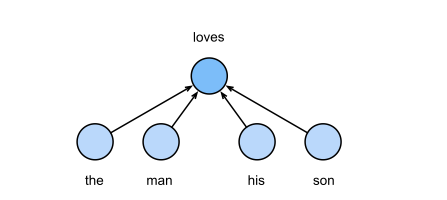
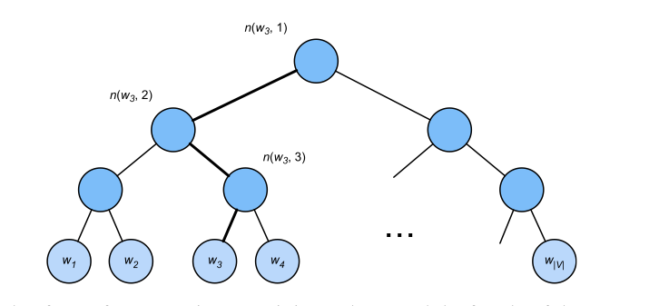
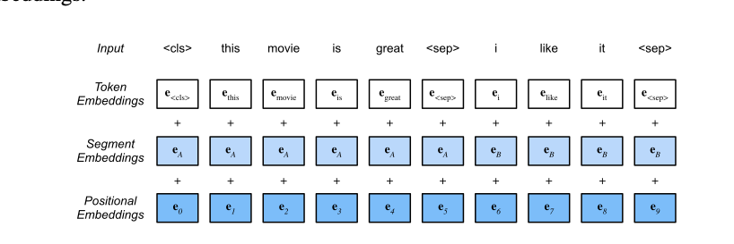

# Natural Language Processing: Pretraining

> **Ý chính trong một câu:** văn bản thì nhiều vô kể nhưng nhãn thì đắt, nên chương này dạy cách biến **chính văn bản** thành bài tập tự chấm — che một từ rồi đoán, hoặc dùng một từ đoán các từ xung quanh — để model học được biểu diễn tốt **trước khi** gặp nhiệm vụ thật.

## Mục tiêu học tập

Học xong chương, bạn có thể:

- [ ] giải thích vì sao one-hot vector **không** mã hoá được quan hệ nghĩa giữa các từ;
- [ ] phân biệt skip-gram và CBOW của {{term:word2vec|word2vec}}, và viết lại công thức softmax của từng model;
- [ ] chỉ ra chính xác **chỗ nào** trong gradient của skip-gram khiến việc training trở nên đắt;
- [ ] mô tả {{term:negative-sampling|negative sampling}} và {{term:hierarchical-softmax|hierarchical softmax}}, và nói rõ mỗi cách cắt giảm chi phí ra sao;
- [ ] giải thích subsampling từ tần suất cao và phân phối lấy mẫu mũ 0.75;
- [ ] dùng embedding đã pretrain để tìm từ gần nghĩa và giải bài toán loại suy (analogy);
- [ ] mô tả {{term:glove|GloVe}} và nói vì sao nó dùng squared loss trên thống kê đồng xuất hiện toàn corpus;
- [ ] mô tả {{term:fasttext|fastText}} và {{term:byte-pair-encoding|byte pair encoding}}, và nói mỗi cách giải bài toán từ hiếm thế nào;
- [ ] giải thích vì sao {{term:bert|BERT}} gộp được ưu điểm của ELMo và GPT;
- [ ] mô tả cách BERT dựng input, cùng hai nhiệm vụ pretraining là masked language modeling và next sentence prediction.

## Bản đồ chương


```text
ONE-HOT (rời rạc, mọi cặp từ đều "xa nhau như nhau")
 │
 ├─ 15.1 word2vec: học từ context cục bộ
 │     ├─ skip-gram: center → context
 │     └─ CBOW:      context → center
 │              │
 │              └─ 15.2 chi phí softmax quá lớn
 │                   ├─ negative sampling  (đổi sang bài toán nhị phân)
 │                   └─ hierarchical softmax (đi theo cây nhị phân)
 │
 ├─ 15.3–15.4 dựng dataset và pretrain word2vec thật
 │
 ├─ 15.5 GloVe: khớp thống kê đồng xuất hiện TOÀN corpus
 │
 ├─ 15.6 dưới mức từ: fastText (tổng các n-gram ký tự) và BPE
 │
 ├─ 15.7 dùng embedding: similarity và analogy
 │
 └─ 15.8–15.10 BERT: cùng một token nhưng vector ĐỔI theo ngữ cảnh
       ├─ MLM: đoán token bị che
       └─ NSP: đoán quan hệ hai câu
```

## Bức tranh tổng quan

**Vấn đề kinh tế của NLP:** văn bản thô có hàng tỉ từ và gần như miễn phí. Nhưng nhãn cho sentiment, hỏi đáp hay suy luận ngôn ngữ thì phải thuê người viết, nên rất đắt và rất ít.

{{term:self-supervised-learning|Self-supervised learning}} giải bài toán đó bằng cách lấy **chính văn bản làm đáp án**. Không ai phải gán nhãn gì cả: che một từ đi rồi bắt model đoán từ đó, hoặc lấy một từ để đoán các từ xung quanh. Cửa sổ trượt trên câu tự động sinh ra hàng triệu cặp training.

Cần nói rõ **pretraining không trực tiếp giải bài toán nào**. Nó tạo ra một **điểm khởi đầu giàu thông tin**. Model cho nhiệm vụ cụ thể sau đó gắn thêm một output head và {{term:fine-tuning|fine-tune}} với lượng dữ liệu có nhãn ít hơn nhiều — đúng tinh thần mục 14.2, chỉ là đổi từ ảnh sang chữ.

**Điều bạn cần mang theo:** softmax và cross-entropy (chương 4), embedding layer cùng cách nạp minibatch (chương 9), và kiến trúc Transformer encoder (chương 11) — BERT chính là một Transformer encoder được pretrain.

<!-- pagebreak -->

## 15.1 Word Embedding (word2vec)

### 15.1.1 One-Hot Vectors Are a Bad Choice

Với vocabulary $\mathcal{V}$ gồm $|\mathcal{V}|$ từ, one-hot vector của mỗi từ dài $|\mathcal{V}|$ và chỉ có **một** số 1 tại vị trí ứng với chỉ số của từ đó. Rất dễ tạo, nhưng có một khuyết điểm chí mạng.

Nhớ lại **cosine similarity** giữa hai vector $\mathbf{x}, \mathbf{y} \in \mathbb{R}^d$:

$$
\frac{\mathbf{x}^\top \mathbf{y}}{\lVert\mathbf{x}\rVert \, \lVert\mathbf{y}\rVert} \in [-1, 1].
$$

Với hai one-hot vector **khác nhau**, tử số luôn bằng 0 vì chúng không bao giờ có số 1 ở cùng vị trí. Vậy cosine similarity của **mọi** cặp từ khác nhau đều bằng 0.

Nói bằng lời: one-hot cho ta biết "hai token này có ID khác nhau", nhưng **không nói được** rằng "mèo" gần "chó" hơn gần "động cơ". Với ngôn ngữ, đó là mất mát rất lớn.

{{term:word-embedding|Word embedding}} thay one-hot bằng một vector **ngắn và dày đặc**, trong đó **hướng và vị trí** của vector mang thông tin thống kê về nghĩa. Kỹ thuật ánh xạ từ sang vector thực này còn gọi là word embedding, và {{term:word2vec|word2vec}} là công cụ kinh điển để làm việc đó.

### 15.1.2 Self-Supervised word2vec

Công cụ word2vec gồm **hai** model, và cả hai đều là model self-supervised:

- **skip-gram**: biết center word, đoán các context word;
- **CBOW** (continuous bag of words): biết các context word, đoán center word.

Nhãn không do con người viết ra — chúng đến từ chính cấu trúc của câu.

### 15.1.3 The Skip-Gram Model


**Trực giác.** Skip-gram giả định một từ có thể được dùng để sinh ra các từ xung quanh nó. Lấy chuỗi "the man loves his son", chọn "loves" làm center word với cửa sổ kích thước 2, model quan tâm tới xác suất sinh ra các context word "the", "man", "his", "son" khi biết "loves".

**Định nghĩa.** Mỗi từ có **hai** vector $d$ chiều, tuỳ vai trò của nó:

- $\mathbf{v}_i$ — vector khi từ $i$ đóng vai **center word**;
- $\mathbf{u}_i$ — vector khi từ $i$ đóng vai **context word**.

Xác suất có điều kiện sinh ra context word $w_o$ khi biết center word $w_c$ là một softmax trên tích vô hướng:

$$
P(w_o \mid w_c) = \frac{\exp(\mathbf{u}_o^\top \mathbf{v}_c)}{\sum_{i \in \mathcal{V}} \exp(\mathbf{u}_i^\top \mathbf{v}_c)} .
$$

**Đọc công thức này bằng lời:** tử số đo mức "hợp nhau" giữa center $w_c$ và context $w_o$ qua tích vô hướng — càng lớn thì hai vector càng cùng hướng. Mẫu số cộng qua **toàn bộ** vocabulary để chuẩn hoá thành xác suất. Vậy nếu hai từ hay đi cùng nhau, việc tối ưu sẽ đẩy tích vô hướng của chúng **lớn lên so với** các từ khác.

**Hàm mục tiêu.** Cho chuỗi văn bản dài $T$, gọi từ ở bước $t$ là $w^{(t)}$ và cửa sổ là $m$. Skip-gram cực đại likelihood:

$$
\prod_{t=1}^{T} \prod_{-m \le j \le m,\ j \ne 0} P\!\left(w^{(t+j)} \mid w^{(t)}\right),
$$

tương đương với cực tiểu negative log-likelihood:

$$
- \sum_{t=1}^{T} \sum_{-m \le j \le m,\ j \ne 0} \log P\!\left(w^{(t+j)} \mid w^{(t)}\right).
$$

<div class="algorithm-block" markdown="1">
<p class="algorithm-label">LUỒNG THUẬT TOÁN · SKIP-GRAM</p>

**Đầu vào:** chuỗi token, kích thước cửa sổ $m$, các vector center $\mathbf{v}$ và context $\mathbf{u}$.

1. Chọn token ở vị trí $t$ làm center word $w^{(t)}$.
2. Lấy từng token $w^{(t+j)}$ trong cửa sổ $-m \le j \le m,\ j \ne 0$ làm context word thật.
3. Với mỗi cặp center–context, tính score $\mathbf{u}_o^\top \mathbf{v}_c$, rồi dùng softmax để có $P(w_o \mid w_c)$.
4. Cộng $-\log P(w_o \mid w_c)$ vào loss; backpropagation cập nhật các vector sao cho cặp thật có score lớn tương đối so với các cặp khác.

**Đầu ra:** word embeddings. Trong ứng dụng NLP, các vector center $\mathbf{v}_i$ của skip-gram thường được dùng làm biểu diễn của từ.
</div>

**Gradient — và nút thắt.** Đạo hàm của log xác suất theo $\mathbf{v}_c$ là:

$$
\frac{\partial \log P(w_o \mid w_c)}{\partial \mathbf{v}_c}
= \mathbf{u}_o - \sum_{j \in \mathcal{V}} P(w_j \mid w_c)\, \mathbf{u}_j .
$$

Hãy nhìn kỹ số hạng thứ hai: nó là **trung bình có trọng số của mọi vector context trong vocabulary**. Nghĩa là mỗi lần cập nhật cho **một** cặp từ, ta phải quét qua **toàn bộ** từ điển. Đây chính là vấn đề mà mục 15.2 tồn tại để giải.

> **Cách nhớ:** skip-gram đi theo mũi tên **một center → nhiều context**. Chữ "skip" không có nghĩa là bỏ qua bước training nào; nó nói rằng model ghép center với những từ nằm rải rác quanh nó trong cửa sổ.

### 15.1.4 The Continuous Bag of Words (CBOW) Model



CBOW giống skip-gram nhưng **đảo chiều mũi tên**: center word được sinh ra dựa trên các context word xung quanh. Với cùng chuỗi "the man loves his son" và cửa sổ 2, CBOW quan tâm tới $P(\text{"loves"} \mid \text{"the"}, \text{"man"}, \text{"his"}, \text{"son"})$.

Vì có **nhiều** context word, CBOW **lấy trung bình** vector của chúng. Gọi $\bar{\mathbf{v}}_o = \frac{1}{2m}(\mathbf{v}_{o_1} + \cdots + \mathbf{v}_{o_{2m}})$, xác suất là:

$$
P(w_c \mid \mathcal{W}_o) = \frac{\exp(\mathbf{u}_c^\top \bar{\mathbf{v}}_o)}{\sum_{i \in \mathcal{V}} \exp(\mathbf{u}_i^\top \bar{\mathbf{v}}_o)} .
$$

> **Ranh giới của mô hình này:** chữ "bag" (túi) nói rằng phép lấy trung bình **vứt bỏ thứ tự** các từ trong cửa sổ. "Chó cắn người" và "người cắn chó" cho cùng một túi nếu chỉ nhìn đúng ba từ đó. Đây là một hạn chế thật, và chính là thứ mà positional encoding của Transformer (mục 11.6) khắc phục.

Trong CBOW, vai trò của hai bộ vector **hoán đổi** so với skip-gram: các vector **context** $\mathbf{v}$ được dùng làm biểu diễn của từ.

### 15.1.5 Summary

- Word vectors là vector dùng để biểu diễn từ, và kỹ thuật ánh xạ từ sang vector thực gọi là word embedding.
- Công cụ word2vec gồm cả model **skip-gram** và model **continuous bag of words**.
- Skip-gram giả định một từ có thể dùng để sinh ra các từ xung quanh nó trong chuỗi văn bản; continuous bag of words giả định một center word được sinh ra dựa trên các context word xung quanh.

### 15.1.6 Exercises

1. Độ phức tạp tính toán để tính **mỗi** gradient là bao nhiêu? Vấn đề gì sẽ xảy ra nếu kích thước từ điển rất lớn?
2. Một số cụm từ cố định trong tiếng Anh gồm nhiều từ, chẳng hạn "new york". Làm sao train word vector cho chúng? Gợi ý: xem Mục 4 trong bài báo word2vec (Mikolov và cộng sự, 2013).
3. Hãy suy ngẫm về thiết kế của word2vec qua ví dụ skip-gram. **Tích vô hướng** của hai word vector trong skip-gram có quan hệ thế nào với **cosine similarity**? Với một cặp từ có nghĩa gần nhau, vì sao cosine similarity của word vector (train bằng skip-gram) của chúng lại có thể cao?

<details markdown="1"><summary>Gợi ý</summary>

Câu 1: nhìn lại công thức gradient ở mục 15.1.3 — số hạng nào chứa một tổng chạy qua $\mathcal{V}$, và mỗi phần tử trong tổng đó là vector bao nhiêu chiều? Câu 3: viết $\mathbf{u}^\top\mathbf{v}$ theo độ dài và góc; rồi hỏi hai từ có context giống nhau sẽ nhận gradient như thế nào.
</details>

<details markdown="1"><summary>Lời giải</summary>

**Câu 1.** Độ phức tạp là $O(|\mathcal{V}| d)$ cho mỗi gradient.

Lý do đọc thẳng từ công thức: số hạng $\sum_{j \in \mathcal{V}} P(w_j \mid w_c) \mathbf{u}_j$ cộng qua **toàn bộ** $|\mathcal{V}|$ từ, mỗi từ là một vector $d$ chiều. Cộng thêm việc softmax cũng cần quét toàn vocabulary để tính mẫu số.

Khi từ điển lớn — sách nói thường là hàng trăm nghìn tới hàng triệu từ — chi phí này trở nên **khổng lồ**. Với $|\mathcal{V}| = 10^6$ và $d = 300$, mỗi cặp training cần 300 triệu phép nhân. Mà một corpus có hàng tỉ cặp. Đây chính xác là lý do mục 15.2 tồn tại.

**Câu 2.** Ý tưởng của bài báo: **phát hiện cụm trước khi train**, rồi coi mỗi cụm là **một token duy nhất**.

Cách phát hiện dựa trên thống kê — cụm nào xuất hiện cùng nhau thường xuyên hơn mức mà sự ngẫu nhiên giải thích được thì được gộp lại. Bài báo dùng một điểm số dạng:

$$
\text{score}(w_i, w_j) = \frac{\text{count}(w_i w_j) - \delta}{\text{count}(w_i) \times \text{count}(w_j)},
$$

trong đó $\delta$ là hệ số chiết khấu để tránh gộp các cụm quá hiếm. Cặp vượt ngưỡng được nối thành `new_york`, rồi train bình thường như một từ.

Chạy nhiều lượt sẽ bắt được cụm dài hơn: lượt một cho `new_york`, lượt hai có thể cho `new_york_times`.

**Câu 3.** Quan hệ đại số là:

$$
\mathbf{u}^\top \mathbf{v} = \lVert\mathbf{u}\rVert \, \lVert\mathbf{v}\rVert \cos\theta .
$$

Vậy tích vô hướng **gồm cả** độ dài lẫn góc, còn cosine similarity chỉ giữ lại **góc**. Đây là khác biệt thực tế quan trọng: từ tần suất cao thường có vector dài hơn, nên chúng có tích vô hướng lớn với gần như mọi từ. Chuẩn hoá bỏ độ dài đi mới so sánh công bằng được — và đó là lý do mục 15.7 dùng cosine chứ không dùng tích vô hướng thô.

Còn vì sao từ gần nghĩa lại có cosine cao? Vì **gradient**. Hàm mục tiêu đẩy $\mathbf{v}_c$ về phía các $\mathbf{u}_o$ của context word thật của nó. Hai từ xuất hiện trong **những context giống nhau** (ví dụ "mèo" và "chó" đều đi cùng "nuôi", "sủa/kêu", "thức ăn") sẽ liên tục nhận các cập nhật hướng về **cùng một tập** vector context. Sau nhiều lần lặp, hai vector center đó hội tụ về những hướng gần nhau.

Đây chính là **giả thuyết phân bố** trong ngôn ngữ học được hiện thực hoá: từ nào xuất hiện trong context giống nhau thì có nghĩa giống nhau.

**Bẫy thường gặp:** tưởng embedding "hiểu" nghĩa. Nó chỉ mã hoá **thống kê đồng xuất hiện**. Vì vậy các từ trái nghĩa như "tốt" và "xấu" thường có vector **rất gần nhau** — chúng xuất hiện trong những context gần như y hệt.
</details>

<!-- pagebreak -->

## 15.2 Approximate Training

### Trực giác

Mục 15.1 kết thúc bằng một vấn đề cụ thể: vì softmax phải chuẩn hoá trên toàn từ điển, gradient của cả skip-gram lẫn CBOW đều chứa một tổng chạy qua toàn bộ $\mathcal{V}$. Với từ điển hàng triệu từ, chi phí đó không chấp nhận được.

Mục này giới thiệu **hai phương pháp training gần đúng**: negative sampling và hierarchical softmax. Vì skip-gram và CBOW rất giống nhau, sách chỉ lấy skip-gram làm ví dụ.

### 15.2.1 Negative Sampling

**Ý tưởng cốt lõi:** thay vì hỏi "trong một triệu từ, từ nào là context đúng?" (bài toán phân loại một-trong-triệu), hãy hỏi "cặp từ này có phải cặp thật không?" (bài toán **nhị phân**). Bài toán nhị phân thì không cần chuẩn hoá trên toàn từ điển.

Negative sampling **sửa hàm mục tiêu**. Cho cửa sổ context của center word $w_c$, việc một từ (context) nào đó đến từ cửa sổ này được coi là một sự kiện với xác suất:

$$
P(D = 1 \mid w_c, w_o) = \sigma(\mathbf{u}_o^\top \mathbf{v}_c),
\qquad \text{với } \sigma(x) = \frac{1}{1 + \exp(-x)} .
$$

Nếu chỉ cực đại xác suất đồng thời của các sự kiện **dương** trên toàn văn bản:

$$
\prod_{t=1}^{T} \prod_{-m \le j \le m,\ j \ne 0} P\!\left(D = 1 \mid w^{(t)}, w^{(t+j)}\right),
$$

thì có một lỗ hổng mà sách chỉ ra rất thẳng: **hàm mục tiêu này chỉ xét các ví dụ dương**, nên nó đạt cực đại bằng 1 khi **mọi word vector đều bằng vô cùng**. Kết quả đó dĩ nhiên vô nghĩa — model chỉ cần làm mọi tích vô hướng thật lớn là xong, chẳng học được gì về quan hệ giữa các từ.

Để hàm mục tiêu có ý nghĩa, negative sampling **thêm các ví dụ âm** lấy từ một phân phối cho trước. Với mỗi sự kiện dương, ta lấy $K$ **noise word** không đến từ cửa sổ context, theo phân phối $P(w)$, và yêu cầu model nói "không" với chúng.

Xác suất đồng thời trở thành tích của một hạng tử dương và $K$ hạng tử âm:

$$
P\!\left(w^{(t+j)} \mid w^{(t)}\right)
= \sigma\!\left(\mathbf{u}_{o}^\top \mathbf{v}_c\right)
\prod_{k=1}^{K} \sigma\!\left(-\mathbf{u}_{n_k}^\top \mathbf{v}_c\right),
$$

trong đó $n_k$ là các noise word được lấy mẫu.

**Đây là chỗ tiết kiệm.** Chi phí gradient cho mỗi cặp giảm từ $O(|\mathcal{V}| d)$ xuống $O(Kd)$ — **tuyến tính theo $K$** chứ không theo kích thước từ điển. Với $K = 5$, đó là khác biệt giữa vài phép tính và hàng triệu phép tính.

Chú ý dấu trừ trong $\sigma(-\mathbf{u}_{n_k}^\top \mathbf{v}_c)$: với noise word, ta muốn tích vô hướng **nhỏ** (âm), nên đưa số đối vào sigmoid rồi vẫn cực đại như bình thường.

### 15.2.2 Hierarchical Softmax



**Ý tưởng cốt lõi:** thay vì một lựa chọn trong $|\mathcal{V}|$ khả năng, hãy làm một **chuỗi lựa chọn nhị phân** dọc theo một cây — như trò chơi "hai mươi câu hỏi".

Hierarchical softmax dùng **cây nhị phân**, trong đó mỗi **lá** đại diện cho một từ trong từ điển $\mathcal{V}$.

Gọi $L(w)$ là số nút (tính cả hai đầu) trên đường đi từ nút gốc tới lá biểu diễn từ $w$. Gọi $n(w, j)$ là nút thứ $j$ trên đường đi đó, với vector context của nó là $\mathbf{u}_{n(w,j)}$. Ví dụ trong hình, $L(w_3) = 4$.

Hierarchical softmax xấp xỉ xác suất có điều kiện bằng:

$$
P(w_o \mid w_c) = \prod_{j=1}^{L(w_o)-1}
\sigma\!\left(
\left[\!\left[ n(w_o, j+1) = \text{leftChild}\big(n(w_o, j)\big) \right]\!\right]
\cdot \mathbf{u}_{n(w_o, j)}^\top \mathbf{v}_c
\right),
$$

trong đó $\text{leftChild}(n)$ là nút con trái của nút $n$, và ký hiệu $[\![x]\!]$ bằng $1$ nếu $x$ đúng, bằng $-1$ nếu sai.

**Đọc công thức bằng lời:** tại mỗi nút trên đường đi, ta quyết định **rẽ trái hay rẽ phải**. Sigmoid cho xác suất rẽ trái; dấu $\pm 1$ lật nó thành xác suất rẽ phải khi cần. Xác suất của cả từ là **tích các xác suất rẽ** dọc đường.

**Ví dụ của sách.** Để tính $P(w_3 \mid w_c)$, ta cần tích vô hướng giữa $\mathbf{v}_c$ và các vector nút **không phải lá** trên đường đi từ gốc tới $w_3$. Đường đi đó rẽ **trái, phải, rồi trái**:

$$
P(w_3 \mid w_c) = \sigma\!\left(\mathbf{u}_{n(w_3,1)}^\top \mathbf{v}_c\right) \cdot
\sigma\!\left(-\mathbf{u}_{n(w_3,2)}^\top \mathbf{v}_c\right) \cdot
\sigma\!\left(\mathbf{u}_{n(w_3,3)}^\top \mathbf{v}_c\right).
$$

**Vì sao các xác suất vẫn cộng lại bằng 1?** Vì $\sigma(x) + \sigma(-x) = 1$: tại mỗi nút, xác suất rẽ trái cộng xác suất rẽ phải luôn bằng 1. Nhân dồn theo cây thì tổng xác suất của mọi lá vẫn bằng 1:

$$
\sum_{w \in \mathcal{V}} P(w \mid w_c) = 1 .
$$

**Đây là chỗ tiết kiệm.** Vì cây nhị phân cân bằng có $L(w_o) - 1$ ở cỡ $O(\log_2 |\mathcal{V}|)$, chi phí mỗi bước training giảm đáng kể so với softmax đầy đủ. Với $|\mathcal{V}| = 10^6$, $\log_2 |\mathcal{V}| \approx 20$ — tức khoảng 20 phép tính thay vì một triệu.

**So sánh hai cách:**

| | Negative sampling | Hierarchical softmax |
|---|---|---|
| Đổi bài toán thành | nhị phân "thật hay giả" | chuỗi rẽ nhánh trên cây |
| Chi phí mỗi cặp | $O(Kd)$ | $O(d \log_2 \vert\mathcal{V}\vert)$ |
| Có cần cấu trúc phụ? | không, chỉ cần phân phối lấy mẫu | có, phải dựng cây nhị phân |
| Xác suất còn chuẩn hoá? | **không** (chỉ là mục tiêu thay thế) | **có** (tổng vẫn bằng 1) |

### 15.2.3 Summary

- Negative sampling xây dựng hàm loss bằng cách xét các sự kiện độc lập lẫn nhau, liên quan tới cả ví dụ dương lẫn ví dụ âm. Chi phí tính toán khi training **tuyến tính theo số noise word**.
- Hierarchical softmax xây dựng hàm loss bằng đường đi từ nút gốc tới nút lá trên cây nhị phân. Chi phí tính toán khi training **phụ thuộc vào logarit của kích thước từ điển**.

### 15.2.4 Exercises

1. Ta có thể lấy mẫu noise word trong negative sampling như thế nào?
2. Hãy kiểm chứng rằng $\sum_{w \in \mathcal{V}} P(w \mid w_c) = 1$ đúng với hierarchical softmax.
3. Làm sao train continuous bag of words model bằng negative sampling và bằng hierarchical softmax? *(Bài tập bổ sung của người biên soạn, nối tiếp câu hỏi của sách.)*

<details markdown="1"><summary>Gợi ý</summary>

Câu 1: nếu lấy mẫu đều thì noise word gần như luôn là từ hiếm — điều đó khiến bài toán quá dễ hay quá khó? Câu 2: dùng $\sigma(x) + \sigma(-x) = 1$ và quy nạp từ lá lên gốc.
</details>

<details markdown="1"><summary>Lời giải</summary>

**Câu 1.** Theo khuyến nghị của bài báo word2vec, xác suất lấy mẫu $P(w)$ của một noise word được đặt bằng **tần suất tương đối của nó trong từ điển luỹ thừa 0.75**:

$$
P(w) \propto \text{freq}(w)^{0.75} .
$$

Vì sao lại là 0.75, một con số kỳ lạ? Nó nằm **giữa hai thái cực**:

- Mũ $1.0$ = lấy mẫu theo đúng tần suất thật. Khi đó noise word gần như luôn là "the", "a", "of" — model học được rất ít vì những từ này quá dễ loại.
- Mũ $0.0$ = lấy mẫu đều. Khi đó noise word gần như luôn là từ cực hiếm, cũng quá dễ loại theo hướng ngược lại.

Mũ $0.75$ **kéo phân phối phẳng lại một phần**: từ hiếm được lấy mẫu nhiều hơn tần suất thật của chúng, nhưng từ phổ biến vẫn xuất hiện đủ để có ích. Đây là một hằng số tìm được bằng thực nghiệm, không phải suy ra từ lý thuyết.

Trong thí nghiệm của sách, $K = 5$ noise word cho mỗi cặp center–context.

**Câu 2.** Chứng minh bằng quy nạp trên cây, dùng $\sigma(x) + \sigma(-x) = 1$.

Xét một nút không phải lá $n$ bất kỳ, với vector $\mathbf{u}_n$. Xác suất đi tiếp sang con trái là $\sigma(\mathbf{u}_n^\top \mathbf{v}_c)$ và sang con phải là $\sigma(-\mathbf{u}_n^\top \mathbf{v}_c)$. Hai số này cộng lại bằng 1, nên **tại mỗi nút, toàn bộ khối xác suất đi vào nút đó được chia hết cho hai con**, không mất mát gì.

Bắt đầu từ gốc với khối xác suất bằng 1 và đi xuống: mỗi tầng vẫn bảo toàn tổng bằng 1. Vì mỗi từ trong $\mathcal{V}$ ứng với đúng **một** lá, và mọi lá cùng nhận hết khối xác suất, ta có $\sum_{w \in \mathcal{V}} P(w \mid w_c) = 1$.

**Kiểm tra bằng ví dụ nhỏ:** cây có gốc và hai lá $w_1$, $w_2$. Khi đó $P(w_1) = \sigma(\mathbf{u}^\top\mathbf{v}_c)$ và $P(w_2) = \sigma(-\mathbf{u}^\top\mathbf{v}_c)$, tổng đúng bằng 1. ✓

**Câu 3.** Cả hai cách chuyển sang CBOW gần như nguyên vẹn, chỉ cần thay $\mathbf{v}_c$ (vector của một center word) bằng $\bar{\mathbf{v}}_o$ (trung bình vector của các context word).

- **Negative sampling cho CBOW:** ví dụ dương là $\sigma(\mathbf{u}_c^\top \bar{\mathbf{v}}_o)$ với $w_c$ là center word thật; $K$ ví dụ âm dùng các từ lấy mẫu từ $P(w)$ thay cho $w_c$.
- **Hierarchical softmax cho CBOW:** đi theo đúng cây đó, nhưng đường đi là tới lá của **center word**, và mọi tích vô hướng dùng $\bar{\mathbf{v}}_o$.

Điểm mấu chốt: hai kỹ thuật này tấn công **phép chuẩn hoá softmax**, mà cả skip-gram lẫn CBOW đều dùng cùng một phép chuẩn hoá đó. Vì thế chúng dùng được cho cả hai model.

**Bẫy thường gặp:** tưởng negative sampling vẫn cho ra xác suất hợp lệ. Nó **không** — nó là một hàm mục tiêu thay thế cho ra embedding tốt, chứ không cho ra một phân phối chuẩn hoá. Hierarchical softmax thì giữ được tính chất đó.
</details>

<!-- pagebreak -->

## 15.3 The Dataset for Pretraining Word Embeddings

### Trực giác

Hai mục trước là lý thuyết. Mục này biến lý thuyết thành **một pipeline dữ liệu chạy được**, và mỗi bước trong pipeline đều tương ứng với một quyết định thiết kế đã bàn ở trên.

### 15.3.1 Reading the Dataset

Sách dùng **Penn Tree Bank (PTB)** — một corpus nhỏ lấy từ *Wall Street Journal*, chia sẵn thành tập train, validation và test. Trong định dạng gốc, mỗi dòng là một câu, và các từ hiếm được thay bằng token `<unk>`.

Vocabulary chỉ giữ những từ xuất hiện **ít nhất 10 lần**.

### 15.3.2 Subsampling

Dữ liệu văn bản thường có những từ tần suất rất cao như "the", "a", "in" — trong các corpus lớn chúng có thể xuất hiện **hàng tỉ lần**. Sách nêu hai lý do để xử lý chúng:

1. **Chúng cho rất ít tín hiệu hữu ích.** Hãy xét từ "chip" trong một cửa sổ context: việc nó đồng xuất hiện với từ tần suất thấp "intel" có ích cho training hơn nhiều so với đồng xuất hiện với từ tần suất cao "a".
2. **Training với khối lượng từ (tần suất cao) khổng lồ thì chậm.**

Vì vậy các từ tần suất cao được **subsample**: mỗi từ có chỉ số trong dataset sẽ bị **loại bỏ** với xác suất

$$
P(w_i) = \max\left(1 - \sqrt{\frac{t}{f(w_i)}},\ 0\right),
$$

trong đó $f(w_i)$ là **tỉ lệ** giữa số lần xuất hiện của từ $w_i$ và tổng số từ trong dataset, còn $t$ là một hyperparameter ($10^{-4}$ trong thí nghiệm của sách).

**Đọc công thức bằng lời:** chỉ khi tần suất tương đối $f(w_i) > t$ thì từ (tần suất cao) đó mới có thể bị loại, vì nếu $f(w_i) \le t$ thì $t/f(w_i) \ge 1$, căn bậc hai $\ge 1$, và $\max(\cdot, 0) = 0$. Và **tần suất tương đối càng cao thì xác suất bị loại càng lớn**.

**Kiểm tra bằng số.** Lấy $t = 10^{-4}$:

| Từ | $f(w_i)$ | $\sqrt{t/f}$ | $P$(bị loại) |
|---|---|---|---|
| "the" | $0.05$ | $\sqrt{0.002} \approx 0.045$ | $\approx 0.955$ |
| một từ trung bình | $10^{-4}$ | $1$ | $0$ |
| một từ hiếm | $10^{-6}$ | $10$ | $0$ (bị kẹp về 0) |

Vậy "the" bị loại khoảng 95% số lần xuất hiện, còn từ hiếm thì **không bao giờ** bị loại. Đúng như mong muốn.

Chú ý subsampling **loại bỏ các lần xuất hiện**, không xoá từ khỏi vocabulary. Nó cũng có tác dụng phụ đáng quý: cửa sổ context sau khi loại bớt từ đệm sẽ **với xa hơn** trong câu, nên bắt được quan hệ ở khoảng cách lớn hơn.

### 15.3.3 Extracting Center Words and Context Words

Với mỗi câu, mỗi từ lần lượt được lấy làm center word, còn context word lấy từ cửa sổ quanh nó. Kích thước cửa sổ được lấy **ngẫu nhiên** trong khoảng từ 1 tới `max_window_size` — cách này làm cho từ ở gần center có xác suất được chọn cao hơn từ ở xa, tức là **ngầm gán trọng số theo khoảng cách** mà không cần thêm công thức nào.

### 15.3.4 Negative Sampling

Với mỗi cặp center word và context word, ta lấy ngẫu nhiên $K$ noise word ($K = 5$ trong thí nghiệm). Theo khuyến nghị của bài báo word2vec, xác suất lấy mẫu $P(w)$ của noise word $w$ được đặt bằng **tần suất tương đối của nó trong từ điển luỹ thừa 0.75**.

Sách dùng một lớp `RandomGenerator` để **lấy mẫu sẵn theo lô** thay vì gọi bộ sinh ngẫu nhiên từng lần — một tối ưu nhỏ nhưng đáng kể, vì lấy mẫu là thao tác lặp lại hàng triệu lần.

### 15.3.5 Loading Training Examples in Minibatches

Đây là chỗ có một chi tiết kỹ thuật thực sự quan trọng. Mỗi ví dụ training gồm một center word cùng với **context word và noise word của nó** — nhưng số lượng này **khác nhau giữa các ví dụ**, vì cửa sổ được lấy ngẫu nhiên.

Để gom thành minibatch, ta phải **đệm** tất cả về cùng độ dài, và dùng một **mask** để loại phần đệm khỏi phép tính loss:

```python
#@save
def batchify(data):
    """Gom các ví dụ có độ dài khác nhau thành minibatch cho word2vec."""
    max_len = max(len(c) + len(n) for _, c, n in data)
    centers, contexts_negatives, masks, labels = [], [], [], []
    for center, context, negative in data:
        cur_len = len(context) + len(negative)
        centers += [center]
        # Đệm bằng 0 cho đủ max_len.
        contexts_negatives += [context + negative + [0] * (max_len - cur_len)]
        # masks = 1 ở vị trí thật, 0 ở vị trí đệm -> loại phần đệm khỏi loss.
        masks += [[1] * cur_len + [0] * (max_len - cur_len)]
        # labels = 1 cho context thật, 0 cho noise và cho phần đệm.
        labels += [[1] * len(context) + [0] * (max_len - len(context))]
    return (torch.tensor(centers).reshape((-1, 1)),
            torch.tensor(contexts_negatives), torch.tensor(masks),
            torch.tensor(labels))
```

Ba tensor phụ trợ này dễ lẫn, nên hãy phân biệt rõ:

| Tensor | Ý nghĩa | Dùng để làm gì |
|---|---|---|
| `contexts_negatives` | context thật **và** noise word, đã đệm | đầu vào của model |
| `masks` | 1 ở vị trí thật, 0 ở vị trí đệm | **loại phần đệm** khỏi loss |
| `labels` | 1 cho context thật, 0 cho noise | **đáp án** của bài toán nhị phân |

Chú ý `masks` và `labels` khác nhau: một noise word có `mask = 1` (nó là dữ liệu thật, phải tính loss) nhưng `label = 0` (câu trả lời đúng là "không phải context").

### 15.3.6 Putting It All Together

Hàm `load_data_ptb` gói toàn bộ pipeline: đọc dataset, subsample, trích cặp center–context, lấy noise word, và trả về một data iterator cùng vocabulary.

### 15.3.7 Summary

- Từ tần suất cao có thể **không** hữu ích lắm khi training. Ta có thể subsample chúng để tăng tốc độ training.
- Để tính toán hiệu quả, ta nạp các ví dụ theo **minibatch** và định nghĩa những biến phụ trợ để phân biệt phần thật với phần đệm.

### 15.3.8 Exercises

1. Thời gian chạy của đoạn mã trong mục này thay đổi thế nào nếu **không** dùng subsampling?
2. Lớp `RandomGenerator` lưu sẵn $k$ kết quả lấy mẫu ngẫu nhiên. Hãy đặt $k$ sang các giá trị khác và xem nó ảnh hưởng thế nào tới tốc độ nạp dữ liệu.
3. Còn hyperparameter nào khác trong đoạn mã của mục này có thể ảnh hưởng tới tốc độ nạp dữ liệu?

<details markdown="1"><summary>Gợi ý</summary>

Câu 1: subsampling loại bỏ một tỉ lệ lớn các token — điều đó ảnh hưởng thế nào tới **số lượng cặp** center–context phải tạo? Câu 3: hãy rà lại từng bước của pipeline và hỏi bước nào có một con số điều khiển khối lượng công việc.
</details>

<details markdown="1"><summary>Lời giải</summary>

**Câu 1.** Thời gian chạy **tăng đáng kể**.

Lý do là hiệu ứng nhân: subsampling loại bỏ khoảng 95% các lần xuất hiện của từ siêu phổ biến, mà những từ này chiếm một tỉ lệ rất lớn trong tổng số token. Bỏ subsampling thì số token tăng vọt, và vì mỗi token sinh ra tới $2m$ cặp center–context, số **cặp** cũng tăng theo. Mỗi cặp lại kéo theo $K = 5$ lần lấy mẫu noise word.

Tệ hơn nữa là phần công việc thêm vào hầu như **vô ích**: đó là những cặp kiểu ("the", "a") mà mục 15.3.2 đã giải thích là cho rất ít tín hiệu. Ta trả thêm rất nhiều thời gian để học được rất ít.

**Câu 2.** `RandomGenerator` lấy sẵn $k$ mẫu một lần rồi phát dần, thay vì gọi bộ sinh ngẫu nhiên cho từng noise word. Đây là đánh đổi **bộ nhớ lấy tốc độ**:

- $k$ **nhỏ** (ví dụ 1): mỗi noise word tốn một lời gọi `random.choices` riêng, chi phí gọi hàm áp đảo — chậm nhất.
- $k$ **lớn** (ví dụ 10 000): số lời gọi giảm mạnh, tốc độ tăng rõ. Nhưng lợi ích **bão hoà** — từ một ngưỡng nào đó, chi phí gọi hàm đã không còn là nút thắt nên tăng thêm $k$ chẳng giúp gì, chỉ tốn bộ nhớ.

Đây là một ví dụ sạch của quy luật lợi ích giảm dần: tối ưu chỉ đáng làm tới khi nút thắt chuyển sang chỗ khác.

**Câu 3.** Rà theo pipeline, các hyperparameter ảnh hưởng tốc độ nạp dữ liệu:

| Hyperparameter | Ảnh hưởng |
|---|---|
| `max_window_size` | mỗi token sinh tới $2m$ cặp, nên tác động gần như tuyến tính |
| `num_noise_words` ($K$) | mỗi cặp cần $K$ lần lấy mẫu, cũng tuyến tính |
| `batch_size` | quyết định số lần gọi `batchify` |
| ngưỡng tần suất tối thiểu (`min_freq = 10`) | vocabulary nhỏ hơn thì bảng lấy mẫu nhỏ hơn |
| $t$ trong subsampling | $t$ nhỏ hơn thì loại mạnh tay hơn, còn ít token hơn |
| `num_workers` của `DataLoader` | song song hoá phần nạp dữ liệu |

Trong số này, `max_window_size` và `num_noise_words` có tác động lớn nhất vì chúng **nhân với nhau**: tổng công việc tỉ lệ với $2m \times (1 + K)$ trên mỗi token.

**Bẫy thường gặp:** chỉnh các hyperparameter này để chạy nhanh hơn rồi quên rằng chúng cũng **đổi cả bài toán học**. Giảm $K$ từ 5 xuống 1 đúng là nhanh hơn, nhưng embedding thu được sẽ kém hơn.
</details>

<!-- pagebreak -->

## 15.4 Pretraining word2vec

### 15.4.1 The Skip-Gram Model

Model được hiện thực bằng {{term:embedding-layer|embedding layer}} và phép nhân ma trận theo lô. Trước hết, embedding layer ánh xạ chỉ số của token sang feature vector của nó — trọng số của layer này là một ma trận với số hàng bằng kích thước từ điển và số cột bằng số chiều vector.

```python
embed = nn.Embedding(num_embeddings=20, embedding_dim=4)
# Parameter embedding_weight (torch.Size([20, 4]), dtype=torch.float32)

x = torch.tensor([[1, 2, 3], [4, 5, 6]])
embed(x).shape        # torch.Size([2, 3, 4])
```

Quy tắc shape đáng nhớ: input shape `(a, b)` cho ra output shape `(a, b, d)` — embedding layer chỉ **thêm một chiều** vào cuối.

Phần lan truyền xuôi nhận vào chỉ số center word `center` shape `(batch_size, 1)` và chỉ số context/noise `contexts_and_negatives` shape `(batch_size, max_len)`:

```python
def skip_gram(center, contexts_and_negatives, embed_v, embed_u):
    v = embed_v(center)                     # (batch_size, 1, d)
    u = embed_u(contexts_and_negatives)     # (batch_size, max_len, d)
    # bmm: nhân ma trận theo lô -> (batch_size, 1, max_len)
    pred = torch.bmm(v, u.permute(0, 2, 1))
    return pred
```

Kết quả `pred` có shape `(batch_size, 1, max_len)`: với mỗi ví dụ, đó là **tích vô hướng giữa center vector và từng vector trong danh sách context+noise**. Đúng bằng các score mà negative sampling cần.

### 15.4.2 Training

Loss là **binary cross-entropy có mask** — đây là chỗ biến `masks` của mục 15.3.5 phát huy tác dụng:

```python
class SigmoidBCELoss(nn.Module):
    """Binary cross-entropy có mask, dùng cho negative sampling."""
    def forward(self, inputs, target, mask=None):
        out = nn.functional.binary_cross_entropy_with_logits(
            inputs, target, weight=mask, reduction="none")
        # Chia cho số vị trí THẬT để các ví dụ dài ngắn khác nhau đóng góp cân bằng.
        return out.mean(dim=1)
```

Chú ý phép chia ở cuối: nếu lấy trung bình trên cả `max_len`, ví dụ nào bị đệm nhiều sẽ bị loãng loss một cách vô lý.

Cấu hình của sách: `embed_size = 100`, `lr = 0.002`, `num_epochs = 5`. Model có **hai** embedding layer — một cho vector center, một cho vector context.

### 15.4.3 Applying Word Embeddings

Sau khi train xong, ta dùng cosine similarity trên các vector **center** để tìm từ gần nghĩa:

```python
def get_similar_tokens(query_token, k, embed):
    W = embed.weight.data
    x = W[vocab[query_token]]
    # Cộng 1e-9 để tránh chia cho 0; đây là công thức cosine similarity.
    cos = torch.mv(W, x) / torch.sqrt(torch.sum(W * W, dim=1) *
                                      torch.sum(x * x) + 1e-9)
    topk = torch.topk(cos, k=k + 1)[1].cpu().numpy().astype('int32')
    for i in topk[1:]:                   # bỏ phần tử đầu vì đó là chính query
        print(f'cosine sim={float(cos[i]):.3f}: {vocab.to_tokens(i)}')
```

Với `'chip'` làm query, model trả về các từ như `microprocessor`, `intel` — dấu hiệu embedding đã bắt được quan hệ trong miền công nghệ.

### 15.4.4 Summary

- Ta có thể train một model skip-gram với negative sampling bằng cách dùng embedding layers và phép nhân ma trận theo lô.
- Các ứng dụng của word embedding bao gồm tìm những từ **gần nghĩa** về mặt ngữ nghĩa với một từ cho trước, dựa trên cosine similarity của word vector.

### 15.4.5 Exercises

1. Dùng model đã train, hãy tìm từ gần nghĩa cho các từ input khác. Bạn có cải thiện kết quả bằng cách chỉnh hyperparameters không?
2. Khi corpus training rất lớn, ta thường lấy mẫu context word và noise word cho các center word **trong minibatch hiện tại** mỗi khi cập nhật tham số. Nói cách khác, cùng một center word có thể có context word hoặc noise word khác nhau ở các epoch khác nhau. Cách này có lợi ích gì? Hãy thử hiện thực nó.

<details markdown="1"><summary>Gợi ý</summary>

Câu 1: `embed_size = 100` và 5 epoch trên PTB là khá khiêm tốn — thử nghĩ xem hyperparameter nào giới hạn chất lượng nhiều nhất. Câu 2: so sánh bộ nhớ cần để lưu sẵn mọi cặp với bộ nhớ khi sinh cặp lúc cần; và nghĩ xem việc mỗi epoch thấy cặp khác nhau có tác dụng gì giống với augmentation.
</details>

<details markdown="1"><summary>Lời giải</summary>

**Câu 1.** Có thể cải thiện theo nhiều hướng, xếp theo mức tác động:

- **Tăng `embed_size`** từ 100 lên 200–300. Với 100 chiều, model khó tách được nhiều quan hệ ngữ nghĩa cùng lúc.
- **Tăng `num_epochs`**: 5 epoch trên PTB là rất ít; embedding thường tiếp tục cải thiện tới 15–20 epoch.
- **Tăng `max_window_size`**: cửa sổ rộng hơn bắt quan hệ **chủ đề** (chip–công nghệ); cửa sổ hẹp hơn bắt quan hệ **cú pháp** (chip–chips).
- **Corpus lớn hơn**: PTB nhỏ, nên các từ hiếm không đủ ví dụ để học vector tốt. Đây thường là giới hạn thật sự.

Một quan sát đáng chú ý: từ hiếm luôn cho kết quả kém nhất, và đó chính là động cơ của mục 15.6 về subword embedding.

**Câu 2.** Có **ba** lợi ích, và cả ba đều đáng nêu.

**Lợi ích 1 — bộ nhớ.** Lưu sẵn mọi cặp center–context–noise của một corpus lớn cần dung lượng khổng lồ: mỗi token sinh tới $2m$ cặp, mỗi cặp kèm $K$ noise word. Sinh cặp ngay lúc cần thì chỉ tốn bộ nhớ cho một minibatch.

**Lợi ích 2 — đa dạng, giống như augmentation.** Nếu cặp được cố định trước, model thấy **đúng** những cặp đó ở mọi epoch. Nếu lấy mẫu lại mỗi lần, cùng một center word sẽ có cửa sổ và noise word khác nhau qua các epoch — model thấy nhiều biến thể hơn, nên ít overfit vào một cách ghép cụ thể. Đây chính là tinh thần của image augmentation ở mục 14.1, áp dụng cho văn bản.

**Lợi ích 3 — corpus streaming.** Cách này cho phép train trên dữ liệu **không vừa bộ nhớ**, đọc tới đâu sinh cặp tới đó.

Cách hiện thực: chuyển phần lấy mẫu từ bước tiền xử lý sang bên trong `__getitem__` của `Dataset` (hoặc vào `batchify`), để nó chạy lại mỗi khi một ví dụ được lấy ra.

**Bẫy thường gặp:** cố định seed ngẫu nhiên ở đầu mỗi epoch để "kết quả tái lập được", vô tình làm mất chính lợi ích đa dạng vừa nói.
</details>

<!-- pagebreak -->

## 15.5 Word Embedding with Global Vectors (GloVe)

### Trực giác

word2vec nhìn ngôn ngữ qua **cửa sổ nhỏ**, mỗi lần một cửa sổ. Nhưng toàn bộ thông tin thống kê của corpus — từ nào hay đi với từ nào, bao nhiêu lần — có thể **tính trước một lần** rồi dùng mãi. Làm vậy vừa nhanh hơn vừa tận dụng được thông tin toàn cục.

{{term:glove|GloVe}} (Global Vectors) đi theo hướng đó.

### 15.5.1 Skip-Gram with Global Corpus Statistics

Để nối hai thế giới, sách viết lại skip-gram theo ngôn ngữ của thống kê đồng xuất hiện.

Ký hiệu $q_{ij} = P(w_j \mid w_i)$ là xác suất có điều kiện của skip-gram. Xét từ $w_i$ xuất hiện nhiều lần trong corpus. Gộp **tất cả** context word ở mọi nơi mà $w_i$ làm center lại, ta được một **multiset** $\mathcal{C}_i$ — tức một tập cho phép phần tử lặp lại, và số lần lặp của một phần tử gọi là **bội** (multiplicity) của nó.

**Ví dụ của sách.** Giả sử $w_i$ xuất hiện hai lần trong corpus, và chỉ số của các context word trong hai cửa sổ đó là $k, j, m, k$ và $k, l, k, j$. Vậy multiset

$$
\mathcal{C}_i = \{j, j, k, k, k, k, l, m\},
$$

trong đó bội của $j, k, l, m$ lần lượt là $2, 4, 1, 1$.

Gọi $x_{ij}$ là bội của từ $w_j$ trong $\mathcal{C}_i$ — chính là **số lần đồng xuất hiện toàn cục** của $w_j$ trong cửa sổ context của $w_i$ trên toàn corpus. Với các thống kê này, loss của skip-gram viết lại được thành:

$$
- \sum_{i \in \mathcal{V}} \sum_{j \in \mathcal{V}} x_{ij} \log q_{ij}.
$$

Đặt $x_i = \sum_k x_{ik}$ và $p_{ij} = x_{ij}/x_i$, ta được

$$
- \sum_{i \in \mathcal{V}} x_i \sum_{j \in \mathcal{V}} p_{ij} \log q_{ij},
$$

trong đó $\sum_j p_{ij} \log q_{ij}$ chính là **cross-entropy** giữa phân phối thật $p_{ij}$ và phân phối dự đoán $q_{ij}$, còn $x_i$ là trọng số.

Nhìn theo cách này, skip-gram hoá ra là **khớp phân phối đồng xuất hiện bằng cross-entropy**. Nhưng sách chỉ ra cross-entropy có vấn đề với corpus lớn: nó đòi hỏi chuẩn hoá trên toàn từ điển (đắt), và nó **phạt rất nặng** các sự kiện hiếm — trong khi phần lớn các cặp từ đơn giản là không bao giờ đồng xuất hiện.

### 15.5.2 The GloVe Model

GloVe thực hiện **ba thay đổi** so với công thức trên:

<div class="algorithm-block" markdown="1">
<p class="algorithm-label">BA THAY ĐỔI CỦA GLOVE</p>

1. Dùng **các biến $x'_{ij} = x_{ij}$ và $p'_{ij} = p_{ij}$ không chuẩn hoá**, lấy **logarit** của cả hai, nên số hạng squared loss trở thành
   $$\left(\log p'_{ij} - \log q'_{ij}\right)^2 = \left(\mathbf{u}_j^\top \mathbf{v}_i - \log x_{ij}\right)^2 .$$
2. Thêm **hai tham số vô hướng** cho mỗi từ $w_i$: bias của center word $b_i$ và bias của context word $c_i$.
3. Thay trọng số của mỗi số hạng loss bằng **hàm trọng số** $h(x_{ij})$, trong đó $h(x)$ tăng trên đoạn $[0, 1]$.

</div>

Gộp lại, train GloVe là cực tiểu hàm loss:

$$
\sum_{i \in \mathcal{V}} \sum_{j \in \mathcal{V}} h(x_{ij})
\left( \mathbf{u}_j^\top \mathbf{v}_i + b_i + c_j - \log x_{ij} \right)^2 .
$$

**Mỗi thay đổi giải quyết đúng một vấn đề:**

- **Bỏ chuẩn hoá và lấy log** biến bài toán từ "khớp phân phối" thành "hồi quy trên log đếm". Không còn phải cộng qua toàn từ điển, nên **tính trước được** và nhanh hơn hẳn.
- **Bias** hấp thụ tần suất riêng của từng từ. Nếu không có chúng, vector phải tự gánh cả thông tin "từ này phổ biến" lẫn "từ này liên quan tới từ kia".
- **Hàm trọng số $h$** làm hai việc cùng lúc: nó giảm tầm quan trọng của các đồng xuất hiện hiếm (vốn nhiễu), và **đặt trần** cho các đồng xuất hiện cực phổ biến để chúng không áp đảo. Sách cho biết $h(x) = 0$ khi $x = 0$, nên các cặp **không bao giờ** đồng xuất hiện bị bỏ hẳn khỏi tổng — một tiết kiệm rất lớn vì ma trận đồng xuất hiện cực kỳ thưa.

**Một hệ quả đẹp về tính đối xứng.** Trong GloVe, nếu hai từ đồng xuất hiện thì chúng đồng xuất hiện **theo cả hai chiều**, nên $x_{ij} = x_{ji}$. Khác với word2vec (nơi hai bộ vector đóng vai trò khác nhau), ở GloVe **center word vector và context word vector là tương đương về mặt toán học** với mọi từ. Trên thực tế, do khởi tạo khác nhau nên hai vector của cùng một từ vẫn khác nhau, nên GloVe **cộng chúng lại** làm vector cuối cùng.

### 15.5.3 Interpreting GloVe from the Ratio of Co-occurrence Probabilities

Đây là phần đẹp nhất về mặt trực giác. Ý tưởng: **không phải xác suất đồng xuất hiện mà là TỈ SỐ của chúng mới mang thông tin**.

Sách trích bảng từ bài báo GloVe, với $w_i = $ "ice" và $w_j = $ "steam":

| $w_k =$ | solid | gas | water | fashion |
|---|---|---|---|---|
| $p_1 = P(w_k \mid \text{ice})$ | 0.00019 | 0.000066 | 0.003 | 0.000017 |
| $p_2 = P(w_k \mid \text{steam})$ | 0.000022 | 0.00078 | 0.0022 | 0.000018 |
| $p_1/p_2$ | **8.9** | **0.085** | **1.36** | **0.96** |

Ba nhận xét của sách, đọc thẳng từ hàng cuối:

- Với $w_k$ liên quan tới "ice" nhưng **không** liên quan tới "steam" (như $w_k = $ solid), ta kỳ vọng tỉ số **lớn**, chẳng hạn 8.9.
- Với $w_k$ liên quan tới "steam" nhưng không liên quan tới "ice" (như $w_k = $ gas), ta kỳ vọng tỉ số **nhỏ**, chẳng hạn 0.085.
- Với $w_k$ liên quan tới **cả hai** (như $w_k = $ water), hoặc **không** liên quan tới cả hai (như $w_k = $ fashion), ta kỳ vọng tỉ số **gần 1**, chẳng hạn 1.36 và 0.96.

Vẻ đẹp nằm ở chỗ: nhìn riêng $p_1$ hay $p_2$ thì rất khó phân biệt "liên quan" với "phổ biến" — "water" có xác suất cao với cả hai chỉ vì nó là từ phổ biến. **Tỉ số triệt tiêu mất yếu tố phổ biến**, chỉ để lại thông tin phân biệt. Và vì hàm mũ biến hiệu thành thương, việc hồi quy trên **log** của số đếm chính là cách làm cho tỉ số này trở thành đại lượng mà model học.

### 15.5.4 Summary

- Model skip-gram có thể được diễn giải bằng thống kê corpus toàn cục như số lần đồng xuất hiện giữa các từ.
- Cross-entropy loss có thể **không** phải lựa chọn tốt để đo khác biệt giữa hai phân phối xác suất, đặc biệt với corpus lớn. GloVe dùng **squared loss** để khớp các thống kê corpus toàn cục đã được tính trước.
- Center word vector và context word vector **tương đương về mặt toán học** với mọi từ trong GloVe.
- GloVe có thể được diễn giải từ **tỉ số** của các xác suất đồng xuất hiện giữa các từ.

### 15.5.5 Exercises

1. Nếu hai từ $w_i$ và $w_j$ đồng xuất hiện trong cùng một cửa sổ context, ta có thể dùng **khoảng cách** của chúng trong chuỗi văn bản để thiết kế lại cách tính xác suất có điều kiện $p_{ij}$ như thế nào? Gợi ý: xem Mục 4.2 của bài báo GloVe (Pennington và cộng sự, 2014).
2. Với một từ bất kỳ, bias của center word và bias của context word của nó có **tương đương về mặt toán học** trong GloVe không? Vì sao?

<details markdown="1"><summary>Gợi ý</summary>

Câu 1: một từ cách center 1 chỗ và một từ cách center 5 chỗ có nên đóng góp như nhau vào $x_{ij}$ không? Câu 2: viết lại hàm loss của GloVe rồi hoán đổi vai trò $i \leftrightarrow j$; dùng tính chất $x_{ij} = x_{ji}$.
</details>

<details markdown="1"><summary>Lời giải</summary>

**Câu 1.** Ý tưởng: **gán trọng số cho mỗi lần đồng xuất hiện theo nghịch đảo khoảng cách**. Thay vì cộng 1 vào $x_{ij}$ cho mỗi lần gặp, ta cộng $1/d$ với $d$ là khoảng cách giữa hai từ trong câu:

$$
x_{ij} = \sum_{\text{mỗi lần đồng xuất hiện}} \frac{1}{d}.
$$

Lý do rất hợp trực giác: từ đứng ngay cạnh center thường liên quan chặt hơn từ cách đó năm chỗ. Bài báo GloVe dùng đúng cách giảm dần $1/d$ này.

Đáng chú ý là word2vec đạt được hiệu ứng tương tự bằng một **cơ chế khác**: mục 15.3.3 lấy kích thước cửa sổ **ngẫu nhiên**, nên từ ở gần có xác suất lọt vào cửa sổ cao hơn từ ở xa. Hai thiết kế khác nhau, cùng một trực giác.

**Câu 2.** **Có** — chúng tương đương về mặt toán học, cùng lý do khiến $\mathbf{u}$ và $\mathbf{v}$ tương đương.

Lập luận: hàm loss của GloVe là

$$
\sum_{i,j} h(x_{ij}) \left( \mathbf{u}_j^\top \mathbf{v}_i + b_i + c_j - \log x_{ij} \right)^2 .
$$

Hoán đổi $i \leftrightarrow j$ trong mọi số hạng. Vì $x_{ij} = x_{ji}$ (đồng xuất hiện là quan hệ đối xứng) và $\mathbf{u}_j^\top \mathbf{v}_i = \mathbf{v}_i^\top \mathbf{u}_j$, hàm loss trở về **chính nó**, chỉ khác là vai trò của $b$ và $c$ đã hoán đổi. Vậy không có gì trong hàm mục tiêu phân biệt $b_i$ với $c_i$ — chúng đóng vai trò hoàn toàn đối xứng.

Tuy nhiên — và đây là điểm dễ nhầm — **tương đương về mặt toán học không có nghĩa là bằng nhau về mặt số học**. Do khởi tạo ngẫu nhiên khác nhau, hai giá trị hội tụ về hai số khác nhau. Đó chính xác là lý do GloVe **cộng** hai vector lại thay vì chỉ lấy một: phép cộng lấy trung bình hai lời giải ngẫu nhiên của cùng một bài toán đối xứng, nên ổn định hơn từng cái riêng lẻ.

**Bẫy thường gặp:** tưởng $x_{ij} = x_{ji}$ là hiển nhiên đúng với mọi định nghĩa cửa sổ. Nó chỉ đúng khi cửa sổ **đối xứng** quanh center word. Với cửa sổ chỉ nhìn về phía trước, ma trận đồng xuất hiện không còn đối xứng và lập luận trên đổ vỡ.
</details>

<!-- pagebreak -->

## 15.6 Subword Embedding

### Trực giác

Cả word2vec lẫn GloVe đều coi mỗi từ là một **đơn vị nguyên khối**. Điều đó gây ra hai vấn đề:

1. "help", "helps", "helping" là ba từ khác nhau, học ba vector **hoàn toàn độc lập** — dù rõ ràng chúng chia sẻ nghĩa.
2. Một từ **không có trong từ điển** thì không có vector nào cả.

Mục này giới thiệu hai cách nhìn vào **bên trong** từ.

### 15.6.1 The fastText Model

Nhớ lại cách word2vec biểu diễn từ: trong cả skip-gram lẫn CBOW, các dạng biến cách khác nhau của cùng một từ được biểu diễn bằng những vector khác nhau **không chia sẻ tham số**. Để tận dụng thông tin hình thái học, model {{term:fasttext|fastText}} đề xuất cách tiếp cận **subword embedding**, trong đó một subword là một **$n$-gram ký tự** (Bojanowski và cộng sự, 2017).

Thay vì học biểu diễn ở mức từ, fastText có thể xem như **skip-gram ở mức subword**, trong đó mỗi **center word** được biểu diễn bằng **tổng các vector subword của nó**.

**Ví dụ của sách — từ "where".** Trước hết thêm ký tự đặc biệt "&lt;" và "&gt;" vào đầu và cuối từ để phân biệt tiền tố và hậu tố với các subword khác. Sau đó trích các $n$-gram ký tự. Với $n = 3$, ta được mọi subword độ dài 3:

$$
\texttt{<wh},\ \texttt{whe},\ \texttt{her},\ \texttt{ere},\ \texttt{re>}
$$

cùng với subword đặc biệt $\texttt{<where>}$.

Trong fastText, với từ $w$ bất kỳ, gọi $\mathcal{G}_w$ là hợp của mọi subword độ dài **từ 3 tới 6** của nó và subword đặc biệt của nó. Vocabulary là hợp các subword của **mọi** từ. Gọi $\mathbf{z}_g$ là vector của subword $g$ trong từ điển, vector $\mathbf{v}_w$ của từ $w$ với vai trò center word trong skip-gram là:

$$
\mathbf{v}_w = \sum_{g \in \mathcal{G}_w} \mathbf{z}_g .
$$

Phần còn lại của fastText **giống hệt** skip-gram.

**Đánh đổi, đúng như sách nêu:** so với skip-gram, vocabulary của fastText lớn hơn nên số tham số nhiều hơn. Ngoài ra, để tính biểu diễn của một từ phải cộng tất cả vector subword của nó, nên độ phức tạp tính toán cao hơn. **Bù lại**, nhờ tham số được chia sẻ giữa các từ có cấu trúc giống nhau, các từ hiếm và thậm chí **từ ngoài từ điển** có thể nhận được biểu diễn tốt hơn.

Điểm cuối là điều quan trọng nhất: gặp từ chưa từng thấy, fastText vẫn dựng được vector cho nó bằng cách cộng các subword mà nó **đã** biết. word2vec thì bó tay hoàn toàn.

### 15.6.2 Byte Pair Encoding

Trong fastText, mọi subword phải có **độ dài xác định** (từ 3 tới 6), nên **không thể định trước kích thước vocabulary**. Để có subword **độ dài thay đổi** trong một vocabulary **cỡ cố định**, ta dùng thuật toán nén {{term:byte-pair-encoding|byte pair encoding}} (BPE) để trích subword (Sennrich và cộng sự, 2015).

<div class="algorithm-block" markdown="1">
<p class="algorithm-label">LUỒNG THUẬT TOÁN · BYTE PAIR ENCODING</p>

**Đầu vào:** từ điển ánh xạ từ sang tần suất; số lần hợp nhất mong muốn.

1. **Khởi tạo** vocabulary ký hiệu gồm mọi chữ cái thường tiếng Anh, một ký hiệu kết thúc từ đặc biệt `'_'`, và một ký hiệu không xác định `'[UNK]'`. Mỗi từ được viết thành dãy ký tự cách nhau bởi dấu cách.
2. **Đếm** tần suất của mọi cặp ký hiệu **liên tiếp** trong toàn bộ từ điển. Vì hiệu quả, các cặp **vắt qua ranh giới từ không được xét**.
3. **Hợp nhất** cặp liên tiếp có tần suất cao nhất thành một ký hiệu mới dài hơn, thêm nó vào vocabulary.
4. Lặp bước 2–3 đủ số lần mong muốn.

**Đầu ra:** một tập ký hiệu độ dài thay đổi, dùng để tách từ thành subword.
</div>

**Vì sao cần ký hiệu `'_'`?** Nó được gắn vào cuối mỗi từ để ta **khôi phục được ranh giới từ** từ dãy ký hiệu đầu ra. Nhờ đó dãy "a_ tall er_ man" đọc ngược lại được thành "a taller man".

**Ví dụ của sách.** Với `raw_token_freqs = {'fast_': 4, 'faster_': 3, 'tall_': 5, 'taller_': 4}`, BPE lần lượt hợp nhất các cặp phổ biến nhất. Sau vài vòng, nó khám phá ra `'er_'` như một ký hiệu duy nhất — thuật toán **tự học ra hậu tố so sánh hơn** của tiếng Anh mà không hề được dạy về ngữ pháp. Đó là điều đáng chú ý nhất: BPE **thuần tuý thống kê**, nhưng cái nó tìm ra lại thường trùng với đơn vị hình thái học.

BPE và các biến thể của nó đã được dùng làm biểu diễn input trong các model pretraining NLP phổ biến như GPT-2 và RoBERTa.

Khi tách một từ mới, BPE thử các ký hiệu từ **dài tới ngắn**; phần nào không khớp ký hiệu nào thì gán `'[UNK]'`.

### 15.6.3 Summary

- Model fastText đề xuất cách tiếp cận subword embedding. Dựa trên model skip-gram của word2vec, nó biểu diễn một center word bằng **tổng các vector subword** của nó.
- Byte pair encoding thực hiện phân tích thống kê trên tập dữ liệu training để khám phá các ký hiệu phổ biến bên trong từ. Là một cách tiếp cận **tham lam**, byte pair encoding lặp lại việc hợp nhất cặp ký hiệu liên tiếp có tần suất cao nhất.
- Subword embedding có thể cải thiện chất lượng biểu diễn của **từ hiếm** và **từ ngoài từ điển**.

### 15.6.4 Exercises

1. Lấy ví dụ, trong tiếng Anh có khoảng $3 \times 10^8$ $6$-gram khả dĩ. Vấn đề gì xảy ra khi có quá nhiều subword? Làm sao khắc phục? Gợi ý: xem cuối Mục 3.2 của bài báo fastText (Bojanowski và cộng sự, 2017).
2. Làm sao thiết kế một model subword embedding dựa trên **continuous bag-of-words**?
3. Để có vocabulary cỡ $m$, cần bao nhiêu **phép hợp nhất** nếu vocabulary ký hiệu ban đầu có cỡ $n$?
4. Làm sao mở rộng ý tưởng byte pair encoding để trích **cụm từ**?

<details markdown="1"><summary>Gợi ý</summary>

Câu 1: mỗi subword cần một vector riêng — nhân với 300 chiều thì bảng embedding to bao nhiêu? Câu 3: mỗi phép hợp nhất thêm **đúng một** ký hiệu mới vào vocabulary. Câu 4: BPE hiện chỉ hợp nhất trong phạm vi một từ; muốn có cụm từ thì phải nới ràng buộc nào?
</details>

<details markdown="1"><summary>Lời giải</summary>

**Câu 1.** Vấn đề là **bùng nổ bộ nhớ**. Nếu mỗi trong $3 \times 10^8$ subword cần một vector 300 chiều kiểu float32, bảng embedding sẽ cần khoảng $3 \times 10^8 \times 300 \times 4$ byte ≈ **360 GB**. Không khả thi.

Cách khắc phục của bài báo fastText là **hashing**: ánh xạ mỗi subword vào một trong $B$ ô (bucket) bằng hàm băm, với $B$ cố định (mặc định khoảng 2 triệu), rồi chỉ lưu $B$ vector. Bảng embedding trở nên có kích thước **cố định và biết trước**, không phụ thuộc số subword thực tế.

Cái giá phải trả là **va chạm**: hai subword khác nhau có thể rơi vào cùng một ô và buộc phải chia sẻ vector. Trên thực tế điều này ít gây hại vì phần lớn subword rất hiếm, và các subword thường gặp thì đủ nhiều tín hiệu để lấn át nhiễu từ va chạm.

**Câu 2.** Đối xứng với fastText: fastText áp subword cho **center word** của skip-gram; bản CBOW sẽ áp subword cho **context word**.

Cụ thể, mỗi context word $w_o$ được biểu diễn bằng tổng các vector subword của nó, $\mathbf{v}_{w_o} = \sum_{g \in \mathcal{G}_{w_o}} \mathbf{z}_g$; sau đó lấy trung bình các vector context như CBOW thường làm, rồi dự đoán center word. Center word vẫn được dự đoán ở **mức từ**, vì nó là mục tiêu phân loại.

**Câu 3.** Cần **$m - n$** phép hợp nhất.

Lý do rất gọn: mỗi phép hợp nhất lấy hai ký hiệu liền nhau, tạo **đúng một** ký hiệu mới và thêm nó vào vocabulary. Các ký hiệu cũ **vẫn được giữ** (chúng còn cần cho những từ khác), nên mỗi phép hợp nhất làm vocabulary tăng đúng 1. Từ $n$ tới $m$ vậy cần $m - n$ phép.

Đây chính là tính chất khiến BPE hấp dẫn so với fastText: ta **đặt trước** kích thước vocabulary, rồi chạy đúng số phép hợp nhất tương ứng.

**Câu 4.** Mấu chốt là **bỏ ràng buộc "không vắt qua ranh giới từ"**.

BPE hiện chỉ xét các cặp bên trong một từ, vì mục tiêu là tìm subword. Muốn tìm cụm từ, hãy để thuật toán xét cả cặp **ký hiệu liền nhau vắt qua ranh giới từ**. Khi đó "new" + "york" là một cặp hợp lệ, và nếu nó đủ phổ biến thì sẽ được hợp nhất thành `new_york` — đúng thứ mà bài tập 15.1.6 câu 2 cần.

Hai điều cần chỉnh khi làm vậy:

1. **Chi phí tính toán tăng mạnh**, vì tập cặp ứng viên lớn hơn rất nhiều. Đây chính là lý do BPE gốc cấm vắt qua ranh giới "vì hiệu quả".
2. Nên dùng một **điểm số** thay cho tần suất thuần, chẳng hạn PMI, để tránh hợp nhất các cặp chỉ phổ biến vì cả hai từ đều phổ biến (ví dụ "of the").

**Bẫy thường gặp:** tưởng ký hiệu của BPE tương ứng với hình vị ngôn ngữ học. Thường thì có, nhưng không có gì bảo đảm — BPE tối ưu **tần suất**, không tối ưu ngữ nghĩa.
</details>

<!-- pagebreak -->

## 15.7 Word Similarity and Analogy

### Trực giác

Ta đã pretrain word2vec trên một corpus nhỏ ở mục 15.4. Mục này dùng embedding **đã pretrain trên corpus lớn** và kiểm tra xem chúng thực sự nắm được gì, qua hai bài kiểm tra kinh điển.

### 15.7.1 Loading Pretrained Word Vectors

Sách cung cấp các bộ GloVe pretrained với số chiều khác nhau (50, 100, 300) và một bộ fastText 300 chiều. Lớp `TokenEmbedding` nạp chúng và cho tra cứu theo token.

```python
glove_6b50d = TokenEmbedding('glove.6b.50d')
len(glove_6b50d)                    # 400000
glove_6b50d.token_to_idx['beautiful']   # 3367
```

### 15.7.2 Applying Pretrained Word Vectors

**Word Similarity — tìm từ gần nghĩa.** Vẫn dùng cosine similarity, nhưng lần này trên embedding chất lượng cao:

```python
def knn(W, x, k):
    # Cộng 1e-9 để ổn định số học khi mẫu số rất nhỏ.
    cos = torch.mv(W, x.reshape(-1,)) / (
        torch.sqrt(torch.sum(W * W, axis=1) + 1e-9) *
        torch.sqrt((x * x).sum()))
    _, topk = torch.topk(cos, k=k)
    return topk, [cos[int(i)] for i in topk]


def get_similar_tokens(query_token, k, embed):
    # Lấy k+1 vì phần tử gần nhất luôn là chính query token.
    topk, cos = knn(embed.idx_to_vec, embed[[query_token]], k + 1)
    for i, c in zip(topk[1:], cos[1:]):
        print(f'cosine sim={float(c):.3f}: {embed.idx_to_token[int(i)]}')
```

Với `'chip'`, GloVe trả về `chips`, `intel`, `electronics`. Với `'beautiful'`: `lovely`, `gorgeous`, `wonderful`.

**Word Analogy — bài toán loại suy.** Đây là kết quả gây ấn tượng nhất của word embedding. Bài toán có dạng $a : b :: c : d$ — "$a$ với $b$ thì như $c$ với gì?". Ví dụ "man" với "woman" thì như "son" với "daughter".

Cách giải: tìm từ có vector gần nhất với $\mathbf{v}_c + \mathbf{v}_b - \mathbf{v}_a$.

```python
def get_analogy(token_a, token_b, token_c, embed):
    vecs = embed[[token_a, token_b, token_c]]
    x = vecs[1] - vecs[0] + vecs[2]      # v_b - v_a + v_c
    topk, cos = knn(embed.idx_to_vec, x, 1)
    return embed.idx_to_token[int(topk[0])]


get_analogy('man', 'woman', 'son', glove_6b50d)          # 'daughter'
get_analogy('beijing', 'china', 'tokyo', glove_6b50d)     # 'japan'
get_analogy('bad', 'worst', 'big', glove_6b50d)           # 'biggest'
get_analogy('do', 'did', 'go', glove_6b50d)               # 'went'
```

**Vì sao phép trừ vector lại làm được điều này?** Vì hiệu $\mathbf{v}_b - \mathbf{v}_a$ mã hoá **quan hệ** giữa hai từ, tách khỏi danh tính của chúng. "woman − man" xấp xỉ vector "chuyển giống"; cộng nó vào "son" thì cho ra vùng của "daughter". Bốn ví dụ trên trải qua bốn loại quan hệ khác nhau: giống, thủ đô–quốc gia, so sánh nhất, và thì quá khứ — cho thấy embedding bắt được cả quan hệ ngữ nghĩa lẫn quan hệ cú pháp.

> **Ranh giới cần nêu rõ:** đây là quy luật **thống kê**, không phải suy luận logic. Analogy chỉ hoạt động tốt với những quan hệ được thể hiện dày đặc trong corpus, và **thất bại** với quan hệ hiếm. Nó cũng **tái tạo các thiên kiến** có trong dữ liệu — đây là phát hiện đã được ghi nhận rộng rãi với word embedding, và là lý do phải cẩn trọng khi dùng chúng trong các quyết định ảnh hưởng tới con người. *(Ghi chú của người biên soạn, ngoài phạm vi trình bày của sách.)*

### 15.7.3 Summary

- Word vector đã pretrain có thể áp dụng cho các bài toán **word similarity** và **word analogy**.

### 15.7.4 Exercises

1. Hãy kiểm tra kết quả của fastText bằng `TokenEmbedding('wiki.en')`.
2. Khi vocabulary **cực kỳ lớn**, làm sao tìm từ gần nghĩa hoặc giải bài toán loại suy **nhanh hơn**?

<details markdown="1"><summary>Gợi ý</summary>

Câu 1: fastText dùng subword — hãy thử cả từ hiếm và từ sai chính tả, rồi so với GloVe. Câu 2: `knn` hiện tính similarity với **mọi** từ rồi mới lấy top-k; độ phức tạp là bao nhiêu, và ta có thực sự cần kết quả **chính xác** không?
</details>

<details markdown="1"><summary>Lời giải</summary>

**Câu 1.** Với các từ thông dụng, fastText và GloVe cho kết quả khá giống nhau. Khác biệt xuất hiện ở **từ hiếm, từ ghép, và từ sai chính tả**: vì fastText cộng các vector subword, nó vẫn dựng được biểu diễn hợp lý cho từ chưa từng thấy, trong khi GloVe chỉ trả về `<unk>`.

Mặt trái: fastText đôi khi trả về những từ **giống về hình thức nhưng khác về nghĩa**, vì chúng chia sẻ $n$-gram ký tự. Đây là hệ quả trực tiếp của việc biểu diễn là tổng các subword.

**Câu 2.** Hàm `knn` hiện tại tính similarity với **toàn bộ** vocabulary rồi mới lấy top-$k$, tức $O(|\mathcal{V}| d)$ cho mỗi truy vấn. Với 400 000 từ và 300 chiều, đó là 120 triệu phép nhân — quá chậm nếu phải phục vụ nhiều truy vấn.

Câu hỏi then chốt là: ta có cần kết quả **chính xác tuyệt đối** không? Thường là không, nên có thể dùng **approximate nearest neighbour** (ANN):

- **Chuẩn hoá trước.** Chia mọi vector cho chuẩn của nó **một lần**, khi đó cosine similarity trở thành tích vô hướng thuần — bỏ được căn bậc hai ở mỗi truy vấn.
- **Locality-sensitive hashing (LSH):** băm sao cho vector gần nhau có xác suất cao rơi vào cùng ô, rồi chỉ tìm trong ô đó.
- **Chỉ mục dạng đồ thị (HNSW):** dựng đồ thị các lân cận rồi duyệt tham lam về phía truy vấn. Đây là cách phổ biến nhất hiện nay, cho tốc độ nhanh gấp hàng trăm lần với độ chính xác gần như nguyên vẹn.
- **Lượng tử hoá tích (product quantization):** nén vector thành mã ngắn, đánh đổi độ chính xác lấy tốc độ và bộ nhớ.

Với riêng bài toán analogy còn một tối ưu nhỏ: chỉ cần tìm trong các từ **thông dụng nhất** (ví dụ 50 000 từ đầu), vì đáp án của analogy gần như không bao giờ là một từ hiếm.

**Bẫy thường gặp:** quên loại chính các từ trong câu hỏi ra khỏi kết quả analogy. Nếu không, `get_analogy('man', 'woman', 'son', ...)` rất dễ trả về chính "son" hoặc "woman", vì chúng nằm ngay cạnh vector đích.
</details>

<!-- pagebreak -->

## 15.8 Bidirectional Encoder Representations from Transformers (BERT)

### 15.8.1 From Context-Independent to Context-Sensitive

Mọi thứ từ đầu chương tới giờ có một hạn chế chung. word2vec và GloVe đều gán **cùng một** vector pretrained cho **cùng một** từ, bất kể ngữ cảnh của từ đó là gì.

Nói chính xác: biểu diễn **context-independent** của token $x$ là một hàm $f(x)$ chỉ nhận $x$ làm input.

Vì ngôn ngữ tự nhiên đầy hiện tượng đa nghĩa và ngữ nghĩa phức tạp, hạn chế này rất rõ. Ví dụ của sách: từ "crane" trong "a crane is flying" (con sếu đang bay) và "a crane driver came" (người lái cần cẩu đã tới) có nghĩa **hoàn toàn khác nhau**; cùng một từ đáng lẽ phải được gán những biểu diễn khác nhau tuỳ ngữ cảnh.

Điều này thúc đẩy các biểu diễn **{{term:context-sensitive-representation|context-sensitive}}**: biểu diễn của một token là hàm $f(x, c(x))$ phụ thuộc **cả** $x$ **lẫn** ngữ cảnh $c(x)$ của nó. Các biểu diễn context-sensitive phổ biến gồm TagLM, CoVe, và **ELMo** (Embeddings from Language Models).

**ELMo** nhận cả chuỗi làm input và gán một biểu diễn cho mỗi từ. Cụ thể, ELMo **kết hợp toàn bộ biểu diễn của các layer trung gian** từ một bidirectional LSTM đã pretrain. Biểu diễn ELMo sau đó được **thêm vào** model có giám sát sẵn có của nhiệm vụ downstream như một feature bổ sung, chẳng hạn bằng cách nối biểu diễn ELMo với biểu diễn gốc (ví dụ GloVe) của token.

Điểm cần chú ý về cách dùng ELMo: mọi trọng số trong bidirectional LSTM pretrained đều bị **đóng băng** sau khi biểu diễn ELMo được thêm vào; còn model có giám sát sẵn có thì được **thiết kế riêng cho từng nhiệm vụ**. Nhờ tận dụng các model tốt nhất lúc đó cho từng nhiệm vụ, việc thêm ELMo đã cải thiện trạng thái tốt nhất trên **sáu** nhiệm vụ NLP: sentiment analysis, natural language inference, semantic role labeling, coreference resolution, named entity recognition, và question answering.

### 15.8.2 From Task-Specific to Task-Agnostic

ELMo cải thiện đáng kể lời giải cho nhiều nhiệm vụ, nhưng mỗi lời giải vẫn phụ thuộc vào một **kiến trúc riêng cho nhiệm vụ đó**. Trên thực tế, chế tác một kiến trúc riêng cho *mọi* nhiệm vụ NLP là việc không hề đơn giản.

Model **GPT** (Generative Pre-Training) là một nỗ lực thiết kế model **task-agnostic** (không phụ thuộc nhiệm vụ) cho biểu diễn context-sensitive. Xây trên **Transformer decoder**, GPT pretrain một language model để biểu diễn chuỗi văn bản. Khi áp GPT vào nhiệm vụ downstream, output của language model được đưa vào một linear output layer thêm vào để dự đoán nhãn.

Đối lập rõ rệt với ELMo (đóng băng tham số của model pretrained), GPT **fine-tune toàn bộ** tham số của Transformer decoder pretrained trong quá trình học có giám sát của nhiệm vụ downstream. GPT được đánh giá trên **mười hai** nhiệm vụ và cải thiện trạng thái tốt nhất ở **chín** trong số đó, với thay đổi kiến trúc tối thiểu.

**Nhưng** do bản chất tự hồi quy của language model, GPT **chỉ nhìn về phía trước** (trái sang phải). Trong câu "i went to the bank to deposit cash" và "i went to the bank to sit down", vì "bank" nhạy cảm với ngữ cảnh **bên phải** nó, GPT sẽ trả về **cùng một** biểu diễn cho "bank" dù nghĩa hai câu khác nhau.

### 15.8.3 BERT: Combining the Best of Both Worlds

Tổng kết lại hai hạn chế:

| | Mã hoá ngữ cảnh | Kiến trúc |
|---|---|---|
| ELMo | **hai chiều** ✓ | riêng cho từng nhiệm vụ ✗ |
| GPT | trái sang phải ✗ | **task-agnostic** ✓ |
| **BERT** | **hai chiều** ✓ | **task-agnostic** ✓ |

Gộp ưu điểm của cả hai, {{term:bert|BERT}} (Bidirectional Encoder Representations from Transformers) mã hoá ngữ cảnh **hai chiều** và chỉ cần **thay đổi kiến trúc tối thiểu** cho rất nhiều nhiệm vụ NLP. Dùng một **Transformer encoder** pretrained, BERT biểu diễn được mọi token dựa trên ngữ cảnh hai chiều của nó.


Khi học có giám sát cho nhiệm vụ downstream, BERT giống GPT ở hai điểm. **Thứ nhất**, biểu diễn BERT được đưa vào một output layer thêm vào, với thay đổi kiến trúc tối thiểu tuỳ bản chất nhiệm vụ — chẳng hạn dự đoán cho **mỗi token** so với dự đoán cho **cả chuỗi**. **Thứ hai**, mọi tham số của Transformer encoder pretrained đều được fine-tune, còn output layer thêm vào thì được train từ đầu.

BERT tiếp tục cải thiện trạng thái tốt nhất trên **mười một** nhiệm vụ NLP thuộc các nhóm: (i) phân loại văn bản đơn, (ii) phân loại cặp văn bản, (iii) hỏi đáp, và (iv) gán nhãn token.

### 15.8.4 Input Representation

Trong NLP, một số nhiệm vụ nhận **một** văn bản làm input (ví dụ sentiment analysis), số khác nhận **một cặp** chuỗi văn bản (ví dụ natural language inference). Chuỗi input của BERT biểu diễn được **cả hai** một cách rõ ràng, không nhập nhằng:

- **Văn bản đơn:** chuỗi input BERT là nối của token phân loại đặc biệt `<cls>`, các token của chuỗi văn bản, và token phân tách đặc biệt `<sep>`.
- **Cặp văn bản:** chuỗi input BERT là nối của `<cls>`, token của chuỗi thứ nhất, `<sep>`, token của chuỗi thứ hai, và `<sep>`.

> **Lưu ý thuật ngữ của sách:** cần phân biệt rõ "**BERT input sequence**" với các loại "sequence" khác. Một BERT input sequence có thể chứa **một** text sequence hoặc **hai** text sequence.

Để phân biệt cặp văn bản, các **segment embedding** học được $\mathbf{e}_A$ và $\mathbf{e}_B$ được **cộng vào** token embedding của chuỗi thứ nhất và chuỗi thứ hai. Với input văn bản đơn, chỉ dùng $\mathbf{e}_A$.

```python
#@save
def get_tokens_and_segments(tokens_a, tokens_b=None):
    """Lấy token của chuỗi input BERT và segment ID tương ứng."""
    tokens = ['<cls>'] + tokens_a + ['<sep>']
    # 0 và 1 đánh dấu segment A và segment B.
    segments = [0] * (len(tokens_a) + 2)
    if tokens_b is not None:
        tokens += tokens_b + ['<sep>']
        segments += [1] * (len(tokens_b) + 1)
    return tokens, segments
```

BERT chọn Transformer encoder làm kiến trúc hai chiều của nó. Như thường thấy ở Transformer encoder, positional embedding được cộng vào **mọi vị trí** của chuỗi input BERT. Nhưng khác Transformer encoder gốc (dùng công thức sin/cos cố định), BERT dùng positional embedding **học được**.

Tổng kết lại bằng một câu của sách: **embedding của chuỗi input BERT là tổng của token embedding, segment embedding, và positional embedding.**



### 15.8.5 Pretraining Tasks

Lan truyền xuôi của `BERTEncoder` cho biểu diễn BERT của mỗi token, kể cả các token đặc biệt được chèn vào. Việc pretraining gồm **hai nhiệm vụ**.

**Masked Language Modeling.** Một language model thường dự đoán token dựa trên ngữ cảnh **bên trái** nó (mục 9.3). Để mã hoá ngữ cảnh **hai chiều**, BERT **che ngẫu nhiên** một số token rồi dùng token từ ngữ cảnh hai chiều để đoán token bị che, theo kiểu self-supervised. Nhiệm vụ này gọi là **masked language model**.

**15%** số token được chọn ngẫu nhiên làm token bị che để dự đoán. Nhưng ở đây có một vấn đề tinh tế mà cách xử lý của BERT rất đáng học.

Cách đơn giản nhất là luôn thay token bị che bằng `<mask>`. Vấn đề: token nhân tạo `<mask>` **không bao giờ xuất hiện khi fine-tuning**. Model sẽ học "chỉ cần chú ý mạnh khi thấy `<mask>`", một thói quen vô dụng lúc dùng thật. Đây gọi là **lệch pha giữa pretraining và fine-tuning**.

Để tránh, nếu một token được chọn để che (ví dụ "great" trong "this movie is great"), thì trong input nó được thay bằng:

- token đặc biệt `<mask>` trong **80%** số lần (→ "this movie is &lt;mask&gt;");
- một token **ngẫu nhiên** trong **10%** số lần (→ "this movie is drink");
- chính **token nhãn không đổi** trong **10%** số lần (→ "this movie is great").

Chú ý rằng trong 10% của 15% số lần, một token ngẫu nhiên được chèn vào. **Nhiễu thỉnh thoảng này khuyến khích BERT bớt thiên lệch về phía token bị che** khi mã hoá ngữ cảnh hai chiều — đặc biệt trong trường hợp token nhãn được giữ nguyên.

Nói cách khác: vì model **không biết chắc** token đang nhìn thấy có đúng hay không, nó buộc phải xây dựng biểu diễn ngữ cảnh cho **mọi** vị trí, chứ không chỉ cho vị trí có `<mask>`.

**Next Sentence Prediction.** Masked language modeling mã hoá được ngữ cảnh hai chiều cho việc biểu diễn từ, nhưng nó **không mô hình hoá tường minh quan hệ logic giữa các cặp văn bản**. Để giúp hiểu quan hệ giữa hai chuỗi văn bản, BERT thêm một nhiệm vụ **phân loại nhị phân** vào pretraining: **next sentence prediction**.

Khi sinh cặp câu cho pretraining: **một nửa** số lần chúng thật sự là hai câu liên tiếp, nhãn "True"; **nửa còn lại**, câu thứ hai được lấy **ngẫu nhiên** từ corpus, nhãn "False".

Nhờ self-attention trong Transformer encoder, biểu diễn BERT của token đặc biệt `<cls>` **mã hoá cả hai câu** trong input. Vì vậy output layer của bộ phân loại chỉ cần đọc biểu diễn của `<cls>`.

### 15.8.6 Putting It All Together

Khi pretrain BERT, hàm loss cuối cùng là **tổ hợp tuyến tính** của hai hàm loss: một cho masked language modeling và một cho next sentence prediction. Lớp `BERTModel` gộp `BERTEncoder`, `MaskLM` và `NextSentencePred`.

### 15.8.7 Summary

- Các model word embedding như word2vec và GloVe là **context-independent**: chúng gán cùng một vector pretrained cho cùng một từ bất kể ngữ cảnh. Chúng khó xử lý tốt hiện tượng đa nghĩa hay ngữ nghĩa phức tạp.
- Với các biểu diễn context-sensitive như ELMo và GPT, biểu diễn của từ phụ thuộc vào ngữ cảnh.
- ELMo mã hoá ngữ cảnh hai chiều nhưng dùng kiến trúc riêng cho từng nhiệm vụ; GPT task-agnostic nhưng mã hoá ngữ cảnh từ trái sang phải.
- BERT gộp ưu điểm của cả hai: nó mã hoá ngữ cảnh hai chiều **và** chỉ cần thay đổi kiến trúc tối thiểu cho nhiều nhiệm vụ NLP.
- Embedding của chuỗi input BERT là **tổng** của token embedding, segment embedding và positional embedding.
- Pretraining BERT gồm hai nhiệm vụ: masked language modeling và next sentence prediction. Nhiệm vụ đầu mã hoá được ngữ cảnh hai chiều để biểu diễn từ; nhiệm vụ sau mô hình hoá tường minh quan hệ logic giữa các cặp văn bản.

### 15.8.8 Exercises

1. Với mọi điều kiện khác như nhau, một masked language model sẽ cần **nhiều hơn hay ít hơn** số bước pretraining để hội tụ so với một language model trái-sang-phải? Vì sao?
2. Trong hiện thực gốc của BERT, positionwise feed-forward network trong `BERTEncoder` và fully connected layer trong `MaskLM` đều dùng **Gaussian error linear unit (GELU)** làm hàm kích hoạt. Hãy tìm hiểu khác biệt giữa GELU và ReLU.

<details markdown="1"><summary>Gợi ý</summary>

Câu 1: đếm xem mỗi câu cho bao nhiêu **tín hiệu học** ở mỗi model — language model trái-sang-phải dự đoán bao nhiêu phần trăm token, còn MLM thì bao nhiêu? Câu 2: vẽ hai hàm quanh $x = 0$ và so sánh đạo hàm của chúng.
</details>

<details markdown="1"><summary>Lời giải</summary>

**Câu 1.** Masked language model cần **nhiều** bước pretraining hơn.

Lý do nằm ở **mật độ tín hiệu học**. Một language model trái-sang-phải dự đoán **mọi** token: với câu 100 từ, nó nhận 100 tín hiệu học. Masked language model chỉ dự đoán **15%** số token: cùng câu đó chỉ cho 15 tín hiệu. Mỗi lượt đi qua dữ liệu, MLM học được ít hơn khoảng 6–7 lần.

Cái giá đó được trả để đổi lấy thứ có giá trị hơn: **ngữ cảnh hai chiều**. Language model trái-sang-phải không thể nhìn sang phải, nếu không nó sẽ thấy trước đáp án. MLM che token đi nên nhìn được cả hai phía một cách an toàn.

Hai chi tiết đáng thêm: 10% số token bị che được giữ nguyên nhãn, nên tín hiệu ở những vị trí đó còn yếu hơn nữa; và chính vì mật độ tín hiệu thấp mà các nghiên cứu sau này (như ELECTRA) tìm cách bắt model dự đoán ở **mọi** vị trí mà vẫn giữ tính hai chiều.

**Câu 2.** GELU (Gaussian Error Linear Unit) được định nghĩa là

$$
\text{GELU}(x) = x \cdot \Phi(x),
$$

với $\Phi$ là hàm phân phối tích luỹ của phân phối chuẩn tắc.

So sánh với ReLU $= x \cdot \mathbf{1}[x > 0]$:

| | ReLU | GELU |
|---|---|---|
| Cổng | **cứng**: nhân với 0 hoặc 1 | **mềm**: nhân với $\Phi(x) \in (0,1)$ |
| Tại $x = 0$ | có góc gãy, đạo hàm không liên tục | trơn, khả vi vô hạn |
| Giá trị âm | chặn hẳn về 0 | cho qua một phần nhỏ |
| Gradient khi $x < 0$ | đúng bằng 0 (nơ-ron có thể "chết") | khác 0 |

Cách hiểu trực quan: ReLU quyết định giữ hay bỏ một giá trị **dứt khoát**; GELU **cân nhắc theo độ lớn** — giá trị càng dương thì càng được giữ lại nhiều. Điều đó làm mặt loss trơn hơn, và với các model sâu như Transformer, sự trơn tru đó giúp tối ưu ổn định hơn. Đây là lý do GELU trở thành lựa chọn mặc định trong hầu hết các kiến trúc Transformer sau BERT.

**Bẫy thường gặp:** tưởng con số 15% là ngẫu nhiên. Nó là một đánh đổi: che ít quá thì tín hiệu học quá loãng; che nhiều quá thì còn lại quá ít ngữ cảnh để đoán.
</details>

<!-- pagebreak -->

## 15.9 The Dataset for Pretraining BERT

### Trực giác

Để pretrain BERT như mục 15.8 mô tả, ta cần một dataset ở **đúng định dạng** cho cả hai nhiệm vụ — cặp câu cho NSP, và vị trí bị che cho MLM. Mục này dựng dataset đó.

Sách dùng **WikiText-2** thay vì hai corpus khổng lồ (BookCorpus và Wikipedia tiếng Anh) mà BERT gốc dùng, vì hai corpus đó quá lớn để phần lớn bạn đọc chạy được.

Một đặc điểm của WikiText-2 khiến nó phù hợp: nó **giữ nguyên dấu câu gốc**, nên tách câu được; và nó **giữ các đoạn văn (paragraph)**, điều bắt buộc với next sentence prediction — muốn biết câu B có tiếp nối câu A không thì phải biết ranh giới đoạn.

### 15.9.1 Defining Helper Functions for Pretraining Tasks

**Sinh nhiệm vụ Next Sentence Prediction.**

```python
#@save
def _get_next_sentence(sentence, next_sentence, paragraphs):
    if random.random() < 0.5:
        is_next = True
    else:
        # `paragraphs` là list của list các list chuỗi -> lấy một câu bất kỳ.
        next_sentence = random.choice(random.choice(paragraphs))
        is_next = False
    return sentence, next_sentence, is_next
```

Đúng như mục 15.8.5 mô tả: một nửa số lần là câu liên tiếp thật, một nửa là câu lấy ngẫu nhiên từ corpus.

**Sinh nhiệm vụ Masked Language Modeling.** Hàm `_replace_mlm_tokens` hiện thực chính xác quy tắc 80/10/10:

```python
#@save
def _replace_mlm_tokens(tokens, candidate_pred_positions, num_mlm_preds,
                        vocab):
    mlm_input_tokens = [token for token in tokens]
    pred_positions_and_labels = []
    random.shuffle(candidate_pred_positions)
    for mlm_pred_position in candidate_pred_positions:
        if len(pred_positions_and_labels) >= num_mlm_preds:
            break
        masked_token = None
        if random.random() < 0.8:                 # 80%: thay bằng <mask>
            masked_token = '<mask>'
        else:
            if random.random() < 0.5:             # 10%: giữ nguyên token
                masked_token = tokens[mlm_pred_position]
            else:                                 # 10%: thay bằng token ngẫu nhiên
                masked_token = random.choice(vocab.idx_to_token)
        mlm_input_tokens[mlm_pred_position] = masked_token
        pred_positions_and_labels.append(
            (mlm_pred_position, tokens[mlm_pred_position]))
    return mlm_input_tokens, pred_positions_and_labels
```

Chú ý nhánh thứ hai: sau khi đã loại 80% ở nhánh đầu, xác suất 0.5 **trong 20% còn lại** cho ra đúng 10% và 10%.

Cũng chú ý các token đặc biệt `<cls>` và `<sep>` **không** được đưa vào danh sách ứng viên bị che — chúng có vai trò cấu trúc, che chúng đi là vô nghĩa.

Số vị trí dự đoán là `num_mlm_preds = max(1, round(len(tokens) * 0.15))` — chính là con số 15% của mục 15.8.5.

### 15.9.2 Transforming Text into the Pretraining Dataset

Bước cuối là đệm mọi thứ về `max_len` và dựng các mask cần thiết. Ở đây có **hai loại mask khác nhau**, rất dễ nhầm:

| Tên | Ý nghĩa | Dùng để |
|---|---|---|
| `valid_lens` | số token **thật** (không phải đệm) | cho self-attention **bỏ qua** phần đệm |
| `mlm_weights` | 1 tại vị trí cần dự đoán, 0 ở chỗ khác | chỉ tính loss MLM tại các vị trí bị che |

Nhớ lại: `<mask>` là **token trong input**, còn `mlm_weights` là **trọng số trong loss**. Chúng nói về hai chuyện hoàn toàn khác nhau.

### 15.9.3 Summary

- So với PTB dataset, WikiText-2 **giữ nguyên dấu câu gốc, chữ hoa/thường và số**, và lớn hơn gấp đôi.
- Ta có thể truy cập tuỳ ý các ví dụ pretraining (masked language modeling và next sentence prediction) sinh ra từ một cặp câu trong corpus.

### 15.9.4 Exercises

1. Để cho đơn giản, dấu chấm được dùng làm **dấu phân tách duy nhất** để tách câu. Hãy thử các kỹ thuật tách câu khác, chẳng hạn của spaCy và NLTK. Lấy NLTK làm ví dụ: cài bằng `pip install nltk`, rồi `import nltk` và tải Punkt sentence tokenizer bằng `nltk.download('punkt')`. Với chuỗi `sentences = '. This is great ! Why not ?'`, gọi `nltk.tokenize.sent_tokenize(sentences)` sẽ trả về danh sách hai câu.
2. Kích thước vocabulary là bao nhiêu nếu ta **không lọc bỏ** bất kỳ token hiếm nào?

<details markdown="1"><summary>Gợi ý</summary>

Câu 1: nghĩ về "Dr. Smith went to Washington." — dấu chấm nào kết thúc câu? Câu 2: code hiện dùng `min_freq=5`; phân bố tần suất từ trong ngôn ngữ tự nhiên có dạng gì (định luật Zipf)?
</details>

<details markdown="1"><summary>Lời giải</summary>

**Câu 1.** Tách theo dấu chấm thất bại ở nhiều trường hợp rất phổ biến:

- **Chữ viết tắt:** "Dr. Smith went to Washington." bị tách thành hai câu tại "Dr."
- **Chữ cái đầu tên:** "J. R. R. Tolkien wrote books." bị tách thành bốn mảnh.
- **Số thập phân:** "It costs 3.50 dollars." bị tách giữa số.
- **Dấu kết câu khác:** "Why not?" và "This is great!" **không** bị tách vì chúng kết thúc bằng `?` và `!` chứ không phải `.`

Đây chính là lý do ví dụ trong đề bài dùng cả `!` và `?`: nó minh hoạ đúng thứ mà cách tách bằng dấu chấm bỏ sót.

Punkt tokenizer của NLTK giải quyết bằng cách **học** từ dữ liệu xem token nào thường là viết tắt, nên phân biệt được dấu chấm kết câu với dấu chấm viết tắt.

Tách câu chính xác quan trọng ở đây vì **next sentence prediction dựa trên ranh giới câu**. Tách sai thì các cặp "liên tiếp" thực ra là hai nửa của cùng một câu, và nhiệm vụ NSP trở nên vô nghĩa.

**Câu 2.** Vocabulary sẽ **lớn hơn rất nhiều** — thường gấp vài lần.

Nguyên nhân là **định luật Zipf**: trong ngôn ngữ tự nhiên, tần suất của từ tỉ lệ nghịch với thứ hạng của nó, nên phân bố có một **đuôi dài** khổng lồ gồm các từ chỉ xuất hiện một hai lần. Với WikiText-2, `min_freq=5` loại đi phần lớn đuôi đó.

Hai hệ quả khi giữ lại tất cả:

1. **Bộ nhớ**: embedding layer và output layer của MLM đều tỉ lệ với $|\mathcal{V}|$. Output layer của MLM chiếu lên toàn vocabulary, nên đây là chi phí thật.
2. **Chất lượng**: từ xuất hiện một lần không đủ dữ liệu để học vector có nghĩa. Nó chỉ thêm tham số mà không thêm khả năng.

Đây cũng chính là động cơ của mục 15.6 và là lý do BERT thật dùng **WordPiece** (họ hàng của BPE): tách từ hiếm thành subword giữ vocabulary ở mức khoảng 30 000 mà vẫn biểu diễn được **mọi** từ.

**Bẫy thường gặp:** tăng vocabulary để "phủ nhiều từ hơn" rồi phát hiện phần lớn tham số mới chẳng bao giờ nhận đủ gradient để học được gì.
</details>

<!-- pagebreak -->

## 15.10 Pretraining BERT

### 15.10.1 Pretraining BERT

Sách định nghĩa một BERT nhỏ để chạy được trên máy thông thường:

```python
net = d2l.BERTModel(
    len(vocab), num_hiddens=128, ffn_num_hiddens=256, num_heads=2,
    num_blks=2, dropout=0.2)
```

So với BERT gốc (`num_hiddens=768`, `num_blks=12`, `num_heads=12`), đây là phiên bản thu nhỏ rất nhiều — đủ để hiểu cơ chế, không đủ để dùng thật.

Hàm tính loss cộng **hai** loss lại, đúng như mục 15.8.6:

```python
#@save
def _get_batch_loss_bert(net, loss, vocab_size, tokens_X, segments_X,
                         valid_lens_x, pred_positions_X, mlm_weights_X,
                         mlm_Y, nsp_y):
    _, mlm_Y_hat, nsp_Y_hat = net(tokens_X, segments_X,
                                  valid_lens_x.reshape(-1),
                                  pred_positions_X)
    # Loss của masked language modeling: nhân mlm_weights để bỏ qua vị trí đệm,
    # rồi chia cho tổng trọng số để lấy trung bình trên các vị trí THẬT.
    mlm_l = loss(mlm_Y_hat.reshape(-1, vocab_size), mlm_Y.reshape(-1)) * \
            mlm_weights_X.reshape(-1, 1)
    mlm_l = mlm_l.sum() / (mlm_weights_X.sum() + 1e-8)
    # Loss của next sentence prediction: phân loại nhị phân thông thường.
    nsp_l = loss(nsp_Y_hat, nsp_y)
    nsp_l = nsp_l.mean()
    l = mlm_l + nsp_l
    return mlm_l, nsp_l, l
```

Quan sát đáng chú ý khi chạy: **MLM loss cao hơn NSP loss rất nhiều**. Bài tập 15.10.4 hỏi thẳng vào chuyện này.

### 15.10.2 Representing Text with BERT

Sau khi pretrain, ta dùng BERT để biểu diễn văn bản:

```python
def get_bert_encoding(net, tokens_a, tokens_b=None):
    tokens, segments = d2l.get_tokens_and_segments(tokens_a, tokens_b)
    token_ids = torch.tensor(vocab[tokens], device=devices[0]).unsqueeze(0)
    segments = torch.tensor(segments, device=devices[0]).unsqueeze(0)
    valid_len = torch.tensor(len(tokens), device=devices[0]).unsqueeze(0)
    encoded_X, _, _ = net(token_ids, segments, valid_len)
    return encoded_X
```

Với câu "a crane is flying":

```python
tokens_a = ['a', 'crane', 'is', 'flying']
encoded_text = get_bert_encoding(net, tokens_a)
encoded_text.shape          # torch.Size([1, 6, 128])
```

Sáu vị trí là `<cls>`, bốn từ, và `<sep>`. Chiều 128 là `num_hiddens`.

Và đây là bằng chứng cho luận điểm mở đầu mục 15.8: **cùng một token "crane" nhận vector khác nhau trong hai ngữ cảnh khác nhau**. Trong "a crane driver came", vector của "crane" khác hẳn vector của nó trong "a crane is flying" — điều mà word2vec và GloVe không bao giờ làm được.

### 15.10.3 Summary

- BERT gốc có hai phiên bản: BERT$_\text{BASE}$ có 110 triệu tham số và BERT$_\text{LARGE}$ có 340 triệu tham số.
- Sau khi pretrain BERT, ta có thể dùng nó để **biểu diễn văn bản đơn, cặp văn bản, hoặc bất kỳ token nào trong đó**.
- Trong thí nghiệm, cùng một token có biểu diễn BERT **khác nhau** khi ngữ cảnh của nó khác nhau. Điều này khẳng định biểu diễn BERT là **context-sensitive**.

### 15.10.4 Exercises

1. Trong thí nghiệm, ta thấy loss của masked language modeling **cao hơn đáng kể** loss của next sentence prediction. Vì sao?
2. Đặt độ dài tối đa của chuỗi input BERT là 512 (giống BERT gốc). Dùng cấu hình của BERT gốc như BERT$_\text{LARGE}$. Bạn có gặp lỗi khi chạy mục này không? Vì sao?

<details markdown="1"><summary>Gợi ý</summary>

Câu 1: hai nhiệm vụ là phân loại trên bao nhiêu lớp? Mức loss của một model đoán bừa ở mỗi nhiệm vụ là bao nhiêu? Câu 2: self-attention có chi phí bộ nhớ tỉ lệ thế nào với độ dài chuỗi?
</details>

<details markdown="1"><summary>Lời giải</summary>

**Câu 1.** Vì **hai nhiệm vụ có độ khó khác nhau về bản chất**, và điều đó đọc ra ngay từ số lớp.

- **NSP** là phân loại **nhị phân** (2 lớp). Một model đoán bừa có cross-entropy $\log 2 \approx 0.69$.
- **MLM** là phân loại trên **toàn vocabulary**. Với $|\mathcal{V}| \approx 20{,}000$, model đoán bừa có cross-entropy $\log 20000 \approx 9.9$.

Vậy điểm xuất phát của hai loss đã chênh nhau khoảng **14 lần**, trước cả khi bàn tới việc học.

Còn hai lý do phụ làm khoảng cách kéo dài:

1. **NSP dễ học.** Phần lớn cặp âm là câu lấy ngẫu nhiên từ chỗ khác trong corpus, nên chủ đề đã khác hẳn. Model chỉ cần nhận ra "hai câu này không cùng chủ đề" là xong — chính vì thế các nghiên cứu sau (RoBERTa) đã **bỏ hẳn** NSP mà kết quả không giảm.
2. **MLM khó một cách nội tại.** Đoán chính xác một từ bị che thường là bất khả thi: "this movie is &lt;mask&gt;" có thể là "great", "good", "terrible", "long"… Loss không bao giờ tiến sát 0, vì bản thân bài toán có nhiều đáp án hợp lệ.

**Câu 2.** Rất có thể gặp lỗi **out of memory**, và lý do là **chi phí bậc hai của self-attention**.

Ma trận attention có kích thước (độ dài chuỗi)², nên tăng `max_len` từ 64 lên 512 làm bộ nhớ cho attention tăng $(512/64)^2 = 64$ lần. Cộng thêm việc BERT$_\text{LARGE}$ có `num_hiddens=1024`, `num_blks=24`, `num_heads=16` — mỗi con số đều nhân thêm vào tổng bộ nhớ. Kết quả là khoảng 340 triệu tham số, cộng với activation của mọi layer phải giữ lại cho backpropagation.

Đây chính xác là lý do sách dùng bản thu nhỏ: mục đích là **hiểu cơ chế**, không phải tái tạo kết quả gốc. Pretrain BERT thật cần hàng chục GPU chạy nhiều ngày.

Cách chạy được nếu vẫn muốn thử: giảm `batch_size`, dùng gradient accumulation, dùng mixed precision, hoặc gradient checkpointing.

**Bẫy thường gặp:** so sánh trực tiếp hai giá trị loss của hai nhiệm vụ khác nhau rồi kết luận nhiệm vụ nào "quan trọng hơn". Muốn so sánh có nghĩa, phải đối chiếu mỗi loss với **mức loss đoán bừa** của chính nhiệm vụ đó.
</details>

<!-- pagebreak -->

## Điểm hay và ý nghĩa

**Nhãn miễn phí nằm ngay trong dữ liệu.** Ý tưởng lớn nhất của chương không phải là một kiến trúc mà là một **góc nhìn**: văn bản đã tự chứa đáp án cho bài toán của chính nó. Che một từ đi, và bạn có một ví dụ có nhãn. Ý tưởng này về sau lan ra ngoài NLP và trở thành nền cho phần lớn học biểu diễn hiện đại.

**Ba cách tránh phép chuẩn hoá softmax.** Cùng một nút thắt — mẫu số chạy qua toàn từ điển — được ba mục giải bằng ba cách khác nhau: negative sampling **đổi bài toán** thành nhị phân; hierarchical softmax **đổi cấu trúc** thành cây; GloVe **bỏ hẳn** phép chuẩn hoá và hồi quy trên log đếm. Ba lời giải cho cùng một vấn đề là một bài học tốt về cách nghĩ trong thiết kế.

**Tỉ số mang nhiều thông tin hơn giá trị tuyệt đối.** Bảng ice/steam của GloVe là một khoảnh khắc sáng rõ. $P(\text{water} \mid \text{ice})$ cao, nhưng cao vì "water" là từ phổ biến chứ không vì nó đặc trưng cho "ice". Chỉ khi lấy **tỉ số** thì yếu tố phổ biến mới bị triệt tiêu và thông tin thật lộ ra.

**Quy tắc 80/10/10 là một chi tiết kỹ thuật đẹp.** Nó sinh ra để chữa một vấn đề rất cụ thể: `<mask>` không tồn tại lúc fine-tuning. Cách chữa — thỉnh thoảng chèn nhiễu, thỉnh thoảng để nguyên — buộc model phải xây biểu diễn ngữ cảnh cho **mọi** vị trí thay vì chỉ phản ứng với một token đặc biệt. Đây là ví dụ điển hình cho việc **lệch pha giữa pretraining và ứng dụng** đáng được thiết kế cẩn thận.

**Bảng ELMo–GPT–BERT là một mẫu tư duy dùng lại được.** Hai hệ thống, mỗi hệ thống mạnh một chiều và yếu một chiều; BERT ra đời bằng cách hỏi "có bắt buộc phải đánh đổi không?" — và câu trả lời là không. Cách đặt câu hỏi này đáng mang theo sang các bài toán khác.

## Sau chương này bạn làm được gì?

- Giải thích vì sao one-hot không mã hoá được similarity, và vì sao embedding thì được.
- Viết lại công thức softmax của skip-gram và CBOW, và chỉ ra chính xác số hạng gây tốn kém trong gradient.
- Mô tả negative sampling và hierarchical softmax, kèm chi phí tính toán của từng cách.
- Giải thích công thức subsampling và tính được xác suất loại bỏ cho một từ có tần suất cho trước.
- Phân biệt `masks` với `labels` trong pipeline dữ liệu của word2vec.
- Đọc hàm loss của GloVe và nói rõ mỗi trong ba thay đổi giải quyết vấn đề gì.
- Giải thích cách fastText và BPE xử lý từ hiếm, và khác biệt giữa hai cách.
- Dùng embedding pretrained cho bài toán similarity và analogy, và nêu được giới hạn của phép loại suy này.
- Vẽ lại cách BERT dựng chuỗi input, kể cả vai trò của segment embedding.
- Giải thích quy tắc 80/10/10 và vì sao nó tồn tại.

## Tóm tắt kiến thức

**Mô hình tư duy gọn:**

```text
                   BÀI TOÁN: nhãn đắt, văn bản rẻ
                              │
          ┌───────────────────┴────────────────────┐
   CỬA SỔ CỤC BỘ                          THỐNG KÊ TOÀN CỤC
   (word2vec, fastText)                         (GloVe)
          │                                        │
    softmax quá đắt                    hồi quy trên log đếm
          │                                 (bỏ chuẩn hoá)
   ┌──────┴──────┐
neg. sampling  hier. softmax
   O(Kd)        O(d log|V|)
          │
          └──────────────► VẪN LÀ MỘT VECTOR CHO MỖI TỪ
                                     │
                          BERT: vector ĐỔI theo ngữ cảnh
                          (MLM + NSP trên Transformer encoder)
```

**Checklist tự kiểm tra:**

- [ ] Tôi nói được vì sao cosine similarity của hai one-hot vector khác nhau luôn bằng 0.
- [ ] Tôi chỉ ra được số hạng nào trong gradient của skip-gram tốn $O(|\mathcal{V}|d)$.
- [ ] Tôi giải thích được vì sao negative sampling cần ví dụ âm, chứ không chỉ ví dụ dương.
- [ ] Tôi biết mũ 0.75 trong phân phối lấy mẫu noise word để làm gì.
- [ ] Tôi phân biệt được `masks` (loại phần đệm) với `labels` (đáp án).
- [ ] Tôi đọc được ba thay đổi của GloVe và vấn đề mỗi thay đổi giải quyết.
- [ ] Tôi giải thích được vì sao fastText xử lý được từ ngoài từ điển.
- [ ] Tôi nêu được vì sao GPT không nhìn được ngữ cảnh bên phải, còn BERT thì có.
- [ ] Tôi giải thích được vì sao MLM loss cao hơn NSP loss.

## Bài tập

Các bài dưới đây là **Bài tập bổ sung** của người biên soạn, dùng để nối các mục lại với nhau. Bài tập gốc của sách nằm trong từng mục ở trên.

**Bài 1 — Nhớ và hiểu.** Không nhìn lại bài, hãy điền bảng: với word2vec, GloVe, fastText và BERT, nêu (a) biểu diễn của một từ đến từ đâu, (b) có phụ thuộc ngữ cảnh không, (c) xử lý từ ngoài từ điển thế nào.

**Bài 2 — Tính toán.** Với $t = 10^{-4}$, hãy tính xác suất bị loại khi subsampling cho một từ chiếm $1\%$ tổng số token, và cho một từ chiếm $0.005\%$. Nhận xét kết quả.

**Bài 3 — Áp dụng.** Một corpus có $|\mathcal{V}| = 500{,}000$ và $d = 300$. So sánh số phép nhân cần cho mỗi cặp training giữa softmax đầy đủ, negative sampling với $K=5$, và hierarchical softmax với cây cân bằng.

**Bài 4 — Mở rộng.** Bạn cần xây một model phân tích cảm xúc cho các bình luận tiếng Việt trên mạng xã hội, nơi người dùng viết tắt và sai chính tả rất nhiều ("k", "ko", "khong", "hongg"). Hãy chọn giữa word2vec, fastText và BERT, và lập luận cho lựa chọn đó.

## Gợi ý và lời giải

<details markdown="1"><summary>Gợi ý cho cả bốn bài</summary>

Bài 2: dùng $P = \max(1 - \sqrt{t/f}, 0)$ và tính từng bước. Bài 3: softmax đầy đủ cần $|\mathcal{V}|d$; negative sampling cần $(K+1)d$; hierarchical softmax cần $d\log_2|\mathcal{V}|$. Bài 4: hỏi xem "hongg" có nằm trong từ điển không, và cái gì giúp model đoán được nghĩa của nó.
</details>

<details markdown="1"><summary>Lời giải Bài 1</summary>

| Model | Biểu diễn đến từ | Phụ thuộc ngữ cảnh? | Từ ngoài từ điển |
|---|---|---|---|
| word2vec | một vector học được cho mỗi từ | **không** | không xử lý được (`<unk>`) |
| GloVe | tổng vector center và context, khớp log đếm toàn cục | **không** | không xử lý được (`<unk>`) |
| fastText | **tổng** các vector $n$-gram ký tự | **không** | **xử lý được** — cộng các subword đã biết |
| BERT | output của Transformer encoder trên cả chuỗi | **có** | xử lý qua WordPiece (tách thành subword) |

Điểm cần nhớ: fastText giải bài toán **từ ngoài từ điển** nhưng vẫn cho một vector cố định cho mỗi từ; BERT giải bài toán **đa nghĩa**. Đó là hai vấn đề khác nhau.

**Bẫy thường gặp:** gọi vector của BERT là "word embedding". Chính xác hơn là **contextual representation** — không có bảng tra nào cho ra chúng cả.
</details>

<details markdown="1"><summary>Lời giải Bài 2</summary>

Công thức: $P(w_i) = \max\left(1 - \sqrt{t/f(w_i)},\ 0\right)$ với $t = 10^{-4}$.

**Từ chiếm 1% ($f = 0.01$):**
$$\frac{t}{f} = \frac{10^{-4}}{10^{-2}} = 10^{-2}, \qquad \sqrt{10^{-2}} = 0.1$$
$$P = 1 - 0.1 = 0.9$$

Từ này bị loại **90%** số lần xuất hiện.

**Từ chiếm 0.005% ($f = 5\times10^{-5}$):**
$$\frac{t}{f} = \frac{10^{-4}}{5\times10^{-5}} = 2, \qquad \sqrt{2} \approx 1.414$$
$$P = \max(1 - 1.414,\ 0) = \max(-0.414,\ 0) = \mathbf{0}$$

Từ này **không bao giờ** bị loại.

**Nhận xét.** Ngưỡng nằm đúng tại $f = t = 10^{-4}$: dưới ngưỡng thì $\sqrt{t/f} \ge 1$ nên $\max(\cdot, 0)$ kẹp về 0. Trên ngưỡng, xác suất loại tăng **rất nhanh** — $f$ gấp 100 lần ngưỡng đã cho $P = 0.9$.

Chính hàm $\max$ mới là thứ khiến công thức đúng: nếu không có nó, từ hiếm sẽ nhận xác suất **âm**, hoàn toàn vô nghĩa.

**Bẫy thường gặp:** quên rằng $f$ là **tỉ lệ** (số lần xuất hiện chia tổng số token), không phải số đếm thô.
</details>

<details markdown="1"><summary>Lời giải Bài 3</summary>

Với $|\mathcal{V}| = 500{,}000$ và $d = 300$:

**Softmax đầy đủ:**
$$|\mathcal{V}| \times d = 500{,}000 \times 300 = 1.5 \times 10^8 \text{ phép nhân}$$

**Negative sampling ($K = 5$):**
$$(K + 1) \times d = 6 \times 300 = 1{,}800 \text{ phép nhân}$$

**Hierarchical softmax (cây cân bằng):**
$$\log_2(500{,}000) \times d \approx 19 \times 300 = 5{,}700 \text{ phép nhân}$$

**Tỉ lệ tăng tốc:**

| Cách | Phép nhân | Nhanh hơn softmax |
|---|---|---|
| Softmax đầy đủ | $1.5 \times 10^8$ | 1× |
| Hierarchical softmax | $5{,}700$ | **≈ 26 000×** |
| Negative sampling | $1{,}800$ | **≈ 83 000×** |

Con số này cho thấy vì sao mục 15.2 không phải một tối ưu nhỏ mà là **điều kiện để word2vec khả thi**. Không có nó, train trên corpus lớn đơn giản là bất khả thi.

Cần nói thêm: negative sampling nhanh hơn hierarchical softmax ở đây, nhưng nó **không** cho phân phối xác suất chuẩn hoá, còn hierarchical softmax thì có. Và hierarchical softmax cần dựng cây trước, một chi phí một lần.

**Bẫy thường gặp:** quên cộng 1 vào $K$ — negative sampling tính $K$ ví dụ âm **cộng** 1 ví dụ dương.
</details>

<details markdown="1"><summary>Lời giải Bài 4</summary>

**Lựa chọn tốt nhất phụ thuộc ngân sách, nhưng nếu dữ liệu đúng như mô tả thì fastText hoặc BERT tiếng Việt, và loại word2vec ngay.**

**Vì sao loại word2vec.** Nó chỉ có bảng tra ở mức từ. Với dữ liệu mà cùng một ý được viết thành "k", "ko", "khong", "hongg", word2vec coi chúng là **bốn từ hoàn toàn không liên quan** — và những biến thể hiếm sẽ thành `<unk>`, mất sạch thông tin. Đây đúng là trường hợp xấu nhất của biểu diễn mức từ.

**Vì sao fastText hợp.** Nó cộng các $n$-gram ký tự, nên "khong" và "hongg" **chia sẻ nhiều subword** và tự động nhận vector gần nhau. Model chưa từng thấy "hongg" vẫn dựng được biểu diễn hợp lý từ các subword đã biết. Với văn bản mạng xã hội nhiều lỗi chính tả, đây đúng là bài toán mà fastText sinh ra để giải. Thêm nữa, fastText nhẹ, train nhanh, chạy được trên CPU.

**Vì sao BERT (tiếng Việt) còn tốt hơn nếu đủ tài nguyên.** Ngoài việc WordPiece cũng xử lý được từ lạ, BERT còn giải bài toán mà fastText **không** giải được: **phủ định và ngữ cảnh**. "Phim này không hay" và "phim này hay" chỉ khác một từ nhưng ngược nghĩa hoàn toàn. fastText với biểu diễn cố định cộng lại sẽ rất khó phân biệt; BERT với self-attention hai chiều nắm được ngay. Với sentiment analysis, phủ định là chuyện xảy ra liên tục, nên đây là lợi thế quyết định.

**Khuyến nghị thực tế:** dùng một BERT tiếng Việt đã pretrain và fine-tune nó. Nếu bị giới hạn tài nguyên hoặc cần độ trễ rất thấp, dùng fastText — vẫn tốt hơn word2vec rất nhiều với loại dữ liệu này.

**Một lưu ý về chuẩn hoá:** dù chọn gì, hãy cân nhắc chuẩn hoá trước ("ko" → "không") bằng một từ điển ánh xạ. Nhưng đừng chuẩn hoá quá tay: cách viết cũng mang tín hiệu cảm xúc — "hayyyy" khác "hay" về cường độ.

**Bẫy thường gặp:** dùng embedding pretrain trên Wikipedia cho dữ liệu mạng xã hội. Hai miền văn bản có phân bố từ vựng rất khác nhau; nên pretrain tiếp trên dữ liệu trong miền nếu có.
</details>

## Thuật ngữ cần nhớ

| English term | Chú thích tiếng Việt | Ví dụ ngắn |
|---|---|---|
| **Word embedding** | Ánh xạ từ sang vector thực ngắn và dày đặc, nơi hướng vector mang thông tin nghĩa | Vector 100 chiều cho mỗi từ |
| **word2vec** | Công cụ gồm hai model skip-gram và CBOW để học word embedding | `embed_size = 100` trên PTB |
| **Self-supervised learning** | Lấy chính dữ liệu làm nhãn, không cần người gán | Che một từ rồi bắt model đoán |
| **Skip-gram** | Dùng center word để dự đoán các context word | "loves" → "the", "man", "his", "son" |
| **CBOW** | Dùng trung bình các context word để dự đoán center word | "the, man, his, son" → "loves" |
| **Negative sampling** | Đổi softmax thành bài toán nhị phân với $K$ noise word | $K = 5$ trong thí nghiệm của sách |
| **Hierarchical softmax** | Thay softmax bằng chuỗi rẽ nhánh trên cây nhị phân | Chi phí $O(d\log_2\vert\mathcal{V}\vert)$ |
| **Subsampling** | Loại bớt các lần xuất hiện của từ tần suất cao khi training | "the" bị loại khoảng 95% số lần |
| **Embedding layer** | Layer tra cứu biến chỉ số token thành feature vector | `nn.Embedding(20, 4)` |
| **GloVe** | Học embedding bằng cách hồi quy trên log số đếm đồng xuất hiện toàn corpus | Khớp $\mathbf{u}_j^\top\mathbf{v}_i + b_i + c_j$ với $\log x_{ij}$ |
| **fastText** | Skip-gram ở mức subword; vector từ là tổng các $n$-gram ký tự | "where" → `<wh`, `whe`, `her`, `ere`, `re>` |
| **Byte pair encoding** | Lặp lại việc hợp nhất cặp ký hiệu liền nhau phổ biến nhất để có subword độ dài thay đổi | Tự tìm ra hậu tố `er_` |
| **Context-sensitive representation** | Biểu diễn của token phụ thuộc cả token lẫn ngữ cảnh của nó | "crane" trong hai câu cho hai vector |
| **BERT** | Transformer encoder pretrained bằng MLM và NSP, mã hoá ngữ cảnh hai chiều | BERT$_\text{BASE}$ có 110 triệu tham số |
| **Masked language modeling** | Che 15% token rồi dự đoán chúng từ ngữ cảnh hai chiều | Quy tắc 80/10/10 |
| **Next sentence prediction** | Phân loại nhị phân xem câu B có tiếp nối câu A không | Một nửa cặp là "True", một nửa "False" |
| **Fine-tuning** | Học tiếp model pretrained trên nhiệm vụ downstream với ít dữ liệu có nhãn | Thêm output layer rồi fine-tune toàn bộ |

## Nguồn và phạm vi

- *Dive into Deep Learning* (Zhang, Lipton, Li, Smola), Chương 15 "Natural Language Processing: Pretraining", trang sách **690–743**, trang PDF vật lý **730–783** của `../didl.pdf`.
- Mọi tiêu đề mục, công thức, giá trị hyperparameter (15%, 80/10/10, mũ 0.75, $t = 10^{-4}$, $K = 5$) và đề bài tập trong chương này được đối chiếu trực tiếp với PDF nguồn. Bảng ice/steam ở mục 15.5.3 là Table 15.5.1 của sách, vốn được sách chuyển thể từ Table 1 của Pennington và cộng sự (2014).
- **Hình gốc trích từ PDF** (kèm sidecar `.source.json` ghi nguồn): Figure 15.1 (tr. 691), 15.1.1 (tr. 692), 15.1.2 (tr. 694), 15.2.1 (tr. 698), 15.8.1 (tr. 726), 15.8.2 (tr. 727).
- **Nội dung bổ sung có nhãn rõ** của người biên soạn: bài tập bổ sung ở mục 15.2.4 (câu 3); toàn bộ mục "Bài tập" ở cuối chương; ghi chú về thiên kiến trong word embedding ở mục 15.7.2; và các ghi chú về ELECTRA, RoBERTa, WordPiece cùng các phương pháp approximate nearest neighbour (LSH, HNSW, product quantization) trong phần lời giải — những nội dung này **không** thuộc phạm vi sách và được nêu để trả lời các câu hỏi mở.
- Các bài báo được sách trích dẫn và nhắc lại ở đây: Mikolov và cộng sự (2013), Pennington và cộng sự (2014), Bojanowski và cộng sự (2017), Sennrich và cộng sự (2015), Peters và cộng sự (2017, 2018), McCann và cộng sự (2017), Radford và cộng sự (2018, 2019), Devlin và cộng sự (2018), Liu và cộng sự (2019), Hendrycks và Gimpel (2016).
