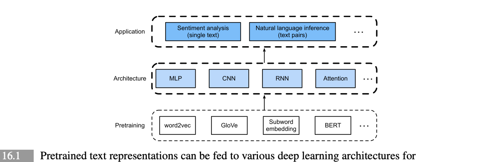
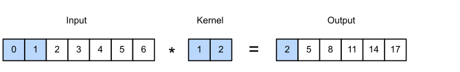
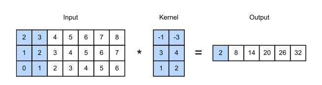
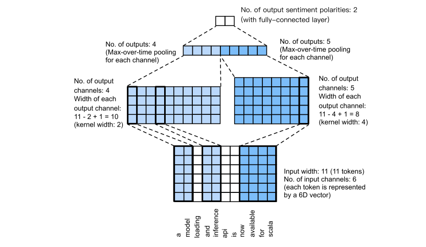
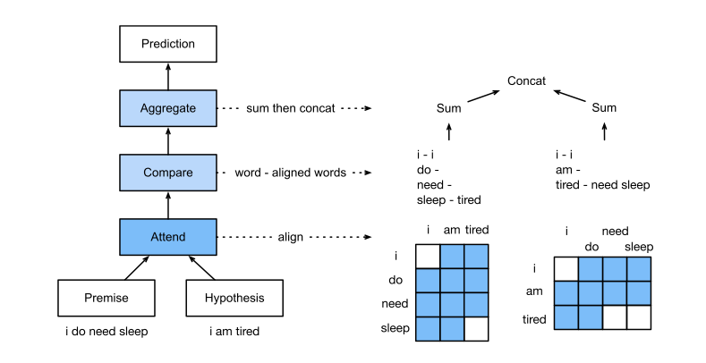
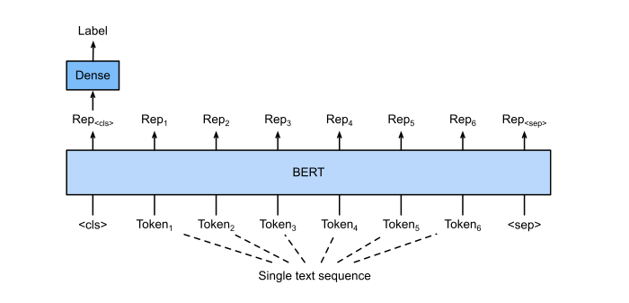
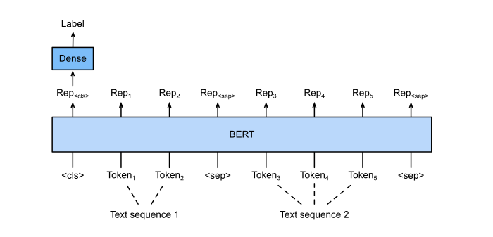
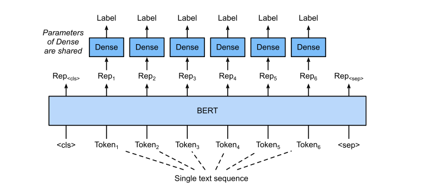
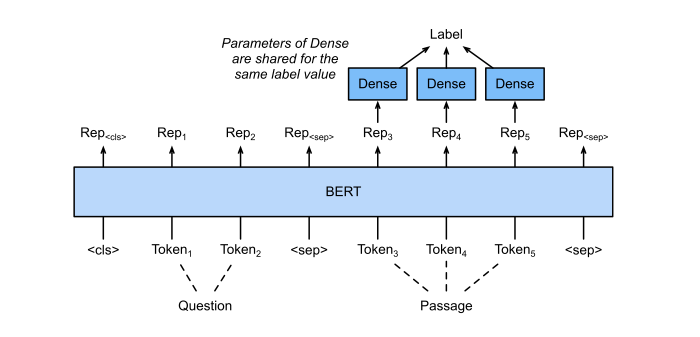

# Natural Language Processing: Applications

> **Ý chính trong một câu:** chương 15 dạy cách **biểu diễn** văn bản; chương này dạy cách **dùng** biểu diễn đó — ghép một biểu diễn pretrained với một kiến trúc phù hợp để giải hai nhiệm vụ thật: phân tích cảm xúc (một văn bản) và suy luận ngôn ngữ (một cặp văn bản).

## Mục tiêu học tập

Học xong chương, bạn có thể:

- [ ] giải thích vì sao {{term:sentiment-analysis|sentiment analysis}} là một bài toán phân loại văn bản, và vì sao phải cắt/đệm chuỗi về cùng độ dài;
- [ ] mô tả cách một bidirectional RNN nén một chuỗi dài thành **một** vector biểu diễn;
- [ ] tính shape output của {{term:one-dimensional-convolution|one-dimensional convolution}} trên văn bản và giải thích {{term:max-over-time-pooling|max-over-time pooling}};
- [ ] vẽ lại kiến trúc {{term:textcnn|textCNN}} và giải thích vì sao nó dùng **hai** embedding layer;
- [ ] định nghĩa {{term:natural-language-inference|natural language inference}} cùng ba quan hệ entailment, contradiction, neutral;
- [ ] mô tả ba bước attending, comparing, aggregating của {{term:decomposable-attention|decomposable attention model}};
- [ ] giải thích **thủ thuật phân rã** (decomposition trick) đưa độ phức tạp từ bậc hai về tuyến tính;
- [ ] nêu cách BERT được fine-tune cho bốn nhóm ứng dụng ở mức chuỗi và mức token;
- [ ] so sánh cách tiếp cận "kiến trúc riêng cho từng nhiệm vụ" với "fine-tune BERT" và nói rõ khi nào chọn cái nào.

## Bản đồ chương



```text
       PRETRAINING          →      ARCHITECTURE      →     APPLICATION
  (word2vec, GloVe,               (MLP, CNN, RNN,          (sentiment analysis,
   subword, BERT)                  Attention)               NLI, ...)

   Chương này chọn vài tổ hợp tiêu biểu:

   ┌─ MỘT VĂN BẢN: sentiment analysis ──────────────────────┐
   │  16.1 dataset IMDb (25 000 train / 25 000 test)         │
   │  16.2 GloVe + bidirectional RNN                         │
   │  16.3 GloVe + CNN một chiều (textCNN)                   │
   └─────────────────────────────────────────────────────────┘

   ┌─ CẶP VĂN BẢN: natural language inference ───────────────┐
   │  16.4 dataset SNLI (>500 000 cặp có nhãn)               │
   │  16.5 GloVe + attention + MLP (decomposable attention)  │
   │  16.6 BERT cho mọi nhóm ứng dụng                        │
   │  16.7 fine-tune BERT trên SNLI                          │
   └─────────────────────────────────────────────────────────┘
```

## Bức tranh tổng quan

Chương 15 đã cho ta cách biểu diễn token trong chuỗi văn bản và cách train các biểu diễn đó. Những biểu diễn văn bản pretrained này có thể được đưa vào **nhiều model khác nhau** cho **nhiều nhiệm vụ NLP downstream khác nhau**.

Thực ra các chương trước đã bàn tới một số ứng dụng NLP **không có pretraining**, chỉ để giải thích kiến trúc deep learning. Chẳng hạn chương 9 dùng RNN để thiết kế language model sinh văn bản kiểu tiểu thuyết; chương 10 và 11 thiết kế model dựa trên RNN và attention cho dịch máy.

Sách nói rõ phạm vi: cuốn sách **không** định bao quát toàn bộ các ứng dụng đó. Thay vào đó, trọng tâm là **cách áp dụng học biểu diễn (sâu) của ngôn ngữ để giải các bài toán NLP**. Với biểu diễn văn bản pretrained sẵn có, chương này khám phá hai nhiệm vụ downstream phổ biến và tiêu biểu: **sentiment analysis** và **natural language inference**, lần lượt phân tích **một văn bản** và **quan hệ giữa cặp văn bản**.

Như Figure 16.1 minh hoạ, chương này tập trung mô tả các ý tưởng cơ bản để thiết kế model NLP bằng các loại kiến trúc deep learning khác nhau — MLP, CNN, RNN và attention. Tuy về nguyên tắc có thể **kết hợp bất kỳ** biểu diễn pretrained nào với **bất kỳ** kiến trúc nào cho cả hai ứng dụng, sách chỉ chọn **vài tổ hợp tiêu biểu**: kiến trúc dựa trên RNN và CNN cho sentiment analysis, và kiến trúc dựa trên attention cho natural language inference.

**Điều bạn cần mang theo:** word embedding và BERT (chương 15), RNN hai chiều (chương 10), convolution và pooling (chương 7), cơ chế attention (chương 11), và quy trình fine-tuning (mục 14.2 và 15.10).

**Một câu hỏi xuyên suốt cần giữ trong đầu:** với mỗi kiến trúc dưới đây, hãy hỏi *"nó nén một chuỗi có độ dài thay đổi thành một vector có độ dài cố định bằng cách nào?"*. Bốn mục đầu chương trả lời câu hỏi đó theo bốn cách khác nhau, và đó chính là chỗ chúng khác nhau.

<!-- pagebreak -->

## 16.1 Sentiment Analysis and the Dataset

### Trực giác

Mạng xã hội và các nền tảng đánh giá đã tích luỹ một khối lượng khổng lồ **dữ liệu mang quan điểm**, và khối dữ liệu đó có tiềm năng lớn để hỗ trợ ra quyết định.

**Sentiment analysis** nghiên cứu cảm xúc của con người trong văn bản họ tạo ra — đánh giá sản phẩm, bình luận blog, thảo luận diễn đàn. Nó có ứng dụng rộng trong những lĩnh vực rất khác nhau: **chính trị** (phân tích cảm xúc công chúng với chính sách), **tài chính** (phân tích tâm lý thị trường), và **marketing** (nghiên cứu sản phẩm và quản trị thương hiệu).

**Vì sao đây là bài toán phân loại?** Vì cảm xúc có thể chia thành các **cực rời rạc** hoặc các **thang đo** (ví dụ tích cực và tiêu cực). Nhìn theo cách đó, sentiment analysis chính là một bài toán **text classification**: biến một chuỗi văn bản **độ dài thay đổi** thành một **category có độ dài cố định**.

Đây là một cách phát biểu đáng ghi nhớ, vì nó nói ngay cho ta biết khó khăn nằm ở đâu: **làm sao nén thứ dài không cố định thành thứ ngắn cố định**.

Sách dùng **large movie review dataset** của Stanford (IMDb). Nó gồm một tập train và một tập test, **mỗi tập chứa 25 000 đánh giá phim** tải từ IMDb. Ở cả hai tập, số nhãn "positive" và "negative" **bằng nhau**.

> **Vì sao chi tiết "cân bằng nhãn" đáng chú ý?** Vì nó cho ta một mốc so sánh rõ ràng: một model đoán bừa đạt **50%** accuracy. Bất kỳ con số nào ta báo cáo đều phải so với mốc đó.

### 16.1.1 Reading the Dataset

Mỗi ví dụ là một đánh giá kèm nhãn: **1 cho "positive"** và **0 cho "negative"**.

```python
#@save
def read_imdb(data_dir, is_train):
    """Đọc chuỗi văn bản và nhãn của IMDb review dataset."""
    data, labels = [], []
    for label in ('pos', 'neg'):
        folder_name = os.path.join(data_dir, 'train' if is_train else 'test',
                                   label)
        for file in os.listdir(folder_name):
            with open(os.path.join(folder_name, file), 'rb') as f:
                review = f.read().decode('utf-8').replace('\n', '')
                data.append(review)
                labels.append(1 if label == 'pos' else 0)
    return data, labels


train_data = read_imdb(data_dir, is_train=True)
print('# trainings:', len(train_data[0]))        # 25000
```

### 16.1.2 Preprocessing the Dataset

Coi mỗi từ là một token và **lọc bỏ các từ xuất hiện dưới 5 lần**, ta dựng vocabulary từ tập training.

```python
train_tokens = d2l.tokenize(train_data[0], token='word')
vocab = d2l.Vocab(train_tokens, min_freq=5, reserved_tokens=['<pad>'])
```

Vẽ histogram độ dài đánh giá cho thấy đúng như dự đoán: **các đánh giá có độ dài rất khác nhau**. Để xử lý một minibatch các đánh giá cùng lúc, ta đặt độ dài mỗi đánh giá về **500** bằng cách **cắt bớt và đệm thêm** — tương tự bước tiền xử lý cho dataset dịch máy ở mục 10.5.

```python
num_steps = 500  # số bước thời gian cố định
train_features = torch.tensor([d2l.truncate_pad(
    vocab[line], num_steps, vocab['<pad>']) for line in train_tokens])
train_features.shape          # torch.Size([25000, 500])
```

**Đây là câu trả lời đầu tiên cho câu hỏi "nén thế nào".** Nó thô nhưng hiệu quả: ép mọi thứ về đúng 500 token. Đánh giá dài hơn bị **cắt mất phần đuôi**; đánh giá ngắn hơn được **đệm thêm** `<pad>`.

> **Cái giá phải trả:** cắt ở 500 token nghĩa là với một đánh giá dài 800 từ, ta **vứt bỏ 300 từ cuối** — mà kết luận của người viết thường nằm chính ở đó. Đây là một đánh đổi thực dụng giữa chi phí tính toán và thông tin, không phải một lựa chọn hiển nhiên đúng.

### 16.1.3 Creating Data Iterators

```python
train_iter = d2l.load_array((train_features, torch.tensor(train_data[1])), 64)

for X, y in train_iter:
    print('X:', X.shape, ', y:', y.shape)
    break
# X: torch.Size([64, 500]) , y: torch.Size([64])
```

### 16.1.4 Putting It All Together

Hàm `load_data_imdb` gói toàn bộ các bước trên và trả về data iterator cùng vocabulary.

### 16.1.5 Summary

- Sentiment analysis nghiên cứu cảm xúc của con người trong văn bản họ tạo ra, và được coi là một bài toán **text classification** biến chuỗi văn bản độ dài thay đổi thành một category độ dài cố định.
- Sau khi tiền xử lý, ta có thể nạp large movie review dataset (IMDb review dataset) của Stanford vào các data iterator kèm một vocabulary.

### 16.1.6 Exercises

1. Những hyperparameter nào trong mục này có thể chỉnh để **tăng tốc** việc train model sentiment analysis?
2. Bạn có thể viết một hàm nạp dataset **Amazon reviews** thành data iterator và nhãn cho sentiment analysis không?

<details markdown="1"><summary>Gợi ý</summary>

Câu 1: rà từng bước của pipeline — bước nào có một con số quyết định khối lượng tính toán? Chú ý đặc biệt tới `num_steps` và `min_freq`. Câu 2: cấu trúc thư mục của Amazon reviews khác IMDb thế nào, và nhãn của nó có phải nhị phân không?
</details>

<details markdown="1"><summary>Lời giải</summary>

**Câu 1.** Xếp theo mức tác động:

| Hyperparameter | Tác động | Cái giá phải trả |
|---|---|---|
| `num_steps = 500` | **lớn nhất** — chi phí RNN tuyến tính theo độ dài, chi phí attention là bậc hai | mất thông tin ở cuối đánh giá dài |
| `batch_size = 64` | batch lớn hơn tận dụng GPU tốt hơn | cần chỉnh learning rate theo |
| `min_freq = 5` | vocabulary nhỏ hơn → embedding layer nhỏ hơn | nhiều từ thành `<unk>` hơn |
| `embed_size = 100` | ít tham số hơn | biểu diễn nghèo hơn |
| `num_hiddens`, `num_layers` | model nhỏ hơn thì nhanh hơn | sức biểu diễn kém hơn |

`num_steps` là đòn bẩy mạnh nhất. Giảm từ 500 xuống 200 thì phần RNN nhanh hơn khoảng 2.5 lần. Và trên thực tế, phần lớn đánh giá IMDb **ngắn hơn 300 token**, nên 500 chủ yếu là đệm — phần đệm đó vẫn tiêu tốn tính toán mà không mang thông tin.

Một tối ưu tốt hơn mà hyperparameter không nói tới: **gom batch theo độ dài** (bucketing), tức xếp các đánh giá dài tương tự vào cùng batch rồi chỉ đệm tới độ dài của batch đó thay vì tới 500 cố định.

**Câu 2.** Cấu trúc hàm giống `read_imdb`, chỉ khác ở ba chỗ, và mỗi chỗ đều là một quyết định thật:

1. **Định dạng file.** Amazon reviews thường là một file JSON-lines (mỗi dòng một JSON) chứ không phải thư mục `pos/` và `neg/`. Vậy phải đọc và parse từng dòng thay vì duyệt thư mục.

2. **Nhãn không nhị phân.** Amazon dùng thang **1–5 sao**. Muốn khớp với bài toán ở đây, phải ánh xạ sang nhị phân — quy ước phổ biến là 4–5 sao thành `1`, 1–2 sao thành `0`, và **bỏ hẳn 3 sao** vì chúng mơ hồ.

3. **Nhãn mất cân bằng.** Khác IMDb (cân bằng sẵn), đánh giá Amazon lệch mạnh về phía tích cực — thường trên 70% là 4–5 sao. Hậu quả: mốc "đoán bừa" **không còn là 50%**, và một model luôn đoán "positive" đã đạt 70% accuracy mà chẳng học được gì. Phải hoặc lấy mẫu lại cho cân bằng, hoặc báo cáo bằng F1 thay vì accuracy.

```python
def read_amazon(path, min_stars_pos=4, max_stars_neg=2):
    """Đọc Amazon reviews (JSON-lines) thành văn bản và nhãn nhị phân."""
    data, labels = [], []
    with open(path, 'r', encoding='utf-8') as f:
        for line in f:
            record = json.loads(line)
            stars = record['overall']
            if stars >= min_stars_pos:
                labels.append(1)
            elif stars <= max_stars_neg:
                labels.append(0)
            else:
                continue          # bỏ 3 sao vì quá mơ hồ
            data.append(record['reviewText'])
    return data, labels
```

**Bẫy thường gặp:** giữ lại đánh giá 3 sao và gán bừa cho một trong hai lớp. Làm vậy là đưa nhiễu vào nhãn, và model sẽ học kém hơn ở **cả hai** lớp.
</details>

<!-- pagebreak -->

## 16.2 Sentiment Analysis: Using Recurrent Neural Networks

### Trực giác

Giống image classification, sentiment analysis biến một input độ dài thay đổi thành một output độ dài cố định. Mục này cho câu trả lời thứ hai cho câu hỏi "nén thế nào": **dùng một RNN hai chiều đọc hết chuỗi, rồi lấy hidden state làm bản tóm tắt**.

Sách nói rõ tổ hợp được chọn: **GloVe pretrained** cho biểu diễn từng token, và một **kiến trúc dựa trên RNN** cho biểu diễn cả chuỗi.

### 16.2.1 Representing Single Text with RNNs

Trong các nhiệm vụ phân loại văn bản như sentiment analysis, một chuỗi văn bản độ dài thay đổi sẽ được biến thành category có độ dài cố định. Trong lớp `BiRNN`:

- mỗi token của chuỗi nhận **biểu diễn GloVe pretrained riêng** của nó qua embedding layer (`self.embedding`);
- **cả chuỗi** được mã hoá bởi một bidirectional RNN (`self.encoder`);
- cụ thể hơn, hidden state (ở layer cuối) của bidirectional LSTM tại **bước thời gian đầu tiên và cuối cùng** được **nối lại** làm biểu diễn của chuỗi văn bản;
- biểu diễn một-văn-bản này được biến thành các category output bởi một fully connected layer (`self.decoder`) với **hai** output ("positive" và "negative").

```python
class BiRNN(nn.Module):
    def __init__(self, vocab_size, embed_size, num_hiddens,
                 num_layers, **kwargs):
        super(BiRNN, self).__init__(**kwargs)
        self.embedding = nn.Embedding(vocab_size, embed_size)
        # bidirectional=True: đọc chuỗi theo cả hai chiều.
        self.encoder = nn.LSTM(embed_size, num_hiddens, num_layers=num_layers,
                               bidirectional=True)
        # 4 * num_hiddens = 2 chiều × 2 bước thời gian (đầu và cuối).
        self.decoder = nn.Linear(4 * num_hiddens, 2)

    def forward(self, inputs):
        # inputs: (batch_size, num_steps) -> embeddings: (num_steps, batch_size, embed_size)
        embeddings = self.embedding(inputs.T)
        self.encoder.flatten_parameters()
        outputs, _ = self.encoder(embeddings)
        # Nối hidden state ở bước ĐẦU và bước CUỐI: (batch_size, 4 * num_hiddens)
        encoding = torch.cat((outputs[0], outputs[-1]), dim=1)
        return self.decoder(encoding)
```

**Con số `4 * num_hiddens` từ đâu ra?** Đây là chỗ dễ nhầm nhất, nên hãy tách ra:

$$
4 \times \text{num\_hiddens} = \underbrace{2}_{\text{hai chiều}} \times \underbrace{2}_{\text{bước đầu + bước cuối}} \times \text{num\_hiddens}
$$

Mỗi phần tử của `outputs` đã có kích thước `2 * num_hiddens` (vì LSTM hai chiều nối hai chiều lại), và ta lấy **hai** phần tử rồi nối tiếp, thành `4 * num_hiddens`.

**Vì sao lấy cả bước đầu và bước cuối?** Trong LSTM hai chiều, hidden state tại bước **cuối cùng** của chiều xuôi đã đọc hết câu từ trái sang phải; hidden state tại bước **đầu tiên** của chiều ngược đã đọc hết câu từ phải sang trái. Lấy cả hai là lấy **hai bản tóm tắt đầy đủ** theo hai hướng đọc.

```python
embed_size, num_hiddens, num_layers = 100, 100, 2
net = BiRNN(len(vocab), embed_size, num_hiddens, num_layers)
```

### 16.2.2 Loading Pretrained Word Vectors

```python
glove_embedding = d2l.TokenEmbedding('glove.6b.100d')
embeds = glove_embedding[vocab.idx_to_token]
embeds.shape                      # torch.Size([49346, 100])

net.embedding.weight.data.copy_(embeds)
# Đóng băng embedding: GloVe đã tốt, và dataset này không đủ lớn để cải thiện nó.
net.embedding.weight.requires_grad = False
```

Chú ý `embed_size = 100` phải **khớp** với số chiều của bộ GloVe được chọn (`glove.6b.100d`). Đây là một ràng buộc dễ quên.

### 16.2.3 Training and Evaluating the Model

Cấu hình của sách: `lr = 0.01`, `num_epochs = 5`, cross-entropy loss với `reduction="none"`, dùng lại `train_ch13` từ chương 13.

Sau khi train, có thể dự đoán cảm xúc của một câu bất kỳ:

```python
#@save
def predict_sentiment(net, vocab, sequence):
    """Dự đoán cảm xúc của một chuỗi văn bản."""
    sequence = torch.tensor(vocab[sequence.split()], device=d2l.try_gpu())
    label = torch.argmax(net(sequence.reshape(1, -1)), dim=1)
    return 'positive' if label == 1 else 'negative'


predict_sentiment(net, vocab, 'this movie is so great')   # 'positive'
predict_sentiment(net, vocab, 'this movie is so bad')     # 'negative'
```

### 16.2.4 Summary

- Word vector pretrained có thể biểu diễn **từng token riêng lẻ** trong một chuỗi văn bản.
- Bidirectional RNN có thể biểu diễn **cả chuỗi văn bản**, chẳng hạn qua việc nối hidden state của nó tại bước thời gian đầu tiên và cuối cùng.
- Biểu diễn một-văn-bản này có thể được biến thành các category bằng một fully connected layer.

### 16.2.5 Exercises

1. Tăng số epoch. Bạn có cải thiện được training accuracy và testing accuracy không? Còn việc chỉnh các hyperparameter khác thì sao?
2. Dùng word vector pretrained **lớn hơn**, chẳng hạn GloVe 300 chiều. Nó có cải thiện accuracy phân loại không?
3. Ta có cải thiện được accuracy bằng cách dùng tokenization của spaCy không? Bạn cần cài spaCy (`pip install spacy`) và gói tiếng Anh (`python -m spacy download en`). Trong code, trước hết `import spacy`, rồi nạp gói tiếng Anh (`spacy_en = spacy.load('en')`), và cuối cùng định nghĩa hàm `def tokenizer(text): return [tok.text for tok in spacy_en.tokenizer(text)]` để thay cho hàm `tokenizer` gốc. Chú ý các dạng token cụm từ khác nhau giữa GloVe và spaCy: ví dụ cụm "new york" có dạng "new-york" trong GloVe nhưng "new york" sau khi tokenize bằng spaCy.

<details markdown="1"><summary>Gợi ý</summary>

Câu 1: embedding đang bị đóng băng, nên chỉ LSTM và decoder được học — điều đó giới hạn khả năng overfit thế nào? Câu 2: nếu đổi sang GloVe 300 chiều, còn tham số nào **bắt buộc** phải đổi theo? Câu 3: chú ý kỹ vào ghi chú cuối đề bài về "new-york" và "new york".
</details>

<details markdown="1"><summary>Lời giải</summary>

**Câu 1.** Tăng số epoch làm **training accuracy tiếp tục tăng**, nhưng **test accuracy bão hoà rồi giảm** — overfitting kinh điển. Với dataset 25 000 ví dụ và một LSTM hai lớp, khoảng 5–10 epoch thường là đủ.

Đáng chú ý là việc **đóng băng embedding** đã là một dạng chính quy hoá mạnh: phần lớn tham số của model nằm ở embedding layer, và chúng không được cập nhật. Nếu bỏ đóng băng, model overfit **nhanh hơn nhiều**.

Các hyperparameter đáng chỉnh khác: `num_hiddens` (tăng sức biểu diễn), thêm `dropout` giữa các layer LSTM, giảm `num_steps` (phần lớn đánh giá ngắn hơn 500 nên phần đệm chỉ thêm nhiễu), và dùng learning rate scheduling.

**Câu 2.** Thường **có cải thiện**, khoảng một vài điểm phần trăm, vì GloVe 300 chiều được train trên nhiều dữ liệu hơn và mã hoá được nhiều sắc thái ngữ nghĩa hơn.

Nhưng có một thay đổi **bắt buộc** đi kèm, và bỏ sót nó là lỗi rất phổ biến: `embed_size` phải đổi từ 100 thành **300**, nếu không `copy_` sẽ báo lỗi lệch shape. Và vì `self.encoder` nhận `embed_size` làm input size, toàn bộ LSTM cũng lớn lên theo — nghĩa là train chậm hơn và tốn bộ nhớ hơn.

Lợi ích giảm dần: từ 50 lên 100 chiều thường cải thiện rõ; từ 100 lên 300 thì ít hơn nhiều. Với dataset chỉ 25 000 ví dụ, chính lượng dữ liệu mới là giới hạn thật sự, không phải chất lượng embedding.

**Câu 3.** Có thể cải thiện, và lý do nằm ở chất lượng tokenization. Hàm `tokenize` mặc định chỉ tách theo dấu cách, nên "great!" và "great" thành **hai token khác nhau**, còn "don't" thành một token lạ. spaCy tách đúng dấu câu và các dạng rút gọn, nên số token khớp được với GloVe tăng lên.

Nhưng đề bài cảnh báo một cái bẫy thật, và nó đáng suy nghĩ: **quy ước về cụm từ không khớp nhau**. GloVe lưu cụm dưới dạng "new-york" (nối bằng gạch ngang) trong khi spaCy tách thành hai token "new" và "york". Vậy sau khi đổi sang spaCy, các cụm từ trong GloVe **không còn tra được**, và ta mất chính những vector cụm từ đó.

Bài học tổng quát rất quan trọng: **tokenizer lúc dùng phải khớp với tokenizer lúc pretrain embedding**. Dùng một tokenizer "tốt hơn" nhưng lệch với embedding có thể làm kết quả *tệ đi*. Đây cũng chính là lý do các model hiện đại đóng gói tokenizer **cùng với** checkpoint.

**Bẫy thường gặp:** đổi tokenizer mà quên dựng lại vocabulary. Vocabulary cũ được xây từ token cũ, nên ánh xạ chỉ số sẽ sai hoàn toàn.
</details>

<!-- pagebreak -->

## 16.3 Sentiment Analysis: Using Convolutional Neural Networks

### Trực giác

Chương 7 dạy CNN cho ảnh hai chiều, và ta đã dùng chúng cho computer vision. CNN cũng dùng được cho văn bản, nhưng theo **một chiều** — vì văn bản chỉ có một trục: thời gian.

So với mục 16.2 (GloVe + RNN), mục này chỉ đổi **một** thứ: kiến trúc. Biểu diễn pretrained vẫn là GloVe, bài toán vẫn là sentiment analysis.

Trực giác: nếu RNN đọc câu **tuần tự** để tạo tóm tắt, thì CNN **quét các cửa sổ ngắn** để tìm những cụm từ mang tín hiệu mạnh. Với sentiment analysis, cách thứ hai nghe rất hợp lý — "not worth watching" là một cụm ba từ quyết định, dù nó nằm ở đâu trong đánh giá.

### 16.3.1 One-Dimensional Convolutions

One-dimensional convolution chỉ là một trường hợp đặc biệt của two-dimensional convolution dựa trên phép cross-correlation.



Trong trường hợp một chiều, cửa sổ convolution **trượt từ trái sang phải** trên input tensor. Khi trượt, input subtensor nằm trong cửa sổ (ví dụ $0$ và $1$ trong hình) và kernel tensor (ví dụ $1$ và $2$) được nhân **từng phần tử tương ứng**. Tổng các tích đó cho một giá trị vô hướng duy nhất (ở đây $0\times1 + 1\times2 = 2$) tại vị trí tương ứng của output tensor.

```python
def corr1d(X, K):
    w = K.shape[0]
    Y = torch.zeros((X.shape[0] - w + 1))
    for i in range(Y.shape[0]):
        Y[i] = (X[i: i + w] * K).sum()
    return Y


X, K = torch.tensor([0, 1, 2, 3, 4, 5, 6]), torch.tensor([1, 2])
corr1d(X, K)          # tensor([ 2.,  5.,  8., 11., 14., 17.])
```

**Quy tắc shape:** input rộng $n$ với kernel rộng $w$ cho output rộng $n - w + 1$. Ở đây $7 - 2 + 1 = 6$. ✓

**Nhiều input channel.** Với input nhiều channel, mỗi channel có kernel riêng, và các kết quả được cộng lại. Sách nêu một đẳng thức đáng chú ý: **cross-correlation một chiều nhiều-input-channel tương đương với cross-correlation hai chiều một-input-channel**, trong đó chiều cao của kernel phải bằng chiều cao của input tensor.



Đẳng thức này rất hữu ích về mặt trực giác: một câu với $n$ token, mỗi token là vector $d$ chiều, có thể xem là **ảnh $d$ channel rộng $n$ cao 1**, hoặc **ảnh 1 channel cao $d$ rộng $n$**. Hai cách nhìn cho cùng kết quả.

### 16.3.2 Max-Over-Time Pooling

Tương tự, ta có thể dùng pooling để trích **giá trị lớn nhất** từ biểu diễn chuỗi, coi đó là feature quan trọng nhất **xuyên suốt các bước thời gian**. {{term:max-over-time-pooling|Max-over-time pooling}} dùng trong textCNN hoạt động như **global max-pooling một chiều**.

Với input nhiều channel mà mỗi channel lưu giá trị ở các bước thời gian khác nhau, output tại mỗi channel là **giá trị lớn nhất của channel đó**.

Và đây là tính chất then chốt mà sách nhấn mạnh: **max-over-time pooling cho phép số bước thời gian khác nhau ở các channel khác nhau.**

**Đây là câu trả lời thứ ba cho câu hỏi "nén thế nào"**, và nó thanh lịch hơn hai câu trước. Bất kể chuỗi dài bao nhiêu, bất kể kernel rộng bao nhiêu, mỗi channel luôn cho ra **đúng một số**. Việc gộp các số đó lại cho ra một vector có độ dài cố định bằng **số channel** — hoàn toàn độc lập với độ dài chuỗi.

Về mặt ngữ nghĩa, phép lấy max còn có ý nghĩa rõ ràng: mỗi channel học phát hiện một loại cụm từ, và max hỏi *"cụm từ đó có xuất hiện ở đâu đó trong câu không, và mạnh cỡ nào?"* — bỏ qua chuyện nó nằm ở **vị trí** nào.

### 16.3.3 The textCNN Model

Dùng one-dimensional convolution và max-over-time pooling, model {{term:textcnn|textCNN}} nhận biểu diễn token pretrained làm input, rồi thu được và biến đổi biểu diễn chuỗi cho ứng dụng downstream.

Với một chuỗi văn bản có $n$ token biểu diễn bằng vector $d$ chiều, **chiều rộng, chiều cao và số channel** của input tensor lần lượt là $n$, $1$ và $d$. textCNN biến input thành output như sau:

<div class="algorithm-block" markdown="1">
<p class="algorithm-label">LUỒNG THUẬT TOÁN · TEXTCNN</p>

1. Định nghĩa **nhiều** kernel convolution một chiều và thực hiện phép convolution **riêng rẽ** trên input. Các kernel có **chiều rộng khác nhau** có thể bắt được feature cục bộ giữa những **số lượng token liền kề khác nhau**.
2. Thực hiện **max-over-time pooling** trên mọi output channel, rồi **nối** tất cả các giá trị vô hướng đó thành một vector.
3. Biến vector đã nối thành các category output bằng **fully connected layer**. Có thể dùng dropout để giảm overfitting.

</div>



**Đọc kỹ ví dụ trong hình, vì mọi con số đều kiểm chứng được:**

- Input là câu **11 token**, mỗi token là vector **6 chiều** → input **6 channel, rộng 11**.
- Hai kernel một chiều rộng **2** và **4**, với **4** và **5** output channel.
- Kernel rộng 2 cho 4 output channel rộng $11 - 2 + 1 = \mathbf{10}$.
- Kernel rộng 4 cho 5 output channel rộng $11 - 4 + 1 = \mathbf{8}$.
- Dù **9 channel** này có chiều rộng khác nhau (10 và 8), max-over-time pooling cho một vector nối dài **9 chiều**.
- Vector 9 chiều đó được biến thành vector output **2 chiều** cho dự đoán cảm xúc nhị phân.

Bước 4→5 chính là chỗ phép màu xảy ra: chiều rộng khác nhau (10 và 8) **biến mất hoàn toàn** sau pooling. Chỉ còn lại **số channel**.

**Vì sao textCNN dùng hai embedding layer?** So với bidirectional RNN ở mục 16.2, ngoài việc thay recurrent layer bằng convolutional layer, textCNN còn dùng **hai** embedding layer: một với trọng số **train được** và một với trọng số **cố định**.

```python
class TextCNN(nn.Module):
    def __init__(self, vocab_size, embed_size, kernel_sizes, num_channels,
                 **kwargs):
        super(TextCNN, self).__init__(**kwargs)
        self.embedding = nn.Embedding(vocab_size, embed_size)
        # Embedding layer thứ hai KHÔNG được train.
        self.constant_embedding = nn.Embedding(vocab_size, embed_size)
        self.dropout = nn.Dropout(0.5)
        self.decoder = nn.Linear(sum(num_channels), 2)
        # Max-over-time pooling không có tham số nên dùng chung được một instance.
        self.pool = nn.AdaptiveAvgPool1d(1)
        self.relu = nn.ReLU()
        self.convs = nn.ModuleList()
        for c, k in zip(num_channels, kernel_sizes):
            # 2 * embed_size vì input là hai embedding nối lại.
            self.convs.append(nn.Conv1d(2 * embed_size, c, k))

    def forward(self, inputs):
        # Nối output của hai embedding layer theo chiều vector token.
        embeddings = torch.cat((
            self.embedding(inputs), self.constant_embedding(inputs)), dim=2)
        # Conv1d cần channel ở chiều thứ hai.
        embeddings = embeddings.permute(0, 2, 1)
        # Với mỗi conv layer, sau max-over-time pooling ta được tensor
        # (batch_size, num_channels, 1); bỏ chiều cuối rồi nối theo channel.
        encoding = torch.cat([
            torch.squeeze(self.relu(self.pool(conv(embeddings))), dim=-1)
            for conv in self.convs], dim=1)
        return self.decoder(self.dropout(encoding))
```

Ý đồ của hai embedding layer: bản **cố định** giữ nguyên tri thức GloVe, đảm bảo model không "quên" ngữ nghĩa tổng quát; bản **train được** cho phép điều chỉnh theo miền dữ liệu cụ thể — trong phê bình phim, "predictable" mang nghĩa tiêu cực mạnh hơn nhiều so với văn bản thông thường. Nối cả hai lại là **giữ được cả hai**.

Cấu hình của sách: `embed_size = 100`, `kernel_sizes = [3, 4, 5]`, `nums_channels = [100, 100, 100]`.

### 16.3.4 Summary

- CNN một chiều có thể xử lý **feature cục bộ** như các $n$-gram trong văn bản.
- Cross-correlation một chiều nhiều-input-channel **tương đương** với cross-correlation hai chiều một-input-channel.
- Max-over-time pooling **cho phép số bước thời gian khác nhau ở các channel khác nhau**.
- Model textCNN biến biểu diễn từng token thành output của ứng dụng downstream bằng convolutional layer một chiều và max-over-time pooling layer.

### 16.3.5 Exercises

1. Chỉnh hyperparameters và so sánh hai kiến trúc cho sentiment analysis ở mục 16.2 và ở mục này, chẳng hạn về accuracy phân loại và hiệu quả tính toán.
2. Bạn có cải thiện thêm được accuracy phân loại của model bằng các phương pháp đã nêu trong phần bài tập của mục 16.2 không?
3. Thêm **positional encoding** vào biểu diễn input. Nó có cải thiện accuracy phân loại không?

<details markdown="1"><summary>Gợi ý</summary>

Câu 1: RNN xử lý các bước thời gian **tuần tự** còn convolution thì **độc lập** — điều đó nghĩa là gì trên GPU? Câu 3: max-over-time pooling giữ lại thông tin gì về **vị trí** của feature?
</details>

<details markdown="1"><summary>Lời giải</summary>

**Câu 1.** Về **accuracy**, hai model thường xấp xỉ nhau trên IMDb, cả hai quanh mức 0.85–0.87. Điều này đáng chú ý: sentiment analysis phần lớn dựa vào **sự có mặt của những cụm từ mang cảm xúc**, và textCNN nắm việc đó rất tốt dù nó bỏ qua trật tự toàn cục.

Về **hiệu quả tính toán**, textCNN **nhanh hơn rõ rệt**, và lý do mang tính cấu trúc: LSTM phải xử lý 500 bước thời gian **tuần tự** — bước $t$ cần hidden state của bước $t-1$, nên không song song hoá được theo thời gian. Convolution thì tính **mọi vị trí độc lập**, nên GPU chạy hết cùng lúc.

Khác biệt sâu hơn giữa hai kiến trúc:

| | BiRNN (16.2) | textCNN (16.3) |
|---|---|---|
| Nắm bắt | phụ thuộc tuần tự, tầm xa | cụm từ cục bộ ($n$-gram) |
| Song song theo thời gian | **không** | **có** |
| Nhạy với trật tự | có | chỉ trong phạm vi cửa sổ |
| Chi phí theo độ dài | tuyến tính, tuần tự | tuyến tính, song song |

Trực giác: cụm "not good" cần trật tự để hiểu đúng — textCNN với kernel rộng $\ge 2$ vẫn bắt được vì hai từ nằm trong cùng cửa sổ. Nhưng "The plot, which I will not spoil, was good" thì phủ định cách xa danh từ và textCNN dễ hiểu sai.

**Câu 2.** Có, những kỹ thuật ở bài tập 16.2.5 đều áp dụng được: GloVe 300 chiều (nhớ đổi `embed_size` và `2 * embed_size` trong `Conv1d`), tokenization bằng spaCy (với cùng cảnh báo về cụm từ), và train nhiều epoch hơn kèm chính quy hoá.

Riêng textCNN còn có các đòn bẩy của chính nó: thêm kernel size (ví dụ `[2, 3, 4, 5]` để bắt cả bigram), tăng số channel mỗi kernel, và chỉnh `dropout`. Với model này, **đa dạng kernel size** thường cho lợi ích rõ nhất vì mỗi size bắt một độ dài cụm từ khác nhau.

**Câu 3.** Về mặt trực giác thì nghe hợp lý, nhưng trên thực tế **cải thiện thường rất nhỏ hoặc không có**, và lý do rất đáng hiểu.

Vấn đề nằm ở **max-over-time pooling**. Nó lấy giá trị lớn nhất **xuyên suốt mọi vị trí**, nên nó vứt bỏ hoàn toàn thông tin "feature này nằm ở đâu". Ta có thể thêm positional encoding vào input, nhưng bước pooling ngay sau đó lại **xoá đi** phần lớn thông tin vị trí mà ta vừa thêm vào. Positional encoding chỉ có thể thay đổi *giá trị* của các activation, chứ không khôi phục được vị trí đã bị max nuốt mất.

Ngoài ra, sentiment analysis vốn khá **bất biến với vị trí**: một đánh giá tiêu cực là tiêu cực dù câu chê nằm ở đầu hay cuối. Vậy thông tin ta thêm vào không phải thứ nhiệm vụ này cần.

Muốn thật sự tận dụng vị trí, phải đổi **bước pooling** chứ không phải bước input: dùng $k$-max pooling (giữ $k$ giá trị lớn nhất **theo thứ tự xuất hiện**), hoặc thay pooling bằng attention. Đó cũng là lý do Transformer cần positional encoding — nó **không** dùng max pooling nên thông tin vị trí sống sót qua các layer.

**Bẫy thường gặp:** quên rằng `Conv1d` nhận input shape `(batch, channels, length)` chứ không phải `(batch, length, channels)`. Thiếu `permute` thì code vẫn chạy nhưng convolution sẽ quét sai trục hoàn toàn.
</details>

<!-- pagebreak -->

## 16.4 Natural Language Inference and the Dataset

### Trực giác

Mục 16.1 bàn về sentiment analysis — phân loại **một** chuỗi văn bản vào các category định sẵn. Nhưng khi cần quyết định xem một câu có **suy ra được** từ câu khác không, hay cần loại bỏ trùng lặp bằng cách nhận ra những câu **tương đương về ngữ nghĩa**, thì biết phân loại một chuỗi là **chưa đủ**. Ta cần lập luận trên **cặp** chuỗi văn bản.

### 16.4.1 Natural Language Inference

{{term:natural-language-inference|Natural language inference}} nghiên cứu xem một **hypothesis** (giả thuyết) có suy ra được từ một **premise** (tiền đề) hay không, trong đó cả hai đều là chuỗi văn bản. Nói cách khác, nó xác định **quan hệ logic** giữa một cặp chuỗi văn bản. Các quan hệ đó thường thuộc **ba** loại:

- **Entailment** (kéo theo): hypothesis suy ra được từ premise.
- **Contradiction** (mâu thuẫn): **phủ định** của hypothesis suy ra được từ premise.
- **Neutral** (trung lập): mọi trường hợp còn lại.

Natural language inference còn được gọi là nhiệm vụ **recognizing textual entailment**.

**Ba ví dụ của sách, mỗi ví dụ cho một quan hệ:**

**Entailment** — vì "showing affection" trong hypothesis suy ra được từ "hugging one another" trong premise:

> **Premise:** Two women are hugging each other.
> **Hypothesis:** Two women are showing affection.

**Contradiction** — vì "running the coding example" hàm ý "**not** sleeping" chứ không phải "sleeping":

> **Premise:** A man is running the coding example from *Dive into Deep Learning*.
> **Hypothesis:** The man is sleeping.

**Neutral** — vì từ việc "are performing for us" ta **không** suy ra được "famous" mà cũng không suy ra được "not famous":

> **Premise:** The musicians are performing for us.
> **Hypothesis:** The musicians are famous.

> **Chú ý định nghĩa của "neutral".** Nó **không** có nghĩa là "hai câu không liên quan". Nó có nghĩa là premise **không quyết định được** hypothesis đúng hay sai. Trong ví dụ thứ ba, hai câu rõ ràng liên quan tới nhau — chúng nói về cùng những nhạc công — nhưng premise im lặng về chuyện danh tiếng. Đây là chỗ người mới hay nhầm nhất.

Natural language inference đã là một chủ đề trung tâm để hiểu ngôn ngữ tự nhiên, với ứng dụng rộng từ truy hồi thông tin tới hỏi đáp mở.

### 16.4.2 The Stanford Natural Language Inference (SNLI) Dataset

**Stanford Natural Language Inference (SNLI) Corpus** là một bộ sưu tập **hơn 500 000 cặp câu tiếng Anh có nhãn** (Bowman và cộng sự, 2015).

```python
#@save
def read_snli(data_dir, is_train):
    """Đọc SNLI dataset thành premises, hypotheses và labels."""
    def extract_text(s):
        # Bỏ dấu ngoặc của cây cú pháp, gộp nhiều dấu cách thành một.
        s = re.sub('\\(', '', s)
        s = re.sub('\\)', '', s)
        s = re.sub('\\s{2,}', ' ', s)
        return s.strip()

    label_set = {'entailment': 0, 'contradiction': 1, 'neutral': 2}
    file_name = os.path.join(
        data_dir, 'snli_1.0_train.txt' if is_train else 'snli_1.0_test.txt')
    with open(file_name, 'r') as f:
        rows = [row.split('\t') for row in f.readlines()[1:]]
    premises = [extract_text(row[1]) for row in rows if row[0] in label_set]
    hypotheses = [extract_text(row[2]) for row in rows if row[0] in label_set]
    labels = [label_set[row[0]] for row in rows if row[0] in label_set]
    return premises, hypotheses, labels
```

Ánh xạ nhãn cần nhớ: **0 = entailment, 1 = contradiction, 2 = neutral**.

Kiểm tra phân bố nhãn cho thấy ba lớp **gần như cân bằng** trong cả tập train và test:

```python
train_data = read_snli(data_dir, is_train=True)
for data in [train_data, test_data]:
    print([[row for row in data[2]].count(i) for i in range(3)])
# [183416, 183187, 182764]
# [3368, 3237, 3219]
```

Lớp `SNLIDataset` đệm mọi premise và hypothesis về độ dài `num_steps = 50`, và data iterator trả về:

```python
for X, Y in train_iter:
    print(X[0].shape)     # torch.Size([128, 50])  <- premises
    print(X[1].shape)     # torch.Size([128, 50])  <- hypotheses
    print(Y.shape)        # torch.Size([128])
    break
```

Chú ý khác biệt về **cấu trúc input** so với sentiment analysis: ở đây `X` là một **cặp** tensor, không phải một tensor. Đây chính là điều khiến "phân loại cặp văn bản" khác về bản chất với "phân loại một văn bản", và mọi kiến trúc trong hai mục tiếp theo đều phải giải quyết nó.

### 16.4.3 Summary

- Natural language inference nghiên cứu xem một hypothesis có suy ra được từ một premise hay không, trong đó cả hai đều là chuỗi văn bản.
- Trong natural language inference, quan hệ giữa premise và hypothesis gồm **entailment**, **contradiction** và **neutral**.
- Stanford Natural Language Inference (SNLI) Corpus là một dataset benchmark phổ biến của natural language inference.

### 16.4.4 Exercises

1. Dịch máy từ lâu được đánh giá dựa trên việc khớp $n$-gram **bề mặt** giữa bản dịch của model và bản dịch tham chiếu. Bạn có thể thiết kế một thước đo để đánh giá kết quả dịch máy **bằng cách dùng natural language inference** không?
2. Ta có thể đổi hyperparameter nào để **giảm kích thước vocabulary**?

<details markdown="1"><summary>Gợi ý</summary>

Câu 1: BLEU phạt một bản dịch dùng từ đồng nghĩa thay vì đúng từ trong bản tham chiếu — natural language inference có gặp vấn đề đó không? Câu 2: hàm `Vocab` nhận tham số nào để lọc bớt token?
</details>

<details markdown="1"><summary>Lời giải</summary>

**Câu 1.** Ý tưởng: coi bản dịch tham chiếu là **premise** và bản dịch của model là **hypothesis**, rồi chạy một model NLI trên cặp đó.

Cách chấm điểm dùng cả ba lớp một cách có ý nghĩa:

- **Entailment** theo **cả hai chiều** (tham chiếu ⇒ bản dịch **và** bản dịch ⇒ tham chiếu) nghĩa là hai câu **tương đương về ngữ nghĩa** — bản dịch tốt.
- **Entailment một chiều** nghĩa là một bên nói ít hơn — bản dịch **thiếu thông tin** hoặc **thêm thông tin**.
- **Contradiction** là lỗi nghiêm trọng: model dịch **sai nghĩa**, ví dụ mất một từ phủ định.
- **Neutral** nghĩa là hai câu không nói về cùng một nội dung — bản dịch lạc đề.

**Vì sao cách này tốt hơn khớp $n$-gram?** Đây là điểm mấu chốt. BLEU chỉ so chuỗi ký tự, nên nó **phạt oan** những bản dịch đúng nghĩa nhưng dùng từ khác: "The film was excellent" và "The movie was great" có BLEU rất thấp dù nghĩa như nhau. Ngược lại, BLEU **thưởng nhầm** những bản dịch trùng nhiều từ nhưng sai nghĩa — thiếu một chữ "not" gần như không ảnh hưởng BLEU, trong khi nó đảo ngược hoàn toàn ý nghĩa. Model NLI thì bắt đúng trường hợp đó và gắn nhãn **contradiction**.

Đây chính là hướng đi của các thước đo dựa trên biểu diễn học được như BERTScore và COMET, vốn đã thay dần BLEU trong đánh giá dịch máy hiện đại. *(Ghi chú của người biên soạn: các thước đo cụ thể này nằm ngoài phạm vi sách.)*

Hạn chế cần nêu: thước đo giờ phụ thuộc vào **chất lượng của model NLI**, và model NLI đó có thiên kiến của riêng nó. Ta đã đổi một thước đo đơn giản nhưng thô lấy một thước đo tinh tế nhưng khó giải thích hơn.

**Câu 2.** Tham số trực tiếp là **`min_freq`** trong `d2l.Vocab`. Code hiện dùng `min_freq=5`; tăng lên 10 hay 20 sẽ cắt bớt đuôi dài của các từ hiếm (định luật Zipf), giảm vocabulary đáng kể. Cái giá là nhiều token trở thành `<unk>`.

Các cách khác:

- **Chuyển về chữ thường** ghép "The" với "the", thường giảm vocabulary 10–20%.
- **Tách subword** (BPE/WordPiece, mục 15.6) giữ vocabulary ở mức cố định **mà vẫn biểu diễn được mọi từ** — đây là cách tốt nhất, vì nó giảm kích thước mà không tạo thêm `<unk>`.
- **Giảm `num_steps`** không đổi vocabulary nhưng giảm bộ nhớ; đừng nhầm hai chuyện này.

Vì sao ta quan tâm: embedding layer có $|\mathcal{V}| \times d$ tham số, nên vocabulary thường là phần chiếm bộ nhớ lớn nhất của các model NLP nhỏ.

**Bẫy thường gặp:** dựng vocabulary từ **cả** tập train lẫn tập test. Đó là rò rỉ dữ liệu — vocabulary phải chỉ được xây từ tập train.
</details>

<!-- pagebreak -->

## 16.5 Natural Language Inference: Using Attention

### Trực giác

Trước bối cảnh nhiều model dựa trên kiến trúc phức tạp và sâu, Parikh và cộng sự (2016) đề xuất giải natural language inference bằng **cơ chế attention** và gọi nó là "{{term:decomposable-attention|decomposable attention model}}". Kết quả là một model **không có recurrent layer cũng không có convolutional layer**, đạt kết quả tốt nhất lúc bấy giờ trên SNLI với **số tham số ít hơn nhiều**.

Premise và hypothesis là hai câu. Cách hiển nhiên là mã hoá mỗi câu thành một vector rồi so sánh hai vector. Nhưng có cách tốt hơn, và sách nói thẳng vì sao:

> **Đơn giản hơn** việc bảo toàn trật tự token trong premise và hypothesis, ta có thể chỉ cần **căn chỉnh** (align) token của chuỗi này với **từng** token của chuỗi kia và ngược lại, rồi **so sánh** và **tổng hợp** thông tin đó để dự đoán quan hệ logic.

Tương tự việc căn chỉnh token giữa câu nguồn và câu đích trong dịch máy (mục 11.4), việc căn chỉnh token giữa premise và hypothesis được thực hiện rất gọn bằng cơ chế attention.



Ở mức cao, phương pháp này gồm **ba bước được train chung**: **attending**, **comparing** và **aggregating**.

### 16.5.1 The Model

Ký hiệu: $\mathbf{A} = (\mathbf{a}_1, \ldots, \mathbf{a}_m)$ là premise và $\mathbf{B} = (\mathbf{b}_1, \ldots, \mathbf{b}_n)$ là hypothesis, có $m$ và $n$ token; mỗi $\mathbf{a}_i, \mathbf{b}_j \in \mathbb{R}^d$ là word vector $d$ chiều.

**Attending — căn chỉnh.**

Bước đầu tiên là căn chỉnh token của chuỗi này với **từng** token của chuỗi kia.

Ví dụ của sách: premise là "i do need sleep", hypothesis là "i am tired". Do tương đồng ngữ nghĩa, ta muốn căn "i" trong hypothesis với "i" trong premise, và căn "tired" trong hypothesis với "sleep" trong premise. Tương tự theo chiều ngược lại, ta muốn căn "need" và "sleep" trong premise với "tired" trong hypothesis.

> **Lưu ý quan trọng:** việc căn chỉnh này là **mềm** (soft) — nó dùng **trung bình có trọng số**, trong đó lý tưởng là các token cần căn với nhau nhận trọng số lớn. Hình minh hoạ vẽ căn chỉnh theo kiểu **cứng** chỉ cho dễ hình dung.

Attention weight được tính bằng

$$
e_{ij} = f(\mathbf{a}_i)^\top f(\mathbf{b}_j),
$$

trong đó $f$ là một MLP.

**Và đây là ý tưởng quan trọng nhất của cả mục.** Sách nhấn mạnh: hàm $f$ nhận $\mathbf{a}_i$ và $\mathbf{b}_j$ **riêng rẽ**, chứ **không** nhận một cặp $(\mathbf{a}_i, \mathbf{b}_j)$ làm input. Thủ thuật **phân rã** (decomposition) này dẫn tới chỉ **$m + n$** lần áp dụng $f$ (độ phức tạp **tuyến tính**) thay vì **$mn$** lần (độ phức tạp **bậc hai**).

Hãy dừng lại ở con số đó. Với $m = n = 50$:

| | Số lần gọi $f$ |
|---|---|
| Nếu $f$ nhận cặp: $mn$ | $2\,500$ |
| Thủ thuật phân rã: $m + n$ | $100$ |

Nhanh hơn **25 lần**, và tỉ lệ này còn tăng theo độ dài câu. Cơ chế: ta chiếu mỗi token **một lần** qua $f$, rồi mọi cặp chỉ cần một **tích vô hướng** — mà tích vô hướng thì rẻ và tính được hàng loạt bằng một phép nhân ma trận.

Chuẩn hoá attention weight rồi lấy trung bình có trọng số cho ta $\boldsymbol{\beta}_i$ — biểu diễn của hypothesis được căn mềm với token thứ $i$ của premise:

$$
\boldsymbol{\beta}_i = \sum_{j=1}^{n} \frac{\exp(e_{ij})}{\sum_{k=1}^{n} \exp(e_{ik})} \mathbf{b}_j .
$$

Và theo chiều ngược lại, $\boldsymbol{\alpha}_j$ — biểu diễn của premise được căn mềm với token thứ $j$ của hypothesis:

$$
\boldsymbol{\alpha}_j = \sum_{i=1}^{m} \frac{\exp(e_{ij})}{\sum_{k=1}^{m} \exp(e_{kj})} \mathbf{a}_i .
$$

Hai công thức này dùng **cùng** một ma trận $e_{ij}$, chỉ khác **chiều chuẩn hoá** softmax: $\boldsymbol{\beta}_i$ chuẩn hoá theo hàng, $\boldsymbol{\alpha}_j$ chuẩn hoá theo cột.

```python
class Attend(nn.Module):
    def __init__(self, num_inputs, num_hiddens, **kwargs):
        super(Attend, self).__init__(**kwargs)
        self.f = mlp(num_inputs, num_hiddens, flatten=False)

    def forward(self, A, B):
        # f được áp RIÊNG cho A và B — đây chính là thủ thuật phân rã.
        f_A = self.f(A)                     # (batch, m, num_hiddens)
        f_B = self.f(B)                     # (batch, n, num_hiddens)
        # e: (batch, m, n) — mọi cặp chỉ tốn một phép nhân ma trận.
        e = torch.bmm(f_A, f_B.permute(0, 2, 1))
        # beta: hypothesis căn mềm theo từng token của premise.
        beta = torch.bmm(F.softmax(e, dim=-1), B)
        # alpha: premise căn mềm theo từng token của hypothesis.
        alpha = torch.bmm(F.softmax(e.permute(0, 2, 1), dim=-1), A)
        return beta, alpha
```

**Comparing — so sánh.**

Bước tiếp theo là so sánh một token của chuỗi này với **phần được căn mềm** của chuỗi kia. Lưu ý trong căn chỉnh mềm, **mọi** token của một chuỗi — dù có trọng số attention khác nhau — đều được đem so với một token của chuỗi kia.

Ví dụ: nếu bước attending xác định rằng "need" và "sleep" trong premise **đều** được căn với "tired" trong hypothesis, thì cặp "tired–need sleep" sẽ được đem so sánh.

Ta đưa phép **nối** (ký hiệu $[\cdot,\cdot]$) của token từ chuỗi này và token đã căn từ chuỗi kia vào một hàm $g$ (cũng là MLP):

$$
\mathbf{v}_{A,i} = g([\mathbf{a}_i, \boldsymbol{\beta}_i]), \quad i = 1, \ldots, m,
$$
$$
\mathbf{v}_{B,j} = g([\mathbf{b}_j, \boldsymbol{\alpha}_j]), \quad j = 1, \ldots, n.
$$

Trong đó $\mathbf{v}_{A,i}$ là phép so sánh giữa token $i$ của premise với **tất cả** token của hypothesis được căn mềm với nó; $\mathbf{v}_{B,j}$ thì ngược lại.

**Aggregating — tổng hợp.**

Với hai tập vector so sánh, bước cuối tổng hợp thông tin để suy ra quan hệ logic. Trước hết **cộng** cả hai tập lại:

$$
\mathbf{v}_A = \sum_{i=1}^{m} \mathbf{v}_{A,i}, \qquad
\mathbf{v}_B = \sum_{j=1}^{n} \mathbf{v}_{B,j}.
$$

Rồi đưa phép nối của hai kết quả tóm tắt vào hàm $h$ (một MLP nữa) để có kết quả phân loại:

$$
\hat{\mathbf{y}} = h([\mathbf{v}_A, \mathbf{v}_B]).
$$

**Đây là câu trả lời thứ tư cho câu hỏi "nén thế nào"**, và nó khác ba câu trước: phép **cộng** ở bước aggregating biến $m$ vector (số lượng thay đổi) thành **một** vector, bất kể câu dài bao nhiêu. Giống max-over-time pooling ở chỗ độc lập với độ dài, nhưng khác ở chỗ nó **cộng dồn mọi bằng chứng** thay vì chỉ giữ bằng chứng mạnh nhất.

**Đánh giá thẳng thắn về model này:** toàn bộ ba bước **không dùng RNN, không dùng CNN, không dùng recurrent gì cả** — chỉ có attention và MLP. Sách gọi tên nó là **decomposable attention model**, và nó là một minh chứng sớm rằng attention một mình đã đủ mạnh cho nhiều bài toán ngôn ngữ.

Cấu hình của sách: `embed_size = 100`, `num_hiddens = 200`, GloVe pretrained làm input.

### 16.5.2 Training and Evaluating the Model

Sau khi train, có thể suy luận trên cặp câu bất kỳ:

```python
#@save
def predict_snli(net, vocab, premise, hypothesis):
    """Dự đoán quan hệ logic giữa premise và hypothesis."""
    net.eval()
    premise = torch.tensor(vocab[premise], device=d2l.try_gpu())
    hypothesis = torch.tensor(vocab[hypothesis], device=d2l.try_gpu())
    label = torch.argmax(net([premise.reshape((1, -1)),
                              hypothesis.reshape((1, -1))]), dim=1)
    return 'entailment' if label == 0 else 'contradiction' if label == 1 \
        else 'neutral'


predict_snli(net, vocab, ['he', 'is', 'good', '.'], ['he', 'is', 'bad', '.'])
# 'contradiction'
```

### 16.5.3 Summary

- Decomposable attention model gồm **ba bước** để dự đoán quan hệ logic giữa premise và hypothesis: attending, comparing và aggregating.
- Với cơ chế attention, ta có thể **căn chỉnh** token của chuỗi này với **từng** token của chuỗi kia và ngược lại. Việc căn chỉnh này là **mềm**, dùng trung bình có trọng số, trong đó lý tưởng là các token cần căn với nhau nhận trọng số lớn.
- **Thủ thuật phân rã** dẫn tới độ phức tạp **tuyến tính** đáng mong muốn hơn so với độ phức tạp bậc hai khi tính attention weight.
- Ta có thể dùng word vector pretrained làm biểu diễn input cho nhiệm vụ NLP downstream như natural language inference.

### 16.5.4 Exercises

1. Train model với các tổ hợp hyperparameter khác. Bạn có đạt accuracy tốt hơn trên tập test không?
2. Những **nhược điểm lớn** của decomposable attention model cho natural language inference là gì?
3. Giả sử ta muốn có **mức tương đồng ngữ nghĩa** (ví dụ một giá trị liên tục trong khoảng 0 tới 1) cho một cặp câu bất kỳ. Ta thu thập và gán nhãn dataset thế nào? Bạn có thiết kế được một model dùng cơ chế attention không?

<details markdown="1"><summary>Gợi ý</summary>

Câu 2: hãy nhìn lại bước aggregating — phép **cộng** giữ lại và làm mất thông tin gì? Và bước attending có biết token đứng ở vị trí nào trong câu không? Câu 3: output là số thực chứ không phải nhãn — điều đó đổi loss function và lớp output thế nào?
</details>

<details markdown="1"><summary>Lời giải</summary>

**Câu 1.** Các hyperparameter đáng chỉnh: `num_hiddens` (200 là khá nhỏ), số layer của các MLP $f$, $g$, $h$, tỉ lệ dropout (mặc định 0.2), learning rate, và số chiều GloVe. Cho phép fine-tune embedding thay vì đóng băng cũng thường giúp, vì SNLI đủ lớn (hơn 500 000 ví dụ) để không overfit ngay.

**Câu 2.** Có **ba** nhược điểm, và cả ba đều đọc được thẳng từ công thức.

**Thứ nhất — hoàn toàn bỏ qua trật tự từ.** Đây là nhược điểm nghiêm trọng nhất. Bước attending tính $e_{ij} = f(\mathbf{a}_i)^\top f(\mathbf{b}_j)$ mà **không có thông tin vị trí** nào; bước aggregating thì **cộng** các vector lại, và phép cộng có tính giao hoán. Kết quả: model xem premise và hypothesis như **túi token**. Nó không phân biệt được "the dog bit the man" với "the man bit the dog" — hai câu có ý nghĩa logic hoàn toàn khác nhau.

**Thứ hai — không có tương tác giữa các token trong cùng một câu.** Mọi tương tác đều diễn ra **giữa** hai câu. Một token của premise không bao giờ "nhìn thấy" các token khác của chính premise đó, nên model không nắm được cấu trúc nội tại như cụm danh từ hay phạm vi phủ định. Đây chính là chỗ self-attention của Transformer bổ khuyết.

**Thứ ba — chính thủ thuật phân rã cũng giới hạn sức biểu diễn.** Vì $f$ xử lý $\mathbf{a}_i$ và $\mathbf{b}_j$ riêng rẽ, điểm tương thích buộc phải có dạng tích vô hướng của hai phép chiếu độc lập. Một hàm nhận cả cặp cùng lúc sẽ mạnh hơn — ta đã **đánh đổi sức biểu diễn lấy tốc độ**.

Nhận xét thêm: chính vì những hạn chế này mà mục 16.7 fine-tune BERT cho cùng nhiệm vụ. BERT có self-attention (chữa nhược điểm thứ hai) và positional embedding (chữa nhược điểm thứ nhất).

**Câu 3.** Bài toán đổi từ **phân loại** sang **hồi quy** — chính là *semantic textual similarity* mà mục 16.6.2 sẽ nhắc tới.

**Thu thập và gán nhãn dữ liệu.** Không thể bảo người gán nhãn cho "một số từ 0 tới 1" — con người rất tệ trong việc gán số tuyệt đối một cách nhất quán. Ba cách khả thi:

1. **Thang Likert rời rạc** (ví dụ 0–5 như Semantic Textual Similarity Benchmark) kèm **mô tả rõ ràng cho từng mức**, rồi lấy trung bình của nhiều người gán nhãn để ra giá trị liên tục. Trung bình của nhiều đánh giá rời rạc cho ra một số mượt và ổn định hơn.
2. **So sánh cặp:** hỏi "cặp A hay cặp B giống nhau hơn?" Con người làm việc so sánh tốt hơn nhiều so với chấm điểm tuyệt đối; sau đó suy ra thang đo bằng một model xếp hạng.
3. **Nhãn tự nhiên có sẵn:** dùng các cặp câu hỏi trùng lặp trên diễn đàn, hoặc các bản dịch song song của cùng một câu.

Nhớ đo **độ đồng thuận giữa người gán nhãn**. Nếu người thật không thống nhất được với nhau, model cũng không thể làm tốt hơn.

**Thiết kế model.** Giữ nguyên kiến trúc ba bước, chỉ đổi phần cuối:

- Hàm $h$ ở bước aggregating trả **một** giá trị vô hướng thay vì 3 logit.
- Thay cross-entropy bằng **mean squared error** (hoặc Huber loss cho bền với outlier).
- Thêm sigmoid ở cuối nếu muốn ép output vào $[0, 1]$.
- Đánh giá bằng **tương quan Pearson hoặc Spearman** với nhãn người, không phải accuracy — vì với hồi quy, thứ ta quan tâm là model có **xếp hạng** các cặp đúng thứ tự hay không.

Một thay đổi đáng cân nhắc ở bước aggregating: với bài toán tương đồng, phép nối $[\mathbf{v}_A, \mathbf{v}_B]$ không đối xứng, trong khi "A giống B" phải bằng "B giống A". Dùng $[\mathbf{v}_A + \mathbf{v}_B,\ |\mathbf{v}_A - \mathbf{v}_B|]$ thì **đối xứng theo thiết kế** — đúng với bản chất bài toán.

**Bẫy thường gặp:** dùng accuracy để đánh giá một model hồi quy bằng cách làm tròn output. Cách đó vứt bỏ chính thông tin liên tục mà ta đã tốn công thu thập.
</details>

<!-- pagebreak -->

## 16.6 Fine-Tuning BERT for Sequence-Level and Token-Level Applications

### Trực giác

Các mục trước của chương đã thiết kế những model khác nhau cho ứng dụng NLP — dựa trên RNN, CNN, attention và MLP. Sách thừa nhận thẳng điểm yếu của cách làm này:

> Những model này hữu ích khi có ràng buộc về không gian hoặc thời gian, **tuy nhiên, chế tác một model riêng cho mọi nhiệm vụ NLP là điều thực tế bất khả thi.**

Mục 15.8 đã giới thiệu BERT — model pretraining chỉ cần **thay đổi kiến trúc tối thiểu** cho rất nhiều nhiệm vụ NLP. Mặt khác, như mục 15.10 đã nêu, hai phiên bản của BERT gốc có **110 triệu** và **340 triệu** tham số. Vì vậy, **khi có đủ tài nguyên tính toán**, ta có thể cân nhắc fine-tune BERT cho các ứng dụng downstream.

Đây là một đánh đổi cần phát biểu rõ:

| | Model riêng cho từng nhiệm vụ (16.2, 16.3, 16.5) | Fine-tune BERT |
|---|---|---|
| Kích thước model | nhỏ (vài triệu tham số) | lớn (110–340 triệu) |
| Công thiết kế | **cao** — phải nghĩ kiến trúc cho mỗi nhiệm vụ | **thấp** — chỉ thêm fully connected layer |
| Tài nguyên tính toán | thấp | cao |
| Độ chính xác | thường thấp hơn | thường cao hơn |

Mục này khái quát một tập con các ứng dụng NLP thành **mức chuỗi** (sequence-level) và **mức token** (token-level).

Và đây là câu quan trọng nhất của cả mục: **những "thay đổi kiến trúc tối thiểu" mà BERT cần trên các ứng dụng khác nhau chính là các fully connected layer thêm vào.** Trong quá trình học có giám sát của ứng dụng downstream, tham số của các layer thêm vào được **học từ đầu**, còn mọi tham số trong model BERT pretrained thì được **fine-tune**.

### 16.6.1 Single Text Classification

**Single text classification** nhận **một** chuỗi văn bản làm input và cho ra kết quả phân loại. Ngoài sentiment analysis mà chương này đã nghiên cứu, **Corpus of Linguistic Acceptability (CoLA)** cũng là một dataset cho nhiệm vụ này: nó phán đoán xem một câu cho trước có **chấp nhận được về mặt ngữ pháp** hay không. Chẳng hạn "I should study." là chấp nhận được, còn "I should studying." thì không.



Nhớ lại mục 15.8: chuỗi input BERT biểu diễn rõ ràng cả văn bản đơn lẫn cặp văn bản, trong đó token phân loại đặc biệt `<cls>` dùng cho phân loại chuỗi và token `<sep>` đánh dấu kết thúc văn bản đơn hoặc phân tách một cặp văn bản.

Trong ứng dụng phân loại một văn bản, biểu diễn BERT của token `<cls>` **mã hoá thông tin của toàn bộ chuỗi văn bản input**. Với vai trò là biểu diễn của văn bản đơn, nó được đưa vào một MLP nhỏ gồm các fully connected (dense) layer để xuất ra phân bố trên toàn bộ các giá trị nhãn rời rạc.

### 16.6.2 Text Pair Classification or Regression

Chương này cũng đã xét natural language inference. Nó thuộc nhóm **text pair classification** — phân loại một **cặp** văn bản.

Lấy một cặp văn bản làm input nhưng xuất ra một **giá trị liên tục**, **semantic textual similarity** là một nhiệm vụ **text pair regression** phổ biến. Nó đo mức tương đồng ngữ nghĩa của các câu. Ví dụ trong Semantic Textual Similarity Benchmark, điểm tương đồng của một cặp câu là một thang thứ tự từ **0** (không chồng lấn nghĩa) tới **5** (tương đương nghĩa). Mục tiêu là dự đoán các điểm này. Ví dụ từ dataset đó:

| Câu 1 | Câu 2 | Điểm |
|---|---|---|
| "A plane is taking off." | "An air plane is taking off." | 5.000 |
| "A woman is eating something." | "A woman is eating meat." | 3.000 |
| "A woman is dancing." | "A man is talking." | 0.000 |



So với phân loại một văn bản, fine-tune BERT cho phân loại cặp văn bản **chỉ khác ở biểu diễn input**: chuỗi input bây giờ chứa hai đoạn, phân tách bằng `<sep>` và phân biệt bằng segment embedding. Với nhiệm vụ hồi quy cặp văn bản như semantic textual similarity, chỉ cần những thay đổi tầm thường như xuất ra một giá trị nhãn liên tục và dùng **mean squared loss** — chúng là chuyện thường gặp trong hồi quy.

Đáng chú ý là phần đọc output **không đổi chút nào**: vẫn là biểu diễn của `<cls>` đưa vào MLP. Đây chính là điều "thay đổi kiến trúc tối thiểu" muốn nói.

### 16.6.3 Text Tagging

Giờ xét các nhiệm vụ **mức token**, chẳng hạn **text tagging**, trong đó **mỗi token được gán một nhãn**. Trong nhóm này, **part-of-speech tagging** gán cho mỗi từ một nhãn từ loại (ví dụ tính từ, từ hạn định) theo vai trò của từ đó trong câu.

Ví dụ của sách theo bộ nhãn Penn Treebank II: câu "John Smith 's car is new" được gán thành "NNP (danh từ riêng, số ít) NNP POS (đuôi sở hữu) NN (danh từ, số ít hoặc khối) VB (động từ, dạng nguyên thể) JJ (tính từ)".



So sánh với Figure 16.6.1, **khác biệt duy nhất** nằm ở chỗ: trong text tagging, biểu diễn BERT của **mọi token** của văn bản input đều được đưa vào **cùng** các fully connected layer thêm vào để xuất ra nhãn của token đó.

Hai chữ "**cùng**" rất quan trọng: các layer thêm vào được **chia sẻ tham số** trên mọi vị trí. Nếu không chia sẻ, số tham số sẽ tăng theo độ dài chuỗi, và model không xử lý được câu dài hơn những gì nó đã thấy.

### 16.6.4 Question Answering

Là một ứng dụng mức token khác, **question answering** phản ánh khả năng đọc hiểu. Ví dụ, **Stanford Question Answering Dataset (SQuAD v1.1)** gồm các đoạn văn và câu hỏi đọc hiểu, trong đó đáp án cho mọi câu hỏi chỉ là **một đoạn văn bản (text span)** nằm trong đoạn văn mà câu hỏi nói tới.

Ví dụ của sách: một đoạn văn "Some experts report that a mask's efficacy is inconclusive. However, mask makers insist that their products, such as N95 respirator masks, can guard against the virus." và một câu hỏi "Who say that N95 respirator masks can guard against the virus?". Đáp án phải là đoạn văn bản "mask makers" trong đoạn văn. Vậy mục tiêu trong SQuAD v1.1 là **dự đoán vị trí bắt đầu và kết thúc** của text span trong đoạn văn, cho trước một cặp câu hỏi và đoạn văn.



Cách làm: câu hỏi và đoạn văn được đóng gói lần lượt thành chuỗi văn bản **thứ nhất** và **thứ hai** trong input của BERT. Để dự đoán vị trí **bắt đầu** của text span, cùng một fully connected layer thêm vào sẽ biến biểu diễn BERT của token bất kỳ ở vị trí $i$ trong đoạn văn thành một điểm số vô hướng $s_i$. Các điểm số của mọi token trong đoạn văn được đưa qua softmax thành một phân bố xác suất, sao cho mỗi vị trí token $i$ trong đoạn văn nhận một xác suất $p_i$ là vị trí bắt đầu của text span.

Dự đoán vị trí **kết thúc** cũng hệt như vậy, chỉ khác là tham số của fully connected layer cho nó **độc lập** với tham số dùng cho vị trí bắt đầu. Token ở vị trí $i$ được biến bởi layer đó thành điểm số $e_i$.

Với question answering, mục tiêu training của học có giám sát **đơn giản đến bất ngờ**: cực đại log-likelihood của vị trí bắt đầu và kết thúc đúng. Khi dự đoán span, ta tính điểm $s_i + e_j$ cho một span hợp lệ từ vị trí $i$ tới vị trí $j$ (với $i \le j$), và xuất ra span có điểm cao nhất.

Chú ý ràng buộc $i \le j$: nếu không có nó, model có thể cho ra một span "kết thúc trước khi bắt đầu" — vô nghĩa.

### 16.6.5 Summary

- BERT chỉ cần **thay đổi kiến trúc tối thiểu** (các fully connected layer thêm vào) cho các ứng dụng NLP ở mức chuỗi và mức token, chẳng hạn phân loại một văn bản (ví dụ sentiment analysis và kiểm tra tính chấp nhận về ngữ pháp), phân loại hoặc hồi quy cặp văn bản (ví dụ natural language inference và semantic textual similarity), text tagging (ví dụ part-of-speech tagging), và question answering.
- Trong học có giám sát của một ứng dụng downstream, tham số của các layer thêm vào được **học từ đầu**, còn mọi tham số trong model BERT pretrained đều được **fine-tune**.

### 16.6.6 Exercises

1. Hãy thiết kế một thuật toán **công cụ tìm kiếm** cho các bài báo tin tức. Khi hệ thống nhận một truy vấn (ví dụ "oil industry during the coronavirus outbreak"), nó phải trả về một danh sách các bài báo **xếp hạng theo mức liên quan** tới truy vấn. Giả sử ta có một kho bài báo khổng lồ và một số lượng lớn truy vấn. Để đơn giản, giả sử với mỗi truy vấn, bài báo **liên quan nhất** đã được gán nhãn. Ta có thể áp dụng **negative sampling** (xem mục 15.2.1) và BERT vào thiết kế thuật toán này như thế nào?
2. Ta có thể tận dụng BERT khi train language model như thế nào?
3. Ta có thể tận dụng BERT trong dịch máy không?

<details markdown="1"><summary>Gợi ý</summary>

Câu 1: bài toán này giống nhiệm vụ nào ở mục 16.6? Và ta chỉ có **nhãn dương** — negative sampling giải quyết đúng vấn đề đó ở mục 15.2. Câu 2 và 3: BERT là **encoder**; language model và dịch máy cần sinh token tuần tự — điều đó có phải việc của encoder không?
</details>

<details markdown="1"><summary>Lời giải</summary>

**Câu 1.** Bài toán này chính là **text pair classification** (mục 16.6.2): đầu vào là cặp (truy vấn, bài báo), đầu ra là điểm liên quan.

**Vì sao cần negative sampling.** Ta chỉ có **nhãn dương** — bài báo liên quan nhất cho mỗi truy vấn. Đây đúng là tình huống ở mục 15.2.1, nơi chỉ tối ưu trên ví dụ dương dẫn tới nghiệm vô nghĩa (model chỉ cần cho mọi cặp điểm cao là xong). Cách chữa cũng giống hệt: với mỗi cặp dương, lấy $K$ bài báo **không liên quan** từ kho làm ví dụ âm, rồi train model phân biệt.

**Thiết kế.** Có hai kiến trúc, và lựa chọn giữa chúng là bài học thực tế quan trọng nhất ở đây:

*Cross-encoder:* đóng gói truy vấn và bài báo thành **một** chuỗi input BERT, dùng biểu diễn `<cls>` để ra điểm liên quan. **Chính xác nhất**, vì self-attention cho mọi token của truy vấn nhìn thấy mọi token của bài báo. Nhưng **không dùng được để tìm kiếm trực tiếp**: mỗi truy vấn cần chạy BERT một lần cho **mỗi** bài báo trong kho — hàng triệu lần chạy cho một truy vấn.

*Bi-encoder (dual encoder):* mã hoá truy vấn và bài báo **riêng rẽ** thành hai vector, rồi chấm điểm bằng tích vô hướng. Kém chính xác hơn, nhưng vector của **mọi bài báo tính trước được và lưu vào chỉ mục**. Lúc truy vấn chỉ cần mã hoá truy vấn rồi tìm lân cận gần nhất — đây mới là thứ chạy được ở quy mô thật.

Hãy chú ý: đây **chính là thủ thuật phân rã** của mục 16.5.1, xuất hiện lại trong một bối cảnh khác. Mã hoá hai phía riêng rẽ rồi chỉ dùng tích vô hướng để so — đổi sức biểu diễn lấy độ phức tạp tuyến tính.

**Kiến trúc thực tế** kết hợp cả hai: bi-encoder lấy về 100 ứng viên hàng đầu, rồi cross-encoder xếp hạng lại 100 ứng viên đó. Nhanh và chính xác.

Một lưu ý về lấy mẫu âm: **hard negative** (bài báo cùng chủ đề nhưng không trả lời đúng truy vấn) dạy model nhiều hơn hẳn so với bài báo ngẫu nhiên — giống hệt lý do mũ 0.75 tồn tại ở mục 15.2.

**Câu 2.** Cần phân biệt rõ hai chuyện, vì đây là chỗ hay nhầm.

**BERT không phải một language model theo nghĩa thông thường.** Language model dự đoán token tiếp theo dựa trên các token trước, và dùng để **sinh** văn bản. BERT là một **encoder hai chiều**: nó nhìn thấy cả bên trái lẫn bên phải, nên không dùng trực tiếp để sinh văn bản tuần tự được — nó sẽ "nhìn trộm" đáp án.

Vậy tận dụng thế nào:

- **Khởi tạo encoder.** Trong các kiến trúc encoder–decoder, dùng trọng số BERT để khởi tạo encoder, rồi train decoder từ đầu.
- **Chưng cất tri thức.** Dùng BERT làm model thầy để hướng dẫn một language model nhỏ hơn.
- **Xếp hạng lại.** Sinh nhiều ứng viên bằng language model, rồi dùng BERT chấm điểm và chọn lại.
- **Đổi mục tiêu pretraining.** Các model như BART và T5 giữ tinh thần khử nhiễu của BERT nhưng dùng kiến trúc encoder–decoder nên **sinh được** văn bản. *(Ghi chú của người biên soạn: các model này nằm ngoài phạm vi sách.)*

**Câu 3.** **Có**, và cách hiệu quả nhất theo đúng logic vừa nói.

Dịch máy dùng kiến trúc encoder–decoder (chương 10, 11): encoder đọc câu nguồn, decoder sinh câu đích. BERT là một encoder rất tốt, nên cách tự nhiên nhất là **dùng BERT làm encoder** và train decoder.

Nhưng có một khó khăn thực tế đáng nêu: BERT được pretrain trên **một** ngôn ngữ, còn dịch máy cần **hai**. Vì vậy phải dùng một model pretrained **đa ngôn ngữ** (như mBERT hay XLM-R), hoặc dùng hai BERT đơn ngữ riêng.

Hai cách dùng khác:

- **BERT-fused:** đưa biểu diễn BERT vào **mọi layer** của cả encoder và decoder qua attention, thay vì chỉ dùng làm khởi tạo.
- **Đánh giá chất lượng dịch:** dùng BERT để chấm bản dịch, đúng như bài tập 16.4.4 câu 1 đã bàn.

**Bẫy thường gặp:** nghĩ rằng "BERT làm được mọi thứ". BERT là encoder. Với các nhiệm vụ **sinh** văn bản, nó là một thành phần hữu ích chứ không phải lời giải trọn vẹn.
</details>

<!-- pagebreak -->

## 16.7 Natural Language Inference: Fine-Tuning BERT

### Trực giác

Mục 16.5 đã thiết kế một kiến trúc dựa trên attention cho natural language inference trên SNLI. Giờ ta xem lại nhiệm vụ đó bằng cách fine-tune BERT — và điều đáng chú ý nhất chính là **lượng công sức thiết kế cần bỏ ra ít đến mức nào**.

Như mục 16.6 đã nêu, natural language inference là bài toán **phân loại cặp văn bản ở mức chuỗi**, và fine-tune BERT cho nó chỉ cần một kiến trúc dựa trên MLP thêm vào.


### 16.7.1 Loading Pretrained BERT

Vì pretrain BERT trên WikiText-2 (mục 15.9, 15.10) tốn rất nhiều thời gian, sách cung cấp hai phiên bản pretrained sẵn: **`bert.base`** (cùng kích thước BERT base gốc, cần nhiều tài nguyên) và **`bert.small`** (bản nhỏ để chạy minh hoạ).

```python
d2l.DATA_HUB['bert.base'] = (d2l.DATA_URL + 'bert.base.torch.zip',
                             '225d66f04cae318b841a13d32af3acc165f253ac')
d2l.DATA_HUB['bert.small'] = (d2l.DATA_URL + 'bert.small.torch.zip',
                              'c72329e68a732bef0452e4b96a1c341c8910f81f')

bert, vocab = load_pretrained_model(
    'bert.small', num_hiddens=256, ffn_num_hiddens=512, num_heads=4,
    num_blks=2, dropout=0.1, max_len=512, devices=devices)
```

### 16.7.2 The Dataset for Fine-Tuning BERT

Lớp `SNLIBERTDataset` đóng gói premise và hypothesis thành **một** chuỗi input BERT như Figure 16.6.2 mô tả. Nhớ lại mục 15.8.4: **segment ID** dùng để phân biệt premise với hypothesis trong một chuỗi input BERT.

Với độ dài tối đa định trước của chuỗi input BERT (`max_len`), **token cuối cùng của chuỗi dài hơn trong cặp văn bản input liên tục bị loại bỏ cho tới khi đạt `max_len`**.

Đây là một chi tiết đáng dừng lại. Có nhiều cách cắt ngắn một cặp, và cách này — cắt luân phiên từ **chuỗi dài hơn** — tốt hơn cách cắt cả hai theo cùng tỉ lệ, vì nó **bảo toàn trọn vẹn chuỗi ngắn hơn**. Trong SNLI, hypothesis thường ngắn hơn premise nhiều, nên cách này giữ nguyên được hypothesis.

Để tăng tốc việc sinh dataset SNLI cho fine-tuning BERT, sách dùng **4 tiến trình song song**.

```python
batch_size, max_len, num_workers = 512, 128, d2l.get_dataloader_workers()
data_dir = d2l.download_extract('SNLI')
train_set = SNLIBERTDataset(d2l.read_snli(data_dir, True), max_len, vocab)
test_set = SNLIBERTDataset(d2l.read_snli(data_dir, False), max_len, vocab)
# read 549367 examples
# read 9824 examples
```

### 16.7.3 Fine-Tuning BERT

Như Figure 16.6.2 chỉ ra, fine-tune BERT cho natural language inference **chỉ cần thêm một MLP gồm hai fully connected layer**. MLP này biến biểu diễn BERT của token đặc biệt `<cls>` — vốn đã mã hoá thông tin của **cả** premise lẫn hypothesis — thành ba output của natural language inference: entailment, contradiction và neutral.

```python
class BERTClassifier(nn.Module):
    def __init__(self, bert):
        super(BERTClassifier, self).__init__()
        self.encoder = bert.encoder
        self.hidden = bert.hidden
        # Chỉ layer này là mới; mọi thứ khác đến từ BERT pretrained.
        self.output = nn.LazyLinear(3)

    def forward(self, inputs):
        tokens_X, segments_X, valid_lens_x = inputs
        encoded_X = self.encoder(tokens_X, segments_X, valid_lens_x)
        # encoded_X[:, 0, :] là biểu diễn của token <cls>.
        return self.output(self.hidden(encoded_X[:, 0, :]))
```

Hãy so sánh lớp này với `Attend`, `Compare`, `Aggregate` ở mục 16.5: ở đó cần ba MLP và một cơ chế attention được thiết kế cẩn thận; ở đây chỉ có **một dòng** `nn.LazyLinear(3)` là mới. Đó chính là "thay đổi kiến trúc tối thiểu" được nói tới trong thực tế.

Cấu hình training: `lr = 1e-4`, `num_epochs = 5`. Learning rate nhỏ hơn hẳn so với train từ đầu — cùng lý do như fine-tuning ở mục 14.2: không phá hỏng tri thức pretrained.

> **Chú ý về việc tái sử dụng:** trong `BERTModel` gốc còn có `MaskLM` và `NextSentencePred`. Chúng **không** được dùng ở đây, nên tham số của chúng **không được cập nhật** khi fine-tune. Đúng như phần Summary nói: những tham số chỉ liên quan tới loss pretraining sẽ không được cập nhật khi fine-tuning.

### 16.7.4 Summary

- Ta có thể fine-tune model BERT pretrained cho các ứng dụng downstream, chẳng hạn natural language inference trên SNLI dataset.
- Khi fine-tuning, model BERT **trở thành một phần** của model cho ứng dụng downstream.
- Những tham số **chỉ liên quan tới loss pretraining** sẽ **không** được cập nhật trong quá trình fine-tuning.

### 16.7.5 Exercises

1. Hãy fine-tune một model BERT pretrained **lớn hơn nhiều**, cỡ bằng BERT base gốc, nếu tài nguyên tính toán của bạn cho phép. Đặt các tham số trong hàm `load_pretrained_model` như sau: thay `'bert.small'` bằng `'bert.base'`, tăng các giá trị `num_hiddens=256`, `ffn_num_hiddens=512`, `num_heads=4` và `num_blks=2` lên lần lượt **768, 3072, 12 và 12**. Bằng cách tăng số epoch fine-tuning (và có thể chỉnh thêm các hyperparameter khác), bạn có đạt được testing accuracy cao hơn **0.86** không?
2. Làm sao **cắt ngắn một cặp chuỗi theo tỉ lệ độ dài** của chúng? Hãy so sánh cách cắt theo cặp này với cách dùng trong lớp `SNLIBERTDataset`. Ưu và nhược điểm của mỗi cách là gì?

<details markdown="1"><summary>Gợi ý</summary>

Câu 1: `num_blks` từ 2 lên 12 và `num_hiddens` từ 256 lên 768 — bộ nhớ tăng cỡ bao nhiêu lần? Câu 2: trong SNLI, hypothesis thường ngắn hơn premise nhiều. Cắt theo tỉ lệ sẽ làm gì với hypothesis?
</details>

<details markdown="1"><summary>Lời giải</summary>

**Câu 1.** Câu trả lời ngắn: **có**, model lớn hơn thường vượt 0.86 khá thoải mái — BERT base trên SNLI thường đạt khoảng 0.88–0.90.

Nhưng chi phí tăng mạnh. So sánh hai cấu hình:

| | bert.small | bert.base |
|---|---|---|
| `num_hiddens` | 256 | 768 (×3) |
| `ffn_num_hiddens` | 512 | 3072 (×6) |
| `num_heads` | 4 | 12 |
| `num_blks` | 2 | 12 (×6) |

Số tham số tăng khoảng **hai bậc độ lớn**, vì số layer nhân với kích thước mỗi layer. Điều này kéo theo vài thay đổi bắt buộc:

- **Giảm `batch_size`** từ 512 xuống 32 hoặc 64, nếu không sẽ hết bộ nhớ GPU.
- **Giảm learning rate** thêm nữa — model lớn hơn nhạy hơn; 2e-5 tới 5e-5 là dải thông dụng cho BERT base.
- **Cân nhắc warmup** cho learning rate, vốn là chuẩn khi fine-tune BERT.

Một điểm đáng nói: với dataset lớn như SNLI (hơn 500 000 ví dụ), fine-tune **2–3 epoch thường là đủ**. Nhiều hơn thì bắt đầu overfit. Đề bài gợi ý "tăng số epoch" — đúng với model nhỏ, nhưng với BERT base thì cần cẩn trọng.

**Câu 2.** **Cắt theo tỉ lệ** nghĩa là nếu premise dài $m$ và hypothesis dài $n$, ta giữ lại số token tỉ lệ với $m$ và $n$:

```python
def truncate_pair_proportional(tokens_a, tokens_b, max_len):
    """Cắt hai chuỗi theo tỉ lệ độ dài của chúng."""
    budget = max_len - 3                     # trừ chỗ cho <cls> và hai <sep>
    total = len(tokens_a) + len(tokens_b)
    if total <= budget:
        return tokens_a, tokens_b
    keep_a = max(1, round(budget * len(tokens_a) / total))
    keep_b = budget - keep_a
    return tokens_a[:keep_a], tokens_b[:keep_b]
```

**So sánh hai cách:**

| | Cắt chuỗi dài hơn (cách của sách) | Cắt theo tỉ lệ |
|---|---|---|
| Chuỗi ngắn | **được bảo toàn trọn vẹn** | bị cắt bớt dù đã ngắn |
| Chuỗi dài | chịu gần như toàn bộ phần mất mát | chỉ mất phần của mình |
| Công bằng giữa hai phía | không — thiên vị chuỗi ngắn | có — mất mát cân đối |

**Cách của sách tốt hơn cho SNLI**, và lý do rất cụ thể: trong SNLI hypothesis thường ngắn hơn premise nhiều, và hypothesis là câu mà ta phải **phán đoán về nó**. Cắt mất hypothesis là cắt mất chính điều cần xác minh. Cách của sách bảo toàn nguyên vẹn hypothesis và chỉ cắt đuôi premise.

**Cách theo tỉ lệ phù hợp hơn** khi hai chuỗi **cân bằng và đều quan trọng như nhau** — ví dụ so sánh hai đoạn văn về độ tương đồng, nơi không có lý do gì để ưu ái một bên.

Cả hai cách đều cắt từ **đuôi**, và đó là điểm yếu chung: thông tin ở cuối đoạn văn dài bị mất hoàn toàn. Với những bài toán mà đáp án có thể nằm ở bất kỳ đâu (như question answering), giải pháp thực tế là **chia thành nhiều cửa sổ chồng lấn** rồi gộp kết quả, thay vì cắt bỏ.

**Bẫy thường gặp:** quên trừ 3 vị trí cho `<cls>` và hai `<sep>` khi tính ngân sách token. Chuỗi sẽ vượt `max_len` và báo lỗi.
</details>

<!-- pagebreak -->

## Điểm hay và ý nghĩa

**Bốn câu trả lời cho cùng một câu hỏi.** Câu hỏi "nén chuỗi độ dài thay đổi thành vector độ dài cố định bằng cách nào?" được trả lời bốn lần trong chương, mỗi lần một cách:

| Mục | Cách nén | Tính chất |
|---|---|---|
| 16.1 | cắt/đệm về đúng 500 token | thô, làm mất thông tin |
| 16.2 | nối hidden state đầu và cuối của BiRNN | giữ trật tự, chạy tuần tự |
| 16.3 | max-over-time pooling | song song hoá được, bỏ vị trí |
| 16.5 | cộng các vector so sánh | cộng dồn bằng chứng, bỏ trật tự |

Nhìn bốn dòng này cạnh nhau là hiểu được vì sao các kiến trúc mạnh yếu ở những chỗ khác nhau.

**Thủ thuật phân rã xuất hiện hai lần.** Ở mục 16.5, nó đưa việc tính attention từ $O(mn)$ về $O(m+n)$. Ở lời giải bài tập 16.6.6, nó xuất hiện lại dưới tên bi-encoder cho tìm kiếm quy mô lớn. Cùng một ý tưởng — **xử lý hai phía riêng rẽ rồi chỉ ghép bằng một phép rẻ tiền** — và cùng một đánh đổi: mất sức biểu diễn, được tốc độ.

**Sự chuyển dịch từ "thiết kế kiến trúc" sang "fine-tune".** Chương này kể một câu chuyện theo trình tự rõ ràng. Mục 16.2, 16.3 và 16.5 đều đòi hỏi suy nghĩ kiến trúc nghiêm túc cho từng nhiệm vụ. Rồi mục 16.6 nói thẳng rằng cách đó "thực tế bất khả thi" ở quy mô lớn, và mục 16.7 cho thấy cùng nhiệm vụ của mục 16.5 giải được bằng **một dòng** `nn.LazyLinear(3)`. Đây chính là bước ngoặt của NLP hiện đại, kể qua code.

**`<cls>` là một thiết kế giao diện đẹp.** Một token duy nhất, đặt ở đầu mọi chuỗi, không mang nghĩa từ vựng nào, dùng làm **chỗ chứa bản tóm tắt**. Nhờ nó, phân loại một văn bản và phân loại cặp văn bản dùng chung **y hệt** phần đọc output — chỉ cấu trúc input là khác. Đó là lý do BERT cần "thay đổi kiến trúc tối thiểu".

**Chương này cũng dạy về giới hạn.** Decomposable attention bỏ qua trật tự từ và không có tương tác nội câu — hai thiếu sót được nêu rõ trong lời giải bài tập 16.5.4. Chính hai thiếu sót đó giải thích vì sao self-attention và positional embedding của BERT lại quan trọng. Hiểu một model hỏng ở đâu thường dạy nhiều hơn là hiểu nó chạy ra sao.

## Sau chương này bạn làm được gì?

- Phát biểu sentiment analysis như một bài toán text classification và giải thích vì sao phải cắt/đệm.
- Tính `4 * num_hiddens` trong `BiRNN` và giải thích từng thừa số 2 đến từ đâu.
- Tính chiều rộng output của convolution một chiều cho kernel bất kỳ, và giải thích vì sao max-over-time pooling làm chiều rộng đó trở nên vô hại.
- Giải thích vì sao textCNN dùng hai embedding layer, một cố định và một train được.
- Phân biệt entailment, contradiction và neutral, kể cả trường hợp dễ nhầm của "neutral".
- Mô tả ba bước attending, comparing, aggregating và viết lại công thức của từng bước.
- Giải thích thủ thuật phân rã và tính được mức tiết kiệm cho độ dài câu cho trước.
- Nêu bốn nhóm ứng dụng của BERT và nói rõ mỗi nhóm đọc output từ đâu.
- Chọn giữa "thiết kế kiến trúc riêng" và "fine-tune BERT" dựa trên ràng buộc tài nguyên và độ chính xác.
- Nêu điểm yếu của decomposable attention và giải thích BERT chữa chúng thế nào.

## Tóm tắt kiến thức

**Mô hình tư duy gọn:**

```text
      BIỂU DIỄN PRETRAINED  ×  KIẾN TRÚC  =  ỨNG DỤNG

  MỘT VĂN BẢN                      CẶP VĂN BẢN
  (sentiment analysis)             (natural language inference)
       │                                  │
  ┌────┴─────┐                     ┌──────┴───────┐
 BiRNN    textCNN                attention+MLP   BERT
  │          │                        │            │
tuần tự,  song song,            attend/compare/  <cls> → MLP
giữ trật  bắt n-gram            aggregate        (1 dòng code)
tự                              O(m+n) nhờ
                                phân rã

  MỌI CON ĐƯỜNG ĐỀU HỘI TỤ VỀ: một vector độ dài cố định → softmax
```

**Checklist tự kiểm tra:**

- [ ] Tôi giải thích được vì sao mốc đoán bừa trên IMDb là 50% và trên SNLI là 33%.
- [ ] Tôi tính được `4 * num_hiddens` và biết mỗi thừa số 2 đến từ đâu.
- [ ] Tôi tính được chiều rộng output của conv một chiều: $n - w + 1$.
- [ ] Tôi giải thích được vì sao max-over-time pooling cho phép các channel có độ dài khác nhau.
- [ ] Tôi nói được vì sao textCNN cần **hai** embedding layer.
- [ ] Tôi phân biệt được "neutral" với "không liên quan".
- [ ] Tôi giải thích được thủ thuật phân rã và tính được $mn$ so với $m+n$.
- [ ] Tôi biết biểu diễn của `<cls>` được dùng ở đâu và của **mọi token** được dùng ở đâu.
- [ ] Tôi nêu được hai nhược điểm của decomposable attention.

## Bài tập

Các bài dưới đây là **Bài tập bổ sung** của người biên soạn, dùng để nối các mục lại với nhau. Bài tập gốc của sách nằm trong từng mục ở trên.

**Bài 1 — Nhớ và hiểu.** Không nhìn lại bài, hãy điền bảng: với BiRNN (16.2), textCNN (16.3), decomposable attention (16.5) và BERT fine-tuned (16.7), nêu (a) cách nén chuỗi thành vector cố định, (b) có nhạy với trật tự từ không, (c) có song song hoá được theo thời gian không.

**Bài 2 — Tính toán.** Một câu có 20 token, mỗi token là vector 300 chiều. Bạn dùng textCNN với `kernel_sizes = [2, 3, 4]` và `nums_channels = [64, 64, 64]`. Tính (a) chiều rộng output của mỗi nhánh convolution, (b) số chiều của vector sau max-over-time pooling, (c) shape của trọng số trong `decoder` cho bài toán 3 lớp.

**Bài 3 — Áp dụng.** Với premise dài $m = 30$ token và hypothesis dài $n = 20$ token, hãy tính số lần áp dụng hàm $f$ trong decomposable attention, so với một model tính $f$ trên từng cặp. Tỉ lệ tiết kiệm là bao nhiêu?

**Bài 4 — Mở rộng.** Bạn cần xây một hệ thống phát hiện bình luận độc hại cho một diễn đàn, chạy **thời gian thực** trên CPU, xử lý 10 000 bình luận mỗi phút. Hãy chọn giữa textCNN và BERT fine-tuned, và lập luận cho lựa chọn đó.

## Gợi ý và lời giải

<details markdown="1"><summary>Gợi ý cho cả bốn bài</summary>

Bài 2: nhớ công thức $n - w + 1$ và nhớ rằng max-over-time cho **một số mỗi channel**. Bài 3: thủ thuật phân rã cần $m + n$ lần, cách ngây thơ cần $mn$ lần. Bài 4: đọc kỹ ràng buộc "CPU" và "thời gian thực" — chúng loại bỏ lựa chọn nào?
</details>

<details markdown="1"><summary>Lời giải Bài 1</summary>

| Model | Cách nén | Nhạy trật tự? | Song song theo thời gian? |
|---|---|---|---|
| BiRNN (16.2) | nối hidden state ở bước đầu và bước cuối | **có**, hoàn toàn | **không** — bước $t$ cần bước $t-1$ |
| textCNN (16.3) | max-over-time pooling trên mỗi channel | chỉ **trong cửa sổ** kernel | **có** |
| Decomposable attention (16.5) | **cộng** các vector so sánh | **không** — phép cộng giao hoán | **có** |
| BERT fine-tuned (16.7) | biểu diễn của token `<cls>` | **có** — nhờ positional embedding | **có** |

Đọc bảng theo cột cuối là thấy vì sao BERT thắng: nó là model duy nhất vừa **nhạy với trật tự** vừa **song song hoá được**. BiRNN có tính chất đầu nhưng không có tính chất sau; textCNN và decomposable attention thì ngược lại.

**Bẫy thường gặp:** tưởng attention tự nhiên biết trật tự từ. Không — attention hoàn toàn bất biến với hoán vị; chính **positional embedding** mới đem trật tự vào.
</details>

<details markdown="1"><summary>Lời giải Bài 2</summary>

Input: $n = 20$ token, $d = 300$ chiều. Nhớ rằng textCNN nối **hai** embedding layer, nên số input channel là $2 \times 300 = 600$.

**(a) Chiều rộng output của mỗi nhánh**, theo công thức $n - w + 1$:

| Kernel width $w$ | Chiều rộng output |
|---|---|
| 2 | $20 - 2 + 1 = 19$ |
| 3 | $20 - 3 + 1 = 18$ |
| 4 | $20 - 4 + 1 = 17$ |

**(b) Sau max-over-time pooling.** Mỗi channel cho **đúng một** số, bất kể chiều rộng của nó. Vậy:

$$64 + 64 + 64 = \mathbf{192} \text{ chiều}$$

Chú ý: ba chiều rộng khác nhau (19, 18, 17) **hoàn toàn biến mất**. Đây chính là tính chất mà mục 16.3.2 nhấn mạnh.

**(c) Trọng số của `decoder`.** `nn.Linear(sum(num_channels), 3)` có trọng số shape **(3, 192)** và bias shape **(3,)**.

**Kiểm tra chéo:** nếu đổi độ dài câu từ 20 thành 500, câu (a) đổi (499, 498, 497) nhưng câu (b) và (c) **không đổi chút nào**. Đó chính là lý do textCNN xử lý được câu dài tuỳ ý mà không cần đổi kiến trúc.

**Bẫy thường gặp:** quên nhân đôi số input channel vì hai embedding layer, dẫn tới `Conv1d(300, ...)` thay vì `Conv1d(600, ...)`.
</details>

<details markdown="1"><summary>Lời giải Bài 3</summary>

Với $m = 30$ và $n = 20$:

**Cách ngây thơ** (hàm nhận cả cặp $(\mathbf{a}_i, \mathbf{b}_j)$):
$$m \times n = 30 \times 20 = \mathbf{600} \text{ lần}$$

**Thủ thuật phân rã** ($f$ áp riêng cho từng phía):
$$m + n = 30 + 20 = \mathbf{50} \text{ lần}$$

**Tỉ lệ tiết kiệm:**
$$\frac{600}{50} = \mathbf{12\times}$$

Điều đáng chú ý là tỉ lệ này **tăng theo độ dài câu**. Với $m = n = L$, tỉ lệ là $L^2 / 2L = L/2$:

| $L$ | Tỉ lệ tiết kiệm |
|---|---|
| 20 | 10× |
| 50 | 25× |
| 200 | 100× |

Sau khi áp $f$, phần còn lại chỉ là một phép nhân ma trận `torch.bmm(f_A, f_B.permute(0,2,1))` để có toàn bộ ma trận $m \times n$. Phép nhân ma trận vốn là thứ GPU làm nhanh nhất, nên chi phí thực tế gần như không đáng kể.

**Một điểm cần nói rõ:** ma trận attention **vẫn** có $mn$ phần tử, tức bộ nhớ vẫn là bậc hai. Thủ thuật phân rã tiết kiệm ở **số lần chạy MLP**, không phải ở kích thước ma trận attention.

**Bẫy thường gặp:** nghĩ rằng thủ thuật phân rã làm toàn bộ độ phức tạp thành tuyến tính. Chỉ phần tốn kém nhất — các lần áp dụng $f$ — trở thành tuyến tính.
</details>

<details markdown="1"><summary>Lời giải Bài 4</summary>

**Chọn textCNN.** Ràng buộc trong đề bài quyết định luôn câu trả lời, và cần nói rõ vì sao.

**Tính toán ngân sách.** 10 000 bình luận mỗi phút là khoảng **167 bình luận mỗi giây**. Trên CPU, BERT base cần cỡ 50–200 ms cho mỗi chuỗi ngắn — tức khoảng **5–20 bình luận mỗi giây trên một lõi**. Không đủ, thiếu cả một bậc độ lớn. textCNN với vài trăm nghìn tham số xử lý được hàng nghìn bình luận mỗi giây trên CPU. Đây không phải chuyện tinh chỉnh; đây là chênh lệch về bậc độ lớn.

**Vì sao textCNN đặc biệt hợp với nhiệm vụ này.** Ngoài tốc độ, bản chất bài toán cũng ủng hộ: phát hiện bình luận độc hại phần lớn dựa vào **sự có mặt của những cụm từ xúc phạm**, mà đó chính xác là thứ convolution một chiều với max-over-time pooling được sinh ra để bắt. Ta không cần suy luận phức tạp về cấu trúc câu.

**Điều textCNN sẽ bỏ lỡ, và cần nói thẳng.** Nó sẽ sai ở những bình luận độc hại **không dùng từ ngữ xúc phạm** — mỉa mai, đe doạ ngầm, công kích cần hiểu ngữ cảnh mới nhận ra. Nó cũng sẽ báo động giả với những câu **trích dẫn hoặc phản đối** lời lẽ độc hại, vì cụm từ đó vẫn xuất hiện. Đây là cái giá thật của lựa chọn này.

**Kiến trúc thực dụng — dùng cả hai:**

1. **textCNN chạy trước trên mọi bình luận.** Bình luận rõ ràng lành tính (điểm rất thấp) được thông qua ngay; bình luận rõ ràng độc hại (điểm rất cao) bị chặn ngay.
2. **BERT chỉ chạy trên vùng không chắc chắn.** Nếu textCNN chỉ phân vân với 5% số bình luận, thì BERT chỉ cần xử lý khoảng 8 bình luận mỗi giây — hoàn toàn khả thi.
3. **Người kiểm duyệt xem những ca BERT cũng không chắc.**

Đây chính là cùng một khuôn mẫu "lọc thô rồi tinh" xuất hiện ở lời giải bài tập 16.6.6 (bi-encoder rồi cross-encoder), và ở chương 14 với detector hai giai đoạn. Nó lặp lại nhiều lần vì nó là cách tổng quát để có cả tốc độ lẫn độ chính xác.

**Một lưu ý ngoài kỹ thuật:** hệ thống kiểm duyệt tự động ảnh hưởng trực tiếp tới người thật. Nên đo hiệu năng **tách riêng theo từng nhóm người dùng**, và luôn có đường khiếu nại lên người thật — sai số tổng thể thấp vẫn có thể che giấu sai số cao với một nhóm cụ thể. *(Ghi chú của người biên soạn, ngoài phạm vi sách.)*
</details>

## Thuật ngữ cần nhớ

| English term | Chú thích tiếng Việt | Ví dụ ngắn |
|---|---|---|
| **Sentiment analysis** | Phân tích cảm xúc trong văn bản; là một bài toán text classification | IMDb: 25 000 đánh giá mỗi tập |
| **Text classification** | Biến chuỗi văn bản độ dài thay đổi thành một category cố định | "positive" hoặc "negative" |
| **One-dimensional convolution** | Convolution trượt theo một trục duy nhất (thời gian) của văn bản | Input rộng $n$, kernel $w$ → output $n-w+1$ |
| **Max-over-time pooling** | Lấy giá trị lớn nhất của mỗi channel xuyên suốt mọi bước thời gian | Cho phép các channel dài ngắn khác nhau |
| **textCNN** | Model dùng conv một chiều nhiều kernel size + max-over-time pooling | `kernel_sizes = [3, 4, 5]` |
| **Natural language inference** | Xác định quan hệ logic giữa premise và hypothesis | SNLI: hơn 500 000 cặp có nhãn |
| **Premise / Hypothesis** | Câu tiền đề và câu giả thuyết trong một cặp NLI | "Two women are hugging" / "showing affection" |
| **Entailment** | Hypothesis suy ra được từ premise | nhãn 0 trong SNLI |
| **Contradiction** | Phủ định của hypothesis suy ra được từ premise | nhãn 1 trong SNLI |
| **Neutral** | Premise không quyết định được hypothesis đúng hay sai | nhãn 2 trong SNLI |
| **Decomposable attention** | Model NLI ba bước attending–comparing–aggregating, không dùng RNN/CNN | $f$, $g$, $h$ đều là MLP |
| **Soft alignment** | Căn chỉnh bằng trung bình có trọng số thay vì ghép cứng từng cặp | "tired" căn với cả "need" và "sleep" |
| **Decomposition trick** | Áp hàm riêng cho từng phía rồi ghép bằng tích vô hướng, đưa $O(mn)$ về $O(m+n)$ | $m=30, n=20$: 600 → 50 lần |
| **Single text classification** | Ứng dụng BERT mức chuỗi, đọc biểu diễn của `<cls>` | sentiment analysis, CoLA |
| **Text pair classification** | Ứng dụng BERT mức chuỗi trên cặp văn bản | natural language inference |
| **Text tagging** | Ứng dụng BERT mức token, gán nhãn cho **mỗi** token | part-of-speech tagging |
| **Question answering** | Ứng dụng BERT mức token, dự đoán vị trí bắt đầu và kết thúc của text span | SQuAD v1.1 |

## Nguồn và phạm vi

- *Dive into Deep Learning* (Zhang, Lipton, Li, Smola), Chương 16 "Natural Language Processing: Applications", trang sách **744–780**, trang PDF vật lý **784–820** của `../didl.pdf`.
- Mọi tiêu đề mục, công thức, giá trị hyperparameter (25 000 ví dụ mỗi tập IMDb, `num_steps = 500`, `min_freq = 5`, hơn 500 000 cặp SNLI, `num_hiddens = 200`, `max_len = 128`) và đề bài tập trong chương này được đối chiếu trực tiếp với PDF nguồn. Bảng ví dụ Semantic Textual Similarity Benchmark ở mục 16.6.2 lấy từ các ví dụ sách liệt kê ở trang 772.
- **Hình gốc trích từ PDF** (kèm sidecar `.source.json` ghi nguồn): Figure 16.1 (tr. 744), 16.3.2 (tr. 753), 16.3.4 (tr. 755), 16.3.5 (tr. 756), 16.5.2 (tr. 764), 16.6.1 và 16.6.2 (tr. 772), 16.6.3 (tr. 773), 16.6.4 (tr. 774).
- **Nội dung bổ sung có nhãn rõ** của người biên soạn: toàn bộ mục "Bài tập" ở cuối chương; các ghi chú về BERTScore/COMET, BART/T5, mBERT/XLM-R, bi-encoder so với cross-encoder, và lưu ý về đánh giá kiểm duyệt nội dung theo nhóm người dùng — những nội dung này **không** thuộc phạm vi sách và được nêu để trả lời các câu hỏi mở của sách.
- Các bài báo được sách trích dẫn và nhắc lại ở đây: Bowman và cộng sự (2015), Parikh và cộng sự (2016), Collobert và cộng sự (2011), Warstadt và cộng sự (2019), Cer và cộng sự (2017), Rajpurkar và cộng sự (2016), Devlin và cộng sự (2018).
