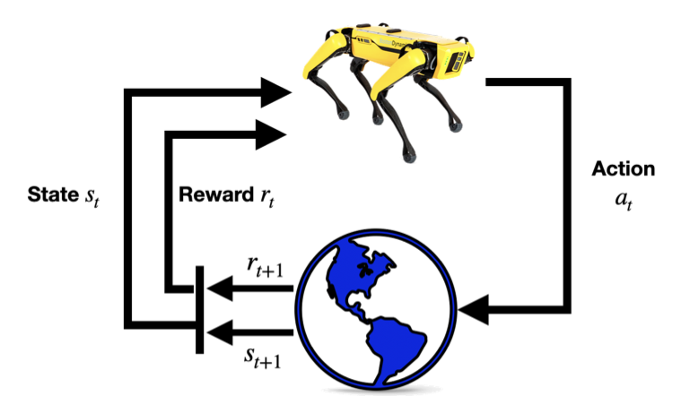
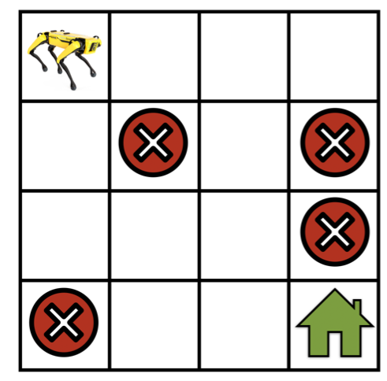

# Reinforcement Learning

> **Ý chính trong một câu:** trong deep learning thường, dự đoán trên một mẫu test **không ảnh hưởng** tới dự đoán trên mẫu kế tiếp; trong reinforcement learning, **quyết định hôm nay đổi cả tương lai** — và đó là toàn bộ khác biệt.

*Chương này do Pratik Chaudhari (University of Pennsylvania và Amazon), Rasool Fakoor (Amazon) và Kavosh Asadi (Amazon) viết.*

## Mục tiêu học tập

Học xong chương, bạn có thể:

- [ ] nói rõ điểm khác biệt cốt lõi giữa reinforcement learning và supervised learning;
- [ ] định nghĩa một {{term:markov-decision-process|Markov decision process}} bằng bộ bốn $(\mathcal{S}, \mathcal{A}, T, r)$ và giải thích vai trò từng thành phần;
- [ ] giải thích vì sao cần {{term:discount-factor|discount factor}} $\gamma$, và $\gamma$ nhỏ hay lớn thì robot cư xử ra sao;
- [ ] kiểm tra một hệ có thoả **giả định Markov** không, và biết cách sửa nếu không;
- [ ] phân biệt {{term:value-function|value function}} $V^\pi(s)$ với {{term:action-value-function|action-value function}} $Q^\pi(s,a)$;
- [ ] viết lại **nguyên lý quy hoạch động** và giải thích vì sao nó là nền của mọi thuật toán RL;
- [ ] mô tả {{term:value-iteration|value iteration}} và nói rõ nó **cần biết gì** về môi trường;
- [ ] mô tả {{term:q-learning|Q-learning}} và chỉ ra chính xác chỗ nó **thoát khỏi** yêu cầu đó;
- [ ] giải thích {{term:epsilon-greedy|$\epsilon$-greedy}} và softmax exploration, và vì sao thăm dò lại cần thiết;
- [ ] giải thích tính chất **tự sửa sai** của Q-learning.

## Bản đồ chương



```text
BÀI TOÁN: ra quyết định TUẦN TỰ, mỗi quyết định đổi cả tương lai
                          │
        17.1 MDP — ngôn ngữ để phát biểu bài toán
             (S, A, T, r) + discount factor γ
                          │
        Nguyên lý quy hoạch động (Bellman):
        "phần còn lại của một quỹ đạo tối ưu cũng tối ưu"
                          │
         ┌────────────────┴─────────────────┐
   17.2 VALUE ITERATION            17.3 Q-LEARNING
   CẦN biết T và r                 KHÔNG cần biết T
   (cộng qua MỌI state kế tiếp)    (dùng state THẬT robot đã đi qua)
         │                                  │
   robot "biết bản đồ"              robot "tự đi và tự học"
                                            │
                                    cần thăm dò (ε-greedy)
                                    + tính tự sửa sai
```

## Bức tranh tổng quan

Reinforcement Learning (RL) là một nhóm kỹ thuật cho phép ta xây dựng hệ thống machine learning **ra quyết định tuần tự**.

**Ví dụ mở đầu của sách.** Một kiện hàng quần áo bạn mua online đến được cửa nhà bạn sau **một chuỗi quyết định**: nhà bán lẻ tìm quần áo ở kho gần nhà bạn nhất, đóng vào hộp, vận chuyển bằng đường bộ hay đường không, rồi giao tới nhà bạn trong thành phố. Rất nhiều biến số ảnh hưởng tới việc giao hàng dọc đường: quần áo có sẵn trong kho hay không, vận chuyển mất bao lâu, kiện hàng có tới thành phố trước khi xe giao hàng hằng ngày rời đi hay không.

**Ý then chốt:** ở mỗi giai đoạn, những biến số ta **thường không kiểm soát được** này lại ảnh hưởng tới **toàn bộ chuỗi sự kiện trong tương lai** — nếu việc đóng hộp ở kho bị trễ, nhà bán lẻ có thể phải chuyển bằng đường không thay vì đường bộ để đảm bảo giao đúng hạn.

Những bài toán như vậy xuất hiện khắp nơi. Khi chơi **cờ vây**, nước đi hiện tại của bạn quyết định các nước tiếp theo, còn nước đi của đối thủ là biến số bạn không kiểm soát — và một chuỗi nước đi rốt cuộc quyết định bạn thắng hay thua. Những bộ phim Netflix gợi ý bây giờ quyết định bạn xem gì; Netflix không biết bạn có thích phim đó không; và rốt cuộc **một chuỗi gợi ý** quyết định bạn hài lòng với Netflix tới đâu.

**Khác biệt cốt lõi so với deep learning tiêu chuẩn**, theo đúng lời sách:

> Trong deep learning tiêu chuẩn, dự đoán của một model đã train trên **một** mẫu test **không ảnh hưởng** tới dự đoán trên mẫu test kế tiếp; trong reinforcement learning, các quyết định ở thời điểm tương lai (trong RL, quyết định còn gọi là **action**) **bị ảnh hưởng** bởi những quyết định đã đưa ra trong quá khứ.

Hãy dừng lại ở câu này, vì nó giải thích mọi thứ còn lại của chương. Vì các quyết định ràng buộc lẫn nhau, ta không thể chỉ tối ưu từng bước một — ta phải tối ưu **cả chuỗi**. Và vì dữ liệu do chính agent sinh ra khi nó hành động, agent còn phải lo cả việc **thu thập đúng loại dữ liệu**.

**Lộ trình của chương:**

| Mục | Nội dung | Cần biết môi trường? |
|---|---|---|
| 17.1 | Markov Decision Process — ngôn ngữ phát biểu bài toán | — |
| 17.2 | Value Iteration — giải bài toán khi **đã biết** môi trường | **có** |
| 17.3 | Q-Learning — giải bài toán khi **chưa biết** môi trường | **không** |

*Ghi chú phạm vi:* phần mở đầu của sách còn hứa hai chủ đề nữa — dùng deep network bằng cách bắt chước hành động của chuyên gia, và một phương pháp RL dùng deep network trong môi trường chưa biết. Trong ấn bản PDF này (trang 781–796), chương chỉ trình bày ba mục ở bảng trên; hai chủ đề còn lại được nhắc tới nhưng không có nội dung.

<!-- pagebreak -->

## 17.1 Markov Decision Process (MDP)

Trong mục này, ta sẽ thảo luận cách **phát biểu** bài toán reinforcement learning bằng Markov decision process và mô tả chi tiết các thành phần của nó.

### 17.1.1 Definition of an MDP

Một {{term:markov-decision-process|Markov decision process}} (MDP) (Bellman, 1957) là một model mô tả **trạng thái của hệ thay đổi thế nào khi các action khác nhau được áp lên hệ**. Bốn đại lượng hợp lại tạo thành một MDP.



**1. Tập trạng thái $\mathcal{S}$.** Lấy ví dụ cụ thể là một robot đang điều hướng trong gridworld như hình trên. Khi đó $\mathcal{S}$ tương ứng với **tập các vị trí** mà robot có thể ở tại một bước thời gian bất kỳ.

**2. Tập hành động $\mathcal{A}$.** Là tập các action robot có thể thực hiện ở mỗi trạng thái, ví dụ "đi thẳng", "rẽ phải", "rẽ trái", "đứng yên". Action có thể đổi trạng thái hiện tại của robot sang một trạng thái khác trong tập $\mathcal{S}$.

**3. Hàm chuyển trạng thái $T$.** Có thể ta **không biết chính xác** robot di chuyển thế nào mà chỉ biết gần đúng. Sách mô hình hoá tình huống này như sau: nếu robot thực hiện action "đi thẳng", có thể có một xác suất nhỏ nó **đứng yên**, một xác suất nhỏ khác nó **rẽ trái**, v.v.

Về mặt toán học, điều này dẫn tới việc định nghĩa một "transition function"

$$
T : \mathcal{S} \times \mathcal{A} \times \mathcal{S} \to [0, 1]
\quad\text{sao cho}\quad
T(s, a, s') = P(s' \mid s, a),
$$

dùng xác suất có điều kiện của việc **đạt tới trạng thái $s'$** với điều kiện robot đang ở trạng thái $s$ và thực hiện action $a$. Transition function là một phân phối xác suất, nên ta có

$$
\sum_{s' \in \mathcal{S}} T(s, a, s') = 1
\qquad \text{với mọi } s \in \mathcal{S},\ a \in \mathcal{A},
$$

tức là **robot buộc phải đi tới trạng thái nào đó** nếu nó thực hiện một action.

**4. Hàm phần thưởng $r$.** Ta xây dựng khái niệm "action nào hữu ích, action nào không" bằng "reward"

$$
r : \mathcal{S} \times \mathcal{A} \to \mathbb{R}.
$$

Ta nói robot nhận reward $r(s, a)$ nếu nó thực hiện action $a$ tại trạng thái $s$. Nếu $r(s,a)$ **lớn**, điều đó cho thấy thực hiện $a$ tại $s$ **hữu ích hơn** cho việc đạt mục tiêu của robot, tức đi tới ngôi nhà xanh. Nếu $r(s,a)$ **nhỏ** thì action $a$ ít hữu ích hơn.

> **Điều quan trọng cần lưu ý:** reward là do **người dùng thiết kế** — tức người tạo ra thuật toán reinforcement learning — với mục tiêu trong đầu. Reward **không** phải thứ có sẵn trong bài toán; nó là cách bạn **nói cho robot biết** bạn muốn gì. Thiết kế reward sai là nguồn lỗi phổ biến nhất trong RL thực tế.

### 17.1.2 Return and Discount Factor

Các thành phần trên hợp lại thành một Markov decision process:

$$
\text{MDP} : (\mathcal{S}, \mathcal{A}, T, r).
$$

Giờ hãy xét tình huống robot bắt đầu ở một trạng thái $s_0 \in \mathcal{S}$ và liên tục thực hiện action, tạo ra một **quỹ đạo** (trajectory)

$$
\tau = (s_0, a_0, r_0, s_1, a_1, r_1, s_2, a_2, r_2, \ldots).
$$

Ở mỗi bước $t$, robot ở trạng thái $s_t$, thực hiện action $a_t$, và nhận reward $r_t = r(s_t, a_t)$.

**Return** của một quỹ đạo là **tổng reward** robot nhận được dọc quỹ đạo đó:

$$
R(\tau) = r_0 + r_1 + r_2 + \cdots
$$

Mục tiêu trong reinforcement learning là tìm quỹ đạo có **return lớn nhất**.

**Vấn đề với tổng vô hạn.** Hãy nghĩ tới tình huống robot cứ đi mãi trong gridworld mà không bao giờ tới đích. Chuỗi trạng thái và action trong một quỹ đạo có thể **dài vô hạn**, và return của bất kỳ quỹ đạo vô hạn nào cũng sẽ **vô hạn**. Khi đó "tìm quỹ đạo có return lớn nhất" trở nên vô nghĩa — mọi quỹ đạo tồi đều có return vô hạn hệt như quỹ đạo tốt.

Để giữ cho công thức RL có nghĩa ngay cả với những quỹ đạo như vậy, ta đưa vào khái niệm **{{term:discount-factor|discount factor}}** $\gamma < 1$ và viết **discounted return**:

$$
R(\tau) = r_0 + \gamma r_1 + \gamma^2 r_2 + \cdots = \sum_{t=0}^{\infty} \gamma^t r_t .
$$

**Đọc công thức bằng lời:** reward ở bước $t$ bị nhân với $\gamma^t$. Vì $\gamma < 1$, hệ số này **giảm theo cấp số nhân**, nên tổng hội tụ ngay cả khi chuỗi dài vô hạn.

**$\gamma$ đổi hành vi của robot thế nào?** Theo đúng cách diễn giải của sách:

- Nếu $\gamma$ **rất nhỏ**, reward robot kiếm được ở tương lai xa — chẳng hạn $t = 1000$ — bị chiết khấu rất mạnh bởi hệ số $\gamma^{1000}$. Điều này **khuyến khích robot chọn quỹ đạo ngắn** để đạt mục tiêu.
- Với $\gamma$ **lớn**, chẳng hạn $\gamma = 0.99$, robot được **khuyến khích thăm dò** rồi mới tìm ra quỹ đạo tốt nhất tới đích.

**Kiểm tra bằng số.** Với $\gamma = 0.5$, reward ở bước 10 chỉ còn trọng số $0.5^{10} \approx 0.001$ — gần như vô hình. Với $\gamma = 0.99$, reward ở bước 10 vẫn còn $0.99^{10} \approx 0.90$, và tới bước 100 vẫn còn $0.37$. Vậy $\gamma$ thực chất đặt ra một **"tầm nhìn xa"** cho robot.

### 17.1.3 Discussion of the Markov Assumption

Hãy nghĩ tới một robot mới, trong đó trạng thái $s_t$ vẫn là vị trí như trên, nhưng action $a_t$ là **gia tốc** robot áp lên bánh xe, thay vì một lệnh trừu tượng như "đi thẳng".

Nếu robot này có vận tốc khác 0 tại trạng thái $s_t$, thì vị trí kế tiếp $s_{t+1}$ là hàm của vị trí quá khứ $s_t$, của gia tốc $a_t$, **và cả vận tốc** của robot tại thời điểm $t$ — mà vận tốc lại tỉ lệ với $s_t - s_{t-1}$. Điều này cho thấy ta phải có

$$
s_{t+1} = \text{hàm nào đó}(s_t, a_t, s_{t-1});
$$

"hàm nào đó" ở đây chính là định luật chuyển động của Newton. Công thức này **khác hẳn** transition function của ta, vốn chỉ phụ thuộc $s_t$ và $a_t$.

**Định nghĩa.** **Hệ Markov** là mọi hệ mà trạng thái kế tiếp $s_{t+1}$ **chỉ** là hàm của trạng thái hiện tại $s_t$ và action $a_t$ tại trạng thái hiện tại. Trong hệ Markov, trạng thái kế tiếp **không phụ thuộc** vào những action đã thực hiện trong quá khứ hay những trạng thái robot đã đi qua trong quá khứ.

Vậy robot mới với action là gia tốc **không phải** hệ Markov, vì vị trí kế tiếp $s_{t+1}$ phụ thuộc trạng thái trước đó $s_{t-1}$ thông qua vận tốc.

**Nhưng đây là điểm đáng nhớ nhất của mục này.** Có vẻ như tính Markov là một giả định hạn chế, nhưng **thực ra không phải vậy**. MDP vẫn mô hình hoá được một lớp rất lớn các hệ thực tế. Với robot mới ở trên, nếu ta chọn trạng thái $s_t$ là **bộ đôi** $(\text{vị trí}_t, \text{vận tốc}_t)$ thì hệ **trở thành Markov**, vì trạng thái kế tiếp $(\text{vị trí}_{t+1}, \text{vận tốc}_{t+1})$ chỉ phụ thuộc trạng thái hiện tại $(\text{vị trí}_t, \text{vận tốc}_t)$ và action $a_t$ tại trạng thái hiện tại.

> **Cách nhớ:** khi một hệ không Markov, đừng vội bỏ MDP — hãy hỏi *"tôi cần nhét thêm gì vào trạng thái để nó trở thành Markov?"*. Thường thì câu trả lời là **nhét thêm phần lịch sử mà tương lai thực sự cần**.

### 17.1.4 Summary

- Bài toán reinforcement learning thường được mô hình hoá bằng Markov Decision Process.
- Một MDP được định nghĩa bởi bộ bốn $(\mathcal{S}, \mathcal{A}, T, r)$, trong đó $\mathcal{S}$ là không gian trạng thái, $\mathcal{A}$ là không gian hành động, $T$ là transition function mã hoá xác suất chuyển trạng thái của MDP, và $r$ là reward tức thời nhận được khi thực hiện một action tại một trạng thái cụ thể.

### 17.1.5 Exercises

1. Giả sử ta muốn thiết kế một MDP để mô hình hoá bài toán **MountainCar**.
   1. Tập trạng thái sẽ là gì?
   2. Tập hành động sẽ là gì?
   3. Các hàm reward khả dĩ là gì?
2. Bạn sẽ thiết kế MDP thế nào cho một game Atari như **Pong**?

<details markdown="1"><summary>Gợi ý</summary>

Câu 1: MountainCar là bài toán xe không đủ lực leo dốc, phải đánh đu qua lại để lấy đà. Xem lại mục 17.1.3 — chỉ vị trí xe có đủ để làm trạng thái Markov không? Câu 2: một khung hình Pong tĩnh có cho bạn biết bóng đang bay theo hướng nào không?
</details>

<details markdown="1"><summary>Lời giải</summary>

**Câu 1 — MountainCar.**

**(a) Tập trạng thái.** Đây chính là chỗ mục 17.1.3 phát huy tác dụng. Chỉ dùng **vị trí** thì hệ **không Markov**: xe ở giữa dốc đang đi lên và xe ở giữa dốc đang đi xuống có cùng vị trí nhưng tương lai hoàn toàn khác nhau. Vậy trạng thái phải là **bộ đôi**:

$$
s = (\text{vị trí},\ \text{vận tốc}) \in \mathbb{R}^2 .
$$

Đây đúng là trạng thái mà OpenAI Gym dùng cho MountainCar: vị trí trong khoảng $[-1.2,\ 0.6]$ và vận tốc trong $[-0.07,\ 0.07]$.

**(b) Tập hành động.** Ba action rời rạc: **đẩy trái**, **không đẩy**, **đẩy phải**. (Biến thể `MountainCarContinuous` dùng một lực liên tục trong $[-1, 1]$.)

**(c) Hàm reward.** Có vài lựa chọn, và so sánh chúng dạy ta nhiều điều:

| Thiết kế reward | Hành vi thu được |
|---|---|
| $-1$ mỗi bước cho tới khi tới đích | robot học đi **nhanh nhất có thể** — đây là thiết kế chuẩn của Gym |
| $+1$ khi tới đích, $0$ ở mọi nơi khác | đúng về mặt mục tiêu nhưng **rất khó học**: tín hiệu quá thưa, robot ngẫu nhiên gần như không bao giờ chạm đích |
| thưởng theo **độ cao** đạt được | dễ học hơn, nhưng rủi ro: robot có thể học leo lên rồi dừng ở lưng chừng để "gặt" độ cao mãi |

Dòng cuối minh hoạ **reward hacking**: robot tối ưu đúng thứ bạn viết ra, không phải thứ bạn nghĩ trong đầu. Nhớ lại lời sách ở mục 17.1.1 — reward là do **bạn** thiết kế.

**Câu 2 — Pong.**

**Tập trạng thái.** Đây là chỗ giả định Markov lại xuất hiện. **Một khung hình đơn lẻ không đủ**: từ một ảnh tĩnh bạn thấy được vị trí bóng nhưng **không biết bóng đang bay hướng nào hay nhanh chậm ra sao**. Hệ không Markov.

Cách khắc phục kinh điển (và là cách DQN của Mnih và cộng sự 2013 dùng): **xếp chồng 4 khung hình liên tiếp** làm một trạng thái. Chồng khung hình đó chứa đủ thông tin để suy ra hướng và tốc độ — đúng tinh thần "nhét thêm phần lịch sử mà tương lai cần" ở mục 17.1.3.

Ngoài ra thường có các bước tiền xử lý: chuyển ảnh xám và thu nhỏ (ví dụ $84 \times 84$) để giảm kích thước không gian trạng thái.

Một lựa chọn khác là dùng **trạng thái do người thiết kế**: $(x_{\text{bóng}}, y_{\text{bóng}}, v_x, v_y, y_{\text{vợt ta}}, y_{\text{vợt đối thủ}})$. Gọn hơn nhiều, nhưng đòi hỏi ta tự trích xuất các đại lượng đó — mất đi tính tổng quát "học thẳng từ pixel".

**Tập hành động.** Ba action: **lên**, **xuống**, **đứng yên**. (Giao diện Atari của Gym thực ra cho 6 action, nhưng vài action trùng nhau.)

**Hàm reward.** Cách tự nhiên nhất là dùng chính điểm số của game: $+1$ khi ta ghi điểm, $-1$ khi đối thủ ghi điểm, $0$ ở mọi bước khác. Reward này **rất thưa** — hàng trăm bước mới có một tín hiệu khác 0 — và chính đó là lý do các game Atari là bài toán khó cho RL.

**Bẫy thường gặp:** chọn trạng thái là một khung hình rồi không hiểu vì sao agent học mãi không xong. Vấn đề không nằm ở thuật toán mà ở chỗ bài toán đã bị phát biểu **không Markov** ngay từ đầu.
</details>

<!-- pagebreak -->

## 17.2 Value Iteration

Trong mục này ta thảo luận cách **chọn action tốt nhất** cho robot ở mỗi trạng thái để cực đại return của quỹ đạo. Ta sẽ mô tả thuật toán **value iteration** và hiện thực nó cho một robot mô phỏng đi trên hồ băng.

### 17.2.1 Stochastic Policy

Một **stochastic policy**, ký hiệu $\pi(a \mid s)$ (gọi tắt là **{{term:policy|policy}}**), là một **phân phối có điều kiện** trên các action $a \in \mathcal{A}$ khi biết trạng thái $s \in \mathcal{S}$.

**Ví dụ của sách.** Nếu robot có bốn action $\mathcal{A} = \{$đi trái, đi xuống, đi phải, đi lên$\}$, thì policy tại một trạng thái $s$ là một phân phối categorical, chẳng hạn xác suất của bốn action là $[0.4, 0.2, 0.1, 0.3]$; tại một trạng thái khác $s'$ thì xác suất của cùng bốn action đó có thể là $[0.1, 0.1, 0.2, 0.6]$.

Lưu ý ta phải có $\sum_a \pi(a \mid s) = 1$ với **mọi** trạng thái $s$.

**Deterministic policy** là trường hợp đặc biệt của stochastic policy, trong đó phân phối $\pi(a \mid s)$ chỉ gán xác suất khác 0 cho **đúng một** action, ví dụ $[1, 0, 0, 0]$.

> **Quy ước ký hiệu:** để bớt rườm rà, sách thường viết $\pi(s)$ thay cho phân phối có điều kiện $\pi(a \mid s)$.

### 17.2.2 Value Function

Hãy tưởng tượng robot bắt đầu ở trạng thái $s_0$, và ở mỗi thời điểm nó **lấy mẫu** một action từ policy, $a_t \sim \pi(s_t)$, rồi thực hiện action đó để tới trạng thái kế tiếp $s_{t+1}$.

Quỹ đạo $\tau = (s_0, a_0, r_0, s_1, a_1, r_1, \ldots)$ có thể **khác nhau** tuỳ theo action nào được lấy mẫu ở các thời điểm trung gian. Ta định nghĩa **return trung bình** của tất cả các quỹ đạo như vậy:

$$
V^{\pi}(s_0) = \mathbb{E}_{a_t \sim \pi(s_t)}\big[ R(\tau) \big]
= \mathbb{E}_{a_t \sim \pi(s_t)}\left[ \sum_{t=0}^{\infty} \gamma^t r(s_t, a_t) \right],
$$

trong đó $s_{t+1} \sim P(s_{t+1} \mid s_t, a_t)$ là trạng thái kế tiếp và $r(s_t, a_t)$ là reward tức thời.

Đây gọi là **{{term:value-function|value function}}** của policy $\pi$. Nói đơn giản: **giá trị của một trạng thái $s_0$ đối với policy $\pi$ là return kỳ vọng có chiết khấu mà robot thu được nếu nó bắt đầu ở $s_0$ và luôn hành động theo $\pi$.**

**Phép chia hai giai đoạn — ý tưởng quan trọng nhất của cả chương.**

Ta chia quỹ đạo thành hai phần: (i) giai đoạn đầu tương ứng với $s_0 \xrightarrow{a_0} s_1$, và (ii) giai đoạn hai là quỹ đạo $\tau' = (s_1, a_1, r_1, \ldots)$ sau đó.

Theo đúng lời sách:

> **Ý tưởng then chốt đằng sau mọi thuật toán trong reinforcement learning** là giá trị của trạng thái $s_0$ có thể viết thành **reward trung bình thu được ở giai đoạn đầu** cộng với **value function lấy trung bình trên mọi trạng thái kế tiếp $s_1$**.

Điều này khá trực giác và nó **đến từ chính giả định Markov**: return trung bình từ trạng thái hiện tại bằng tổng của return trung bình từ trạng thái kế tiếp và reward trung bình của việc đi tới trạng thái kế tiếp đó.

Về mặt toán học:

$$
V^{\pi}(s_0) = \mathbb{E}_{a_0 \sim \pi(s_0)}\Big[ r(s_0, a_0) + \gamma\, \mathbb{E}_{s_1 \sim P(s_1 \mid s_0, a_0)}\big[ V^{\pi}(s_1) \big] \Big].
$$

Chú ý giai đoạn hai có **hai** kỳ vọng lồng nhau: một trên các lựa chọn action $a_0$ theo stochastic policy, và một trên các trạng thái $s_1$ có thể đạt tới từ action đã chọn.

Viết lại bằng transition probability của MDP:

$$
V^{\pi}(s) = \sum_{a \in \mathcal{A}} \pi(a \mid s)
\left[ r(s, a) + \gamma \sum_{s' \in \mathcal{S}} P(s' \mid s, a)\, V^{\pi}(s') \right];
\quad \text{với mọi } s \in \mathcal{S}.
$$

**Điều quan trọng cần nhận ra:** đẳng thức trên đúng với **mọi** trạng thái $s \in \mathcal{S}$, vì ta có thể lấy bất kỳ quỹ đạo nào bắt đầu tại trạng thái đó rồi chia nó làm hai giai đoạn.

> **Cách nhớ:** phép chia hai giai đoạn biến một tổng vô hạn thành một **phương trình đệ quy**. Đó là lý do bài toán trở nên giải được: thay vì cộng vô số reward, ta chỉ cần giải một hệ ràng buộc nối các $V(s)$ với nhau.

### 17.2.3 Action-Value Function

Trong lúc hiện thực, thường hữu ích khi giữ một đại lượng gọi là **{{term:action-value-function|action-value function}}**, rất gần với value function. Nó được định nghĩa là return trung bình của một quỹ đạo bắt đầu ở $s_0$ **nhưng action của giai đoạn đầu bị cố định** là $a_0$:

$$
Q^{\pi}(s_0, a_0) = r(s_0, a_0) + \mathbb{E}_{a_t \sim \pi(s_t)}\left[ \sum_{t=1}^{\infty} \gamma^t r(s_t, a_t) \right].
$$

Chú ý tổng bên trong kỳ vọng chạy từ $t = 1$ chứ không phải $t = 0$, vì reward của giai đoạn đầu đã **cố định** trong trường hợp này.

Cũng chia quỹ đạo làm hai phần như trên, ta được:

$$
Q^{\pi}(s, a) = r(s, a) + \gamma \sum_{s' \in \mathcal{S}} P(s' \mid s, a) \sum_{a' \in \mathcal{A}} \pi(a' \mid s')\, Q^{\pi}(s', a');
\quad \text{với mọi } s \in \mathcal{S},\ a \in \mathcal{A}.
$$

**Vì sao trong thực tế người ta thích $Q$ hơn $V$?** Vì $Q$ nói thẳng cho bạn biết **nên làm gì**. Nếu chỉ có $V(s)$, muốn chọn action tốt nhất bạn vẫn phải tính $r(s,a) + \gamma\sum_{s'} P(s'\mid s,a) V(s')$ cho từng $a$ — **cần biết $P$**. Còn với $Q(s,a)$, action tốt nhất chỉ đơn giản là $\arg\max_a Q(s,a)$ — **không cần biết gì thêm**. Chính điểm này khiến mục 17.3 khả thi.

### 17.2.4 Optimal Stochastic Policy

Cả value function lẫn action-value function đều phụ thuộc vào policy mà robot chọn. Tiếp theo ta nghĩ tới **optimal policy** — policy đạt return trung bình lớn nhất:

$$
\pi^{*} = \arg\max_{\pi} V^{\pi}(s_0).
$$

Trong mọi stochastic policy mà robot có thể chọn, optimal policy $\pi^{*}$ đạt discounted return trung bình lớn nhất cho các quỹ đạo bắt đầu từ $s_0$. Ta ký hiệu value function và action-value function của optimal policy là $V^{*} \equiv V^{\pi^{*}}$ và $Q^{*} \equiv Q^{\pi^{*}}$.

Với **deterministic policy** — chỉ có đúng một action khả dĩ tại mỗi trạng thái — ta được:

$$
\pi^{*}(s) = \arg\max_{a \in \mathcal{A}}
\left[ r(s, a) + \gamma \sum_{s' \in \mathcal{S}} P(s' \mid s, a)\, V^{*}(s') \right].
$$

> **Câu thần chú đáng nhớ của sách:** action tối ưu tại trạng thái $s$ (với deterministic policy) là **action cực đại tổng của reward $r(s,a)$ từ giai đoạn đầu và return trung bình của các quỹ đạo bắt đầu từ trạng thái kế tiếp $s'$, lấy trung bình trên mọi $s'$ có thể của giai đoạn hai.**

### 17.2.5 Principle of Dynamic Programming

Những gì xây dựng ở các mục trước có thể biến thành **thuật toán** để tính $V^*$ hoặc $Q^*$. Quan sát rằng:

$$
V^{*}(s) = \sum_{a \in \mathcal{A}} \pi^{*}(a \mid s)
\left[ r(s, a) + \gamma \sum_{s' \in \mathcal{S}} P(s' \mid s, a)\, V^{*}(s') \right];
\quad \text{với mọi } s \in \mathcal{S}.
$$

Với deterministic optimal policy $\pi^*$, vì chỉ có một action được chọn tại mỗi trạng thái, ta cũng viết được:

$$
V^{*}(s) = \max_{a \in \mathcal{A}}
\left\{ r(s, a) + \gamma \sum_{s' \in \mathcal{S}} P(s' \mid s, a)\, V^{*}(s') \right\}
\quad \text{với mọi } s \in \mathcal{S}.
$$

Đẳng thức này gọi là **nguyên lý quy hoạch động** (principle of dynamic programming), do Richard Bellman phát biểu vào những năm 1950. Cách nhớ của sách rất gọn:

> **"Phần còn lại của một quỹ đạo tối ưu thì cũng tối ưu."**

Câu đó đáng suy nghĩ kỹ. Nếu đường đi tốt nhất từ Hà Nội tới Cà Mau đi qua Đà Nẵng, thì đoạn từ Đà Nẵng tới Cà Mau **phải** là đường tốt nhất giữa hai điểm đó — nếu không, ta đã thay nó bằng đoạn tốt hơn và có đường đi tổng thể tốt hơn, mâu thuẫn.

### 17.2.6 Value Iteration

Ta có thể biến nguyên lý quy hoạch động thành thuật toán tìm optimal value function, gọi là **{{term:value-iteration|value iteration}}**.

Ý tưởng then chốt là **coi đẳng thức trên như một tập ràng buộc** nối các $V^*(s)$ ở những trạng thái khác nhau lại với nhau.

<div class="algorithm-block" markdown="1">
<p class="algorithm-label">LUỒNG THUẬT TOÁN · VALUE ITERATION</p>

**Đầu vào:** MDP đầy đủ $(\mathcal{S}, \mathcal{A}, T, r)$ và discount factor $\gamma$.

1. **Khởi tạo** value function về những giá trị **tuỳ ý** $V_0(s)$ cho mọi trạng thái $s \in \mathcal{S}$.
2. Ở vòng lặp thứ $k$, cập nhật value function:
   $$
   V_{k+1}(s) = \max_{a \in \mathcal{A}}
   \left\{ r(s, a) + \gamma \sum_{s' \in \mathcal{S}} P(s' \mid s, a)\, V_k(s') \right\};
   \quad \text{với mọi } s \in \mathcal{S}.
   $$
3. Lặp lại bước 2 cho tới khi hội tụ.

**Đầu ra:** $V^{*}(s) = \lim_{k \to \infty} V_k(s)$ với mọi trạng thái $s$.
</div>

Điều đáng chú ý là **value function ước lượng bởi value iteration hội tụ về optimal value function bất kể khởi tạo $V_0$ là gì**.

Cùng thuật toán đó viết theo action-value function:

$$
Q_{k+1}(s, a) = r(s, a) + \gamma \max_{a' \in \mathcal{A}} \sum_{s' \in \mathcal{S}} P(s' \mid s, a)\, Q_k(s', a');
\quad \text{với mọi } s \in \mathcal{S},\ a \in \mathcal{A}.
$$

Ta khởi tạo $Q_0(s,a)$ tuỳ ý và lại có $Q^{*}(s,a) = \lim_{k \to \infty} Q_k(s,a)$.

### 17.2.7 Policy Evaluation

Value iteration cho ta tính được optimal value function $V^{*} \equiv V^{\pi^{*}}$ của deterministic optimal policy. Ta **cũng** có thể dùng cập nhật lặp tương tự để tính value function của **một policy $\pi$ bất kỳ**, kể cả policy ngẫu nhiên.

Lại khởi tạo $V_0^{\pi}(s)$ tuỳ ý và ở vòng lặp thứ $k$ thực hiện:

$$
V_{k+1}^{\pi}(s) = \sum_{a \in \mathcal{A}} \pi(a \mid s)
\left[ r(s, a) + \gamma \sum_{s' \in \mathcal{S}} P(s' \mid s, a)\, V_k^{\pi}(s') \right];
\quad \text{với mọi } s \in \mathcal{S}.
$$

Thuật toán này gọi là **policy evaluation** và hữu ích để tính value function **khi đã cho trước policy**. Nó cũng hội tụ bất kể khởi tạo.

**Khác biệt duy nhất so với value iteration** nằm ở một ký hiệu: value iteration dùng $\max_a$, còn policy evaluation dùng $\sum_a \pi(a\mid s)$. Nói cách khác, value iteration hỏi *"nếu tôi luôn chọn action tốt nhất thì được bao nhiêu?"*, còn policy evaluation hỏi *"nếu tôi cứ hành động theo $\pi$ thì được bao nhiêu?"*.

### 17.2.8 Implementation of Value Iteration

Sách hiện thực value iteration cho bài toán điều hướng **FrozenLake** từ OpenAI Gym.

```python
import random
import numpy as np
from d2l import torch as d2l

seed = 0            # Cố định seed để kết quả lặp lại được
gamma = 0.95        # Discount factor
num_iters = 10      # Số vòng lặp
random.seed(seed)
np.random.seed(seed)
env_info = d2l.make_env('FrozenLake-v1', seed=seed)
```

**Thiết lập bài toán.** Trong môi trường FrozenLake, robot di chuyển trên lưới $4 \times 4$ (đây chính là các trạng thái) với các action "lên" ($\uparrow$), "xuống" ($\downarrow$), "trái" ($\leftarrow$) và "phải" ($\rightarrow$). Môi trường chứa một số ô hố (**H**), ô băng (**F**) và một ô đích (**G**) — tất cả đều **robot không biết trước**.

Để giữ bài toán đơn giản, sách giả định robot có **action đáng tin cậy**, tức $P(s' \mid s, a) = 1$ với mọi $s \in \mathcal{S}$, $a \in \mathcal{A}$.

**Cấu trúc reward:** nếu robot tới đích, lượt thử kết thúc và robot nhận reward $1$ **bất kể action**; reward ở mọi trạng thái khác là $0$ với mọi action. Mục tiêu là học một policy đi từ ô xuất phát (**S**) tới ô đích (**G**) sao cho return lớn nhất.

> **Chú ý cấu trúc reward này rất thưa.** Chỉ có đúng một ô cho reward khác 0. Điều đó có nghĩa là ở vòng lặp đầu tiên, gần như mọi $V(s)$ đều bằng 0; giá trị **lan truyền ngược** từ ô đích ra dần qua từng vòng lặp. Đây là lý do số vòng lặp cần thiết phụ thuộc vào **kích thước lưới** — nội dung của bài tập 1.

```python
def value_iteration(env_info, gamma, num_iters):
    env_desc = env_info['desc']          # 2D array mô tả môi trường
    prob_idx = env_info['trans_prob_idx']
    nextstate_idx = env_info['nextstate_idx']
    reward_idx = env_info['reward_idx']
    num_states = env_info['num_states']
    num_actions = env_info['num_actions']
    mdp = env_info['mdp']

    V = np.zeros((num_iters + 1, num_states))
    Q = np.zeros((num_iters + 1, num_states, num_actions))
    pi = np.zeros((num_iters + 1, num_states))

    for k in range(1, num_iters + 1):
        for s in range(num_states):
            for a in range(num_actions):
                # Tính Q(s, a) bằng cách cộng qua MỌI trạng thái kế tiếp khả dĩ.
                # Chính dòng này đòi hỏi ta phải BIẾT transition function.
                for pxrds in mdp[(s, a)]:
                    pr = pxrds[prob_idx]            # P(s' | s, a)
                    nextstate = pxrds[nextstate_idx]
                    reward = pxrds[reward_idx]
                    Q[k, s, a] += pr * (reward + gamma * V[k - 1, nextstate])
            # Nguyên lý quy hoạch động: lấy max trên các action.
            V[k, s] = np.max(Q[k, s, :])
            pi[k, s] = np.argmax(Q[k, s, :])
    d2l.show_value_function_progress(env_desc, V[:-1], pi[:-1])
```

Hãy nhìn kỹ vòng lặp `for pxrds in mdp[(s, a)]`. Nó cộng qua **mọi** trạng thái kế tiếp khả dĩ, có trọng số là xác suất chuyển. Đây chính xác là chỗ value iteration **đòi hỏi ta biết MDP**, và cũng là chỗ mục 17.3 sẽ thay đổi.

### 17.2.9 Summary

- Ý tưởng chính đằng sau thuật toán Value Iteration là dùng **nguyên lý quy hoạch động** để tìm return trung bình tối ưu thu được từ một trạng thái cho trước.
- Lưu ý rằng hiện thực Value Iteration **đòi hỏi ta phải biết Markov decision process một cách đầy đủ**, ví dụ transition function và reward function.

### 17.2.10 Exercises

1. Thử tăng kích thước lưới lên $8 \times 8$. So với lưới $4 \times 4$, cần bao nhiêu vòng lặp để tìm ra optimal value function?
2. Độ phức tạp tính toán của thuật toán Value Iteration là bao nhiêu?
3. Chạy lại thuật toán Value Iteration với $\gamma$ (tức `gamma` trong đoạn mã trên) bằng $0$, $0.5$ và $1$, rồi phân tích kết quả.
4. Giá trị của $\gamma$ ảnh hưởng thế nào tới số vòng lặp mà Value Iteration cần để hội tụ? Điều gì xảy ra khi $\gamma = 1$?

<details markdown="1"><summary>Gợi ý</summary>

Câu 1: reward chỉ khác 0 ở ô đích — giá trị phải "lan" từ đó ra bao xa? Câu 2: đếm các vòng `for` lồng nhau trong đoạn mã ở mục 17.2.8. Câu 4: nhớ lại lý do ta đưa discount factor vào ở mục 17.1.2 — điều gì bảo đảm tổng hội tụ, và nó còn đúng khi $\gamma = 1$ không?
</details>

<details markdown="1"><summary>Lời giải</summary>

**Câu 1.** Cần **nhiều vòng lặp hơn**, và lý do rất cụ thể.

Vì reward chỉ khác 0 tại ô đích, mỗi vòng lặp value iteration chỉ đẩy thông tin giá trị **lùi được đúng một ô**. Trên lưới $4\times4$, ô xa nhất cách đích khoảng 6 bước, nên cỡ 6–7 vòng lặp là giá trị đã chạm tới mọi ô. Trên lưới $8\times8$, khoảng cách xa nhất khoảng 14 bước, nên cần khoảng **gấp đôi** số vòng lặp.

Quy luật tổng quát: số vòng lặp cần để giá trị **lan ra khắp lưới** tỉ lệ với **đường kính** của không gian trạng thái, chứ không phải với số trạng thái. Đó là một tin tốt.

(Phân biệt điều này với *chi phí mỗi vòng lặp*, vốn tỉ lệ với số trạng thái — xem câu 2.)

**Câu 2.** Đọc thẳng từ các vòng `for` lồng nhau ở mục 17.2.8:

$$
O(k \cdot |\mathcal{S}|^2 \cdot |\mathcal{A}|)
$$

với $k$ là số vòng lặp. Cụ thể: vòng ngoài chạy $k$ lần; với mỗi vòng, ta duyệt $|\mathcal{S}|$ trạng thái; với mỗi trạng thái, duyệt $|\mathcal{A}|$ action; và với mỗi cặp $(s,a)$, ta cộng qua các trạng thái kế tiếp — nhiều nhất là $|\mathcal{S}|$.

Vậy **mỗi vòng lặp** tốn $O(|\mathcal{S}|^2 |\mathcal{A}|)$.

Hệ quả thực tế rất quan trọng: chi phí **bậc hai theo số trạng thái** khiến value iteration không dùng được cho những bài toán có không gian trạng thái lớn. Cờ vây có khoảng $10^{170}$ trạng thái — không có cách nào lập bảng hết. Đây là động cơ cho việc dùng deep network để **xấp xỉ** $Q$ thay vì lưu bảng.

Chú ý rằng trong FrozenLake với action đáng tin cậy ($P(s'\mid s,a) = 1$), tổng bên trong chỉ có **một** số hạng, nên thực tế là $O(k |\mathcal{S}| |\mathcal{A}|)$.

**Câu 3.** Ba giá trị cho ba hành vi khác hẳn nhau:

| $\gamma$ | Điều gì xảy ra | Vì sao |
|---|---|---|
| $0$ | $V(s) = \max_a r(s,a)$ — robot **hoàn toàn thiển cận** | mọi reward tương lai bị nhân 0; robot chỉ thấy bước kế tiếp. Vì reward chỉ khác 0 ở ô đích, $V(s) = 0$ ở mọi nơi trừ ô cạnh đích — policy thu được **vô dụng** |
| $0.5$ | robot tìm đường tới đích nhưng **ưu tiên đường ngắn rất mạnh** | reward ở bước $t$ chỉ còn trọng số $0.5^t$; ở khoảng cách 6 bước giá trị chỉ còn $\approx 0.016$, gần như không phân biệt được với 0 |
| $1$ | không còn chiết khấu; xem câu 4 | |

Bài học: $\gamma$ **không phải** một hằng số kỹ thuật vô hại. Nó định nghĩa **robot quan tâm tới tương lai xa tới đâu**, và với reward thưa, $\gamma$ quá nhỏ làm bài toán trở nên không giải được.

**Câu 4.** $\gamma$ **càng lớn thì càng cần nhiều vòng lặp để hội tụ**.

Trực giác: sai số của value iteration co lại với hệ số $\gamma$ mỗi vòng lặp. Với $\gamma = 0.5$, sai số giảm một nửa mỗi vòng — rất nhanh. Với $\gamma = 0.99$, mỗi vòng chỉ giảm 1% — chậm hơn rất nhiều. Đó là cái giá phải trả cho tầm nhìn xa.

**Khi $\gamma = 1$** thì có vấn đề thật sự, và nó nối thẳng về mục 17.1.2. Không còn chiết khấu, nên với quỹ đạo dài vô hạn thì tổng $\sum_t r_t$ **có thể phân kỳ** — chính là vấn đề mà discount factor sinh ra để giải quyết. Value iteration khi đó **không đảm bảo hội tụ**.

Nói chính xác hơn: với bài toán **episodic** như FrozenLake, nơi mọi quỹ đạo rốt cuộc đều kết thúc (tới đích hoặc rơi hố), $\gamma = 1$ vẫn dùng được và cho nghiệm hữu hạn. Nhưng nếu robot có thể đi lòng vòng mãi mà không kết thúc, giá trị sẽ tăng không giới hạn. Trong thực tế người ta gần như luôn dùng $\gamma < 1$ để đảm bảo an toàn.

**Bẫy thường gặp:** đặt $\gamma$ thật nhỏ để "hội tụ nhanh hơn", rồi ngạc nhiên vì policy thu được chẳng bao giờ tìm được đích. Bạn đã hội tụ nhanh — nhưng hội tụ về lời giải của một bài toán **khác**.
</details>

<!-- pagebreak -->

## 17.3 Q-Learning

Ở mục trước, ta bàn về Value Iteration — thuật toán **đòi hỏi truy cập toàn bộ** Markov decision process, ví dụ transition function và reward function. Trong mục này ta xét **{{term:q-learning|Q-Learning}}** (Watkins và Dayan, 1992), một thuật toán học value function mà **không nhất thiết phải biết MDP**.

Theo lời sách, thuật toán này thể hiện **ý tưởng trung tâm của reinforcement learning**: nó cho phép robot **tự thu thập dữ liệu của chính mình**.

### 17.3.1 The Q-Learning Algorithm

Nhớ lại value iteration viết theo action-value function:

$$
Q_{k+1}(s, a) = r(s, a) + \gamma \sum_{s' \in \mathcal{S}} P(s' \mid s, a)\,
\max_{a' \in \mathcal{A}} Q_k(s', a');
\quad \text{với mọi } s \in \mathcal{S},\ a \in \mathcal{A}.
$$

Như đã bàn, hiện thực thuật toán này đòi hỏi biết MDP, cụ thể là transition function $P(s' \mid s, a)$.

**Ý tưởng then chốt của Q-Learning**, và đây là toàn bộ mấu chốt của mục này:

> Thay tổng chạy qua **mọi** $s' \in \mathcal{S}$ trong biểu thức trên bằng tổng chạy qua **những trạng thái mà robot đã thực sự đi qua**.

Điều này cho phép ta **né được** nhu cầu phải biết transition function.

Hãy dừng lại để thấy sự tinh tế. Ta không hề "gian lận" hay bỏ bớt thông tin — ta chỉ đổi cách **lấy mẫu**. Khi robot thực sự đi, tần suất nó tới $s'$ tự động phản ánh $P(s' \mid s, a)$. Vậy dữ liệu đã **chứa sẵn** transition function, chỉ là dưới dạng ngầm định.

### 17.3.2 An Optimization Problem Underlying Q-Learning

Giả sử robot dùng policy $\pi_e(a \mid s)$ để thực hiện action. Nó thu thập được một tập dữ liệu gồm $n$ quỹ đạo, mỗi quỹ đạo $T$ bước:

$$
\left\{ (s_t^i, a_t^i, r_t^i) \right\}_{t=0,\ldots,T-1}^{i=1,\ldots,n}.
$$

Nhớ lại value iteration thực chất là **một tập ràng buộc** nối các $Q(s,a)$ ở những cặp trạng thái–action khác nhau. Ta hiện thực một phiên bản **xấp xỉ** của value iteration dùng chính dữ liệu robot đã thu thập:

$$
\hat{Q} = \min_{Q} \underbrace{\frac{1}{nT} \sum_{i=1}^{n} \sum_{t=0}^{T-1}
\left( Q(s_t^i, a_t^i) - r_t^i - \gamma \max_{a'} Q(s_{t+1}^i, a') \right)^2}_{\textstyle \stackrel{\text{def}}{=}\ \ell(Q)} .
$$

**So sánh với value iteration.** Nếu policy $\pi_e$ của robot **đúng bằng** optimal policy $\pi^*$, và nếu nó thu thập **vô hạn** dữ liệu, thì bài toán tối ưu này **trùng khớp** với bài toán tối ưu nằm dưới value iteration.

Nhưng trong khi value iteration bắt ta phải biết $P(s' \mid s, a)$, **hàm mục tiêu ở đây không có số hạng đó**. Sách nói rõ ta **không hề gian lận**:

> Khi robot dùng policy $\pi_e$ để thực hiện một action tại trạng thái $s_t^i$, trạng thái kế tiếp $s_{t+1}^i$ là **một mẫu được rút ra từ transition function**. Vậy hàm mục tiêu tối ưu **cũng có** quyền truy cập vào transition function, nhưng là **ngầm định thông qua dữ liệu robot đã thu thập**.

**Cập nhật bằng gradient descent.** Biến của bài toán tối ưu là $Q(s,a)$ cho mọi $s$ và $a$. Với mỗi bộ $(s_t^i, a_t^i, r_t^i, s_{t+1}^i)$ trong tập dữ liệu, ta viết:

$$
Q(s_t^i, a_t^i) \leftarrow (1 - \alpha) Q(s_t^i, a_t^i)
+ \alpha \left[ r_t^i + \gamma \max_{a'} Q(s_{t+1}^i, a') \right],
$$

trong đó $\alpha$ là learning rate.

**Đọc công thức này bằng lời:** giá trị mới là **trung bình có trọng số** giữa giá trị cũ (trọng số $1-\alpha$) và một "mục tiêu" mới (trọng số $\alpha$). Mục tiêu đó là reward vừa nhận cộng giá trị tốt nhất của trạng thái kế tiếp. Nói cách khác: *"tin một chút vào những gì vừa quan sát, giữ phần lớn những gì đã biết."*

**Trạng thái kết thúc.** Trong bài toán thực, khi robot tới đích thì quỹ đạo kết thúc. Giá trị của trạng thái kết thúc như vậy **bằng 0**, vì robot không thực hiện thêm action nào nữa. Ta phải sửa cập nhật để xử lý những trạng thái đó:

$$
Q(s_t^i, a_t^i) \leftarrow (1 - \alpha) Q(s_t^i, a_t^i)
+ \alpha \left[ r_t^i + \gamma (1 - \mathbb{1}_{s_{t+1}^i \text{ là kết thúc}}) \max_{a'} Q(s_{t+1}^i, a') \right].
$$

Chỉ số $\mathbb{1}$ tắt hẳn số hạng tương lai khi trạng thái kế tiếp là kết thúc.

### 17.3.3 Exploration in Q-Learning

Policy $\pi_e$ mà robot dùng để thu thập dữ liệu là **cực kỳ quan trọng** để Q-Learning hoạt động tốt. Suy cho cùng, ta đã thay kỳ vọng theo transition function bằng dữ liệu robot thu thập.

Nếu policy $\pi_e$ **không đi tới những phần đa dạng** của không gian trạng thái–action, thì dễ hình dung rằng ước lượng $\hat{Q}$ sẽ là một xấp xỉ tồi của $Q^*$.

**Và đây là điểm dễ bị bỏ sót nhưng rất quan trọng.** Trong tình huống đó, ước lượng $\hat{Q}$ sẽ tồi **ở mọi trạng thái** $s \in \mathcal{S}$, chứ không chỉ ở những trạng thái mà $\pi_e$ đã ghé qua. Lý do là hàm mục tiêu Q-Learning (cũng như value iteration) là **một ràng buộc nối giá trị của mọi cặp trạng thái–action lại với nhau**. Một mắt xích sai làm hỏng cả chuỗi. Vì vậy việc chọn đúng policy $\pi_e$ để thu thập dữ liệu là **then chốt**.

Ta có thể giảm nhẹ lo ngại này bằng cách chọn một policy **hoàn toàn ngẫu nhiên** $\pi_e$, lấy mẫu action đều từ $\mathcal{A}$. Policy như vậy sẽ ghé thăm mọi trạng thái, **nhưng sẽ cần rất nhiều quỹ đạo** trước khi làm được điều đó.

Từ đó ta đến với **ý tưởng then chốt thứ hai** của Q-Learning: **exploration** (thăm dò). Các hiện thực điển hình của Q-Learning **buộc chặt** ước lượng $\hat{Q}$ hiện tại với policy thu thập dữ liệu $\pi_e$:

$$
\pi_e(a \mid s) =
\begin{cases}
\arg\max_{a'} \hat{Q}(s, a') & \text{với xác suất } 1 - \epsilon \\[1mm]
\text{uniform}(\mathcal{A}) & \text{với xác suất } \epsilon,
\end{cases}
$$

trong đó $\epsilon$ gọi là **tham số thăm dò** và do người dùng chọn. Policy $\pi_e$ được gọi là **exploration policy**; dạng cụ thể này gọi là **{{term:epsilon-greedy|$\epsilon$-greedy exploration policy}}**, vì nó chọn action tối ưu (theo ước lượng $\hat{Q}$ hiện tại) với xác suất $1 - \epsilon$, nhưng **thăm dò ngẫu nhiên** với phần xác suất còn lại.

Ta cũng có thể dùng **softmax exploration policy**:

$$
\pi_e(a \mid s) = \frac{e^{\hat{Q}(s,a)/\mathcal{T}}}{\sum_{a'} e^{\hat{Q}(s,a')/\mathcal{T}}},
$$

trong đó siêu tham số $\mathcal{T}$ gọi là **nhiệt độ** (temperature). Giá trị $\epsilon$ lớn trong $\epsilon$-greedy có tác dụng tương tự như nhiệt độ $\mathcal{T}$ lớn trong softmax policy — cả hai đều đẩy policy về phía ngẫu nhiên hơn.

> **Lưu ý về hiện thực:** khi ta chọn một cách thăm dò **phụ thuộc vào ước lượng $\hat{Q}$ hiện tại**, ta phải **giải lại bài toán tối ưu một cách định kỳ**. Các hiện thực điển hình của Q-Learning thực hiện **một** cập nhật mini-batch dùng vài cặp trạng thái–action trong tập dữ liệu (thường là những cặp thu được từ bước trước đó của robot) **sau mỗi action** thực hiện bằng $\pi_e$.

**Thế lưỡng nan thăm dò–khai thác.** Bảng dưới tóm lại đánh đổi cốt lõi:

| $\epsilon$ | Hành vi | Vấn đề |
|---|---|---|
| $0$ | luôn chọn action tốt nhất theo $\hat{Q}$ hiện tại | **không bao giờ thăm dò**; nếu ước lượng ban đầu sai, robot kẹt mãi ở đó |
| $1$ | luôn chọn ngẫu nhiên | thăm dò tối đa nhưng **không bao giờ khai thác**; rất chậm tới đích |
| ở giữa | cân bằng hai mặt | giá trị tốt tuỳ bài toán |

### 17.3.4 The "Self-correcting" Property of Q-Learning

Tập dữ liệu robot thu thập trong Q-Learning **lớn dần theo thời gian**. Cả exploration policy $\pi_e$ lẫn ước lượng $\hat{Q}$ đều **tiến hoá** khi robot thu thập thêm dữ liệu. Điều này cho ta một hiểu biết then chốt về **vì sao Q-Learning hoạt động tốt**.

<div class="algorithm-block" markdown="1">
<p class="algorithm-label">VÒNG LẶP TỰ SỬA SAI CỦA Q-LEARNING</p>

Xét một trạng thái $s$:

1. Nếu một action $a$ nào đó có **giá trị lớn** dưới ước lượng $\hat{Q}(s,a)$ hiện tại, thì **cả** $\epsilon$-greedy lẫn softmax exploration policy đều có xác suất **cao hơn** để chọn action này.
2. Nếu action này **thực ra không phải** action lý tưởng, thì các trạng thái tương lai phát sinh từ action này sẽ có **reward tồi**.
3. Vì vậy lần cập nhật kế tiếp của hàm mục tiêu Q-Learning sẽ **giảm** giá trị $\hat{Q}(s,a)$ xuống.
4. Giá trị giảm sẽ **giảm xác suất** chọn action này ở lần kế tiếp robot ghé thăm trạng thái $s$.

</div>

Nói gọn lại:

- **Action tồi** — tức những action mà giá trị bị **đánh giá quá cao** trong $\hat{Q}(s,a)$ — sẽ được robot thăm dò, nhưng giá trị của chúng **được sửa lại cho đúng** ở lần cập nhật kế tiếp.
- **Action tốt** — tức những action có $\hat{Q}(s,a)$ lớn — được robot thăm dò **thường xuyên hơn** và nhờ đó được **củng cố**.

Tính chất này có thể dùng để chứng minh Q-Learning **hội tụ về optimal policy ngay cả khi nó bắt đầu từ một policy ngẫu nhiên** $\pi_e$ (Watkins và Dayan, 1992).

**Vì sao điều này quan trọng đến thế?** Sách nói rất rõ:

> Khả năng không chỉ **thu thập dữ liệu mới** mà còn **thu thập đúng loại dữ liệu** chính là **đặc trưng trung tâm** của các thuật toán reinforcement learning, và đây là điều phân biệt chúng với supervised learning.

Trong supervised learning, tập dữ liệu là cho trước và cố định. Trong RL, agent **tự tạo ra tập dữ liệu của mình**, và chất lượng dữ liệu đó phụ thuộc vào chính chất lượng model hiện tại — một vòng lặp phản hồi không tồn tại trong supervised learning.

Q-Learning, kết hợp với deep neural network, chính là thứ chịu trách nhiệm cho sự trỗi dậy trở lại của reinforcement learning (Mnih và cộng sự, 2013).

### 17.3.5 Implementation of Q-Learning

Sách hiện thực Q-Learning trên FrozenLake — **cùng thiết lập** như ở mục Value Iteration, để so sánh được trực tiếp.

```python
seed = 0
gamma = 0.95        # Discount factor
num_iters = 256     # Số vòng lặp
alpha = 0.9         # Learning rate
epsilon = 0.9       # Epsilon trong thuật toán epsilon-greedy
```

Chú ý `num_iters = 256`, nhiều hơn hẳn `num_iters = 10` của value iteration. Đó là cái giá của việc **không biết MDP**: robot phải tự đi và tự thu thập dữ liệu.

```python
def e_greedy(env, Q, s, epsilon):
    """Chọn action ngẫu nhiên với xác suất epsilon, ngược lại chọn action tốt nhất."""
    if random.random() < epsilon:
        return env.action_space.sample()
    else:
        return np.argmax(Q[s, :])
```

```python
def q_learning(env_info, gamma, num_iters, alpha, epsilon):
    env_desc = env_info['desc']
    env = env_info['env']
    num_states = env_info['num_states']
    num_actions = env_info['num_actions']

    Q = np.zeros((num_states, num_actions))
    V = np.zeros((num_iters + 1, num_states))
    pi = np.zeros((num_iters + 1, num_states))

    for k in range(1, num_iters + 1):
        state = env.reset()
        done = False
        while not done:
            # Chọn action bằng exploration policy, rồi THỰC HIỆN nó.
            action = e_greedy(env, Q, state, epsilon)
            next_state, reward, done, _ = env.step(action)
            # Cập nhật Q chỉ dùng (state, action, reward, next_state) vừa quan sát;
            # KHÔNG cần cộng qua mọi trạng thái kế tiếp như value iteration.
            y = reward + gamma * np.max(Q[next_state, :])
            Q[state, action] = (1 - alpha) * Q[state, action] + alpha * y
            state = next_state
        for s in range(num_states):
            V[k, s] = np.max(Q[s, :])
            pi[k, s] = np.argmax(Q[s, :])
    d2l.show_Q_function_progress(env_desc, V[:-1], pi[:-1])
```

**So sánh hai đoạn mã là cách tốt nhất để thấy khác biệt.** Value iteration ở mục 17.2.8 có vòng lặp `for pxrds in mdp[(s, a)]` cộng qua mọi trạng thái kế tiếp. Q-learning **không có vòng lặp đó** — nó chỉ dùng **một** `next_state` mà môi trường vừa trả về. Đó chính xác là chỗ nhu cầu biết $P(s' \mid s, a)$ biến mất.

### 17.3.6 Summary

- Q-learning là một trong những thuật toán reinforcement learning **cơ bản nhất**.
- Nó nằm ở tâm điểm của thành công gần đây của reinforcement learning, nổi bật nhất là việc học chơi video game (Mnih và cộng sự, 2013).
- Hiện thực Q-learning **không đòi hỏi ta phải biết** Markov decision process, ví dụ transition function và reward function, một cách đầy đủ.

### 17.3.7 Exercises

1. Thử tăng kích thước lưới lên $8 \times 8$. So với lưới $4 \times 4$, cần bao nhiêu vòng lặp để tìm ra optimal value function?
2. Chạy lại thuật toán Q-learning với $\gamma$ (tức `gamma` trong đoạn mã trên) bằng $0$, $0.5$ và $1$, rồi phân tích kết quả.
3. Chạy lại thuật toán Q-learning với $\epsilon$ (tức `epsilon` trong đoạn mã trên) bằng $0$, $0.5$ và $1$, rồi phân tích kết quả.

<details markdown="1"><summary>Gợi ý</summary>

Câu 1: so với bài tập 17.2.10 câu 1 — ngoài chuyện giá trị phải lan xa hơn, robot còn phải làm gì trước khi giá trị có thể lan? Câu 3: đọc lại bảng ở cuối mục 17.3.3 và hỏi điều gì xảy ra ở hai cực.
</details>

<details markdown="1"><summary>Lời giải</summary>

**Câu 1.** Cần nhiều vòng lặp hơn **rất nhiều** so với value iteration — và khoảng cách giữa hai thuật toán **nới rộng ra** khi lưới lớn hơn.

Có **hai** nguyên nhân cộng dồn, và tách chúng ra là điểm mấu chốt:

1. **Giá trị vẫn phải lan xa hơn** — giống hệt lý do ở bài tập 17.2.10 câu 1, vì đường kính lưới tăng gấp đôi.
2. **Nhưng robot còn phải *tìm đến* ô đích trước đã.** Value iteration "biết bản đồ" nên giá trị lan ngay từ vòng đầu. Q-learning phải để robot thực sự **đi tới** ô đích bằng cách thăm dò mới có được tín hiệu reward đầu tiên. Trên lưới $8\times8$ với nhiều hố hơn, một robot ngẫu nhiên cần **rất nhiều** episode mới tình cờ tới đích.

Nguyên nhân thứ hai mới là nguyên nhân chi phối, và nó minh hoạ đúng bài toán **reward thưa**: thuật toán không thể học được gì cho tới khi nó tình cờ gặp reward khác 0 lần đầu tiên.

**Câu 2.** Kết quả tương tự bài tập 17.2.10 câu 3, nhưng có một điểm khác biệt đáng chú ý:

| $\gamma$ | Kết quả |
|---|---|
| $0$ | $Q(s,a) \leftarrow (1-\alpha)Q(s,a) + \alpha r$ — số hạng tương lai biến mất hoàn toàn. Robot **không bao giờ học được** rằng có đường đi tới đích, vì giá trị không thể lan ngược từ ô đích ra |
| $0.5$ | học được, nhưng tín hiệu giá trị **tắt rất nhanh** theo khoảng cách; các ô ở xa hầu như không phân biệt được với nhau |
| $1$ | trên FrozenLake vẫn chạy được vì episode luôn kết thúc, nhưng giá trị **lan chậm** và ước lượng **nhiễu hơn** |

Điểm khác biệt với value iteration: Q-learning **nhạy với $\gamma$ nhỏ hơn nhiều**. Value iteration cập nhật **mọi** trạng thái ở mỗi vòng, nên giá trị lan đều. Q-learning chỉ cập nhật những trạng thái robot **thực sự ghé qua**, nên nếu $\gamma$ nhỏ làm tín hiệu tắt sớm thì những trạng thái xa gần như không bao giờ nhận được thông tin gì.

**Câu 3.** Đây là câu minh hoạ rõ nhất thế lưỡng nan thăm dò–khai thác:

| $\epsilon$ | Kết quả |
|---|---|
| $0$ | **Thất bại.** Robot luôn chọn $\arg\max_a Q(s,a)$. Vì $Q$ khởi tạo toàn 0, `argmax` luôn trả về cùng một action (action 0). Robot đi mãi theo một hướng, không bao giờ tới đích, không bao giờ nhận reward, nên $Q$ **vĩnh viễn ở 0**. Đây là kẹt hoàn toàn |
| $0.5$ | Hoạt động tốt — nửa số lần thăm dò, nửa số lần khai thác. Hội tụ về policy hợp lý |
| $1$ | Hoạt động, nhưng **chậm**. Robot đi hoàn toàn ngẫu nhiên. Thú vị là **$Q$ vẫn hội tụ đúng**, vì cập nhật dùng $\max_{a'} Q(s', a')$ chứ không dùng action thực sự được chọn — tính chất này gọi là **off-policy**. Điều tệ hơn là robot mất rất lâu mới tới được đích |

Sách dùng `epsilon = 0.9`, tức thăm dò khá mạnh — hợp lý với môi trường reward thưa này, nơi việc **tìm ra** ô đích mới là khó khăn chính.

Trong thực tế, người ta thường **giảm dần $\epsilon$** theo thời gian: thăm dò nhiều lúc đầu khi chưa biết gì, rồi khai thác dần khi ước lượng đã tốt.

**Bẫy thường gặp:** đặt $\epsilon = 0$ rồi kết luận "Q-learning không hoạt động". Thuật toán không hỏng — bạn vừa tắt mất **một nửa** của nó.
</details>

<!-- pagebreak -->

## Điểm hay và ý nghĩa

**Một phương trình đệ quy thay cho một tổng vô hạn.** Phép chia hai giai đoạn ở mục 17.2.2 là khoảnh khắc quyết định của cả chương. Trước đó, "return" là một tổng vô hạn không tính nổi. Sau đó, nó là một **phương trình** nối $V(s)$ với $V(s')$ — và phương trình thì giải được. Mọi thuật toán RL trong chương đều là những cách khác nhau để giải phương trình đó.

**Câu nói của Bellman đáng nhớ cả đời.** "Phần còn lại của một quỹ đạo tối ưu thì cũng tối ưu" — một câu duy nhất, tự chứng minh bằng phản chứng, và là nền tảng không chỉ của RL mà của cả quy hoạch động nói chung.

**Giả định Markov không hạn chế như vẻ ngoài.** Mục 17.1.3 dạy một thủ thuật dùng được mãi: khi hệ của bạn không Markov, đừng bỏ MDP — hãy **mở rộng trạng thái** cho tới khi nó Markov. Vị trí không đủ thì thêm vận tốc. Một khung hình không đủ thì xếp bốn khung hình. Cùng một cách nghĩ, hai bài toán rất khác nhau.

**Q-Learning né được transition function bằng cách lấy mẫu, không phải bằng cách bỏ qua.** Đây là ý tinh tế nhất của chương, và sách nhấn mạnh rằng ta "không hề gian lận". Xác suất chuyển trạng thái vẫn còn nguyên trong bài toán — chỉ có điều nó nằm **ngầm trong tần suất** của dữ liệu robot thu thập, thay vì nằm tường minh trong một bảng số.

**Vòng lặp tự sửa sai.** Ước lượng $Q$ đánh giá quá cao một action tồi $\Rightarrow$ policy chọn action đó nhiều hơn $\Rightarrow$ robot gánh hậu quả $\Rightarrow$ cập nhật kéo giá trị đó xuống. Sai lầm **tự phơi bày rồi tự sửa**. Đây là một cơ chế đẹp mà supervised learning không có, đơn giản vì trong supervised learning model không được phép chọn xem nó nhìn thấy dữ liệu gì.

**Agent tự tạo tập dữ liệu của mình.** Đây là câu phân biệt RL với mọi thứ khác trong sách. Chất lượng dữ liệu phụ thuộc chất lượng model, mà chất lượng model lại phụ thuộc chất lượng dữ liệu. Vòng phản hồi này vừa là nguồn sức mạnh vừa là nguồn khó khăn của RL.

## Sau chương này bạn làm được gì?

- Phát biểu một bài toán ra quyết định tuần tự thành MDP với bốn thành phần rõ ràng.
- Kiểm tra giả định Markov và mở rộng không gian trạng thái khi nó bị vi phạm.
- Chọn $\gamma$ có lập luận, và đoán trước hành vi của agent khi $\gamma$ quá nhỏ hoặc bằng 1.
- Viết lại phương trình Bellman cho $V^\pi$ và $Q^\pi$, và giải thích từng số hạng.
- Nói được khác biệt giữa $\max_a$ (value iteration) và $\sum_a \pi(a\mid s)$ (policy evaluation).
- Tính độ phức tạp của value iteration và giải thích vì sao nó không mở rộng được cho bài toán lớn.
- Chỉ ra đúng dòng mã mà value iteration cần biết MDP, và dòng mã tương ứng biến mất trong Q-learning.
- Giải thích vì sao $\epsilon = 0$ làm Q-learning kẹt hoàn toàn.
- Trình bày vòng lặp tự sửa sai bằng bốn bước.
- Thiết kế reward cho một bài toán mới và nhận ra rủi ro reward hacking.

## Tóm tắt kiến thức

**Mô hình tư duy gọn:**

```text
              MDP (S, A, T, r) + γ
                       │
          value function V(s) / Q(s, a)
                       │
         phương trình Bellman (chia 2 giai đoạn):
         V(s) = reward bước này + γ · V(trạng thái kế tiếp)
                       │
        ┌──────────────┴──────────────┐
   BIẾT T và r                   KHÔNG BIẾT T
        │                              │
  VALUE ITERATION                  Q-LEARNING
  max qua a, tổng qua MỌI s'       max qua a, dùng s' ĐÃ QUAN SÁT
  hội tụ bất kể V₀                 cần exploration (ε-greedy)
  O(|S|²|A|) mỗi vòng              tự sửa sai
```

**Bảng đối chiếu hai thuật toán:**

| | Value Iteration | Q-Learning |
|---|---|---|
| Cần biết $T$, $r$? | **có** | **không** |
| Nguồn của $s'$ | cộng qua mọi $s'$ theo $P$ | một mẫu từ môi trường |
| Cập nhật trạng thái nào | **mọi** trạng thái mỗi vòng | chỉ trạng thái đã ghé qua |
| Cần thăm dò? | không | **có** |
| Số vòng lặp trong sách | 10 | 256 |

**Checklist tự kiểm tra:**

- [ ] Tôi nói được vì sao RL khác supervised learning ở một câu.
- [ ] Tôi liệt kê được bốn thành phần của MDP và vai trò từng cái.
- [ ] Tôi giải thích được vì sao cần $\gamma < 1$.
- [ ] Tôi kiểm tra được một hệ có Markov không, và biết cách sửa.
- [ ] Tôi viết lại được phương trình Bellman cho $V^\pi(s)$.
- [ ] Tôi nói được vì sao $Q$ tiện hơn $V$ khi chọn action.
- [ ] Tôi chỉ ra được chỗ value iteration cần $P(s'\mid s,a)$.
- [ ] Tôi giải thích được vì sao $\epsilon=0$ làm Q-learning kẹt.
- [ ] Tôi trình bày được vòng lặp tự sửa sai bằng bốn bước.

## Bài tập

Các bài dưới đây là **Bài tập bổ sung** của người biên soạn, nối các mục lại với nhau. Bài tập gốc của sách nằm trong từng mục ở trên.

**Bài 1 — Nhớ và hiểu.** Không nhìn lại bài, điền bảng: với value iteration và Q-learning, nêu (a) cần biết gì về môi trường, (b) cập nhật dùng bao nhiêu trạng thái kế tiếp, (c) có cần exploration không, và (d) vì sao.

**Bài 2 — Tính toán.** Một robot nhận reward $r = 2$ ở mỗi bước trong 5 bước rồi dừng. Tính discounted return với $\gamma = 0.9$ và với $\gamma = 0.5$. Sau đó tính return nếu robot đi mãi không dừng với $r = 2$ mỗi bước và $\gamma = 0.9$.

**Bài 3 — Áp dụng.** Trên một MDP có $|\mathcal{S}| = 1000$ trạng thái và $|\mathcal{A}| = 4$ action, value iteration chạy 50 vòng. Ước lượng số phép tính. So sánh với một bài toán có $|\mathcal{S}| = 10^6$. Rút ra kết luận gì?

**Bài 4 — Mở rộng.** Bạn cần xây agent RL điều khiển hệ thống làm mát của một trung tâm dữ liệu, mục tiêu là giảm điện năng nhưng **không được để nhiệt độ vượt ngưỡng an toàn**. Hãy thiết kế MDP (trạng thái, action, reward) và nêu **hai rủi ro** của thiết kế reward mà bạn chọn.

## Gợi ý và lời giải

<details markdown="1"><summary>Gợi ý cho cả bốn bài</summary>

Bài 2: phần vô hạn dùng công thức tổng cấp số nhân $\sum_{t=0}^{\infty}\gamma^t = 1/(1-\gamma)$. Bài 3: dùng $O(k|\mathcal{S}|^2|\mathcal{A}|)$ từ bài tập 17.2.10. Bài 4: nghĩ xem chuyện gì xảy ra nếu agent phát hiện ra rằng **tắt hẳn** hệ thống cho điểm điện năng rất tốt.
</details>

<details markdown="1"><summary>Lời giải Bài 1</summary>

| | Value Iteration | Q-Learning |
|---|---|---|
| **(a) Cần biết** | toàn bộ MDP: $T$ và $r$ | **không cần** $T$; chỉ cần tương tác được với môi trường |
| **(b) Số $s'$ mỗi cập nhật** | **mọi** $s'$, có trọng số $P(s'\mid s,a)$ | **một** $s'$ — mẫu môi trường vừa trả về |
| **(c) Cần exploration?** | **không** | **có**, bắt buộc |
| **(d) Vì sao** | vì nó đã duyệt mọi trạng thái ở mỗi vòng, không có khái niệm "chưa từng thấy" | vì nó chỉ học từ dữ liệu tự thu thập; không thăm dò thì có phần không gian nó không bao giờ biết tới |

Điểm đáng nhớ ở dòng cuối: exploration **không phải** một thủ thuật kỹ thuật thêm vào cho vui. Nó là hệ quả trực tiếp của việc bỏ transition function đi.

**Bẫy thường gặp:** tưởng Q-learning "tốt hơn" value iteration. Nó **tổng quát hơn** (dùng được khi không biết MDP) nhưng **kém hiệu quả hơn** khi MDP đã biết — sách dùng 10 vòng cho value iteration và 256 vòng cho Q-learning trên cùng bài toán.
</details>

<details markdown="1"><summary>Lời giải Bài 2</summary>

**Trường hợp hữu hạn: 5 bước, $r_t = 2$.**

$$
R = \sum_{t=0}^{4} \gamma^t \cdot 2 = 2 \cdot \frac{1 - \gamma^5}{1 - \gamma}
$$

Với $\gamma = 0.9$:
$$
R = 2 \cdot \frac{1 - 0.9^5}{0.1} = 2 \cdot \frac{1 - 0.59049}{0.1} = 2 \cdot 4.0951 = \mathbf{8.19}
$$

Với $\gamma = 0.5$:
$$
R = 2 \cdot \frac{1 - 0.5^5}{0.5} = 2 \cdot \frac{1 - 0.03125}{0.5} = 2 \cdot 1.9375 = \mathbf{3.875}
$$

**Trường hợp vô hạn: $\gamma = 0.9$.**

$$
R = 2 \sum_{t=0}^{\infty} 0.9^t = \frac{2}{1 - 0.9} = \mathbf{20}
$$

**Nhận xét — đây mới là phần đáng học.**

Với $\gamma = 0.9$, tổng vô hạn cho $20$ trong khi 5 bước đầu đã cho $8.19$ — tức **41%** giá trị nằm ở 5 bước đầu. Với $\gamma = 0.5$, tổng vô hạn là $2/(1-0.5) = 4$, và 5 bước đầu cho $3.875$ — tức **97%**.

Con số đó cho ta một cách đọc $\gamma$ rất trực quan: **"tầm nhìn hiệu dụng"** của agent xấp xỉ $1/(1-\gamma)$ bước. Với $\gamma = 0.9$ là khoảng 10 bước; với $\gamma = 0.5$ chỉ khoảng 2 bước; với $\gamma = 0.99$ là khoảng 100 bước.

Đây là cách chọn $\gamma$ trong thực tế: ước lượng bài toán của bạn cần nhìn xa bao nhiêu bước, rồi đặt $\gamma \approx 1 - 1/\text{số bước đó}$.

**Bẫy thường gặp:** quên rằng tổng bắt đầu từ $t = 0$ chứ không phải $t = 1$, dẫn tới lệch một hệ số $\gamma$.
</details>

<details markdown="1"><summary>Lời giải Bài 3</summary>

Dùng $O(k \cdot |\mathcal{S}|^2 \cdot |\mathcal{A}|)$ từ bài tập 17.2.10 câu 2.

**Bài toán nhỏ:** $k = 50$, $|\mathcal{S}| = 1000$, $|\mathcal{A}| = 4$:

$$
50 \times 1000^2 \times 4 = 50 \times 10^6 \times 4 = 2 \times 10^8 \text{ phép tính}
$$

Khoảng 200 triệu — vài giây trên máy tính thường. Hoàn toàn khả thi.

**Bài toán lớn:** $|\mathcal{S}| = 10^6$, giữ nguyên $k$ và $|\mathcal{A}|$:

$$
50 \times (10^6)^2 \times 4 = 50 \times 10^{12} \times 4 = 2 \times 10^{14} \text{ phép tính}
$$

Gấp **một triệu lần** bài toán nhỏ. Ở tốc độ $10^9$ phép tính mỗi giây, đó là khoảng $2 \times 10^5$ giây ≈ **2,3 ngày** — và đó mới chỉ là thời gian tính.

**Vấn đề bộ nhớ còn tệ hơn.** Bảng $Q$ cần $|\mathcal{S}| \times |\mathcal{A}| = 4 \times 10^6$ số — vẫn ổn. Nhưng nếu transition function được lưu tường minh, nó cần tới $|\mathcal{S}|^2 |\mathcal{A}| = 4 \times 10^{12}$ số, tức khoảng **32 TB** với float64. Không khả thi.

**Kết luận.** Phương pháp **lập bảng** (tabular) — lưu một số cho mỗi cặp $(s,a)$ — chỉ dùng được với không gian trạng thái nhỏ. Với các bài toán thực như cờ vây ($\approx 10^{170}$ trạng thái) hay điều khiển từ pixel, không gian trạng thái lớn đến mức **không thể liệt kê**, chứ đừng nói tới duyệt qua.

Đây chính là động cơ của **deep reinforcement learning**: thay bảng $Q$ bằng một neural network $Q(s, a; \theta)$ **xấp xỉ** giá trị. Network có số tham số cố định, không phụ thuộc $|\mathcal{S}|$, và nó **tổng quát hoá** sang những trạng thái chưa từng thấy. Đó chính là DQN của Mnih và cộng sự (2013) mà sách nhắc tới. *(Ghi chú của người biên soạn: sách nêu ý tưởng này nhưng không trình bày DQN trong phạm vi chương.)*

**Bẫy thường gặp:** nhầm chi phí **mỗi vòng lặp** (bậc hai theo $|\mathcal{S}|$) với **số vòng lặp** cần thiết (tỉ lệ với đường kính không gian trạng thái). Chúng là hai đại lượng khác nhau — xem bài tập 17.2.10 câu 1 và 2.
</details>

<details markdown="1"><summary>Lời giải Bài 4</summary>

**Thiết kế MDP.**

**Trạng thái.** Phải thoả giả định Markov, nên cần đủ thông tin để dự đoán tương lai:

$$
s = (\text{nhiệt độ các khu},\ \text{tốc độ quạt hiện tại},\ \text{tải máy chủ},\ \text{nhiệt độ ngoài trời})
$$

Nhiệt độ **hiện tại** một mình là chưa đủ: nhiệt độ $25°$ đang tăng và $25°$ đang giảm dẫn tới hai tương lai khác nhau. Có thể thêm **xu hướng nhiệt độ** (chênh lệch so với bước trước), hoặc xếp chồng vài bước gần nhất — đúng thủ thuật ở mục 17.1.3.

**Hành động.** Tốc độ quạt và nhiệt độ đặt của hệ làm lạnh, rời rạc hoá thành vài mức để giữ $|\mathcal{A}|$ nhỏ.

**Reward.** Kết hợp chi phí điện với ràng buộc an toàn:

$$
r(s, a) = -\,\text{điện năng}(a) \;-\; \lambda \cdot \max(0,\ T_{\max}(s) - T_{\text{ngưỡng}})^2
$$

Số hạng đầu thưởng cho việc tiết kiệm điện; số hạng sau phạt nặng khi vượt ngưỡng, và phạt **bậc hai** để vượt càng nhiều càng đau.

**Hai rủi ro của thiết kế reward này.**

**Rủi ro 1 — reward hacking qua việc tắt tải.** Agent tối ưu đúng thứ ta viết, không phải thứ ta nghĩ. Nếu agent có bất kỳ cách nào ảnh hưởng tới **tải máy chủ** — ví dụ làm chậm hệ thống để sinh ít nhiệt hơn — nó sẽ phát hiện ra rằng đó là cách tuyệt vời để giảm cả điện năng lẫn nhiệt độ. Reward tăng vọt, còn trung tâm dữ liệu thì ngừng phục vụ.

Cách khắc phục: **loại tải khỏi tầm kiểm soát của agent** (chỉ đưa vào trạng thái, không đưa vào action), và thêm ràng buộc cứng về thông lượng.

**Rủi ro 2 — cân bằng $\lambda$ là một đánh đổi an toàn, không phải một hyperparameter thường.** Đây là rủi ro nghiêm trọng hơn.

- $\lambda$ **quá nhỏ**: agent học rằng thỉnh thoảng vượt ngưỡng một chút thì "đáng tiền" vì tiết kiệm được điện. Nhưng vượt ngưỡng nhiệt trong trung tâm dữ liệu có thể làm hỏng phần cứng — một hậu quả mà hàm reward **không hề mô tả được bằng một con số**.
- $\lambda$ **quá lớn**: agent chạy quạt tối đa mọi lúc, an toàn nhưng vô dụng — không tiết kiệm được gì so với bộ điều khiển thông thường.

Sâu xa hơn, vấn đề là ta đang **quy đổi an toàn thành tiền** qua $\lambda$. Với ràng buộc an toàn thật sự, cách đúng không phải là phạt trong reward mà là **chặn cứng**: đặt một bộ điều khiển an toàn bên ngoài, luôn được quyền ghi đè agent khi nhiệt độ tiến gần ngưỡng. Agent RL tối ưu trong vùng an toàn; nó **không được phép** đánh đổi an toàn lấy phần thưởng.

**Rủi ro thứ ba đáng nhắc:** huấn luyện trên hệ thật quá mạo hiểm, vì thăm dò ($\epsilon$-greedy) có nghĩa là agent sẽ **cố tình thử những action tồi**. Thực tế phải huấn luyện trên **mô phỏng** trước, rồi mới chuyển sang hệ thật — và chấp nhận rằng mô phỏng không bao giờ khớp hoàn toàn với thực tế.

**Bẫy thường gặp:** thiết kế reward rồi cho rằng agent sẽ hiểu "ý định" đằng sau nó. Như mục 17.1.1 đã cảnh báo, reward **do bạn thiết kế** — agent chỉ tối ưu đúng những gì bạn viết ra, kể cả khi điều đó ngớ ngẩn.
</details>

## Thuật ngữ cần nhớ

| English term | Chú thích tiếng Việt | Ví dụ ngắn |
|---|---|---|
| **Markov decision process** | Bộ bốn $(\mathcal{S}, \mathcal{A}, T, r)$ mô tả trạng thái hệ thay đổi thế nào khi áp action | Robot trong gridworld $4\times4$ |
| **Transition function** | $T(s,a,s') = P(s'\mid s,a)$ — xác suất tới $s'$ khi làm $a$ tại $s$ | Tổng theo $s'$ luôn bằng 1 |
| **Reward** | Tín hiệu số do **người thiết kế** đặt ra để nói cho agent biết ta muốn gì | $+1$ khi tới đích, $0$ ở nơi khác |
| **Return** | Tổng reward dọc một quỹ đạo | $R(\tau)=r_0+r_1+\cdots$ |
| **Discount factor** | $\gamma < 1$ làm reward tương lai nhẹ dần, giúp tổng vô hạn hội tụ | Tầm nhìn hiệu dụng $\approx 1/(1-\gamma)$ bước |
| **Markov assumption** | Trạng thái kế tiếp chỉ phụ thuộc trạng thái và action **hiện tại** | Thêm vận tốc vào trạng thái để hệ thành Markov |
| **Policy** | Phân phối $\pi(a\mid s)$ trên action khi biết trạng thái | $[0.4, 0.2, 0.1, 0.3]$ cho bốn action |
| **Value function** | $V^\pi(s)$ — discounted return kỳ vọng khi bắt đầu ở $s$ và theo $\pi$ | Nghiệm của phương trình Bellman |
| **Action-value function** | $Q^\pi(s,a)$ — như $V$ nhưng action đầu tiên bị cố định là $a$ | Chọn action bằng $\arg\max_a Q(s,a)$ |
| **Principle of dynamic programming** | "Phần còn lại của một quỹ đạo tối ưu cũng tối ưu" | Nền của cả value iteration lẫn Q-learning |
| **Value iteration** | Lặp cập nhật $V$ bằng $\max_a$ cho tới hội tụ; **cần biết MDP** | 10 vòng trên FrozenLake |
| **Policy evaluation** | Như value iteration nhưng dùng $\sum_a \pi(a\mid s)$ thay cho $\max_a$ | Tính $V^\pi$ của một policy cho trước |
| **Q-Learning** | Học $Q$ từ dữ liệu tự thu thập; **không cần biết** transition function | 256 vòng trên FrozenLake |
| **Exploration** | Cố tình chọn action không tối ưu để khám phá không gian trạng thái | `epsilon = 0.9` trong đoạn mã của sách |
| **$\epsilon$-greedy** | Chọn action tốt nhất với xác suất $1-\epsilon$, ngẫu nhiên với xác suất $\epsilon$ | $\epsilon=0$ làm robot kẹt hoàn toàn |
| **Off-policy** | Học được về policy tối ưu dù thu thập dữ liệu bằng policy khác | Q-learning dùng $\max_{a'}Q(s',a')$, không dùng action đã chọn |

## Nguồn và phạm vi

- *Dive into Deep Learning* (Zhang, Lipton, Li, Smola), Chương 17 "Reinforcement Learning", trang sách **781–796**, trang PDF vật lý **821–836** của `../didl.pdf`. Chương do **Pratik Chaudhari** (University of Pennsylvania và Amazon), **Rasool Fakoor** (Amazon) và **Kavosh Asadi** (Amazon) viết.
- Mọi tiêu đề mục, công thức, giá trị hyperparameter (`gamma = 0.95`, `num_iters = 10` cho value iteration; `num_iters = 256`, `alpha = 0.9`, `epsilon = 0.9` cho Q-learning) và đề bài tập trong chương này được đối chiếu trực tiếp với PDF nguồn.
- **Hình gốc trích từ PDF** (kèm sidecar `.source.json` ghi nguồn): Figure 17.1 (tr. 782) và Figure 17.1.1 (tr. 783).
- **Giới hạn phạm vi của chương nguồn:** phần mở đầu của sách hứa trình bày việc dùng deep network qua bắt chước chuyên gia và một phương pháp RL dùng deep network trong môi trường chưa biết, nhưng ấn bản PDF này **không có** hai mục đó. Chương chỉ gồm 17.1–17.3, và bản dịch phản ánh đúng phạm vi đó.
- **Nội dung bổ sung có nhãn rõ** của người biên soạn: toàn bộ mục "Bài tập" ở cuối chương; các ghi chú về DQN, xấp xỉ hàm bằng neural network, reward hacking, giảm dần $\epsilon$, và thiết kế ràng buộc an toàn trong lời giải — những nội dung này **không** thuộc phạm vi sách và được nêu để trả lời các câu hỏi mở.
- Các bài báo được sách trích dẫn và nhắc lại ở đây: Bellman (1952, 1957), Watkins và Dayan (1992), Mnih và cộng sự (2013), Silver và cộng sự (2016).
