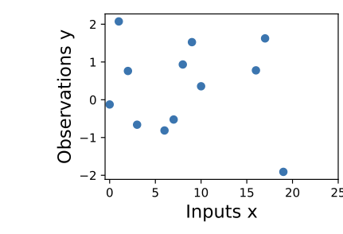
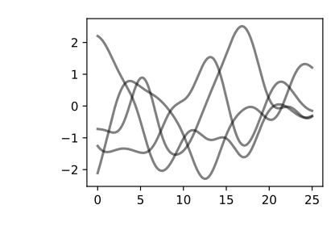
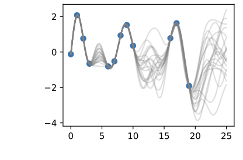
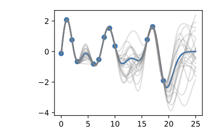
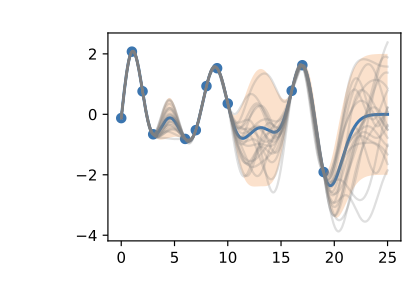
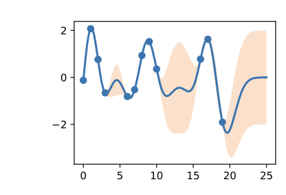

# Gaussian Processes

> **Ý chính trong một câu:** thay vì ước lượng hàng triệu tham số khó diễn giải, Gaussian process cho ta lập luận **trực tiếp về bản thân các hàm** — chúng dao động nhanh hay chậm, biên độ bao nhiêu — và trả về không chỉ một dự đoán mà cả **mức độ chắc chắn** của dự đoán đó.

*Chương này do Andrew Gordon Wilson (New York University và Amazon) viết.*

## Mục tiêu học tập

Học xong chương, bạn có thể:

- [ ] định nghĩa {{term:gaussian-process|Gaussian process}} và giải thích vì sao "mọi thứ đều là trường hợp đặc biệt của GP";
- [ ] phân biệt {{term:epistemic-uncertainty|epistemic uncertainty}} với {{term:aleatoric-uncertainty|aleatoric uncertainty}};
- [ ] đọc {{term:rbf-kernel|RBF kernel}} và nói rõ hai siêu tham số **amplitude** và **length-scale** điều khiển điều gì;
- [ ] giải thích cách chuyển từ **không gian trọng số** sang **không gian hàm**, và vì sao chuyển đổi đó có lợi;
- [ ] dẫn ra RBF kernel như giới hạn của tổng vô hạn các hàm cơ sở;
- [ ] nêu kết quả của Radford Neal về mạng nơ-ron một tầng ẩn vô hạn đơn vị;
- [ ] phân biệt kernel **dừng** (stationary) với **không dừng** (non-stationary);
- [ ] viết lại công thức dự đoán của GP regression và giải thích từng số hạng;
- [ ] giải thích {{term:marginal-likelihood|marginal likelihood}} và vì sao nó tự động cân bằng độ khớp với độ phức tạp;
- [ ] nêu nút thắt tính toán $O(n^3)$ và giải thích nó đến từ đâu.

## Bản đồ chương

```text
MACHINE LEARNING THÔNG THƯỜNG          GAUSSIAN PROCESS
ước lượng THAM SỐ (weights)     →      lập luận về HÀM trực tiếp
khó diễn giải                          vài siêu tham số DỄ diễn giải
một dự đoán điểm                       dự đoán + mức độ chắc chắn
                    │
     18.1 Trực giác: dữ liệu → prior → posterior → dự đoán
                    │
     18.2 PRIOR: kernel định nghĩa phân phối trên các hàm
          weight space  ──(lấy giới hạn)──►  function space
          ├─ RBF kernel: dừng, trơn
          └─ neural network kernel: KHÔNG dừng (Neal, 1996)
                    │
     18.3 POSTERIOR: kết hợp prior với dữ liệu
          ├─ công thức dự đoán ở DẠNG ĐÓNG (không cần train!)
          ├─ marginal likelihood học siêu tham số
          └─ nút thắt: O(n³) do phải giải hệ tuyến tính
```

## Bức tranh tổng quan

Gaussian processes (GPs) có mặt **ở khắp nơi**. Bạn đã gặp rất nhiều ví dụ về GP mà không nhận ra.

Theo lời sách: **bất kỳ model nào tuyến tính theo tham số của nó, với một phân phối Gaussian trên các tham số đó, đều là một Gaussian process.** Lớp này trải rộng từ các model rời rạc — bao gồm bước ngẫu nhiên (random walk) và quá trình tự hồi quy (autoregressive process) — cho tới các model liên tục — bao gồm Bayesian linear regression, đa thức, chuỗi Fourier, radial basis function, và thậm chí **mạng nơ-ron với số đơn vị ẩn vô hạn**.

Sách còn đùa rằng có một câu nói lưu truyền: *"mọi thứ đều là trường hợp đặc biệt của một Gaussian process."*

**Vì sao nên học GP?** Sách nêu ba lý do:

1. **Góc nhìn không gian hàm.** GP cung cấp một cách nhìn model theo **function space**, khiến việc hiểu nhiều lớp model — kể cả deep neural network — trở nên dễ tiếp cận hơn nhiều.
2. **Ứng dụng tiên tiến.** GP đang là state-of-the-art trong nhiều lĩnh vực: active learning, học siêu tham số, auto-ML, và hồi quy không–thời gian.
3. **Đã trở nên mở rộng được.** Vài năm gần đây, các tiến bộ thuật toán đã làm GP ngày càng mở rộng được và phù hợp với thực tế, hoà nhịp với deep learning qua các framework như **GPyTorch**.

Sách nhấn mạnh một điểm đáng chú ý: **GP và deep neural network không phải hai cách tiếp cận cạnh tranh nhau, mà rất bổ trợ cho nhau**, và kết hợp lại có thể cho hiệu quả rất tốt.

**Điều bạn cần mang theo:** phân phối Gaussian nhiều chiều và ma trận hiệp phương sai (chương 2), linear regression cùng nghiệm dạng đóng của nó (chương 3), và khái niệm underfitting/overfitting (mục 3.6).

**Lộ trình của chương:**

| Mục | Nội dung |
|---|---|
| 18.1 | Xây dựng trực giác: GP là gì, kernel làm gì, dự đoán trông ra sao |
| 18.2 | **Prior**: cách chỉ định một phân phối trên các hàm, và các kernel phổ biến |
| 18.3 | **Posterior**: kết hợp prior với dữ liệu để dự đoán, và học siêu tham số |

<!-- pagebreak -->

## 18.1 Introduction to Gaussian Processes

### Trực giác

Trong rất nhiều trường hợp, machine learning quy về việc **ước lượng tham số từ dữ liệu**. Những tham số này thường rất nhiều và tương đối **khó diễn giải** — chẳng hạn trọng số của một mạng nơ-ron.

Gaussian process thì ngược lại: nó cung cấp một cơ chế để lập luận **trực tiếp về các tính chất ở mức cao của những hàm có thể khớp với dữ liệu**. Ví dụ, ta có thể có cảm nhận rằng những hàm đó **biến thiên nhanh hay chậm**, có **tuần hoàn** không, có các **độc lập có điều kiện** không, hay có **bất biến tịnh tiến** không. GP cho phép ta đưa những tính chất đó vào model một cách dễ dàng, bằng cách chỉ định thẳng một phân phối Gaussian trên các **giá trị hàm** có thể khớp với dữ liệu.

### Câu chuyện bằng sáu hình

Cách nhanh nhất để cảm nhận GP là đi theo đúng trình tự hình ảnh mà sách dùng.

**Bước 1 — Dữ liệu quan sát được.**



Giả sử ta quan sát tập dữ liệu trên, gồm các mục tiêu hồi quy (đầu ra) $y$, đánh chỉ số bởi đầu vào $x$. Sách gợi ý một ví dụ cụ thể: mục tiêu có thể là **thay đổi nồng độ CO₂**, còn đầu vào là **thời điểm** ghi nhận.

Sách đặt đúng những câu hỏi mà một người làm model nên tự hỏi: dữ liệu có đặc điểm gì? Nó có vẻ biến thiên nhanh tới đâu? Ta có điểm dữ liệu thu ở khoảng cách đều không, hay có những đầu vào bị thiếu? Bạn sẽ **điền vào các vùng thiếu** thế nào, hay **dự báo** tới $x = 25$ thế nào?

**Bước 2 — Prior: những hàm ta cho là hợp lý.**



Để khớp dữ liệu bằng GP, ta bắt đầu bằng việc **chỉ định một phân phối prior** trên những **loại hàm** mà ta tin là hợp lý. Đây là vài hàm mẫu lấy từ một Gaussian process.

> **Đây là chỗ dễ hiểu nhầm nhất, nên hãy đọc kỹ lời sách:** ở đây ta **không** tìm những hàm khớp với tập dữ liệu, mà thay vào đó chỉ định những **tính chất mức cao hợp lý** của lời giải, chẳng hạn chúng biến thiên nhanh tới đâu theo đầu vào.

Nói cách khác, prior trả lời câu hỏi *"trước khi nhìn dữ liệu, tôi nghĩ hàm thật trông đại khái thế nào?"* — chứ không phải *"hàm nào khớp dữ liệu?"*.

**Bước 3 — Posterior: những hàm khớp dữ liệu.**



Một khi đã **điều kiện hoá theo dữ liệu**, ta dùng prior này để suy ra một **phân phối posterior** trên những hàm có thể khớp dữ liệu.

Ta thấy mỗi hàm này **hoàn toàn nhất quán với dữ liệu**, đi xuyên qua từng điểm quan sát một cách hoàn hảo. Hãy chú ý điều đáng ngạc nhiên ở đây: có **vô số** hàm đi qua đúng các điểm đó, và posterior giữ lại **tất cả** chúng, chứ không chọn lấy một.

**Bước 4 — Trung bình posterior làm dự đoán điểm.**



Để dùng các mẫu posterior này mà dự đoán, ta có thể **lấy trung bình** giá trị của mọi hàm mẫu có thể có từ posterior, tạo ra đường cong màu xanh đậm.

> **Lưu ý quan trọng:** ta **không thực sự phải** lấy vô hạn mẫu để tính kỳ vọng này; như sẽ thấy ở mục 18.3, kỳ vọng đó tính được ở **dạng đóng**.

**Bước 5 — Biểu diễn độ bất định.**



Ta cũng muốn có một biểu diễn của **độ bất định**, để biết nên tin dự đoán tới mức nào.

Trực giác: ta nên **bất định hơn ở nơi các hàm mẫu posterior biến động nhiều hơn**, vì điều đó cho thấy hàm thật có thể nhận nhiều giá trị khác nhau ở đó.

Loại bất định này gọi là **{{term:epistemic-uncertainty|epistemic uncertainty}}** — tức **độ bất định có thể giảm được**, gắn với việc **thiếu thông tin**. Khi ta thu thập thêm dữ liệu, loại bất định này **biến mất dần**, vì sẽ ngày càng ít lời giải nhất quán với những gì ta quan sát.

Giống như trung bình posterior, ta tính được **phương sai posterior** ở dạng đóng. Phần tô bóng cho thấy **hai lần** độ lệch chuẩn posterior về mỗi phía của trung bình, tạo thành một **{{term:credible-interval|credible interval}}** có xác suất **95%** chứa giá trị thật của hàm tại một đầu vào bất kỳ.

**Bước 6 — Hình vẽ gọn gàng cuối cùng.**



Hình trông gọn hơn khi bỏ các mẫu posterior đi, chỉ hiển thị dữ liệu, trung bình posterior, và khoảng tin cậy 95%.

**Hãy chú ý điểm quan trọng nhất của cả hình:** độ bất định **nở rộng ra khi ta đi xa dữ liệu** — đây chính là một tính chất của epistemic uncertainty. Ở vùng có nhiều điểm dữ liệu, dải màu cam hẹp lại; ở khoảng trống giữa $x \approx 10$ và $x \approx 17$, và ở vùng ngoại suy sau $x \approx 20$, dải đó **phình to**.

Đây là điều mà một mạng nơ-ron thông thường **không** cho bạn: nó sẽ đưa ra một con số ở vùng ngoại suy với vẻ tự tin y hệt như ở vùng có dữ liệu dày.

### Kernel — thứ điều khiển mọi tính chất

Các tính chất của Gaussian process mà ta dùng để khớp dữ liệu được điều khiển mạnh mẽ bởi thứ gọi là **{{term:covariance-function|covariance function}}**, còn gọi là **{{term:kernel|kernel}}**.

Kernel mà sách dùng gọi là **{{term:rbf-kernel|RBF (Radial Basis Function) kernel}}**, có dạng:

$$
k_{\text{RBF}}(x, x') = \operatorname{Cov}\big(f(x), f(x')\big)
= a^2 \exp\left( -\frac{1}{2\ell^2} \lVert x - x' \rVert^2 \right).
$$

**Siêu tham số của kernel này rất dễ diễn giải** — và đây là một ưu điểm lớn so với trọng số mạng nơ-ron:

| Siêu tham số | Điều khiển | Tăng lên thì sao |
|---|---|---|
| **amplitude** $a$ | thang đo **dọc** mà hàm biến thiên | giá trị hàm **lớn hơn** |
| **length-scale** $\ell$ | **tốc độ biến thiên** (độ "ngoằn ngoèo") | hàm biến thiên **chậm hơn** |

**Length-scale có ảnh hưởng đặc biệt rõ rệt** lên dự đoán và độ bất định của GP. Hãy đọc con số này cho kỹ:

> Tại $\lVert x - x' \rVert = \ell$, hiệp phương sai giữa một cặp giá trị hàm là $a^2 \exp(-0.5)$. Ở khoảng cách **lớn hơn $\ell$**, các giá trị hàm trở nên **gần như không tương quan**.

Điều đó có nghĩa là nếu ta muốn dự đoán tại một điểm $x_*$, thì những giá trị hàm có đầu vào $x$ sao cho $\lVert x - x_* \rVert > \ell$ **sẽ không ảnh hưởng mạnh** tới dự đoán của ta.

**Kiểm tra bằng số.** Sách dùng miền đầu vào rộng $25$ và thử $\ell = 0.1,\ 0.5,\ 2,\ 5,\ 10$:

- $\ell = 0.1$ là **rất nhỏ** so với miền đầu vào $25$. Giá trị hàm tại $x = 5$ và $x = 10$ hầu như **không tương quan** ở length-scale đó — mỗi điểm dữ liệu chỉ "nói" được về vùng lân cận rất hẹp của nó.
- $\ell = 10$ thì ngược lại: giá trị hàm tại hai điểm đó **tương quan rất mạnh**.

Khi length-scale tăng, độ "ngoằn ngoèo" của các hàm **giảm**, và độ bất định của ta cũng **giảm**. Nếu length-scale nhỏ, độ bất định sẽ **tăng rất nhanh** khi ta rời xa dữ liệu, vì các điểm dữ liệu trở nên ít thông tin hơn về giá trị hàm ở xa.

Với **amplitude**, sách giữ $\ell = 2$ cố định và thay đổi $a$: ta thấy amplitude ảnh hưởng tới **thang đo** của hàm, **nhưng không ảnh hưởng tới tốc độ biến thiên**. Hai siêu tham số này điều khiển hai thứ **độc lập** với nhau.

Đến đây ta cũng cảm nhận được rằng **khả năng tổng quát hoá của phương pháp sẽ phụ thuộc vào việc chọn được giá trị hợp lý cho những siêu tham số này**. Giá trị $\ell = 2$ và $a = 1$ có vẻ cho kết quả khớp hợp lý, trong khi vài giá trị khác thì không. May mắn là có một cách **tự động và bền vững** để chỉ định chúng, dùng thứ gọi là **marginal likelihood** — ta sẽ quay lại ở mục 18.3.

### GP thực sự là gì?

Sau tất cả những hình ảnh trên, định nghĩa hoá ra rất gọn:

> Một GP đơn giản nói rằng **bất kỳ tập hợp giá trị hàm nào** $f(x_1), \ldots, f(x_n)$, đánh chỉ số bởi **bất kỳ tập đầu vào nào** $x_1, \ldots, x_n$, đều có **phân phối Gaussian nhiều chiều đồng thời**.

Vector trung bình $\boldsymbol{\mu}$ của phân phối này được cho bởi một **mean function**, thường lấy là hằng số hoặc bằng 0. Ma trận hiệp phương sai của phân phối này được cho bởi **kernel** tính tại mọi cặp đầu vào:

$$
\begin{bmatrix} f(x) \\ f(x_1) \\ \vdots \\ f(x_n) \end{bmatrix}
\sim \mathcal{N}\left(
\boldsymbol{\mu},
\begin{bmatrix}
k(x,x) & k(x,x_1) & \cdots & k(x,x_n) \\
k(x_1,x) & k(x_1,x_1) & \cdots & k(x_1,x_n) \\
\vdots & \vdots & \ddots & \vdots \\
k(x_n,x) & k(x_n,x_1) & \cdots & k(x_n,x_n)
\end{bmatrix}
\right)
$$

Phương trình này chỉ định một **GP prior**. Ta có thể tính **phân phối có điều kiện** của $f(x)$ với bất kỳ $x$ nào, khi biết $f(x_1), \ldots, f(x_n)$ — tức các giá trị hàm ta đã quan sát. Phân phối có điều kiện đó gọi là **posterior**, và nó chính là thứ ta dùng để dự đoán.

Cụ thể:

$$
f(x) \mid f(x_1), \ldots, f(x_n) \sim \mathcal{N}(m, s^2)
$$

với

$$
m = k(x, x_{1:n})\, k(x_{1:n}, x_{1:n})^{-1} f(x_{1:n}),
$$
$$
s^2 = k(x,x) - k(x, x_{1:n})\, k(x_{1:n}, x_{1:n})^{-1} k(x_{1:n}, x).
$$

trong đó $k(x, x_{1:n})$ là vector $1 \times n$ tạo bởi $k(x, x_i)$ với $i = 1,\ldots,n$, và $k(x_{1:n}, x_{1:n})$ là ma trận $n \times n$ tạo bởi $k(x_i, x_j)$.

$m$ là thứ ta dùng làm **dự đoán điểm** cho một $x$ bất kỳ, và $s^2$ là thứ ta dùng cho **độ bất định**: muốn tạo một khoảng có xác suất 95% chứa $f(x)$, ta dùng $m \pm 2s$.

**Ví dụ một điểm dữ liệu — rất đáng làm theo.** Giả sử ta quan sát một điểm duy nhất $f(x_1)$ và muốn xác định giá trị $f(x)$ tại một $x$ nào đó. Phân phối đồng thời là:

$$
\begin{bmatrix} f(x) \\ f(x_1) \end{bmatrix}
\sim \mathcal{N}\left(0,
\begin{bmatrix} k(x,x) & k(x,x_1) \\ k(x_1,x) & k(x_1,x_1) \end{bmatrix}
\right)
$$

Phần tử ngoài đường chéo $k(x, x_1) = k(x_1, x)$ cho ta biết hai giá trị hàm **tương quan tới mức nào** — tức $f(x)$ bị $f(x_1)$ quyết định mạnh tới đâu.

Sách tính hai trường hợp cụ thể, với $k(x,x) = 1$ và quan sát $f(x_1) = 1.2$:

| $k(x, x_1)$ | Khoảng cho $f(x)$ | Trung bình dự đoán |
|---|---|---|
| $0.9$ | $[0.64,\ 1.52]$ | $1.08$ |
| $0.95$ | $[0.83,\ 1.45]$ | $1.14$ |

**Đọc bảng này bằng lời:** khi tương quan mạnh hơn ($0.9 \to 0.95$), trung bình posterior **tiến gần $1.2$ hơn** ($1.08 \to 1.14$), và khoảng bất định **hẹp lại**. Điều này khớp hoàn toàn với trực giác: càng tương quan, giá trị quan sát được càng nói nhiều về giá trị chưa biết.

> **Nhưng chú ý điều sách nhấn mạnh:** dù có tương quan mạnh giữa hai giá trị hàm này, độ bất định của ta **vẫn còn khá lớn** — vì ta mới chỉ quan sát **một** điểm dữ liệu!

### Thêm nhiễu quan sát

Cho tới đây ta mới xét quan sát **không nhiễu**. Việc đưa nhiễu quan sát vào lại **rất dễ**.

Nếu ta giả định dữ liệu được sinh từ một hàm tiềm ẩn không nhiễu $f(x)$ cộng nhiễu Gaussian i.i.d. $\epsilon(x) \sim \mathcal{N}(0, \sigma^2)$, thì covariance function chỉ đơn giản trở thành:

$$
k(x_i, x_j) \to k(x_i, x_j) + \sigma^2 \delta_{ij},
$$

trong đó $\delta_{ij} = 1$ nếu $i = j$ và $0$ nếu ngược lại.

Nói cách khác: **chỉ cần cộng $\sigma^2$ vào đường chéo** của ma trận hiệp phương sai. Loại bất định này gọi là **{{term:aleatoric-uncertainty|aleatoric uncertainty}}** — độ bất định **không giảm được**, vốn có trong quá trình đo. Khác với epistemic uncertainty, thu thập thêm dữ liệu **không** làm nó biến mất.

### 18.1.1 Summary

- Trong machine learning thông thường, ta chỉ định một hàm với vài tham số tự do (như một mạng nơ-ron và trọng số của nó) và tập trung ước lượng những tham số đó, vốn có thể **không diễn giải được**. Với Gaussian process, ta thay vào đó lập luận **trực tiếp về các phân phối trên hàm**, cho phép ta lập luận về **tính chất mức cao** của lời giải.
- Những tính chất này được điều khiển bởi một **covariance function (kernel)**, thường có vài siêu tham số **rất dễ diễn giải**: **length-scale** điều khiển hàm biến thiên nhanh (ngoằn ngoèo) tới đâu, và **amplitude** điều khiển thang đo dọc.
- Việc biểu diễn **nhiều hàm khác nhau** có thể khớp dữ liệu, rồi gộp tất cả lại thành một phân phối dự đoán, là **đặc trưng riêng của các phương pháp Bayes**. Vì có nhiều biến động hơn giữa các lời giải khả dĩ ở xa dữ liệu, độ bất định của ta **tăng lên một cách trực giác** khi ta rời xa dữ liệu.
- Một Gaussian process biểu diễn phân phối trên các hàm bằng cách chỉ định phân phối chuẩn nhiều chiều trên **mọi** giá trị hàm có thể có. Ta có thể thao tác với phân phối Gaussian một cách dễ dàng để tìm phân phối của một giá trị hàm dựa trên giá trị của bất kỳ tập giá trị nào khác.
- Cách ta mô hình hoá **tương quan** giữa các điểm này được quyết định bởi covariance function, và đó là thứ **định nghĩa tính chất tổng quát hoá** của Gaussian process.

### 18.1.2 Exercises

1. Khác biệt giữa **epistemic uncertainty** và **observation uncertainty** là gì?
2. Ngoài tốc độ biến thiên và biên độ, ta còn có thể muốn xét những tính chất nào khác của hàm, và đâu là ví dụ thực tế của những hàm có các tính chất đó?
3. RBF covariance function mà ta đã xét nói rằng hiệp phương sai (và tương quan) giữa các quan sát **giảm theo khoảng cách** của chúng trong không gian đầu vào (thời gian, vị trí không gian, v.v.). Đây có phải giả định hợp lý không? Vì sao có hoặc vì sao không?
4. Tổng của hai biến Gaussian có phải Gaussian không? Tích của hai biến Gaussian có phải Gaussian không? Nếu $(a, b)$ có phân phối Gaussian đồng thời thì $a \mid b$ ($a$ khi biết $b$) có Gaussian không? $a$ có Gaussian không?
5. Lặp lại bài tập mà ta quan sát một điểm dữ liệu tại $f(x_1) = 1.2$, nhưng giờ giả sử ta quan sát **thêm** $f(x_2) = 1.4$. Cho $k(x, x_1) = 0.9$ và $k(x, x_2) = 0.8$. Ta sẽ **chắc chắn hơn hay kém hơn** về giá trị của $f(x)$ so với khi chỉ quan sát $f(x_1)$? Trung bình và khoảng tin cậy 95% cho $f(x)$ bây giờ là bao nhiêu?
6. Bạn nghĩ việc **tăng** ước lượng nhiễu quan sát sẽ làm **tăng hay giảm** ước lượng length-scale của hàm thật?
7. Khi ta đi xa dữ liệu, giả sử độ bất định trong phân phối dự đoán **tăng tới một mức rồi ngừng tăng**. Vì sao điều đó có thể xảy ra?

<details markdown="1"><summary>Gợi ý</summary>

Câu 1: một loại giảm khi có thêm dữ liệu, loại kia thì không. Câu 3: nghĩ tới một hàm **tuần hoàn** — nhiệt độ theo mùa chẳng hạn; tháng 1 năm nay và tháng 1 năm sau cách nhau rất xa trong thời gian. Câu 6: nếu bạn cho rằng phần lớn biến động là nhiễu, thì hàm "thật" bên dưới phải trơn tới mức nào? Câu 7: nhìn lại RBF kernel — khi $\lVert x-x'\rVert \to \infty$ thì $k \to$ bao nhiêu, và khi đó công thức phương sai $s^2$ rút về cái gì?
</details>

<details markdown="1"><summary>Lời giải</summary>

**Câu 1.** Khác biệt cốt lõi là **có giảm được hay không**:

| | Epistemic uncertainty | Observation (aleatoric) uncertainty |
|---|---|---|
| Nguồn gốc | **thiếu thông tin** về hàm thật | **nhiễu** vốn có trong phép đo |
| Giảm khi thêm dữ liệu? | **có**, tiến về 0 | **không**, giữ nguyên $\sigma^2$ |
| Trong công thức GP | qua ma trận kernel $k$ | cộng $\sigma^2$ vào đường chéo |
| Hành vi khi xa dữ liệu | **nở rộng** | **hằng số** |

Cách phân biệt trực quan: nếu bạn cân cùng một vật 1000 lần bằng một cái cân kém chính xác, bạn sẽ rất chắc chắn về **khối lượng trung bình** (epistemic giảm về 0) nhưng vẫn không thể dự đoán **một lần cân cụ thể** chính xác hơn độ nhiễu của cân (aleatoric không đổi).

Điều này giải thích luôn hình 18.1.6: dải bất định hẹp gần dữ liệu và phình ra ở xa — đó là phần **epistemic**. Nếu ta vẽ thêm nhiễu quan sát, cả dải sẽ dày lên một lượng **đều nhau** ở mọi nơi.

**Câu 2.** Vài tính chất khác đáng đưa vào kernel:

| Tính chất | Ví dụ thực tế |
|---|---|
| **Tuần hoàn** | nhiệt độ theo mùa, lưu lượng truy cập web theo ngày trong tuần |
| **Xu hướng (trend)** | nồng độ CO₂ tăng dần qua nhiều thập kỷ |
| **Độ trơn** khác nhau | giá cổ phiếu (gồ ghề) so với quỹ đạo hành tinh (rất trơn) |
| **Không dừng** | biến động thị trường tăng vọt trong khủng hoảng rồi lắng lại |
| **Bất biến tịnh tiến/xoay** | ảnh — một con mèo vẫn là mèo dù ở góc nào |
| **Độc lập có điều kiện** | cấu trúc đồ thị, quan hệ không gian giữa các vùng lân cận |

Điểm đáng nói: các tính chất này **cộng và nhân được**. Tổng hai kernel hợp lệ là kernel hợp lệ; tích cũng vậy. Nên để mô hình hoá CO₂ — vừa có xu hướng tăng vừa có chu kỳ mùa vừa có nhiễu ngắn hạn — ta có thể **cộng** một kernel tuyến tính, một kernel tuần hoàn và một RBF. Đây là cách xây kernel trong thực tế.

**Câu 3.** **Hợp lý trong nhiều trường hợp, nhưng không phải luôn luôn** — và trường hợp phản ví dụ rất quan trọng.

**Khi nào hợp lý:** với phần lớn hiện tượng vật lý, những thứ ở gần nhau **thực sự** giống nhau hơn. Nhiệt độ lúc 9h sáng gần với nhiệt độ lúc 10h sáng hơn là với nhiệt độ lúc 3h chiều. Hai điểm cách nhau 1 km trên bản đồ độ cao gần giống nhau hơn hai điểm cách 100 km. Đây gọi là **liên tục theo nghĩa thống kê**, và nó đúng rất rộng rãi.

**Khi nào không hợp lý — dữ liệu tuần hoàn.** Đây là phản ví dụ rõ nhất. Với nhiệt độ theo mùa, tháng 1 năm nay và tháng 1 **năm sau** cách nhau 12 tháng — rất xa theo RBF kernel, nên kernel này cho rằng chúng gần như không tương quan. Nhưng thực tế chúng **tương quan rất mạnh**! RBF kernel sẽ mô hình hoá sai hoàn toàn dữ liệu này.

Cách khắc phục là dùng **periodic kernel**, trong đó tương quan phụ thuộc $\sin^2(\pi\lVert x-x'\rVert/p)$ thay vì $\lVert x-x'\rVert^2$ — nó biến khoảng cách thành khoảng cách **trong một chu kỳ**.

Một trường hợp khác không hợp lý: dữ liệu có **điểm gãy** (change point), ví dụ giá cổ phiếu trước và sau một sự kiện. RBF kernel giả định độ trơn ở mọi nơi nên sẽ "làm mượt" mất chính điểm gãy mà ta quan tâm.

**Câu 4.** Bốn câu hỏi với bốn câu trả lời khác nhau, và chính sự khác nhau đó mới đáng học:

| Phép toán | Có Gaussian không? |
|---|---|
| **Tổng** hai biến Gaussian | **Có**. Nếu $a \sim \mathcal{N}(\mu_1,\sigma_1^2)$ và $b \sim \mathcal{N}(\mu_2,\sigma_2^2)$ độc lập thì $a+b \sim \mathcal{N}(\mu_1+\mu_2,\ \sigma_1^2+\sigma_2^2)$ |
| **Tích** hai biến Gaussian | **Không**. Tích của hai biến chuẩn tắc độc lập có phân phối liên quan tới hàm Bessel, hoàn toàn không phải Gaussian |
| **Có điều kiện** $a \mid b$ | **Có** — và đây chính là tính chất làm GP hoạt động được |
| **Biên duyên** $a$ | **Có**. Lấy biên duyên của một Gaussian đồng thời vẫn cho Gaussian |

Hai dòng cuối đáng nhấn mạnh, vì chúng là **toàn bộ nền tảng toán học của chương này**:

- Tính chất **biên duyên** cho phép ta chỉ định phân phối trên vô hạn giá trị hàm nhưng chỉ cần làm việc với $n$ điểm ta quan tâm.
- Tính chất **có điều kiện** cho phép ta đi từ prior sang posterior bằng công thức dạng đóng.

Không có hai tính chất này, GP sẽ không tính được. (Chú ý dòng thứ hai: đó là lý do ta luôn **cộng** nhiễu vào chứ không nhân.)

**Câu 5.** Ta sẽ **chắc chắn hơn** — thêm dữ liệu luôn làm epistemic uncertainty giảm.

Để tính cụ thể, ta cần giả định thêm (sách không nêu): lấy $k(x,x) = k(x_1,x_1) = k(x_2,x_2) = 1$ và giả sử $k(x_1, x_2) = 0.9$ (hai điểm quan sát cũng tương quan với nhau).

Áp công thức với $\mathbf{k}_* = [0.9,\ 0.8]$, $K = \begin{bmatrix} 1 & 0.9 \\ 0.9 & 1\end{bmatrix}$, $\mathbf{y} = [1.2,\ 1.4]^\top$:

$$
K^{-1} = \frac{1}{1 - 0.81}\begin{bmatrix} 1 & -0.9 \\ -0.9 & 1\end{bmatrix}
= \begin{bmatrix} 5.263 & -4.737 \\ -4.737 & 5.263 \end{bmatrix}
$$

$$
\mathbf{k}_* K^{-1} = [0.9,\ 0.8] K^{-1} = [0.947,\ -0.053]
$$

**Trung bình:**
$$
m = [0.947,\ -0.053] \cdot [1.2,\ 1.4]^\top = 1.136 - 0.074 = \mathbf{1.06}
$$

**Phương sai:**
$$
s^2 = 1 - [0.947,\ -0.053]\cdot[0.9,\ 0.8]^\top = 1 - (0.852 - 0.042) = 1 - 0.810 = 0.190
$$
$$
s = \sqrt{0.190} = 0.436
$$

**Khoảng tin cậy 95%:** $1.06 \pm 2(0.436) = \mathbf{[0.19,\ 1.93]}$.

So với trường hợp một điểm ($s^2 = 1 - 0.9^2 = 0.19$, cùng giá trị): ở ví dụ cụ thể này phương sai **gần như không đổi**, vì điểm thứ hai tương quan rất mạnh với điểm thứ nhất ($k(x_1,x_2) = 0.9$) nên nó mang **rất ít thông tin mới**.

Đây là một bài học quan trọng: **thêm dữ liệu chỉ giúp nếu dữ liệu đó bổ sung thông tin mới**. Nếu $x_2$ nằm rất gần $x_1$, quan sát nó gần như vô ích. Chính nguyên tắc này là nền của **active learning** — chọn điểm tiếp theo để đo sao cho giảm bất định nhiều nhất, mà GP là công cụ tự nhiên cho việc đó.

**Câu 6.** **Tăng** ước lượng nhiễu quan sát sẽ làm **tăng** ước lượng length-scale.

Lý do là một **sự đánh đổi trong cách giải thích dữ liệu**: dữ liệu biến động lên xuống, và model phải quy biến động đó cho một trong hai nguồn.

- Nếu ta nói nhiễu **lớn**, thì phần lớn biến động là nhiễu, nên hàm thật bên dưới phải **trơn và biến thiên chậm** — tức **length-scale lớn**.
- Nếu ta nói nhiễu **nhỏ**, thì biến động phải là thật, nên hàm thật phải **ngoằn ngoèo** để đi theo từng điểm — tức **length-scale nhỏ**.

Đây chính xác là nội dung mà bài tập 18.3.7 câu 2 sẽ khai thác: hai cách giải thích đều "hợp lý", và đó là lý do marginal likelihood có **cực trị địa phương**.

**Câu 7.** Điều này xảy ra vì **RBF kernel dừng và tiến về 0 ở khoảng cách lớn**.

Nhìn công thức phương sai posterior:
$$
s^2 = k(x_*,x_*) - \mathbf{k}_*^\top K^{-1} \mathbf{k}_*
$$

Khi $x_*$ đi rất xa mọi điểm dữ liệu, mọi phần tử của $\mathbf{k}_*$ tiến về **0** (vì $\exp(-d^2/2\ell^2) \to 0$). Số hạng thứ hai biến mất, và:

$$
s^2 \to k(x_*, x_*) = a^2
$$

Tức phương sai **bão hoà đúng ở giá trị prior** $a^2$. Điều này hoàn toàn hợp lý: khi đã ở quá xa dữ liệu, ta không biết gì hơn ngoài những gì prior nói — và prior nói phương sai là $a^2$.

**Đây là một tính chất rất đáng quý**, không phải khiếm khuyết. Nó có nghĩa là GP **thừa nhận giới hạn hiểu biết của mình** một cách có kiểm soát, thay vì đưa ra dự đoán tự tin ở vùng nó không có thông tin — điều mà mạng nơ-ron thường mắc phải.

Chú ý điều này đúng với kernel **dừng**. Kernel **không dừng** (như neural network kernel ở mục 18.2.5) có thể hành xử khác.

**Bẫy thường gặp:** nhầm "phương sai bão hoà" với "model đã hội tụ". Bão hoà ở $a^2$ nghĩa là model đang nói *"tôi hoàn toàn không biết"*, chứ không phải *"tôi đã chắc chắn"*.
</details>

<!-- pagebreak -->

## 18.2 Gaussian Process Priors

Trong mục này ta giới thiệu **prior** của Gaussian process trên các hàm. Mục kế tiếp sẽ cho thấy cách dùng những prior này để làm **posterior inference** và dự đoán. Sách gọi mục này là "GP trong một trang", cho bạn nhanh chóng đủ thứ cần để dùng GP trong thực tế.

### 18.2.1 Definition

Một Gaussian process được định nghĩa là **một tập hợp các biến ngẫu nhiên, mà bất kỳ số hữu hạn nào trong chúng cũng có phân phối Gaussian đồng thời**.

Nếu một hàm $f(x)$ là Gaussian process, với mean function $m(x)$ và **covariance function** hay **kernel** $k(x, x')$ — viết là $f(x) \sim \mathcal{GP}(m, k)$ — thì bất kỳ tập giá trị hàm nào truy vấn tại bất kỳ tập điểm đầu vào nào (thời gian, vị trí không gian, pixel ảnh, v.v.) đều có phân phối Gaussian nhiều chiều đồng thời với vector trung bình và ma trận hiệp phương sai:

$$
(f(x_1), \ldots, f(x_n)) \sim \mathcal{N}(\boldsymbol{\mu}, K),
$$

trong đó

$$
\mu_i = \mathbb{E}[f(x_i)] = m(x_i)
\qquad\text{và}\qquad
K_{ij} = \operatorname{Cov}\big(f(x_i), f(x_j)\big) = k(x_i, x_j).
$$

Định nghĩa này **có vẻ trừu tượng và khó tiếp cận**, nhưng sách khẳng định ngay: Gaussian process thực ra là những đối tượng **rất đơn giản**.

**Đây là phát biểu làm mọi thứ sáng tỏ.** Bất kỳ hàm nào có dạng

$$
f(x) = \mathbf{w}^\top \boldsymbol{\phi}(x) = \langle \mathbf{w}, \boldsymbol{\phi}(x) \rangle,
$$

với $\mathbf{w}$ rút từ một phân phối Gaussian (chuẩn) và $\boldsymbol{\phi}$ là **bất kỳ vector hàm cơ sở nào** — ví dụ $\boldsymbol{\phi}(x) = (1, x, x^2, \ldots, x^d)^\top$ — đều là một Gaussian process.

Hơn nữa — và đây là chiều ngược lại quan trọng không kém — **bất kỳ Gaussian process $f(x)$ nào cũng biểu diễn được dưới dạng trên**.

Vậy là hai thế giới **trùng khớp hoàn toàn**: "model tuyến tính theo tham số với prior Gaussian trên tham số" và "Gaussian process" là **hai cách nói về cùng một thứ**. Đây chính là lý do của câu đùa "mọi thứ đều là trường hợp đặc biệt của GP" ở đầu chương.

### 18.2.2 A Simple Gaussian Process

Hãy làm một ví dụ cụ thể nhất có thể.

Giả sử $f(x) = w_0 + w_1 x$, với $w_0, w_1 \sim \mathcal{N}(0, 1)$ độc lập, và $x$ một chiều.

Ta viết lại hàm này thành tích vô hướng $f(x) = (w_0, w_1)^\top (1, x)$. Trong ký hiệu của mục 18.2.1: $\mathbf{w} = (w_0, w_1)^\top$ và $\boldsymbol{\phi}(x) = (1, x)^\top$.

**Vì sao đây là GP?** Với mọi $x$, $f(x)$ là **tổng của hai biến ngẫu nhiên Gaussian**. Vì Gaussian **đóng dưới phép cộng** (xem bài tập 18.1.2 câu 4), $f(x)$ cũng là biến Gaussian với mọi $x$. Thực ra ta tính được với một $x$ cụ thể rằng $f(x) \sim \mathcal{N}(0,\ 1 + x^2)$.

Tương tự, phân phối đồng thời của bất kỳ tập giá trị hàm nào $(f(x_1), \ldots, f(x_n))$, với bất kỳ tập đầu vào nào, cũng là phân phối Gaussian nhiều chiều. Vậy **$f(x)$ là một Gaussian process**.

Nói gọn: $f(x)$ là một **hàm ngẫu nhiên**, hay một **phân phối trên các hàm**.

```python
def lin_func(x, n_sample):
    preds = np.zeros((n_sample, x.shape[0]))
    for ii in range(n_sample):
        w = np.random.normal(0, 1, 2)      # (w_0, w_1) ~ N(0, I)
        y = w[0] + w[1] * x                # một đường thẳng ngẫu nhiên
        preds[ii, :] = y
    return preds


x_points = np.linspace(-5, 5, 50)
outs = lin_func(x_points, 10)
# Độ lệch chuẩn tại x là sqrt(1 + x^2) — hẹp ở giữa, loe ra hai bên.
lw_bd = -2 * np.sqrt((1 + x_points ** 2))
up_bd =  2 * np.sqrt((1 + x_points ** 2))
```

Lấy mẫu lặp lại $w_0, w_1$ cho ta một họ **đường thẳng** với độ dốc và giao điểm khác nhau. Chú ý dải bất định $\pm 2\sqrt{1+x^2}$ có hình **nút thắt cổ chai**: hẹp nhất tại $x = 0$ và loe ra hai phía — đúng như trực giác, vì mọi đường thẳng đều phải đi qua vùng gần gốc toạ độ nhưng có thể phân kỳ rất xa ở hai đầu.

> **Câu hỏi sách để lại cho bạn:** nếu $w_0$ và $w_1$ được rút từ $\mathcal{N}(0, \alpha^2)$ thay vì $\mathcal{N}(0,1)$, bạn hình dung việc thay đổi $\alpha$ ảnh hưởng thế nào tới phân phối trên các hàm?

### 18.2.3 From Weight Space to Function Space

Ở ví dụ trên, ta thấy một **phân phối trên tham số** cảm sinh ra một **phân phối trên hàm**.

Và đây là vấn đề: dù ta thường có ý tưởng về **hàm** mình muốn mô hình hoá — trơn hay không, tuần hoàn hay không, biến thiên nhanh hay chậm — thì việc lập luận về **tham số** lại khá nhọc nhằn, vì chúng phần lớn **không diễn giải được**.

May mắn thay, Gaussian process cho ta một cơ chế dễ dàng để lập luận **trực tiếp về hàm**. Vì một phân phối Gaussian được xác định **hoàn toàn** bởi hai mô-men đầu — trung bình và ma trận hiệp phương sai — nên một Gaussian process, theo cách mở rộng, được xác định bởi **mean function** và **covariance function** của nó.

**Tính cụ thể cho ví dụ đường thẳng.** Mean function:

$$
m(x) = \mathbb{E}[f(x)] = \mathbb{E}[w_0 + w_1 x] = \mathbb{E}[w_0] + \mathbb{E}[w_1] x = 0 + 0 = 0.
$$

Covariance function:

$$
k(x, x') = \operatorname{Cov}(f(x), f(x')) = \mathbb{E}[f(x)f(x')] - \mathbb{E}[f(x)]\mathbb{E}[f(x')]
= \mathbb{E}[w_0^2 + w_0 w_1 x' + w_1 w_0 x + w_1^2 x x'] = 1 + x x'.
$$

**Đây là bước ngoặt của cả mục.** Phân phối trên hàm giờ có thể được **chỉ định và lấy mẫu trực tiếp**, mà **không cần** phải lấy mẫu từ phân phối trên tham số. Muốn rút một mẫu từ $f(x)$, ta chỉ cần lập phân phối Gaussian nhiều chiều ứng với tập $x$ ta quan tâm, rồi lấy mẫu **thẳng** từ nó.

Hơn nữa, cùng một cách dẫn dắt đó áp dụng được cho **bất kỳ** model dạng $f(x) = \mathbf{w}^\top \boldsymbol{\phi}(x)$ với $\mathbf{w} \sim \mathcal{N}(\mathbf{u}, S)$. Khi đó:

$$
m(x) = \mathbf{u}^\top \boldsymbol{\phi}(x),
\qquad
k(x, x') = \boldsymbol{\phi}(x)^\top S\, \boldsymbol{\phi}(x').
$$

Vì $\boldsymbol{\phi}(x)$ có thể là vector của **bất kỳ hàm cơ sở phi tuyến nào**, ta đang xét một lớp model **rất tổng quát**, kể cả những model có **vô hạn tham số**.

| | Weight space | Function space |
|---|---|---|
| Đối tượng ta chỉ định | phân phối trên $\mathbf{w}$ | mean function và kernel |
| Số chiều | bằng số tham số | **không phụ thuộc** số tham số |
| Dễ diễn giải? | thường **không** | **có** — length-scale, amplitude |
| Xử lý vô hạn tham số? | không | **có** |

### 18.2.4 The Radial Basis Function (RBF) Kernel

RBF kernel là **covariance function phổ biến nhất** cho Gaussian process, và cho kernel machine nói chung. Nó có dạng:

$$
k_{\text{RBF}}(x, x') = a^2 \exp\left(-\frac{1}{2\ell^2}\lVert x - x'\rVert^2\right),
$$

với $a$ là tham số **amplitude** và $\ell$ là siêu tham số **lengthscale**.

**Giờ hãy dẫn ra kernel này từ weight space** — đây là phần hay nhất của mục.

Xét hàm

$$
f(x) = \sum_{i=1}^{J} w_i \phi_i(x),
\qquad
w_i \sim \mathcal{N}\!\left(0, \frac{\sigma^2}{J}\right),
\qquad
\phi_i(x) = \exp\left(-\frac{(x - c_i)^2}{2\ell^2}\right).
$$

$f(x)$ là **tổng của các hàm cơ sở hình chuông**, mỗi cái rộng $\ell$, đặt tại các điểm $c_i$.

Ta nhận ra $f(x)$ có dạng $\mathbf{w}^\top \boldsymbol{\phi}(x)$, nên theo mục 18.2.3, covariance function của Gaussian process này là:

$$
k(x, x') = \frac{\sigma^2}{J} \sum_{i=1}^{J} \phi_i(x)\, \phi_i(x').
$$

**Và đây là phép màu.** Giờ xét điều gì xảy ra khi ta cho số tham số (và số hàm cơ sở) **tiến ra vô hạn**. Đặt $c_J = \log J$, $c_1 = -\log J$, và $c_{i+1} - c_i = \Delta c = \dfrac{2\log J}{J}$, rồi cho $J \to \infty$. Tổng trên trở thành một **tích phân**, và tích phân đó tính được ở dạng đóng, cho ra đúng:

$$
k(x, x') = a^2 \exp\left(-\frac{1}{2\ell^2}\lVert x - x'\rVert^2\right).
$$

Hãy dừng lại để thấy điều vừa xảy ra: ta có một model với **vô hạn tham số**, nhưng nó được mô tả **hoàn toàn** bởi một công thức có **hai** siêu tham số. Và để dùng nó, ta chỉ cần tính ma trận kernel $n \times n$ — **một lượng tính toán hữu hạn**.

> **Đây là lời đáp cho câu hỏi "vì sao phải học GP".** Không gian hàm cho phép ta làm việc với những model mà không gian trọng số **không thể** biểu diễn nổi.

### 18.2.5 The Neural Network Kernel

Nghiên cứu về Gaussian process trong machine learning được **châm ngòi bởi nghiên cứu về mạng nơ-ron**.

Radford Neal theo đuổi những Bayesian neural network ngày càng lớn, và cuối cùng đã chỉ ra vào năm 1994 (công bố năm 1996, vì đó là một trong những lần từ chối nổi tiếng nhất lịch sử NeurIPS) rằng **những mạng như vậy với số đơn vị ẩn vô hạn sẽ trở thành Gaussian process** với những kernel function cụ thể (Neal, 1996).

Sự quan tâm tới kết quả này đã **trỗi dậy trở lại** gần đây, với những ý tưởng như **neural tangent kernel** được dùng để nghiên cứu tính chất tổng quát hoá của mạng nơ-ron.

**Cách dẫn ra.** Xét một hàm mạng nơ-ron $f(x)$ với **một tầng ẩn**:

$$
f(x) = b + \sum_{i=1}^{J} v_i\, h(x; \mathbf{u}_i).
$$

Ở đây $b$ là bias, $v_i$ là trọng số từ tầng ẩn tới output, $h$ là **bất kỳ hàm truyền bị chặn nào** của đơn vị ẩn, $\mathbf{u}_i$ là trọng số từ input tới tầng ẩn, và $J$ là số đơn vị ẩn.

Cho $b$ và $v_i$ độc lập với trung bình 0 và phương sai $\sigma_b^2$, $\sigma_v^2/J$, và cho các $\mathbf{u}_i$ có phân phối độc lập cùng dạng. Khi đó ta có thể dùng **định lý giới hạn trung tâm** để chỉ ra rằng bất kỳ tập giá trị hàm nào $f(x_1), \ldots, f(x_n)$ đều có phân phối Gaussian nhiều chiều đồng thời.

Hãy chú ý cơ chế: $f(x)$ là **tổng của $J$ số hạng độc lập cùng phân phối**. Định lý giới hạn trung tâm nói rằng tổng như vậy tiến về Gaussian khi $J \to \infty$ — **bất kể** từng số hạng có phân phối gì. Đây là lý do kết quả này đúng với **mọi** hàm kích hoạt bị chặn.

Mean function và covariance function của Gaussian process tương ứng:

$$
m(x) = \mathbb{E}[f(x)] = 0,
$$
$$
k(x, x') = \operatorname{Cov}[f(x), f(x')] = \sigma_b^2 + \frac{\sigma_v^2}{J}\sum_{i=1}^{J} \mathbb{E}\big[h(x;\mathbf{u}_i) h(x';\mathbf{u}_i)\big].
$$

Trong một số trường hợp ta tính được covariance function này ở **dạng đóng**. Lấy $h(x; \mathbf{u}) = \operatorname{erf}(u_0 + \sum_{j=1}^{P} u_j x_j)$, với $\operatorname{erf}(z) = \frac{2}{\sqrt{\pi}}\int_0^z e^{-t^2}dt$, và $\mathbf{u} \sim \mathcal{N}(0, \Sigma)$. Khi đó:

$$
k(x, x') = \frac{2}{\pi}\sin\left(\frac{2\tilde{x}^\top \Sigma \tilde{x}'}{\sqrt{(1 + 2\tilde{x}^\top\Sigma\tilde{x})(1 + 2\tilde{x}'^\top\Sigma\tilde{x}')}}\right).
$$

**Dừng và không dừng — một khác biệt quan trọng.**

RBF kernel là **{{term:stationary-kernel|stationary}}**, nghĩa là nó **bất biến tịnh tiến**, và do đó viết được như một hàm của $\tau = x - x'$.

Trực giác của tính dừng: **các tính chất mức cao của hàm, chẳng hạn tốc độ biến thiên, không thay đổi khi ta di chuyển trong không gian đầu vào**. Hàm ngoằn ngoèo ở vùng $x$ nhỏ thì cũng ngoằn ngoèo y như vậy ở vùng $x$ lớn.

Neural network kernel thì **không dừng**. Sách cho thấy các hàm mẫu từ GP với kernel này **trông khác hẳn về chất ở gần gốc toạ độ** so với ở xa.

| | RBF kernel | Neural network kernel |
|---|---|---|
| Dừng? | **có** | **không** |
| Viết được theo $x - x'$? | có | không |
| Tính chất hàm khi di chuyển | **không đổi** | **thay đổi** theo vị trí |
| Khi nào nên dùng | hiện tượng có tính chất đồng nhất | khi có một "gốc" đặc biệt trong bài toán |

### 18.2.6 Summary

- Bước đầu tiên khi làm suy diễn Bayes là **chỉ định prior**. Gaussian process có thể dùng để chỉ định **cả một prior trên các hàm**.
- Xuất phát từ góc nhìn "**weight space**" truyền thống, ta có thể **cảm sinh** một prior trên hàm bằng cách bắt đầu từ dạng hàm của model rồi đưa vào một phân phối trên tham số của nó.
- Cách khác là chỉ định phân phối prior **thẳng trong function space**, với các tính chất được điều khiển bởi một kernel.
- Cách tiếp cận function-space có nhiều ưu điểm. Ta có thể xây những model **thực sự tương ứng với vô hạn tham số**, nhưng chỉ dùng một lượng tính toán **hữu hạn**! Hơn nữa, dù những model này rất linh hoạt, chúng cũng đưa ra **giả định mạnh** về loại hàm nào là hợp lý tiên nghiệm, dẫn tới khả năng tổng quát hoá tương đối tốt **trên tập dữ liệu nhỏ**.
- Giả định của model trong function space được điều khiển một cách trực giác bởi **kernel**, vốn thường mã hoá các tính chất mức cao của hàm như độ trơn và tính tuần hoàn. Nhiều kernel là **dừng**, tức bất biến tịnh tiến.
- Gaussian process là một lớp model **tương đối tổng quát**, chứa nhiều ví dụ về model ta đã quen thuộc — bao gồm đa thức, chuỗi Fourier, v.v. — miễn là ta có prior Gaussian trên tham số. Chúng còn bao gồm **mạng nơ-ron với vô hạn tham số**, thậm chí không cần phân phối Gaussian trên tham số.
- Chính mối liên hệ này, do Radford Neal phát hiện, đã **khiến các nhà nghiên cứu machine learning rời xa mạng nơ-ron và chuyển sang Gaussian process**.

### 18.2.7 Exercises

1. Hãy rút các hàm mẫu từ prior của một GP với **Ornstein-Uhlenbeck (OU) kernel**, $k_{\text{OU}}(x, x') = \exp\left(-\frac{1}{2\ell}\lVert x - x'\rVert\right)$. Nếu ta cố định lengthscale $\ell$ như nhau, các hàm này trông **khác gì** so với hàm mẫu từ GP dùng RBF kernel?
2. Việc thay đổi **amplitude** $a^2$ của RBF kernel ảnh hưởng thế nào tới phân phối trên các hàm?
3. Giả sử ta lập $g(x) = f(x) + 2f_2(x)$, với $f(x) \sim \mathcal{GP}(m_1, k_1)$ và $f_2(x) \sim \mathcal{GP}(m_2, k_2)$. $g(x)$ có phải Gaussian process không, và nếu có thì mean function và covariance function của nó là gì?
4. Giả sử ta lập $g(x) = a(x) f(x)$, với $f(x) \sim \mathcal{GP}(0, k)$ và $a(x) = x^2$. $g(x)$ có phải Gaussian process không, và nếu có thì mean function và covariance function của nó là gì? Ảnh hưởng của $a(x)$ là gì? Các hàm mẫu rút từ $g(x)$ trông thế nào?
5. Giả sử ta lập $g(x) = f_1(x) f_2(x)$, với $f_1(x) \sim \mathcal{GP}(m_1, k_1)$ và $f_2(x) \sim \mathcal{GP}(m_2, k_2)$. $g(x)$ có phải Gaussian process không, và nếu có thì mean function và covariance function của nó là gì?

<details markdown="1"><summary>Gợi ý</summary>

Câu 1: chú ý OU kernel dùng $\lVert x - x'\rVert$ (mũ 1) còn RBF dùng $\lVert x - x'\rVert^2$ (mũ 2). Điều đó đổi hành vi của kernel **tại $x = x'$** thế nào? Câu 3 và 5: xem lại bài tập 18.1.2 câu 4 — Gaussian đóng dưới phép nào? Câu 4: $a(x)$ là một hàm **tất định**, không ngẫu nhiên.
</details>

<details markdown="1"><summary>Lời giải</summary>

**Câu 1.** Hàm mẫu từ OU kernel trông **gồ ghề hơn hẳn** — không trơn, giống như chuyển động Brown.

Nguyên nhân nằm ở **số mũ** và cách kernel hành xử tại gốc. RBF dùng $\lVert x-x'\rVert^2$ nên nó **trơn vô hạn lần** tại $x = x'$ (mọi đạo hàm đều tồn tại). OU dùng $\lVert x-x'\rVert$ nên nó có một **điểm gãy** tại $x = x'$ — hàm giá trị tuyệt đối không khả vi tại 0.

Có một định lý tổng quát: **độ trơn của hàm mẫu tương ứng với độ trơn của kernel tại gốc**. Kernel gãy tại gốc $\Rightarrow$ hàm mẫu không khả vi ở đâu cả.

Thực tế, GP với OU kernel chính là **quá trình Ornstein-Uhlenbeck**, và các hàm mẫu của nó liên tục nhưng **không khả vi ở mọi nơi** — hệt như đường đi của chuyển động Brown.

Điều này rất đáng nhớ khi chọn kernel: nếu bạn tin hiện tượng của mình trơn (quỹ đạo vật lý), dùng RBF; nếu bạn tin nó gồ ghề (giá tài sản, tín hiệu nhiễu), OU hoặc Matérn phù hợp hơn. Chọn sai độ trơn là một dạng sai lệch model mà dữ liệu khó sửa được.

**Câu 2.** Amplitude $a^2$ **chỉ thay đổi thang đo dọc**, không đổi hình dạng.

Cụ thể: nếu $f(x) \sim \mathcal{GP}(0, k)$ thì $a \cdot f(x) \sim \mathcal{GP}(0, a^2 k)$. Nhân kernel với $a^2$ tương đương nhân **chính hàm** với $a$. Các hàm mẫu có **hình dạng y hệt**, chỉ bị kéo giãn hoặc nén theo trục dọc.

Điều này khớp đúng với quan sát ở mục 18.1: amplitude ảnh hưởng tới thang đo của hàm, **nhưng không tới tốc độ biến thiên**. Hai siêu tham số điều khiển hai trục độc lập — $\ell$ điều khiển trục ngang (nhanh chậm), $a$ điều khiển trục dọc (cao thấp).

**Câu 3.** **Có**, $g(x)$ là Gaussian process.

Lý do: tổng của các biến Gaussian **độc lập** là Gaussian (bài tập 18.1.2 câu 4), và nhân với hằng số cũng giữ tính Gaussian. Vậy mọi tập hữu hạn giá trị $g(x_i)$ vẫn có phân phối Gaussian đồng thời — đúng định nghĩa GP.

**Mean function** (dùng tính tuyến tính của kỳ vọng):
$$
m_g(x) = \mathbb{E}[f(x) + 2f_2(x)] = m_1(x) + 2 m_2(x).
$$

**Covariance function** (giả định $f$ và $f_2$ độc lập, nên hiệp phương sai chéo bằng 0):
$$
k_g(x,x') = \operatorname{Cov}(g(x), g(x')) = k_1(x,x') + 4\,k_2(x,x').
$$

Chú ý hệ số **4** chứ không phải 2 — vì hiệp phương sai là bậc hai, hằng số $c$ trở thành $c^2$.

**Đây là lý do kernel cộng được**, một sự kiện rất hữu ích trong thực tế: muốn mô hình hoá dữ liệu CO₂ có cả xu hướng dài hạn lẫn chu kỳ mùa, ta cộng một kernel dài hạn với một kernel tuần hoàn.

**Câu 4.** **Có**, $g(x)$ vẫn là Gaussian process — và mấu chốt là $a(x) = x^2$ **tất định**, không ngẫu nhiên.

Nhân một biến Gaussian với một **hằng số đã biết** vẫn cho Gaussian. Tại mỗi $x$, $a(x)$ chỉ là một con số, nên $g(x) = a(x)f(x)$ là Gaussian.

**Mean function:**
$$
m_g(x) = a(x)\,\mathbb{E}[f(x)] = x^2 \cdot 0 = 0.
$$

**Covariance function:**
$$
k_g(x,x') = \operatorname{Cov}(a(x)f(x),\ a(x')f(x')) = a(x)a(x')\,k(x,x') = x^2 x'^2\, k(x,x').
$$

**Ảnh hưởng của $a(x)$ và hình dáng hàm mẫu.** Đây là phần đáng suy nghĩ. Phương sai tại $x$ là $k_g(x,x) = x^4 k(x,x)$, nên:

- Tại $x = 0$: phương sai bằng **0**. **Mọi** hàm mẫu đều bị **ghim chặt qua gốc toạ độ**.
- Khi $\lvert x \rvert$ tăng: biên độ tăng nhanh theo $x^2$.

Vậy các hàm mẫu trông giống hàm RBF thông thường nhưng bị **"thắt nút" tại gốc và loe rộng dần ra hai phía** như một cái loa.

Đáng chú ý nhất: $k_g$ **không còn dừng** nữa, dù $k$ dừng. Nhân với một hàm tất định là một cách đơn giản để **tạo ra kernel không dừng** — kỹ thuật này gọi là *input-dependent scaling* và rất hữu ích khi biên độ hiện tượng thay đổi theo vùng.

**Câu 5.** **Không**, $g(x) = f_1(x) f_2(x)$ nói chung **không** phải Gaussian process.

Lý do đã có ở bài tập 18.1.2 câu 4: **tích** của hai biến Gaussian **không** Gaussian. Khác biệt với câu 4 rất quan trọng — ở đó ta nhân với một hàm **tất định**, ở đây ta nhân hai đại lượng **ngẫu nhiên**.

Ta vẫn tính được hai mô-men đầu (giả sử độc lập):

$$
m_g(x) = \mathbb{E}[f_1(x)]\,\mathbb{E}[f_2(x)] = m_1(x)\,m_2(x),
$$

và với hiệp phương sai, dùng $\mathbb{E}[f_1(x)f_1(x')] = k_1(x,x') + m_1(x)m_1(x')$:

$$
\operatorname{Cov}(g(x),g(x')) = \big(k_1 + m_1 m_1'\big)\big(k_2 + m_2 m_2'\big) - m_1 m_1' m_2 m_2'.
$$

Nhưng **biết hai mô-men đầu không đủ** để kết luận là GP — GP đòi hỏi phân phối đồng thời **phải là Gaussian**, và ở đây nó không phải.

Bài học tổng quát rất đáng nhớ: **kernel đóng dưới phép cộng và phép nhân với nhau**, nhưng **các quá trình thì không đóng dưới phép nhân**. Nói cách khác, $k_1 k_2$ **là** một kernel hợp lệ (định nghĩa một GP khác), nhưng GP đó **không phải** là tích của hai GP ban đầu. Đừng lẫn hai chuyện này.

**Bẫy thường gặp:** thấy "kernel nhân được" rồi kết luận "GP nhân được". Chúng là hai phát biểu hoàn toàn khác nhau.
</details>

<!-- pagebreak -->

## 18.3 Gaussian Process Inference

Trong mục này, ta sẽ chỉ ra cách làm **posterior inference** và dự đoán bằng các GP prior đã giới thiệu ở mục trước. Ta bắt đầu với **regression**, nơi suy diễn làm được ở **dạng đóng**.

### 18.3.1 Posterior Inference for Regression

Một **observation model** liên hệ hàm ta muốn học, $f(x)$, với các quan sát $y(x)$, cả hai đánh chỉ số bởi đầu vào $x$. Trong classification, $x$ có thể là pixel của một ảnh và $y$ là nhãn lớp; trong regression, $y$ thường biểu diễn một đầu ra liên tục như nhiệt độ bề mặt đất, mực nước biển, hay nồng độ.

Trong regression, ta thường giả định đầu ra được cho bởi một **hàm tiềm ẩn không nhiễu** $f(x)$ cộng nhiễu Gaussian i.i.d. $\epsilon(x)$:

$$
y(x) = f(x) + \epsilon(x),
\qquad \epsilon(x) \sim \mathcal{N}(0, \sigma^2).
$$

Đặt $\mathbf{y} = (y(x_1), \ldots, y(x_n))^\top$ là vector quan sát training và $\mathbf{f} = (f(x_1), \ldots, f(x_n))^\top$ là vector các giá trị hàm tiềm ẩn không nhiễu, truy vấn tại các đầu vào training $X = \{x_1, \ldots, x_n\}$.

Ta giả định $f(x) \sim \mathcal{GP}(m, k)$. RBF kernel là lựa chọn chuẩn cho covariance function. Để đơn giản ký hiệu, ta giả định mean function $m(x) = 0$; việc tổng quát hoá về sau rất dễ.

**Dẫn dắt.** Nếu ta tính phương trình quan sát tại các đầu vào training, ta có $\mathbf{y} = \mathbf{f} + \boldsymbol{\epsilon}$. Theo định nghĩa Gaussian process:

- $\mathbf{f} \sim \mathcal{N}(0,\ K(X,X))$, với $K(X,X)$ là ma trận $n \times n$ tạo bởi kernel tại mọi cặp đầu vào training;
- $\boldsymbol{\epsilon} \sim \mathcal{N}(0,\ \sigma^2 I)$, vì nó gồm các mẫu i.i.d.

$\mathbf{y}$ là **tổng của hai biến Gaussian nhiều chiều độc lập**, nên (bài tập 18.1.2 câu 4):

$$
\mathbf{y} \sim \mathcal{N}\big(0,\ K(X,X) + \sigma^2 I\big).
$$

Ta cũng chứng minh được $\operatorname{Cov}(\mathbf{f}_*, \mathbf{y}) = K(X_*, X)$, với $X_*$ là các đầu vào test.

Từ đó, dùng các đồng nhất thức Gaussian cho phân phối có điều kiện, ta có ngay công thức dự đoán.

### 18.3.2 Equations for Making Predictions and Learning Kernel Hyperparameters in GP Regression

Đây là mục **quan trọng nhất về mặt thực hành** của cả chương. Sách liệt kê thẳng các phương trình bạn sẽ dùng.

**Thiết lập.** Ta có vector mục tiêu $\mathbf{y}$ đánh chỉ số bởi $X = \{x_1, \ldots, x_n\}$, và muốn dự đoán tại một đầu vào test $x_*$. Ta giả định nhiễu Gaussian cộng tính i.i.d. trung bình 0 với phương sai $\sigma^2$. Ta dùng GP prior $f(x) \sim \mathcal{GP}(m, k)$. Kernel có **tham số $\theta$ mà ta muốn học** — ví dụ với RBF kernel thì $\theta = \{a^2, \ell^2\}$.

**Quy trình hai bước chuẩn khi làm việc với GP:**

<div class="algorithm-block" markdown="1">
<p class="algorithm-label">LUỒNG THUẬT TOÁN · GP REGRESSION (2 BƯỚC)</p>

1. **Học siêu tham số kernel** $\hat{\theta}$ bằng cách **cực đại marginal likelihood** theo các siêu tham số đó.
2. **Dùng trung bình dự đoán** làm dự đoán điểm, và **2 lần độ lệch chuẩn dự đoán** để tạo khoảng tin cậy 95%, điều kiện hoá theo các siêu tham số vừa học $\hat{\theta}$.

</div>

**Log marginal likelihood** đơn giản là log của một mật độ Gaussian:

$$
\log p(\mathbf{y} \mid \theta, X) = -\frac{1}{2}\mathbf{y}^\top\big[K_\theta(X,X) + \sigma^2 I\big]^{-1}\mathbf{y}
\;-\; \frac{1}{2}\log\big|K_\theta(X,X) + \sigma^2 I\big|
\;-\; \frac{n}{2}\log 2\pi .
$$

**Phân phối dự đoán** có dạng:

$$
p(y_* \mid x_*, \mathbf{y}, \theta) = \mathcal{N}(a_*, v_*)
$$

với

$$
a_* = k_\theta(x_*, X)\big[K_\theta(X,X) + \sigma^2 I\big]^{-1}\mathbf{y},
$$
$$
v_* = k_\theta(x_*, x_*) - k_\theta(x_*, X)\big[K_\theta(X,X) + \sigma^2 I\big]^{-1}k_\theta(X, x_*).
$$

### 18.3.3 Interpreting Equations for Learning and Predictions

Sách nêu một loạt điểm then chốt về các công thức trên, và mỗi điểm đều đáng đọc kỹ.

**1. Có thể làm suy diễn Bayes CHÍNH XÁC ở dạng ĐÓNG.** Dù lớp model rất linh hoạt, GP regression cho phép suy diễn Bayes **exact**, ở **closed form**. Ngoài việc học siêu tham số kernel, **không hề có training**. Ta viết thẳng ra được những phương trình cần dùng để dự đoán.

> Gaussian process **tương đối ngoại lệ** ở điểm này, và chính điều đó đã đóng góp lớn vào sự tiện lợi, linh hoạt và độ phổ biến bền bỉ của chúng.

Hãy so sánh với mạng nơ-ron: ở đó ta phải chạy hàng nghìn bước gradient descent và vẫn chỉ có một nghiệm xấp xỉ, cục bộ. Ở đây ta **viết ra nghiệm**.

**2. Trung bình dự đoán là tổ hợp tuyến tính của các mục tiêu training.** $a_*$ là tổ hợp tuyến tính của $\mathbf{y}$, với trọng số cho bởi kernel. Vì vậy **kernel (và siêu tham số của nó) đóng vai trò quyết định trong tính chất tổng quát hoá của model**.

**3. Trung bình dự đoán phụ thuộc $\mathbf{y}$, nhưng phương sai dự đoán thì KHÔNG.** Đây là một quan sát rất đáng chú ý: nhìn công thức $v_*$, nó chỉ chứa kernel và các **vị trí** $x$ — hoàn toàn không có $\mathbf{y}$. Độ bất định dự đoán **tăng lên khi đầu vào test đi xa dữ liệu**, chứ không phụ thuộc giá trị quan sát được là bao nhiêu.

Đây là một tính chất vừa hay vừa cần cẩn thận. Hay, vì ta có thể biết trước độ bất định ở đâu lớn **trước cả khi đo** — nền tảng của active learning. Cần cẩn thận, vì nó nghĩa là GP **không** tăng độ bất định khi gặp dữ liệu bất thường.

**4. Marginal likelihood tự động cân bằng khớp và phức tạp.** Nhìn lại công thức log marginal likelihood, nó **phân rã thành hai phần**:

| Số hạng | Tên gọi | Nó thưởng cho điều gì |
|---|---|---|
| $-\frac{1}{2}\mathbf{y}^\top[K+\sigma^2 I]^{-1}\mathbf{y}$ | **model fit** | khớp dữ liệu tốt |
| $-\frac{1}{2}\log\lvert K+\sigma^2 I\rvert$ | **model complexity** (log định thức) | model đơn giản |

Marginal likelihood **có xu hướng chọn những siêu tham số cho lời khớp đơn giản nhất mà vẫn nhất quán với dữ liệu**.

Điều này rất đáng kinh ngạc: đây là **dao cạo Occam tự động**, xuất hiện **tự nhiên** từ quy tắc Bayes chứ không phải do ta thêm vào bằng tay như weight decay. Không cần validation set, không cần tinh chỉnh hệ số phạt.

**5. Nút thắt tính toán là $O(n^3)$.** Các nút thắt chính đến từ việc **giải một hệ tuyến tính** và **tính một log định thức** trên ma trận đối xứng xác định dương $K(X,X)$ cỡ $n \times n$ cho $n$ điểm training.

Làm một cách ngây thơ, mỗi phép này tốn $O(n^3)$ phép tính, cộng với $O(n^2)$ bộ nhớ cho từng phần tử của ma trận kernel, thường bắt đầu bằng một phân rã **Cholesky**.

Trong lịch sử, những nút thắt này đã giới hạn GP ở các bài toán dưới khoảng **10 000 điểm training**, và đã tạo cho GP **tiếng xấu là "chậm"** — điều mà sách nói thẳng là **đã không còn chính xác từ gần một thập kỷ nay**.

**6. Mẹo "jitter" cho ổn định số học.** Với những lựa chọn kernel phổ biến, $K(X,X)$ thường **gần suy biến**, gây vấn đề số học khi phân rã Cholesky hay giải hệ tuyến tính.

May mắn là trong regression, ta thường làm việc với $K_\theta(X,X) + \sigma^2 I$, tức phương sai nhiễu $\sigma^2$ được **cộng vào đường chéo**, cải thiện đáng kể điều kiện của ma trận.

Nếu phương sai nhiễu nhỏ, hoặc ta đang làm regression không nhiễu, **thông lệ là cộng một lượng "jitter" nhỏ vào đường chéo**, cỡ $10^{-6}$, để cải thiện điều kiện.

### 18.3.4 Worked Example from Scratch

Hãy tạo dữ liệu hồi quy rồi khớp bằng GP, hiện thực từng bước từ đầu.

Sách lấy mẫu từ

$$
y(x) = \sin(x) + \frac{1}{2}\sin(4x) + \epsilon,
\qquad \epsilon \sim \mathcal{N}(0, \sigma^2),
$$

với độ lệch chuẩn nhiễu $\sigma = 0.25$. Hàm không nhiễu ta muốn tìm là $f(x) = \sin(x) + \frac{1}{2}\sin(4x)$.

```python
def data_maker1(x, sig):
    return np.sin(x) + 0.5 * np.sin(4 * x) + np.random.randn(x.shape[0]) * sig


sig = 0.25
train_x, test_x = np.linspace(0, 5, 50), np.linspace(0, 5, 500)
train_y, test_y = data_maker1(train_x, sig=sig), data_maker1(test_x, sig=0.)
```

**Bước 1 — chỉ định prior và KIỂM TRA nó.** Ta dùng mean function $m(x) = 0$ và RBF kernel.

```python
mean = np.zeros(test_x.shape[0])
cov = d2l.rbfkernel(test_x, test_x, ls=0.2)
```

> **Sách dừng lại để nhấn mạnh một thói quen tốt:** ta bắt đầu với length-scale $0.2$. **Trước khi khớp dữ liệu, điều quan trọng là phải xét xem ta đã chỉ định một prior hợp lý chưa.** Hãy vẽ vài hàm mẫu từ prior này, cùng khoảng tin cậy 95%.

```python
prior_samples = np.random.multivariate_normal(mean=mean, cov=cov, size=5)
```

Câu hỏi cần tự đặt: *các mẫu này trông có hợp lý không? Tính chất mức cao của chúng có khớp với loại dữ liệu ta đang mô hình hoá không?*

Sách trả lời: **prior với $\ell = 0.2$ biến thiên quá nhanh** so với dữ liệu ta đang khớp.

**Bước 2 — học siêu tham số bằng marginal likelihood.** Thay vì đoán mò, ta để dữ liệu quyết định. Sách khởi tạo $\ell = 0.4$ và $\sigma = 0.5$, rồi cực tiểu **negative log marginal likelihood**:

```python
ell_est = 0.4
post_sig_est = 0.5


def neg_MLL(pars):
    K = d2l.rbfkernel(train_x, train_x, ls=pars[0])
    n = train_x.shape[0]
    # Số hạng "model fit": dữ liệu khớp tới đâu.
    kernel_term = -0.5 * train_y @ \
        np.linalg.inv(K + pars[1] ** 2 * np.eye(n)) @ train_y
    # Số hạng "model complexity": phạt model quá linh hoạt.
    logdet = -0.5 * np.log(np.linalg.det(K + pars[1] ** 2 * np.eye(n)))
    const = -n / 2. * np.log(2 * np.pi)
    return -(kernel_term + logdet + const)


learned_hypers = optimize.minimize(
    neg_MLL, x0=np.array([ell_est, post_sig_est]),
    bounds=((0.01, 10.), (0.01, 10.)))
ell = learned_hypers.x[0]
post_sig_est = learned_hypers.x[1]
```

**Kết quả đáng chú ý.** Sách báo cáo: ta học được length-scale **$0.299$** và độ lệch chuẩn nhiễu **$0.24$**.

Hãy so con số thứ hai với sự thật: nhiễu **thật** là $0.25$. Model học ra $0.24$ — **cực kỳ gần**. Sách nhận xét rằng điều này giúp chỉ ra GP **rất phù hợp** (well-specified) với bài toán này.

Đây là một minh chứng đẹp cho điểm 4 ở mục 18.3.3: marginal likelihood **tự** tìm ra mức nhiễu đúng, không cần ai nói cho nó biết, không cần validation set.

> **Nhưng sách cảnh báo ngay:** nói chung, việc **chọn kernel và khởi tạo siêu tham số một cách cẩn thận là rất quan trọng**. Dù tối ưu marginal likelihood tương đối bền vững với khởi tạo, nó **không miễn nhiễm** với khởi tạo tồi. Hãy thử chạy lại đoạn mã trên với nhiều khởi tạo khác nhau và xem kết quả bạn thu được.

**Bước 3 — dự đoán.** Với siêu tham số đã học:

$$
\bar{f}_* = K(x_*, X)\,\big(K(X,X) + \sigma^2 I\big)^{-1} \mathbf{y},
$$
$$
V(f_*) = K(x_*, x_*) - K(x_*, X)\,\big(K(X,X) + \sigma^2 I\big)^{-1} K(X, x_*).
$$

```python
K_x_xstar = d2l.rbfkernel(train_x, test_x, ls=ell)
K_x_x = d2l.rbfkernel(train_x, train_x, ls=ell)
K_xstar_xstar = d2l.rbfkernel(test_x, test_x, ls=ell)

post_mean = K_x_xstar.T @ np.linalg.inv(
    (K_x_x + post_sig_est ** 2 * np.eye(train_x.shape[0]))) @ train_y
post_cov = K_xstar_xstar - K_x_xstar.T @ np.linalg.inv(
    (K_x_x + post_sig_est ** 2 * np.eye(train_x.shape[0]))) @ K_x_xstar
```

**Khoảng tin cậy 95%** lấy bằng trung bình cộng trừ 2 lần độ lệch chuẩn — tức căn bậc hai của đường chéo `post_cov`.

> **Chú ý về hai loại độ bất định:** `post_cov` ở đây chỉ chứa **epistemic uncertainty**. Muốn có khoảng dự đoán cho **một quan sát mới** (chứ không phải cho hàm tiềm ẩn), phải cộng thêm $\sigma^2$ vào đường chéo — đó là **aleatoric uncertainty**. Đây chính là nội dung bài tập 18.3.7 câu 6.

### 18.3.5 Making Life Easy with GPyTorch

Sách giới thiệu **GPyTorch**, thư viện làm việc với GP quy mô lớn và tích hợp chặt với PyTorch. Mã GPyTorch cho regression cơ bản tương đối dài, **nhưng có thể sửa một cách rất đơn giản** để dùng kernel khác, hoặc để dùng các tính năng nâng cao hơn như suy diễn mở rộng được và likelihood không Gaussian cho classification.

Một khác biệt cần lưu ý: trong ví dụ GPyTorch, sách vẽ phân phối dự đoán **bao gồm cả nhiễu quan sát**, trong khi ví dụ "từ đầu" chỉ bao gồm epistemic uncertainty. Đó là lý do hai hình trông khác nhau — xem bài tập 18.3.7 câu 6.

### 18.3.6 Summary

- Ta có thể **kết hợp GP prior với dữ liệu để tạo posterior**, rồi dùng posterior đó để dự đoán.
- Ta cũng có thể lập **marginal likelihood**, hữu ích cho việc **học tự động các siêu tham số kernel**, vốn điều khiển những tính chất như tốc độ biến thiên của Gaussian process.
- Cơ chế của việc lập posterior và học siêu tham số kernel cho regression **rất đơn giản**, chỉ khoảng một tá dòng code.
- Ta cũng giới thiệu thư viện **GPyTorch**. Dù mã GPyTorch cho regression cơ bản tương đối dài, nó có thể được sửa đổi một cách tầm thường cho các kernel khác hoặc các tính năng nâng cao hơn.

### 18.3.7 Exercises

1. Ta đã nhấn mạnh tầm quan trọng của việc **học** siêu tham số kernel, và ảnh hưởng của siêu tham số cùng kernel lên tính chất tổng quát hoá của Gaussian process. Hãy thử **bỏ qua** bước học siêu tham số, và thay vào đó đoán nhiều length-scale và phương sai nhiễu khác nhau, rồi kiểm tra ảnh hưởng của chúng lên dự đoán. Điều gì xảy ra khi bạn dùng length-scale lớn? Length-scale nhỏ? Phương sai nhiễu lớn? Phương sai nhiễu nhỏ?
2. Ta đã nói rằng marginal likelihood **không phải hàm mục tiêu lồi**, nhưng các siêu tham số như length-scale và phương sai nhiễu vẫn ước lượng được một cách đáng tin cậy trong GP regression. Tuy nhiên, **những cặp giá trị khác nhau** của chính các tham số này lại cung cấp những cách giải thích hợp lý nhưng **khác nhau về mặt diễn giải** cho nhiều tập dữ liệu, dẫn tới **cực trị địa phương** trong hàm mục tiêu.

   Nếu ta dùng length-scale **lớn**, ta giả định hàm thật bên dưới biến thiên **chậm**. Nếu dữ liệu quan sát **biến động đáng kể**, thì cách duy nhất để length-scale lớn vẫn hợp lý là phải có **phương sai nhiễu lớn**. Ngược lại, nếu ta dùng length-scale **nhỏ**, lời khớp sẽ rất nhạy với biến động trong dữ liệu, để lại rất ít chỗ để giải thích biến động bằng nhiễu (aleatoric uncertainty).

   Hãy thử xem bạn có tìm được những cực trị địa phương này không: khởi tạo với **length-scale rất lớn kèm nhiễu lớn**, và với **length-scale nhỏ kèm nhiễu nhỏ**. Bạn có hội tụ về những nghiệm khác nhau không?
3. Ta đã nói rằng một ưu điểm cơ bản của phương pháp Bayes là biểu diễn **epistemic uncertainty** một cách tự nhiên. Trong ví dụ trên, ta chưa thấy hết được tác dụng của nó. Hãy thử dự đoán với `test_x = np.linspace(0, 10, 1000)`. Điều gì xảy ra với khoảng tin cậy 95% khi dự đoán của bạn đi **ra ngoài** vùng dữ liệu? Nó có phủ hàm thật trong khoảng đó không? Điều gì xảy ra nếu bạn **chỉ** hiển thị aleatoric uncertainty ở vùng đó?
4. Hãy chạy ví dụ trên nhưng với **10 000, 20 000 và 40 000** điểm training, và đo thời gian chạy. Thời gian train tăng theo quy luật nào? Hoặc thời gian chạy tăng thế nào theo **số điểm test**? Nó có khác nhau giữa trung bình dự đoán và phương sai dự đoán không? Hãy trả lời câu này **cả bằng cách phân tích lý thuyết** độ phức tạp thời gian train và test, **và bằng cách chạy code** với số điểm khác nhau.
5. Hãy chạy ví dụ GPyTorch với các covariance function khác nhau, chẳng hạn **Matérn kernel**. Kết quả thay đổi thế nào? Còn **spectral mixture kernel** trong thư viện GPyTorch thì sao? Có kernel nào dễ train marginal likelihood hơn kernel khác không? Có kernel nào có giá trị hơn cho dự đoán **tầm xa** so với **tầm gần** không?
6. Trong ví dụ GPyTorch, ta vẽ phân phối dự đoán **bao gồm nhiễu quan sát**, trong khi ở ví dụ "từ đầu", ta chỉ bao gồm epistemic uncertainty. Hãy làm lại ví dụ GPyTorch, nhưng lần này **chỉ vẽ epistemic uncertainty**, rồi so sánh với kết quả từ đầu. Các phân phối dự đoán bây giờ có trông giống nhau không? (Chúng **nên** giống.)

<details markdown="1"><summary>Gợi ý</summary>

Câu 1: length-scale điều khiển "hàm ngoằn ngoèo tới đâu"; nhiễu điều khiển "bao nhiêu biến động được coi là không đáng tin". Hai cực của mỗi tham số cho underfitting và overfitting. Câu 3: xem lại bài tập 18.1.2 câu 7 về việc phương sai bão hoà. Câu 4: nhìn lại điểm 5 ở mục 18.3.3 — phép toán nào tốn $O(n^3)$ và nó chỉ chạy một lần hay mỗi điểm test một lần?
</details>

<details markdown="1"><summary>Lời giải</summary>

**Câu 1.** Bốn trường hợp cho bốn kiểu hỏng khác nhau — và chúng là cách tốt nhất để hiểu hai siêu tham số này:

| Đặt sai | Kết quả | Tên gọi |
|---|---|---|
| **Length-scale lớn** (ví dụ $\ell = 5$) | hàm quá trơn, không bắt được dao động $\sin(4x)$; trung bình dự đoán gần như phẳng, bỏ sót cấu trúc thật | **underfitting** |
| **Length-scale nhỏ** (ví dụ $\ell = 0.05$) | hàm khớp từng điểm dữ liệu kể cả nhiễu; giữa các điểm, dự đoán **rơi thẳng về 0** (mean prior) và độ bất định phình to | **overfitting** |
| **Phương sai nhiễu lớn** ($\sigma = 2$) | model coi gần như mọi thứ là nhiễu; trung bình dự đoán bị **kéo phẳng** về mean prior, khoảng tin cậy rất rộng | underfitting theo kiểu khác |
| **Phương sai nhiễu nhỏ** ($\sigma = 0.001$) | model buộc phải đi **chính xác** qua từng điểm quan sát, kể cả điểm nhiễu; lời khớp gồ ghề và $K + \sigma^2 I$ **gần suy biến** gây lỗi số học | overfitting + bất ổn số học |

Trường hợp cuối nối thẳng về điểm 6 của mục 18.3.3: đó chính là lý do người ta cộng "jitter" $10^{-6}$ vào đường chéo.

Điểm đáng nhớ nhất là hành vi **giữa các điểm dữ liệu** khi $\ell$ nhỏ: GP không nội suy trơn mà **quay về prior** ngay khi rời khỏi một điểm quan sát. Đó là hình ảnh trực quan nhất của việc "length-scale quyết định một điểm dữ liệu nói được về vùng rộng bao nhiêu".

**Câu 2.** **Có**, hai khởi tạo sẽ hội tụ về **hai nghiệm khác nhau** — đây chính là các cực trị địa phương mà đề bài mô tả.

Điều đáng suy nghĩ là **cả hai nghiệm đều "hợp lý"** theo nghĩa chúng giải thích được dữ liệu, chỉ là **giải thích khác nhau**:

| Nghiệm | Cách giải thích dữ liệu |
|---|---|
| $\ell$ lớn, $\sigma$ lớn | "Hàm thật rất trơn; mọi dao động bạn thấy chỉ là **nhiễu đo đạc**." |
| $\ell$ nhỏ, $\sigma$ nhỏ | "Phép đo rất chính xác; hàm thật **thực sự ngoằn ngoèo** như vậy." |

Với tập dữ liệu trong ví dụ (nhiễu thật $0.25$, có cấu trúc $\sin(4x)$ thật), nghiệm đúng nằm ở giữa — và đó là nghiệm mà khởi tạo $\ell = 0.4$, $\sigma = 0.5$ của sách tìm được.

**Ý nghĩa thực hành.** Vì hàm mục tiêu không lồi, quy trình đúng là:

1. **Khởi tạo nhiều lần** (multi-start) từ các giá trị khác nhau.
2. Chọn nghiệm có **marginal likelihood cao nhất**.
3. Và quan trọng: **vẽ ra xem** các nghiệm khác nhau trông thế nào. Marginal likelihood cao nhất chưa chắc là nghiệm bạn muốn nếu prior của bạn thực sự sai.

Sách cũng nêu một ghi chú lịch sử đáng chú ý: marginal likelihood **tốt hơn nhiều** so với các cách tiếp cận truyền thống trong thống kê không gian (khớp hàm tự tương quan thực nghiệm, gọi là "covariogram"). Việc đưa marginal likelihood vào để học siêu tham số có lẽ là **đóng góp lớn nhất của machine learning cho nghiên cứu Gaussian process**, ít nhất là trước những công trình gần đây về suy diễn mở rộng được.

**Câu 3.** Dữ liệu training nằm trong $[0, 5]$; dự đoán trên $[0, 10]$ nghĩa là **một nửa vùng dự đoán là ngoại suy**.

**Điều xảy ra với khoảng tin cậy 95%:**

- Trong vùng $[0, 5]$: khoảng **hẹp**, bám sát dữ liệu.
- Ngay sau $x = 5$: khoảng **phình ra rất nhanh**.
- Xa hơn nữa: trung bình dự đoán **về 0** (mean prior), và khoảng tin cậy **bão hoà** ở $\pm 2a$ — đúng như đã phân tích ở bài tập 18.1.2 câu 7.

**Nó có phủ hàm thật không?** **Có** — và đây chính là điểm mà bài tập muốn bạn thấy. Hàm thật $\sin(x) + \frac{1}{2}\sin(4x)$ dao động trong khoảng $\pm 1.5$, nằm gọn trong dải bão hoà. GP **thừa nhận nó không biết** và mở rộng khoảng đủ để vẫn đúng.

Đây là thứ mà mạng nơ-ron thông thường **không** làm được: nó sẽ ngoại suy ra một đường cong cụ thể, với cùng vẻ tự tin như ở vùng có dữ liệu, và thường sai hoàn toàn.

**Nếu chỉ hiển thị aleatoric uncertainty?** Dải sẽ là $\pm 2\sigma \approx \pm 0.5$ — **hằng số ở mọi nơi**, kể cả vùng ngoại suy xa. Nó **không** phủ hàm thật ở đó, vì hàm thật dao động tới $\pm 1.5$.

Đây là minh hoạ sắc nét nhất cho khác biệt hai loại bất định: aleatoric nói "phép đo của tôi nhiễu $\pm 0.5$", nhưng nó **không hề biết** rằng ta đang đoán mò ở vùng chưa từng thấy dữ liệu. Chỉ epistemic mới nắm được điều đó.

**Câu 4.** **Phân tích lý thuyết.**

*Thời gian train* bị chi phối bởi việc giải hệ tuyến tính và tính log định thức trên ma trận $n \times n$ — thường qua phân rã Cholesky:

$$
\boxed{O(n^3)}
$$

và tốn $O(n^2)$ bộ nhớ.

Dự đoán tỉ lệ này: từ 10 000 lên 20 000 điểm (gấp 2) thì thời gian gấp $2^3 = 8$ lần; lên 40 000 (gấp 4) thì gấp $4^3 = 64$ lần.

*Thời gian test* — và đây là chỗ câu hỏi thực sự thú vị, vì **trung bình và phương sai khác nhau**:

| Đại lượng | Chi phí mỗi điểm test | Vì sao |
|---|---|---|
| **Trung bình** $a_*$ | $O(n)$ | $\boldsymbol{\alpha} = (K+\sigma^2I)^{-1}\mathbf{y}$ tính **một lần** lúc train; mỗi điểm test chỉ cần tích vô hướng $\mathbf{k}_*^\top\boldsymbol{\alpha}$ |
| **Phương sai** $v_*$ | $O(n^2)$ | cần giải $(K+\sigma^2I)^{-1}\mathbf{k}_*$ cho **mỗi** $\mathbf{k}_*$ khác nhau — không tái sử dụng được như trên |

Vậy câu trả lời cho "nó có khác nhau không" là **có, khác một bậc $n$**. Với $t$ điểm test: trung bình tốn $O(tn)$, phương sai tốn $O(tn^2)$.

Mẹo thực hành: nếu đã lưu thừa số Cholesky $L$ từ lúc train, phương sai giảm còn $O(n^2)$ mỗi điểm bằng một phép giải tam giác — vẫn đắt hơn trung bình rất nhiều. Vì vậy nếu chỉ cần dự đoán điểm, **đừng tính phương sai**.

**Thực tế đo đạc.** Với $n = 40\,000$, ma trận kernel có $1.6 \times 10^9$ phần tử, tức khoảng **12.8 GB** ở float64 — thường **hết bộ nhớ trước khi hết thời gian**. Đây chính là giới hạn ~10 000 điểm mà sách nhắc tới ở mục 18.3.3.

Và như sách nói rõ, giới hạn đó **đã không còn đúng từ gần một thập kỷ nay**: các phương pháp hiện đại (inducing points, structured kernel interpolation, conjugate gradients như trong GPyTorch) đưa chi phí xuống gần tuyến tính.

**Câu 5.** **Matérn kernel** là họ kernel có thêm một tham số $\nu$ điều khiển **độ trơn**:

- $\nu = 1/2$ cho đúng OU kernel (bài tập 18.2.7 câu 1) — hàm mẫu không khả vi.
- $\nu = 3/2$ — khả vi một lần.
- $\nu = 5/2$ — khả vi hai lần; đây là lựa chọn mặc định phổ biến trong thực tế.
- $\nu \to \infty$ cho lại RBF — trơn vô hạn.

**Kết quả thay đổi thế nào?** Với dữ liệu $\sin(x) + \frac{1}{2}\sin(4x)$ vốn **rất trơn**, RBF thường khớp tốt hơn một chút. Nhưng với dữ liệu thực, RBF thường **trơn quá mức** — giả định khả vi vô hạn lần hiếm khi đúng với hiện tượng thật, nên Matérn 5/2 là mặc định được khuyến nghị rộng rãi.

**Spectral mixture kernel** linh hoạt hơn nhiều: nó mô hình hoá **mật độ phổ** của hàm bằng một hỗn hợp Gaussian, nhờ đó **tự khám phá ra cấu trúc tuần hoàn** từ dữ liệu.

**Kernel nào dễ train marginal likelihood hơn?** RBF **dễ nhất** — chỉ hai siêu tham số, mặt mục tiêu tương đối hiền. Matérn tương tự. **Spectral mixture khó nhất**: nó có hàng chục siêu tham số và mặt mục tiêu có **rất nhiều cực trị địa phương** (mỗi thành phần phổ có thể "khoá" vào một tần số khác nhau). Cần khởi tạo cẩn thận, thường là từ chu kỳ đồ (periodogram) thực nghiệm của dữ liệu.

**Kernel nào tốt cho dự đoán tầm xa?** Đây là câu hỏi hay nhất trong bài tập này. Các kernel **dừng như RBF và Matérn về cơ bản vô dụng cho ngoại suy xa** — như đã thấy ở câu 3, chúng chỉ quay về mean prior. Ngược lại, spectral mixture kernel **ngoại suy được** cấu trúc tuần hoàn ra xa ngoài vùng dữ liệu, vì nó đã học được **tần số** chứ không chỉ học "các điểm gần nhau thì giống nhau".

Đây là ví dụ đẹp cho nguyên tắc chung: **khả năng ngoại suy đến từ cấu trúc bạn mã hoá trong kernel**, không đến từ lượng dữ liệu.

**Câu 6.** Khác biệt nằm ở **một số hạng duy nhất**: $\sigma^2$ trên đường chéo.

- Ví dụ "từ đầu" vẽ $V(f_*)$ — độ bất định về **hàm tiềm ẩn** $f$. Đây là **epistemic**.
- GPyTorch mặc định vẽ $V(y_*) = V(f_*) + \sigma^2$ — độ bất định về một **quan sát mới** $y$. Đây là **epistemic + aleatoric**.

Trong GPyTorch, khác biệt này chính là chỗ bạn có gọi `likelihood(model(x))` hay chỉ gọi `model(x)`:

```python
with torch.no_grad():
    # Bao gồm cả nhiễu quan sát (epistemic + aleatoric)
    observed_pred = likelihood(model(test_x))
    # CHỈ epistemic — dùng cái này để so với ví dụ "từ đầu"
    latent_pred = model(test_x)
```

**Các phân phối dự đoán có giống nhau không?** **Có** — và đề bài đã nói trước câu trả lời "(chúng **nên** giống)". Nếu bạn vẽ `latent_pred` thay vì `observed_pred`, hai hình sẽ trùng khớp (sai khác nhỏ do siêu tham số học được có thể lệch chút ít).

Nếu chúng **không** giống, đó là dấu hiệu có gì đó sai — thường là khởi tạo siêu tham số khác nhau, hoặc GPyTorch dùng tham số hoá kernel hơi khác (ví dụ một số hiện thực đặt $\ell$ trong mẫu số khác nhau).

**Bẫy thường gặp:** so sánh khoảng tin cậy giữa hai hiện thực GP mà không kiểm tra xem chúng có **cùng bao gồm nhiễu quan sát** hay không. Đây là nguồn nhầm lẫn kinh điển, và cũng là lý do bài tập này được đưa vào.
</details>

<!-- pagebreak -->

## Điểm hay và ý nghĩa

**Đổi câu hỏi, và bài toán trở nên dễ hơn.** Machine learning thông thường hỏi *"trọng số nào là đúng?"* — một câu hỏi về hàng triệu con số vô nghĩa. GP hỏi *"hàm trông thế nào?"* — một câu hỏi về hai con số có ý nghĩa rõ ràng. Cùng một bài toán, nhưng câu hỏi thứ hai dễ trả lời hơn rất nhiều, và câu trả lời **kiểm tra được bằng mắt** (vẽ vài mẫu từ prior ra xem).

**Vô hạn tham số với hữu hạn phép tính.** Phép dẫn RBF kernel ở mục 18.2.4 là một trong những lập luận đẹp nhất của cả cuốn sách: cho $J \to \infty$, tổng biến thành tích phân, tích phân cho ra một công thức **hai tham số**. Ta vừa có model vô hạn chiều, vừa chỉ cần đảo một ma trận $n \times n$.

**Dao cạo Occam không phải thứ ta thêm vào.** Trong deep learning, chống overfitting là chuyện phải **làm thêm**: weight decay, dropout, early stopping, mỗi cái một hyperparameter. Ở GP, log marginal likelihood **tự** tách thành "model fit" và "model complexity". Sự cân bằng đó rơi ra từ quy tắc Bayes, không phải từ trực giác của người thiết kế.

**Phương sai không phụ thuộc dữ liệu.** Công thức $v_*$ không chứa $\mathbf{y}$ — một sự thật lúc đầu nghe kỳ lạ nhưng lại rất sâu. Nó có nghĩa là ta biết trước **sẽ bất định ở đâu** trước cả khi đo. Đó chính là nền của active learning và tối ưu Bayes: chọn điểm tiếp theo để đo tại nơi phương sai lớn nhất.

**GP thừa nhận nó không biết.** Hình 18.1.6 và bài tập 18.3.7 câu 3 cùng nói một điều: khi rời xa dữ liệu, GP quay về prior và mở rộng khoảng bất định. Mạng nơ-ron thì đưa ra một con số với vẻ tự tin y hệt. Sự khiêm tốn có kiểm soát này là thứ khiến GP được dùng ở những nơi mà **sai lầm tự tin** phải trả giá đắt.

**Một mối liên hệ lịch sử đã đổi hướng cả ngành.** Kết quả của Radford Neal — mạng nơ-ron một tầng ẩn với vô hạn đơn vị **chính là** một Gaussian process — đã khiến giới nghiên cứu machine learning rời xa mạng nơ-ron để chuyển sang GP. Vài thập kỷ sau, cùng ý tưởng đó quay lại dưới dạng neural tangent kernel, lần này để **giải thích** vì sao mạng nơ-ron sâu hoạt động. Cùng một định lý, hai làn sóng ngược chiều nhau.

## Sau chương này bạn làm được gì?

- Giải thích vì sao "mọi model tuyến tính theo tham số với prior Gaussian đều là GP".
- Phân biệt epistemic và aleatoric uncertainty, và chỉ ra chúng nằm ở đâu trong công thức.
- Đọc RBF kernel và đoán trước hình dạng hàm mẫu khi $\ell$ hoặc $a$ thay đổi.
- Tính mean function và covariance function của một model $\mathbf{w}^\top\boldsymbol{\phi}(x)$ bất kỳ.
- Giải thích phép dẫn RBF kernel như giới hạn vô hạn hàm cơ sở.
- Nêu kết quả của Neal và giải thích vì sao định lý giới hạn trung tâm là chìa khoá.
- Phân biệt kernel dừng với không dừng, và biết khi nào mỗi loại phù hợp.
- Viết lại công thức dự đoán GP và giải thích từng số hạng.
- Chỉ ra hai số hạng "fit" và "complexity" trong log marginal likelihood.
- Tính chi phí $O(n^3)$ và giải thích vì sao trung bình rẻ hơn phương sai khi dự đoán.
- Nhận ra khi một hình GP đang vẽ epistemic hay epistemic + aleatoric.

## Tóm tắt kiến thức

**Mô hình tư duy gọn:**

```text
   PRIOR ─────────────► POSTERIOR ─────────► DỰ ĐOÁN
   f ~ GP(m, k)         điều kiện hoá        trung bình  ± 2·độ lệch chuẩn
        │               theo dữ liệu              │
   kernel quyết định         │            a* = k*ᵀ(K + σ²I)⁻¹y
   MỌI tính chất             │            v* = k** − k*ᵀ(K + σ²I)⁻¹k*
        │                    │                    │
   ℓ: nhanh/chậm       DẠNG ĐÓNG —          v* KHÔNG chứa y
   a: cao/thấp         không cần train      → biết trước sẽ bất định ở đâu
                             │
                   siêu tham số học bằng
                   MARGINAL LIKELIHOOD
                   = model fit + model complexity
                             │
                   nút thắt: O(n³), O(n²) bộ nhớ
```

**Hai loại độ bất định — bảng cần thuộc:**

| | Epistemic | Aleatoric |
|---|---|---|
| Nghĩa là | thiếu thông tin | nhiễu đo đạc |
| Giảm khi thêm dữ liệu? | **có** | **không** |
| Ở đâu trong công thức | ma trận kernel $K$ | $\sigma^2$ trên đường chéo |
| Khi xa dữ liệu | **nở rộng** rồi bão hoà ở $a^2$ | **hằng số** |

**Checklist tự kiểm tra:**

- [ ] Tôi nêu được định nghĩa GP trong một câu.
- [ ] Tôi giải thích được prior khác posterior ở chỗ nào.
- [ ] Tôi nói được $\ell$ và $a$ mỗi cái điều khiển gì, và chúng độc lập nhau.
- [ ] Tôi tính được $m(x)$ và $k(x,x')$ cho model $f(x)=w_0+w_1x$.
- [ ] Tôi giải thích được vì sao GP xử lý được model vô hạn tham số.
- [ ] Tôi phân biệt được kernel dừng với không dừng.
- [ ] Tôi chỉ ra được vì sao $v_*$ không chứa $\mathbf{y}$.
- [ ] Tôi tách được hai số hạng của log marginal likelihood và nói mỗi cái thưởng gì.
- [ ] Tôi biết chi phí $O(n^3)$ đến từ phép toán nào.

## Bài tập

Các bài dưới đây là **Bài tập bổ sung** của người biên soạn, nối các mục lại với nhau. Bài tập gốc của sách nằm trong từng mục ở trên.

**Bài 1 — Nhớ và hiểu.** Không nhìn lại bài, điền bảng: với length-scale $\ell$, amplitude $a$ và phương sai nhiễu $\sigma^2$, nêu (a) nó điều khiển tính chất nào, (b) tăng nó lên thì hàm mẫu đổi thế nào, (c) nó nằm ở đâu trong công thức $v_*$.

**Bài 2 — Tính toán.** Cho $f(x) = w_0 + w_1 x + w_2 x^2$ với $w_0, w_1, w_2 \sim \mathcal{N}(0, 1)$ độc lập. Tính mean function và covariance function. Đây có phải kernel dừng không?

**Bài 3 — Áp dụng.** Một bài toán GP regression có $n = 5000$ điểm training. Ước lượng bộ nhớ cần cho ma trận kernel (float64) và số phép tính cho một phân rã Cholesky. Sau đó lặp lại với $n = 50\,000$ và nêu kết luận.

**Bài 4 — Mở rộng.** Bạn cần dự báo nồng độ CO₂ khí quyển tới năm 2050 từ dữ liệu đo hằng tháng của 60 năm qua. Dữ liệu có **xu hướng tăng dài hạn**, **chu kỳ mùa** rõ rệt, và **nhiễu đo ngắn hạn**. Hãy thiết kế kernel và nêu **hai rủi ro** của việc dùng GP cho bài toán này.

## Gợi ý và lời giải

<details markdown="1"><summary>Gợi ý cho cả bốn bài</summary>

Bài 2: dùng $k(x,x') = \boldsymbol{\phi}(x)^\top S\,\boldsymbol{\phi}(x')$ từ mục 18.2.3 với $S = I$. Để kiểm tra tính dừng, hỏi xem $k$ có viết được **chỉ theo** $x - x'$ không. Bài 3: ma trận $n\times n$ float64 tốn $8n^2$ byte; Cholesky tốn khoảng $n^3/3$ phép tính. Bài 4: xem lại bài tập 18.1.2 câu 2 và 18.2.7 câu 3 — kernel có cộng được không?
</details>

<details markdown="1"><summary>Lời giải Bài 1</summary>

| Siêu tham số | (a) Điều khiển | (b) Tăng lên thì | (c) Trong $v_*$ |
|---|---|---|---|
| **Length-scale** $\ell$ | tốc độ biến thiên theo trục **ngang** | hàm **trơn hơn**, ít ngoằn ngoèo; độ bất định tăng **chậm hơn** khi xa dữ liệu | trong $\exp(-\lVert x-x'\rVert^2/2\ell^2)$ của mọi phần tử kernel |
| **Amplitude** $a$ | thang đo theo trục **dọc** | hàm **cao hơn**; dải bất định **dày hơn**, nhưng hình dạng **không đổi** | nhân toàn bộ kernel, nên $v_*$ bão hoà ở $a^2$ khi xa dữ liệu |
| **Phương sai nhiễu** $\sigma^2$ | mức nhiễu **đo đạc** | model coi nhiều biến động là nhiễu $\Rightarrow$ lời khớp **phẳng hơn**; ma trận **ổn định số học hơn** | cộng vào đường chéo $(K + \sigma^2 I)$; **không** có trong $k(x_*,x_*)$ |

Ô cuối cùng của dòng cuối là chi tiết dễ bỏ sót nhưng quan trọng: $\sigma^2$ xuất hiện trong ma trận **training** nhưng không trong số hạng $k(x_*,x_*)$. Đó là lý do $v_*$ chỉ là epistemic — muốn có cả aleatoric phải cộng $\sigma^2$ vào kết quả cuối (bài tập 18.3.7 câu 6).

**Bẫy thường gặp:** tưởng $\ell$ và $a$ đánh đổi lẫn nhau. Chúng độc lập — $\ell$ là trục ngang, $a$ là trục dọc. Thứ **thực sự** đánh đổi với $\ell$ là $\sigma^2$ (bài tập 18.3.7 câu 2).
</details>

<details markdown="1"><summary>Lời giải Bài 2</summary>

Ta có $\boldsymbol{\phi}(x) = (1, x, x^2)^\top$ và $\mathbf{w} \sim \mathcal{N}(0, I)$, tức $S = I$ và $\mathbf{u} = 0$.

**Mean function**, dùng $m(x) = \mathbf{u}^\top\boldsymbol{\phi}(x)$:
$$
m(x) = 0.
$$

Kiểm tra trực tiếp: $\mathbb{E}[w_0 + w_1 x + w_2 x^2] = 0 + 0 \cdot x + 0 \cdot x^2 = 0$. ✓

**Covariance function**, dùng $k(x,x') = \boldsymbol{\phi}(x)^\top S \boldsymbol{\phi}(x') = \boldsymbol{\phi}(x)^\top\boldsymbol{\phi}(x')$:

$$
k(x, x') = 1 \cdot 1 + x \cdot x' + x^2 \cdot x'^2 = \mathbf{1 + xx' + x^2 x'^2}.
$$

Kiểm tra bằng cách khai triển trực tiếp: $\mathbb{E}[(w_0 + w_1x + w_2x^2)(w_0 + w_1x' + w_2x'^2)]$. Vì các $w_i$ độc lập trung bình 0, mọi số hạng chéo $\mathbb{E}[w_iw_j] = 0$ với $i \ne j$, chỉ còn $\mathbb{E}[w_0^2] + \mathbb{E}[w_1^2]xx' + \mathbb{E}[w_2^2]x^2x'^2 = 1 + xx' + x^2x'^2$. ✓

**Có dừng không?** **Không.**

Để dừng, $k$ phải viết được **chỉ theo hiệu** $\tau = x - x'$. Thử phản ví dụ: lấy $x = 0, x' = 1$ (hiệu $= -1$) và $x = 10, x' = 11$ (cũng hiệu $= -1$):

- $k(0, 1) = 1 + 0 + 0 = 1$
- $k(10, 11) = 1 + 110 + 12100 = 12211$

Cùng khoảng cách, hiệp phương sai khác nhau **hơn bốn bậc độ lớn**. Vậy kernel **không dừng**.

Điều này khớp với trực giác về đa thức: một parabol ngẫu nhiên gần như phẳng quanh gốc nhưng biến thiên cực mạnh ở xa. Phương sai tại $x$ là $k(x,x) = 1 + x^2 + x^4$, tăng rất nhanh — **hoàn toàn khác** RBF kernel với phương sai hằng số $a^2$ ở mọi nơi.

**Bẫy thường gặp:** cho rằng kernel đa thức "cũng như RBF thôi". Chúng khác nhau về bản chất — RBF dừng và biên độ đồng đều; đa thức không dừng và phát nổ ở xa, nên gần như không dùng được để ngoại suy.
</details>

<details markdown="1"><summary>Lời giải Bài 3</summary>

**Với $n = 5000$:**

*Bộ nhớ:* ma trận kernel có $n^2 = 25 \times 10^6$ phần tử, mỗi phần tử 8 byte:
$$
8 \times 25 \times 10^6 = 2 \times 10^8 \text{ byte} = \mathbf{200\ MB}
$$

*Phép tính:* Cholesky tốn khoảng $n^3/3$:
$$
\frac{5000^3}{3} = \frac{1.25 \times 10^{11}}{3} \approx \mathbf{4.2 \times 10^{10}} \text{ phép tính}
$$

Ở tốc độ $\sim 10^{10}$ phép tính mỗi giây (BLAS tối ưu, nhiều lõi), đó là khoảng **vài giây**. Hoàn toàn khả thi.

**Với $n = 50\,000$ (gấp 10):**

*Bộ nhớ:* gấp $10^2 = 100$ lần:
$$
200\ \text{MB} \times 100 = \mathbf{20\ GB}
$$

*Phép tính:* gấp $10^3 = 1000$ lần:
$$
4.2 \times 10^{13} \text{ phép tính} \approx \mathbf{1.2\ \text{giờ}}
$$

**Kết luận.** Hai con số này minh hoạ chính xác điều sách nói ở mục 18.3.3.

Đáng chú ý là **bộ nhớ thường là rào cản trước cả thời gian**. 20 GB vượt RAM của phần lớn máy trạm, và vượt xa VRAM của GPU thông thường. Ta hết bộ nhớ trước khi kịp phàn nàn về tốc độ.

Tệ hơn nữa: việc học siêu tham số cần **lặp lại** phép Cholesky ở **mỗi bước tối ưu**. Với 50 bước, 1.2 giờ thành **60 giờ**.

Đây chính là lý do sách nói GP "trong lịch sử" bị giới hạn ở khoảng 10 000 điểm. Và cũng chính vì thế mà sách nhấn mạnh tiếng xấu "GP chậm" **đã không còn chính xác**: các phương pháp hiện đại tránh việc dựng ma trận đầy đủ — inducing points giảm xuống $O(m^2 n)$ với $m \ll n$, còn các phương pháp lặp kiểu conjugate gradients (nền tảng của GPyTorch) chỉ cần **tích ma trận–vector** chứ không cần phân rã. *(Ghi chú của người biên soạn: các phương pháp này được sách hứa trình bày ở phần "advanced topics" nhưng không có trong phạm vi chương.)*

**Bẫy thường gặp:** chỉ tính thời gian mà quên tính bộ nhớ. Với GP, $O(n^2)$ bộ nhớ thường là ràng buộc chặt hơn $O(n^3)$ thời gian.
</details>

<details markdown="1"><summary>Lời giải Bài 4</summary>

**Thiết kế kernel — cộng các thành phần lại.**

Nhớ lại bài tập 18.2.7 câu 3: **tổng của các kernel hợp lệ là một kernel hợp lệ**, và tương ứng với **tổng các quá trình độc lập**. Vậy ta xây kernel bằng cách đặt tên cho từng thành phần mà ta thấy trong dữ liệu:

$$
k(x, x') = \underbrace{k_{\text{trend}}}_{\text{xu hướng dài hạn}}
\;+\; \underbrace{k_{\text{periodic}} \times k_{\text{decay}}}_{\text{chu kỳ mùa}}
\;+\; \underbrace{k_{\text{short}}}_{\text{biến động trung hạn}}
\;+\; \underbrace{\sigma^2\delta_{ij}}_{\text{nhiễu đo}}
$$

Cụ thể:

| Thành phần | Kernel | Vì sao |
|---|---|---|
| Xu hướng | RBF với $\ell$ **rất lớn** (hàng chục năm) | bắt đường tăng trơn, chậm |
| Mùa | periodic kernel với chu kỳ $p = 1$ năm, **nhân** với một RBF $\ell$ lớn | chu kỳ mùa có thật, nhưng biên độ có thể đổi dần qua các thập kỷ — phép nhân cho phép điều đó |
| Trung hạn | RBF với $\ell$ vừa (vài năm) | bắt các dao động El Niño và tương tự |
| Nhiễu | $\sigma^2$ trên đường chéo | sai số đo hằng tháng |

Chú ý phép **nhân** ở thành phần mùa: nó cho ra một chu kỳ "gần tuần hoàn" thay vì tuần hoàn cứng nhắc — chính xác hơn với thực tế.

Đây là kernel nổi tiếng mà Rasmussen và Williams dùng cho chính dữ liệu Mauna Loa, và nó là minh hoạ kinh điển cho việc **thiết kế kernel là một hành vi mô hình hoá**, không phải chọn mặc định.

**Hai rủi ro.**

**Rủi ro 1 — ngoại suy phụ thuộc hoàn toàn vào kernel, không vào dữ liệu.** Đây là rủi ro nghiêm trọng nhất, và bài tập 18.3.7 câu 3 với câu 5 đã dựng sẵn nền cho nó.

Dự báo tới 2050 là ngoại suy **gần 30 năm** ngoài vùng dữ liệu. Ở khoảng đó, RBF kernel thuần tuý sẽ **quay về mean prior** và cho một dự báo vô nghĩa. Dự báo của bạn hoàn toàn được quyết định bởi **cấu trúc bạn đã mã hoá** — nếu bạn đặt xu hướng tuyến tính, bạn sẽ thấy đường thẳng; nếu bạn đặt RBF, bạn sẽ thấy nó phẳng dần.

Nói cách khác: **GP không "phát hiện" xu hướng sẽ tiếp diễn; bạn đã giả định điều đó khi chọn kernel.** Khoảng tin cậy 95% trông có vẻ khách quan nhưng nó **có điều kiện theo giả định đó**, và không bao gồm sự bất định về **việc chọn kernel**.

Cách giảm nhẹ: so sánh vài kernel khác nhau bằng marginal likelihood, và trình bày dự báo của **nhiều** kernel thay vì một — để người đọc thấy phần bất định đến từ lựa chọn model.

**Rủi ro 2 — mô hình thống kê không biết gì về vật lý hay chính sách.** GP học từ tương quan trong quá khứ. Nó không biết gì về phát thải, về điểm tới hạn khí hậu, hay về các hiệp định cắt giảm. Một thay đổi chính sách lớn, hay một cơ chế phản hồi phi tuyến, sẽ làm mọi ngoại suy sai — và GP **không có cách nào cảnh báo bạn** về điều đó, vì khoảng bất định của nó chỉ phản ánh sự thiếu dữ liệu, không phản ánh sự thiếu đúng đắn của model.

Đây là một trường hợp mà độ bất định được báo cáo **quá lạc quan một cách hệ thống**.

**Rủi ro thứ ba đáng nhắc — quy mô tính toán.** 60 năm dữ liệu hằng tháng là $\approx 720$ điểm, hoàn toàn nằm trong tầm $O(n^3)$. Nhưng nếu chuyển sang dữ liệu hằng ngày ($\approx 22\,000$ điểm) hoặc thêm chiều không gian cho nhiều trạm đo, ta chạm ngay giới hạn ở bài 3 và phải dùng phương pháp xấp xỉ.

**Bẫy thường gặp:** nhìn dải tin cậy 95% hẹp ở vùng có dữ liệu rồi kết luận model đáng tin cho dự báo. Dải hẹp ở đó chỉ nói rằng **model nội suy tốt**; nó không nói gì về chất lượng ngoại suy.
</details>

## Thuật ngữ cần nhớ

| English term | Chú thích tiếng Việt | Ví dụ ngắn |
|---|---|---|
| **Gaussian process** | Tập biến ngẫu nhiên mà mọi tập con hữu hạn đều có phân phối Gaussian đồng thời | Mọi model tuyến tính theo tham số với prior Gaussian |
| **Covariance function / Kernel** | Hàm $k(x,x')$ quyết định mọi tính chất tổng quát hoá của GP | RBF, Matérn, periodic, neural network kernel |
| **RBF kernel** | Kernel phổ biến nhất, trơn vô hạn lần, có hai siêu tham số | $a^2\exp(-\lVert x-x'\rVert^2/2\ell^2)$ |
| **Length-scale** | Điều khiển tốc độ biến thiên (độ ngoằn ngoèo) của hàm | Cách xa hơn $\ell$ thì gần như không tương quan |
| **Amplitude** | Điều khiển thang đo dọc mà hàm biến thiên | Không ảnh hưởng tốc độ biến thiên |
| **Prior** | Phân phối trên các hàm **trước khi** nhìn dữ liệu | Không phải "hàm khớp dữ liệu" mà là "hàm hợp lý" |
| **Posterior** | Phân phối trên hàm **sau khi** điều kiện hoá theo dữ liệu | Tính được ở dạng đóng cho regression |
| **Epistemic uncertainty** | Bất định **giảm được**, do thiếu thông tin; nở rộng khi xa dữ liệu | Dải màu cam phình ra ở vùng trống |
| **Aleatoric uncertainty** | Bất định **không giảm được**, do nhiễu đo; hằng số ở mọi nơi | Cộng $\sigma^2$ vào đường chéo |
| **Credible interval** | Khoảng có xác suất cho trước chứa giá trị thật của hàm | Trung bình $\pm\,2$ độ lệch chuẩn cho 95% |
| **Stationary kernel** | Kernel bất biến tịnh tiến, viết được theo $x-x'$ | RBF dừng; neural network kernel thì không |
| **Marginal likelihood** | $p(\mathbf y\mid\theta)$ — dùng để học siêu tham số kernel tự động | Tách thành model fit + model complexity |
| **Function space** | Góc nhìn lập luận trực tiếp về hàm thay vì về trọng số | Cho phép model vô hạn tham số |
| **Cholesky decomposition** | Phân rã ma trận xác định dương, nút thắt $O(n^3)$ của GP | Cộng "jitter" $10^{-6}$ để ổn định số học |

## Nguồn và phạm vi

- *Dive into Deep Learning* (Zhang, Lipton, Li, Smola), Chương 18 "Gaussian Processes", trang sách **797–827**, trang PDF vật lý **837–867** của `../didl.pdf`. Chương do **Andrew Gordon Wilson** (New York University và Amazon) viết.
- Mọi tiêu đề mục, công thức, giá trị siêu tham số (length-scale khởi tạo $0.4$ và học ra $0.299$; độ lệch chuẩn nhiễu thật $0.25$, khởi tạo $0.5$ và học ra $0.24$; length-scale thử nghiệm $0.1, 0.5, 2, 5, 10$) và đề bài tập trong chương này được đối chiếu trực tiếp với PDF nguồn. Các khoảng $[0.64, 1.52]$ và $[0.83, 1.45]$ ở mục 18.1 là con số sách in ra cho hai mức tương quan $0.9$ và $0.95$.
- **Hình gốc trích từ PDF** (kèm sidecar `.source.json` ghi nguồn): Figure 18.1.1 (tr. 798), 18.1.2, 18.1.3, 18.1.4 (tr. 799), 18.1.5 và 18.1.6 (tr. 800).
- **Giới hạn phạm vi của chương nguồn:** phần mở đầu của sách hứa các "notebook sắp tới" về numerics đằng sau Gaussian process, suy diễn mở rộng được, và các ứng dụng nâng cao như tinh chỉnh siêu tham số trong deep learning. Ấn bản PDF này **không có** những mục đó; chương chỉ gồm 18.1–18.3, và bản dịch phản ánh đúng phạm vi ấy.
- **Nội dung bổ sung có nhãn rõ** của người biên soạn: toàn bộ mục "Bài tập" ở cuối chương; các giả định thêm để tính được bài tập 18.1.2 câu 5 (sách không cho $k(x_1,x_2)$); ghi chú về periodic kernel, Matérn, spectral mixture, active learning, inducing points, conjugate gradients, và kernel Mauna Loa của Rasmussen và Williams — những nội dung này **không** thuộc phạm vi sách và được nêu để trả lời các câu hỏi mở.
- Các bài báo được sách trích dẫn và nhắc lại ở đây: Neal (1996), Matthews và cộng sự (2018), Novak và cộng sự (2018), Gardner và cộng sự (2018).
