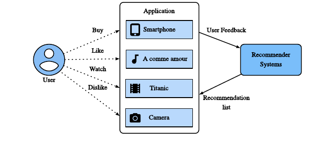

# Recommender Systems

> **Ý chính trong một câu:** một {{term:recommender-system|recommender system}} giúp mỗi người tìm được vài món phù hợp giữa một kho lựa chọn quá lớn, dựa trên dấu vết tương tác, nội dung và hoàn cảnh.

## Mục tiêu học tập

Học xong chương ngắn này, bạn có thể:

- mô tả vòng lặp user → feedback → hệ gợi ý → danh sách đề xuất;
- phân biệt {{term:collaborative-filtering|collaborative filtering}}, content-based và context-based recommendation;
- phân biệt {{term:explicit-feedback|explicit feedback}} với {{term:implicit-feedback|implicit feedback}};
- nhận diện rating prediction, top-$n$, sequential recommendation, CTR prediction và {{term:cold-start|cold-start}};
- giải thích vì sao “đã xem” không đồng nghĩa với “đã thích”.

## Bản đồ chương

```text
quá nhiều items
      ↓
thu thập user-item interactions
      ↓
explicit feedback / implicit feedback
      ↓
CF + content + context
      ↓
rating | ranking top-n | CTR | sequence
      ↓
recommendation → feedback mới → học tiếp
```

## Bức tranh tổng quan

Trên cửa hàng, kho nhạc hay nền tảng video, vấn đề không còn là “có nội dung hay không” mà là “trong hàng triệu lựa chọn, đâu là vài thứ đáng xem với **người này, lúc này**?”. Search cần user chủ động biết mình muốn tìm gì. Recommendation có thể chủ động đưa ra những lựa chọn user chưa từng gõ vào ô tìm kiếm.

Hai phía cùng có lợi:

- user giảm công tìm kiếm và bớt quá tải thông tin;
- nhà cung cấp tăng trải nghiệm, tương tác và doanh thu.

> **Giới hạn cần nhớ:** tối ưu click hay thời gian xem chưa chắc tối ưu lợi ích lâu dài của user. Một hệ gợi ý tốt còn phải xét diversity, fairness, privacy và khả năng giải thích, dù bản PDF chỉ giới thiệu nền tảng kỹ thuật.

<!-- pagebreak -->

## 21.1 Overview of Recommender Systems

Một hệ gợi ý thường làm việc với ba tập thông tin:

| Thành phần | Ví dụ | Câu hỏi |
|---|---|---|
| User | người nghe A | Người này có sở thích gì? |
| Item | bài hát B | Món này có đặc điểm gì? |
| Interaction | A nghe B ba lần | Tương tác nói gì về mức quan tâm? |



**Cách đọc hình:** user mua, thích, xem hoặc không thích các item. Ứng dụng gửi feedback đó vào recommender system. Hệ thống trả lại một danh sách mới; user lại tương tác và tạo dữ liệu mới. Đây là một vòng lặp chứ không phải phép dự đoán làm đúng một lần.

### Ví dụ đồ chơi: bảng user-item

Ta ghi `1` nếu user đã thích item, `0` nếu chưa có tín hiệu:

| User \ Item | Jazz | Rock | Cooking |
|---|---:|---:|---:|
| An | 1 | 1 | 0 |
| Bình | 1 | 1 | 0 |
| Chi | 0 | 1 | 1 |

An và Bình có mẫu tương tác giống nhau. Nếu Bình vừa thích một album mới mà An chưa nghe, album đó là ứng viên hợp lý cho An. Đây là trực giác của “những người có hành vi gần nhau giúp lọc thông tin cho nhau”.

### 21.1.1 Collaborative Filtering

{{term:collaborative-filtering|Collaborative filtering}} (CF) chỉ dùng quan hệ tương tác user-item để dự đoán hoặc xếp hạng. Sách chia CF thành ba nhóm:

1. **Memory-based CF**: tìm hàng xóm giống nhau trực tiếp từ dữ liệu.
   - user-based: tìm user giống user hiện tại;
   - item-based: tìm item thường được tương tác cùng nhau.
2. **Model-based CF**: học parameters từ dữ liệu; {{term:matrix-factorization|matrix factorization}} là ví dụ kinh điển.
3. **Hybrid**: kết hợp nhiều cách.

Memory-based dễ giải thích nhưng khó mở rộng khi bảng tương tác cực lớn và rất thưa. Model-based học các latent factors nhỏ gọn hơn, xử lý sparsity và scale tốt hơn; neural networks có thể làm hàm tương tác linh hoạt hơn.

CF không phải lựa chọn duy nhất:

- **Content-based** dùng nội dung của item/user: thể loại, mô tả, tác giả;
- **Context-based** dùng hoàn cảnh: thời gian, vị trí, thiết bị;
- hệ thực tế thường kết hợp cả interaction, content và context.

> **Bẫy:** “không có tương tác” không nhất thiết là “không thích”. Có thể user chưa từng nhìn thấy item.

<!-- pagebreak -->

### 21.1.2 Explicit Feedback and Implicit Feedback

{{term:explicit-feedback|Explicit feedback}} là phản hồi user chủ động cung cấp: số sao, like/dislike, đánh giá. Tín hiệu khá rõ nhưng ít vì nhiều người không muốn chấm.

{{term:implicit-feedback|Implicit feedback}} được suy ra từ hành vi: click, mua, xem, thời gian dừng, lịch sử duyệt, thậm chí chuyển động chuột. Nó dồi dào nhưng nhiễu.

| Tín hiệu | Ưu điểm | Rủi ro diễn giải |
|---|---|---|
| 5 sao | ý định rõ | ít người chịu chấm |
| click | nhiều và dễ thu | click vì tò mò, không phải thích |
| mua | mạnh | có thể mua làm quà |
| xem hết | thể hiện quan tâm | có thể chỉ vì autoplay |
| không click | dễ ghi nhận | item có thể chưa được thấy |

**Mental model:** explicit feedback giống user “nói”; implicit feedback giống hệ thống “đoán từ hành động”. Đoán thì luôn cần mô hình nhiễu và kiểm chứng.

### 21.1.3 Recommendation Tasks

Sách nêu các bài toán chính:

- **Rating prediction**: dự đoán số sao; output là số.
- {{term:top-n-recommendation|Top-$n$ recommendation}}: xếp hạng và lấy $n$ item đầu; output là danh sách cá nhân hóa.
- **Sequence-aware recommendation**: dùng thứ tự và timestamp; ví dụ sau khóa nhập môn nên gợi ý khóa nào.
- {{term:click-through-rate|Click-through rate prediction}} (CTR): dự đoán xác suất click từ nhiều categorical features.
- {{term:cold-start|Cold-start recommendation}}: gợi ý cho user mới hoặc item mới khi hầu như chưa có interaction.

```python
from dataclasses import dataclass


@dataclass(frozen=True)
class Candidate:
    item_id: str
    score: float


def top_n(candidates: list[Candidate], n: int = 3) -> list[Candidate]:
    """Return the n highest-scoring items; do not mutate the input."""
    return sorted(candidates, key=lambda item: item.score, reverse=True)[:n]
```

**Code convention:** tên hàm/biến theo `snake_case`, có type hints, docstring nói rõ contract, và không sửa input ngoài ý muốn. Score cao hơn chỉ có nghĩa “model xếp cao hơn”, chưa tự động có nghĩa “tốt cho user hơn”.

### 21.1.4 Summary

- Recommender systems biến kho lựa chọn lớn thành danh sách phù hợp theo từng user.
- CF khai thác user-item interactions; content/context bổ sung thông tin khi cần.
- Explicit feedback rõ nhưng hiếm; implicit feedback nhiều nhưng nhiễu.
- Nhiệm vụ có thể là dự đoán rating, top-$n$, sequence, CTR hoặc xử lý cold-start.

## Điểm hay và ý nghĩa

Điểm quan trọng nhất là chương buộc ta tách **dữ liệu quan sát được** khỏi **sở thích thật**. Hệ thống chỉ thấy click, view hay rating; ý định của con người là biến ẩn. Nhận ra khoảng cách này giúp bạn không gắn nhãn tích cực/ngược lại một cách ngây thơ.

## Sau chương này bạn làm được gì?

- Vẽ đúng vòng lặp recommendation của một sản phẩm.
- Chọn kiểu feedback phù hợp cho một bài toán.
- Nói rõ output là score, rating hay ranked list.
- Phát hiện hai rủi ro đầu tiên: sparsity và cold-start.

<!-- pagebreak -->

### 21.1.5 Exercises

#### Bài 1 - Hệ gợi ý ảnh hưởng đời sống thế nào?

Liệt kê ba lần recommendation ảnh hưởng quyết định của bạn hôm nay. Với mỗi lần, ghi input có thể đã được dùng và feedback nào được sinh ra.

<details>
<summary>Gợi ý rồi mới xem lời giải mẫu</summary>

Ví dụ ứng dụng nhạc gợi ý playlist buổi sáng. Input có thể gồm lịch sử nghe, giờ hiện tại và các bài đã skip. Khi nghe hết hoặc bỏ qua bài, ta tạo implicit feedback mới. Không nên kết luận một lần skip là dislike tuyệt đối: có thể user đang bận.
</details>

#### Bài 2 - Đề xuất một recommendation task thú vị

Mô tả user, item, feedback, output và metric cho bài toán của bạn.

<details>
<summary>Gợi ý rồi mới xem lời giải mẫu</summary>

Ví dụ gợi ý bài tập học tiếp: user là người học, item là bài tập, feedback là làm/ bỏ qua/ số lần thử, output là top-5 bài phù hợp. Metric offline có thể là Recall@5; metric học tập nên thêm tỷ lệ hoàn thành và tiến bộ sau một tuần để tránh chỉ tối ưu click.
</details>

#### Bài tập bổ sung - Phân loại tín hiệu

Với “click”, “5 sao”, “mua”, “ẩn nội dung”, hãy phân loại explicit/implicit và nêu ít nhất một nguồn nhiễu.

<details>
<summary>Lời giải</summary>

`5 sao` và `ẩn nội dung` là explicit; click và mua thường là implicit. Click có thể do tò mò, mua có thể là quà, 5 sao có selection bias, còn ẩn có thể do đã xem chứ không phải ghét chủ đề.
</details>

## Thuật ngữ cần nhớ

| English term | Hiểu ngắn gọn |
|---|---|
| Recommender system | hệ thống chọn/xếp item cho từng user |
| Collaborative filtering | học từ mẫu tương tác của nhiều user-item |
| Explicit feedback | phản hồi user chủ động nói ra |
| Implicit feedback | tín hiệu suy ra từ hành vi |
| Cold-start | thiếu lịch sử cho user/item mới |
| Top-$n$ recommendation | trả về $n$ item xếp hạng cao nhất |

## Nguồn và phạm vi

- Nguồn chính: *Dive into Deep Learning*, Chương 21, trang sách 893–896, trang PDF vật lý 933–936.
- Bản PDF này kết thúc Chương 21 sau mục 21.1.5; vở giữ đúng phạm vi đó.
- Figure 21.1.1 được trích trực tiếp từ `didl.pdf`; code và ví dụ bảng là phần giảng giải bổ sung của vở.
